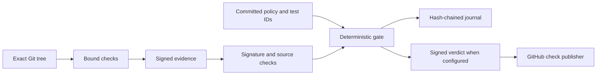

# Ranex

**Let agents write code. Make acceptance verifiable.**

Ranex is an open-source code-validation kernel for AI-assisted development.
It binds test results to an exact Git tree, checks signed evidence against your
acceptance policy, and records a deterministic verdict. No model decides PASS.

**Current release: [`v0.1.006`](https://github.com/anthonykewl20/ranex/releases/tag/v0.1.006) — MIT.**

[Quickstart](#quickstart) · [How it works](#how-it-works) ·
[Architecture](#architecture) · [Proofs](https://ranex.dev/dogfood) ·
[Documentation](docs/OPERATIONS.md) · [Website](https://ranex.dev)

## Why Ranex?

An agent says “done.” CI is green. But did the expected tests actually run,
and do those results belong to the code you are about to merge?

Ranex makes those questions explicit:

| Situation | What Ranex checks |
|---|---|
| Code changed after a passing run | Evidence must match the current source digest. |
| Required tests disappeared or were skipped unexpectedly | Outcomes must satisfy the frozen test-ID manifest. |
| A result was edited or supplied by an untrusted producer | Its signature and producer must pass admission. |
| A required check never ran | Missing evidence blocks the gate. |
| You need to inspect an earlier decision | The journal retains the verdict and its hash chain. |

## When to use it

Use Ranex before accepting an agent’s patch, when defining an enforceable CI
acceptance policy, or when you need a verifiable record of why work passed.
It fits maintainers, release engineers and agent-harness builders who control
the checks and trust roots around their repositories.

**Status:** an early, source-run kernel. The CLI and verification mechanisms
ship today; external-harness delegation is a prototype. It requires operator
setup, and strict-local confinement requires a qualified Linux host.

## Quickstart

Start on Linux with Git, [uv](https://docs.astral.sh/uv/getting-started/installation/)
and CPython 3.11–3.14. Use a source checkout for governed commands.

```sh
git clone https://github.com/anthonykewl20/ranex.git
cd ranex
uv sync --frozen
uv run --frozen ranex --version
uv run --frozen ranex --help
```

For a fixed revision, select a tag from [Releases](https://github.com/anthonykewl20/ranex/releases)
before syncing. Always use `--frozen` so setup preserves the committed lockfile.

### Try a real repository

The included demonstration clones the pinned upstream **Six** repository,
creates a fresh signing identity and runs its actual tests. It needs network
access and `/usr/bin/python3` with pytest installed; on Ubuntu, the latter is
provided by `sudo apt-get install python3-pytest`. No model account is needed.

```sh
uv run --frozen python tools/dogfood/external_proof.py \
  --tag "$(uv run --frozen python tools/dogfood/release.py version)" --keep
```

It checks three outcomes: a passing governed run, rejection after the source
changes without new evidence, and recovery after a fresh run. `--keep` retains
the scratch checkout and JSON receipt at the path printed by the command.
Failures and unavailable prerequisites produce an error, not a fabricated PASS.

## Use it in your repository

The [operator guide](docs/OPERATIONS.md#running-it) covers installation, keys,
public producer identities, dependency approval and host prerequisites.
By default the CLI governs the checkout containing its kernel source. To
govern another checkout without vendoring, add `--external-repository /path/to/repo`
to the core commands; see the [external repository recipe](docs/OPERATIONS.md#governing-an-external-repository).
JUnit evidence supports pytest and an explicit Vitest reporter binding, with
frozen expected test IDs and rejection of missing results.

After you have committed the policy, public keyring and frozen test manifest,
provisioned dependencies and configured the signing key, the core loop is:

```sh
uv run --frozen ranex run \
  --claim tests-executed --producer worker -- uv run pytest -q
uv run --frozen ranex gate evaluate HEAD --approver reviewer_alice
uv run --frozen ranex journal verify
```

These commands use this repository’s command binding and identities. Your
catalog must bind the command you actually run. A fresh clone has no accepted
evidence, so its gate refuses until the prerequisites and observations exist.

For pull requests, the [GitHub App guide](docs/OPERATIONS.md#the-github-acceptance-loop-ranex-github-app)
explains the listener and the `ranex/acceptance` check. The App publishes a
verified verdict produced by the kernel; it does not run the judge itself.

### Freeze executable probe artifacts

`ranex specification freeze-probes` copies complete committed probe roots into
an external A/B-bound bundle. `specification check-probes` checks that bundle
and the candidate against an independently trusted manifest digest, including
file membership, bytes and executable modes. These commands verify artifact
integrity; they do not execute the application or issue a product PASS.
See the [probe bundle recipe](docs/OPERATIONS.md#frozen-executable-probe-bundles).

## How it works

1. **Define acceptance.** Commit required claims, command bindings, trusted
   public keys and the expected test IDs.
2. **Observe a specific tree.** Run the bound checks and produce signed,
   source-bound evidence.
3. **Evaluate.** The kernel admits the evidence and applies the blocking rules.
4. **Keep the decision.** Store the verdict in the journal; optionally publish
   a signed verdict to the GitHub adapter or use the serial task-merge path.



## Architecture

| Layer | Responsibility |
|---|---|
| [CLI](src/ranex/cli) | Operator commands and execution orchestration. |
| [Governed execution](src/ranex/governed_execution) | Admission, gate decisions, task workflows and persistence adapters. |
| [Foundation](src/ranex/foundation) | Canonical bytes, digests, signatures, suite results and dependency primitives. |
| [GitHub adapter](src/ranex/github_app) | Webhook handling and publication of verified verdicts. |
| [Native launcher](native/ranex-worker-launcher) | Host-qualified confinement for strict-local execution. |

The [architecture map](docs/MAP.md) separates implemented capabilities from
proposed work. [ADRs and prior art](docs/adr) explain the design decisions.

## Evidence and limits

Real-repository journeys, failure/recovery runs and stress receipts are retained
in the [audit archive](tools/dogfood/audits). See the [public proof board](https://ranex.dev/dogfood)
and [findings](tools/dogfood/FINDINGS.md) for measured results and their limits.

A PASS establishes that admitted evidence satisfies the configured policy for
that source. It does not establish that worker-controlled tests tell the truth.
Use independently controlled acceptance checks. The manifest freezes test IDs,
not test bodies; JUnit can lose non-strict XPASS information. Detecting journal
rollback requires an independently retained head. See the
[current capability and trust boundaries](docs/OPERATIONS.md#current-capabilities-and-limits).

<details>
<summary>Last recorded dogfood run (may predate the current release)</summary>

<!-- dogfood-status:start -->
**43/43 deterministic proofs pass** · iteration 33 · kernel v0.1.6 (a0624d324944) · last run 2026-09-11T22:01:49Z · open findings: F-040, F-040, F-028, F-025, F-023, F-022, F-018, F-012, F-003

- Live benchmark page: https://ranex.dev/dogfood
- Raw data: `tools/dogfood/site/benchmarks.json` (its sha256 fingerprint is printed on the page)
- Run the proof loop yourself: `uv run --frozen python tools/dogfood/dogfood.py iterate`
<!-- dogfood-status:end -->

</details>

## Releases and contributing

A merged dogfood fix with explicit finding and issue trailers triggers a patch
bump after successful CI: `v0.1.003` → `v0.1.004`. Python metadata uses `0.1.3`
→ `0.1.4`. The built-in GitHub token publishes the commit, tag and GitHub Release
with packages and checksums, then the explicitly dispatched tag CI validates it.
Ordinary reports and commits without fix trailers do not bump the version.
See the [release protocol](tools/dogfood/AUTOFIX.md#automated-versioning-after-successful-fixes).

Reproduce an issue with a real repository and retain the command, revision and
observed result. Read [agent/contributor conduct](AGENTS.md),
[current work](docs/STATE.md) and the [operator/developer guide](docs/OPERATIONS.md).
The required regression command is `uv run --frozen pytest -q`; release evidence
also includes real end-to-end journeys. [Open an issue](https://github.com/anthonykewl20/ranex/issues).

<details>
<summary>Full developer entrypoint: coverage and prerequisite checks</summary>

## The real-e2e suite entrypoint

Run from the checkout on a qualified operator host. Allow 60 minutes; recent
complete qualified-host suites took 33–36 minutes. Named skips remain unverified.
The [detailed guide](docs/OPERATIONS.md#the-real-e2e-suite-entrypoint) explains
prerequisites, coverage wiring and the skip-ledger cross-check.

```sh
set -o pipefail
uv run --frozen python -c "import sys; sys.path.insert(0, 'tests/e2e'); import _prereqs; _prereqs.probe_artifact_home_writable('.local/ranex-e2e')"
mkdir -p .local/ranex-e2e/coverage
rm -f .local/ranex-e2e/coverage/.coverage*
export COVERAGE_PROCESS_START="$PWD/pyproject.toml"
export COVERAGE_FILE="$PWD/.local/ranex-e2e/coverage/.coverage"
PYTHONPATH="src:tests/e2e/coverage" \
  uv run --frozen pytest -q tests/unit tests/integration tests/contract \
    tests/security tests/e2e \
    -o xfail_strict=true -p ranex.foundation.pytest_xpass \
    --junitxml=.local/ranex-e2e/results.xml 2>&1 \
  | tee .local/ranex-e2e/transcript.txt \
&& uv run --frozen python -m coverage combine --keep \
    .local/ranex-e2e/coverage | tee -a .local/ranex-e2e/transcript.txt \
&& uv run --frozen python -m coverage report --include="$PWD/src/ranex/*" \
    | tee .local/ranex-e2e/coverage-report.txt \
&& uv run --frozen python tests/e2e/_prereqs.py cross-check \
    governance/suite_manifest.json .local/ranex-e2e/results.xml \
&& rm -f .local/ranex-e2e/coverage/.coverage*
```

</details>

**Active slice:** [SLICE-087-frozen-executable-probe-bundles](docs/slices/SLICE-087-frozen-executable-probe-bundles.md)

Pytest suite observations and freezes automatically load Ranex's controller
reporter. Explicit non-strict XPASS remains a failure; disabled reporting
refuses evidence. This reporter currently uses the standard observation path;
strict-local runtime carriers refuse pytest suite observation until they carry
this reporting hook. See [ADR-059](docs/adr/ADR-059-controller-pytest-reporting.md).

## Completed slices

- [SLICE-086 — Automatic signed-evidence evaluation](docs/slices/done/SLICE-086-automatic-evidence-evaluation.md): `github listen --evaluate-evidence` judges fresh evidence without executing PR code.

<details>
<summary>Implementation history</summary>

- [SLICE-084-github-webhook-receiver-v1](docs/slices/done/SLICE-084-github-webhook-receiver-v1.md)
- [SLICE-083-github-check-publisher-v1](docs/slices/done/SLICE-083-github-check-publisher-v1.md)
- [SLICE-082-pr-head-binding-v1](docs/slices/done/SLICE-082-pr-head-binding-v1.md)
- [SLICE-081-evidence-envelope-v1](docs/slices/done/SLICE-081-evidence-envelope-v1.md)
- [SLICE-080-authenticated-principals](docs/slices/done/SLICE-080-authenticated-principals.md)
- [SLICE-079-serialized-session-cgroup-mutations](docs/slices/done/SLICE-079-serialized-session-cgroup-mutations.md)
- [SLICE-078-serialized-qualification-cgroup-probe](docs/slices/done/SLICE-078-serialized-qualification-cgroup-probe.md)
- [SLICE-077-operable-strict-local-host-workflow](docs/slices/done/SLICE-077-operable-strict-local-host-workflow.md)
- [SLICE-076-retained-redacted-execution-logs](docs/slices/done/SLICE-076-retained-redacted-execution-logs.md)
- [SLICE-075-installed-operator-cli](docs/slices/done/SLICE-075-installed-operator-cli.md)
- [SLICE-074-kill-safe-command-ownership](docs/slices/done/SLICE-074-kill-safe-command-ownership.md)
- [SLICE-073-provider-neutral-real-world-e2e](docs/slices/done/SLICE-073-provider-neutral-real-world-e2e.md)
- [SLICE-072-digest-bound-dynamic-runtime-closure](docs/slices/done/SLICE-072-digest-bound-dynamic-runtime-closure.md)
- [SLICE-071-approved-batch-qualification](docs/slices/done/SLICE-071-approved-batch-qualification.md)
- [SLICE-070-stable-strict-local-io-namespace](docs/slices/done/SLICE-070-stable-strict-local-io-namespace.md)
- [SLICE-060-gate-evaluate-presentation-dedup](docs/slices/done/SLICE-060-gate-evaluate-presentation-dedup.md)
- [SLICE-059-real-e2e-task-family](docs/slices/done/SLICE-059-real-e2e-task-family.md)
- [SLICE-058-real-e2e-provisioning-family](docs/slices/done/SLICE-058-real-e2e-provisioning-family.md)
- [SLICE-057-real-e2e-execution-family](docs/slices/done/SLICE-057-real-e2e-execution-family.md)
- [SLICE-056-real-e2e-verdict-family](docs/slices/done/SLICE-056-real-e2e-verdict-family.md)
- [SLICE-055-real-e2e-suite-framework](docs/slices/done/SLICE-055-real-e2e-suite-framework.md)
- [SLICE-054-kernel-observability](docs/slices/done/SLICE-054-kernel-observability.md)
- [SLICE-047-confinement-hardening](docs/slices/done/SLICE-047-confinement-hardening.md)
- [SLICE-046-cmd-run-confinement-binding](docs/slices/done/SLICE-046-cmd-run-confinement-binding.md)
- [SLICE-035-real-subject-bootstrap](docs/slices/done/SLICE-035-real-subject-bootstrap.md)
- [SLICE-033-trace-integrity](docs/slices/done/SLICE-033-trace-integrity.md)
- [SLICE-032-approval-and-intersected-grants](docs/slices/done/SLICE-032-approval-and-intersected-grants.md)
- [SLICE-031-closed-dsl-projections](docs/slices/done/SLICE-031-closed-dsl-projections.md)
- [SLICE-030-specification-lifecycle](docs/slices/done/SLICE-030-specification-lifecycle.md)
- [SLICE-029-abc-contract-freeze](docs/slices/done/SLICE-029-abc-contract-freeze.md)
- [SLICE-020-judgment-identity-and-verdict-read-channel](docs/slices/done/SLICE-020-judgment-identity-and-verdict-read-channel.md)
- [SLICE-019-host-qualification-as-gate-evidence](docs/slices/done/SLICE-019-host-qualification-as-gate-evidence.md)
- [SLICE-018-confinement-session-lifecycle](docs/slices/done/SLICE-018-confinement-session-lifecycle.md)
- [SLICE-017-confinement-of-the-bound-command](docs/slices/done/SLICE-017-confinement-of-the-bound-command.md)
- [SLICE-013-reconciler-reorder](docs/slices/done/SLICE-013-reconciler-reorder.md)
- [SLICE-012-provider-watchdog](docs/slices/done/SLICE-012-provider-watchdog.md)
- [SLICE-011-durable-execution-prototype](docs/slices/done/SLICE-011-durable-execution-prototype.md)
- [SLICE-010-the-kernel-merges](docs/slices/done/SLICE-010-the-kernel-merges.md)
- [SLICE-009-a-skip-is-absence](docs/slices/done/SLICE-009-a-skip-is-absence.md)
- [SLICE-008-first-delegation](docs/slices/done/SLICE-008-first-delegation.md)
- [SLICE-007-trimmed-fork-to-the-kernel](docs/slices/done/SLICE-007-trimmed-fork-to-the-kernel.md)
- [SLICE-006-gating-a-real-test-suite](docs/slices/done/SLICE-006-gating-a-real-test-suite.md)
- [SLICE-004-hermetic-observation](docs/slices/done/SLICE-004-hermetic-observation.md)
- [SLICE-003-claim-command-binding](docs/slices/done/SLICE-003-claim-command-binding.md)
- [SLICE-002-evidence-authenticity](docs/slices/done/SLICE-002-evidence-authenticity.md)
- [SLICE-001-evidence-production](docs/slices/done/SLICE-001-evidence-production.md)

</details>

## License

[MIT](LICENSE) © 2026 Anthony Garces.
