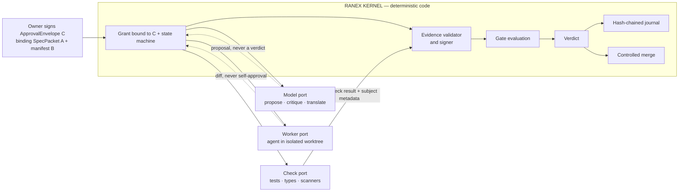
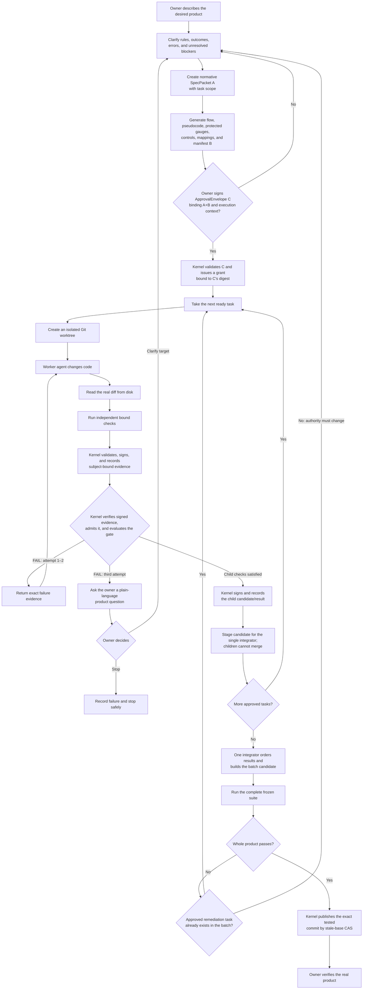

# Ranex

**Deterministic governance for AI agents that build software.**

> Rules an agent can read are suggestions. Rules compiled into code are
> constraints.

Ranex is an open-source governance kernel: Python code that judges software
work by signed evidence and executable checks, not by an AI model's
confidence. An agent may propose; the kernel decides. It can invoke an
external agent harness through the prototype delegation commands, but it does
not contain or install an agent harness. Removing every model credential from
the machine must not change a kernel verdict.

**Current release: [`v0.1.0`](https://github.com/anthonykewl20/ranex/tree/v0.1.0)
— kernel-only, source-run, MIT.** See
[Benchmarks and proofs](#benchmarks-and-proofs) for what that release has
been proven to do — including judging a clean third-party repository and
refusing a stale-evidence attack against it.

[Website](https://ranex.dev) · [Field notes](https://ranex.dev/blog) ·
[YouTube](https://www.youtube.com/@RanexDev) ·
[Benchmarks and proofs](#benchmarks-and-proofs) ·
[Architecture map](docs/MAP.md) · [Current state](docs/STATE.md) ·
[Production acceptance](https://github.com/anthonykewl20/ranex/issues/55)

> [!IMPORTANT]
> v0.1.0 is a kernel-only source release, not a turnkey product. The
> [status section](#status) is the code-backed capability list; sections
> explicitly labeled **target architecture** describe intent, not available
> product behavior. There is still no installed end-to-end approval-driven
> mutation workflow — see the linked production acceptance issue for raw
> outputs and blockers.

---

## The problem

An AI writing software is a blindfolded dart thrower with a guide shouting
coordinates. Two things go wrong, and they are separate problems:

1. **The thrower is blind.** It cannot perceive whether its own dart landed, so
   it reports success either way.
2. **The guide is bad.** The coordinates were wrong or vague before the throw.

There is a third failure, and it is the most common:

> **Most tools let the thrower paint the bullseye around the dart after it
> lands.**

One actor writes the code, writes the test, and declares success. That is why
"all tests pass" from an AI means so little — the target moved to wherever the
dart went.

## What Ranex is today

Ranex v0.1.0 is a source-run governance kernel. It records signed
observations against exact Git trees, evaluates blocking gates, journals the
result, and can publish a separately judged serial task candidate through a
checked compare-and-swap ref update. The kernel never asks a model to decide a
verdict.

The repository also contains prototype adapters that can launch an external
harness and run several such delegations concurrently. Those adapters are not
an installed agent product and do not make the free-prompt fanout path approved
mutation authority.

> Ranex is `make` for a nondeterministic compiler. `make` invokes gcc; nobody
> asks gcc what to build next.

Tools like Replit, Lovable, and Base44 optimize **the throw** — better model,
better prompt, faster loop. Ranex optimizes **the scoring**.

**Ranex does not improve aim.** It makes failed observations visible and binds
reported outcomes to exact source trees. Correctness claims also depend on
the acceptance checks and the independence of their reporters.

### Why this needs to exist at all

A person hiring an architect relies on licensure, liability insurance, building
codes, and inspectors — an accountability apparatus that exists outside the
architect. AI labor has none of that. Ranex is an attempt to build the missing
apparatus: the code, the inspector, and the record.

## Who Ranex is for

- **Owners delegating software work to AI agents.** You pay an agent — any
  harness, any model — to change code. Ranex is the layer that decides what
  "done" means. You hold the signing key; the agent never does.
- **Teams pointing agents at real repositories.** Work happens in isolated
  worktrees; candidates are kernel-judged against bound checks; publication is
  a checked compare-and-swap the worker cannot perform.
- **Release and CI engineers** who need exit-code honesty: a skipped,
  deleted, or vanished test is absence, and absence blocks.
- **Auditors, acquirers, and diligence teams.** Signed evidence pinned to
  exact tree digests plus a hash-chained journal is a record a third party
  can recheck with independently trusted keys and policy. Detecting journal
  rollback also requires an independently retained head.
- **Agent-harness and benchmark builders.** The kernel is provider-neutral
  (delegation launches an opaque adapter with a pinned environment and no
  provider credential), and this repository ships the two-arm false-claim
  benchmark pattern used to measure agent honesty against hidden graders.

It is not yet for someone who wants a hosted, owner-facing product: v0.1.0 is
kernel-only and source-run (see [Status](#status)).

## Use cases

- **Gate your own suite with signed evidence.** "Ranex gates Ranex": this
  repository's own suite runs provisioned, sealed, and offline against a
  materialisation of the exact commit, and the gate judges signed structured
  outcomes against a frozen manifest diff — not the exit code alone.
- **Detect the standard goalpost moves.** Deleted or skipped tests, evidence
  recorded against a tree that then moved, a swapped or cross-bound suite
  manifest — each is a named refusal carrying the offending digest or test ID.
- **Run kernel-judged delegation.** `task dispatch` hands an external agent a
  disposable worktree; `task judge` evaluates the real diff against bound
  checks; `task merge` publishes only through ordered, journalled checks.
- **Govern a third-party repository.** Vendor the kernel, commit the keyring,
  gate catalog, and frozen manifest, and judge that repository's own tests —
  proven end to end on `benjaminp/six` at a pinned commit using the released
  tag (see [External-repository proof](#external-repository-proof--the-released-tag-judging-a-repo-that-is-not-ranex)).
- **Measure agent honesty.** The two-arm benchmark compares an agent whose
  "done" is a self-report against the same agent whose "done" must be signed
  evidence passing a gate — graded in both arms by hidden tests neither arm
  controls.
- **Keep the audit trail.** Every verdict appends to a hash-chained journal
  that `journal verify` rechecks link by link; every evidence record carries
  an Ed25519 signature verifiable against the committed public keyring.

`journal verify --expected-head sha256:<digest>` also checks the chain against
a head retained by an independent operator or service. Keep that head outside
the writer's storage and update it only after reviewing new entries. Without
it, verification proves internal consistency; truncation and a complete
self-consistent rewrite remain undetectable. The command prints
`external-anchor=UNVERIFIED` when no independent head was supplied.

General `run` authenticates a command's observed report. It does not establish
that worker-controlled tests or pytest plugins tell the truth, and unchanged
valid evidence can be evaluated more than once. JUnit loses non-strict XPASS
information in pytest: only XPASS outcomes actually present in the report can
be blocked. Use independently controlled acceptance checks for a correctness
claim; authentic signatures alone cannot establish one.

Fix releases use tags `vMAJOR.MINOR.PPP`: `v0.1.001`, `v0.1.002`, and so on.
Python package metadata uses the equivalent normalized `0.1.1`, `0.1.2`.
`ranex --version` displays the padded release spelling.
The published `v0.1.0` stays unchanged. Dogfood fixes with explicit issue and
finding trailers trigger the release workflow after CI succeeds; see
[the release protocol](tools/dogfood/AUTOFIX.md#automated-versioning-after-successful-fixes).

---

## Target architecture — not the current product

The diagram and workflow in this section describe the intended complete system.
The current code implements only the kernel mechanisms called out in
[Status](#status); it does not implement the owner-facing intake, model roles,
common harness admission, retry/escalation loop, concurrent governed mutation,
or deployment shown here.



### Trust topology

Three ports surround the kernel. None of them produces a verdict; the check port
produces measurements and raw results that trusted kernel infrastructure may
turn into admissible evidence.

- **Model port** — one completion, forced structured output. Intake, review,
  translating machine state into plain language. Stateless.
- **Worker port** — an agent with its own loop and tools, running in an isolated
  git worktree. Returns a diff. Replaceable by design.
- **Check port** — executes the bound checks and returns raw results plus subject
  metadata. The trusted kernel-side controller validates, signs, and records the
  evidence before gate evaluation; the check still does not decide.

Models appear at leaf nodes in exactly three roles, and **none of them can pass
a gate**:

| Role | Produces | Can it decide? |
|---|---|---|
| Proposer | a proposal | never |
| Critic | a finding | never |
| Translator | text | never |

### The chain

```text
idea → clarify → SpecPacket A → generated artifacts + manifest B
                                      │
                                      ▼
               owner signs ApprovalEnvelope C binding A+B
                                      │
                                      ▼
kernel grant bound to C → harness admission → isolated work
                                      │
                                      ▼
                 signed evidence → signed verdict → merge
```

The authority contract has three domain-separated objects:

- **A — SpecPacket and task scope:** normative, human-approved semantics and
  semantic-oracle inputs; it deliberately contains no generated hashes.
- **B — GeneratedArtifactManifest(A):** hashes the exact flow, pseudocode,
  protected gauges, fixtures, checkers, invocations, expected values, baselines,
  controls, and mappings generated or selected for A.
- **C — ApprovalEnvelope:** signs A+B together with the base, policy, generator,
  harness profile, capability request, identity, and anti-replay context. The
  kernel capability grant binds C's digest.

The **canonical SpecPacket A—not its flowchart or prose rendering—is the
normative root.** The complete authority boundary is A+B+C. Changing any bound
semantic, gauge, policy, generator, harness, base, or exemption digest revokes
authority and requires approval again.

### The build loop



Inside one task, the kernel follows a deliberately small loop:

1. Admit an approved bounded task, then create its isolated worktree.
2. Wait for the worker to exit, discard its self-report, and read the actual
   repository diff.
3. Run the bound checks against the exact subject revision; the trusted
   kernel-side controller validates, signs, and records the resulting evidence.
4. Verify and evaluate that evidence using deterministic policy.
5. Stage a passing child candidate for the single integrator—never merge from a
   child—or return concrete failure evidence for a bounded retry and eventual
   owner escalation.

**Ranex never trusts the worker.** It does not need to control what happens
inside the loop, only what is allowed out of it. Containment is a smaller problem
than control: the exits are enumerable, the interior is not.

This is the historical intended governed loop, not the kernel-only initial
release. Bounded read-only research/review jobs may run concurrently because
they cannot mutate files/refs or external state and receive no secrets. Current
`task fanout` is a convenience/prototype over free-prompt JSONL; it has no A/B/C
approval, exact child path+action scope, child-grant intersection or common
harness admission. Production fanout and the harness lane are withdrawn from
the current release; keep one mutation writer for kernel work.

The actual `task fanout` parser accepts a JSONL file whose rows contain exactly
`task_id`, `prompt`, and `worktree`, plus caller-supplied harness, model, timeout,
suite, and pool flags. It repeats `task delegate`; it accepts no A/B/C inputs and
performs no approved-scope or child-grant admission. The separate `task batch
qualify` command does validate A/B/C-bound child inputs, but its output is
qualification-only and is deliberately rejected by both publication paths.

---

## Target owner workflow — not implemented end to end

The following example is a product target. There is no current owner-facing
intake, automatic retry/escalation, integrated A/B/C-to-harness mutation path,
or deployment command.

Maria owns a dog-grooming shop and wants online booking. She cannot read code.

| Phase | What happens | Who decides |
|---|---|---|
| **INTAKE** | She describes it. Ranex asks ~12 non-technical questions: *when someone books, who gets notified? can two people take the same slot?* | — |
| | Ranex records her answers in draft SpecPacket A, then deterministically renders a **draft flow view** — screens as boxes, transitions as arrows, rules as diamonds. She requests changes; Ranex updates draft A and re-renders the view. | **Maria** ⏸ |
| **COMPILE** | The clarified draft becomes normative SpecPacket A. Ranex generates the final flow, covering paths, protected gauges, controls, and mappings whose exact bytes are hashed by manifest B. | — |
| | Maria signs ApprovalEnvelope C, binding A+B plus the base, execution profile, requested capabilities, identity, and anti-replay context. | **Maria** ⏸ |
| **PLAN** | The C-approved batch binds the task DAG, file ownership, interface contracts, capability requests, retries, checks, and maximum pool.<br>*Gate: every scenario maps to ≥1 task; mutation scopes do not overlap.* | kernel admission |
| **BUILD** | N workers, one worktree each, running the loop above.<br>*Gates: tests pass · types check · owns only its files · no new dependencies.* | code |
| **INTEGRATE** | One key-exclusive integrator orders accepted child candidates and constructs the batch tree; workers cannot merge or judge that candidate.<br>*Gate: full suite green; all 34 scenarios pass together.* | independent kernel/check gate |
| **SHIP** | Deploy, smoke test, live URL. She clicks through her own flow graph in a real app. | **Maria** ⏸ |

Human authority stays at the product boundaries: clarify normative A, review the
exact artifacts bound by B, sign approval envelope C, and verify the integrated
product. The visual flow is an important review surface, but editing that view
alone does not grant execution.

When a gate fails three times, she gets a **product** question, not a stack
trace: *"Two customers hit the same slot at the same instant. Tell the second one
immediately, or offer a waitlist?"* That she can answer.

Underneath, invisible to her: every behavior-bearing change traces through
stable rule, transition, outcome, and mapping IDs to the A+B digests bound by C,
with evidence and a verdict pinned to the exact code digest. She will never look
at the ledger. Her acquirer's diligence team will.

---

## What makes a verdict trustworthy

The current evaluator trusts only admitted signed evidence that matches all of
these code-enforced facts:

1. the exact subject-tree digest being judged;
2. the required claim ID and the digest of its catalog-bound argv;
3. a zero command exit, plus matching suite results when the claim requires a
   frozen manifest; and
4. a producer identity different from the `--approver` string.

Missing evidence, stale evidence, command mismatches, observed failures,
unexpected suite outcomes, and contradictory admitted records all block. The
gate catalog, producer keyring, and any required suite manifest are read from
the commit being evaluated.

The code does **not** currently freeze test bodies, authenticate the ordinary
`gate evaluate --approver` identity, enforce red-then-green, or prove that every
approved A outcome maps to a protected gauge in an installed mutation path.
Those remain target-architecture controls, not properties of a current PASS.

## The determinism ledger

| Deterministic | Not, and never will be |
|---|---|
| canonical bytes → content digest | the code an agent writes |
| closed scenario/oracle DSL → generated views and gauges | whether it passes on the first try |
| bound command + exact subject → result | how long it takes, or what it costs |
| admitted evidence + policy → verdict | |
| journal entries → hash-chain verification | |

Every row on the left is a pure function. Nondeterminism is quarantined inside a
single step whose output faces the left column.

**"Deterministic" describes the process and the verdict — never the generated
code.** Anyone claiming an LLM produces identical software twice is selling
something.

## What a current PASS proves

> Every claim required by the selected blocking gate has admitted evidence for
> this exact subject tree and the command digest bound by the committed catalog.
> The command exited zero. If the claim requires suite results, the frozen test
> IDs are present and every non-passing expected ID is an explicitly declared
> skip. The producer ID is not equal to the supplied approver ID.

That is the current code-level claim. It does **not** prove:

- that the tests or gate policy are semantically correct;
- that test bodies were frozen before implementation;
- that an A/B/C approval authorized the mutation;
- that the approver string identifies a real person; or
- anything not represented by a required claim.

## Benchmarks and proofs

Every number in this section comes from committed artifacts regenerated by
tools — nothing here is hand-entered. The canonical live rendering is
<https://ranex.dev/dogfood>; the raw data is
[`tools/dogfood/site/benchmarks.json`](tools/dogfood/site/benchmarks.json),
whose sha256 fingerprint is printed on the page, so a stale or hand-edited
page is visitor-detectable. The [dogfood status](#dogfood-status) block below
carries the current loop snapshot; this section explains what the loop is and
what it has proven.

### The nightly proof board — 43/43 deterministic proofs

The dogfood loop (`uv run --frozen python tools/dogfood/dogfood.py iterate`)
runs 43 fixed scenarios twice per pass; if the two fact records are not
byte-identical the scenario itself is declared NON-DETERMINISTIC and fails —
determinism is enforced, not assumed. Coverage by area: verdict 13, canonical
JSON 6, journal 6, admission 5, provisioning 3, signing 3, suite results 3,
keygen 2, CLI 1, evolution 1. The independent math proofs recompute the
journal chain algebra with plain hashlib over raw SQLite rows, stress Ed25519
signing determinism (128 samples) and digest avalanche/distinctness (8,192
argvs), and check the gate predicates' 8- and 16-row truth tables
exhaustively.

Five findings are open and published rather than hidden
([`tools/dogfood/FINDINGS.md`](tools/dogfood/FINDINGS.md)): F-001
`Journal.verify()` raises instead of returning `False` on non-JSON record
corruption; F-002 the suite outcome split is checkout-environment-dependent,
so frozen `expected_skips` are not location-reproducible; F-003 governing
third-party repos requires a vendored CLI and root-installed test tooling;
F-004 a collection-error junit is refused and journaled as absence rather
than as an observed failure (verdict never wrong; the diagnosis is); F-005
audit follow-ups — the journal chain detects partial edits but not a full
self-consistent rewrite, and a tool-side canonical JSON disagrees with the
kernel's on non-ASCII.

### Corpus-graded trainer — 733 labelled exercises, zero divergences

The trainer (`tools/dogfood/trainer/`) generates exercises from a corpus of
real tasks (VulcanBench, 287 tasks) and grades the kernel against labels
derived from each task's own ground truth — no model, no hand-typed
expectations. Labels are stated before anything runs, and each task is
admitted only after a confinement-equivalent preflight proves its label
sound on that host:

| variant | label (stated before the run) |
|---|---|
| `gold` | gold patch applied → gate MUST PASS |
| `empty` | no patch → gate MUST FAIL (tests are red pre-fix) |
| `delete-tests` | gold + test functions deleted → FAIL naming the missing test IDs |
| `goalpost-move` | evidence recorded, then the tree moves → FAIL: different subject digest |
| `partial-gold` | first hunk of the gold patch only → MUST FAIL |
| `manifest-swap` | uncommitted tampered manifest → `run` REFUSES, gate FAIL |
| `manifest-crossbind` | committed alternate manifest → gate FAIL: manifest digest mismatch |

Clean pass (audited numbers): 104 tasks × 7 variants plus `benjaminp/six` at
a pinned commit via the GitHub source (5/5) — **733 examples: 683 graded
agreements, 50 honest skips, 0 divergences.** The 183 excluded corpus tasks
are classified with reasons, not silently dropped (95 toolchain-unpinned,
15 gold-not-green-here, 10 governance-env-unsupported, 28 junit-refused, 32
diff-graded, 3 cmd-unparseable). Every input-space class a prior audit
measured at zero coverage is now trained at least 66×. The pass ledgers
(`tools/dogfood/training/passes/`) are digest-chained, so the training record
is itself tamper-evident.

### External-repository proof — the released tag judging a repo that is not Ranex

`tools/dogfood/external_proof.py` installs the published `v0.1.0` tag the
supported way, brings it to a clean third-party repository (`benjaminp/six`
@ `c8e39406`, MIT; 185 selected test IDs), proves the vendored `src/` tree
digest equals the tag's own `src/` tree digest, and then — end to end, with
no manual repair:

1. `ranex run` → signed evidence → `gate evaluate` **PASS** → `journal
   verify` **chain=verified**;
2. the attack: one comment line appended to the repository's own source
   after the green evidence, no re-run → the gate refuses, exit 1,
   `evidence bound to a different subject digest`, while the journal still
   verifies; and
3. re-running the work under governance → **PASS** again.

Reproduced twice. Verdicts, exit codes, and refusal reasons are asserted by
the script, never eyeballed; keys are fresh each run, so digests differ while
verdicts reproduce.

### The proof pile — 23 archived entries, with exclusions recorded

The append-only archive in [`tools/dogfood/oss_bench/proofs/`](tools/dogfood/oss_bench/proofs)
records real `zai:glm-5.3` agent runs through the full governed cycle on
real VulcanBench tasks: 23 entries — 19 live-model runs, 1 agentless
external run, and 3 attacks — across 3 dates, 3,410,795 tokens, $7.294714 total
metered cost. Eleven runs have diagnosed harness faults and are excluded
from kernel verdict statistics; nine runs remain after that exclusion.

- **0 false passes in the graded runs.** The gate never verified work that
  failed the hidden tests.
- **0 kernel false blocks after harness-fault exclusion.** Two 2026-09-04
  rows stored `false_block: true` (0017/0018) after a relative `--out`
  made the adapter evaluate this kernel's journal instead of the task;
  several CII/legacy rows bound `pytest pytest pytest` via `argv[3]`.
  Those entries stay in the append-only pile and are classified
  `harness_fault` by `proofs.summary()`, not counted as kernel verdicts.
- **3/3 attacks caught.** Deleted tests — bare CI read GREEN with "6
  passed" while the manifest-bound gate FAILed naming all 9 deleted test
  IDs; stale proof — green evidence plus one edited source line, refused on
  subject digest; and the external stale proof above.
- **Honest failures are recorded too.** On veryhard tasks where the agent
  failed (hidden truth 0.0) and self-reported failure, the gate FAILed and
  the journal verified — no row in the pile claims unearned success.

### Timings

One representative run (kernel commit `f983c964736c`, generated 2026-09-03;
single machine — CPython 3.14.6, Linux x86_64, 16 CPUs — medians of 3
repeats). Timings are deliberately non-deterministic, never enter
correctness records or baselines, and are refreshed by each `report`
regeneration — `benchmarks.json` is canonical:

| operation | median |
|---|---|
| admit 200 signed records (Ed25519 verify each) | 20.2 ms |
| Ed25519-verify 200 evidence payloads | 18.3 ms |
| append 2,000 chained journal rows | 4.55 s (≈2.3 ms/row) |
| verify a 2,000-row journal chain (recompute all links) | 19.3 ms (≈10 µs/row) |
| 100 evaluations of a 20-claim gate | 4.0 ms |
| `ranex --help` cold start (interpreter + imports) | 146 ms |

Both journal operations scale linearly in rows — per-row cost stays roughly
flat from 100 to 2,000 rows (append ≈2.3 ms/row, verify ≈10 µs/row). Full
min/max/repeat data is in `benchmarks.json`.

## Follow the build

- Visit **[ranex.dev](https://ranex.dev)** for the public project home.
- Read the engineering **[field notes](https://ranex.dev/blog)** for decisions,
  experiments, and lessons from building the kernel.
- Subscribe to **[RanexDev on YouTube](https://www.youtube.com/@RanexDev)** for
  demonstrations and project updates.
- Check **[benchmarks and proofs](#benchmarks-and-proofs)** for the measured
  evidence behind the claims — and to re-run it yourself.
- Read **[the architecture map](docs/MAP.md)** for the full system design,
  maturity ledger, risks, and architectural boundaries.
- Read **[the current state](docs/STATE.md)** for the implemented frontier and
  the next governed slice.

---

## Status

**v0.1.0 — kernel-only, source-run.** The public parser in `ranex.cli.main`
currently exposes:

```text
gate evaluate
journal verify
run
suite freeze
deps fetch | approve
keygen
github bind
github check publish
github listen
host launcher-build | launcher-install | host-probe | qualify | launcher-identity | strict-local
task dispatch | judge | merge | delegate | fanout
task batch qualify | verify
specification draft | advance | questions | status | approve
```

Code-backed capabilities:

- deterministic blocking-gate evaluation with exact subject, claim, command,
  exit, optional suite-manifest, contradiction, and producer/approver checks;
- Ed25519 evidence signing and admission against a committed public keyring;
- committed-tree materialisation, dirty-tree refusal, constrained command
  resolution, and evidence recording through `run`;
- a SQLite append API with update/delete triggers, a hash chain, compare-and-swap
  append, and operator verification;
- JUnit-ID manifest freezing with explicit expected-skip declarations;
- pinned dependency derivation, wheel verification/storage, and separate
  dependency-set approval;
- serial task worktree dispatch, candidate judging, and signed-approval merge
  through policy, ancestry, linear-range, evidence, and stale-ref checks;
- prototype external-harness delegation with emission validation, timeout
  process-group kill, independent suite execution, and structured outcome files;
- retained, redacted, digest-bound delegation/fanout logs beside each outcome
  (`<outcome>.logs/`, fanout parent `fanout.logs/`) with bounded
  tail-preserving truncation and an additive canonical `logs` block carrying
  per-stream sha256, truncation markers, and redaction counts (ADR-043);
- prototype bounded free-prompt fanout over that delegation path;
- A/B/C validators, deterministic specification projections, lifecycle,
  approval/revocation/grant, trace, and candidate-verification Python and CLI
  APIs;
- operator-reachable approval signing (`specification approve`) and
  independent read-only rechecking of a completed qualification
  (`task batch verify`), both composing existing kernel functions (#65);
- A/B/C-bound batch qualification in disposable children whose signed output is
  explicitly non-publishable; and
- optional signed verdict-file publication plus an internal verified reader API.

Host-dependent capability:

- `run --confinement strict-local` implements Linux namespace, Landlock,
  seccomp, cgroup, fixed-mount, static-worker, and dynamic-runtime-closure
  paths. It refuses hosts that do not satisfy the qualification contract. It is
  not available on every Linux installation.

**Operating the strict-local host workflow.** The `ranex host` command group
exposes six verbs: `launcher-build`, `launcher-install`, `host-probe`,
`qualify`, `launcher-identity`, and `strict-local`. The launcher lifecycle is
explicit — build, install, qualify (fresh per run), then verify identity
against the manifest pin (`ranex-launcher-v1`). `ranex host strict-local
--version v1|v2|v3 --claim CLAIM --producer PRODUCER -- <command>` runs the
prechecks, prepares and enters the delegated cgroup scope, and runs
strict-local without manual systemd choreography. Each run — success or
refusal — retains a canonical `host-run-report.json`
(`ranex-host-strict-local-run-v1`) plus redacted, bounded logs under the
result dir. The strict-local controller remains same-UID trusted
infrastructure.

**Operating retained delegation logs.** Each `task delegate` run writes
`<outcome>.logs/{harness.stdout.log,harness.stderr.log,suite.stdout.log,suite.stderr.log,manifest.json}`
beside its outcome file; `task fanout` adds a parent transcript under
`<outcome-dir>/fanout.logs/`. Control them with `--log-dir`,
`--log-max-bytes` (default 262144, bounds 4096–8388608), `--log-retention
keep|replace|off` (default `replace`), and repeatable `--redact-env NAME`;
fanout accepts the same flags and forwards them — including each
`--redact-env NAME` — to every child. Verify a log
against its outcome entry with `sha256sum` — the outcome's `logs` block
carries each stream's digest over the retained bytes on disk. A log that
exceeded the bound begins with a `[ranex truncated: …]` marker: the head was
dropped, the tail (including the FINAL failure reason) was preserved.
Secrets matching the redaction grammars appear only as
`[REDACTED:env:NAME]`, `[REDACTED:pem]`, or `[REDACTED:credential]`.
Ranex never deletes logs on its own — retention and cleanup are yours.

**Operating specification approval and batch verification.** The owner
authority lifecycle ends in a signature:
`ranex specification approve --payload approval-payload.json --output approval-envelope.json`
signs the canonical approval payload with the key `RANEX_SIGNING_KEY` names
(mode 0600, outside the repository), writing the envelope exclusively and
printing `APPROVED <output> key_id=<key>`. After a qualification completes,
`ranex task batch verify --spec-packet spec-packet.json --artifact-manifest manifest.json --approval-envelope approval-envelope.json --qualification qualification.json --target /path/to/governed-repo --journal journal.db`
independently rechecks it — A/B/C chain, protected digests, subject
binding, journal continuity, attestation admission — printing the
canonical facts and `PASS ... VERIFIED`, or refusing with `E-BATCH-*` and
exit 1. Verification is read-only and authorizes nothing.

Current limits visible in code:

- the supported operator install is the frozen checkout: `uv sync --frozen`
  builds and installs the `ranex` console script into the checkout venv; a
  wheel installed into an arbitrary venv prints help but refuses governed
  subcommands, because the CLI anchors to the checkout containing it
  (ADR-009);
- this repository contains no installed agent harness, owner-facing intake,
  task board, deployment command, or built-in model provider;
- ordinary `gate evaluate --approver` uses an unauthenticated string; signed
  approver verification exists only in the task-merge approval path;
- `task delegate` records `suite_exit` but returns orchestration success after a
  completed delegation even when that suite exit is nonzero; it does not issue
  a gate verdict;
- free-prompt `task fanout` has no A/B/C or approved child-scope admission;
- dispatch, judge, and merge derive their journal and evidence locations from
  kernel-owned anchors (ADR-041), so the composed dispatch → judge → merge flow
  needs no manual evidence transfer;
- a successful `task merge` into a checked-out branch synchronizes that worktree
  to the candidate (disjoint operator changes preserved) or refuses before the
  ref moves; a sync failure after the ref moves journals an explicit
  non-`PUBLISHED` ABORTED outcome with a repair command (ADR-042), and files
  hidden by skip-worktree/assume-unchanged bits remain undetected by the dirty
  scan;
- delegation/fanout logs are retained, redacted, and digest-bound, but
  redaction is grammar-based (env-grammar literals, forced `--redact-env`
  names, PEM blocks, credential URLs), so a secret outside those grammars can
  survive in a retained log, and nothing deletes logs automatically —
  retention and cleanup are operator-owned;
- batch qualification sets `publication_allowed` to false and both judge and
  merge refuse it before legacy publication writes; `task batch verify`
  rechecks such a qualification read-only but proves the recorded surface,
  not payload semantics, and authorizes nothing;
- `evidence.json` replaces the previous row for the same claim and producer;
  it is not append-only;
- the suite manifest freezes test IDs and allowed skip reasons, not test bodies;
- journal verification detects changed rows and broken links but cannot detect
  replacement by an internally consistent earlier database snapshot;
- the strict-local controller remains same-UID trusted infrastructure and host
  qualification depends on user namespaces and delegated cgroup controllers;
  the `ranex host strict-local` wrapper prepares and enters the delegated
  cgroup scope itself (2026-09-01 acceptance: real v1, v2, and v3 runs all
  passed inside it), closing the 2026-08-29 gap where direct ordinary v1 use
  did not complete successfully;
  and
- there is no installed end-to-end A/B/C-authorized mutation workflow.

## Dogfood status

This repo runs its own proof loop nightly; the block below is rewritten by
the tool from real runs (hand edits inside the markers are overwritten).
What the loop is and what it has proven: [Benchmarks and proofs](#benchmarks-and-proofs).

<!-- dogfood-status:start -->
**43/43 deterministic proofs pass** · iteration 12 · kernel v0.1.0 (688ee9063f15) · last run 2026-09-04T23:00:02Z · open findings: F-005, F-004, F-003, F-002, F-001

- Live benchmark page: https://ranex.dev/dogfood
- Raw data: `tools/dogfood/site/benchmarks.json` (its sha256 fingerprint is printed on the page)
- Run the proof loop yourself: `uv run --frozen python tools/dogfood/dogfood.py iterate`
<!-- dogfood-status:end -->

## Historical implementation record

<!-- Active-slice and completed-slice markers are checked against docs/STATE.md by tests/contract/test_docs_discipline.py. -->

**Active slice:** none

The entries below record prior slices and experiments. They are not the current
capability contract and may describe withdrawn release claims, external harness
work, host-qualified evidence, or behavior later narrowed. Use [Status](#status)
for what the present code exposes.

SLICE-074 (#53) is complete. Destructive real-repository runs first proved that
SIGKILL of the kernel orphaned the governed uv, pytest, nested Ranex, strace,
and compiler tree under PID 1 without evidence. An external guardian now owns
the exact root and a fresh PID namespace, transfers verified PID-1 pidfds behind
an exact start gate, preserves raw exit/signal status, and drains and removes
the root before admission. Nested Ranex uses the guardian's authenticated local
broker to obtain a fresh sibling namespace without attempting a forbidden
nested user namespace. The governed repository reached 1,441 passed / 109
declared skips and froze 1,550 IDs / 154 declarations with `run_exit=0`;
kernel, guardian, and nested-controller SIGKILL arms left no owned process or
root. Simultaneous kernel-plus-guardian death, pre-identity guardian death,
host-`/tmp` interference, and hostile same-UID broker substitution remain
explicit boundaries.

SLICE-071 (#49) is complete. It delivers the retained
SLICE-036 contract after closing the looping #19 as superseded: the explicit
public `ranex run` source-selector/materialisation seam and a separate
kernel-only `task batch qualify` surface in
disposable strict-local worktrees. Distinct signed oracle/control fixtures drive real CLI
refusal proofs; one evidence-v4-signed, journal-linked qualification artifact
is structurally non-publishable and batch-aware judge/merge refuse it before
legacy writes. One clean governed repository/ref spans qualification, dispatch,
judge, and merge refusal. Its deterministic successor commits the owner's real
public key, every signed child input, and the reproducibly built static worker;
flow/task/attempt identity comes from each signed exact repo-relative selector
and its tracked input object, never controller geometry, and each child is canonically built,
installed, and host-qualified in place before strict-local execution. An
external syscall/process observer targets the resolved absolute development
Python controller directly—never `uv`—under pinned `/usr/bin/strace -f
--detach-on=execve -s 8192`, while binding each spawned public `uv`
command/cwd/order. Its binary identity is independently verified. A separate
positive calibration starts every child without a launcher or usable report,
runs the exact public build/install/qualify sequence in that child's cwd with
pool-two concurrent provisioning, then serializes strict-local sessions in the
signed A/B/C or B/A/C completion order. It proves maximum active provisioning
two and maximum active sessions one and verifies final launcher/report hashes
and qualified host state. This release
uses the existing dependency derivation/approval gate before that observer
self-test and distinguishes its canonical host-drift result from the still-RED
actual batch success assertion. This release
does not claim exhaustive transient-copy or Linux-write-syscall absence;
replacement followed by independent qualification is sufficient.
Application-emitted provisioning booleans are not trusted. The
actual qualification is admitted through equal immutable base/candidate/tip
keyring bytes. Staged development code remains outside the governed checkout
and is loaded through an absolute, independently manifest-hashed `PYTHONPATH`. Legacy
`task fanout` and unflagged publication remain unchanged; it does not reopen the
withdrawn harness, broker, task-family, or production-exit work.

SLICE-059 (task family e2e, #39) was implemented as historical test work and
closed in its prior ceremony, but is withdrawn from the release as of
2026-08-25. It is not a completed real-provider release gate: the ADR-032
frame's fourth family customer remained below the owner's final acceptance bar.
The historical artifact covered the real dispatch→work→`run`→judge lifecycle over a real
disposable worktree (DISPATCHED/RECORDED/CANDIDATE goldens), the
engineered refusals on real evidence (tampered judge evidence refused
naming its claim; self-approval refused `sad-path-14`; moved base
`sad-path-9 tip-mismatch`; digest mismatch `sad-path-5
subject-digest-mismatch`), the clean PUBLISHED merge through the five
ordered journalled checks, worktree-residue detection, and the real
delegated OpenRouter model run (CCR-2's store-read credential +
CCR-3's seeded GitHub-tool deny; red-at-base note test green only via
the model's work, CANDIDATE naming `tests-executed`, no PASS
anywhere). Three goldens captured from the real journeys
(sha256 dbe923e7…/f7ff1f74…/cac49c48…); the byte-exact re-run clause's
free-model nondeterminism is a written owner risk-acceptance (DECISION
on #39, issuecomment-5359345600; zero frozen-test changes; shape-golden
CCR-4 text drafted for any future owner). Ceremony 56c445a1f: FROZEN
tests=1397 expected_skips=136, sealed 1262/135/0, round-trip 6/6;
  fail_under re-derived 16.68 → 14. The fanout qualification arm remains
  withdrawn from the kernel-only release.

SLICE-060 (gate-evaluate presentation dedup, #40) closed 2026-08-20 —
a mixed stale+absent verdict no longer prints the absence sentence
twice: `gate evaluate`'s FAIL block removes the recorded reason's
final absence clause by anchored suffix comparison against exactly the
sentence its own partition printed, and steps aside entirely — full
reason verbatim, duplicate and all — whenever a missing claim ID
contains "; " (qa-gate round 1's confirmed blocker: a split-based
dedup truncated adversarially named claim IDs). The recorded reason
bytes are untouched (ADR-020's invariant). Five frozen arms, two
red→green; ceremonies at 7c99838fa/8cda414af (FROZEN tests=1383,
expected_skips=134, sealed green); full suite 1365/18/0; two
non-author APPROVEs, round-2 adversarial fuzz 789,672 cases with zero
loss-of-information violations.

SLICE-058 (provisioning family e2e, #38) closed 2026-08-20 — the
ADR-032 frame's third family customer: the real deps journey (a real
clone keeping its committed `governance/deps.yaml`, the pinned resolver
re-deriving the committed lock byte-exactly over the real index, a
content-addressed wheel store re-hashed entry-by-entry by `sha256sum`,
approve/third-fetch bookkeeping, env-injection ignored) and the real
keygen journey (the kernel signs and accepts the keygen key; openssl —
OpenSSL 3.0.13 — verifies independently both directions over
PKCS#8/SPKI DER) — two goldens captured from the real journeys, the
sabotage controls (wheel byte-flip quarantine + one-wheel repair,
lying/dead local index, lock drift and epoch-block refusals), and the
ruled sealed-netns fallback for the loopback fixture. Registered
through the standing ceremony at 81d63d495: 1378 IDs / 134
declarations, sealed run_exit=0.

SLICE-057 (execution family e2e, #37) closed 2026-08-20 — the ADR-032
frame's second family customer: three real-journey test files (real
`run` producing signed, subject-digest-bound evidence with openssl's
independent re-check; real launcher build/install/qualify and confined
spawns whose kill/drain the kernel validates over a drained teardown;
the real hermetic suite-freeze round-trip) compared byte-exactly
against three goldens captured from the real journeys through the
frame's one normalizer. The journey forced three never-executed-code
kernel fixes, each an orchestrator-ruled allowlist/re-pin amendment on
#37 (session enrollment drain; the sleep family; the process-creation
family with its recorded nr-only-clone residual — the security review
gates the range before push). The confinement family's strict-local
arms are proven in the delegated scope (`systemd-run --user --scope
-p Delegate=yes`, 7/7) and skip with the live probe reason in a plain
session — the ceremony froze exactly those five declarations.
Ceremony: manifest 1363 IDs (+18) / 124 expected skips (+5), sealed
run 1260 passed / 103 skipped / run_exit=0. Full suite at close:
1345 passed / 18 skipped / 0 failed.
SLICE-056 (verdict family e2e, #36) closed 2026-08-20 — the ADR-032
frame's first family customer: two real-journey test files (gate
evaluate on a real clone with real keygen/run/openssl-verified
evidence; journal verify clean, byte-tampered with the CLI naming the
chain-breaking row, and rolled back) whose transcripts compare
byte-exactly against four goldens captured from the real runs through
the frame's one normalizer. The suite-freeze ceremony registered the
eight family IDs (manifest 1345 IDs / 119 expected skips) and resolved
the pre-registered hermetic UNKNOWN hermetic-green: sealed run 1227
passed / 118 skipped / run_exit=0 — every family arm runs identically
inside the sealed environment. Full suite at close: 1305 passed / 40
skipped / 0 failed. The carried follow-up — the ADR-032 fold-in of
the characterized truncation blind spot — landed at 8a5ed3837; the
register's open item is now the mirror-pin test for
`_journal_first_broken_row`.
The milestone-4 real-e2e frame is closed beneath it (2026-08-19):
honest prereq probes, the two-tier declared-skip cross-check,
subprocess coverage, and the documented entrypoint (rc 0, coverage
16.70% ≥ fail-under 15). All six kernel P0 spec-authority slices
(SLICE-029/030/031/032/033/035) are landed on kernel `main` at
`ff3ab802`: A/B/C contract freeze, lifecycle, closed-DSL projections,
approval/revocation/intersected grants, trace integrity, and
real-subject bootstrap. The byte-identical A/B/C schema/vector
TypeScript mirror (35/35; vectors SHA-256 `9efa0baf…`) is merged in
`ranex-harness` `ranex-trim` at `16bf036f`. The execution family
followed and closed (SLICE-057, #37, 2026-08-20 — below), then the
provisioning family (SLICE-058, #38, 2026-08-20 — below). The task-family
entry (SLICE-059, #39) is retained as historical implementation evidence but
was withdrawn from release scope; milestone 4 is closed with partial delivery.

Two of ADR-015's five durability claims are now in production: the provider
watchdog; and the reconciler reorder plus its startup sweep. Three remain —
durable retry, durable blockers, and Session-ID fencing — each gated by the
SLICE-011 prototype record through a compiled test. The remaining durability
sequence is parked/subordinate to P0. ADR-006 is split into closed issue #10 /
SLICE-017 qualification, closed issue #21 / SLICE-018 lifecycle, and closed
issue #22 / SLICE-019 host-qualification evidence, and SLICE-046's `cmd_run`
confinement binding — ADR-006 is accepted and `RISK-06` is closed (the
controller subprocess remains same-uid trusted; ADR-023). ADR-017 is
`accepted`; SLICE-029..033 and SLICE-035 built the kernel-side authority
  substrate. SLICE-072 is the sole open slice; SLICE-071 completed the retained
  qualification-only SLICE-036 scope with publication still structurally
  refused. The
  harness-effect and production-exit slices were withdrawn.

**Durability is no longer only a design.** The provider watchdog shipped to the
harness (`23d6a5b4ee`): a stalled provider stream now reaches a terminal state
on its own, where before it hung forever and reported the session busy until
someone intervened by hand. Three of ADR-015's five claims remain unbuilt in
production, and each is gated by the SLICE-011 prototype record — a compiled
test refuses a durability production slice if that record is missing, not
green, or not digest-bound. The work happens in `anthonykewl20/ranex-harness`,
milestone #1.

**Ranex gates Ranex.** With SLICE-009 closed, `ranex run` executes this
repository's own suite — provisioned, sealed and offline — against a
materialisation of the real current commit, and `gate evaluate` judges signed
structured outcomes against the manifest diff — 1267 IDs, with 116
ceremony-declared expected-skips — not the exit code alone. The materialisation
is a fresh single-commit repository carrying the verified tree (ADR-009), so a
committed suite that asks git about itself is told the truth, while the sample
shares nothing with the governed object store.

Ranex observes a **materialisation of the subject commit**, built from bytes
checked against the object ids the commit's tree carries, with an environment
constructed from empty and a toolchain pinned to directories the observed party
cannot write. The six frozen false-PASS paths were two root causes, not six: the
tree observed was not the tree HEAD names, and the toolchain and its inputs were
chosen by the party being measured. Both are closed.

## Completed slices
- SLICE-084-github-webhook-receiver-v1 (#80, ADR-051): the repo's first long-running listener, bounded on purpose — stdlib `http.server` on localhost (TLS is the terminator's job), one endpoint, one delivery at a time, 1 MiB body cap; every delivery proves its `X-Hub-Signature-256` HMAC (GitHub's own published test vector pinned) before a byte is parsed, replays are no-ops, allowlist and closed event grammar journal what they decline; pipeline = fetch → bind → resolve → publish, fetch failure answers 5xx for redelivery; README carries the App creation and ruleset recipes (`ranex/acceptance` pinned to the Ranex App via `integration_id`); kernel unmoved, sealed green at 1795/166
- SLICE-083-github-check-publisher-v1 (#79, ADR-050): the `ranex/acceptance` check, published by the Ranex GitHub App on the exact PR head — RS256 JWT on the pinned `cryptography` primitive (minted only; GitHub verifies), installation tokens exchanged and cached, stdlib transport, no new dependency; the conclusion mapping is fail-closed (`success` only from a VERIFIED+PASS record; FAIL → `failure`; absent → `action_required`; rejected → `failure` naming the reader state; API error → `E-GITHUB-API-REFUSED`, one POST, no silent retry), and the arms grep every emitted line for the key, token and webhook secret. `github check publish` one-shot; kernel unmoved, sealed green at 1774/166
- SLICE-082-pr-head-binding-v1 (#78, ADR-049): a pull-request head SHA, resolved through the local git object store, derives the exact subject every signed verdict already names — the same tree digest, byte for byte — or refuses (`E-GITHUB-BAD-SHA` / `E-GITHUB-UNFETCHABLE-HEAD` / `E-GITHUB-HEAD-MOVED`); `resolve_acceptance` maps every verdict-reader state to a closed outward outcome where only `VERIFIED` is publishable, absence is named as absence, and every rejection names its state. First slice of the GitHub acceptance loop (`github bind`, pure derivation, no network); kernel unmoved, sealed green at 1754/166
- SLICE-081-evidence-envelope-v1 (#77, ADR-048): evidence binds the rulebook it was produced under — domain v4 to v5, `envelope_type`/`gate_id`/`catalog_digest` inside the exact signed set — so editing `governance/gates.yaml` after a green run no longer lets that run's evidence satisfy rules it never saw; refused as `policy-context-mismatch`, never as forgery and never as absence. The frozen approved-batch fixture set, sealed with a key absent from this repository and hard-coding the v4 shape, was re-keyed to unblock it. Kernel unmoved, sealed green at 1730/166
- SLICE-080-authenticated-principals (#76, ADR-047): the committed trust root gained an additive `principals:` block — identity, one role, and rotating keys with active/retired status — so an approver can later be proved by signature instead of by a typed name; one key may serve only one principal, a retired key attributes past work and authorises none, and the two blocks may not disagree about who owns a key; kernel unmoved, sealed green at 1715/166
- SLICE-079-serialized-session-cgroup-mutations (#74, ADR-046 addendum): the session path's worker-cgroup create and controller-leaf release acquire the host-probe lock at the call sites; frozen red proved the unserialized session, sealed green at 1655/166
- SLICE-078-serialized-qualification-cgroup-probe (#73, ADR-046): every qualification cgroup probe serialized under the host-probe lock; pool=2 delegated-scope batch qualification green

This list mirrors the archived slice filenames. A completed slice is historical
implementation evidence, not an assertion that its behavior is a supported
current release feature; withdrawn and prototype boundaries are governed by the
code-backed [Status](#status) section above.

- **SLICE-077-operable-strict-local-host-workflow** — completed 2026-09-01.
  The public `ranex host` group now exposes six verbs (`launcher-build`,
  `launcher-install`, `host-probe`, `qualify`, `launcher-identity`,
  `strict-local`); `ranex host strict-local --version v1|v2|v3` runs the
  prechecks, enters the delegated cgroup scope, and runs strict-local without
  manual systemd choreography, retaining a canonical
  `ranex-host-strict-local-run-v1` report plus redacted bounded logs for
  success and refusal alike (ADR-044). The suite re-froze at 1,675 IDs /
  162 declarations; two sealed ceremonies passed 1,558 / skipped 117.
  Real-host acceptance: 5/5 formal arms, including real v1/v2/v3 confined
  runs, prereq-failure correctives, and cross-scope drift refusal
  (E-C18-HOST-DRIFT, exit 2).
- **SLICE-076-retained-redacted-execution-logs** — completed 2026-09-01.
  Delegation/fanout runs now retain redacted, bounded, digest-bound
  per-stream logs beside each outcome (ADR-043): `--log-dir`,
  `--log-max-bytes` (default 262144, bounds 4096–8388608), `--log-retention
  keep|replace|off`, repeatable `--redact-env`; outcomes gain an additive
  canonical `logs` block (per-stream sha256 over retained bytes,
  tail-preserving truncation marker that keeps the FINAL failure reason,
  redaction counts, never secret bytes), with no auto-deletion. The suite
  re-froze at 1,619 IDs / 157 declarations; the final governed run passed
  1,588 / skipped 29. Real-host acceptance included a live
  secret-injection redaction challenge with zero marker leakage.
- **SLICE-075-installed-operator-cli** — completed 2026-08-29. The frozen
  checkout install (`uv sync --frozen`) builds the `ranex` console script and
  a real keygen→run→gate workflow was verified through the installed command
  from outside the checkout. Hatchling now builds under the frozen epoch —
  never a bare `uv lock`, always `--exclude-newer`, contract-tested — and the
  wheel is verified as the shippable artifact while governed subcommands
  anchor to the CLI's own checkout (ADR-009). The frozen catalog re-froze at
  1,555 IDs / 157 declarations; full suite 1,526 passed / 29 skipped.
- **SLICE-074-kill-safe-command-ownership** — completed 2026-08-29.
  An external guardian now owns each exact scratch root and fresh PID namespace,
  while a namespace-authenticated broker gives real nested Ranex workflows fresh
  sibling namespaces. Destructive kernel, guardian, and nested-controller runs
  proved drain and cleanup; the frozen catalog contains 1,550 IDs / 154
  declarations and the final governed run passed 1,441 / skipped 109.
- **SLICE-073-provider-neutral-real-world-e2e** — completed 2026-08-28.
  Delegation now launches an opaque executable adapter with a minimal pinned
  environment and no OpenRouter or other provider credential requirement.
  Real pinned Ranex Git red/green journeys, disposable suite freeze,
  fail-closed historical-host qualification, and repeated fanout/policy/journal
  stress validate portability across outer agent hosts. The final frozen
  catalog contains 1,532 IDs / 150 declarations; the canonical run completed
  1,503 passed / 29 declared skips with 72% canonical source coverage.
- **SLICE-072-digest-bound-dynamic-runtime-closure** — completed 2026-08-28.
  Additive strict-local v3 admits a canonical captured-commit runtime closure,
  seals and rehashes every source file, constructs one private per-file-mounted
  tmpfs snapshot, and requires pinned pyelftools closure to agree with a
  confined held-loader probe before GO. Qualified-host tests cover Python,
  native extensions, runtime data, direct loading, noexec authorities,
  tampering, deterministic results, and signed evidence without changing v1 or
  static-v2 behavior.
- **SLICE-071-approved-batch-qualification** — completed 2026-08-26.
  Exact signed-base source selectors materialize held v2 input/toolchain
  objects; protected A/B/C rows qualify in both approved completion orders
  with C joining after A/B, maximum provisioning two, and one strict-local
  session at a time. One atomic journal row binds a signed evidence-v4 outcome
  whose publication flag is permanently false; batch-aware judge and merge
  verify it and refuse before legacy writes. Issue #49 replaces superseded #19.
- **SLICE-070-stable-strict-local-io-namespace** — completed and published
  2026-08-26. Additive strict-local v2 constructs a private root from
  held source objects with recursive read-only input/toolchain, bounded writable
  output/scratch, and read-only/no-exec subject mounts at fixed `/ranex/*`
  aliases. The qualified v2 journey and delegated legacy v1 regressions pass;
  dynamic runtime closure was delivered by SLICE-072.
- **SLICE-059-real-e2e-task-family** — historical implementation closed
  2026-08-21, withdrawn from the release on 2026-08-25. It is retained here
  as an implemented test artifact, not claimed as completed real-provider
  release proof. The ADR-032 frame's fourth family customer covered the governed task
  lifecycle (dispatch → the kernel's own `run` producing real evidence
  → judge) proven on a real disposable worktree with two goldens, the
  engineered merge refusals (self-approval, moved base, digest
  mismatch — stable named reasons) plus the tampered-evidence refusal
  proven against the clean journey's green, the clean PUBLISHED merge
  through the ordered journalled checks, worktree-residue detection,
  and a real delegated OpenRouter model run whose kernel-recorded
  suite proves execution (red-at-base green only via the model's
  work). The free model's note-line nondeterminism is a written owner
  risk-acceptance (DECISION on #39); +14 suite IDs through the
  standing ceremony (tests=1397, expected_skips=136, sealed green).
- **SLICE-060-gate-evaluate-presentation-dedup** — closed 2026-08-20.
  A mixed stale+absent verdict printed the absence sentence twice; the
  FAIL block now dedups by anchored suffix comparison against the exact
  partition sentence, disabled whenever a missing claim ID contains
  "; " so the printed diagnosis can repeat but never truncate. Reason
  bytes untouched; five frozen arms; +5 suite IDs through two standing
  ceremonies (tests=1383, sealed green).
- **SLICE-058-real-e2e-provisioning-family** — closed 2026-08-20. The
  ADR-032 frame's third family customer: the deps family (the real
  pinned-inputs fetch reproducing the committed lock byte-exactly and
  freezing its FETCHED transcript against a golden captured from the
  real journey; every wheel-store entry re-hashed by `sha256sum` to its
  own content address; second-fetch reuse, `deps approve`, third-fetch
  consistency; hostile `UV_*`/`PIP_*` injection ignored at an identical
  depset; the wheel byte-flip admission refusal with quarantine and the
  one-wheel repair fetch; lock-drift and missing-epoch-block refusals;
  the ADR-032 sad-path-12 local-index fixture — lying and dead loopback
  sources refuse, with the owner-ruled sealed-netns lo-raise/loopback-
  probe fallback) and the keygen family (the kernel signs and accepts
  the keygen key; openssl independently verifies both directions, the
  tampered-message refusal as the discriminating negative; key-material
  confinement gates). Registered through the standing freeze ceremony:
  1378 suite IDs, 134 declarations, sealed run green.
- **SLICE-057-real-e2e-execution-family** — closed 2026-08-20. The
  ADR-032 frame's second family customer: the run family (real signed
  evidence, stdlib subject-digest recompute, openssl Ed25519
  verification, both post-run sabotage refusals, the traced-run
  artifact with verdict neutrality), the confinement family (two-root
  launcher reproducibility, real build/install/qualify, confined
  spawn binding both confinement digests, the shell-descendant
  containment contract — shell-constructed descendants die with the
  three construction layers pinned to their call sites, the real
  kill/drain proof living in the timeout arm — and timeout-vs-exit
  distinct reporting), and the freeze
  family (byte-stable manifest round-trip, dirty-tree and hand-edit
  refusals) — three goldens captured from the real journeys through
  the one normalizer. The journey forced three never-executed-code
  kernel fixes through orchestrator-ruled amendments (enrollment
  drain, sleep family, process-creation family; nr-only-clone
  residual recorded for the security review gating the range).
  Strict-local arms proven in the delegated scope (7/7); plain
  sessions skip with the live probe reason. Registered through the
  ceremony: 1363 IDs / 124 expected skips, sealed run 1260/103/
  run_exit=0.
- **SLICE-056-real-e2e-verdict-family** — closed 2026-08-20. The
  ADR-032 frame's first family customer: gate-evaluate and
  journal-verify journeys over a real clone with real keygen/run
  evidence and openssl's independent Ed25519 re-check; four goldens
  captured from the real runs through the one normalizer (sabotage
  control and fixpoint contracts refuse hand-sanitized bytes);
  journal-verify FAIL names the chain-breaking row; the
  rollback/truncation blind spot characterized as the documented
  outcome. Registered through the suite-freeze ceremony (1345 IDs /
  119 expected skips), which also proved the family hermetic-green —
  every arm runs identically inside the sealed environment. The
  carried follow-up — the ADR-032 fold-in of the truncation blind
  spot — landed at 8a5ed3837 as a disclosed kernel limit.
- **SLICE-055-real-e2e-suite-framework** — closed 2026-08-19. The ADR-032
  frame: six honest prereq probes, the golden-transcript normalizer, the
  two-tier declared-skip cross-check (probe-backed hard / context
  informational), subprocess coverage with loud wired-child no-data
  detection, and one README-documented entrypoint whose captured run is
  milestone 4's proof artifact. Adversarial reviews remediated through
  arbitration (two-grammar scheme, R1d hard-tier scoping); the sanctioned
  amendment chain and the follow-ups register are recorded in the slice
  file.
- **SLICE-054-kernel-observability** — closed 2026-08-18. The ADR-031
  substrate landed: default-off `RANEX_TRACE`/`RANEX_TRACE_EVENT` JSONL
  emitter with a frozen schema, SID chaining, ambient strip at the stage
  boundaries, and the confinement-session controller seam — proven
  verdict-neutral, off-state overhead measured (~1.3-1.6 ms cumulative
  import, ~84-114 ns per disabled emission). Two adversarial review rounds
  remediated (dual security + test-layer, then final-gate cumulative;
  findings D1-D5/S1-S5a and N1-N6 all closed, records on #34). Known
  residual: the host-gated strict-local confinement e2e arm (SID tree
  through a real controller) is skip-declared pending a delegated cgroup-v2
  host; in-process seams are green.
- **SLICE-032-approval-and-intersected-grants** — closed 2026-08-17,
  kernel-side. Approval binds closed policy and lifecycle facts; revocation,
  expiry, canonical use facts, and deterministic least-authority child grants
  refuse authority expansion. CAS/persistence and the SpecificationEvent
  atomicity contract remain the retained SLICE-036 kernel-continuity scope.
- **SLICE-035-real-subject-bootstrap** — closed 2026-08-17, kernel-side. Real
  Ranex source bootstrap ran from its pinned subject; Arxic's reference-auth-app
  process gate remains BLOCKED at pinned `135991d9` (Arxic #109).
- **SLICE-033-trace-integrity** — closed 2026-08-17, kernel-side. Independent
  trace coverage binds changed source symbols to exact current generated
  comment/sidecar references and separately verifies protected outcomes;
  generator interoperation covers Python, TypeScript, and JavaScript.
- **SLICE-031-closed-dsl-projections** — closed 2026-08-17, kernel-side.
  Closed scenario DSL parsing emits deterministic gauges, views, trace/sidecar
  bytes, and an A-bound protected-artifact manifest; source coverage and trace
  verification remain later work.
- **SLICE-030-specification-lifecycle** — closed 2026-08-17, kernel-side.
  Deterministic lifecycle transitions, clarification questions, durable retry,
  and CLI status/advance paths are merged locally; lifecycle-fact wiring and
  nonce tracking remain SLICE-032 follow-ups.
- **SLICE-029-abc-contract-freeze** — closed 2026-08-17. A/B/C schemas,
  canonical forms, registry precedence, vectors, and frozen suite IDs are
  complete; the byte-identical TypeScript mirror merged to `ranex-trim` at
  `16bf036f`, closing #12.
- **SLICE-047-confinement-hardening** — closed 2026-08-15. The confinement-result validator is shared by producer and signer; the controller gets an explicit four-variable environment, and timeout/reap failures refuse without evidence (ADR-024).
- **SLICE-046-cmd-run-confinement-binding** — closed 2026-08-15. `cmd_run` runs the bound command inside the qualified strict-local session (ADR-023), and evidence is signed only after fail-closed confinement-result validation; ADR-006 is accepted, RISK-06 is closed, and ADR-017 is accepted without broadening.

- **SLICE-018-confinement-session-lifecycle** — closed 2026-08-14. The native
  launcher ENFORCES NNP, strict full-mask Landlock, default-deny seccomp, and
  `execveat` behind a closed worker-exec path. Its capability-gated session
  performs cgroup-v2 enrollment/readback before release, readiness witnessing,
  kill/drain/remove teardown, and bounded `openat2` collection into an unsigned
  confinement result. ADR-006 remains proposed and RISK-06 remains open; only
  SLICE-019 may close them.

- **SLICE-020-judgment-identity-and-verdict-read-channel** — closed 2026-08-13.
  Evaluation records now carry structured five-kind causes and self-approval;
  projection composes refused and unattributable rejections. Dedicated verdict
  signing, validated atomic publication, and a total closed-state reader provide
  the kernel-owned channel consumed by later UI/board work.

- **SLICE-019-host-qualification-as-gate-evidence** — closed 2026-08-13. The
  landing gate now consumes host qualification as signed, subject-bound evidence
  under the existing `EVIDENCE_DOMAIN`; admission deeply validates the closed
  report and re-reads durable boot, machine, LSM, userns-sysctl and parent-
  namespace uid/gid anchors, refusing absent, stale, mismatched, ambiguous or
  self-approved evidence. Qualification runs as a host operation through
  `cmd_run`, while the kernel remains byte-exact. The real-operator e2e is
  honestly guarded and skips without delegated cgroup controllers; `cmd_run`
  confinement and RISK-06 remain open.

- **SLICE-017-confinement-of-the-bound-command** — closed 2026-08-12. Its 47
  qualification gates qualified the strict-local host and byte-reproducible GNU
  C17 native launcher, binding LSM state, user-namespace sysctls, boot ID,
  machine ID and delegation identity. ADR-006 and RISK-06 remain open for
  SLICE-018/019; `cmd_run` integration is explicitly deferred to SLICE-019.

- **SLICE-013-reconciler-reorder** — closed 2026-08-08, all seven criteria met,
  landed in `anthonykewl20/ranex-harness` (`a8bc7bdf35`). A crash with an empty
  inbox left tools projected `running` forever: the runner returned on its
  eligible-input guard before it reconciled, and nothing else looked. The hoist
  fixes the `run()` path; a startup sweep wired into the application graph
  recovers sessions nobody calls `run()` on — the half the prototype had left as
  a capability with no caller.

  Two things make it worth reading. Its concurrency test only works because
  `Effect.all` defaults to *sequential* in this Effect beta; without an explicit
  `concurrency: 2` it would have passed against the unfixed code and proven
  nothing. And the slice introduced a hazard rather than only removing one — the
  sweep is database-global, so a second process booting marks a first process's
  running tools as interrupted. That is accepted scope, not an oversight, and it
  is recorded in the code and the spec as a prerequisite on the fencing slice.

- **SLICE-012-provider-watchdog** — closed 2026-08-07, all nine criteria met,
  landed in `anthonykewl20/ranex-harness` (`23d6a5b4ee`). Two timeouts, each
  provable without the other: an idle deadline that resets on every chunk, and
  an absolute whole-turn budget. Both fail as a typed **non-retryable** error —
  load-bearing, because a retryable one would fire, be retried, restart the same
  stall and hang anyway while every criterion still passed.

  Idle deliberately does not cover time-to-first-token. Inter-chunk gaps run
  ~10-100ms while a reasoning model can take minutes to its first token, and one
  number cannot serve both distributions — so the first pull runs untimed. The
  consequence is written down rather than hidden: a provider that connects and
  then never sends is bounded only by the absolute budget.

  Two defects were found by building it. A watchdog failure is an error, not an
  interrupt, so tool fibers dispatched during streaming were never cleared and
  the settlement await held the turn open forever. And a pre-implementation
  review caught that nothing required the timeout to be non-retryable — the
  prototype had avoided that by accident, not by decision.

- **SLICE-011-durable-execution-prototype** — closed 2026-08-07, all nine done
  criteria met. Five durability claims (watchdog, reconciler reorder, durable
  retry, durable blockers, Session-ID fencing) proven red-to-green with
  negative controls, one disposable harness worktree each, consolidated into a
  digest-bound record now archived beside the slice. It ships nothing: the
  prototype is disposable by design and production integration is SLICE-012+.

  Two results are worth reading. Every gate was re-run against the worktree on
  disk rather than read from the session that produced it — and that is the
  only reason the fifth claim's suite was caught being unstable (~12%) *after*
  it had been reported stable and approved by two independent reviewers; the
  cause was a fixture that discarded the stderr which would have said so. The
  slice's own compiled gate was then built wrong for the case it exists to
  cover, on a mistaken supervisor instruction, and a reviewer caught that too.
  Neither failure was found by reading a report.

- **SLICE-010-the-kernel-merges** — parked 2026-08-06 when the ADR-015
  durability program took the tree, then re-opened and finished the same day
  on the owner's direction. All fourteen done criteria are proven by passing
  tests: `ranex task merge` publishes a judged candidate only through ordered
  journalled checks — the unsafe `update-ref` control is reproduced before it
  is refused; the domain-separated approval envelope binds the candidate,
  subject digest, target ref, observed tip, catalog digest and CANDIDATE row
  hash; ancestry, merge-range, digest/evidence, and CAS each refuse red-first;
  races journal exactly one winner. Publication is a checked fast-forward by
  the kernel (`15614e6fc`).
- **SLICE-009-a-skip-is-absence** — exit-code satisfaction let a skipped or
  vanished test read as success; the measured failure destroyed 27 tests while
  the remainder stayed green. Junitxml is bound in the digest-bound argv;
  signed structured outcomes use evidence v3; an outcome-blind manifest is
  frozen from the suite; and its diff blocks reported undeclared skip, xfail, xpass,
  error, or missing IDs. Delegated judging reads trust roots from the base tree.
  A hostile tree can forge the artifact; criterion 10's passing test states
  that boundary. Ranex's own gate now PASSes honestly and flips to FAIL when a
  frozen test's file is deleted.
- **SLICE-008-first-delegation** — the front door. `ranex task delegate` runs
  a real agent headless in a dispatched worktree, in an environment built from
  empty that **refuses to start holding the signing key**; the wall-clock bound
  kills the whole process group; the kernel cross-checks the emission against
  its own dispatch record, measures the frozen suite sealed, and a separate
  keyless invocation judges — a CANDIDATE naming its missing claims, never a
  PASS. Prototype `task fanout` runs a bounded pool, one worktree each; the
  journal chain verifies after concurrent runs, but no A/B/C or child-grant
  admission makes that production-safe. Proven end to end against a real free
  model, and the harness fork now presents as `ranex` with opencode's MIT
  attribution retained. Recorded, not mitigated: the model credential sits in
  a network-open loop (use a scoped, spend-limited key), and `ranex run`'s own
  path still reads the key before spawning (`RISK-06` stays open there).
- **SLICE-001-evidence-production** — `ranex run` executes a command, observes
  it, and emits evidence the gate accepts. Target committed red at `b495e3635`,
  before any implementation existed.
- **SLICE-002-evidence-authenticity** — evidence carries an Ed25519 signature
  bound to a producer in a committed keyring, and the keyring and gate catalog
  are read from the commit rather than the working tree. Closed once, reopened
  when audits found the tests were narrower than reality, and closed again after
  17 defects across four audits. **Reopened a second time on 2026-08-02**: the
  trust-root check was skipped entirely for a path the commit did not carry, so
  a catalog or keyring the attacker named was read unchecked. Closed by
  `docs/adr/ADR-002-committed-trust-root.md`.
- **SLICE-003-claim-command-binding** — the committed catalog declares the argv
  that satisfies a claim, and the kernel compares its digest, so a signed record
  of `true` no longer satisfies `tests-executed`. Six independent audits failed
  to break that binding, and criteria 1–9 were re-proven by mutation — each
  safeguard deleted from `src/` in turn, the covering test watched to go red.
  Closed on its own promise, not on a clean bill of health: the same audits
  reproduced six ways to get a false PASS *around* the binding, all one root
  cause, all recorded and frozen as strict expected-failure tests, all assigned
  to the next slice.
- **SLICE-007-trimmed-fork-to-the-kernel** — Ranex owns its harness: `opencode`
  forked at `v1.18.11` (`012c2f57`), trimmed to the keep-set, plugin surface
  locked to compiled-in built-ins, and startup fails closed unbridged. The
  kernel gained `task dispatch|judge`: the dispatcher records task→worktree in
  the hash-chained journal, the harness commits and emits references, and the
  kernel cross-checks against its own record, materialises the commit, and
  journals `CANDIDATE` — never a PASS; the stamp stays a human's, out-of-band.
  Proven end-to-end by the gear-mesh e2e running the loop on a deterministic
  in-fork model with zero credentials. Closed by
  `docs/adr/ADR-008-fork-opencode-and-bridge-to-the-kernel.md`.
- **SLICE-004-hermetic-observation** — the six frozen false-PASS paths are shut.
  The bound command runs against a **materialisation of the subject commit**
  whose every blob was checked against the object id the tree carries, in an
  environment built from empty, with a toolchain pinned to directories the
  observed party cannot write. Closed by
  `docs/adr/ADR-005-hermetic-observation.md`. Two capabilities were
  **deliberately withdrawn**: a tree needing installed dependencies, and a tree
  carrying a symlink or submodule, can no longer be observed at all.
  **Closed, reopened, and closed again.** The first close rested on a cleanup
  control that had never worked on any supported Python, covered by a test that
  monkeypatched out the very function it was named for — and on a mutation check
  run by hand by the same actor who wrote the code. Measuring the general form of
  that found **59 refusals no test executed at all**. The reopening replaced the
  hand-run claim with `mutmut`, added `diff-cover` so no future change can add an
  unreached line, and closed 15 of the 59. The remaining 44, and 880 surviving
  mutants including some in the kernel, are recorded in the slice rather than
  smoothed over.
- **SLICE-006-gating-a-real-test-suite** — Ranex gates Ranex. Dependencies are
  provisioned deliberately: `deps fetch` derives the lock clean under pinned
  inputs and byte-compares it, only SHA-256-addressed wheels enter the store,
  `deps approve` records the named package delta, and the run executes sealed
  and offline. The materialisation became a fresh single-commit repository
  carrying the verified tree (ADR-009), which let the five git-dependent
  controls pass unweakened, and the self-gate ran for real with the operator's
  own registered key. Nine defects found by driving the CLI as a person does;
  none by a unit test. What is **not** caught is recorded in the slice: an
  approved, hash-correct wheel still chooses its own exit code.

---

## Running it

```sh
uv run --frozen pytest -q

uv run --frozen ranex gate evaluate HEAD --approver reviewer_alice
# Equivalent module-path form from the source checkout:
PYTHONPATH=src uv run --frozen python -m ranex.cli.main gate evaluate HEAD --approver reviewer_alice
```

Always `--frozen`. Plain `uv run` re-locks and rewrites `uv.lock`, which is a
trust root here: it silently dropped the resolution epoch once, after which
`ranex deps fetch` refused the lock against its own clean derivation. The
gated command needs no flag — its argv stays exactly as the catalog binds it,
and `run` sets `UV_FROZEN` in the environment instead.

### Installing as an operator

```sh
git clone https://github.com/anthonykewl20/ranex && cd ranex
uv sync --frozen
```

`uv sync --frozen` builds and installs ranex editable plus the `ranex`
console script into the checkout venv (CPython, 32 packages). Invoke it as
`venv/bin/ranex` — it works from outside the checkout, with no `PYTHONPATH` —
or as `uv run --frozen ranex` from inside one. The wheel is the shippable
artifact, but governed subcommands anchor to the checkout containing the CLI
(ADR-009): a wheel dropped into an arbitrary venv prints help and refuses
everything governed. Install the checkout you govern.

**On a fresh clone `gate evaluate` fails, and that is correct.** Absence
blocks: no evidence exists yet for `tests-executed`, so the verdict is FAIL
with a nonzero exit, naming the missing claim — the journal and evidence
store are gitignored, and a fresh keygen key is not the committed
`producers.yaml` keyring. Producing evidence needs a signing identity of your
own — the private key must live outside the repository, and `keygen` refuses
to write it anywhere inside:

```sh
export RANEX_SIGNING_KEY=~/.config/ranex/worker.key
uv run --frozen ranex keygen --producer worker
# Equivalent module-path form from the source checkout:
PYTHONPATH=src uv run --frozen python -m ranex.cli.main keygen --producer worker
```

This repository commits the **public** keyring, `governance/producers.yaml` —
it is the trust root, and review of it is the control on it. It holds public
halves only; no private key is anywhere in the tree. `keygen` prints a valid
new keyring with matching producer and active worker entries. In this checkout,
merge those entries into the existing mappings; preserve the other identities
and `verdict_signer`. Both mappings must attribute the same public key:

```yaml
producers:
  worker: ed25519:<the key keygen printed>
principals:
  worker:
    role: worker
    keys:
      - key: ed25519:<the key keygen printed>
        status: active
```

Commit the change. A historical keyring without `principals` can continue to
register just the producer entry. Adding a principal catalog to such a keyring
requires attributing every existing producer and verdict signer too.

Next, provision dependencies. The bound command is `uv run pytest -q`, and the
observation is built from committed blobs only — so `.venv` is not in it and the
suite has nothing to import until its wheels are provisioned deliberately. The
resolver is pinned by path **and** digest in `governance/deps.yaml`, at a
root-owned location, because a resolver this uid can rewrite is one the observed
party chooses:

```sh
sudo install -m 0755 ~/.local/bin/uv /usr/local/bin/uv

uv run --frozen ranex deps fetch
uv run --frozen ranex deps approve --approver reviewer_alice
# Equivalent module-path forms from the source checkout:
PYTHONPATH=src uv run --frozen python -m ranex.cli.main deps fetch
PYTHONPATH=src uv run --frozen python -m ranex.cli.main deps approve --approver reviewer_alice
```

`deps fetch` is the only networked step: it re-derives the lock from the manifest
alone under those pinned inputs, refuses any byte of difference, and admits only
SHA-256-addressed wheels to the store. `deps approve` prints the package delta
and records that a human accepted exactly it. **Skipping either makes the next
command refuse, by name** — a lock nothing regenerated may be entirely authored.
Approval reduces hidden change; it cannot make third-party code truthful, and
`tests/security/test_slice006_approved_wheel_can_lie.py` demonstrates an
approved, hash-correct wheel forcing a passing verdict. Then:

```sh
uv run --frozen ranex run \
    --claim tests-executed --producer worker -- uv run pytest -q
# Equivalent module-path form from the source checkout:
PYTHONPATH=src uv run --frozen python -m ranex.cli.main run --claim tests-executed --producer worker -- uv run pytest -q
```

`gate evaluate` then judges that run for real. The observation is a fresh
single-commit repository carrying the verified tree (`ADR-009`, accepted), so
the handful of this repository's own tests that ask git about themselves are
told the truth, and the gate compares signed structured outcomes against the
frozen manifest diff rather than the exit code alone (SLICE-009). It PASSes
honestly — and flips to FAIL when a frozen test's file is deleted.

Once the tree moves past the digest the evidence was bound to, `tests-executed`
stops counting too. A record that fails verification is reported as *refused*,
with a reason — never as "no evidence", because an attack and an unfinished task
are not the same event.

## The GitHub acceptance loop (Ranex GitHub App)

Ranex can answer pull requests the way GitHub natively understands: a check
named `ranex/acceptance`, published by the Ranex GitHub App, required by a
repository ruleset. The App is a publisher, never a judge — it reads the
signed verdict a `gate evaluate` run already produced for the PR head's
exact git tree and turns it into a check. No verdict, no green.

### What the check says

- `success` — a verdict publication verified against the committed verdict
  signer names this PR head's tree and says PASS.
- `failure` — a verified verdict says FAIL (the failing rule and missing
  claims are in the check's output), or a verdict exists but was rejected
  (bad signature, wrong context, unknown signer — the reader state is named).
- `action_required` — no verdict publication exists for the PR head's tree
  yet. Run the gate; the App publishes on the next event.

The binding is content, not names: the receiver derives the subject digest
from the PR head SHA's git tree (`git fetch` into the operator clone, then
the same tree digest every Ranex subject uses), so a check can only ever be
about the exact bytes a merge would land.

### Creating the App (one time)

1. GitHub → Settings → Developer settings → GitHub Apps → New GitHub App.
   Name it (e.g. `ranex`), set a webhook URL (HTTPS; for local development
   a smee.io tunnel forwards to the receiver's localhost bind), content
   type `application/json`, and generate a webhook secret.
2. Permissions: **Checks: Read & write**, **Contents: Read-only**,
   **Pull requests: Read-only**. Subscribe to events: **Pull request**.
   Generate and download the App private key (PEM); keep it outside the
   repository, like every Ranex key.
3. Install the App on the repository. Note the installation ID (visible in
   the installation's URL) and the App ID (the App settings page).
4. On the operator host, export `RANEX_GITHUB_APP_ID`,
   `RANEX_GITHUB_APP_PRIVATE_KEY` (path to the PEM, outside the repo) and
   `RANEX_GITHUB_WEBHOOK_SECRET`. A GitHub Enterprise host can be named
   with `RANEX_GITHUB_API_ROOT`.
5. Run the receiver beside a clone of the repository:

   ```console
   uv run --frozen ranex github listen --bind 127.0.0.1:8080 \
     --installation <installation-id> --repo owner/name --approver <id>
   ```

   TLS is the terminator's job — a reverse proxy in front, or the smee.io
   tunnel in development; the listener deliberately binds localhost and
   processes one delivery at a time, with at most 16 connections and a
   five-second total request-read deadline. Excess connections are closed;
   a busy delivery pipeline answers 503. Every delivery proves its
   `X-Hub-Signature-256` HMAC before a byte of it is parsed; replays are
   no-ops after durable completion; failures remain retryable after restart.
   The diagnostic journal is `deliveries.jsonl`; atomic completion receipts
   live in `completed/` under the state dir (`.local/ranex/github` by default).
   Preserve both on upgrades. GitHub does not automatically retry failed
   deliveries: request redelivery in GitHub or through its API. A crash after
   remote publication but before local completion can still duplicate a check.
   Credentials, trusted keys and the allowlist are loaded at startup; restart
   the listener after changing them.

Producing verdicts is unchanged: a `gate evaluate` run against the PR head
(wired with `RANEX_VERDICT_SIGNING_KEY` and `RANEX_VERDICT_DIR`) writes the
signed publication the App reads. The one-shot
`ranex github check publish --head-sha <sha> --installation <id> --repo
owner/name` exercises the same path without a webhook, for debugging.

### Requiring the check (ruleset)

Repository Settings → Rules → Rulesets → New ruleset (target: the default
branch), add rule **Require status checks to pass**, and add the check
`ranex/acceptance`. Pin the source App so only the Ranex App's check
satisfies the rule — equivalently, via REST:

```json
POST /repos/<owner>/<repo>/rulesets
{
  "name": "ranex-acceptance",
  "target": "branch",
  "enforcement": "active",
  "conditions": {"ref_name": {"include": ["refs/heads/main"], "exclude": []}},
  "rules": [{
    "type": "required_status_checks",
    "parameters": {
      "strict_required_status_checks_policy": true,
      "required_status_checks": [
        {"context": "ranex/acceptance", "integration_id": <the Ranex App ID>}
      ]
    }
  }]
}
```

The `integration_id` entry is what makes the Ranex App the expected source
of the check: a same-named check from any other App or token does not
satisfy the rule. With the ruleset active, a merge is blocked unless the
Ranex App published `ranex/acceptance` as `success` on the PR head — and
the App only says `success` when a verified, signed verdict for that exact
tree says PASS.

### Limits, stated plainly

The App publishes; it never evaluates. The receiver host and App credentials
are part of the trust boundary: control of them permits publishing a green
GitHub check directly. GitHub authenticates the publishing App; it does not
verify Ranex's verdict signature. An independent reader can verify the signed
Ranex record separately. This corrects ADR-051's historical claim that a
compromised receiver cannot forge a green check; the ADR is retained unchanged.
Webhook delivery replay is handled by delivery-ID dedup; nonces remain deferred.
Journal history verification requires an independently retained head.
The receiver is the repository's first long-running process and is bounded:
one endpoint, one event type, one delivery at a time, localhost by default.

## The real-e2e suite entrypoint

One command runs the whole suite — the real-e2e journeys included — with
subprocess coverage wired through every frame-wired child, tees the transcript
and the coverage report into the ignored artifact home, and exits nonzero on
the hard skip-ledger findings: an observed skip no declaration covers, a
`ranex-prereq:` declaration whose observed skip reason drifted from the
declaration, or a probe-backed declaration whose skip did not occur (ADR-032,
application scope recorded on issue #35; the frame lives in
`tests/e2e/_prereqs.py` and `tests/e2e/coverage/sitecustomize.py`):

```sh
set -o pipefail
uv run --frozen python -c "import sys; sys.path.insert(0, 'tests/e2e'); import _prereqs; _prereqs.probe_artifact_home_writable('.local/ranex-e2e')"
mkdir -p .local/ranex-e2e/coverage
rm -f .local/ranex-e2e/coverage/.coverage*
export COVERAGE_PROCESS_START="$PWD/pyproject.toml"
export COVERAGE_FILE="$PWD/.local/ranex-e2e/coverage/.coverage"
PYTHONPATH="src:tests/e2e/coverage" \
  uv run --frozen pytest -q tests/unit tests/integration tests/contract \
    tests/security tests/e2e \
    --junitxml=.local/ranex-e2e/results.xml 2>&1 \
  | tee .local/ranex-e2e/transcript.txt \
&& uv run --frozen python -m coverage combine --keep \
    .local/ranex-e2e/coverage | tee -a .local/ranex-e2e/transcript.txt \
&& uv run --frozen python -m coverage report --include="$PWD/src/ranex/*" \
    | tee .local/ranex-e2e/coverage-report.txt \
&& uv run --frozen python tests/e2e/_prereqs.py cross-check \
    governance/suite_manifest.json .local/ranex-e2e/results.xml \
&& rm -f .local/ranex-e2e/coverage/.coverage*
```

What each piece is and why it is shaped this way:

- **Coverage env vars.** `COVERAGE_PROCESS_START` names this repository's
  `pyproject.toml` (absolute), whose `[tool.coverage]` block freezes
  `source = ["src/ranex"]`, `parallel = true`, and the fail-under threshold.
  `COVERAGE_FILE` pins one absolute shared base under
  `.local/ranex-e2e/coverage/` — gitignored `.local/*` territory — so every
  process's `parallel=true` suffix file (`.coverage.<host>.<pid>.<rand>`)
  lands in that one directory instead of scattering across working trees.
  The hook directory rides **last** on `PYTHONPATH`
  (`src:tests/e2e/coverage`), appended and never replacing: a replaced
  PYTHONPATH is how a subprocess hook silently dies, and LAST is the
  direction that keeps the hook directory from shadowing a real package a
  child imports. What LAST cannot prevent: Python imports the FIRST
  `sitecustomize` on the path, so an earlier PYTHONPATH entry carrying its
  own `sitecustomize` shadows the hook — the residual silence the frame's
  loud wired-child no-data detection exists to catch. The relative
  `source` is deliberate — a clone-judges-clone child resolves it against
  its own working directory and measures its own vendored copy of the
  kernel.
- **Coverage report scope.** The aggregate report includes only the canonical
  checkout's absolute `src/ranex/*` paths. Disposable clones remain measured
  in their own data and focused contracts, but repeated copies cannot inflate
  the aggregate denominator and dilute the release threshold.
- **The pre-run artifact-home probe** (`_prereqs.probe_artifact_home_writable`)
  is the first command of the entrypoint: an artifact home that cannot be
  written fails loudly — a `RuntimeError` naming the home — before the
  suite runs at all, so no junitxml, no transcript, and no coverage report
  is ever half-written into a home that could not hold them. A writable
  home proceeds quietly and is left untouched by the probe.
- **The pre- and post-run sweeps** (`rm -f .coverage*`) are load-bearing
  hygiene, not tidiness: stale suffix files from an interrupted run must
  never enter a later combine, and the retained `--keep` inputs never
  outlive the artifact. Hard-killed (SIGKILL) children remain a documented,
  threshold-accounted coverage blind spot.
- **The combine is `--keep` and idempotent**: repeated `coverage combine
  --keep` over the retained immutable inputs reproduces identical combined
  data (installed coverage deletes inputs without `--keep`, so inputs are
  retained deliberately).
- **The cross-check** (`tests/e2e/_prereqs.py cross-check <manifest>
  <junitxml>`) is the declared-skip ledger in two tiers. Direction (a) is
  hard unconditionally for undeclared skips: an observed skip no
  declaration covers exits nonzero naming the test ID and its reason. Its
  reason comparison is a hard-tier obligation only (the orchestrator's
  R1d ruling on issue #35): a skip declared `ranex-prereq:` whose
  observed reason drifted from the declaration is a
  `skip reason mismatch:` finding naming both strings — the comparison is
  exact, so the declaration and its live skip message must be the same
  bytes, and a prereq-tier declaration whose test's message cannot carry
  the marker is misclassified (reclassify it context-tier through the
  freeze ceremony, never silence the finding). A skip declared
  `ranex-context:` is never byte-compared — its drift is reported in the
  informational list below. Direction (b) is the probe-backed lie
  detector: a declared skip that did not occur fails hard only when its
  declared reason uses the frame grammar (`ranex-prereq:<probe>:`) — the
  finding names the live verdict of that frame probe on the running host,
  and a present verdict means the declaration is stale: prune it at the
  next `suite freeze`. `suite freeze` itself stays outcome-blind; honesty
  is checked here, at entrypoint time.
- **Declaration grammars.** Every `expected_skips` reason in the manifest
  carries exactly one of two grammars (the orchestrator's ruling on
  issue #35): `ranex-prereq:<probe>: <prose>` — the HARD tier, asserting a
  context-independent condition one of the six frozen probes verifies
  live, both directions — or `ranex-context:<context>: <prose>` — the
  INFORMATIONAL tier, naming the context the declaration belongs to
  (hermetic-freeze, host-capability, operator-action). Unmarked prose is
  refused by the frozen lint; rewording happens through the freeze
  ceremony only.
- **Context-mismatch semantics.** A declared skip that did not occur whose
  reason is *not* probe-backed is a context-bound declaration — the
  manifest is deliberately multi-context (it also describes the sealed
  hermetic freeze environment: no operator `uv` on `PATH`, no sibling
  harness fork in the materialised sample, `unshare(CLONE_NEWUSER)`
  denied, cold-start zero-state re-entry refusal), and those conditions
  are not reproducible in the entrypoint's documented environment. The
  cross-check reports them as an informational `context-mismatch` list —
  names plus a count, `exit 0`. The same list carries the context tier's
  **observed-drift** entries (the R1d ruling's machine-greppable
  promise): a declared `ranex-context:` skip that *was* observed skipping
  with a differing live message is reported as ID + declared context +
  observed message — reported, never byte-compared, because those live
  messages come from other slices' frozen test files and many are
  dynamically composed host-state prose. Forbidding either shape would
  make the entrypoint unsatisfiable on any single host; the probe-backed
  tier above is what catches checkable staleness instead.
- **The canonical entrypoint environment.** The documented command assumes
  the qualified operator host and nothing else: the pinned `uv` toolchain
  on `PATH`, the sibling harness fork present at its default path
  (`../ranex-harness` relative to this repository, or named explicitly via
  `RANEX_HARNESS_DIR` — exporting the variable also makes the frame's
  `harness_fork` probe agree explicitly with the fork tests' default-path
  fallback), delegated cgroup-v2 controllers and unprivileged user
  namespaces for the confinement surfaces, and `RANEX_SIGNING_KEY`
  deliberately **not** exported — the `stage_12` operator gate skips on
  exactly that, and its expected skip is declared in the manifest with the
  probe grammar so exporting the key turns the declaration into a
  probe-backed prune at the next freeze. Delegation needs no provider-specific
  environment variable; authentication, when needed, belongs to the selected
  outer host or adapter-side broker. The command block itself is the only environment wiring the
  entrypoint performs: `COVERAGE_PROCESS_START`, `COVERAGE_FILE`, and the
  hook-last `PYTHONPATH` documented above.
- **Duration budget.** A full unwired run completes in roughly 10 minutes —
  the hermetic inner journeys re-run the whole suite nested — and the wired
  entrypoint in roughly 11 (measured 660s on the qualified host: suite,
  combine, report, cross-check; the coverage overhead is small because the
  traced work is mostly in-process). Treat anything past 30 minutes as a
  hang, not a slow run — interrupt and read the transcript.

The transcript and the coverage report under `.local/ranex-e2e/` are the
milestone's proof artifacts: a real invocation transcript and a real
per-file, per-line coverage report a human can read at a pinned commit.
The entrypoint never logs key material; the transcript carries suite output
and line numbers only.

## Development

One slice at a time; finish it before starting another. The rule is enforced by
a test, not left as a convention — as is the cap on how many documents may exist,
because this repository previously accumulated 561 architecture files and zero
product code.

- `CLAUDE.md` — invariants, settled decisions, working rules
- `docs/STATE.md` — where work stopped and what is next
- `docs/slices/` — the open slice, when one is open

## License

MIT © 2026 Anthony Garces
