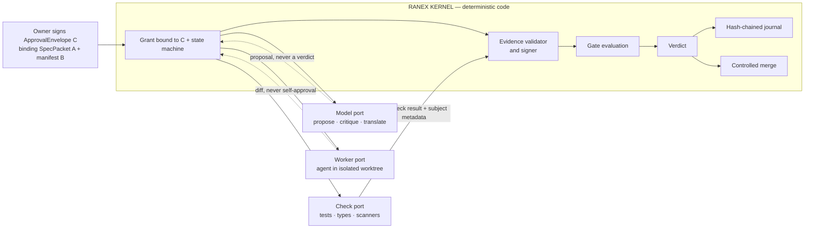
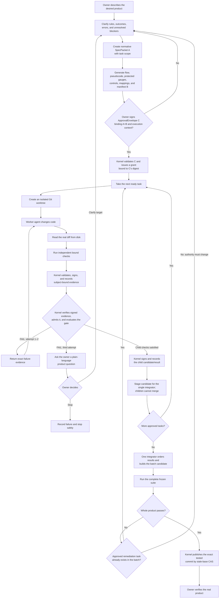

# Ranex

**Deterministic governance for AI agents that build software.**

> Rules an agent can read are suggestions. Rules compiled into code are
> constraints.

Ranex is an open-source kernel and agent harness that judges software work by
evidence and executable checks—not by an AI model's confidence. Removing every
model credential from the machine must not change a single verdict.

[Website](https://ranex.dev) · [Field notes](https://ranex.dev/blog) ·
[YouTube](https://www.youtube.com/@RanexDev) · [Architecture map](docs/MAP.md) ·
[Current state](docs/STATE.md)

> [!IMPORTANT]
> Ranex is pre-release. The kernel has a working governed verdict and task path;
> the complete owner-facing product described below is still being built. The
> [status section](#status) separates implemented mechanisms from intended ones.

---

## The problem

An AI writing software is a blindfolded dart thrower with a guide shouting
coordinates. Two things go wrong, and they are separate problems:

1. **The thrower is blind.** It cannot perceive whether its own dart landed, so
   it reports success either way.
2. **The guide is bad.** The coordinates were wrong or vague before the throw.

There is a third failure, and it is the most common:

> **Most tools let the thrower paint the bullseye around the dart after it
> lands.**

One actor writes the code, writes the test, and declares success. That is why
"all tests pass" from an AI means so little — the target moved to wherever the
dart went.

## What Ranex is

Ranex is building **its own harness** — a trimmed fork of opencode, molded so
that every step is judged by a kernel that stays outside the loop (decided
2026-08-03; the kernel described below is what exists today). The kernel never
asks a model what to do next.

> Ranex is `make` for a nondeterministic compiler. `make` invokes gcc; nobody
> asks gcc what to build next.

Tools like Replit, Lovable, and Base44 optimize **the throw** — better model,
better prompt, faster loop. Ranex optimizes **the scoring**.

**Ranex does not improve aim.** Not by one degree. It makes misses visible and
cheap, and hits provable. Nothing here claims more than that.

### Why this needs to exist at all

A person hiring an architect relies on licensure, liability insurance, building
codes, and inspectors — an accountability apparatus that exists outside the
architect. AI labor has none of that. Ranex is an attempt to build the missing
apparatus: the code, the inspector, and the record.

---

## How it works

The kernel is the foreman and judge, not the coder. It controls the task,
observes what actually happened, evaluates evidence, records the decision, and
owns the merge.



### Trust topology

Three ports surround the kernel. None of them produces a verdict; the check port
produces measurements and raw results that trusted kernel infrastructure may
turn into admissible evidence.

- **Model port** — one completion, forced structured output. Intake, review,
  translating machine state into plain language. Stateless.
- **Worker port** — an agent with its own loop and tools, running in an isolated
  git worktree. Returns a diff. Replaceable by design.
- **Check port** — executes the bound checks and returns raw results plus subject
  metadata. The trusted kernel-side controller validates, signs, and records the
  evidence before gate evaluation; the check still does not decide.

Models appear at leaf nodes in exactly three roles, and **none of them can pass
a gate**:

| Role | Produces | Can it decide? |
|---|---|---|
| Proposer | a proposal | never |
| Critic | a finding | never |
| Translator | text | never |

### The chain

```text
idea → clarify → SpecPacket A → generated artifacts + manifest B
                                      │
                                      ▼
               owner signs ApprovalEnvelope C binding A+B
                                      │
                                      ▼
kernel grant bound to C → harness admission → isolated work
                                      │
                                      ▼
                 signed evidence → signed verdict → merge
```

The authority contract has three domain-separated objects:

- **A — SpecPacket and task scope:** normative, human-approved semantics and
  semantic-oracle inputs; it deliberately contains no generated hashes.
- **B — GeneratedArtifactManifest(A):** hashes the exact flow, pseudocode,
  protected gauges, fixtures, checkers, invocations, expected values, baselines,
  controls, and mappings generated or selected for A.
- **C — ApprovalEnvelope:** signs A+B together with the base, policy, generator,
  harness profile, capability request, identity, and anti-replay context. The
  kernel capability grant binds C's digest.

The **canonical SpecPacket A—not its flowchart or prose rendering—is the
normative root.** The complete authority boundary is A+B+C. Changing any bound
semantic, gauge, policy, generator, harness, base, or exemption digest revokes
authority and requires approval again.

### The build loop



Inside one task, the kernel follows a deliberately small loop:

1. Admit an approved bounded task, then create its isolated worktree.
2. Wait for the worker to exit, discard its self-report, and read the actual
   repository diff.
3. Run the bound checks against the exact subject revision; the trusted
   kernel-side controller validates, signs, and records the resulting evidence.
4. Verify and evaluate that evidence using deterministic policy.
5. Stage a passing child candidate for the single integrator—never merge from a
   child—or return concrete failure evidence for a bounded retry and eventual
   owner escalation.

**Ranex never trusts the worker.** It does not need to control what happens
inside the loop, only what is allowed out of it. Containment is a smaller problem
than control: the exits are enumerable, the interior is not.

This is the historical intended governed loop, not the kernel-only initial
release. Bounded read-only research/review jobs may run concurrently because
they cannot mutate files/refs or external state and receive no secrets. Current
`task fanout` is a convenience/prototype over free-prompt JSONL; it has no A/B/C
approval, exact child path+action scope, child-grant intersection or common
harness admission. Production fanout and the harness lane are withdrawn from
the current release; keep one mutation writer for kernel work.

The following grammar remains historical design context, not a current release
entrypoint or authorization claim:

```text
PYTHONPATH=src uv run --frozen python -m ranex.cli.main task fanout \
  --spec-packet A.json --artifact-manifest B.json \
  --approval-envelope C.json --tasks child-requests.jsonl \
  --target <repo> --journal <external> --outcome-dir <dir> --pool N
```

B/C own harness, model, timeout and suite; child rows name approved scope and
capability-request IDs; `--pool` can only narrow the approved maximum. Children
use isolated worktrees and cannot receive secrets or merge. Results are ordered
canonically for one kernel-controlled stale-base CAS integrator. SLICE-036 will
qualify the kernel continuity shape only in disposable worktrees with
publication blocked. The later harness effect-family and production-exit
slices were withdrawn; no production mutation authority is claimed.

---

## A complete run, end to end

Maria owns a dog-grooming shop and wants online booking. She cannot read code.

| Phase | What happens | Who decides |
|---|---|---|
| **INTAKE** | She describes it. Ranex asks ~12 non-technical questions: *when someone books, who gets notified? can two people take the same slot?* | — |
| | Ranex records her answers in draft SpecPacket A, then deterministically renders a **draft flow view** — screens as boxes, transitions as arrows, rules as diamonds. She requests changes; Ranex updates draft A and re-renders the view. | **Maria** ⏸ |
| **COMPILE** | The clarified draft becomes normative SpecPacket A. Ranex generates the final flow, covering paths, protected gauges, controls, and mappings whose exact bytes are hashed by manifest B. | — |
| | Maria signs ApprovalEnvelope C, binding A+B plus the base, execution profile, requested capabilities, identity, and anti-replay context. | **Maria** ⏸ |
| **PLAN** | The C-approved batch binds the task DAG, file ownership, interface contracts, capability requests, retries, checks, and maximum pool.<br>*Gate: every scenario maps to ≥1 task; mutation scopes do not overlap.* | kernel admission |
| **BUILD** | N workers, one worktree each, running the loop above.<br>*Gates: tests pass · types check · owns only its files · no new dependencies.* | code |
| **INTEGRATE** | One key-exclusive integrator orders accepted child candidates and constructs the batch tree; workers cannot merge or judge that candidate.<br>*Gate: full suite green; all 34 scenarios pass together.* | independent kernel/check gate |
| **SHIP** | Deploy, smoke test, live URL. She clicks through her own flow graph in a real app. | **Maria** ⏸ |

Human authority stays at the product boundaries: clarify normative A, review the
exact artifacts bound by B, sign approval envelope C, and verify the integrated
product. The visual flow is an important review surface, but editing that view
alone does not grant execution.

When a gate fails three times, she gets a **product** question, not a stack
trace: *"Two customers hit the same slot at the same instant. Tell the second one
immediately, or offer a waitlist?"* That she can answer.

Underneath, invisible to her: every behavior-bearing change traces through
stable rule, transition, outcome, and mapping IDs to the A+B digests bound by C,
with evidence and a verdict pinned to the exact code digest. She will never look
at the ledger. Her acquirer's diligence team will.

---

## What makes a verdict trustworthy

An agent that can edit its own tests can paint the target around its output. The
complete A/B/C architecture is intended to prevent that with four controls:

1. **Protected gauges are frozen before BUILD.** Every B-bound gauge and
   generated artifact is digested. Changing one revokes authority and fails
   admission; any enumerated exception must be declared in A/B and signed by C.
2. **Red-then-green, enforced.** Every generated test must fail against the
   pre-implementation tree. A test that passes before the code exists is not a
   target — it is a circle painted around a dart.
3. **Approved behavior coverage as a gate, not a metric.** Not "80% of lines"
   but *"every required outcome and transition in A maps to a protected,
   passing gauge bound by B and C."*
4. **No self-approval.** Whoever produced the evidence cannot approve it, and the
   task that implements a scenario never authors or judges its test.

Ranex has proven the red-then-green control in its own history: the SLICE-001
tests were committed red at `b495e3635`, before the implementation existed. The
current suite manifest freezes test IDs, not test bodies, so the complete
protected-gauge freeze line is **not** claimed as implemented end to end today.
The [status section](#status) records that boundary explicitly.

## The determinism ledger

| Deterministic | Not, and never will be |
|---|---|
| canonical bytes → content digest | the code an agent writes |
| closed scenario/oracle DSL → generated views and gauges | whether it passes on the first try |
| bound command + exact subject → result | how long it takes, or what it costs |
| admitted evidence + policy → verdict | |
| journal entries → hash-chain verification | |

Every row on the left is a pure function. Nondeterminism is quarantined inside a
single step whose output faces the left column.

**"Deterministic" describes the process and the verdict — never the generated
code.** Anyone claiming an LLM produces identical software twice is selling
something.

## What a passing build actually proves

> Every approved behavior and outcome in normative SpecPacket A is mapped to an
> executable gauge bound by manifest B and approval envelope C. Every required
> gauge ran and passed. Here is the evidence, pinned to this exact code digest.

That is the claim. These are **not** claims Ranex makes:

- **That the approved specification was right.** Only the person who owns the
  target can judge that, and only by using the thing. Hence the preview gate.
- **Anything outside normative A.** Unspecified behavior is unconstrained.
  Absence of a requirement is absence of a guarantee.
- **Non-functional properties** — performance, accessibility, security — unless
  you add gates for them. Those are separate checkers, not free.

"Conformant to an approved specification" is real, defensible, and deliverable.
"Correct" is not a claim anybody can make.

## Follow the build

- Visit **[ranex.dev](https://ranex.dev)** for the public project home.
- Read the engineering **[field notes](https://ranex.dev/blog)** for decisions,
  experiments, and lessons from building the kernel.
- Subscribe to **[RanexDev on YouTube](https://www.youtube.com/@RanexDev)** for
  demonstrations and project updates.
- Read **[the architecture map](docs/MAP.md)** for the full system design,
  maturity ledger, risks, and architectural boundaries.
- Read **[the current state](docs/STATE.md)** for the implemented frontier and
  the next governed slice.

---

## Status

**Pre-release kernel-only initial release.** The kernel has a working verdict,
serial task path, provisioning, confinement, and the A/B/C
specification-authority substrate. The owner-facing harness, credential-broker
qualification, task-family real-provider proof, and governed concurrent
production composition are outside this release and are not claimed complete.
The lists below state what the kernel actually provides and what remains open.

**Works today**

- `evaluate()` — a pure function of (gate, evidence, subject, approver). Same
  inputs, same verdict, always.
- **Subject-bound evidence** — the same command run against a different *commit*
  proves nothing about this one. Stale evidence stops counting automatically.
  The runner materialises that committed tree from verified blobs before it runs
  the command.
- **Absence blocks** — a required claim with no satisfying evidence is FAIL,
  never a default and never a skip.
- **No self-approval** — whoever produced the evidence cannot approve it.
- **Append-only hash-chained journal** — SQLite triggers prohibit ordinary updates
  and deletes; the hash chain detects out-of-band row edits. `ranex journal
  verify` recomputes that chain for an operator.
- **`ranex run`** — after an operator-facing dirty-tree check, materialises HEAD
  from verified blobs, executes the command there with an environment built from
  empty and a pinned toolchain, then records its exit code and subject digest.
  `run` then `gate evaluate` is a closed loop for self-contained commands.
- **Signed evidence** — Ed25519, verified against a committed keyring before a
  record is admitted. The verifier holds only public keys and cannot forge.
- **Claim↔command binding** — the committed catalog declares the argv that
  satisfies a claim, and the kernel compares its digest, so a record of `true`
  no longer satisfies `tests-executed`. Read the next section for what it does
  *not* buy.
- **The A/B/C specification-authority substrate** — canonical schemas and
  vectors for SpecPacket A, GeneratedArtifactManifest B, and ApprovalEnvelope C;
  deterministic closed-DSL flow/pseudocode/scenario/gauge/mapping projections;
  lifecycle, approval, revocation, intersected grants, trace integrity, and
  real-subject bootstrap. These kernel mechanisms are built and tested
  (SLICE-029–033 and SLICE-035), but the installed end-to-end mutation path is not yet
  authorized.
- **`ranex task dispatch|judge|merge`** — the serial kernel task path. The
  kernel records task→worktree at dispatch; a separate keyless invocation
  judges a CANDIDATE naming its missing claims, never a PASS; `merge` publishes
  only through ordered journalled checks. The delegated first rung and bounded
  `fanout` remain historical prototype mechanics, not release authority.
- **Signed verdicts and a verdict read channel** — evaluation records carry
  structured five-kind causes and self-approval; a dedicated
  `kernel-verdict-signer` signs verdicts under the same Ed25519 keyring
  discipline as evidence; publication is validated and atomic; and a total
  closed-state reader projects refused and unattributable rejections
  (SLICE-020).
- `ranex gate evaluate`, `ranex keygen`, and repository path confinement.

**Known gaps — stated plainly**

- **The confinement controller is same-uid trusted infrastructure.** The bound
  command now runs inside the qualified strict-local session (Landlock, seccomp,
  cgroup; environment allowlisted to LC_ALL/TZ; no inherited fds), and evidence
  is signed only after fail-closed confinement-result validation — the measured
  worker can no longer take the signing key (`RISK-06` closed by SLICE-046;
  ADR-006 accepted 2026-08-15). The standing limit, stated plainly: the
  controller subprocess that invokes the session still runs as the same user
  (sudo-monitor model, ADR-023); controller env narrowing is a named follow-up.
  The model credential still sits in a network-open loop — use a scoped,
  spend-limited key.
- **Approver identity is unauthenticated.** `--approver` is a plain string, so a
  producer can name anyone as their approver. Evidence signing proves only that
  the holder of the registered private key signed the record; it proves nothing
  about who approved it. No-self-approval compares those unauthenticated strings.
- **The journal does not detect rollback or truncation.** Concurrent appenders
  are serialised before they read the previous link, and `ranex journal verify`
  recomputes the chain, now naming the first chain-breaking row. But an
  internally consistent earlier prefix still verifies after later rows are
  removed — characterized and frozen as the documented outcome by SLICE-056;
  the ADR-032 fold-in landed (8a5ed3837). Closing it remains a slice-governed
  change.
- **No owner-facing intake product or installed A/B/C → harness admission →
  concurrent mutation composition.** Kernel-side A/B/C validation,
  deterministic projections, lifecycle, grants, trace integrity, and
  real-subject bootstrap exist; budget and plain-language escalation do not.
  The harness lane, broker qualification, task-family real-provider proof, and
  production fanout exit were withdrawn from this kernel-only release. No
  production mutation authority is claimed.
- **Review-consensus authenticity gaps remain unstarted in production.** Two
  independent adversarial reviews (2026-08-06) confirmed the gaps above and
  added: the suite manifest freezes test IDs, not test bodies; `evidence.json` is
  overwritten, not appended; network is denied only during provisioning.
  No prototype has been opened for these authenticity gaps; the green, digest-bound SLICE-011 prototype record covers ADR-015's durability claims only, not these authenticity defects, so production hardening for them remains unstarted. Every hardening idea must be proven
  red-first in a scratch prototype before production code (milestone #1).

Roughly speaking: the hardest part to get conceptually right exists, and almost
none of the surface around it does.

## Current work

<!-- Active-slice and completed-slice markers are checked against docs/STATE.md by tests/contract/test_docs_discipline.py. -->

**Active slice:** none

**Next slice:** SLICE-036 (#19), the only planned delivery. It qualifies the
approved batch and kernel continuity in disposable worktrees with publication
blocked; it does not reopen the withdrawn harness, broker, task-family, or
production-exit work.

SLICE-059 (task family e2e, #39) was implemented as historical test work and
closed in its prior ceremony, but is withdrawn from the release as of
2026-08-25. It is not a completed real-provider release gate: the ADR-032
frame's fourth family customer remained below the owner's final acceptance bar.
The historical artifact covered the real dispatch→work→`run`→judge lifecycle over a real
disposable worktree (DISPATCHED/RECORDED/CANDIDATE goldens), the
engineered refusals on real evidence (tampered judge evidence refused
naming its claim; self-approval refused `sad-path-14`; moved base
`sad-path-9 tip-mismatch`; digest mismatch `sad-path-5
subject-digest-mismatch`), the clean PUBLISHED merge through the five
ordered journalled checks, worktree-residue detection, and the real
delegated OpenRouter model run (CCR-2's store-read credential +
CCR-3's seeded GitHub-tool deny; red-at-base note test green only via
the model's work, CANDIDATE naming `tests-executed`, no PASS
anywhere). Three goldens captured from the real journeys
(sha256 dbe923e7…/f7ff1f74…/cac49c48…); the byte-exact re-run clause's
free-model nondeterminism is a written owner risk-acceptance (DECISION
on #39, issuecomment-5359345600; zero frozen-test changes; shape-golden
CCR-4 text drafted for any future owner). Ceremony 56c445a1f: FROZEN
tests=1397 expected_skips=136, sealed 1262/135/0, round-trip 6/6;
  fail_under re-derived 16.68 → 14. The fanout qualification arm remains
  withdrawn from the kernel-only release.

SLICE-060 (gate-evaluate presentation dedup, #40) closed 2026-08-20 —
a mixed stale+absent verdict no longer prints the absence sentence
twice: `gate evaluate`'s FAIL block removes the recorded reason's
final absence clause by anchored suffix comparison against exactly the
sentence its own partition printed, and steps aside entirely — full
reason verbatim, duplicate and all — whenever a missing claim ID
contains "; " (qa-gate round 1's confirmed blocker: a split-based
dedup truncated adversarially named claim IDs). The recorded reason
bytes are untouched (ADR-020's invariant). Five frozen arms, two
red→green; ceremonies at 7c99838fa/8cda414af (FROZEN tests=1383,
expected_skips=134, sealed green); full suite 1365/18/0; two
non-author APPROVEs, round-2 adversarial fuzz 789,672 cases with zero
loss-of-information violations.

SLICE-058 (provisioning family e2e, #38) closed 2026-08-20 — the
ADR-032 frame's third family customer: the real deps journey (a real
clone keeping its committed `governance/deps.yaml`, the pinned resolver
re-deriving the committed lock byte-exactly over the real index, a
content-addressed wheel store re-hashed entry-by-entry by `sha256sum`,
approve/third-fetch bookkeeping, env-injection ignored) and the real
keygen journey (the kernel signs and accepts the keygen key; openssl —
OpenSSL 3.0.13 — verifies independently both directions over
PKCS#8/SPKI DER) — two goldens captured from the real journeys, the
sabotage controls (wheel byte-flip quarantine + one-wheel repair,
lying/dead local index, lock drift and epoch-block refusals), and the
ruled sealed-netns fallback for the loopback fixture. Registered
through the standing ceremony at 81d63d495: 1378 IDs / 134
declarations, sealed run_exit=0.

SLICE-057 (execution family e2e, #37) closed 2026-08-20 — the ADR-032
frame's second family customer: three real-journey test files (real
`run` producing signed, subject-digest-bound evidence with openssl's
independent re-check; real launcher build/install/qualify and confined
spawns whose kill/drain the kernel validates over a drained teardown;
the real hermetic suite-freeze round-trip) compared byte-exactly
against three goldens captured from the real journeys through the
frame's one normalizer. The journey forced three never-executed-code
kernel fixes, each an orchestrator-ruled allowlist/re-pin amendment on
#37 (session enrollment drain; the sleep family; the process-creation
family with its recorded nr-only-clone residual — the security review
gates the range before push). The confinement family's strict-local
arms are proven in the delegated scope (`systemd-run --user --scope
-p Delegate=yes`, 7/7) and skip with the live probe reason in a plain
session — the ceremony froze exactly those five declarations.
Ceremony: manifest 1363 IDs (+18) / 124 expected skips (+5), sealed
run 1260 passed / 103 skipped / run_exit=0. Full suite at close:
1345 passed / 18 skipped / 0 failed.
SLICE-056 (verdict family e2e, #36) closed 2026-08-20 — the ADR-032
frame's first family customer: two real-journey test files (gate
evaluate on a real clone with real keygen/run/openssl-verified
evidence; journal verify clean, byte-tampered with the CLI naming the
chain-breaking row, and rolled back) whose transcripts compare
byte-exactly against four goldens captured from the real runs through
the frame's one normalizer. The suite-freeze ceremony registered the
eight family IDs (manifest 1345 IDs / 119 expected skips) and resolved
the pre-registered hermetic UNKNOWN hermetic-green: sealed run 1227
passed / 118 skipped / run_exit=0 — every family arm runs identically
inside the sealed environment. Full suite at close: 1305 passed / 40
skipped / 0 failed. The carried follow-up — the ADR-032 fold-in of
the characterized truncation blind spot — landed at 8a5ed3837; the
register's open item is now the mirror-pin test for
`_journal_first_broken_row`.
The milestone-4 real-e2e frame is closed beneath it (2026-08-19):
honest prereq probes, the two-tier declared-skip cross-check,
subprocess coverage, and the documented entrypoint (rc 0, coverage
16.70% ≥ fail-under 15). All six kernel P0 spec-authority slices
(SLICE-029/030/031/032/033/035) are landed on kernel `main` at
`ff3ab802`: A/B/C contract freeze, lifecycle, closed-DSL projections,
approval/revocation/intersected grants, trace integrity, and
real-subject bootstrap. The byte-identical A/B/C schema/vector
TypeScript mirror (35/35; vectors SHA-256 `9efa0baf…`) is merged in
`ranex-harness` `ranex-trim` at `16bf036f`. The execution family
followed and closed (SLICE-057, #37, 2026-08-20 — below), then the
provisioning family (SLICE-058, #38, 2026-08-20 — below). The task-family
entry (SLICE-059, #39) is retained as historical implementation evidence but
was withdrawn from release scope; milestone 4 is closed with partial delivery.

Two of ADR-015's five durability claims are now in production: the provider
watchdog; and the reconciler reorder plus its startup sweep. Three remain —
durable retry, durable blockers, and Session-ID fencing — each gated by the
SLICE-011 prototype record through a compiled test. The remaining durability
sequence is parked/subordinate to P0. ADR-006 is split into closed issue #10 /
SLICE-017 qualification, closed issue #21 / SLICE-018 lifecycle, and closed
issue #22 / SLICE-019 host-qualification evidence, and SLICE-046's `cmd_run`
confinement binding — ADR-006 is accepted and `RISK-06` is closed (the
controller subprocess remains same-uid trusted; ADR-023). ADR-017 is
`accepted`; SLICE-029..033 and SLICE-035 built the kernel-side authority
  substrate. SLICE-036 is the only retained next delivery and is
  qualification-only with publication blocked; the harness-effect and
  production-exit slices were withdrawn.

**Durability is no longer only a design.** The provider watchdog shipped to the
harness (`23d6a5b4ee`): a stalled provider stream now reaches a terminal state
on its own, where before it hung forever and reported the session busy until
someone intervened by hand. Three of ADR-015's five claims remain unbuilt in
production, and each is gated by the SLICE-011 prototype record — a compiled
test refuses a durability production slice if that record is missing, not
green, or not digest-bound. The work happens in `anthonykewl20/ranex-harness`,
milestone #1.

**Ranex gates Ranex.** With SLICE-009 closed, `ranex run` executes this
repository's own suite — provisioned, sealed and offline — against a
materialisation of the real current commit, and `gate evaluate` judges signed
structured outcomes against the manifest diff — 1267 IDs, with 116
ceremony-declared expected-skips — not the exit code alone. The materialisation
is a fresh single-commit repository carrying the verified tree (ADR-009), so a
committed suite that asks git about itself is told the truth, while the sample
shares nothing with the governed object store.

Ranex observes a **materialisation of the subject commit**, built from bytes
checked against the object ids the commit's tree carries, with an environment
constructed from empty and a toolchain pinned to directories the observed party
cannot write. The six frozen false-PASS paths were two root causes, not six: the
tree observed was not the tree HEAD names, and the toolchain and its inputs were
chosen by the party being measured. Both are closed.

## Completed slices

- **SLICE-059-real-e2e-task-family** — historical implementation closed
  2026-08-21, withdrawn from the release on 2026-08-25. It is retained here
  as an implemented test artifact, not claimed as completed real-provider
  release proof. The ADR-032 frame's fourth family customer covered the governed task
  lifecycle (dispatch → the kernel's own `run` producing real evidence
  → judge) proven on a real disposable worktree with two goldens, the
  engineered merge refusals (self-approval, moved base, digest
  mismatch — stable named reasons) plus the tampered-evidence refusal
  proven against the clean journey's green, the clean PUBLISHED merge
  through the ordered journalled checks, worktree-residue detection,
  and a real delegated OpenRouter model run whose kernel-recorded
  suite proves execution (red-at-base green only via the model's
  work). The free model's note-line nondeterminism is a written owner
  risk-acceptance (DECISION on #39); +14 suite IDs through the
  standing ceremony (tests=1397, expected_skips=136, sealed green).
- **SLICE-060-gate-evaluate-presentation-dedup** — closed 2026-08-20.
  A mixed stale+absent verdict printed the absence sentence twice; the
  FAIL block now dedups by anchored suffix comparison against the exact
  partition sentence, disabled whenever a missing claim ID contains
  "; " so the printed diagnosis can repeat but never truncate. Reason
  bytes untouched; five frozen arms; +5 suite IDs through two standing
  ceremonies (tests=1383, sealed green).
- **SLICE-058-real-e2e-provisioning-family** — closed 2026-08-20. The
  ADR-032 frame's third family customer: the deps family (the real
  pinned-inputs fetch reproducing the committed lock byte-exactly and
  freezing its FETCHED transcript against a golden captured from the
  real journey; every wheel-store entry re-hashed by `sha256sum` to its
  own content address; second-fetch reuse, `deps approve`, third-fetch
  consistency; hostile `UV_*`/`PIP_*` injection ignored at an identical
  depset; the wheel byte-flip admission refusal with quarantine and the
  one-wheel repair fetch; lock-drift and missing-epoch-block refusals;
  the ADR-032 sad-path-12 local-index fixture — lying and dead loopback
  sources refuse, with the owner-ruled sealed-netns lo-raise/loopback-
  probe fallback) and the keygen family (the kernel signs and accepts
  the keygen key; openssl independently verifies both directions, the
  tampered-message refusal as the discriminating negative; key-material
  confinement gates). Registered through the standing freeze ceremony:
  1378 suite IDs, 134 declarations, sealed run green.
- **SLICE-057-real-e2e-execution-family** — closed 2026-08-20. The
  ADR-032 frame's second family customer: the run family (real signed
  evidence, stdlib subject-digest recompute, openssl Ed25519
  verification, both post-run sabotage refusals, the traced-run
  artifact with verdict neutrality), the confinement family (two-root
  launcher reproducibility, real build/install/qualify, confined
  spawn binding both confinement digests, the shell-descendant
  containment contract — shell-constructed descendants die with the
  three construction layers pinned to their call sites, the real
  kill/drain proof living in the timeout arm — and timeout-vs-exit
  distinct reporting), and the freeze
  family (byte-stable manifest round-trip, dirty-tree and hand-edit
  refusals) — three goldens captured from the real journeys through
  the one normalizer. The journey forced three never-executed-code
  kernel fixes through orchestrator-ruled amendments (enrollment
  drain, sleep family, process-creation family; nr-only-clone
  residual recorded for the security review gating the range).
  Strict-local arms proven in the delegated scope (7/7); plain
  sessions skip with the live probe reason. Registered through the
  ceremony: 1363 IDs / 124 expected skips, sealed run 1260/103/
  run_exit=0.
- **SLICE-056-real-e2e-verdict-family** — closed 2026-08-20. The
  ADR-032 frame's first family customer: gate-evaluate and
  journal-verify journeys over a real clone with real keygen/run
  evidence and openssl's independent Ed25519 re-check; four goldens
  captured from the real runs through the one normalizer (sabotage
  control and fixpoint contracts refuse hand-sanitized bytes);
  journal-verify FAIL names the chain-breaking row; the
  rollback/truncation blind spot characterized as the documented
  outcome. Registered through the suite-freeze ceremony (1345 IDs /
  119 expected skips), which also proved the family hermetic-green —
  every arm runs identically inside the sealed environment. The
  carried follow-up — the ADR-032 fold-in of the truncation blind
  spot — landed at 8a5ed3837 as a disclosed kernel limit.
- **SLICE-055-real-e2e-suite-framework** — closed 2026-08-19. The ADR-032
  frame: six honest prereq probes, the golden-transcript normalizer, the
  two-tier declared-skip cross-check (probe-backed hard / context
  informational), subprocess coverage with loud wired-child no-data
  detection, and one README-documented entrypoint whose captured run is
  milestone 4's proof artifact. Adversarial reviews remediated through
  arbitration (two-grammar scheme, R1d hard-tier scoping); the sanctioned
  amendment chain and the follow-ups register are recorded in the slice
  file.
- **SLICE-054-kernel-observability** — closed 2026-08-18. The ADR-031
  substrate landed: default-off `RANEX_TRACE`/`RANEX_TRACE_EVENT` JSONL
  emitter with a frozen schema, SID chaining, ambient strip at the stage
  boundaries, and the confinement-session controller seam — proven
  verdict-neutral, off-state overhead measured (~1.3-1.6 ms cumulative
  import, ~84-114 ns per disabled emission). Two adversarial review rounds
  remediated (dual security + test-layer, then final-gate cumulative;
  findings D1-D5/S1-S5a and N1-N6 all closed, records on #34). Known
  residual: the host-gated strict-local confinement e2e arm (SID tree
  through a real controller) is skip-declared pending a delegated cgroup-v2
  host; in-process seams are green.
- **SLICE-032-approval-and-intersected-grants** — closed 2026-08-17,
  kernel-side. Approval binds closed policy and lifecycle facts; revocation,
  expiry, canonical use facts, and deterministic least-authority child grants
  refuse authority expansion. CAS/persistence and the SpecificationEvent
  atomicity contract remain the retained SLICE-036 kernel-continuity scope.
- **SLICE-035-real-subject-bootstrap** — closed 2026-08-17, kernel-side. Real
  Ranex source bootstrap ran from its pinned subject; Arxic's reference-auth-app
  process gate remains BLOCKED at pinned `135991d9` (Arxic #109).
- **SLICE-033-trace-integrity** — closed 2026-08-17, kernel-side. Independent
  trace coverage binds changed source symbols to exact current generated
  comment/sidecar references and separately verifies protected outcomes;
  generator interoperation covers Python, TypeScript, and JavaScript.
- **SLICE-031-closed-dsl-projections** — closed 2026-08-17, kernel-side.
  Closed scenario DSL parsing emits deterministic gauges, views, trace/sidecar
  bytes, and an A-bound protected-artifact manifest; source coverage and trace
  verification remain later work.
- **SLICE-030-specification-lifecycle** — closed 2026-08-17, kernel-side.
  Deterministic lifecycle transitions, clarification questions, durable retry,
  and CLI status/advance paths are merged locally; lifecycle-fact wiring and
  nonce tracking remain SLICE-032 follow-ups.
- **SLICE-029-abc-contract-freeze** — closed 2026-08-17. A/B/C schemas,
  canonical forms, registry precedence, vectors, and frozen suite IDs are
  complete; the byte-identical TypeScript mirror merged to `ranex-trim` at
  `16bf036f`, closing #12.
- **SLICE-047-confinement-hardening** — closed 2026-08-15. The confinement-result validator is shared by producer and signer; the controller gets an explicit four-variable environment, and timeout/reap failures refuse without evidence (ADR-024).
- **SLICE-046-cmd-run-confinement-binding** — closed 2026-08-15. `cmd_run` runs the bound command inside the qualified strict-local session (ADR-023), and evidence is signed only after fail-closed confinement-result validation; ADR-006 is accepted, RISK-06 is closed, and ADR-017 is accepted without broadening.

- **SLICE-018-confinement-session-lifecycle** — closed 2026-08-14. The native
  launcher ENFORCES NNP, strict full-mask Landlock, default-deny seccomp, and
  `execveat` behind a closed worker-exec path. Its capability-gated session
  performs cgroup-v2 enrollment/readback before release, readiness witnessing,
  kill/drain/remove teardown, and bounded `openat2` collection into an unsigned
  confinement result. ADR-006 remains proposed and RISK-06 remains open; only
  SLICE-019 may close them.

- **SLICE-020-judgment-identity-and-verdict-read-channel** — closed 2026-08-13.
  Evaluation records now carry structured five-kind causes and self-approval;
  projection composes refused and unattributable rejections. Dedicated verdict
  signing, validated atomic publication, and a total closed-state reader provide
  the kernel-owned channel consumed by later UI/board work.

- **SLICE-019-host-qualification-as-gate-evidence** — closed 2026-08-13. The
  landing gate now consumes host qualification as signed, subject-bound evidence
  under the existing `EVIDENCE_DOMAIN`; admission deeply validates the closed
  report and re-reads durable boot, machine, LSM, userns-sysctl and parent-
  namespace uid/gid anchors, refusing absent, stale, mismatched, ambiguous or
  self-approved evidence. Qualification runs as a host operation through
  `cmd_run`, while the kernel remains byte-exact. The real-operator e2e is
  honestly guarded and skips without delegated cgroup controllers; `cmd_run`
  confinement and RISK-06 remain open.

- **SLICE-017-confinement-of-the-bound-command** — closed 2026-08-12. Its 47
  qualification gates qualified the strict-local host and byte-reproducible GNU
  C17 native launcher, binding LSM state, user-namespace sysctls, boot ID,
  machine ID and delegation identity. ADR-006 and RISK-06 remain open for
  SLICE-018/019; `cmd_run` integration is explicitly deferred to SLICE-019.

- **SLICE-013-reconciler-reorder** — closed 2026-08-08, all seven criteria met,
  landed in `anthonykewl20/ranex-harness` (`a8bc7bdf35`). A crash with an empty
  inbox left tools projected `running` forever: the runner returned on its
  eligible-input guard before it reconciled, and nothing else looked. The hoist
  fixes the `run()` path; a startup sweep wired into the application graph
  recovers sessions nobody calls `run()` on — the half the prototype had left as
  a capability with no caller.

  Two things make it worth reading. Its concurrency test only works because
  `Effect.all` defaults to *sequential* in this Effect beta; without an explicit
  `concurrency: 2` it would have passed against the unfixed code and proven
  nothing. And the slice introduced a hazard rather than only removing one — the
  sweep is database-global, so a second process booting marks a first process's
  running tools as interrupted. That is accepted scope, not an oversight, and it
  is recorded in the code and the spec as a prerequisite on the fencing slice.

- **SLICE-012-provider-watchdog** — closed 2026-08-07, all nine criteria met,
  landed in `anthonykewl20/ranex-harness` (`23d6a5b4ee`). Two timeouts, each
  provable without the other: an idle deadline that resets on every chunk, and
  an absolute whole-turn budget. Both fail as a typed **non-retryable** error —
  load-bearing, because a retryable one would fire, be retried, restart the same
  stall and hang anyway while every criterion still passed.

  Idle deliberately does not cover time-to-first-token. Inter-chunk gaps run
  ~10-100ms while a reasoning model can take minutes to its first token, and one
  number cannot serve both distributions — so the first pull runs untimed. The
  consequence is written down rather than hidden: a provider that connects and
  then never sends is bounded only by the absolute budget.

  Two defects were found by building it. A watchdog failure is an error, not an
  interrupt, so tool fibers dispatched during streaming were never cleared and
  the settlement await held the turn open forever. And a pre-implementation
  review caught that nothing required the timeout to be non-retryable — the
  prototype had avoided that by accident, not by decision.

- **SLICE-011-durable-execution-prototype** — closed 2026-08-07, all nine done
  criteria met. Five durability claims (watchdog, reconciler reorder, durable
  retry, durable blockers, Session-ID fencing) proven red-to-green with
  negative controls, one disposable harness worktree each, consolidated into a
  digest-bound record now archived beside the slice. It ships nothing: the
  prototype is disposable by design and production integration is SLICE-012+.

  Two results are worth reading. Every gate was re-run against the worktree on
  disk rather than read from the session that produced it — and that is the
  only reason the fifth claim's suite was caught being unstable (~12%) *after*
  it had been reported stable and approved by two independent reviewers; the
  cause was a fixture that discarded the stderr which would have said so. The
  slice's own compiled gate was then built wrong for the case it exists to
  cover, on a mistaken supervisor instruction, and a reviewer caught that too.
  Neither failure was found by reading a report.

- **SLICE-010-the-kernel-merges** — parked 2026-08-06 when the ADR-015
  durability program took the tree, then re-opened and finished the same day
  on the owner's direction. All fourteen done criteria are proven by passing
  tests: `ranex task merge` publishes a judged candidate only through ordered
  journalled checks — the unsafe `update-ref` control is reproduced before it
  is refused; the domain-separated approval envelope binds the candidate,
  subject digest, target ref, observed tip, catalog digest and CANDIDATE row
  hash; ancestry, merge-range, digest/evidence, and CAS each refuse red-first;
  races journal exactly one winner. Publication is a checked fast-forward by
  the kernel (`15614e6fc`).
- **SLICE-009-a-skip-is-absence** — exit-code satisfaction let a skipped or
  vanished test read as success; the measured failure destroyed 27 tests while
  the remainder stayed green. Junitxml is bound in the digest-bound argv;
  signed structured outcomes use evidence v3; an outcome-blind manifest is
  frozen from the suite; and its diff blocks undeclared skip, xfail, xpass,
  error, or missing IDs. Delegated judging reads trust roots from the base tree.
  A hostile tree can forge the artifact; criterion 10's passing test states
  that boundary. Ranex's own gate now PASSes honestly and flips to FAIL when a
  frozen test's file is deleted.
- **SLICE-008-first-delegation** — the front door. `ranex task delegate` runs
  a real agent headless in a dispatched worktree, in an environment built from
  empty that **refuses to start holding the signing key**; the wall-clock bound
  kills the whole process group; the kernel cross-checks the emission against
  its own dispatch record, measures the frozen suite sealed, and a separate
  keyless invocation judges — a CANDIDATE naming its missing claims, never a
  PASS. Prototype `task fanout` runs a bounded pool, one worktree each; the
  journal chain verifies after concurrent runs, but no A/B/C or child-grant
  admission makes that production-safe. Proven end to end against a real free
  model, and the harness fork now presents as `ranex` with opencode's MIT
  attribution retained. Recorded, not mitigated: the model credential sits in
  a network-open loop (use a scoped, spend-limited key), and `ranex run`'s own
  path still reads the key before spawning (`RISK-06` stays open there).
- **SLICE-001-evidence-production** — `ranex run` executes a command, observes
  it, and emits evidence the gate accepts. Target committed red at `b495e3635`,
  before any implementation existed.
- **SLICE-002-evidence-authenticity** — evidence carries an Ed25519 signature
  bound to a producer in a committed keyring, and the keyring and gate catalog
  are read from the commit rather than the working tree. Closed once, reopened
  when audits found the tests were narrower than reality, and closed again after
  17 defects across four audits. **Reopened a second time on 2026-08-02**: the
  trust-root check was skipped entirely for a path the commit did not carry, so
  a catalog or keyring the attacker named was read unchecked. Closed by
  `docs/adr/ADR-002-committed-trust-root.md`.
- **SLICE-003-claim-command-binding** — the committed catalog declares the argv
  that satisfies a claim, and the kernel compares its digest, so a signed record
  of `true` no longer satisfies `tests-executed`. Six independent audits failed
  to break that binding, and criteria 1–9 were re-proven by mutation — each
  safeguard deleted from `src/` in turn, the covering test watched to go red.
  Closed on its own promise, not on a clean bill of health: the same audits
  reproduced six ways to get a false PASS *around* the binding, all one root
  cause, all recorded and frozen as strict expected-failure tests, all assigned
  to the next slice.
- **SLICE-007-trimmed-fork-to-the-kernel** — Ranex owns its harness: `opencode`
  forked at `v1.18.11` (`012c2f57`), trimmed to the keep-set, plugin surface
  locked to compiled-in built-ins, and startup fails closed unbridged. The
  kernel gained `task dispatch|judge`: the dispatcher records task→worktree in
  the hash-chained journal, the harness commits and emits references, and the
  kernel cross-checks against its own record, materialises the commit, and
  journals `CANDIDATE` — never a PASS; the stamp stays a human's, out-of-band.
  Proven end-to-end by the gear-mesh e2e running the loop on a deterministic
  in-fork model with zero credentials. Closed by
  `docs/adr/ADR-008-fork-opencode-and-bridge-to-the-kernel.md`.
- **SLICE-004-hermetic-observation** — the six frozen false-PASS paths are shut.
  The bound command runs against a **materialisation of the subject commit**
  whose every blob was checked against the object id the tree carries, in an
  environment built from empty, with a toolchain pinned to directories the
  observed party cannot write. Closed by
  `docs/adr/ADR-005-hermetic-observation.md`. Two capabilities were
  **deliberately withdrawn**: a tree needing installed dependencies, and a tree
  carrying a symlink or submodule, can no longer be observed at all.
  **Closed, reopened, and closed again.** The first close rested on a cleanup
  control that had never worked on any supported Python, covered by a test that
  monkeypatched out the very function it was named for — and on a mutation check
  run by hand by the same actor who wrote the code. Measuring the general form of
  that found **59 refusals no test executed at all**. The reopening replaced the
  hand-run claim with `mutmut`, added `diff-cover` so no future change can add an
  unreached line, and closed 15 of the 59. The remaining 44, and 880 surviving
  mutants including some in the kernel, are recorded in the slice rather than
  smoothed over.
- **SLICE-006-gating-a-real-test-suite** — Ranex gates Ranex. Dependencies are
  provisioned deliberately: `deps fetch` derives the lock clean under pinned
  inputs and byte-compares it, only SHA-256-addressed wheels enter the store,
  `deps approve` records the named package delta, and the run executes sealed
  and offline. The materialisation became a fresh single-commit repository
  carrying the verified tree (ADR-009), which let the five git-dependent
  controls pass unweakened, and the self-gate ran for real with the operator's
  own registered key. Nine defects found by driving the CLI as a person does;
  none by a unit test. What is **not** caught is recorded in the slice: an
  approved, hash-correct wheel still chooses its own exit code.

---

## Running it

```sh
uv run --frozen pytest -q

PYTHONPATH=src uv run python -m ranex.cli.main gate evaluate HEAD \
    --approver reviewer_alice
```

Always `--frozen`. Plain `uv run` re-locks and rewrites `uv.lock`, which is a
trust root here: it silently dropped the resolution epoch once, after which
`ranex deps fetch` refused the lock against its own clean derivation. The
gated command needs no flag — its argv stays exactly as the catalog binds it,
and `run` sets `UV_FROZEN` in the environment instead.

`pyproject.toml` sets `[tool.uv] package = false`, so the `ranex` console script
is **not** installed. Invoke through the module path above.

**On a fresh clone `gate evaluate` fails, and that is correct.** Absence
blocks: no evidence exists yet for `tests-executed`, so the verdict is FAIL
with a nonzero exit, naming the missing claim. Producing evidence needs a
signing identity of your own — the private key must live outside the
repository, and `keygen` refuses to write it anywhere inside:

```sh
export RANEX_SIGNING_KEY=~/.config/ranex/worker.key
PYTHONPATH=src uv run python -m ranex.cli.main keygen --producer worker
```

This repository commits the **public** keyring, `governance/producers.yaml` —
it is the trust root, and review of it is the control on it. It holds public
halves only; no private key is anywhere in the tree. It is a single
`producers` mapping, and `keygen` prints the exact line to add (and the whole
mapping, for a keyring being created from nothing):

```yaml
producers:
  worker: ed25519:<the key keygen printed>
```

Commit the change.

Next, provision dependencies. The bound command is `uv run pytest -q`, and the
observation is built from committed blobs only — so `.venv` is not in it and the
suite has nothing to import until its wheels are provisioned deliberately. The
resolver is pinned by path **and** digest in `governance/deps.yaml`, at a
root-owned location, because a resolver this uid can rewrite is one the observed
party chooses:

```sh
sudo install -m 0755 ~/.local/bin/uv /usr/local/bin/uv

PYTHONPATH=src uv run python -m ranex.cli.main deps fetch
PYTHONPATH=src uv run python -m ranex.cli.main deps approve --approver reviewer_alice
```

`deps fetch` is the only networked step: it re-derives the lock from the manifest
alone under those pinned inputs, refuses any byte of difference, and admits only
SHA-256-addressed wheels to the store. `deps approve` prints the package delta
and records that a human accepted exactly it. **Skipping either makes the next
command refuse, by name** — a lock nothing regenerated may be entirely authored.
Approval reduces hidden change; it cannot make third-party code truthful, and
`tests/security/test_slice006_approved_wheel_can_lie.py` demonstrates an
approved, hash-correct wheel forcing a passing verdict. Then:

```sh
PYTHONPATH=src uv run python -m ranex.cli.main run \
    --claim tests-executed --producer worker -- uv run pytest -q
```

`gate evaluate` then judges that run for real. The observation is a fresh
single-commit repository carrying the verified tree (`ADR-009`, accepted), so
the handful of this repository's own tests that ask git about themselves are
told the truth, and the gate compares signed structured outcomes against the
frozen manifest diff rather than the exit code alone (SLICE-009). It PASSes
honestly — and flips to FAIL when a frozen test's file is deleted.

Once the tree moves past the digest the evidence was bound to, `tests-executed`
stops counting too. A record that fails verification is reported as *refused*,
with a reason — never as "no evidence", because an attack and an unfinished task
are not the same event.

## The real-e2e suite entrypoint

One command runs the whole suite — the real-e2e journeys included — with
subprocess coverage wired through every frame-wired child, tees the transcript
and the coverage report into the ignored artifact home, and exits nonzero on
the hard skip-ledger findings: an observed skip no declaration covers, a
`ranex-prereq:` declaration whose observed skip reason drifted from the
declaration, or a probe-backed declaration whose skip did not occur (ADR-032,
application scope recorded on issue #35; the frame lives in
`tests/e2e/_prereqs.py` and `tests/e2e/coverage/sitecustomize.py`):

```sh
set -o pipefail
uv run --frozen python -c "import sys; sys.path.insert(0, 'tests/e2e'); import _prereqs; _prereqs.probe_artifact_home_writable('.local/ranex-e2e')"
mkdir -p .local/ranex-e2e/coverage
rm -f .local/ranex-e2e/coverage/.coverage*
export COVERAGE_PROCESS_START="$PWD/pyproject.toml"
export COVERAGE_FILE="$PWD/.local/ranex-e2e/coverage/.coverage"
PYTHONPATH="src:tests/e2e/coverage" \
  uv run --frozen pytest -q tests/unit tests/integration tests/contract \
    tests/security tests/e2e \
    --junitxml=.local/ranex-e2e/results.xml 2>&1 \
  | tee .local/ranex-e2e/transcript.txt \
&& uv run --frozen python -m coverage combine --keep \
    .local/ranex-e2e/coverage | tee -a .local/ranex-e2e/transcript.txt \
&& uv run --frozen python -m coverage report \
    | tee .local/ranex-e2e/coverage-report.txt \
&& uv run --frozen python tests/e2e/_prereqs.py cross-check \
    governance/suite_manifest.json .local/ranex-e2e/results.xml \
&& rm -f .local/ranex-e2e/coverage/.coverage*
```

What each piece is and why it is shaped this way:

- **Coverage env vars.** `COVERAGE_PROCESS_START` names this repository's
  `pyproject.toml` (absolute), whose `[tool.coverage]` block freezes
  `source = ["src/ranex"]`, `parallel = true`, and the fail-under threshold.
  `COVERAGE_FILE` pins one absolute shared base under
  `.local/ranex-e2e/coverage/` — gitignored `.local/*` territory — so every
  process's `parallel=true` suffix file (`.coverage.<host>.<pid>.<rand>`)
  lands in that one directory instead of scattering across working trees.
  The hook directory rides **last** on `PYTHONPATH`
  (`src:tests/e2e/coverage`), appended and never replacing: a replaced
  PYTHONPATH is how a subprocess hook silently dies, and LAST is the
  direction that keeps the hook directory from shadowing a real package a
  child imports. What LAST cannot prevent: Python imports the FIRST
  `sitecustomize` on the path, so an earlier PYTHONPATH entry carrying its
  own `sitecustomize` shadows the hook — the residual silence the frame's
  loud wired-child no-data detection exists to catch. The relative
  `source` is deliberate — a clone-judges-clone child resolves it against
  its own working directory and measures its own vendored copy of the
  kernel.
- **The pre-run artifact-home probe** (`_prereqs.probe_artifact_home_writable`)
  is the first command of the entrypoint: an artifact home that cannot be
  written fails loudly — a `RuntimeError` naming the home — before the
  suite runs at all, so no junitxml, no transcript, and no coverage report
  is ever half-written into a home that could not hold them. A writable
  home proceeds quietly and is left untouched by the probe.
- **The pre- and post-run sweeps** (`rm -f .coverage*`) are load-bearing
  hygiene, not tidiness: stale suffix files from an interrupted run must
  never enter a later combine, and the retained `--keep` inputs never
  outlive the artifact. Hard-killed (SIGKILL) children remain a documented,
  threshold-accounted coverage blind spot.
- **The combine is `--keep` and idempotent**: repeated `coverage combine
  --keep` over the retained immutable inputs reproduces identical combined
  data (installed coverage deletes inputs without `--keep`, so inputs are
  retained deliberately).
- **The cross-check** (`tests/e2e/_prereqs.py cross-check <manifest>
  <junitxml>`) is the declared-skip ledger in two tiers. Direction (a) is
  hard unconditionally for undeclared skips: an observed skip no
  declaration covers exits nonzero naming the test ID and its reason. Its
  reason comparison is a hard-tier obligation only (the orchestrator's
  R1d ruling on issue #35): a skip declared `ranex-prereq:` whose
  observed reason drifted from the declaration is a
  `skip reason mismatch:` finding naming both strings — the comparison is
  exact, so the declaration and its live skip message must be the same
  bytes, and a prereq-tier declaration whose test's message cannot carry
  the marker is misclassified (reclassify it context-tier through the
  freeze ceremony, never silence the finding). A skip declared
  `ranex-context:` is never byte-compared — its drift is reported in the
  informational list below. Direction (b) is the probe-backed lie
  detector: a declared skip that did not occur fails hard only when its
  declared reason uses the frame grammar (`ranex-prereq:<probe>:`) — the
  finding names the live verdict of that frame probe on the running host,
  and a present verdict means the declaration is stale: prune it at the
  next `suite freeze`. `suite freeze` itself stays outcome-blind; honesty
  is checked here, at entrypoint time.
- **Declaration grammars.** Every `expected_skips` reason in the manifest
  carries exactly one of two grammars (the orchestrator's ruling on
  issue #35): `ranex-prereq:<probe>: <prose>` — the HARD tier, asserting a
  context-independent condition one of the six frozen probes verifies
  live, both directions — or `ranex-context:<context>: <prose>` — the
  INFORMATIONAL tier, naming the context the declaration belongs to
  (hermetic-freeze, host-capability, operator-action). Unmarked prose is
  refused by the frozen lint; rewording happens through the freeze
  ceremony only.
- **Context-mismatch semantics.** A declared skip that did not occur whose
  reason is *not* probe-backed is a context-bound declaration — the
  manifest is deliberately multi-context (it also describes the sealed
  hermetic freeze environment: no operator `uv` on `PATH`, no sibling
  harness fork in the materialised sample, `unshare(CLONE_NEWUSER)`
  denied, cold-start zero-state re-entry refusal), and those conditions
  are not reproducible in the entrypoint's documented environment. The
  cross-check reports them as an informational `context-mismatch` list —
  names plus a count, `exit 0`. The same list carries the context tier's
  **observed-drift** entries (the R1d ruling's machine-greppable
  promise): a declared `ranex-context:` skip that *was* observed skipping
  with a differing live message is reported as ID + declared context +
  observed message — reported, never byte-compared, because those live
  messages come from other slices' frozen test files and many are
  dynamically composed host-state prose. Forbidding either shape would
  make the entrypoint unsatisfiable on any single host; the probe-backed
  tier above is what catches checkable staleness instead.
- **The canonical entrypoint environment.** The documented command assumes
  the qualified operator host and nothing else: the pinned `uv` toolchain
  on `PATH`, the sibling harness fork present at its default path
  (`../ranex-harness` relative to this repository, or named explicitly via
  `RANEX_HARNESS_DIR` — exporting the variable also makes the frame's
  `harness_fork` probe agree explicitly with the fork tests' default-path
  fallback), delegated cgroup-v2 controllers and unprivileged user
  namespaces for the confinement surfaces, and `RANEX_SIGNING_KEY`
  deliberately **not** exported — the `stage_12` operator gate skips on
  exactly that, and its expected skip is declared in the manifest with the
  probe grammar so exporting the key turns the declaration into a
  probe-backed prune at the next freeze. `OPENROUTER_API_KEY` is likewise
  absent on the canonical host (the first-delegation journey skips,
  declared). The command block itself is the only environment wiring the
  entrypoint performs: `COVERAGE_PROCESS_START`, `COVERAGE_FILE`, and the
  hook-last `PYTHONPATH` documented above.
- **Duration budget.** A full unwired run completes in roughly 10 minutes —
  the hermetic inner journeys re-run the whole suite nested — and the wired
  entrypoint in roughly 11 (measured 660s on the qualified host: suite,
  combine, report, cross-check; the coverage overhead is small because the
  traced work is mostly in-process). Treat anything past 30 minutes as a
  hang, not a slow run — interrupt and read the transcript.

The transcript and the coverage report under `.local/ranex-e2e/` are the
milestone's proof artifacts: a real invocation transcript and a real
per-file, per-line coverage report a human can read at a pinned commit.
The entrypoint never logs key material; the transcript carries suite output
and line numbers only.

## Development

One slice at a time; finish it before starting another. The rule is enforced by
a test, not left as a convention — as is the cap on how many documents may exist,
because this repository previously accumulated 561 architecture files and zero
product code.

- `CLAUDE.md` — invariants, settled decisions, working rules
- `docs/STATE.md` — where work stopped and what is next
- `docs/slices/` — the open slice, when one is open

## License

MIT © 2026 Anthony Garces
