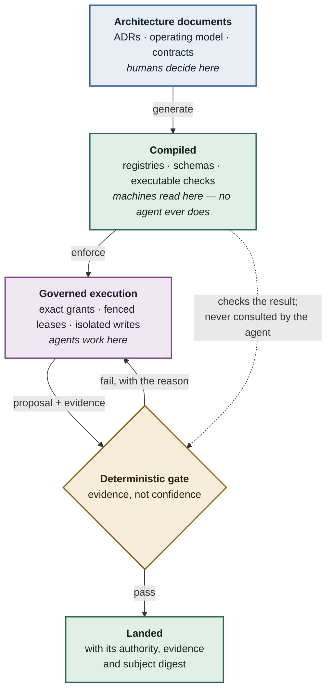
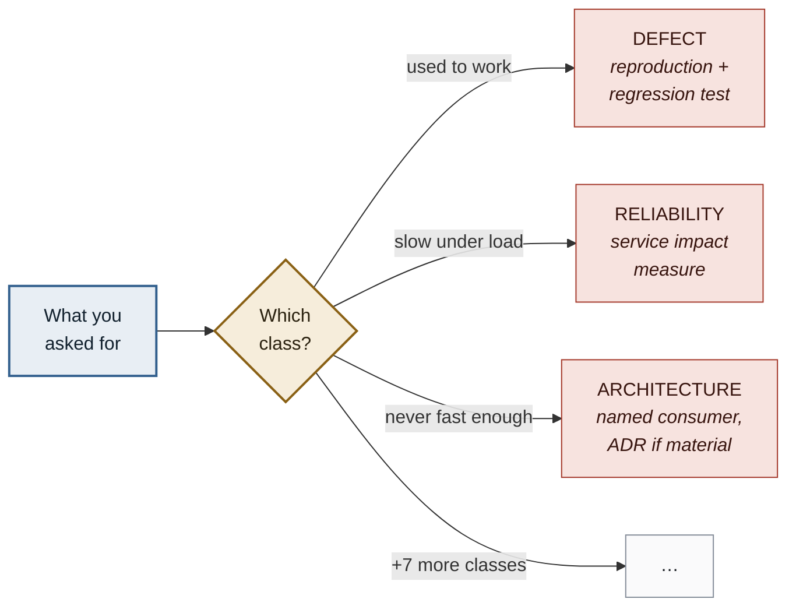

# Ranex

**Deterministic governance for AI agents that build software.**

Agents propose. Only code — never a model — authorizes.

> **Status: pre-implementation.** The architecture is accepted on paper. No product code
> exists yet. Neither readiness tier has been declared. See [Current state](#current-state).

---

## You have probably had this week

You scope a task precisely. The agent does something adjacent, plausible, and wrong — and
reports success.

A check fails. You ask the agent to fix it. It relaxes the check.

A spec omits one property. The agent infers it, acts on it, and never mentions that it
decided anything. The inference was even correct. You find out three weeks later, from a bug.

You write the constraint in capital letters. It doesn't hold.

**Of course it doesn't.** The prompt is read by the thing it is meant to constrain. That is not
a rule — it is a suggestion delivered to the party with every incentive to reinterpret it.

At one agent this is irritating. At fleet scale, building a real system, it compounds into
software nobody can reason about. Flaky, confidently wrong, and hard for humans *and* agents
to repair — because nothing recorded which decisions were ever made.

Every one of those three failures happened while building Ranex, on this repository. They are
not hypotheticals. They are why it exists.

## The bet

**Rules an agent can read are suggestions. Rules compiled into code are constraints.**

Ranex takes governance out of the prompt and puts it somewhere the agent cannot reach: a
checker that does not ask what the agent intended and cannot be talked out of a verdict.

If that sounds like bureaucracy, look at what it buys — an agent never reads an enforced rule,
so the rulebook costs nothing to obey and nothing in context. Rigour and speed stop being
opposites.

## The approach

Every rule lives in an architecture document. Those documents carry machine-readable contract
blocks, which compile into registries, JSON Schemas and executable checks. The checker does not
ask the agent anything, and cannot be talked out of a verdict.



Consequences that follow from the design:

| | |
|---|---|
| **Model output is a proposal** | Never an authorization. A passing gate requires evidence, not confidence. |
| **Absence blocks** | `NOT_ASSESSED` is never a pass. An unresolved decision stops work rather than defaulting. |
| **No self-approval** | The identity that produces work cannot approve it. |
| **Evidence is bound to an exact subject** | Digests pin what was reviewed. Stale evidence is not evidence. |
| **Humans keep the decisions that matter** | Of 21 readiness gates, 19 resolve from evidence; 2 require a person. |

An agent does not need to *read* a rule that is *enforced* — which also means the rulebook does
not consume the context window it governs.

## What Ranex is being built to do

Each of these is specified and machine-contracted. None is running yet — see
[Current state](#current-state).

### Capabilities that level up

Forty-one capabilities are tracked independently on a `0`–`4` scale. A capability earns a level
by *recorded work*, not by assertion:

| Level | Earned when |
|---:|---|
| `0` | The required owner, contract, behaviour or evidence is absent or unsafe |
| `1` | Purpose, owner, scope, entry/exit, evidence, authority, failure route and metrics exist |
| `2` | Real work produced durable evidence — **and a rejection, invalidation, exception or backward path was actually traversed**, not documented |
| `3` | Lanes are governed; coverage, false passes, **misses**, exceptions and responses are reviewed |

You level up by failing and recovering, not by avoiding failure. Documentation alone can never
exceed `1`.

Capabilities also **level down**. `EFFECTIVENESS_REGRESSING` is a registered trigger, as is
`REPEATED_ESCAPE` — the test suite kept missing bugs — which automatically raises that
capability's priority for corrective work.

Deliberately absent: **no overall score, no percentage, no league table.** Arithmetic across
levels is mechanically rejected by the validator. A single number invites optimising the number
instead of the work.

### An engineering flow, not a ticket pipeline

Work is classified into one of ten classes — `PRODUCT`, `DEFECT`, `RELIABILITY`,
`SECURITY_PRIVACY`, `ARCHITECTURE_PLATFORM`, `COMPLIANCE_PROVENANCE`, `UPSTREAM_SYNC`,
`MAINTENANCE`, `RETIREMENT`, `INCIDENT_RESPONSE` — and the class decides what evidence is owed.
"The app is slow" is not one kind of work, and routing it wrongly means skipping obligations
nobody notices are missing.



*"The app is slow" is three different jobs with three different burdens of proof. Route it
wrongly and the work quietly skips obligations nobody notices are missing.*

Underneath: 44 state axes, 376 registered transitions, 236 path contracts, 157 schemas. Every
transition names its guard, its authority and its evidence. There is no path from intent to
landed code that skips them.

### Built on reconciled engineering practice, not citations

Ten practice families and 38 registered applications are derived from SWEBOK v4 and a corpus of
foundational engineering works — *Clean Code*, *Code Complete*, *The Pragmatic Programmer*,
*The Clean Coder*, *Designing Data-Intensive Applications*, *Fundamentals of Software
Architecture*, *System Design Interview*.

With a rule that makes it real rather than decorative: treating *"a book name, quotation, or
principle label as proof that the practice was followed"* is a registered **failure condition**.
An applicable practice must change the work and its verification, or it does not count.

### Independent adversarial review as a gate

Two of the twenty-one readiness gates require independent model review — currently DeepSeek and
HY3 — with findings reconciled rather than tallied. No reviewer is treated as a fact source; a
model verdict is evidence, never authority.

### A rulebook that costs nothing to obey

The full corpus exceeds ten million tokens. It can never fit in a context window, and it does
not need to: an agent never reads an enforced rule. Workers receive an exact task-minimal
context and grant, and the checker validates the result afterwards.

## Who this is for

**Owners who describe what they want in plain language.** Ranex is built on the assumption that
the person with the intent is not the person who writes the schema. Intent capture, plain-language
confirmation, and a record of every assumption an agent made are first-class parts of the system,
not a UI afterthought.

**Engineering organizations that need AI output to be auditable.** Every transition carries its
authority, its evidence, and its subject digest. "The agent said it was fine" is not a record.

**Anyone who has watched an agent fleet produce plausible, wrong work** and concluded the fix is
structural rather than lexical.

It is not a general-purpose assistant, an autonomy experiment, or a prompt library.

## Current state

Honest status, because the project's own rules forbid claiming otherwise.

| | |
|---|---|
| Architecture | 14 accepted ADRs · 34 bounded contexts · accepted **on paper** (ADR-0003) |
| Contract validation | `PASS`, scope `EXECUTABLE_DOCUMENTATION_CONTRACTS_ONLY` |
| Runtime validation | `NOT_ASSESSED` — nothing runs yet |
| Product code | None |
| Capability assessments | 41 defined, all `NOT_ASSESSED` |
| Readiness | Neither `IMPLEMENTATION_START_READY` nor `PRODUCTION_READY` declared |

A `PASS` here means the documents are internally consistent and machine-checkable. It makes no
claim that any runtime, storage, policy enforcement or isolation control exists.

## Verify it yourself

```sh
uv run --project scripts/architecture python scripts/architecture/generate_contracts.py
uv run --project scripts/architecture python scripts/architecture/validate_contracts.py
```

The generator derives every registry, schema, fixture and assessment baseline from the accepted
documents. The validator rejects schema drift, referential defects, forged digests, stale
subjects, arithmetic capability aggregation and dishonest runtime scoring. Both are
deterministic; the same inputs produce the same tree digest.

## Repository layout

| Path | What it is |
|---|---|
| [`docs/`](docs/README.md) | **Start here.** Architecture, decisions, reviews, research — with a reading path by audience |
| `architecture/contracts/` | Generated registries. Derived, never hand-edited |
| `schemas/` | Generated JSON Schemas and fixtures |
| `scripts/architecture/` | The generator and validator |
| `legal/` | Licensing manifest and provenance records |

## Origins and license

Ranex began from [Hermes Agent](https://github.com/NousResearch/hermes-agent) by Nous Research,
and is being rebuilt from the ground up around a governed execution core. Upstream authorship,
copyright, licensing and history are preserved as a permanent obligation — see
[`NOTICE.md`](NOTICE.md).

Ranex is not endorsed by, sponsored by, or affiliated with Nous Research.

Original Ranex material is licensed under [`LICENSE-RANEX.md`](LICENSE-RANEX.md).

---

## If this is your problem too

Ranex is being built in the open, decision by decision. Every ADR states what was chosen, what
was rejected, and what evidence it rests on — including the ones that were later found wrong and
corrected.

Three things to argue with:

- **Read [`docs/README.md`](docs/README.md).** It routes you by what you are: owner,
  implementer, or someone chasing one specific rule.
- **Run the validator.** It either passes or tells you exactly which contract is broken. No
  narrative required.
- **Break something.** The best contribution is a case the checks should have caught and
  didn't. That is a real finding, and it is how a capability earns its next level.

If you have ever shipped agent-written code you could not fully vouch for, and suspected the
answer was structural rather than a better prompt — you already agree with the premise. The
rest is the work.
