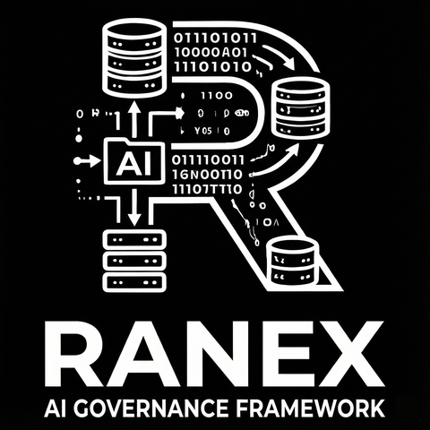
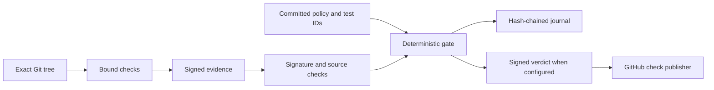

<p align="center">
  <picture>
    <source media="(prefers-color-scheme: dark)" srcset="docs/assets/ranex-logo-dark.png">
    <source media="(prefers-color-scheme: light)" srcset="docs/assets/ranex-logo-light.png">
    
  </picture>
</p>

<h1 align="center">Ranex</h1>

<p align="center">Deterministic governance for AI agents that build software.</p>

<p align="center"><b>No model decides PASS.</b></p>

<p align="center">
  <a href="https://github.com/anthonykewl20/ranex/actions/workflows/ci.yml"></a>
  <a href="LICENSE"></a>
  <a href="pyproject.toml"></a>
  <a href="https://github.com/anthonykewl20/ranex/releases/tag/v0.1.006"></a>
</p>

<p align="center">
  <a href="#quickstart">Quickstart</a> · <a href="#how-it-works">How it works</a> · <a href="#the-cli-at-a-glance">CLI</a> · <a href="#research--decisions">Research</a> · <a href="#whats-brewing">What's brewing</a> · <a href="https://ranex.dev/dogfood">Proofs</a> · <a href="docs/OPERATIONS.md">Docs</a>
</p>

Try the [real-repository proof](#prove-it-on-a-real-repository): PASS, rejection after a source change, then recovery after fresh evidence.

## What is Ranex?

Ranex is a Python command-line tool with a native worker launcher that governs the work AI agents do on software. It decides whether a change may be accepted by evaluating signed evidence against a policy committed to the repository, with a pure function — `evaluate()` — so no model is ever asked for a verdict.

- **No model decides.** The verdict is a deterministic function of the gate, the evidence, the subject and the approver.
- **Absence blocks.** A required check with no evidence blocks the gate; undeclared skips block suite claims, while explicitly declared expected skips are permitted.
- **Evidence is bound to the exact tree.** Results carry the digest of the source and the command that produced them.

Built for maintainers and harness builders who let agents write code and still need merges to be provable. Status: early; its limits are stated below and never hidden.

## Why it exists

An agent says "done." CI is green. But did the expected tests actually run, and do those results belong to the code you are about to merge?

| Situation | What Ranex checks |
|---|---|
| Code changed after a passing run | Evidence must match the current source digest. |
| Required tests disappeared or were skipped | Outcomes must satisfy the frozen test-ID manifest. |
| A result came from an untrusted producer | Its signature and producer must pass admission. |
| A required check never ran | Missing evidence blocks the gate. |
| You need to inspect an earlier decision | The journal retains the verdict and its hash chain. |

## How it works

1. **Define acceptance.** Commit required claims, command bindings, trusted public keys and the expected test IDs.
2. **Observe a specific tree.** Run the bound checks and produce signed, source-bound evidence.
3. **Evaluate.** The kernel admits the evidence and applies the blocking rules.
4. **Keep the decision.** Store the verdict in the journal; optionally publish a signed verdict to GitHub.


```mermaid
flowchart LR
    Source[Exact Git tree] --> Run[Bound checks]
    Run --> Evidence[Signed evidence]
    Evidence --> Admission[Signature and source checks]
    Policy[Committed policy and test IDs] --> Gate[Deterministic gate]
    Admission --> Gate
    Gate --> Journal[Hash-chained journal]
    Gate --> Verdict[Signed verdict when configured]
    Verdict --> GitHub[GitHub check publisher]
```

## Guarantees

Each invariant is enforced by code or a contract test — repository paths are linked below.

| Invariant | What it means | Enforced at |
|---|---|---|
| `evaluate()` is pure; no model decides | The verdict is a function of gate, evidence, subject and approver only | [tests/contract/test_kernel_unchanged.py](tests/contract/test_kernel_unchanged.py) |
| Absence blocks | A required claim with no evidence fails; absence never defaults to pass | [tests/unit/test_gate_verdict.py](tests/unit/test_gate_verdict.py) |
| Evidence is digest-bound to its subject | Evidence for a different subject or command is not evidence | [tests/security/test_slice003_command_binding.py](tests/security/test_slice003_command_binding.py) |
| No self-approval | A producer may not approve their own work | [tests/e2e/test_approver_authentication_real.py](tests/e2e/test_approver_authentication_real.py) |
| A gate that cannot block is refused at construction | A check that cannot fail is not a gate | [tests/security/test_slice009_strict_xfail_binding.py](tests/security/test_slice009_strict_xfail_binding.py) |
| The journal is append-only and hash-chained | Every decision is kept; the signed verdict anchors the journal head | [tests/security/test_slice005_journal_anchor.py](tests/security/test_slice005_journal_anchor.py) |
| Removing every model credential must not change a verdict | Credential removal is a non-event for the verdict | [tests/unit/test_gate_verdict.py](tests/unit/test_gate_verdict.py) |

## Quickstart

Prerequisites: Linux, Git, [uv](https://docs.astral.sh/uv/getting-started/installation/), CPython 3.11–3.14.

```sh
git clone https://github.com/anthonykewl20/ranex.git
cd ranex
uv sync --frozen
uv run --frozen ranex --version   # ranex v0.1.006
```

### Prove it on a real repository

The demonstration governs the pinned upstream **Six** repository with the released kernel and runs its actual tests: a passing governed run, rejection after a source change without new evidence ("evidence bound to a different subject digest"), and recovery after a fresh run. It needs network access and `/usr/bin/python3` with pytest installed; no model account is needed.

```sh
uv run --frozen python tools/dogfood/external_proof.py \
  --tag "$(uv run --frozen python tools/dogfood/release.py version)" --keep
```

### Govern your own commands

First follow the [operator guide](docs/OPERATIONS.md#running-it) to configure producer, approver and verdict-signing keys and initialize retained history. The example below requires a catalog binding its exact command, including suite reporting:

```sh
uv run --frozen ranex run --claim tests-executed --producer worker -- uv run pytest -q -o xfail_strict=true -p ranex.foundation.pytest_xpass --junitxml=governance/suite_results.xml
uv run --frozen ranex gate evaluate HEAD --approver release-approver
uv run --frozen ranex journal verify
```

Your catalog binds the exact command you run; a fresh clone has no accepted evidence, so the gate refuses until the prerequisites and observations exist.

## What you can govern

| Capability | Command | Details |
|---|---|---|
| Gates and signed verdicts | `ranex gate evaluate` | policy committed with the code ([operator guide](docs/OPERATIONS.md#running-it)) |
| Frozen test-ID manifests (pytest, Vitest) | `ranex suite freeze` | missing IDs and undeclared skips block; declared expected skips are permitted ([ADR-056](docs/adr/ADR-056-a-suite-claim-must-ask-for-the-outcome-it-judges.md)) |
| Deliberate-shortcut markers | `ranex markers` | `ranex:` comments become SARIF evidence ([SLICE-088](docs/slices/done/SLICE-088-marker-evidence.md)) |
| Anti-slop test census | `ranex antislop` | assertion census as SARIF ([ADR-063](docs/adr/ADR-063-antislop-claim-family.md)) |
| Strict-local confinement | `ranex host` | native launcher and Landlock ([ADR-006](docs/adr/ADR-006-landlock-confinement-of-the-bound-command.md)) |
| Delegated tasks, live acceptance — prototype | `ranex task`, `ranex prove`, `ranex specification` | external-harness delegation is a prototype ([ADR-061](docs/adr/ADR-061-live-acceptance-before-completion.md)) |
| GitHub ranex/acceptance check | `ranex github listen` | the App publishes kernel verdicts ([guide](docs/OPERATIONS.md#the-github-acceptance-loop-ranex-github-app)) |

## The CLI at a glance

Every subcommand, with its own one-line help text:

| Command | What it does |
|---|---|
| `ranex history` | establish or recover externally retained signed history |
| `ranex gate` | gate operations |
| `ranex journal` | journal operations |
| `ranex promotion` | base-freeze promotion claims |
| `ranex run` | run a command and record evidence of it |
| `ranex host` | strict-local host operator workflow |
| `ranex suite` | frozen suite operations |
| `ranex deps` | dependency provisioning |
| `ranex keygen` | generate a producer signing key |
| `ranex markers` | scan deliberate-shortcut markers and emit SARIF 2.1.0 |
| `ranex antislop` | census test assertions and grep anti-slop shapes; emit SARIF 2.1.0 |
| `ranex github` | the GitHub acceptance loop (host-side; no network here) |
| `ranex specification` | specification lifecycle operations |
| `ranex prove` | run fresh calibrated live acceptance for an approved task |
| `ranex task` | dispatch and materialise task candidates |

## Architecture

| Layer | Responsibility |
|---|---|
| [CLI](src/ranex/cli) | Operator commands and execution orchestration. |
| [Governed execution](src/ranex/governed_execution) | Admission, gate decisions, task workflows and persistence adapters. |
| [Foundation](src/ranex/foundation) | Canonical bytes, digests, signatures, suite results and dependency primitives. |
| [GitHub adapter](src/ranex/github_app) | Webhook handling and publication of verified verdicts. |
| [Native launcher](native/ranex-worker-launcher) | Host-qualified confinement for strict-local execution. |

## Trust model and limits

A PASS establishes that admitted evidence satisfies the configured policy for that source. It does not establish that worker-controlled tests tell the truth — use independently controlled acceptance checks. The manifest freezes test IDs, not test bodies. Detecting journal rollback needs an independently retained head or a witnessed verdict; strict-local confinement needs a qualified Linux host; external-harness delegation is a prototype. The full boundary: [current capabilities and limits](docs/OPERATIONS.md#current-capabilities-and-limits).

## Research & decisions

These accepted decision records explain implemented mechanisms and their remaining limits; acceptance of a record does not mean its entire program is complete.

| Decision | Why | Record |
|---|---|---|
| Bind every claim to the command that satisfies it | results judged from names and exit codes alone can come from anything | [ADR-001](docs/adr/ADR-001-claim-command-binding.md) |
| Commit the trust root with the code | the policy that judges a change must itself be reviewed bytes in the ref | [ADR-002](docs/adr/ADR-002-committed-trust-root.md) |
| Observe hermetically | an observed tree can diverge from the tree HEAD names without any forgery | [ADR-005](docs/adr/ADR-005-hermetic-observation.md) |
| Confine the bound command (Landlock) | a hostile child could read the controller's environment and forge records | [ADR-006](docs/adr/ADR-006-landlock-confinement-of-the-bound-command.md) |
| A skip is absence | exit code 0 alone accepted evidence that never ran the required tests | [ADR-011](docs/adr/ADR-011-a-skip-is-absence.md) |
| Approved specification before implementation authority | source observation cannot turn a defect into business intent | [ADR-017](docs/adr/ADR-017-approved-specification-before-implementation-authority.md) |
| Freeze the approval envelopes | unfrozen shapes let producers reinterpret approved semantics | [ADR-025](docs/adr/ADR-025-abc-contract-freeze.md) |
| Authenticated principals at the trust root | a bare key mapping cannot say what a principal may do | [ADR-047](docs/adr/ADR-047-authenticated-principals-at-the-trust-root.md) |
| The verdict anchors the journal head | a rewritten self-consistent journal verifies clean without an anchor | [ADR-057](docs/adr/ADR-057-the-verdict-anchors-the-journal-head.md) |
| Controller-supplied pytest reporting | a suite could lose XPASS information and lie in JUnit | [ADR-059](docs/adr/ADR-059-controller-pytest-reporting.md) |
| Live acceptance before completion | code can pass its own tests while the delivered program fails the user's workflow | [ADR-061](docs/adr/ADR-061-live-acceptance-before-completion.md) |
| External verdict witness | whoever holds both journal and signing key could truncate and re-sign consistently | [ADR-067](docs/adr/ADR-067-external-verdict-witness.md) |

The research behind these decisions lives in [docs/adr/prior-art/](docs/adr/prior-art/) (fetched sources with notices) and [tools/dogfood/audits/](tools/dogfood/audits/) (retained real-repository audit runs).

## What's brewing

In progress right now — nothing here is shipped:

- **Central settings layer** (in progress) — [ADR-071](docs/adr/ADR-071-central-settings-layer.md) accepted; foundation work in progress ([#226](https://github.com/anthonykewl20/ranex/issues/226)).
- **Audit remediation** (in progress) — tracked in [milestone #9](https://github.com/anthonykewl20/ranex/milestone/9) under umbrella [#186](https://github.com/anthonykewl20/ranex/issues/186).
- **SLICE-103 — audit findings and remediation** (in progress) — [SLICE-103-audit-findings-and-remediation](docs/slices/SLICE-103-audit-findings-and-remediation.md).

**Active slice:** [SLICE-103-audit-findings-and-remediation](docs/slices/SLICE-103-audit-findings-and-remediation.md).

## Proof

Reproducible self-evidence, not testimonials: the [public proof board](https://ranex.dev/dogfood), the retained [audit archive](tools/dogfood/audits), and open [findings](tools/dogfood/FINDINGS.md).

## Documentation

- [Operator guide](docs/OPERATIONS.md) — recipes, trust boundaries, the GitHub acceptance loop
- [Architecture map](docs/MAP.md) — built versus proposed
- [Decision records](docs/adr) — ADRs with vendored prior art
- [Current work](docs/STATE.md) · [Contributor conduct](AGENTS.md)

## Contributing

Reproduce an issue with a real repository and retain the command, revision and observed result. The required regression command is `uv run --frozen pytest -q`. [Open an issue](https://github.com/anthonykewl20/ranex/issues).

## License

[MIT](LICENSE) © 2026 Anthony Garces.

## Completed slices

<details>
<summary>Implementation history</summary>

- [SLICE-001-evidence-production](docs/slices/done/SLICE-001-evidence-production.md) · [SLICE-002-evidence-authenticity](docs/slices/done/SLICE-002-evidence-authenticity.md) · [SLICE-003-claim-command-binding](docs/slices/done/SLICE-003-claim-command-binding.md) · [SLICE-004-hermetic-observation](docs/slices/done/SLICE-004-hermetic-observation.md) · [SLICE-006-gating-a-real-test-suite](docs/slices/done/SLICE-006-gating-a-real-test-suite.md)
- [SLICE-007-trimmed-fork-to-the-kernel](docs/slices/done/SLICE-007-trimmed-fork-to-the-kernel.md) · [SLICE-008-first-delegation](docs/slices/done/SLICE-008-first-delegation.md) · [SLICE-009-a-skip-is-absence](docs/slices/done/SLICE-009-a-skip-is-absence.md) · [SLICE-010-the-kernel-merges](docs/slices/done/SLICE-010-the-kernel-merges.md) · [SLICE-011-durable-execution-prototype](docs/slices/done/SLICE-011-durable-execution-prototype.md)
- [SLICE-012-provider-watchdog](docs/slices/done/SLICE-012-provider-watchdog.md) · [SLICE-013-reconciler-reorder](docs/slices/done/SLICE-013-reconciler-reorder.md) · [SLICE-017-confinement-of-the-bound-command](docs/slices/done/SLICE-017-confinement-of-the-bound-command.md) · [SLICE-018-confinement-session-lifecycle](docs/slices/done/SLICE-018-confinement-session-lifecycle.md) · [SLICE-019-host-qualification-as-gate-evidence](docs/slices/done/SLICE-019-host-qualification-as-gate-evidence.md)
- [SLICE-020-judgment-identity-and-verdict-read-channel](docs/slices/done/SLICE-020-judgment-identity-and-verdict-read-channel.md) · [SLICE-029-abc-contract-freeze](docs/slices/done/SLICE-029-abc-contract-freeze.md) · [SLICE-030-specification-lifecycle](docs/slices/done/SLICE-030-specification-lifecycle.md) · [SLICE-031-closed-dsl-projections](docs/slices/done/SLICE-031-closed-dsl-projections.md) · [SLICE-032-approval-and-intersected-grants](docs/slices/done/SLICE-032-approval-and-intersected-grants.md)
- [SLICE-033-trace-integrity](docs/slices/done/SLICE-033-trace-integrity.md) · [SLICE-035-real-subject-bootstrap](docs/slices/done/SLICE-035-real-subject-bootstrap.md) · [SLICE-046-cmd-run-confinement-binding](docs/slices/done/SLICE-046-cmd-run-confinement-binding.md) · [SLICE-047-confinement-hardening](docs/slices/done/SLICE-047-confinement-hardening.md) · [SLICE-054-kernel-observability](docs/slices/done/SLICE-054-kernel-observability.md)
- [SLICE-055-real-e2e-suite-framework](docs/slices/done/SLICE-055-real-e2e-suite-framework.md) · [SLICE-056-real-e2e-verdict-family](docs/slices/done/SLICE-056-real-e2e-verdict-family.md) · [SLICE-057-real-e2e-execution-family](docs/slices/done/SLICE-057-real-e2e-execution-family.md) · [SLICE-058-real-e2e-provisioning-family](docs/slices/done/SLICE-058-real-e2e-provisioning-family.md) · [SLICE-059-real-e2e-task-family](docs/slices/done/SLICE-059-real-e2e-task-family.md)
- [SLICE-060-gate-evaluate-presentation-dedup](docs/slices/done/SLICE-060-gate-evaluate-presentation-dedup.md) · [SLICE-070-stable-strict-local-io-namespace](docs/slices/done/SLICE-070-stable-strict-local-io-namespace.md) · [SLICE-071-approved-batch-qualification](docs/slices/done/SLICE-071-approved-batch-qualification.md) · [SLICE-072-digest-bound-dynamic-runtime-closure](docs/slices/done/SLICE-072-digest-bound-dynamic-runtime-closure.md) · [SLICE-073-provider-neutral-real-world-e2e](docs/slices/done/SLICE-073-provider-neutral-real-world-e2e.md)
- [SLICE-074-kill-safe-command-ownership](docs/slices/done/SLICE-074-kill-safe-command-ownership.md) · [SLICE-075-installed-operator-cli](docs/slices/done/SLICE-075-installed-operator-cli.md) · [SLICE-076-retained-redacted-execution-logs](docs/slices/done/SLICE-076-retained-redacted-execution-logs.md) · [SLICE-077-operable-strict-local-host-workflow](docs/slices/done/SLICE-077-operable-strict-local-host-workflow.md) · [SLICE-078-serialized-qualification-cgroup-probe](docs/slices/done/SLICE-078-serialized-qualification-cgroup-probe.md)
- [SLICE-079-serialized-session-cgroup-mutations](docs/slices/done/SLICE-079-serialized-session-cgroup-mutations.md) · [SLICE-080-authenticated-principals](docs/slices/done/SLICE-080-authenticated-principals.md) · [SLICE-081-evidence-envelope-v1](docs/slices/done/SLICE-081-evidence-envelope-v1.md) · [SLICE-082-pr-head-binding-v1](docs/slices/done/SLICE-082-pr-head-binding-v1.md) · [SLICE-083-github-check-publisher-v1](docs/slices/done/SLICE-083-github-check-publisher-v1.md)
- [SLICE-084-github-webhook-receiver-v1](docs/slices/done/SLICE-084-github-webhook-receiver-v1.md) · [SLICE-085-github-app-production-registration](docs/slices/done/SLICE-085-github-app-production-registration.md) · [SLICE-086-automatic-evidence-evaluation](docs/slices/done/SLICE-086-automatic-evidence-evaluation.md) · [SLICE-087-frozen-executable-probe-bundles](docs/slices/done/SLICE-087-frozen-executable-probe-bundles.md) · [SLICE-088-marker-evidence](docs/slices/done/SLICE-088-marker-evidence.md)
- [SLICE-089-path-scoped-handbook-injection](docs/slices/done/SLICE-089-path-scoped-handbook-injection.md) · [SLICE-090-instrument-selftest](docs/slices/done/SLICE-090-instrument-selftest.md) · [SLICE-091-calibrated-live-http-observer](docs/slices/done/SLICE-091-calibrated-live-http-observer.md) · [SLICE-092-repair-envelope-read-channel](docs/slices/done/SLICE-092-repair-envelope-read-channel.md) · [SLICE-093-bare-arm-purity](docs/slices/done/SLICE-093-bare-arm-purity.md)
- [SLICE-094-antislop-claim](docs/slices/done/SLICE-094-antislop-claim.md) · [SLICE-095-base-freeze-promotion-gate](docs/slices/done/SLICE-095-base-freeze-promotion-gate.md) · [SLICE-096-architecture-freeze-claim](docs/slices/done/SLICE-096-architecture-freeze-claim.md) · [SLICE-097-authenticated-approver](docs/slices/done/SLICE-097-authenticated-approver.md) · [SLICE-098-external-verdict-witness](docs/slices/done/SLICE-098-external-verdict-witness.md)
- [SLICE-099-append-only-observation-log](docs/slices/done/SLICE-099-append-only-observation-log.md) · [SLICE-100-delegated-review-packet-sarif](docs/slices/done/SLICE-100-delegated-review-packet-sarif.md) · [SLICE-101-minimization-ladder-handbook](docs/slices/done/SLICE-101-minimization-ladder-handbook.md) · [SLICE-102-approved-live-task-loop](docs/slices/done/SLICE-102-approved-live-task-loop.md) · [SLICE-104-audit-remediation-and-qualification](docs/slices/done/SLICE-104-audit-remediation-and-qualification.md)

</details>

## The real-e2e suite entrypoint

Run from the checkout on a qualified operator host. Allow 60 minutes. A named skip is absence, not a pass ([ADR-011](docs/adr/ADR-011-a-skip-is-absence.md)); the [detailed guide](docs/OPERATIONS.md#the-real-e2e-suite-entrypoint) covers prerequisites, the coverage combine/report tail and the skip-ledger cross-check.

```sh
uv run --frozen python -c "import sys; sys.path.insert(0, 'tests/e2e'); import _prereqs; _prereqs.probe_artifact_home_writable('.local/ranex-e2e')"
mkdir -p .local/ranex-e2e/coverage
rm -f .local/ranex-e2e/coverage/.coverage*
export COVERAGE_PROCESS_START="$PWD/pyproject.toml"
export COVERAGE_FILE="$PWD/.local/ranex-e2e/coverage/.coverage"
PYTHONPATH="src:tests/e2e/coverage" \
  uv run --frozen pytest -q tests/unit tests/integration tests/contract \
    tests/security tests/e2e \
    -o xfail_strict=true -p ranex.foundation.pytest_xpass \
    --junitxml=.local/ranex-e2e/results.xml
```

## The GitHub acceptance loop

For pull requests, the [GitHub App guide](docs/OPERATIONS.md#the-github-acceptance-loop-ranex-github-app) explains the listener and the ranex/acceptance check. The App is a publisher, never a judge: it publishes a verified verdict produced by the kernel.
