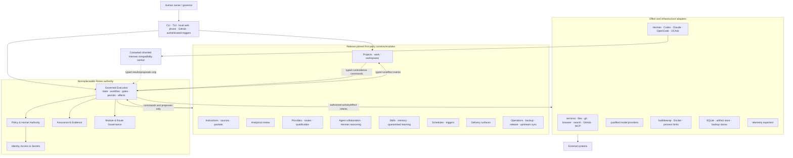

# Hermes-to-Ranex Ground-Zero Full-System Architecture

| Field | Value |
|---|---|
| Architecture ID | `ARCH-RANEX-001` |
| Version | `1.0.0` |
| Status | **NORMATIVE TARGET — CONDITIONALLY ACCEPTED, NOT YET RUNTIME-VALIDATED** |
| Scope | Complete target-system architecture and complete attachment map |
| Date | 2026-07-27 |
| Repository snapshot basis | `bootstrap/pre-upstream`; exact file digests are bound by the final architecture-review evidence packet |
| Product | Ranex |
| Required upstream lineage | Governed software fork of [`nousresearch/hermes-agent`](https://github.com/nousresearch/hermes-agent); current-clone lineage preflight is not yet satisfied |
| Research baseline | Every file under `docs/research/`, read in full |
| Governing development process | [Ranex Core SDLC Operating Model](./CORE_SDLC_OPERATING_MODEL.md) and [control catalog](./SDLC_CONTROL_CATALOG.md) |
| Owner decision | [ADR-0001: Established Software-Development Lifecycle Governs AI Work](./decisions/ADR-0001-established-sdlc-governs-ai-work.md) |
| Primary architecture collaborator | DeepSeek V4 Pro through `deepseek/deepseek-v4-pro` |
| Independent architecture challenger | HY3 through `openrouter/tencent/hy3` |
| Decision authority | Human owner |
| Compatibility/migration class | New Ranex authority core plus strangler migration of an attributed Hermes-derived fork |
| Security/data class | Architecture metadata; public unless an attached evidence packet is explicitly classified |
| Review trigger | Any `MAP-*` failure, authority/boundary change, upstream-baseline adoption, or first runtime tracer |

> **This is the full map, not an MVP map.**
>
> Delivery slices describe the safest route through the map. They do not limit
> the map's extent. Every intended capability has a final owner, boundary,
> attachment point, trust tier, lifecycle, and source location here. A capability
> that is not part of Ranex is explicitly excluded instead of being silently left
> uncharted.

## 1. Purpose and architectural standing

This document is the canonical target architecture for rebuilding Hermes into
Ranex from ground zero while requiring a provable fork relationship, preserved
or reconstructed Git lineage, license provenance, and a governed
upstream-synchronization path.

“Ground zero” means an architectural reset:

- new dependency-clean Ranex domain and application code;
- new canonical identities, state, authority, evidence, and effect contracts;
- no new Ranex business rule added inside the inherited `AIAgent`,
  `run_agent.py`, `SessionDB`, tool registry, plugin loader, or gateway;
- useful Hermes behavior retained only through explicit compatibility and
  adapter boundaries; and
- a strangler cutover in which the new system becomes authoritative before
  inherited internals are removed or selectively extracted.

It does **not** mean:

- an unrelated clean-room repository with no upstream lineage;
- erasing upstream authorship, license notices, or Git history;
- deleting all inherited behavior before a replacement is characterized;
- a big-bang production cutover; or
- allowing upstream layout or implementation details to define the new domain.

The architecture is conditionally accepted as the target. It becomes
runtime-validated only after the acceptance tests in this document pass. Model
review, including DeepSeek V4 Pro and HY3 review, is advisory evidence and is
never an architecture decision by itself.

### 1.1 Software-development process foundation

The architecture is subordinate to the owner-accepted, human-established
software-development lifecycle. Core SDLC owns the product-to-production
process: governance, discovery, requirements, design, planning, build,
independent verification and validation, release, operation, maintenance,
retirement, and improvement.

Ranex does not invent a parallel “AI-native SDLC.” AI agents and inherited
Hermes behavior are bounded workers used inside named lifecycle activities.
They cannot redefine the process, create work-item authority, lower assurance,
approve their own output, or replace accountable product, technical, security,
service, release, configuration, and V&V roles.

### 1.2 Fork-lineage reality and required preflight

The fork relationship is an owner requirement and target constraint, not a
claim that the current Ranex branch already shares upstream ancestry. The
preflight facts were first bound to the architecture at Ranex documentation
commit `3ad04f089c6fe674139f10bfadb1fe7df3e0e4f7`. Later documentation-only
checkpoints do not change the ancestry conclusion; a live head is captured
mechanically in each review/release evidence packet rather than embedded as a
self-invalidating “current” value here. At the recorded preflight:

- the Ranex branch was `bootstrap/pre-upstream`;
- `origin` fetch/push points at `anthonykewl20/ranex`;
- `upstream` fetch points at `NousResearch/hermes-agent` and its push URL is
  disabled;
- the audited Hermes baseline
  `d71033a4077a6dfdcdb42c9e9eeab4c41e4a7012` exists locally as
  `upstream/main` and `phase/1-adopt-upstream`;
- its verified upstream Git tree is
  `129a441930d11bc6bace9c72e81c960289008898`;
- `bootstrap/pre-upstream` still has no merge base with that upstream baseline;
- the root upstream `LICENSE` exists on the upstream baseline but is not yet
  present on the bootstrap branch; and
- `legal/licensing-manifest.json` records `github_network_fork: false`.

A software-derived fork, shared Git ancestry, and GitHub's network-fork flag
are separate facts. Before implementation begins, `FORK-PREFLIGHT` must:

1. preserve the current Ranex commits under an immutable safety ref;
2. retain the exact audited upstream commit in a pristine mirror/worktree and
   verify its tree, license, notices, tags, and source manifest;
3. record the human-selected adoption strategy—prefer replaying the Ranex
   documentation commits on the pinned upstream base when it preserves both
   histories cleanly; otherwise use a provenance-complete history import;
4. keep `upstream` fetch-only and define the final Ranex branch/worktree
   topology;
5. distinguish the observed, audited, incorporated, and latest-seen upstream
   baselines;
6. restore the unchanged upstream license and classify every retained,
   modified, removed, or original file; and
7. prove ancestry/baseline/provenance and update the manifest's network-fork
   field to the actual hosting fact.

Until this gate passes, documentation says **fork target / derived relationship,
upstream fetched, ancestry adoption pending**. It must not say retained upstream
Git history is already proven on the Ranex branch.

## 2. Root architecture decision

The product is a local-first, one-host, batteries-included modular monolith.
Its differentiator is governed execution of probabilistic workers, not the
number of models or tools it can call.

```text
Hermes inheritance:
  mutable agent loop
    -> tools, providers, approvals, memory, plugins, jobs, gateways, state

Ranex target:
  deterministic governed-execution authority
    -> policy and exact-subject authorization
    -> durable state, journal, evidence bindings, permit, and outbox
    -> typed activity/effect dispatch
    -> replaceable reasoning workers, reviewers, tools, and delivery surfaces
```

The controlling assertion is:

> **Ranex owns control, authority, canonical state, and proof. Hermes supplies
> reasoning and selected operational behavior behind a replaceable boundary.**

This assertion is an owner requirement and architecture target. Clean extraction
remains a P0 implementation proof obligation.

## 3. Fixed decisions

| Decision | Canonical position |
|---|---|
| Product form | One release-pinned modular monolith, not a microservice fleet. |
| Development process | The accepted Core SDLC is the governing process; AI-agent L0–L12 is a subordinate worker protocol. |
| Upstream relationship | Ranex is a Hermes-derived software fork; lineage/history/license proof is a blocking preflight, and GitHub network-fork status is tracked separately. |
| New core | Authority, domain, and application code outside the named compatibility adapter has no dependency on inherited Hermes internals. |
| Migration | Strangler migration inside the fork; no big-bang rewrite. |
| Work lifecycle authority | `work_management` owns `WorkItemStatus`; boards, runs, models, and Hermes sessions do not. |
| Canonical authority | One `governed_execution` consistency cell owns run transitions, gate bindings, permit consumption, and effect intent. |
| State storage | One physical SQLite authority database for the local target, with logical context ownership, an append-only journal, and a transactional outbox. |
| Event sourcing | Selective replay journal for governed execution; the whole product is not event sourced. |
| Workflow runtime | A runtime port with a local durable runner as the product default; another engine may implement the same port after an ADR and parity tests. |
| Effects | At-least-once or at-most-once attempt semantics with idempotency and reconciliation; never claim exactly once. |
| Policy failure | Deny visibly. Missing, stale, malformed, unavailable, or conflicting blocking proof cannot pass. |
| Model authority | Models produce proposals and observations. They cannot emit an accepted transition, gate decision, permit, waiver, or human decision. |
| First-party capabilities | Shipped with Ranex behind stable internal interfaces; not user-installed prerequisites. |
| External extensions | Lower-trust, out-of-process, capability-scoped, and permanently outside the authority path. |
| Desktop app | Excluded from the Ranex target. No Electron desktop, desktop bootstrap, or desktop updater. |
| Local UX | CLI, TUI, loopback-only web dashboard, GitHub edge, and a text-phone delivery port. |
| Phone implementation | Telegram is the first mapped text-phone adapter; other channels implement the same delivery/auth contracts. |
| Voice | Mapped as an optional media/transcription adapter, inactive unless a future accepted decision requires it. It never enters the kernel. |
| Public dashboard | Excluded. The web dashboard binds to loopback; private tailnet publication is an explicit delivery adapter and policy decision. |
| Providers | BYOK/local qualified routes only. Ranex has no first-party paid model account. |
| Nous commercial product | Removed, not hidden: no Portal, billing, credits, subscriptions, managed tool pool, purchase path, or commercial fallback. |
| Remote model catalog | Cannot activate models. The qualified route catalog is release-pinned. |
| Risk | Deterministic policy derives risk; worker-supplied risk can only be an untrusted observation. |
| Merge | Human-controlled landing until a later accepted decision changes the policy. |

## 4. Non-negotiable invariants

1. Only `governed_execution` chooses and commits a legal canonical run state.
2. Only the nonreplaceable application policy-enforcement point authorizes an
   effect.
3. Every target-mode effect crosses `CapabilityBus`; no special tool or agent
   path bypasses it.
4. Transitional inherited harnesses are described honestly as activity-boundary
   plus OS-sandbox mediated until their real tool paths pass the bypass matrix.
5. One transaction commits the run version/current row, ordered journal record,
   consumed permit or decision, and outbound effect intent.
6. Kanban, dashboards, Hermes session state, and external systems are projections
   or adapter state, never alternative completion authorities.
7. Every authority and evidence record binds to the exact project, work item,
   run, activity, workspace, base commit, candidate commit, packet digest,
   workflow version, policy snapshot, module profile, and aggregate version
   required by its contract.
8. A maker cannot approve its own subject.
9. A human waiver remains a waiver and never becomes machine `PASS`.
10. Unknown action, role, capability, route, schema, state, or dependency is
    denied by default.
11. A module cannot qualify, grant, activate, promote, quarantine, or retire
    itself.
12. A route cannot establish its own identity, capability profile, independence,
    or qualification.
13. The reducer performs no I/O and reads no wall clock, randomness, environment,
    process global, database, filesystem, network, provider, or Hermes state.
14. The same workflow/interpreter versions and ordered recorded inputs replay to
    the same state and commands.
15. Every retry preserves the same logical idempotency identity or becomes a new
    explicitly related attempt.
16. `OUTCOME_UNKNOWN` is a first-class result and must enter reconciliation.
17. Importing a module causes no registration, environment read, file access,
    network access, thread creation, migration, or other side effect.
18. No external Python plugin runs inside the authority process.
19. Secrets are opaque handles until resolved at the authorized adapter edge.
20. Raw prompts, source, and model output are classified artifacts, not routine
    telemetry.
21. Cross-project data does not enter packets, prompts, workspaces, artifacts,
    logs, learned knowledge, or route-training data without explicit sanitized
    transfer authority.
22. Every upstream synchronization reruns the same de-commercialization,
    architecture, provenance, security, and release gates as a product release.
23. A worker run, merge, deployment, incident, or model observation cannot
    directly advance the canonical Core-SDLC work item; `work_management`
    evaluates the named transition contract and accountable decisions.
24. L0–L12 worker activities, `AI-G*` evidence gates, `MAP-*` map gates, and
    `SDLC-ADOPT-*` process-adoption gates are typed namespaces, not alternative
    work-item states.

## 5. The full system planes

Ranex uses seven planes. A plane is a responsibility and trust boundary, not a
microservice.

| Plane | Owns | Must not own |
|---|---|---|
| Control | Commands, deterministic workflow coordination, legal transitions, effect scheduling | Provider or UI implementation |
| Execution | Isolated activities, tools, models, worktrees, external effects | Canonical completion authority |
| Evidence | Claims, evidence, review observations, checker results, exact-subject bindings | Human or model self-authorization |
| Security | Identity, authentication, grants, data classification, egress, secrets, isolation profiles | Business workflow state |
| Operations | Health, alerting, reconciliation, incidents, capacity, backup, restore | Evidence truth or gate semantics |
| Data lifecycle | Ownership, migration, retention, expiry, purge, replay, recovery | Hidden cross-context storage |
| Compliance and provenance | Licensing, upstream attribution, de-commercialization, SBOM, source classification | Runtime model routing |

## 6. System context



Runtime arrows do not imply source imports. Source dependencies follow the
inward rules in section 13. In particular, no product context reaches an
effect adapter directly; the apparent cycle is typed command/event
coordination, not shared state or a dependency cycle.

## 7. Trust tiers

| Tier | Name | Examples | Execution rule |
|---|---|---|---|
| T0 | Pure authority domain | reducer, run invariants, gate semantics, permit semantics | In-process; standard library plus `foundation`; no I/O |
| T1 | Nonreplaceable application control | authorized transition, PEP, capability bus, UoW, outbox coordinator | In-process; I/O only through ports |
| T2 | Reviewed first-party context/module | packet compiler, checkers, repository intelligence, routing, delivery | In-process only when pure; otherwise isolated |
| T3 | Effect adapter | provider, terminal, GitHub, browser, sandbox, storage | Capability-scoped; isolated as threat model requires |
| T4 | Legacy compatibility | inherited Hermes worker, migration reader, legacy plugin bridge | Separate constrained process; no authority database access |
| T5 | External extension | separately installed integration | Out-of-process narrow protocol; never registers a PEP, gate, state writer, or permit issuer |

## 8. Canonical consistency boundary

### 8.1 The Governed Execution Authority Cell

`governed_execution` is one bounded consistency cell with four cohesive
subdomains:

1. run/workflow lifecycle;
2. exact authorization and gate-decision snapshots;
3. permits and human-decision consumption; and
4. activity/effect intent, result, retry, and reconciliation.

These responsibilities are separate domain files and types, but they participate
in one invariant and one SQLite transaction. They are not persisted as four
independent authorities.

Policy definitions, evidence artifacts, checker qualification, and module/route
catalogs are owned by other contexts. Before a transition, their immutable
decisions and digests are copied or bound into the authority transaction. A
later change cannot rewrite the historical snapshot, while every new effect
still requires current-policy re-evaluation.

`work_management` owns the separate `WorkItem` aggregate and Core-SDLC
transition history. It does not join the run transaction. It consumes
`governed_execution` integration events and submits idempotent commands through
public APIs; failure is retried/reconciled and never simulated as
cross-context atomicity.

`policy` owns the authenticated, append-only `HumanDecisionRecord`.
`governed_execution` owns the exact-subject `ConsumableAuthorityGrant` created
from an eligible decision snapshot. The policy table is never mutated by the
run transaction; grant issuance/consumption and permit issuance/consumption
inside the authority cell are compare-and-swap protected.

### 8.2 Atomic authority transaction

One successful authority command atomically:

```text
compare expected run aggregate version
  -> compare bound policy/module/route/workspace/evidence currency tokens
  -> append ordered run/domain/audit event
  -> update canonical current run row and version
  -> bind exact gate/evidence/policy/module snapshots
  -> issue or consume exact-subject authority grant/permit when required
  -> insert zero or more outbound effect intents in the effect outbox
  -> commit
```

If any write fails, none of them become visible. No external effect runs inside
the database transaction. The outbox relay dispatches after commit using the
recorded idempotency key.

Gate evaluation and permit issuance are explicit state-only authority commands
and normally create zero effects. An authorized workflow transition may create
`0..N` effect intents, each with its own identity, arguments, destination,
capabilities, idempotency semantics, and reconciliation policy. “Every
transition creates one effect” is forbidden.

Immediately before dispatch, the PEP rechecks the current policy activation,
module/profile grant, route lock, workspace/base/candidate identity, evidence
freshness, permit status, deadline, destination, and expected run version. A
changed token denies dispatch or triggers re-authorization; it never inherits
the stale intent's authority.

### 8.3 State versus journal

- The current row is the operational read source.
- The ordered journal is the replay and audit oracle.
- Snapshots may accelerate replay but never replace the journal.
- A current-row/journal mismatch is corruption and blocks advancement; code
  does not choose whichever source is convenient.
- Other context projections are rebuilt or reconciled from canonical events.

### 8.4 Reliable events outside governed execution

Every stateful context commits its aggregate update, local audit event, and
integration-event outbox row in its own unit of work. The governed-execution
effect outbox is not the event-publication mechanism for `policy`,
`work_management`, `module_governance`, `routing`, `identity_access`,
`release_management`, or any other owner.

Consumers are idempotent and record source context, aggregate ID/version,
event ID/schema, correlation/causation IDs, and processed outcome. Cross-context
delivery is at least once; duplicates and out-of-order messages are tested.

## 9. Complete bounded-context ownership map

### 9.1 Nonreplaceable authority contexts

| Context | Owns | Public API | Persistence authority |
|---|---|---|---|
| `governed_execution` | Run, pinned workflow, activities, gate bindings, consumable authority grants, permit issuance/consumption, effect intents/outcomes, reconciliation | Commands, queries, integration events, immutable views | Sole run/execution-transition authority |
| `policy` | Roles, grants, risk-lane derivation, policy packages, activation, authorization decisions, waivers and authenticated human-decision records | Authorization request/decision, active-policy and human-decision snapshots | Policy definitions and append-only decision history; never consumes the execution grant |
| `assurance` | Claims, evidence envelopes, review observations, checker results and gate-evaluation inputs | Evidence ingestion/query, checker result, exact-subject evidence snapshot | Assurance catalog; does not qualify components or commit run state |
| `module_governance` | Module catalog, descriptors, capability vocabulary, grants, compatibility, activation lifecycle | Module/grant/profile snapshots | Module and grant authority |
| `identity_access` | Human/service identities, authentication, sessions, nonces, remote decision authentication, data classification, destination facts, secret references | Principal/session/secret-handle and destination-fact APIs | Identity and access authority; policy decides and the egress adapter enforces |

### 9.2 Product and development contexts

| Context | Owns | Attachment points |
|---|---|---|
| `product_definition` | Actors, problems/needs, hypotheses, product capabilities, requirements, acceptance examples, outcome measures, validation decisions, `CapabilityStatus` | Discovery/user research, product decisions, work intake, outcome review |
| `work_management` | Projects, canonical `WorkItemStatus`, work class, portfolio/queues/WIP, dependencies/risks/issues, technical-debt records, accountable work roles, external issue mapping, Kanban projections | Core-SDLC transition API, GitHub intake, product/requirement links, governed-run/evidence integration |
| `service_management` | Service catalog, service/capability ownership, supported versions, SLIs/SLOs/error budgets, support/escalation, maintenance and retirement triggers | Operations evidence, release catalog, product capability lifecycle |
| `configuration_management` | Configuration-item registry, content-addressed baselines, status accounting, bidirectional traceability graph, functional/physical configuration audits | Product requirements, source/build/test/docs, release manifests, assurance evidence |
| `supplier_governance` | Supplier/dependency adoption and reuse decisions, shared responsibility, version/support/vulnerability monitoring, concentration/exit plans | Packages, toolchains, providers, APIs, extensions, hosted services, Hermes upstream |
| `resource_governance` | Local capacity, cost/token/tool/output/network budgets, reservations, quotas, usage attribution and provider-limit facts | Policy, routing, scheduling, agent runs, operations; never commercial billing |
| `interaction_history` | User conversation/thread/message identity, continuity, search lifecycle, classification, retention, export and deletion | Delivery channels, context compilation, legacy session import |
| `process_assurance` | SDLC policy conformance, tailoring profiles, human-role competence, process audits/nonconformance/corrective action, process improvement evidence | Core SDLC, work records, metrics, training/qualification evidence |
| `workspace` | Repository identity, worktree plans, branch/head validation, landing and cleanup | Git adapter, sandbox mounts |
| `instruction_registry` | Atomic versioned instructions, precedence, applicability, checker bindings | Policy and packet compilation |
| `context_compilation` | Resolved source manifests, packet compilation, context budget, conflicts, provenance | Deterministic and recorded stochastic retrieval |
| `analytical_review` | Review specifications, requests, attempts, observations, parsing, independence facts | Native and tool-bearing review transports |
| `routing` | Provider/model/transport identities, route locks, health, fallback policy inputs | Provider and harness adapters |
| `qualification` | Checker, module, route, and isolation-profile qualification | Frozen fixtures, canaries, holdouts |
| `effectiveness` | Whole-workflow paired evaluation, causal ablations, owner-facing scorecards | Evaluation runners and artifacts |
| `agent_collaboration` | Typed worker assignments, delegation workflows, role separation, worker results | Hermes, Codex, Claude, OpenCode, direct agents |
| `repository_intelligence` | Source graph/index, language coverage, freshness, unsupported-analysis states | Atlas/tree-sitter or simpler index strategies |
| `knowledge` | Skills, project memory, learned records, quarantine, sanitization, transfer approvals | Packet sources and explicitly scoped worker reads |
| `scheduling` | Schedules, authenticated triggers, catch-up rules, trigger lifecycle | Cron, webhooks, external timers |
| `delivery` | Channel-neutral messages, commands, decision challenges, rendering, delivery receipts | CLI, TUI, web, phone, GitHub adapters |
| `artifact_management` | Content-addressed blobs, classification, access, retention, legal hold, expiry, purge | Filesystem/object-store adapters |

### 9.3 Operations, evolution, and boundary contexts

| Context | Owns | Attachment points |
|---|---|---|
| `operations` | Observed health, alerts, `IncidentStatus`, response/recovery evidence, reconciliation scheduling and operator runbooks | Telemetry, delivery, service objectives, external-system probes |
| `backup_restore` | Backup sets, encryption, RPO/RTO policy, restore drills, reconciliation | SQLite, artifacts, configuration, remote stores |
| `release_management` | Build manifest, release profile, install/update/rollback, package/SBOM verification | Installer and updater adapters |
| `upstream_sync` | Upstream baseline, diff classification, anti-recontamination gates, selective porting, sync evidence | Git worktrees and upstream remote |
| `migration` | Schema ordering, upcasters, module migrations, legacy readers, verification, rollback/tombstones | Persistence and compatibility readers |
| `extension_host` | Lower-trust extension protocol, capability grants, lifecycle, quarantine | Out-of-process RPC/MCP-like bridge |
| `compatibility` boundary package | Hermes anti-corruption facade, legacy state/CLI/tool-name translation, contained plugin execution; no canonical lifecycle state | Frozen inherited Hermes subset; `service_management` owns the legacy-surface compatibility lifecycle |
| `provenance_compliance` | File classification, licenses, notices, de-commercialization denylist, SBOM policy | CI, release, upstream sync |

## 10. Full capability attachment matrix

Every target capability must resolve all columns before implementation.

| Capability zone | Owner | Effect/adapter family | Lifecycle owner | Canonical output |
|---|---|---|---|---|
| Workflow and run control | `governed_execution` | workflow runtime | `governed_execution` | Run events and state |
| Policy and risk | `policy` | built-in/OPA PDP | `policy` | Authorization decision snapshot |
| Human decisions | `policy` + `identity_access` | CLI/web/phone/GitHub challenge | `policy` | Authenticated exact-subject decision |
| Evidence and checks | `assurance` | deterministic/model/human checker modules | checker module state in `module_governance`; qualification evidence in `qualification` | Evidence/checker result |
| Permits and effects | `governed_execution` | capability bus/outbox | `governed_execution` | Consumed permit + effect intent/result |
| Modules and capabilities | `module_governance` | composition catalog | `module_governance` | Qualified module profile |
| Routes/providers | `routing` | native model/provider adapters | route state in `routing`; qualification evidence in `qualification` | Route lock and attempt |
| Product discovery/requirements/outcomes | `product_definition` | research, decision and analytics adapters | `product_definition` | Versioned need, requirement, measure and validation decision |
| Core-SDLC projects/work/traceability | `work_management` | transition, portfolio, GitHub and projection adapters | `work_management` | Canonical work item, requirements/outcome links, and projections |
| Services/SLOs/support/lifecycle | `service_management` | service catalog and operational projections | `service_management` | Service objective and capability/support state |
| Configuration/baselines/traceability | `configuration_management` | repository/build/test/release scanners | `configuration_management` | Audited baseline and trace graph |
| Suppliers/dependencies | `supplier_governance` | package/provider/upstream monitors | `supplier_governance` | Adoption/monitoring/exit decision |
| Resource budgets/usage | `resource_governance` | provider/tool/host usage meters | `resource_governance` | Reservation, quota and attributed usage |
| Conversation/session history | `interaction_history` | channel/session/search adapters | `interaction_history` | Classified thread/message record |
| Process assurance | `process_assurance` | conformance/audit/competence adapters | `process_assurance` | Tailoring, nonconformance and corrective-action record |
| Repositories/worktrees | `workspace` | Git/filesystem/sandbox | `workspace` | Validated workspace identity |
| Instructions/context | `instruction_registry`, `context_compilation` | source/retrieval adapters | respective owner | Content-addressed packet |
| Agent collaboration | `agent_collaboration` | Hermes/Codex/Claude/OpenCode | `module_governance` | Worker result/proposal |
| Analytical review | `analytical_review` | native API/isolated CLI | `qualification` | Review observation |
| Tools | `module_governance` catalog | terminal/file/git/browser/search/GitHub/MCP | module + grant lifecycle | Typed activity result |
| Repository intelligence | `repository_intelligence` | parsers/indexers | `qualification` | Versioned derived evidence |
| Skills/memory/learning | `knowledge` | storage/retrieval | quarantine/approval lifecycle | Scoped knowledge record |
| Schedules/triggers | `scheduling` | cron/webhook/timer source | schedule lifecycle | Authenticated trigger event |
| CLI/TUI/web/phone/GitHub | `delivery` | inbound/outbound adapters | channel config lifecycle | Typed command/receipt |
| Authentication/secrets | `identity_access` | keyring/file/vault/OAuth adapters | identity/session/secret lifecycle | Principal or secret handle |
| Artifacts | `artifact_management` | filesystem/object store | retention lifecycle | Content digest/reference |
| Evaluation/qualification | `qualification`, `effectiveness` | runners/graders | immutable trial/qualification/experiment protocol; subject owner changes activation state | Qualification or metric vector |
| Observability/operations | `operations` | OTLP/log/metric exporters | incident/health lifecycle | Noncanonical telemetry |
| Backup/restore | `backup_restore` | encrypted local/remote stores | backup-set lifecycle | Verified recovery point |
| Install/update/release | `release_management` | package/installer/updater | release lifecycle | Signed/pinned release manifest |
| Upstream sync | `upstream_sync` | Git sync worktree | sync-candidate lifecycle | Accepted/rejected port set |
| Migrations | `migration` | schema/legacy readers | migration lifecycle | Verified migration record |
| External extensions | `extension_host` | isolated RPC bridge | extension lifecycle | Typed proposal/effect request |
| Legacy Hermes compatibility | `service_management` for lifecycle; `compatibility` for translation/execution | anti-corruption facade and constrained legacy worker | `service_management` owns `CompatibilityStatus` | Versioned compatibility contract, translation result, and removal evidence |
| Legal/de-commercialization | `provenance_compliance` | CI scanners/SBOM | release and sync gates | Compliance decision |
| Contract/schema generation | `configuration_management` orchestrates from accepted source-owner registries | deterministic contract compiler and language generators | source context owns semantics; `configuration_management` owns baseline/reproducibility | Registry digest, generated Python/TypeScript packages, drift/audit result |

## 11. Complete target repository map

The tree is the end-state destination map. Directories may be populated in safe
slices, but their ownership and dependency positions are fixed now.

```text
ranex/
├── pyproject.toml
├── uv.lock
├── README.md
├── LICENSE
├── LICENSE-RANEX.md
├── NOTICE.md
├── src/
│   └── ranex/
│       ├── foundation/
│       │   ├── ids.py
│       │   ├── canonical.py
│       │   ├── versions.py
│       │   ├── errors.py
│       │   └── time_types.py
│       ├── governed_execution/
│       │   ├── README.md
│       │   ├── contract.yaml
│       │   ├── api/
│       │   │   ├── commands.py
│       │   │   ├── queries.py
│       │   │   ├── integration_events.py
│       │   │   └── views.py
│       │   ├── domain/
│       │   │   ├── run.py
│       │   │   ├── workflow.py
│       │   │   ├── state.py
│       │   │   ├── commands.py
│       │   │   ├── events.py
│       │   │   ├── activities.py
│       │   │   ├── gates.py
│       │   │   ├── permits.py
│       │   │   ├── effects.py
│       │   │   ├── decisions.py
│       │   │   ├── invariants.py
│       │   │   └── reducer.py
│       │   └── application/
│       │       ├── handlers/
│       │       ├── authorized_transition.py
│       │       ├── process_manager.py
│       │       ├── capability_bus.py
│       │       ├── reconciliation.py
│       │       ├── outbox_relay.py
│       │       └── ports/
│       │           ├── unit_of_work.py
│       │           ├── workflow_runtime.py
│       │           ├── activity_transport.py
│       │           ├── effect_dispatch.py
│       │           ├── policy_decision.py
│       │           ├── evidence_catalog.py
│       │           ├── artifact_store.py
│       │           ├── clock.py
│       │           ├── id_source.py
│       │           ├── secret_resolver.py
│       │           └── telemetry.py
│       ├── policy/
│       ├── assurance/
│       ├── module_governance/
│       ├── identity_access/
│       ├── product_definition/
│       ├── work_management/
│       ├── service_management/
│       ├── configuration_management/
│       ├── supplier_governance/
│       ├── resource_governance/
│       ├── interaction_history/
│       ├── process_assurance/
│       ├── workspace/
│       ├── instruction_registry/
│       ├── context_compilation/
│       ├── analytical_review/
│       ├── routing/
│       ├── qualification/
│       ├── effectiveness/
│       ├── agent_collaboration/
│       ├── repository_intelligence/
│       ├── knowledge/
│       ├── scheduling/
│       ├── delivery/
│       ├── artifact_management/
│       ├── operations/
│       ├── backup_restore/
│       ├── release_management/
│       ├── upstream_sync/
│       ├── migration/
│       ├── extension_host/
│       ├── provenance_compliance/
│       ├── modules/
│       │   ├── hermes_reasoning/
│       │   ├── deterministic_checks/
│       │   ├── context_selection/
│       │   ├── repository_mappers/
│       │   ├── review_strategies/
│       │   ├── routing_strategies/
│       │   ├── schedule_engine/
│       │   ├── knowledge_backends/
│       │   └── delivery_services/
│       ├── adapters/
│       │   ├── inbound/
│       │   │   ├── cli/
│       │   │   ├── tui/
│       │   │   ├── web/
│       │   │   ├── phone/
│       │   │   │   ├── telegram/
│       │   │   │   └── media_transcription/
│       │   │   ├── github/
│       │   │   └── webhook/
│       │   ├── outbound/
│       │   │   ├── cli/
│       │   │   ├── web/
│       │   │   ├── phone/
│       │   │   ├── github/
│       │   │   └── notifications/
│       │   ├── persistence/
│       │   │   └── sqlite/
│       │   │       ├── repositories/
│       │   │       └── migrations/
│       │   ├── artifacts/
│       │   │   ├── filesystem/
│       │   │   └── object_store/
│       │   ├── workflow/
│       │   │   ├── local/
│       │   │   └── temporal/
│       │   ├── policy/
│       │   │   ├── builtin/
│       │   │   └── opa/
│       │   ├── providers/
│       │   │   ├── openrouter/
│       │   │   ├── deepseek/
│       │   │   ├── openai/
│       │   │   ├── anthropic/
│       │   │   └── local_openai_compatible/
│       │   ├── harnesses/
│       │   │   ├── hermes/
│       │   │   ├── codex/
│       │   │   ├── claude/
│       │   │   ├── opencode/
│       │   │   └── ocask/
│       │   ├── tools/
│       │   │   ├── terminal/
│       │   │   ├── filesystem/
│       │   │   ├── git/
│       │   │   ├── github/
│       │   │   ├── browser/
│       │   │   ├── search/
│       │   │   └── mcp/
│       │   ├── platform/
│       │   │   ├── egress/
│       │   │   ├── network/
│       │   │   ├── process/
│       │   │   └── filesystem/
│       │   ├── authentication/
│       │   │   ├── local_os/
│       │   │   ├── web_session/
│       │   │   ├── github/
│       │   │   └── telegram/
│       │   ├── qualification/
│       │   │   ├── fixture_runner/
│       │   │   ├── grader/
│       │   │   └── canary/
│       │   ├── migration/
│       │   │   ├── sqlite/
│       │   │   └── legacy_hermes/
│       │   ├── triggers/
│       │   │   ├── local_scheduler/
│       │   │   ├── cron/
│       │   │   └── authenticated_webhook/
│       │   ├── sandbox/
│       │   │   ├── bubblewrap/
│       │   │   └── docker/
│       │   ├── secrets/
│       │   │   ├── keyring/
│       │   │   ├── protected_file/
│       │   │   └── environment_projection/
│       │   ├── observability/
│       │   │   └── otel/
│       │   ├── backup/
│       │   │   ├── encrypted_filesystem/
│       │   │   └── remote_store/
│       │   ├── release/
│       │   │   ├── package_builder/
│       │   │   ├── installer/
│       │   │   ├── updater/
│       │   │   └── rollback/
│       │   └── extensions/
│       │       └── rpc_bridge/
│       ├── compatibility/
│       │   ├── hermes_legacy/
│       │   ├── legacy_plugins/
│       │   ├── legacy_state/
│       │   ├── legacy_cli/
│       │   └── old_tool_names/
│       └── bootstrap/
│           ├── catalog.py
│           ├── profiles.py
│           ├── composition.py
│           ├── maintenance_controller.py
│           ├── lifecycle.py
│           └── main.py
├── apps/
│   └── web-dashboard/
│       ├── src/
│       └── tests/
├── packages/
│   └── generated-contracts/
│       ├── python/
│       └── typescript/
├── config/
│   ├── release-profiles/
│   ├── workflows/
│   ├── policies/
│   ├── instructions/
│   ├── roles/
│   ├── capabilities/
│   ├── routes/
│   ├── isolation/
│   ├── retention/
│   ├── services/
│   ├── suppliers/
│   ├── budgets/
│   ├── process-tailoring/
│   └── upstream-sync/
├── schemas/
│   ├── identity/
│   ├── work/
│   ├── product/
│   ├── services/
│   ├── configuration/
│   ├── suppliers/
│   ├── resources/
│   ├── interactions/
│   ├── process/
│   ├── execution/
│   ├── policy/
│   ├── assurance/
│   ├── modules/
│   ├── routes/
│   ├── review/
│   ├── artifacts/
│   ├── operations/
│   ├── release/
│   └── lifecycle/
├── architecture/
│   ├── contracts/
│   │   ├── identities.yaml
│   │   ├── states.yaml
│   │   ├── roles.yaml
│   │   ├── work-classes.yaml
│   │   ├── risk-lanes.yaml
│   │   ├── capabilities.yaml
│   │   ├── module-graph.yaml
│   │   ├── state-ownership.yaml
│   │   ├── path-ownership.yaml
│   │   ├── lifecycles.yaml
│   │   ├── lifecycle-crosswalks.yaml
│   │   ├── gate-namespaces.yaml
│   │   ├── invalidation-graph.yaml
│   │   ├── event-registry.yaml
│   │   ├── authority-matrix.yaml
│   │   ├── schema-compatibility.yaml
│   │   └── source-precedence.yaml
│   └── generated/
├── tests/
│   ├── architecture/
│   ├── unit/
│   ├── contract/
│   ├── replay/
│   ├── persistence/
│   ├── integration/
│   ├── security/
│   ├── crash/
│   ├── e2e/
│   ├── qualification/
│   ├── effectiveness/
│   └── operations/
├── docs/
│   ├── architecture/
│   ├── research/
│   ├── adr/
│   ├── rfc/
│   ├── specifications/
│   └── operations/
├── scripts/
│   ├── architecture/
│   ├── release/
│   ├── migration/
│   └── upstream-sync/
├── tools/
│   └── contract-codegen/
│       ├── README.md
│       ├── fixtures/
│       └── src/
├── legacy/
│   └── hermes/
│       ├── agent/
│       ├── tools/
│       ├── plugins/
│       ├── gateway/
│       ├── cron/
│       └── compatibility_entry.py
└── legal/
    ├── licensing-manifest.json
    ├── upstream-provenance/
    └── decommercialization-denylist.yaml
```

There is deliberately no `apps/desktop/`.

### 11.1 Physical coexistence during the strangler

The target tree above is not a command to move 170,000 inherited lines on the
first implementation day. During migration:

1. upstream paths remain in their inherited root locations to minimize sync
   churn;
2. new code lives under `src/ranex`;
3. only `ranex.compatibility.hermes_legacy` may import inherited root modules;
4. target drivers import the compatibility facade, never `run_agent` directly;
5. the upstream-sync worktree compares and classifies new upstream changes;
6. selected inherited code is extracted behind a Ranex-owned port;
7. the remaining frozen subset moves under `legacy/hermes` only after parity and
   sync-cost tests pass; and
8. Git history and upstream attribution remain even when source is later
   removed.

## 12. Standard bounded-context package contract

Every stateful context follows:

```text
<context>/
├── README.md             # vocabulary, owner, invariants, public seams
├── contract.yaml         # allowed dependencies, capabilities, schemas, events
├── api/                  # the only cross-context source import surface
├── domain/               # pure model and decisions
└── application/          # use cases, handlers, ports, orchestration
```

Rules:

- `api/` exposes commands, queries, integration events, and immutable views.
- `domain/` contains no clients, repositories, SDKs, callbacks, ORM models,
  environment reads, or framework decorators.
- `application/` owns use cases and ports but imports another context only
  through its `api/`.
- database row models and wire payload models live in adapters, not domain.
- no generic `utils.py`, `common.py`, `manager.py`, or `service.py` dumping
  ground is allowed without a narrow named responsibility.
- a module descriptor names its factory; import does not register the module.

### 12.1 Canonical file-responsibility catalog

The table fixes the intended file names and responsibility centers. A slice may
create only the files it implements, but new responsibilities must land in
their mapped file rather than an ad hoc manager or utility file.

| Context | Domain/API files | Application/port files |
|---|---|---|
| `policy` | `api/{commands,queries,views}.py`; `domain/{principals,roles,grants,risk,policy_packages,activation,authorization,human_decisions,waivers,invariants}.py` | `application/{authorization_service,risk_service,human_decision_service}.py`; `application/ports/{policy_engine,decision_store}.py` |
| `assurance` | `api/{commands,queries,views}.py`; `domain/{claims,evidence,observations,checker_results,coverage,freshness,independence,evidence_snapshots}.py` | `application/{ingestion_service,checker_service,snapshot_service}.py`; `application/ports/{checker_transport,evidence_repository}.py` |
| `module_governance` | `api/{commands,queries,views}.py`; `domain/{descriptors,interfaces,capabilities,grants,profiles,lifecycle,qualification_refs,invariants}.py` | `application/{catalog_service,activation_service,grant_service,profile_service}.py`; `application/ports/{module_factory,module_state_store}.py` |
| `identity_access` | `api/{commands,queries,views}.py`; `domain/{principals,authentication,sessions,nonces,data_classification,destination_facts,secret_refs,invariants}.py` | `application/{authentication_service,session_service,destination_fact_service,secret_projection_service}.py`; `application/ports/{authenticator,secret_backend,destination_resolver}.py` |
| `product_definition` | `api/{commands,queries,events,views}.py`; `domain/{actors,needs,hypotheses,capabilities,requirements,acceptance_examples,outcome_measures,validation_decisions,capability_status,invariants}.py` | `application/{discovery_service,requirements_service,validation_service,capability_lifecycle_service}.py`; `application/ports/{research_source,outcome_analytics}.py` |
| `work_management` | `api/{commands,queries,events,views}.py`; `domain/{projects,work_items,work_item_status,work_classes,outcome_refs,requirement_refs,configuration_refs,accountable_roles,queues,external_refs,projections,invariants}.py` | `application/{intake_service,transition_service,link_service,queue_service,projection_service}.py`; `application/ports/{issue_tracker,work_repository}.py` |
| `service_management` | `api/{commands,queries,events,views}.py`; `domain/{services,owners,supported_versions,slis,slos,error_budgets,support,maintenance_triggers,retirement_triggers,invariants}.py` | `application/{catalog_service,objective_service,support_service,lifecycle_trigger_service}.py`; `application/ports/{service_catalog,operational_evidence}.py` |
| `configuration_management` | `api/{commands,queries,events,views}.py`; `domain/{configuration_items,baselines,status_accounting,trace_links,audits,drift,generation_manifests,invariants}.py` | `application/{baseline_service,traceability_service,audit_service,drift_service,contract_generation_service}.py`; `application/ports/{configuration_scanner,baseline_store,contract_registry,code_generator}.py` |
| `supplier_governance` | `api/{commands,queries,events,views}.py`; `domain/{suppliers,dependencies,adoption_decisions,shared_responsibility,monitoring,concentration,exit_plans,invariants}.py` | `application/{adoption_service,monitoring_service,reassessment_service,exit_service}.py`; `application/ports/{dependency_inventory,supplier_probe}.py` |
| `resource_governance` | `api/{commands,queries,events,views}.py`; `domain/{budgets,reservations,quotas,usage,attribution,provider_limits,invariants}.py` | `application/{reservation_service,usage_service,quota_service,reconciliation_service}.py`; `application/ports/{usage_meter,rate_card,host_capacity}.py` |
| `interaction_history` | `api/{commands,queries,events,views}.py`; `domain/{threads,messages,participants,continuity,classification,retention,export,deletion,invariants}.py` | `application/{thread_service,message_service,search_service,retention_service}.py`; `application/ports/{history_store,search_index,legacy_session_reader}.py` |
| `process_assurance` | `api/{commands,queries,events,views}.py`; `domain/{tailoring_profiles,competence_profiles,audits,nonconformances,corrective_actions,process_measures,improvement_proposals,invariants}.py` | `application/{tailoring_service,audit_service,competence_service,corrective_action_service}.py`; `application/ports/{process_evidence,training_registry}.py` |
| `workspace` | `api/{commands,queries,views}.py`; `domain/{repository_identity,workspace_identity,worktree_plan,branch_policy,landing_plan,invariants}.py` | `application/{workspace_service,head_validation,landing_service,cleanup_service}.py`; `application/ports/{git,filesystem,sandbox_mount}.py` |
| `instruction_registry` | `api/{commands,queries,views}.py`; `domain/{instructions,scope,applicability,precedence,coverage,lifecycle,invariants}.py` | `application/{registry_service,activation_service,coverage_service}.py`; `application/ports/{instruction_repository}.py` |
| `context_compilation` | `api/{commands,queries,views}.py`; `domain/{source_records,precedence,freshness,conflicts,budgets,manifests,packets,invariants}.py` | `application/{source_resolver,packet_compiler,rendering_service}.py`; `application/ports/{source_provider,retrieval_activity}.py` |
| `analytical_review` | `api/{commands,queries,views}.py`; `domain/{review_specs,requests,attempts,observations,parsing,independence,failure_taxonomy,invariants}.py` | `application/{review_service,normalization_service,independence_service}.py`; `application/ports/{analytical_transport,review_artifacts}.py` |
| `routing` | `api/{commands,queries,views}.py`; `domain/{model_identity,transport_identity,route_locks,catalog,health,fallback_policy,lifecycle,invariants}.py` | `application/{route_service,health_service,fallback_service}.py`; `application/ports/{provider_probe,usage_pricing}.py` |
| `qualification` | `api/{commands,queries,views}.py`; `domain/{subjects,fixture_suites,trials,thresholds,calibration,qualification_records,expiry,invariants}.py` | `application/{qualification_service,canary_service,requalification_service}.py`; `application/ports/{trial_runner,grader}.py` |
| `effectiveness` | `api/{commands,queries,views}.py`; `domain/{experiments,arms,trials,metrics,uncertainty,scorecards,ablation,invariants}.py` | `application/{experiment_service,analysis_service,report_service}.py`; `application/ports/{workflow_runner,effectiveness_grader}.py` |
| `agent_collaboration` | `api/{commands,queries,views}.py`; `domain/{assignments,worker_identity,roles,delegation,results,handoffs,independence,invariants}.py` | `application/{dispatch_service,delegation_service,handoff_service}.py`; `application/ports/{agent_driver,harness_transport}.py` |
| `repository_intelligence` | `api/{commands,queries,views}.py`; `domain/{repository_snapshot,symbols,dependencies,coverage,unsupported,freshness,findings}.py` | `application/{index_service,query_service,evidence_service}.py`; `application/ports/{parser,index_store}.py` |
| `knowledge` | `api/{commands,queries,views}.py`; `domain/{skills,memory_records,learning_records,provenance,quarantine,sanitization,transfer,lifecycle,invariants}.py` | `application/{ingestion_service,approval_service,retrieval_service,transfer_service}.py`; `application/ports/{knowledge_store,sanitizer}.py` |
| `scheduling` | `api/{commands,queries,events,views}.py`; `domain/{schedules,triggers,authentication,catch_up,lifecycle,invariants}.py` | `application/{schedule_service,trigger_service}.py`; `application/ports/{trigger_source,schedule_store}.py` |
| `delivery` | `api/{commands,queries,views}.py`; `domain/{messages,commands,decision_challenges,receipts,channels,rendering,lifecycle}.py` | `application/{command_service,notification_service,decision_challenge_service}.py`; `application/ports/{inbound_channel,outbound_channel}.py` |
| `artifact_management` | `api/{commands,queries,views}.py`; `domain/{artifact_refs,classification,access,retention,legal_hold,expiry,purge,lifecycle,invariants}.py` | `application/{ingestion_service,access_service,retention_service,gc_service}.py`; `application/ports/{blob_store,artifact_catalog}.py` |
| `operations` | `api/{commands,queries,events,views}.py`; `domain/{health,alerts,incidents,capacity,reconciliation,service_levels,runbooks,lifecycle}.py` | `application/{health_service,alert_service,incident_service,reconciliation_service}.py`; `application/ports/{telemetry_query,notification}.py` |
| `backup_restore` | `api/{commands,queries,views}.py`; `domain/{backup_sets,recovery_points,encryption_policy,rpo_rto,restore_plans,verification,lifecycle}.py` | `application/{backup_service,restore_service,reconcile_restore}.py`; `application/ports/{backup_store,snapshot_provider}.py` |
| `release_management` | `api/{commands,queries,views}.py`; `domain/{release_manifest,builds,profiles,packages,sbom,installations,updates,rollbacks,lifecycle,invariants}.py` | `application/{build_service,release_service,install_service,update_service,rollback_service}.py`; `application/ports/{package_builder,installer}.py` |
| `upstream_sync` | `api/{commands,queries,views}.py`; `domain/{baselines,candidates,diff_classification,port_sets,anti_recontamination,lifecycle,invariants}.py` | `application/{fetch_service,classify_service,challenge_service,port_service,verify_service}.py`; `application/ports/{upstream_git,sync_worktree}.py` |
| `migration` | `api/{commands,queries,views}.py`; `domain/{migration_plans,dependencies,upcasters,active_run_policy,rollback,tombstones,lifecycle,invariants}.py` | `application/{planning_service,apply_service,verify_service,rollback_service}.py`; `application/ports/{schema_backend,legacy_reader}.py` |
| `extension_host` | `api/{commands,queries,views}.py`; `domain/{extension_descriptor,protocol_versions,capabilities,grants,lifecycle,quarantine,invariants}.py` | `application/{registration_service,session_service,quarantine_service}.py`; `application/ports/{extension_transport}.py` |
| `provenance_compliance` | `api/{commands,queries,views}.py`; `domain/{file_classification,licenses,notices,source_records,denylist,sbom_policy,compliance_decisions}.py` | `application/{classification_service,license_service,decommercialization_service,release_gate}.py`; `application/ports/{source_scanner,sbom_scanner,network_probe}.py` |
| `compatibility` (exceptional boundary package, not an authority context) | `api/{legacy_requests,legacy_results,views}.py`; `hermes_legacy/`, `legacy_plugins/`, `legacy_state/`, `legacy_cli/`, `old_tool_names/` | `application/{translation_service,legacy_worker_service}.py`; `application/ports/{legacy_process,legacy_state_reader}.py`; it owns no canonical state and submits only typed results/proposals |

`governed_execution` remains the only expanded authority cell in the physical
tree because its exact internal partition is itself a critical invariant. The
other contexts use this catalog plus the standard package contract.

Every stateful context also has a narrowly typed local `unit_of_work.py` and
`integration_event_outbox.py` port even when omitted from the compact table.
Their adapters atomically persist that context's aggregate and integration
events; they do not share the governed-execution effect outbox.

### 12.2 Web dashboard structure

The web dashboard is a presentation application, not another control plane:

```text
apps/web-dashboard/src/
├── app/
├── features/
│   ├── runs/
│   ├── work/
│   ├── evidence/
│   ├── decisions/
│   ├── modules/
│   ├── routes/
│   ├── operations/
│   └── recovery/
├── generated-contracts/
├── transport/
└── security/
```

It imports generated TypeScript contracts, calls authenticated application
APIs, and renders returned authority state. It contains no transition table,
gate rule, permit rule, risk rule, or provider credential.

## 13. Enforced source dependency rules

1. `foundation` imports the Python standard library only and has a strict size
   and consumer review budget.
2. Any `domain/` imports only its own context domain and `foundation`.
3. A context crosses another context only through `<other>.api`.
4. Application code imports ports, never adapter implementations.
5. Adapters implement ports and may import public APIs.
6. No adapter imports another adapter; shared host mechanics become a narrowly
   named port or platform adapter.
7. Only `bootstrap/composition.py` constructs concrete implementations, reads
   runtime environment configuration, and binds factories.
8. Nonreplaceable contexts never import `modules`, `adapters`,
   `compatibility`, or `legacy`.
9. First-party modules submit commands, proposals, and evidence; they cannot
   write authority tables.
10. `compatibility` may call Ranex public APIs; no Ranex context imports
    compatibility.
11. Only the Hermes compatibility adapter may import the inherited Hermes root
    during migration.
12. External extensions cannot import the host package; they communicate
    through the versioned process protocol.
13. The declared module graph is acyclic and is checked against actual imports.
14. `ExecutionContext` is forbidden as a domain-method parameter. Domain methods
    receive the smallest immutable subject view.
15. `scripts/` contains thin authenticated clients of public application APIs;
    no script imports repositories/adapters or performs an unrecorded
    install/update/migration/restore effect.
16. Only `compatibility.hermes_legacy` may import inherited Hermes roots during
    the strangler; no authority, domain, or other application package may.

## 14. Composition and boot

Boot is explicit and deterministic:

```text
load release manifest and schema versions
  -> validate build/provenance/de-commercialization manifest
  -> load typed configuration without importing inactive modules
  -> construct identity, authority store, artifact store, and core ports
  -> run pending approved migrations under migration coordinator
  -> build the release-pinned module graph
  -> reject missing, duplicate, cyclic, incompatible, unqualified, or
     undeclared components
  -> start outbox/reconciliation/trigger workers
  -> bind local delivery surfaces
  -> report readiness
```

There is no import-time discovery, entry-point override, or remote catalog
activation in the authority process.

### 14.1 Signed maintenance controller

Install, update, boot migration, offline restore, and rollback sometimes occur
before the normal authority host is available. They do not become shell-script
bypasses. A minimal signed `maintenance_controller`:

- accepts only versioned release/migration/restore commands and schemas;
- verifies operator authentication, target identity, release manifest,
  provenance, signatures/attestations, compatibility, recovery point, and
  predeclared rollback;
- invokes `release_management`, `migration`, and `backup_restore` application
  APIs under a dedicated maintenance policy/profile;
- has no model, arbitrary tool, plugin, browser, or general network capability;
- writes an append-only maintenance journal and content-addressed evidence;
- uses plan/verify/apply/verify/reconcile phases with idempotent steps; and
- hands the final state to the normal authority host, which refuses readiness
  until reconciliation passes.

Command-line scripts are clients of this controller. A recovery procedure that
cannot run the normal PEP uses this smaller signed authority—not raw adapter or
database access—and requires the named offline human decision.

## 15. Canonical identity and subject model

All internal IDs are opaque prefixed strings. The canonical generation profile
is a prefix plus UUIDv7; adapters may retain external numeric IDs only as typed,
namespaced external references.

```text
ProjectId        prj_<uuidv7>
RepositoryId     repo_<uuidv7>
WorkItemId       work_<uuidv7>
RequirementId    req_<uuidv7>
CapabilityId     cap_<uuidv7>
ServiceId        svc_<uuidv7>
ConfigurationId  ci_<uuidv7>
BaselineId       baseline_<uuidv7>
RunId            run_<uuidv7>
ActivityId       act_<uuidv7>
EffectId         eff_<uuidv7>
WorkspaceId      wsp_<uuidv7>
PacketId         pkt_<uuidv7>
EvidenceId       evd_<uuidv7>
ArtifactId       art_<content-digest or uuidv7>
GateId           gate_<uuidv7>
PermitId         permit_<uuidv7>
DecisionId       dec_<uuidv7>
PrincipalId      principal_<uuidv7>
ModuleId         stable dotted identifier
RouteLockId      route_<uuidv7>
MigrationId      mig_<uuidv7>
IncidentId       incident_<uuidv7>
ReleaseId        release_<uuidv7>
ThreadId         thread_<uuidv7>
SupplierId       supplier_<uuidv7>
ReservationId    reservation_<uuidv7>
```

`ExecutionSubject`, `AuthorizationSubject`, `EvidenceSubject`, and
`ArtifactSubject` are separate immutable views. The full command-boundary
envelope is not ambient state and contains no service handles.

The minimum exact-subject tuple is:

```text
project_id
work_item_id
run_id
activity/effect identity when applicable
workspace_id
repository identity
base commit
candidate commit or artifact digest
task-packet digest
workflow definition + interpreter version
policy activation + decision digest
module profile + grant digest
schema registry version
expected run aggregate version
```

## 16. Canonical state axes

One overloaded “office stage” is prohibited.

| Axis | Canonical values |
|---|---|
| `WorkItemStatus` | `FUNNEL`, `TRIAGE`, `DISCOVERY`, `DEFINITION`, `DESIGN`, `READY`, `IN_PROGRESS`, `VERIFICATION`, `RELEASE_READY`, `RELEASING`, `OPERATING`, `OUTCOME_REVIEW`, `CLOSED`, `BLOCKED`, `CANCELLED`, `ROLLED_BACK` |
| `WorkClass` | `PRODUCT`, `DEFECT`, `RELIABILITY`, `SECURITY_PRIVACY`, `ARCHITECTURE_PLATFORM`, `COMPLIANCE_PROVENANCE`, `UPSTREAM_SYNC`, `MAINTENANCE`, `RETIREMENT`, `INCIDENT_RESPONSE` |
| `RiskLane` | `STANDARD`, `ENHANCED`, `CRITICAL`, `EMERGENCY` |
| `RunStatus` | `PROPOSED`, `READY`, `RUNNING`, `WAITING`, `BLOCKED`, `SUCCEEDED`, `FAILED`, `CANCELLED` |
| `RuleStage` | Derived policy classifier: `GOVERNANCE`, `DISCOVERY`, `REQUIREMENTS`, `DESIGN`, `PLANNING`, `IMPLEMENTATION`, `VERIFICATION`, `RELEASE`, `OPERATIONS`, `OUTCOME_REVIEW`, `MAINTENANCE`, `RETIREMENT` |
| `IncidentStatus` | `DETECTED`, `ACKNOWLEDGED`, `MITIGATING`, `MITIGATED`, `RECOVERY_VERIFIED`, `REVIEWED`, `ACTIONS_TRACKED`, `CLOSED` |
| `ReleaseStatus` | `PLANNED`, `BUILT`, `VERIFIED`, `RELEASE_READY`, `RELEASING`, `OPERATING`, `ROLLED_BACK`, `WITHDRAWN` |
| `CapabilityStatus` | `PROPOSED`, `SUPPORTED`, `DEPRECATED`, `RETIRE_READY`, `RETIRING`, `RETIRED` |
| `ActivityStatus` | `REQUESTED`, `DISPATCHED`, `SUCCEEDED`, `FAILED_RETRYABLE`, `FAILED_PERMANENT`, `TIMED_OUT`, `CANCELLED`, `DENIED`, `OUTCOME_UNKNOWN` |
| `GateOutcome` | `PASS`, `FAIL`, `UNKNOWN`, `CONFLICT`, `NOT_APPLICABLE`, `CHECKER_FAULT` |
| `ObservationState` | `OPINION_PRODUCED`, `NO_OPINION`, `OPINION_UNUSABLE`, `EVALUATION_INCOMPLETE` |
| `PermitStatus` | `ISSUED`, `CONSUMED`, `EXPIRED`, `REVOKED` |
| `HumanDecisionRecordStatus` | `PENDING`, `APPROVED`, `DENIED`, `EXPIRED`, `REVOKED` |
| `AuthorityGrantStatus` | `ISSUED`, `CONSUMED`, `EXPIRED`, `REVOKED` |
| `EffectStatus` | `INTENDED`, `DISPATCHED`, `SUCCEEDED`, `FAILED_RETRYABLE`, `FAILED_PERMANENT`, `DENIED`, `OUTCOME_UNKNOWN` |
| `ReconciliationStatus` | `NOT_REQUIRED`, `PENDING`, `RUNNING`, `RESOLVED`, `UNRESOLVED` with preserved discovered effect disposition |
| `ModuleStatus` | `PACKAGED`, `DISABLED`, `QUALIFIED`, `CANARY`, `ACTIVE`, `RESTRICTED`, `QUARANTINED`, `RETIRED` |
| `RouteStatus` | `UNCONFIGURED`, `AUTHENTICATED`, `SMOKE_TESTED`, `PROBATION`, `APPROVED`, `RESTRICTED`, `SUSPENDED`, `RETIRED` |
| `ExtensionStatus` | `DISCOVERED`, `QUARANTINED`, `REVIEWED`, `QUALIFIED`, `PINNED`, `ENABLED`, `SUSPENDED`, `RETIRED` |
| `CompatibilityStatus` | `SUPPORTED`, `DEPRECATED`, `READ_ONLY`, `REMOVED`; owned by `service_management` for each registered legacy surface |
| `InstructionStatus` | `DRAFT`, `ACTIVE`, `DEPRECATED`, `RETIRED` |
| `ArtifactStatus` | `INGESTED`, `QUARANTINED`, `AVAILABLE`, `EXPIRED`, `LEGAL_HOLD`, `PURGED` |
| `MigrationStatus` | `PLANNED`, `TESTED`, `APPLIED`, `VERIFIED`, `ROLLED_BACK`, `FAILED` |
| `SyncCandidateStatus` | `OBSERVED`, `FETCHED`, `PINNED`, `CLASSIFIED`, `DISPOSITIONED`, `PORTING`, `PORT_CANDIDATE`, `VERIFIED`, `RELEASED`, `BASELINE_RECORDED`, `REJECTED`, `DEFERRED`, `BLOCKED`, `ROLLED_BACK` |
| `UpdateStatus` | `CHECKED`, `DOWNLOADED`, `VERIFIED`, `SNAPSHOTTED`, `STAGED`, `MIGRATED`, `ACTIVATED`, `HEALTH_VERIFIED`, `COMPLETED`, `ROLLED_BACK`, `RECOVERY_VERIFIED` |
| `CutoverStatus` | `BOOTSTRAP`, `LEGACY_BASELINE`, `TRANSITIONAL_DUAL_RUN`, `TARGET_SHADOW`, `TARGET_LIMITED`, `TARGET_DEFAULT`, `LEGACY_FROZEN`, `LEGACY_REMOVED` |

`WorkflowNodeId` is a versioned node from the pinned workflow definition; it is
not another run-status enum. A waiver is a `HumanDecision`, not a gate outcome.

### 16.1 Core-SDLC and execution boundary

- `product_definition` owns capabilities, needs, requirements, outcomes, and
  product validation.
- `work_management` alone transitions `WorkItemStatus`.
- one work item may have many `Run` attempts; `governed_execution` alone
  transitions each `RunStatus`.
- `operations` owns incidents; `release_management` owns release/update state;
  `service_management` owns service commitments and lifecycle triggers.
- maintenance, retirement, and incident response create linked work items with
  the applicable `WorkClass`; they do not smuggle new values into
  `WorkItemStatus`.
- a run success, merge, release, model verdict, board move, incident mitigation,
  or capability state change is evidence/input to a work transition, never the
  transition itself.
- cross-aggregate mappings and invalidation rules live in
  `lifecycle-crosswalks.yaml` and `invalidation-graph.yaml`.

`RuleStage` is derived from the owning lifecycle state solely to select
applicable policy. It is not independently writable.

### 16.2 Gate namespaces

| Namespace | Meaning | Authority |
|---|---|---|
| `SDLC-*` | Core-SDLC stage/cross-lifecycle controls | Owning SDLC roles plus deterministic requirements |
| `AI-G0`–`AI-G10` | Evidence gates for one agent-assisted execution | Qualified checker/gate evaluator |
| `MAP-*` | Architecture-map completeness | Architecture review plus owner decision |
| `SDLC-ADOPT-*` | Adoption/calibration of the process itself | Process owner/human governor |
| `GateOutcome` | Runtime exact-subject result | Qualified deterministic gate |
| Human decision point | Product, architecture, risk, release, destructive or exception authority | Authenticated named human |

IDs never cross namespaces by alias, and no passing namespace implies another
one passed.

## 17. Command, event, and effect vocabulary

Commands request work; events state facts that already occurred. They are
different types and cannot share one generic payload.

Minimum governed-execution event vocabulary:

```text
RunCreated
WorkflowPinned
PacketBound
RunMarkedReady
ActivityRequested
AuthorizationEvaluated
ActivityDispatched
ActivityResolved
EvidenceSnapshotBound
GateEvaluated
HumanDecisionSnapshotBound
PermitIssued
PermitConsumed
EffectIntentRecorded
EffectDispatched
EffectResolved
EffectOutcomeMarkedUnknown
EffectReconciled
RunBlocked
RunUnblocked
RunCancelled
RunSucceeded
RunFailed
PolicyChangeBlockedRun
SourceDivergenceDetected
```

Minimum work-management integration vocabulary:

```text
WorkItemCreated
WorkItemClassified
RiskLaneBound
OutcomeRequirementRefsBound
WorkItemTransitioned
WorkItemBlocked
WorkItemUnblocked
WorkItemCancelled
RunRequestedForWorkItem
RunEvidenceLinked
ReleaseEvidenceLinked
OperationalEvidenceLinked
OutcomeDecisionLinked
FollowUpWorkLinked
WorkItemClosed
```

Product, service, configuration, supplier, resource, interaction, process,
incident, release, migration, and upstream-sync contexts publish their own
namespaced events through their local transactional outboxes. The event
registry assigns one owner and schema to each event. No generic
`StatusChanged`, `Updated`, or untyped payload is accepted across contexts.

Every schema is versioned. Upcasters operate on frozen historical fixtures.
An upcaster that changes terminal meaning, authority, or evidence binding is a
breaking decision requiring an ADR.

## 18. Workflow semantics

The target interpreter supports:

- sequence;
- deterministic choice;
- activity request/result;
- evidence gate;
- durable signal wait;
- durable timer;
- classified retry;
- cancellation;
- compensation request;
- reconciliation wait; and
- terminal success/failure.

Parallel/fan-out, map, dynamic graph mutation, and richer authoring remain mapped
extension points under `governed_execution.domain.workflow`, but cannot gain
authority until their ordering, cancellation, retry, compensation, and replay
semantics are specified and tested.

Workflow definitions are immutable release- or project-approved data. Models may
draft definitions, never activate them.

## 19. Effects, idempotency, and reconciliation

An `Activity` is one logical unit of workflow work. It may be pure, invoke a
worker, or request `0..N` external `Effect` records. Each effect has its own
identity, destination, authority, idempotency/retry policy, result, and
reconciliation history. An activity resolves only when its required effects
have acceptable terminal facts; optional effects and compensation are declared
in the workflow definition.

Every `ActivityRequest` declares:

- exact subject;
- activity/effect type;
- canonical argument digest;
- required capabilities and declared effects;
- route/module/isolation profile;
- one absolute deadline and remaining budgets;
- idempotency key;
- timeout and retry policy;
- expected result/evidence schemas; and
- compensation/reconciliation contract.

The outbox relay:

1. leases a committed intent;
2. dispatches with the same logical idempotency key;
3. validates the typed result;
4. records provider/external receipts as artifacts;
5. marks success, classified failure, denial, or `OUTCOME_UNKNOWN`;
6. retries only when policy permits;
7. sends ambiguous outcomes to an adapter-specific reconciler; and
8. records the reconciled fact before the run advances.

Reconciliation is an orthogonal record, not a terminal effect outcome. It
transitions `PENDING -> RUNNING -> RESOLVED | UNRESOLVED`; `RESOLVED` stores the
discovered effect disposition and moves `EffectStatus` from `OUTCOME_UNKNOWN`
to the proven `SUCCEEDED`, `FAILED_*`, or `DENIED` value. History never erases
that the original acknowledgement was unknown.

GitHub, Git, messaging, provider, filesystem, and database effects each define
how to query or prove outcome after a lost acknowledgement. “Probably happened”
is never a terminal state.

## 20. Evidence, review, gates, and human authority

The data flow is deliberately one-way:

```text
raw artifact
  -> EvidenceEnvelope
  -> ReviewObservation or deterministic CheckerResult
  -> validated exact-subject evidence snapshot
  -> GateEvaluation
  -> optional authenticated HumanDecision
  -> exact-subject Permit
  -> authorized transition/effect
```

Forbidden flows:

- `ReviewObservation -> PASS` without a qualified gate evaluator;
- model output -> `HumanDecision`;
- implementer summary -> proof;
- telemetry record -> evidence merely because it contains a success message;
- missing result -> zero, pass, approval, or abstaining vote;
- waiver -> machine `PASS`.

A blocking gate advances automatically only on a fresh exact-subject `PASS`.
`FAIL`, `UNKNOWN`, `CONFLICT`, `CHECKER_FAULT`, missing/stale evidence, and
unproven `NOT_APPLICABLE` block.

## 21. Policy, identity, secrets, and human decisions

`identity_access` owns:

- local human principal;
- service and adapter principals;
- authenticated sessions and remote-device bindings;
- nonce, expiry, replay prevention, and challenge confirmation;
- secret metadata and opaque secret references;
- data classification and authenticated destination identity/resolution facts;
  and
- credential projection records under policy-defined rules.

Secret values are not canonical domain fields. A granted adapter receives the
smallest read-only projection for one bounded operation. Tool-bearing processes
receive no real operator home and no authority database mount.

The same `HumanDecision` contract is used by CLI, TUI, local web, phone, and
GitHub edges. Each surface may render differently, but none defines a separate
approval authority.

IAM authenticates the principal and presentation/challenge. `policy` records
the decision and evaluates its eligibility. `governed_execution` copies the
eligible exact-subject decision into a one-shot `ConsumableAuthorityGrant`.
Only the grant/permit has `CONSUMED`; the append-only human decision remains
`APPROVED`, `DENIED`, `EXPIRED`, or `REVOKED`. Revocation and currency are
checked again before permit issue and effect dispatch.

## 22. Modules, routes, and qualification

A module descriptor includes:

```text
identity and digest
interface and interface version
side-effect-free factory
trust tier and execution mode
required capabilities
configuration schema and digest
owned state schema and migrations
consumed/emitted command and event schemas
dependencies and conflicts
lifecycle and health contract
idempotency/retry/timeout/compensation contract
qualification evidence and expiry
activation scope and human owner
```

A route lock includes:

```text
requested provider/model
actual wire provider/model and immutable snapshot when available
transport ID/version/executable digest
reasoning mode and effort
prompt/review specification version
parser version
tool and permission profile digests
sandbox/isolation profile
context/output limits
qualification ID, scope, date, expiry, and limitations
```

Any material tuple change returns the route to probation. Provider aliases and
friendly model names are display/configuration data, not proof of identity.

## 23. Model, harness, and tool boundaries

Two analytical transports are permanently distinct:

1. **Native analytical transport:** remote model call, no repository tools by
   construction, explicit egress, bounded response, exact actual identity.
2. **Tool-bearing analytical/coding harness:** OS sandbox, exact workspace,
   minimal environment, bounded process tree/output, deny-by-default tools,
   explicit network, and complete effect observations.

Hermes, Codex, Claude Code, OpenCode, and OCAsk are adapters/modules, never
authority owners. HY3 and DeepSeek V4 Pro are route data, not package names in
the domain model.

MCP is a transport adapter. It does not supply authorization, durability,
isolation, evidence, or centralized policy by itself.

## 24. Context, repository intelligence, skills, and learning

Packet compilation is deterministic over resolved inputs. A source record
includes:

- repository and revision;
- content digest;
- authority/precedence;
- observation time and freshness rule;
- project/data classification;
- selection reason;
- omissions and budget effects; and
- conflict status.

Stochastic retrieval is an explicit activity whose result and digest become a
frozen packet input.

The `knowledge` context supports:

```text
INGESTED -> QUARANTINED -> SANITIZED -> APPROVED -> ACTIVE
                                  \-> REJECTED / EXPIRED / RETIRED
```

Knowledge is project-scoped by default. Cross-project transfer needs a
sanitized artifact, explicit scope, evidence, and human authority. No learned
record can become constitutional policy automatically.

## 25. Delivery surfaces

All surfaces use the same commands, queries, subject views, authentication, and
human-decision contracts.

| Surface | Target role | Boundary |
|---|---|---|
| CLI | Primary administration and scripted operation | Local authenticated process |
| TUI | Interactive local operation | Same APIs as CLI |
| Local web | Queue, evidence, approvals, recovery, health | Bind `127.0.0.1`; authenticated; no public listener |
| Phone | Remote text control and decisions | Channel-neutral port; Telegram first adapter; nonce/expiry/replay controls |
| GitHub | Issue intake, PR status, permitted completion effects | Signed/authenticated API/webhook adapter |
| Webhooks/triggers | Start predeclared workflows | Authenticated, idempotent, no direct transition authority |

The desktop application and its packaging/updater/settings state are excluded.
The local web surface supplies the visual control plane without duplicating the
product runtime.

## 26. Storage and data lifecycle

### 26.1 Physical storage

The local target uses:

```text
$RANEX_HOME/
├── db/ranex.db
├── artifacts/sha256/
├── workspaces/
├── modules/<module-id>/
├── profiles/
├── telemetry/
├── backups/
└── compatibility/          # read-only/quarantined legacy input
```

Configuration shipped in the repository is immutable input. Runtime state lives
under `$RANEX_HOME`; it is never written into the source tree.

`$RANEX_HOME` has one local-owner identity, mode `0700` or platform-equivalent
ACL, no worker mount, and explicit subdirectory ownership for authority state,
artifacts, interaction history, indexes, backups, logs, temporary material, and
compatibility data. Files containing secrets or classified content use `0600`
or equivalent. Data classified as sensitive requires an accepted at-rest
encryption/key-recovery profile; encryption keys never live in the same backup
payload as the protected data.

### 26.2 Ownership

- Core contexts share one physical SQLite file but own distinct logical tables
  and repositories.
- Only the governed authority UoW performs the multi-table transition write.
- Every other context writes only its owned tables through its repository.
- Artifacts are written by exclusive temporary creation, fsync, atomic rename,
  and digest verification before a database record references them.
- Safe unreferenced blobs may be garbage-collected after policy delay.
- A missing referenced `AVAILABLE` or `LEGAL_HOLD` artifact is corruption and
  cannot satisfy a gate.
- Authorized purge first writes a durable tombstone containing artifact ID,
  former digest, classification, retention/legal decision, authorization,
  purge method and time. `PURGED` artifacts are intentionally unavailable and
  cannot satisfy replay or a gate; replay yields typed `EVIDENCE_PURGED`, not
  generic corruption.
- Retention, legal hold, expiry, purge, and backup inclusion are explicit
  artifact states.

## 27. Security and isolation

Threat assumptions:

- model output and repository content are untrusted;
- a tool-bearing harness may be mistaken or compromised;
- a third-party extension is hostile until isolated;
- external providers are egress destinations;
- local logs and hash chains are rewriteable by an attacker with equivalent host
  authority;
- a symlink, subprocess, background job, plugin, MCP server, or alternate tool
  path can bypass naive wrappers; and
- upstream changes can reintroduce removed commercial or privileged behavior.

Required controls:

- deny-by-default capability vocabulary;
- one application PEP;
- exact realpath, repository, worktree, and commit validation;
- read-only base repository and exact writable workspace;
- no secret mounts except operation-specific projections;
- no real operator home in workers;
- new process session/group and complete child termination;
- resource, time, output, file-size, and network limits;
- argv execution without shell interpolation;
- network denied by default and destination-scoped when allowed;
- no silent fallback to sandbox `none`;
- attribution of every denial and attempted bypass; and
- current-policy recheck before each new effect.

All network traffic crosses the named egress adapter. It pins the authorized
scheme/host/port and resolved IP set, denies loopback/link-local/private/cloud
metadata destinations unless explicitly required, revalidates DNS to prevent
rebinding, constrains redirects and proxies, enforces TLS policy and response
limits, and records the destination/receipt without secrets. Direct socket,
SDK, subprocess, browser, MCP, plugin, and compatibility egress outside this
adapter fails architecture and real-sandbox tests.

The local web adapter validates the exact bind address, `Host` and `Origin`,
uses authenticated short-lived sessions, same-site/secure cookie policy where
applicable, CSRF protection for state changes, restrictive CORS/content
security policy, replay-resistant decision challenges, and no credential in a
URL. Loopback does not itself count as authentication.

## 28. Observability, operations, backup, and restore

Three records remain separate:

| Record | Purpose | Authority |
|---|---|---|
| Run journal | Replay and explain canonical execution | Canonical for run history |
| Evidence/artifact catalog | Support claims and gate evaluation | Canonical evidence reference |
| Telemetry | Operate and diagnose the system | Noncanonical, rebuildable |

Routine telemetry contains IDs, digests, counts, status, timing, cost,
provider-response IDs, artifact references, origin (`test`, `probe`, `eval`,
`production`), and privacy classification. Raw source/prompts/output are
separately controlled artifacts.

One backup set binds a common consistency cutoff across the SQLite online
backup/WAL boundary, artifact catalog and blobs, active configuration, release
manifest, schema registry, migration state, interaction retention state, and
required compatibility state. The manifest records every digest, omission,
encryption/key identifier, release/schema version, cutoff event, RPO/RTO target,
and restore dependency.

Backup/restore owns quiesce/drain rules, worker and outbox lease expiry, safe
shutdown, online-backup fallback, off-host copy, key escrow/recovery authority,
restore into isolated safe mode, integrity/replay checks, and post-restore
reconciliation. Secrets are backed up only through their secret backend's
explicit recovery mechanism; removed commercial credentials/data are excluded
and tested. Restore is not complete until external effects, projections,
workspaces, outbox, provider/GitHub state, and service objectives reconcile.

RPO, RTO, encryption, retention, restore target, and off-host destination are
owner decisions recorded in configuration and an ADR, not hard-coded folklore.

## 29. Install, update, release, upstream sync, and migration

### 29.1 Release

A release is built from one pinned commit and produces:

- package/container hashes;
- generated contracts;
- release profile and active module graph;
- provider/route catalog;
- schema and migration inventory;
- SBOM;
- license/provenance manifest;
- de-commercialization report;
- architecture fitness report; and
- restore/rollback instructions.

There is no implicit startup update check. Installation, update inspection,
application, rollback, and retirement are explicit governed operations.

### 29.2 Upstream synchronization

Upstream sync is a permanent product capability because Ranex remains a fork.
It uses a dedicated worktree and lifecycle:

```text
OBSERVED -> FETCHED -> PINNED -> CLASSIFIED
  -> DISPOSITIONED (REJECTED | DEFERRED | PORT_PLANNED)
  -> PORTING -> PORT_CANDIDATE -> VERIFIED
  -> RELEASED -> BASELINE_RECORDED
```

`BLOCKED` and `ROLLED_BACK` are explicit branches. The registry separately
records latest observed, audited, incorporated, and released upstream
baselines. Every commit/path has a disposition, target Ranex commit, owner,
reason, compatibility evidence, and legal/commercial classification.

No upstream commit merges automatically into the product branch. Target-mode
adoption uses selective porting or reimplementation in the sync worktree;
broad merges require a future human-accepted ADR and the same per-path
disposition proof. Every candidate is classified by context, capability,
security, legal provenance, commercial surface, schema/state impact, test
value, and compatibility cost.

The sync gate fails if a candidate:

- restores a Nous/Portal/billing/credit/entitlement path;
- introduces a direct authority bypass;
- adds import-time registration or an undeclared dependency;
- changes provider/tool identity without requalification;
- breaks the compatibility facade;
- changes a canonical contract without migration; or
- lacks required license/provenance treatment.

Desktop exclusion is executable: upstream-sync and release gates reject a
selected port set, build graph, package, or manifest containing Electron/
desktop application code, bootstrap/updater scripts, desktop settings
migrations, generated bundles, desktop-only endpoints, or transitive desktop
runtime dependencies. Inherited desktop files may exist only in the pristine
upstream/frozen legacy evidence tree; they are never built, installed, migrated,
or shipped by Ranex.

Inherited batch, trajectory, mini-SWE, and characterization assets remain
parity/evaluation evidence until the corresponding retained/replaced behavior
passes its disposition and compatibility tests.

### 29.3 Migration

Migration coordinates:

- core schema versions;
- per-context and per-module migrations;
- workflow/event upcasters;
- active-run compatibility;
- legacy Hermes state readers;
- release rollback and tombstones; and
- post-apply verification.

Legacy commercial account/payment/entitlement data is never migrated. An offline
reader may recognize it only to warn, quarantine, redact, or delete it.

## 30. Compatibility and external extensions

The Hermes compatibility boundary:

- translates legacy request/config/tool/session shapes;
- runs retained Hermes logic in a dedicated constrained process;
- owns a unique legacy home and private session store;
- has no authority database mount or irreversible credentials;
- returns typed results, artifacts, and action proposals;
- cannot register kernel hooks; and
- is removable after selected behavior is extracted and qualified.

The external extension protocol is separately mapped:

- version-negotiated typed RPC;
- declared capabilities and schemas;
- out-of-process execution;
- bounded resources and project scope;
- explicit lifecycle and quarantine;
- no direct database, policy, gate, permit, secret, or PEP access; and
- all requested effects return through `CapabilityBus`.

Legacy Hermes plugins and future Ranex extensions are not the same subsystem.

## 31. Explicit product exclusions

The full map includes explicit borders:

- Electron/desktop application and desktop updater;
- Nous Portal/model service and all billing, credits, subscriptions, payment,
  managed-tool entitlements, sales, and promotional paths;
- a public internet dashboard;
- automatic merge;
- a user-installed plugin in the authority path;
- same-process hostile Python;
- prompt text as enforcement;
- model verdict or model consensus as transition authority;
- remote catalog activation;
- broad cross-project shared mutable memory;
- automatic activation of learned policy or skills;
- indiscriminate MCP catalog exposure;
- Kubernetes/microservice control plane for the one-host product;
- claims of exactly-once external effects;
- event sourcing every module;
- an unbounded general workflow platform in the kernel;
- hidden provider/model fallback;
- raw prompt/model-output logging as routine telemetry; and
- indefinite compatibility for removed commercial or consumer-product surfaces.

Image/video generation, consumer integrations, computer-use automation, voice,
learned routing, microVMs, process checkpoint engines, visual workflow editing,
and multi-host operation are not active target capabilities. Their possible
attachment class is mapped, but adding any one requires a new product-scope ADR,
threat model, lifecycle, and qualification evidence.

## 32. Implementation routes through the full map

These routes are traversal order, not scope reduction.

1. **Constitution route:** generate identities, states, roles, paths,
   capabilities, ownership, lifecycles, transition rules, and schema contracts.
2. **Authority route:** pure reducer, authority UoW, journal, current state,
   outbox, PEP, fakes, replay, and crash tests.
3. **Safety route:** artifact store, identity/access, secret handles, isolation,
   policy failure, exact-subject gates, permits, and real denial tests.
4. **First governed tracer route:** one work item through packet, workspace,
   worker, checks, independent observation, gate, human decision, permit, and
   one external effect.
5. **Hermes containment route:** characterize, sandbox, wrap, reconcile, and
   evolve inherited Hermes into a proposal driver.
6. **Native capability route:** providers, tools, repository intelligence,
   review, delivery, and scheduling through Ranex-owned ports.
7. **Concurrency and recovery route:** multiple work items/projects, crash
   matrix, reconciliation, backup/restore, and incident handling.
8. **Qualification route:** checker/module/route/isolation qualification and
   whole-system effectiveness evaluation.
9. **Operations route:** phone/web/GitHub operations, release/update/rollback,
   upstream sync, migration, retention, and soak.
10. **Extraction route:** split useful inherited state/behavior, remove
    unreachable product surfaces, freeze the remaining compatibility subset,
    and enforce zero recontamination.

No route may invent a local architecture that contradicts the full destination
map.

## 33. Architecture and completeness gates

### 33.1 Full-map gates

| ID | Requirement |
|---|---|
| `MAP-001` | Every capability zone has one owner, public boundary, lifecycle, trust tier, source location, and security boundary. |
| `MAP-002` | Every explicit exclusion is listed; no omitted area is mislabeled as deferred. |
| `MAP-003` | The lifecycle registry has one owner per lifecycle and no orphan states. |
| `MAP-004` | The path/state/data-ownership registries agree with this document and the source tree. |
| `MAP-005` | The whole fork layout shows new code, inherited code, compatibility, migration, and upstream-sync boundaries. |
| `MAP-006` | CLI, TUI, web, phone, and GitHub use the same command/decision authority contracts. |
| `MAP-007` | Security, operations, data lifecycle, and compliance each have a named owner. |
| `MAP-008` | Knowledge, tools/MCP, routes, extensions, backup, release, sync, and migration have final attachment points even when inactive. |

### 33.2 Structural gates

- forbidden-import and public-API-only contracts;
- no dependency cycles;
- no side-effectful imports;
- deterministic composition from the same catalog/profile;
- no inactive module registration or migration;
- no canonical write outside the authority UoW;
- no `ExecutionContext` in domain method signatures;
- no compatibility/legacy import outside its adapter;
- generated schema/config/example drift check; and
- architecture graph diff on every change.

### 33.3 Behavioral P0 gates

- reducer purity, property tests, replay, upcasters, and snapshot corruption;
- crash before/after every authority and artifact boundary;
- policy/checker timeout, exception, malformed response, and disappearance;
- exact-subject mismatch and permit CAS/reuse;
- evidence-versus-observation isolation;
- packet digest stability over resolved inputs;
- target-host secret/read/write/process/argv/network/output denial;
- real Hermes/Codex/Claude/OpenCode bypass matrix;
- split-source reconciliation with Hermes/Kanban/projections;
- ambiguous external effect reconciliation;
- route identity and re-probation;
- zero-monetization runtime/package/network/SBOM gate;
- clean backup and restore with external reconciliation; and
- upstream-sync anti-recontamination gate.

## 34. Open research gates that do not shrink the map

These choices have complete attachment points but require evidence before a
concrete implementation is accepted:

| Decision | Current target | Closure test |
|---|---|---|
| Local runner versus Temporal | Local runner behind runtime port | Replay/signal/timer/cancellation/upgrade/crash matrix |
| Built-in policy versus OPA | Built-in deterministic PDP behind port | Expressiveness, offline failure, versioning, latency, authoring |
| Bubblewrap versus Docker per lane | Named host profiles behind sandbox port | Real denial/escape/performance tests |
| Simple context selection versus graph ranking | Deterministic simple baseline | Paired holdout value after cost/latency/failure |
| Static routes versus learned routing | Static explainable routing | Repeated paired holdout with safety hard gates |
| Repository-intelligence language coverage | Explicit supported set | Unsupported construct yields honest `UNKNOWN` |
| External extension wire protocol | Versioned out-of-process port | Capability, migration, crash, quarantine, and compatibility suite |
| Artifact trust anchoring | Local tamper-evident baseline | Threat model and external-anchor value test |
| Voice/media activation | Inactive mapped adapter | Accepted product requirement and privacy/security qualification |
| Multi-host control | Explicitly outside current product | New product-scope architecture decision |

## 35. Supporting documentation contract

This architecture is supported by:

- [Ranex Core SDLC Operating Model](./CORE_SDLC_OPERATING_MODEL.md);
- [SDLC Control Catalog](./SDLC_CONTROL_CATALOG.md);
- [Source of Truth and Decision Policy](./SOURCE_OF_TRUTH.md);
- [AI-Agent Development Lifecycle](./AI_AGENT_DEVELOPMENT_LIFECYCLE.md);
- [AI-Work Artifact Contract Specification](./AI_ARTIFACT_CONTRACTS.md);
- [ADR-0001: Established Software-Development Lifecycle Governs AI Work](./decisions/ADR-0001-established-sdlc-governs-ai-work.md);
- [DeepSeek V4 Pro and HY3 Reconciliation Record](./reviews/2026-07-27-deepseek-v4-pro-hy3-full-map-review.md);
- architecture contracts under future `architecture/contracts/`;
- accepted ADRs and RFCs;
- generated schemas and examples; and
- immutable research snapshots under `docs/research/`.

Research explains why. This document defines the destination. Machine contracts
define exact executable vocabulary. ADRs define accepted changes. Task packets
define bounded implementation work.

## 36. Research reconciliation

Every research artifact present at the final review snapshot was a required
input: seven Markdown records, the semantic HTML visual guide, and the generated
SVG. The HTML/SVG are non-normative projections; they cannot override the Core
SDLC, control catalog, architecture, or machine contracts.

1. `cookbook-alignment-research-2026-07-27.md` supplies stable-process,
   stranger-ready packet, maker/checker, evidence/verdict, evaluation, and
   tracer-slice discipline.
2. `gemini-research.md` supplies a discovery inventory for structured
   orchestration, context mapping, tool protocols, and isolation; its uncited
   advanced claims remain research leads, not authority.
3. `hermes-core-architecture-research-2026-07-27.md` supplies the pinned Hermes
   audit, inversion, target boundaries, de-commercialization, strangler, and
   initial source layout.
4. `hermes-core-architecture-hy3-review-2026-07-27.md` supplies the first
   cross-family challenge on real-adapter mediation, atomic authority,
   application decomposition, packet stability, and evaluation retention.
5. `ocask-alignment-research-2026-07-27.md` supplies the analytical-review,
   route-identity, attempt/failure, deadline, privacy, qualification, and
   tool-bearing isolation corrections.
6. `real-world-sdlc-operating-model-research-2026-07-27.md` supplies the
   established human software-development lifecycle, standards/practice
   evidence, project/configuration/V&V/traceability/supplier controls,
   maintenance/retirement, and the requirement that AI remain a worker
   subprocess.
7. `ranex-sdlc-visual-hy3-review-2026-07-27.md` supplies an advisory HY3
   challenge of the lifecycle visual, including namespace, rollback/re-entry,
   accessibility, maturity-language, and release/update corrections.
8. `ranex-sdlc-visual-guide.html` is the accessible, non-normative human
   projection of the selected lifecycle.
9. `ranex-sdlc-full-spec.svg` is the generated diagram projection inspected
   visually and by extracted labels.

DeepSeek V4 Pro was used as the primary architecture/file-structure collaborator
for two initial passes. HY3 independently challenged the same frozen
five-document historical corpus, then performed a second full-map completeness
pass. The final all-research/current-architecture pass, including exact prompt
and response artifacts, is recorded separately in the reconciliation document.
Neither model is a decision authority or proof that the architecture works.

## 37. Architecture definition of done

The **map** is complete when:

- every `MAP-*` gate passes;
- every context, capability, surface, lifecycle, data owner, and exclusion is
  represented in the architecture contracts;
- the target and transitional fork layouts are explicit;
- the Core SDLC, control catalog, AI-worker lifecycle, artifact contracts, and
  source-of-truth policy are mutually mapped;
- DeepSeek V4 Pro and independent HY3 findings are reconciled;
- blocking disagreements have human decisions; and
- all files are classified in the licensing manifest.

The **architecture is runtime-validated** only when:

- the canonical contract set is generated and conflict-free;
- the pure reducer and atomic authority boundary pass replay/crash tests;
- the target-host sandbox and real-harness bypass matrix pass;
- the first complete governed tracer passes all denial paths;
- concurrency, reconciliation, backup, restore, and upstream-sync gates pass;
- model/module/checker/route qualification is repeated and exact-tuple bound;
- the de-commercialized fork passes clean-host, runtime, package, network, and
  SBOM tests; and
- the human owner accepts the resulting ADR and evidence set.

Until then, the correct label is:

> **Full target map documented; formal MAP/contract and runtime validation in
> progress.**
