# Hermes-to-Ranex Ground-Zero Full-System Architecture

| Field | Value |
|---|---|
| Architecture ID | `ARCH-RANEX-001` |
| Version | `2.9.0` |
| Status | **ACCEPTED NORMATIVE TARGET — PAPER-CONTRACTED; EXECUTABLE CONTRACT AND RUNTIME NOT YET VALIDATED** |
| Scope | Complete target-system architecture and complete attachment map |
| Date | 2026-07-29 |
| Repository snapshot basis | `bootstrap/pre-upstream`; exact file digests are bound by the final architecture-review evidence packet |
| Product | Ranex |
| Required upstream lineage | Governed software fork of [`nousresearch/hermes-agent`](https://github.com/nousresearch/hermes-agent); current-clone lineage preflight is not yet satisfied |
| Fork preflight | [`SDLC-FORK-000 = BLOCKED`](./reviews/2026-07-28-sdlc-fork-000-preflight.md); blocking for every runtime implementation commit |
| Research baseline | 116 frozen artifacts: nine original top-level research files, the 89-file Kimi addendum, and 18 local foundational-reference files representing ten works; exact manifests and indexes, never a live directory-glob claim |
| Governing development process | [Ranex Core SDLC Operating Model](./CORE_SDLC_OPERATING_MODEL.md) and [control catalog](./SDLC_CONTROL_CATALOG.md) |
| Major engineering references | [Ranex Engineering Reference Application Map](./ENGINEERING_REFERENCE_APPLICATION_MAP.md) |
| Owner decisions | [ADR-0001](./decisions/ADR-0001-established-sdlc-governs-ai-work.md); [ADR-0002](./decisions/ADR-0002-retire-legacy-implementation-guide.md); [ADR-0003](./decisions/ADR-0003-accept-target-architecture-and-authority-kernel.md); [ADR-0004](./decisions/ADR-0004-establish-initial-quality-attribute-baselines.md); [ADR-0005](./decisions/ADR-0005-select-local-static-orchestration-defaults.md); [ADR-0006](./decisions/ADR-0006-register-fixed-decisions-and-fitness-crosswalk.md); [ADR-0007](./decisions/ADR-0007-establish-modular-ddd-repository-organization.md); [ADR-0008](./decisions/ADR-0008-make-tdd-the-default-development-discipline.md); [ADR-0009](./decisions/ADR-0009-register-boundary-fit-dependencies-and-feedback-fitness.md); [ADR-0010](./decisions/ADR-0010-bound-inherited-hermes-test-layout-migration.md); [ADR-0011](./decisions/ADR-0011-centralize-worker-orchestration-and-runtime-adapters.md); [ADR-0012](./decisions/ADR-0012-separate-implementation-start-and-production-readiness.md) |
| Primary architecture collaborator | DeepSeek V4 Pro through `deepseek/deepseek-v4-pro` |
| Independent architecture challenger | HY3 through `openrouter/tencent/hy3` |
| Decision authority | Human owner |
| Compatibility/migration class | New Ranex authority core plus strangler migration of an attributed Hermes-derived fork |
| Security/data class | Architecture metadata; public unless an attached evidence packet is explicitly classified |
| Review trigger | Any `MAP-*` failure, authority/boundary change, upstream-baseline adoption, or first runtime tracer |

> **This is the full map, not an MVP map.**
>
> Delivery slices describe the safest route through the map. They do not limit
> the map's extent. Every intended capability has a final owner, boundary,
> attachment point, trust tier, lifecycle, and source location here. A capability
> that is not part of Ranex is explicitly excluded instead of being silently left
> uncharted.

## 1. Purpose and architectural standing

This document is the canonical target architecture for rebuilding Hermes into
Ranex from ground zero while requiring a provable fork relationship, preserved
or reconstructed Git lineage, license provenance, and a governed
upstream-synchronization path.

“Ground zero” means an architectural reset:

- new dependency-clean Ranex domain and application code;
- new canonical identities, state, authority, evidence, and effect contracts;
- no new Ranex business rule added inside the inherited `AIAgent`,
  `run_agent.py`, `SessionDB`, tool registry, plugin loader, or gateway;
- useful Hermes behavior retained only through explicit compatibility and
  adapter boundaries; and
- a strangler cutover in which the new system becomes authoritative before
  inherited internals are removed or selectively extracted.

It does **not** mean:

- an unrelated clean-room repository with no upstream lineage;
- erasing upstream authorship, license notices, or Git history;
- deleting all inherited behavior before a replacement is characterized;
- a big-bang production cutover; or
- allowing upstream layout or implementation details to define the new domain.

The architecture is accepted as the paper target by
[ADR-0003](./decisions/ADR-0003-accept-target-architecture-and-authority-kernel.md).
That decision does not claim executable-contract or runtime validation.
`SDLC-FORK-000`, `AI-G2`, applicable behavioral/security/recovery gates, and a
complete exact-subject tracer remain separately reportable proof obligations.
[ADR-0012](./decisions/ADR-0012-separate-implementation-start-and-production-readiness.md)
maps those obligations into separate `IMPLEMENTATION_START_READY` and
`PRODUCTION_READY` tiers. Both currently remain `NOT_ASSESSED` and
unauthorized.
Model review, including DeepSeek V4 Pro and HY3 review, is advisory evidence
and is never an architecture decision by itself.

### 1.1 Software-development process foundation

The architecture is subordinate to the owner-accepted, human-established
software-development lifecycle. Core SDLC owns the product-to-production
process: governance, discovery, requirements, design, planning, build,
independent verification and validation, release, operation, maintenance,
retirement, and improvement.

Ranex does not invent a parallel “AI-native SDLC.” AI agents are bounded leaf
workers used inside named lifecycle activities. Retained inherited Hermes
behavior runs only as constrained non-inference compatibility or
characterization. Neither can redefine the process, create work-item authority,
lower assurance, approve its own output, or replace accountable product,
technical, security, service, release, configuration, and V&V roles.

SWEBOK and the saved engineering books are major references for filling in
discipline coverage and practice detail. Their application is governed by the
[Engineering Reference Application Map](./ENGINEERING_REFERENCE_APPLICATION_MAP.md):
standards and Core SDLC define the lifecycle, books deepen how its work is
performed, and AI research only informs bounded worker control. Architecture
fog is closed through an owned requirements/quality-attribute question,
complete high-level map, risk deep dives, alternatives, file/API/state/effect/
failure placement, falsification evidence, independent challenge, and an
accountable decision—not through improvised code or model consensus.

### 1.2 Fork-lineage reality and required preflight

The fork relationship is an owner requirement and target constraint, not a
claim that the current Ranex branch already shares upstream ancestry. The
first preflight facts were bound at Ranex documentation commit
`3ad04f089c6fe674139f10bfadb1fe7df3e0e4f7`. The deterministic
[2026-07-28 preflight](./reviews/2026-07-28-sdlc-fork-000-preflight.md) and its
machine evidence supersede any later-looking prose observation for the tested
subject. It reports:

- the tested subject as
  `bootstrap/pre-upstream@4baad4a67843b02d5970f442fb54aed8d6525dda`;
- `origin` fetch/push points at `anthonykewl20/ranex`;
- `upstream` fetch points at `NousResearch/hermes-agent` and its push URL is
  disabled;
- the audited Hermes baseline
  `d71033a4077a6dfdcdb42c9e9eeab4c41e4a7012` is bound by the annotated
  `upstream-baseline-20260727` tag;
- its verified upstream Git tree is
  `129a441930d11bc6bace9c72e81c960289008898`;
- `phase/1-adopt-upstream` is a direct child of that baseline and `develop`
  continues from it, but the tested bootstrap subject has no merge base with
  either the audited baseline or phase-1 line;
- the local `upstream/main` and latest live remote observation are newer,
  separately recorded observations, not silently substituted audited or
  incorporated baselines;
- the root upstream `LICENSE` exists on the upstream baseline but is not yet
  present on the bootstrap subject;
- no protected bootstrap safety ref or complete pristine-upstream provenance
  manifest was proven; and
- GitHub reports a separately hosted repository (`fork=false`, with no
  parent/source relationship), which is a hosting fact rather than Git
  ancestry evidence.

A software-derived fork, shared Git ancestry, and GitHub's network-fork flag
are separate facts. Before implementation begins, the machine-registerable
gate `SDLC-FORK-000` (**fork ancestry and provenance preflight**) must:

1. preserve the current Ranex commits under an immutable safety ref;
2. retain the exact audited upstream commit in a pristine mirror/worktree and
   verify its tree, license, notices, tags, and source manifest;
3. record the human-selected adoption strategy—prefer replaying the Ranex
   documentation commits on the pinned upstream base when it preserves both
   histories cleanly; otherwise use a provenance-complete history import;
4. keep `upstream` fetch-only and define the final Ranex branch/worktree
   topology;
5. distinguish the observed, audited, incorporated, and latest-seen upstream
   baselines;
6. restore the unchanged upstream license and classify every retained,
   modified, removed, or original file; and
7. prove ancestry/baseline/provenance and record the manifest's network-fork
   field as the actual hosting fact, which may legitimately remain `false`.

The gate's required evidence is:

- immutable Ranex safety-ref name and resolved commit;
- upstream repository URL, pinned commit, verified tree, license/notices, tags,
  and pristine-source manifest;
- recorded human decision naming the ancestry-adoption strategy;
- post-adoption merge-base/ancestry proof and final branch/worktree topology;
- fetch-only upstream remote configuration evidence;
- observed, audited, incorporated, and latest-seen baseline records;
- restored upstream license plus per-file provenance/classification coverage;
- actual GitHub network-fork observation recorded as a separate hosting fact;
  and
- deterministic gate evaluation bound to the exact repository/revision and
  evidence manifest.

The current deterministic result is `BLOCKED`, not merely unevaluated. The
minimal landing is to preserve the bootstrap head and dirty delta under a
protected safety binding, apply only the intended Ranex delta in a clean
worktree based on the published upstream-derived `develop` line, preserve the
audited license/provenance, record strategy and topology, bind the resulting
clean subject, and rerun the gate. Until it passes, documentation says **fork
target / derived relationship; accepted subject is not upstream-derived**. It
must not say retained upstream Git history is already proven on the Ranex
product branch, and no runtime implementation commit may be accepted there.

## 2. Root architecture decision

The product is a local-first, one-host, batteries-included modular monolith.
Its differentiator is governed execution of probabilistic workers, not the
number of models or tools it can call.

```text
Hermes inheritance:
  mutable agent loop
    -> tools, providers, approvals, memory, plugins, jobs, gateways, state

Ranex target:
  deterministic governed-execution authority
    -> policy and exact-subject authorization
    -> durable state, journal, evidence bindings, permit, and outbox
    -> typed activity/effect dispatch
    -> replaceable reasoning workers, reviewers, tools, and delivery surfaces
```

The controlling assertion is:

> **Ranex owns control, cross-worker orchestration, authority, canonical state,
> and proof. Official typed runtimes supply bounded leaf execution. Hermes
> supplies attributed provenance, characterization, translation, and temporary
> non-inference compatibility only.**

This assertion is an owner requirement and architecture target. Clean extraction
remains a P0 implementation proof obligation.

## 3. Fixed decisions

The stable IDs, alternatives, owners, governing ADRs, and fitness functions for
all 29 rows are machine-checkably registered in
[ADR-0006](./decisions/ADR-0006-register-fixed-decisions-and-fitness-crosswalk.md).
This prose table is the readable projection; a mismatch is `CONFLICT`.

| Decision | Canonical position |
|---|---|
| Product form | One release-pinned modular monolith, not a microservice fleet. |
| Development process | The accepted Core SDLC is the governing process; AI-agent L0–L12 is a subordinate worker protocol. |
| Engineering references | The frozen SWEBOK/book corpus is a major practice base under the Core SDLC hierarchy; it closes unclear work but cannot override policy or become authority. |
| Engineering-practice application | Every architecture and implementation packet binds a machine-registered applicability profile, required behavior, deviations, and verification evidence; citation without demonstrated application is insufficient. |
| Legacy implementation guide | Deleted and retired by `ADR-0002`; historical references grant no construction authority and new route plans derive from this architecture. |
| Upstream relationship | Ranex is a Hermes-derived software fork; lineage/history/license proof is a blocking preflight, and GitHub network-fork status is tracked separately. |
| New core | Authority, domain, and application code outside the named compatibility adapter has no dependency on inherited Hermes internals. |
| Migration | Strangler migration inside the fork; no big-bang rewrite. |
| Work lifecycle authority | `work_management` owns `WorkItemStatus`; boards, runs, models, and Hermes sessions do not. |
| Canonical authority | One `governed_execution` consistency cell owns run transitions, gate bindings, permit consumption, and effect intent. |
| State storage | One physical SQLite authority database for the local target, with logical context ownership, an append-only journal, and a transactional outbox. |
| Event sourcing | Selective replay journal for governed execution; the whole product is not event sourced. |
| Workflow runtime | A runtime port with a local durable runner as the product default; another engine may implement the same port after an ADR and parity tests. |
| Effects | At-least-once or at-most-once attempt semantics with idempotency and reconciliation; never claim exactly once. |
| Policy failure | Deny visibly. Missing, stale, malformed, unavailable, or conflicting blocking proof cannot pass. |
| Model authority | Models produce proposals and observations. They cannot emit an accepted transition, gate decision, permit, waiver, or human decision. |
| AI-worker fleet | Ranex control services alone orchestrate deterministic bounded fan-out/join; every model/harness is a leaf worker; each assignment receives a task-minimal proper subset of its role ceiling; writes are isolated and landing is human-controlled. |
| First-party capabilities | Shipped with Ranex behind stable internal interfaces; not user-installed prerequisites. |
| External extensions | Lower-trust, out-of-process, capability-scoped, and permanently outside the authority path. |
| Desktop app | Excluded from the Ranex target. No Electron desktop, desktop bootstrap, or desktop updater. |
| Local UX | CLI, TUI, loopback-only web dashboard, GitHub edge, and a text-phone delivery port. |
| Phone implementation | Telegram is the first mapped text-phone adapter; other channels implement the same delivery/auth contracts. |
| Voice | Mapped as an optional media/transcription adapter, inactive unless a future accepted decision requires it. It never enters the kernel. |
| Public dashboard | Excluded. The web dashboard binds to loopback; private tailnet publication is an explicit delivery adapter and policy decision. |
| Providers | One explicit provider/model/official-runtime route per assignment; eligible local individual subscription and product API/BYOK/cloud routes are distinct. No adapter/provider/model fallback or auxiliary model call. |
| Nous commercial product | Hermes/Nous is provenance, reference, and non-inference compatibility only: no live inference, parent-agent loop, Portal/model route, credential/entitlement, billing, credits, subscriptions, managed tool pool, purchase, promotion, or fallback. |
| Remote model catalog | Cannot activate or mutate routes. The qualified catalog is release-pinned and cannot introduce provider subagents, fallback, or auxiliary calls. |
| Risk | Deterministic policy derives risk; worker-supplied risk can only be an untrusted observation. |
| Merge | Human-controlled landing until a later accepted decision changes the policy. |

## 4. Non-negotiable invariants

1. Only `governed_execution` chooses and commits a legal canonical run state.
2. Only the nonreplaceable application policy-enforcement point authorizes an
   effect.
3. Every target-mode effect crosses `CapabilityBus`; no special tool or agent
   path bypasses it.
4. Transitional inherited harnesses are described honestly as activity-boundary
   plus OS-sandbox mediated until their real tool paths pass the bypass matrix.
5. One transaction commits the run version/current row, ordered journal record,
   consumed permit or decision, and outbound effect intent.
6. Kanban, dashboards, Hermes session state, and external systems are projections
   or adapter state, never alternative completion authorities.
7. Every authority and evidence record binds to the exact project, work item,
   run, activity, workspace, base commit, candidate commit, packet digest,
   workflow version, policy snapshot, module profile, and aggregate version
   required by its contract.
8. A maker cannot approve its own subject.
9. A human waiver remains a waiver and never becomes machine `PASS`.
10. Unknown action, role, capability, route, schema, state, or dependency is
    denied by default.
11. A module cannot qualify, grant, activate, promote, quarantine, or retire
    itself.
12. A route cannot establish its own identity, capability profile, independence,
    or qualification.
13. The reducer performs no I/O and reads no wall clock, randomness, environment,
    process global, database, filesystem, network, provider, or Hermes state.
14. The same workflow/interpreter versions and ordered recorded inputs replay to
    the same state and commands.
15. Every retry preserves the same logical idempotency identity or becomes a new
    explicitly related attempt.
16. `OUTCOME_UNKNOWN` is a first-class result and must enter reconciliation.
17. Importing a module causes no registration, environment read, file access,
    network access, thread creation, migration, or other side effect.
18. No external Python plugin runs inside the authority process.
19. Secrets are opaque handles until resolved at the authorized adapter edge.
20. Raw prompts, source, and model output are classified artifacts, not routine
    telemetry.
21. Cross-project data does not enter packets, prompts, workspaces, artifacts,
    logs, learned knowledge, or route-training data without explicit sanitized
    transfer authority.
22. Every upstream synchronization reruns the same de-commercialization,
    architecture, provenance, security, and release gates as a product release.
23. A worker run, merge, deployment, incident, or model observation cannot
    directly advance the canonical Core-SDLC work item; `work_management`
    evaluates the named transition contract and accountable decisions.
24. L0–L12 worker activities, `AI-G*` evidence gates, `MAP-*` map gates, and
    `SDLC-ADOPT-*` process-adoption gates are typed namespaces, not alternative
    work-item states.
25. Assignment claims and lease renewal are compare-and-swap operations with a
    monotonically increasing fencing epoch; an expired or superseded worker
    cannot write, spend, submit an eligible result, or request an effect.
26. Worker liveness, planning, collaboration messages, model consensus, and
    queue completion never prove semantic progress or transfer authority.
27. Prompt instructions may configure a worker but never replace tool-boundary
    permissions, workspace isolation, budget enforcement, gates, or permits.
28. Every Ranex-created descendant assignment and every model/tool operation is
    charged transitively to its reservation ancestry, and verification/human
    capacity applies admission backpressure before assurance is reduced.
29. Ranex control services are the sole cross-worker orchestrator. A leaf
    harness may run a bounded in-role tool loop but cannot create assignments,
    spawn/delegate/coordinate workers, or alter topology.
30. A registered role defines an immutable maximum capability/tool ceiling; an
    assignment starts empty and compiles an exact task-minimal proper subset.
31. Each assignment binds one explicit provider/model/runtime/auth route.
    Adapter, provider, and model fallback plus auxiliary model calls are
    disabled; failure returns to Ranex for a new governed assignment decision.
32. Product worker dispatch uses a release-pinned official typed runtime and
    structured events. A Hermes parent model, Markdown terminal skill, shell,
    PTY, terminal scraper, or tmux keystroke loop is never the hot path.
33. A connected runtime is reusable only for the same assignment and logical
    session under exact route/auth/role/tool/sandbox/workspace affinity. Generic
    cross-task or cross-project conversation reuse is prohibited.
34. No Hermes/Nous live model, provider, credential, entitlement, monetization,
    or fallback route exists in target mode or compatibility mode.

## 5. The full system planes

Ranex uses seven planes. A plane is a responsibility and trust boundary, not a
microservice.

| Plane | Owns | Must not own |
|---|---|---|
| Control | Commands, deterministic workflow coordination, legal transitions, effect scheduling | Provider or UI implementation |
| Execution | Isolated activities, tools, models, worktrees, external effects | Canonical completion authority |
| Evidence | Claims, evidence, review observations, checker results, exact-subject bindings | Human or model self-authorization |
| Security | Identity, authentication, grants, data classification, egress, secrets, isolation profiles | Business workflow state |
| Operations | Health, alerting, reconciliation, incidents, capacity, backup, restore | Evidence truth or gate semantics |
| Data lifecycle | Ownership, migration, retention, expiry, purge, replay, recovery | Hidden cross-context storage |
| Compliance and provenance | Licensing, upstream attribution, de-commercialization, SBOM, source classification | Runtime model routing |

## 6. System context

```mermaid
flowchart TB
    Human["Human owner / governor"]
    Edges["CLI · TUI · local web · phone · GitHub · authenticated triggers"]

    subgraph Authority["Nonreplaceable Ranex authority"]
      GE["Governed Execution\nstate · workflow · gates · permits · effects"]
      POL["Policy & Human Authority"]
      ASSURE["Assurance & Evidence"]
      MODG["Module & Route Governance"]
      IAM["Identity, Access & Secrets"]
    end

    subgraph Product["Release-pinned first-party contexts/modules"]
      WORK["Projects · work · workspaces"]
      PACK["Instructions · sources · packets"]
      REVIEW["Analytical review"]
      ROUTE["Providers · routes · qualification"]
      COLLAB["Ranex worker dispatch · leases · fan-out/join"]
      KNOW["Skills · memory · quarantined learning"]
      SCHED["Schedules · triggers"]
      DELIVERY["Delivery surfaces"]
      OPS["Operations · backup · release · upstream sync"]
    end

    subgraph Effects["Effect and infrastructure adapters"]
      TOOLS["terminal · files · git · browser · search · GitHub · MCP"]
      HARNESS["Official typed leaf runtimes · role-scoped adapters"]
      PROVIDERS["qualified model providers"]
      SANDBOX["bubblewrap · Docker · process limits"]
      STORE["SQLite · artifact store · backup stores"]
      OBS["telemetry exporters"]
    end

    Legacy["Contained inherited Hermes compatibility process"]
    External["External systems"]

    Human --> Edges
    Edges --> WORK
    Edges --> GE
    GE --> POL
    GE --> ASSURE
    GE --> MODG
    POL --> IAM
    GE --> Product
    WORK -- "typed run/evidence commands" --> GE
    GE -- "typed run/effect events" --> WORK
    Product -- "commands and proposals only" --> GE
    GE -- "authorized activity/effect intents" --> Effects
    GE --> HARNESS
    Effects --> External
    Legacy -. "typed results/proposals only" .-> GE
```



Runtime arrows do not imply source imports. Source dependencies follow the
inward rules in section 13. In particular, no product context reaches an
effect adapter directly; the apparent cycle is typed command/event
coordination, not shared state or a dependency cycle.

## 7. Trust tiers

| Tier | Name | Examples | Execution rule |
|---|---|---|---|
| T0 | Pure authority domain | reducer, run invariants, gate semantics, permit semantics | In-process; standard library plus `foundation`; no I/O |
| T1 | Nonreplaceable application control | authorized transition, PEP, capability bus, UoW, outbox coordinator | In-process; I/O only through ports |
| T2 | Reviewed first-party context/module | packet compiler, checkers, repository intelligence, routing, delivery | In-process only when pure; otherwise isolated |
| T3 | Effect adapter | provider, terminal, GitHub, browser, sandbox, storage | Capability-scoped; isolated as threat model requires |
| T4 | Legacy compatibility | inherited Hermes compatibility process, migration reader, legacy plugin bridge | Separate constrained non-inference process; no provider/credential/network route or authority database access |
| T5 | External extension | separately installed integration | Out-of-process narrow protocol; never registers a PEP, gate, state writer, or permit issuer |

## 8. Canonical consistency boundary

### 8.1 The Governed Execution Authority Cell

`governed_execution` is one bounded consistency cell with four cohesive
subdomains:

1. run/workflow lifecycle;
2. exact authorization and gate-decision snapshots;
3. permits and human-decision consumption; and
4. activity/effect intent, result, retry, and reconciliation.

These responsibilities are separate domain files and types, but they participate
in one invariant and one SQLite transaction. They are not persisted as four
independent authorities.

Policy definitions, evidence artifacts, checker qualification, and module/route
catalogs are owned by other contexts. Before a transition, their immutable
decisions and digests are copied or bound into the authority transaction. A
later change cannot rewrite the historical snapshot, while every new effect
still requires current-policy re-evaluation.

`work_management` owns the separate `WorkItem` aggregate and Core-SDLC
transition history. It does not join the run transaction. It consumes
`governed_execution` integration events and submits idempotent commands through
public APIs; failure is retried/reconciled and never simulated as
cross-context atomicity.

`policy` owns the authenticated, append-only `HumanDecisionRecord`.
`governed_execution` owns the exact-subject `ConsumableAuthorityGrant` created
from an eligible decision snapshot. The policy table is never mutated by the
run transaction; grant issuance/consumption and permit issuance/consumption
inside the authority cell are compare-and-swap protected.

### 8.2 Atomic authority transaction

One successful authority command atomically:

```text
compare expected run aggregate version
  -> compare bound policy/module/route/workspace/evidence currency tokens
  -> append ordered run/domain/audit event
  -> update canonical current run row and version
  -> bind exact gate/evidence/policy/module snapshots
  -> issue or consume exact-subject authority grant/permit when required
  -> insert zero or more outbound effect intents in the effect outbox
  -> commit
```

If any write fails, none of them become visible. No external effect runs inside
the database transaction. The outbox relay dispatches after commit using the
recorded idempotency key.

Gate evaluation and permit issuance are explicit state-only authority commands
and normally create zero effects. An authorized workflow transition may create
`0..N` effect intents, each with its own identity, arguments, destination,
capabilities, idempotency semantics, and reconciliation policy. “Every
transition creates one effect” is forbidden.

Immediately before dispatch, the PEP rechecks the current policy activation,
module/profile grant, route lock, workspace/base/candidate identity, evidence
freshness, permit status, deadline, destination, and expected run version. A
changed token denies dispatch or triggers re-authorization; it never inherits
the stale intent's authority.

### 8.3 State versus journal

- The current row is the operational read source.
- The ordered journal is the replay and audit oracle.
- Snapshots may accelerate replay but never replace the journal.
- A current-row/journal mismatch is corruption and blocks advancement; code
  does not choose whichever source is convenient.
- Other context projections are rebuilt or reconciled from canonical events.

### 8.4 Reliable events outside governed execution

Every stateful context commits its aggregate update, local audit event, and
integration-event outbox row in its own unit of work. The governed-execution
effect outbox is not the event-publication mechanism for `policy`,
`work_management`, `module_governance`, `routing`, `identity_access`,
`release_management`, or any other owner.

Consumers are idempotent and record source context, aggregate ID/version,
event ID/schema, correlation/causation IDs, and processed outcome. Cross-context
delivery is at least once; duplicates and out-of-order messages are tested.

## 9. Complete bounded-context ownership map

### 9.1 Nonreplaceable authority contexts

| Context | Owns | Public API | Persistence authority |
|---|---|---|---|
| `governed_execution` | Run, pinned workflow, activities, gate bindings, consumable authority grants, permit issuance/consumption, effect intents/outcomes, reconciliation | Commands, queries, integration events, immutable views | Sole run/execution-transition authority |
| `policy` | Roles, authorization-eligibility rules, risk-lane derivation, policy packages, activation, authorization snapshots, waivers and authenticated human-decision records | Authorization request/decision, active-policy and human-decision snapshots | Policy definitions and append-only decision history; never issues or consumes execution grants/permits |
| `assurance` | Claims, evidence envelopes, qualified checker results, exact-subject evidence snapshots, and `GateEvaluation` | Evidence ingestion/query, checker result, snapshot and gate-evaluation APIs | Sole evidence/gate-evaluation record owner; does not own review observations, qualify components, bind a run gate, or commit run state |
| `module_governance` | Module catalog, descriptors, capability vocabulary, grants, compatibility, activation lifecycle | Module/grant/profile snapshots | Module and grant authority |
| `identity_access` | Human/service identities, authentication, sessions, nonces, remote decision authentication, data classification, destination facts, secret references | Principal/session/secret-handle and destination-fact APIs | Identity and access authority; policy decides and the egress adapter enforces |

### 9.2 Product and development contexts

| Context | Owns | Attachment points |
|---|---|---|
| `product_definition` | Actors, problems/needs, hypotheses, product capabilities, requirements, acceptance examples, outcome measures, validation decisions, `CapabilityStatus` | Discovery/user research, product decisions, work intake, outcome review |
| `work_management` | Projects, canonical `WorkItemStatus`, work class, portfolio/queues/WIP, dependencies/risks/issues, technical-debt records, accountable work roles, external issue mapping, Kanban projections | Core-SDLC transition API, GitHub intake, product/requirement links, governed-run/evidence integration |
| `service_management` | Service catalog, service/capability ownership, supported versions, SLIs/SLOs/error budgets, support/escalation, maintenance and retirement triggers | Operations evidence, release catalog, product capability lifecycle |
| `configuration_management` | Configuration-item registry, content-addressed baselines, status accounting, bidirectional traceability graph, functional/physical configuration audits | Product requirements, source/build/test/docs, release manifests, assurance evidence |
| `supplier_governance` | Supplier/dependency adoption and reuse decisions, shared responsibility, version/support/vulnerability monitoring, concentration/exit plans | Packages, toolchains, providers, APIs, extensions, hosted services, Hermes upstream |
| `resource_governance` | Local capacity, hierarchical cost/token/tool/output/network budgets, parent/child reservations, quotas, transitive usage attribution and provider-limit facts | Policy, routing, scheduling, agent runs, operations; never commercial billing |
| `interaction_history` | User conversation/thread/message identity, continuity, search lifecycle, classification, retention, export and deletion | Delivery channels, context compilation, legacy session import |
| `process_assurance` | SDLC policy conformance, tailoring profiles, human-role competence, process audits/nonconformance/corrective action, process improvement evidence, fleet experiment and calibration records | Core SDLC, work records, metrics, training/qualification and measurement-harness evidence |
| `workspace` | Repository identity, worktree plans, branch/head validation, landing and cleanup | Git adapter, sandbox mounts |
| `instruction_registry` | Atomic versioned instructions, precedence, applicability, checker bindings | Policy and packet compilation |
| `context_compilation` | Resolved source manifests, packet compilation, context budget, conflicts, provenance | Deterministic and recorded stochastic retrieval |
| `analytical_review` | Review specifications, requests, attempts, observations, verdicts, parsing and independence evaluations | Native and tool-bearing review transports; publishes immutable review references to assurance |
| `routing` | Provider/model/transport/runtime/auth identities, one-route assignment locks, health, failure and governed-redispatch facts | Official runtime and provider adapters; no fallback chain |
| `qualification` | Checker, module, route, and isolation-profile qualification | Frozen fixtures, canaries, holdouts |
| `effectiveness` | Whole-workflow paired evaluation, causal ablations, owner-facing scorecards | Evaluation runners and artifacts |
| `agent_collaboration` | Typed worker assignments/offers, atomic claims, fenced leases, heartbeats/liveness, mailboxes, Ranex-owned dispatch graphs and fan-out/join, role separation, worker attempts, results and handoffs | Official leaf runtime adapters; workers cannot delegate or coordinate and the context never owns `RunStatus`, work state, gate, permit, effect, merge, or release |
| `repository_intelligence` | Source graph/index, language coverage, freshness, unsupported-analysis states | Atlas/tree-sitter or simpler index strategies |
| `knowledge` | Skills, project memory, learned records, quarantine, sanitization, transfer approvals | Packet sources and explicitly scoped worker reads |
| `scheduling` | Schedules, authenticated triggers, catch-up rules, trigger lifecycle | Cron, webhooks, external timers |
| `delivery` | Channel-neutral messages, commands, decision challenges, rendering, delivery receipts | CLI, TUI, web, phone, GitHub adapters |
| `artifact_management` | Content-addressed blobs, classification, access, retention, legal hold, expiry, purge | Filesystem/object-store adapters |

### 9.3 Operations, evolution, and boundary contexts

| Context | Owns | Attachment points |
|---|---|---|
| `operations` | Observed health, alerts, `IncidentStatus`, response/recovery evidence, reconciliation scheduling and operator runbooks | Telemetry, delivery, service objectives, external-system probes |
| `backup_restore` | Backup sets, encryption, RPO/RTO policy, restore drills, reconciliation | SQLite, artifacts, configuration, remote stores |
| `release_management` | Build manifest, release profile, install/update/rollback, package/SBOM verification | Installer and updater adapters |
| `upstream_sync` | Upstream baseline, diff classification, anti-recontamination gates, selective porting, sync evidence | Git worktrees and upstream remote |
| `migration` | Schema ordering, upcasters, module migrations, legacy readers, verification, rollback/tombstones | Persistence and compatibility readers |
| `extension_host` | Lower-trust extension protocol, capability grants, lifecycle, quarantine | Out-of-process RPC/MCP-like bridge |
| `compatibility` boundary package | Hermes anti-corruption facade, legacy state/CLI/tool-name translation, contained non-inference characterization; no canonical lifecycle state, provider route, credential, network, or worker dispatch | Frozen inherited Hermes subset; `service_management` owns the legacy-surface compatibility lifecycle |
| `provenance_compliance` | File classification, licenses, notices, de-commercialization denylist, SBOM policy | CI, release, upstream sync |

## 10. Full capability attachment matrix

Every target capability must resolve all columns before implementation.

| Capability zone | Owner | Effect/adapter family | Lifecycle owner | Canonical output |
|---|---|---|---|---|
| Workflow and run control | `governed_execution` | workflow runtime | `governed_execution` | Run events and state |
| Policy and risk | `policy` | built-in/OPA PDP | `policy` | Authorization decision snapshot |
| Human decisions | `policy` + `identity_access` | CLI/web/phone/GitHub challenge | `policy` | Authenticated exact-subject decision |
| Evidence and checks | `assurance` | deterministic/model/human checker modules | checker module state in `module_governance`; qualification evidence in `qualification` | Evidence/checker result |
| Permits and effects | `governed_execution` | capability bus/outbox | `governed_execution` | Consumed permit + effect intent/result |
| Modules and capabilities | `module_governance` | composition catalog | `module_governance` | Qualified module profile |
| Routes/providers | `routing` | release-pinned official runtime or API/BYOK adapters | route state in `routing`; qualification evidence in `qualification` | One explicit no-fallback route lock and attempt |
| Product discovery/requirements/outcomes | `product_definition` | research, decision and analytics adapters | `product_definition` | Versioned need, requirement, measure and validation decision |
| Core-SDLC projects/work/traceability | `work_management` | transition, portfolio, GitHub and projection adapters | `work_management` | Canonical work item, requirements/outcome links, and projections |
| Services/SLOs/support/lifecycle | `service_management` | service catalog and operational projections | `service_management` | Service objective and capability/support state |
| Configuration/baselines/traceability | `configuration_management` | repository/build/test/release scanners | `configuration_management` | Audited baseline and trace graph |
| Suppliers/dependencies | `supplier_governance` | package/provider/upstream monitors | `supplier_governance` | Adoption/monitoring/exit decision |
| Resource budgets/usage | `resource_governance` | provider/tool/host usage meters | `resource_governance` | Reservation, quota and attributed usage |
| Conversation/session history | `interaction_history` | channel/session/search adapters | `interaction_history` | Classified thread/message record |
| Process assurance | `process_assurance` | conformance/audit/competence adapters | `process_assurance` | Tailoring, nonconformance and corrective-action record |
| Repositories/worktrees | `workspace` | Git/filesystem/sandbox | `workspace` | Validated workspace identity |
| Instructions/context | `instruction_registry`, `context_compilation` | source/retrieval adapters | respective owner | Content-addressed packet |
| Agent collaboration | `agent_collaboration` | role-scoped official leaf runtimes; Hermes is excluded from live dispatch | assignment/run handoff state in `agent_collaboration`; worker-module activation in `module_governance` | Worker result/proposal |
| Analytical review | `analytical_review` | typed API or official SDK/app-server runtime | review request/attempt/observation state in `analytical_review`; transport/parser qualification evidence in `qualification` | Review observation |
| Tools | `module_governance` catalog | exact role ceiling compiled to task-minimal terminal/file/git/browser/search/GitHub/MCP subset | module + role ceiling + assignment grant lifecycle | Typed activity result |
| Repository intelligence | `repository_intelligence` | parsers/indexers | index/snapshot lifecycle in `repository_intelligence`; parser qualification evidence in `qualification` | Versioned derived evidence |
| Skills/memory/learning | `knowledge` | storage/retrieval | quarantine/approval lifecycle | Scoped knowledge record |
| Schedules/triggers | `scheduling` | cron/webhook/timer source | schedule lifecycle | Authenticated trigger event |
| CLI/TUI/web/phone/GitHub | `delivery` | inbound/outbound adapters | channel config lifecycle | Typed command/receipt |
| Authentication/secrets | `identity_access` | keyring/file/vault/OAuth adapters | identity/session/secret lifecycle | Principal or secret handle |
| Artifacts | `artifact_management` | filesystem/object store | retention lifecycle | Content digest/reference |
| Evaluation/qualification | `qualification`, `effectiveness` | runners/graders | immutable trial/qualification/experiment protocol; subject owner changes activation state | Qualification or metric vector |
| Observability/operations | `operations` | OTLP/log/metric exporters | incident/health lifecycle | Noncanonical telemetry |
| Backup/restore | `backup_restore` | encrypted local/remote stores | backup-set lifecycle | Verified recovery point |
| Install/update/release | `release_management` | package/installer/updater | release lifecycle | Signed/pinned release manifest |
| Upstream sync | `upstream_sync` | Git sync worktree | sync-candidate lifecycle | Accepted/rejected port set |
| Migrations | `migration` | schema/legacy readers | migration lifecycle | Verified migration record |
| External extensions | `extension_host` | isolated RPC bridge | extension lifecycle | Typed proposal/effect request |
| Legacy Hermes compatibility | `service_management` for lifecycle; `compatibility` for translation/characterization | anti-corruption facade and constrained non-inference legacy process | `service_management` owns `CompatibilityStatus` | Versioned compatibility contract, translation/characterization result, and removal evidence |
| Legal/de-commercialization | `provenance_compliance` | CI scanners/SBOM | release and sync gates | Compliance decision |
| Contract/schema generation | `configuration_management` orchestrates from accepted source-owner registries | deterministic contract compiler and language generators | source context owns semantics; `configuration_management` owns baseline/reproducibility | Registry digest, generated Python/TypeScript packages, drift/audit result |

## 11. Complete target repository map

The tree is the end-state destination map. Directories may be populated in safe
slices, but their ownership and dependency positions are fixed now.

```text
ranex/
├── pyproject.toml
├── uv.lock
├── README.md
├── LICENSE
├── LICENSE-RANEX.md
├── NOTICE.md
├── src/
│   └── ranex/
│       ├── foundation/
│       │   ├── ids.py
│       │   ├── canonical.py
│       │   ├── versions.py
│       │   ├── errors.py
│       │   └── time_types.py
│       ├── governed_execution/
│       │   ├── README.md
│       │   ├── contract.yaml
│       │   ├── api/
│       │   │   ├── commands.py
│       │   │   ├── queries.py
│       │   │   ├── integration_events.py
│       │   │   └── views.py
│       │   ├── domain/
│       │   │   ├── run.py
│       │   │   ├── workflow.py
│       │   │   ├── state.py
│       │   │   ├── commands.py
│       │   │   ├── events.py
│       │   │   ├── activities.py
│       │   │   ├── gates.py
│       │   │   ├── permits.py
│       │   │   ├── effects.py
│       │   │   ├── decisions.py
│       │   │   ├── governor.py
│       │   │   ├── termination.py
│       │   │   ├── progress_window.py
│       │   │   ├── invariants.py
│       │   │   └── reducer.py
│       │   ├── application/
│       │   │   ├── handlers/
│       │   │   ├── authorized_transition.py
│       │   │   ├── process_manager.py
│       │   │   ├── cancellation_service.py
│       │   │   ├── capability_bus.py
│       │   │   ├── reconciliation.py
│       │   │   ├── outbox_relay.py
│       │   │   └── ports/
│       │   │       ├── unit_of_work.py
│       │   │       ├── workflow_runtime.py
│       │   │       ├── worker_runtime.py
│       │   │       ├── activity_transport.py
│       │   │       ├── effect_dispatch.py
│       │   │       ├── policy_decision.py
│       │   │       ├── evidence_catalog.py
│       │   │       ├── artifact_store.py
│       │   │       ├── clock.py
│       │   │       ├── id_source.py
│       │   │       ├── secret_resolver.py
│       │   │       └── telemetry.py
│       │   └── adapters/
│       │       └── persistence/
│       │           └── sqlite/
│       │               ├── repository.py
│       │               ├── integration_event_outbox.py
│       │               └── migrations/
│       ├── policy/
│       ├── assurance/
│       ├── module_governance/
│       ├── identity_access/
│       ├── product_definition/
│       ├── work_management/
│       ├── service_management/
│       ├── configuration_management/
│       ├── supplier_governance/
│       ├── resource_governance/
│       ├── interaction_history/
│       ├── process_assurance/
│       ├── workspace/
│       ├── instruction_registry/
│       ├── context_compilation/
│       ├── analytical_review/
│       ├── routing/
│       ├── qualification/
│       ├── effectiveness/
│       ├── agent_collaboration/
│       ├── repository_intelligence/
│       ├── knowledge/
│       ├── scheduling/
│       ├── delivery/
│       ├── artifact_management/
│       ├── operations/
│       ├── backup_restore/
│       ├── release_management/
│       ├── upstream_sync/
│       ├── migration/
│       ├── extension_host/
│       ├── provenance_compliance/
│       ├── modules/
│       │   ├── worker_event_normalization/
│       │   ├── deterministic_checks/
│       │   ├── context_selection/
│       │   ├── repository_mappers/
│       │   ├── review_strategies/
│       │   ├── routing_strategies/
│       │   ├── schedule_engine/
│       │   ├── knowledge_backends/
│       │   └── delivery_services/
│       ├── adapters/
│       │   ├── inbound/
│       │   │   ├── cli/
│       │   │   ├── tui/
│       │   │   ├── web/
│       │   │   ├── phone/
│       │   │   │   ├── telegram/
│       │   │   │   └── media_transcription/
│       │   │   ├── github/
│       │   │   └── webhook/
│       │   ├── outbound/
│       │   │   ├── cli/
│       │   │   ├── web/
│       │   │   ├── phone/
│       │   │   ├── github/
│       │   │   └── notifications/
│       │   ├── persistence/
│       │   │   └── sqlite/
│       │   │       ├── connection.py
│       │   │       └── transaction.py
│       │   ├── artifacts/
│       │   │   ├── filesystem/
│       │   │   └── object_store/
│       │   ├── workflow/
│       │   │   ├── local/
│       │   │   └── temporal/
│       │   ├── policy/
│       │   │   ├── builtin/
│       │   │   └── opa/
│       │   ├── providers/
│       │   │   ├── openrouter/
│       │   │   ├── deepseek/
│       │   │   ├── openai/
│       │   │   ├── anthropic/
│       │   │   └── local_openai_compatible/
│       │   ├── harnesses/
│       │   │   ├── common/
│       │   │   │   ├── governor_bridge.py
│       │   │   │   ├── fencing_guard.py
│       │   │   │   ├── role_grant_compiler.py
│       │   │   │   ├── pre_tool_gateway.py
│       │   │   │   ├── runtime_manager.py
│       │   │   │   └── usage_meter.py
│       │   │   ├── codex_app_server/
│       │   │   ├── claude_agent_sdk/
│       │   │   ├── opencode/
│       │   │   └── ocask/
│       │   ├── tools/
│       │   │   ├── terminal/
│       │   │   ├── filesystem/
│       │   │   ├── git/
│       │   │   ├── github/
│       │   │   ├── browser/
│       │   │   ├── search/
│       │   │   └── mcp/
│       │   ├── platform/
│       │   │   ├── egress/
│       │   │   ├── network/
│       │   │   ├── process/
│       │   │   └── filesystem/
│       │   ├── authentication/
│       │   │   ├── local_os/
│       │   │   ├── web_session/
│       │   │   ├── github/
│       │   │   └── telegram/
│       │   ├── qualification/
│       │   │   ├── fixture_runner/
│       │   │   ├── grader/
│       │   │   └── canary/
│       │   ├── process_assurance/
│       │   │   ├── fleet_measurement_reader.py
│       │   │   └── experiment_runner.py
│       │   ├── workers/
│       │   │   └── local_process/
│       │   ├── migration/
│       │   │   ├── sqlite/
│       │   │   └── legacy_hermes/
│       │   ├── triggers/
│       │   │   ├── local_scheduler/
│       │   │   ├── cron/
│       │   │   └── authenticated_webhook/
│       │   ├── sandbox/
│       │   │   ├── bubblewrap/
│       │   │   └── docker/
│       │   ├── secrets/
│       │   │   ├── keyring/
│       │   │   ├── protected_file/
│       │   │   └── environment_projection/
│       │   ├── observability/
│       │   │   └── otel/
│       │   ├── backup/
│       │   │   ├── encrypted_filesystem/
│       │   │   └── remote_store/
│       │   ├── release/
│       │   │   ├── package_builder/
│       │   │   ├── installer/
│       │   │   ├── updater/
│       │   │   └── rollback/
│       │   └── extensions/
│       │       └── rpc_bridge/
│       ├── compatibility/
│       │   ├── hermes_legacy/
│       │   ├── legacy_plugins/
│       │   ├── legacy_state/
│       │   ├── legacy_cli/
│       │   └── old_tool_names/
│       └── bootstrap/
│           ├── catalog.py
│           ├── profiles.py
│           ├── composition.py
│           ├── maintenance_controller.py
│           ├── lifecycle.py
│           └── main.py
├── apps/
│   └── web-dashboard/
│       ├── src/
│       └── tests/
├── packages/
│   └── generated-contracts/
│       ├── python/
│       └── typescript/
├── config/
│   ├── release-profiles/
│   ├── workflows/
│   ├── policies/
│   ├── instructions/
│   ├── roles/
│   ├── capabilities/
│   ├── routes/
│   ├── isolation/
│   ├── retention/
│   ├── services/
│   ├── suppliers/
│   ├── budgets/
│   ├── process-tailoring/
│   └── upstream-sync/
├── deploy/
│   ├── packages/
│   ├── services/
│   └── host-profiles/
├── schemas/
│   ├── common/
│   ├── identity/
│   ├── work/
│   ├── research/
│   ├── architecture/
│   ├── product/
│   ├── services/
│   ├── configuration/
│   ├── suppliers/
│   ├── resources/
│   ├── interactions/
│   ├── process/
│   ├── execution/
│   ├── policy/
│   ├── assurance/
│   ├── authority/
│   ├── fleet/
│   ├── modules/
│   ├── routes/
│   ├── review/
│   ├── artifacts/
│   ├── operations/
│   ├── release/
│   ├── lifecycle/
│   └── events/
├── architecture/
│   ├── contracts/
│   │   ├── identities.yaml
│   │   ├── states.yaml
│   │   ├── roles.yaml
│   │   ├── work-classes.yaml
│   │   ├── risk-lanes.yaml
│   │   ├── engineering-practices.json
│   │   ├── contexts.json
│   │   ├── paths.json
│   │   ├── topology-rules.json
│   │   ├── test-practices.json
│   │   ├── test-practice-profiles.json
│   │   ├── tdd-cycle-records.json
│   │   ├── tdd-exception-records.json
│   │   ├── test-quarantine-records.json
│   │   ├── test-deletion-records.json
│   │   ├── architecture-elements.json
│   │   ├── architecture-element-assessments.json
│   │   ├── architecture-rule-assessments.json
│   │   ├── context-dependency-edges.json
│   │   ├── context-boundary-fitness.json
│   │   ├── context-coupling-policy.json
│   │   ├── feedback-fitness.json
│   │   ├── intake-status.yaml
│   │   ├── packet-status.yaml
│   │   ├── assignment-status.yaml
│   │   ├── dispatch-offer-status.yaml
│   │   ├── lease-status.yaml
│   │   ├── mailbox-delivery-status.yaml
│   │   ├── reservation-status.yaml
│   │   ├── fleet-experiment-status.yaml
│   │   ├── capability-assessment-status.yaml
│   │   ├── rule-enforcement-classes.yaml
│   │   ├── termination-causes.yaml
│   │   ├── fleet-topologies.yaml
│   │   ├── fleet-experiment-policy.yaml
│   │   ├── fleet-control-crosswalk.yaml
│   │   ├── worker-role-profiles.json
│   │   ├── runtime-adapters.json
│   │   ├── capabilities.yaml
│   │   ├── module-graph.yaml
│   │   ├── state-ownership.yaml
│   │   ├── path-ownership.yaml
│   │   ├── lifecycles.yaml
│   │   ├── lifecycle-crosswalks.yaml
│   │   ├── gate-namespaces.yaml
│   │   ├── invalidation-graph.yaml
│   │   ├── event-registry.yaml
│   │   ├── authority-matrix.yaml
│   │   ├── schema-compatibility.yaml
│   │   └── source-precedence.yaml
│   ├── records/
│   │   ├── test-health/
│   │   │   ├── tdd-cycles/
│   │   │   ├── tdd-exceptions/
│   │   │   ├── quarantines/
│   │   │   └── obsolete-test-deletions/
│   │   └── legacy-test-layout/
│   │       ├── change-exceptions/
│   │       ├── migration-records/
│   │       └── cutover-removal-records/
│   └── generated/
├── tests/
│   ├── unit/
│   ├── contract/
│   ├── integration/
│   │   └── fleet_control/
│   ├── architecture/
│   ├── acceptance/
│   ├── system/
│   ├── e2e/
│   ├── security/
│   │   └── bypass_matrix/
│   ├── performance/
│   ├── resilience/
│   │   └── fleet_control/
│   ├── migration/
│   ├── replay/
│   ├── operations/
│   ├── qualification/
│   ├── effectiveness/
│   ├── evaluation/
│   │   └── fleet_control/
│   ├── fixtures/
│   └── builders/
├── docs/
│   ├── architecture/
│   │   ├── decisions/
│   │   ├── rfcs/
│   │   ├── reviews/
│   │   ├── specifications/
│   │   └── templates/
│   ├── research/
│   └── operations/
├── scripts/
│   ├── architecture/
│   ├── release/
│   ├── migration/
│   └── upstream-sync/
├── tools/
│   └── contract-codegen/
│       ├── README.md
│       ├── fixtures/
│       └── src/
├── legacy/
│   └── hermes/
│       ├── agent/
│       ├── tools/
│       ├── plugins/
│       ├── gateway/
│       ├── cron/
│       └── compatibility_entry.py
└── legal/
    ├── licensing-manifest.json
    ├── upstream-provenance/
    └── decommercialization-denylist.yaml
```

The tree is governed together with
[ADR-0007](./decisions/ADR-0007-establish-modular-ddd-repository-organization.md)
and
[ADR-0008](./decisions/ADR-0008-make-tdd-the-default-development-discipline.md).
The JSON executable documentation-contract baseline projects organization
rules through `contexts.json`, `paths.json`, and `topology-rules.json`, and test
policy through `test-practices.json` and `test-practice-profiles.json`.
Canonical TDD cycle, exception, quarantine, and obsolete-test deletion
instances live under `architecture/records/test-health/` and project to
`tdd-cycle-records.json`, `tdd-exception-records.json`,
`test-quarantine-records.json`, and `test-deletion-records.json`; profiles
carry reconciled IDs only.
`architecture-rule-assessments.json` holds the exact 18 `ORG-*`, 26 `TDD-*`,
ten ADR-0009 boundary/feedback, and ten ADR-0010 inherited-test-layout
noncompensating rule assessments: 64 rows total. ADR-0009 also projects the
exact dependency-edge, boundary-fit, central-coupling, and feedback-fitness
registries shown above. ADR-0010 projects the exact 2,444-file immutable
Hermes test baseline, 29 directory exceptions, one direct-top-level exception,
two inherited canonical scopes, and their migration/cutover policy through
`legacy-test-layout-policy.json`. Versioned source records under
`architecture/records/legacy-test-layout/` project to the separately
content-bound `legacy-test-layout-records.json`; definition policy cannot
stand in for an active exception, accepted migration/removal proof, or accepted
cutover record. The more granular YAML names in this end-state map are future
runtime-domain projections; they may not become competing semantic sources.

Every top-level test directory shown is an allowed root for new Ranex tests,
not a requirement to create empty suites. The only temporary coexistence is
the exact inherited byte set bound by
[ADR-0010](./decisions/ADR-0010-bound-inherited-hermes-test-layout-migration.md);
it authorizes no new file, root, behavior, or proof claim.
`tests/persistence/` is invalid; persistence tests belong to the owning context
under `integration/` or `migration/`.
`tests/crash/` is invalid; crash/fault work belongs under `resilience/`.
Likewise, empty context layers, adapters, packages, and generated views are not
architecture compliance. A path is created only for enacted behavior with a
registered owner.

The expanded `governed_execution` adapter illustrates a context-exclusive
implementation. The central `src/ranex/adapters/<boundary>/<technology>/`
space is reserved for genuine multi-context, delivery, or platform host-edge
integration and every such use requires an exact `HOST_EDGE_ADAPTER`
exception. Context-owned repositories, row models, schemas, and migrations
remain below `src/ranex/<context>/adapters/`; central SQLite code owns shared
connection mechanics only.

There is deliberately no `apps/desktop/`.

The `schemas/` namespace in this full-system tree is the system-wide superset.
[AI-Work Artifact Contract Specification §12](./AI_ARTIFACT_CONTRACTS.md#12-target-schema-tree)
fixes the exact schema filenames for the AI-work artifact subset. A schema in
that subset has one canonical path only; the future contract generator and
architecture fitness checks must reject a missing, duplicated, or differently
homed definition.

### 11.1 Physical coexistence during the strangler

The target tree above is not a command to move 170,000 inherited lines on the
first implementation day. During migration:

1. upstream paths remain in their inherited root locations to minimize sync
   churn;
2. new code lives under `src/ranex`;
3. only `ranex.compatibility.hermes_legacy` may import inherited root modules;
4. target drivers import the compatibility facade, never `run_agent` directly;
5. the upstream-sync worktree compares and classifies new upstream changes;
6. selected inherited code is extracted behind a Ranex-owned port;
7. the remaining frozen subset moves under `legacy/hermes` only after parity and
   sync-cost tests pass;
8. Git history and upstream attribution remain even when source is later
   removed; and
9. the inherited test tree remains byte-bound by ADR-0010: unchanged files may
   run as nonsealing regression evidence, no legacy scope may expand, an
   in-place content change requires its registered exception, and each
   move/rename/removal requires canonical migration proof.

## 12. Standard bounded-context package contract

Every stateful context follows:

```text
<context>/
├── __init__.py
├── README.md                 # vocabulary, owner, invariants, navigation
├── contract.yaml             # generated/validated registry projection
├── api/                      # only cross-context source import surface
├── domain/                   # aggregates, values, events, domain decisions
├── application/              # use cases, handlers, orchestration
│   └── ports/                # repository/external-capability protocols
└── adapters/                 # optional context-exclusive implementations
```

Rules:

- `api/` exposes commands, queries, integration events, and immutable views.
- `domain/` contains aggregates, roots, entities, immutable value objects,
  domain events, invariants, and narrowly named pure domain services. It
  contains no clients, repositories, SDKs, callbacks, ORM models, environment
  reads, or framework decorators.
- `application/` owns use cases and orchestration; repository and external
  capability protocols live only in `application/ports/`. It imports another
  context only through that context's `api/`.
- `adapters/` is optional and contains only technology translation and
  context-exclusive port implementations. Shared/host-edge placement follows
  the exact exception rule above.
- database row models and wire payload models live in adapters, not domain.
- `contract.yaml` is generated or validated from the canonical registries; it
  is not a second hand-maintained owner of dependencies or public contracts.
- no generic `utils.py`, `common.py`, `manager.py`, or `service.py` dumping
  ground is allowed without a narrow named responsibility.
- a module descriptor names its factory; import does not register the module.
- only folders needed by enacted behavior are created; cargo-cult empty layers
  and copied boilerplate fail review.

### 12.1 Canonical file-responsibility catalog

The table fixes the intended file names and responsibility centers. A slice may
create only the files it implements, but new responsibilities must land in
their mapped file rather than an ad hoc manager or utility file.
The table maps each context's internal `api`, `domain`, `application`, and port
homes. Every context package uses the single canonical root
`src/ranex/<context>/`; `src/ranex/contexts/<context>/` is invalid. Adapter
homes follow ADR-0007: context-exclusive implementations live in the owning
context; central host-edge implementations require a registered exception. In
particular, a central
`src/ranex/adapters/process_assurance/<technology>/` implementation may
implement the
`process_evidence`/`measurement_runner` boundary for fleet measurement and
experiment execution; it owns neither process policy nor canonical assessment,
projection, or experiment state and requires `HOST_EDGE_ADAPTER` evidence.

| Context | Domain/API files | Application/port files |
|---|---|---|
| `policy` | `api/{commands,queries,views}.py`; `domain/{principals,roles,eligibility_rules,risk,policy_packages,activation,authorization_snapshots,human_decisions,waivers,invariants}.py` | `application/{authorization_service,risk_service,human_decision_service}.py`; `application/ports/{policy_engine,decision_store}.py` |
| `assurance` | `api/{commands,queries,views}.py`; `domain/{claims,evidence,checker_results,coverage,freshness,evidence_snapshots,gate_evaluations,invariants}.py` | `application/{ingestion_service,checker_service,snapshot_service,gate_evaluation_service}.py`; `application/ports/{checker_transport,evidence_repository}.py` |
| `module_governance` | `api/{commands,queries,views}.py`; `domain/{descriptors,interfaces,capabilities,grants,profiles,lifecycle,qualification_refs,invariants}.py` | `application/{catalog_service,activation_service,grant_service,profile_service}.py`; `application/ports/{module_factory,module_state_store}.py` |
| `identity_access` | `api/{commands,queries,views}.py`; `domain/{principals,authentication,sessions,nonces,data_classification,destination_facts,secret_refs,invariants}.py` | `application/{authentication_service,session_service,destination_fact_service,secret_projection_service}.py`; `application/ports/{authenticator,secret_backend,destination_resolver}.py` |
| `product_definition` | `api/{commands,queries,events,views}.py`; `domain/{actors,needs,hypotheses,capabilities,requirements,acceptance_examples,outcome_measures,validation_decisions,capability_status,invariants}.py` | `application/{discovery_service,requirements_service,validation_service,capability_lifecycle_service}.py`; `application/ports/{research_source,outcome_analytics}.py` |
| `work_management` | `api/{commands,queries,events,views}.py`; `domain/{projects,work_items,work_item_status,work_classes,outcome_refs,requirement_refs,configuration_refs,accountable_roles,queues,external_refs,projections,invariants}.py` | `application/{intake_service,transition_service,link_service,queue_service,projection_service}.py`; `application/ports/{issue_tracker,work_repository}.py` |
| `service_management` | `api/{commands,queries,events,views}.py`; `domain/{services,owners,supported_versions,slis,slos,error_budgets,support,maintenance_triggers,retirement_triggers,invariants}.py` | `application/{catalog_service,objective_service,support_service,lifecycle_trigger_service}.py`; `application/ports/{service_catalog,operational_evidence}.py` |
| `configuration_management` | `api/{commands,queries,events,views}.py`; `domain/{configuration_items,baselines,status_accounting,trace_links,audits,drift,generation_manifests,invariants}.py` | `application/{baseline_service,traceability_service,audit_service,drift_service,contract_generation_service}.py`; `application/ports/{configuration_scanner,baseline_store,contract_registry,code_generator}.py` |
| `supplier_governance` | `api/{commands,queries,events,views}.py`; `domain/{suppliers,dependencies,adoption_decisions,shared_responsibility,monitoring,concentration,exit_plans,invariants}.py` | `application/{adoption_service,monitoring_service,reassessment_service,exit_service}.py`; `application/ports/{dependency_inventory,supplier_probe}.py` |
| `resource_governance` | `api/{commands,queries,events,views}.py`; `domain/{budgets,reservations,reservation_tree,quotas,usage,usage_settlement,attribution,provider_limits,invariants}.py` | `application/{reservation_service,usage_service,quota_service,budget_gateway,reconciliation_service}.py`; `application/ports/{usage_meter,rate_card,host_capacity}.py` |
| `interaction_history` | `api/{commands,queries,events,views}.py`; `domain/{threads,messages,participants,continuity,classification,retention,export,deletion,invariants}.py` | `application/{thread_service,message_service,search_service,retention_service}.py`; `application/ports/{history_store,search_index,legacy_session_reader}.py` |
| `process_assurance` | `api/{commands,queries,events,views}.py`; `domain/{tailoring_profiles,competence_profiles,audits,nonconformances,corrective_actions,process_measures,capability_assessments,capability_domain_projections,fleet_experiments,calibration_records,improvement_proposals,invariants}.py` | `application/{tailoring_service,audit_service,competence_service,corrective_action_service,capability_assessment_service,capability_projection_service,fleet_experiment_service}.py`; `application/ports/{process_evidence,training_registry,measurement_runner}.py` |
| `workspace` | `api/{commands,queries,views}.py`; `domain/{repository_identity,workspace_identity,worktree_plan,branch_policy,landing_plan,invariants}.py` | `application/{workspace_service,head_validation,landing_service,cleanup_service}.py`; `application/ports/{git,filesystem,sandbox_mount}.py` |
| `instruction_registry` | `api/{commands,queries,views}.py`; `domain/{instructions,scope,applicability,precedence,coverage,lifecycle,invariants}.py` | `application/{registry_service,activation_service,coverage_service}.py`; `application/ports/{instruction_repository}.py` |
| `context_compilation` | `api/{commands,queries,views}.py`; `domain/{source_records,precedence,freshness,conflicts,budgets,manifests,packets,invariants}.py` | `application/{source_resolver,packet_compiler,rendering_service}.py`; `application/ports/{source_provider,retrieval_activity}.py` |
| `analytical_review` | `api/{commands,queries,views}.py`; `domain/{review_specs,requests,attempts,observations,verdicts,parsing,independence_evaluations,failure_taxonomy,invariants}.py` | `application/{review_service,normalization_service,independence_service}.py`; `application/ports/{analytical_transport,review_artifacts}.py` |
| `routing` | `api/{commands,queries,views}.py`; `domain/{model_identity,transport_identity,runtime_identity,auth_route_identity,route_locks,catalog,health,route_failure,lifecycle,invariants}.py` | `application/{route_service,health_service,route_failure_service,redispatch_proposal_service}.py`; `application/ports/{provider_probe,usage_pricing}.py`; no adapter/provider/model fallback service exists |
| `qualification` | `api/{commands,queries,views}.py`; `domain/{subjects,fixture_suites,trials,thresholds,calibration,qualification_records,expiry,invariants}.py` | `application/{qualification_service,canary_service,requalification_service}.py`; `application/ports/{trial_runner,grader}.py` |
| `effectiveness` | `api/{commands,queries,views}.py`; `domain/{experiments,arms,trials,metrics,uncertainty,scorecards,ablation,invariants}.py` | `application/{experiment_service,analysis_service,report_service}.py`; `application/ports/{workflow_runner,effectiveness_grader}.py` |
| `agent_collaboration` | `api/{commands,queries,events,views}.py`; `domain/{assignments,dispatch_offers,worker_attempts,worker_identity,roles,role_profiles,effective_tool_grants,leases,heartbeats,mailboxes,dispatch_graphs,fanout_join,results,handoffs,independence,invariants}.py` | `application/{assignment_service,claim_service,dispatch_service,liveness_service,mailbox_service,topology_service,fanout_join_service,handoff_service}.py`; `application/ports/{worker_runtime,harness_transport,worker_dispatch,coordinator_clock,collaboration_store}.py`; workers have no delegation service |
| `repository_intelligence` | `api/{commands,queries,views}.py`; `domain/{repository_snapshot,symbols,dependencies,coverage,unsupported,freshness,findings}.py` | `application/{index_service,query_service,evidence_service}.py`; `application/ports/{parser,index_store}.py` |
| `knowledge` | `api/{commands,queries,views}.py`; `domain/{skills,memory_records,learning_records,provenance,quarantine,sanitization,transfer,lifecycle,invariants}.py` | `application/{ingestion_service,approval_service,retrieval_service,transfer_service}.py`; `application/ports/{knowledge_store,sanitizer}.py` |
| `scheduling` | `api/{commands,queries,events,views}.py`; `domain/{schedules,triggers,authentication,catch_up,lifecycle,invariants}.py` | `application/{schedule_service,trigger_service}.py`; `application/ports/{trigger_source,schedule_store}.py` |
| `delivery` | `api/{commands,queries,views}.py`; `domain/{messages,commands,decision_challenges,receipts,channels,rendering,lifecycle}.py` | `application/{command_service,notification_service,decision_challenge_service}.py`; `application/ports/{inbound_channel,outbound_channel}.py` |
| `artifact_management` | `api/{commands,queries,views}.py`; `domain/{artifact_refs,classification,access,retention,legal_hold,expiry,purge,lifecycle,invariants}.py` | `application/{ingestion_service,access_service,retention_service,gc_service}.py`; `application/ports/{blob_store,artifact_catalog}.py` |
| `operations` | `api/{commands,queries,events,views}.py`; `domain/{health,alerts,incidents,capacity,reconciliation,service_levels,runbooks,lifecycle}.py` | `application/{health_service,alert_service,incident_service,reconciliation_service}.py`; `application/ports/{telemetry_query,notification}.py` |
| `backup_restore` | `api/{commands,queries,views}.py`; `domain/{backup_sets,recovery_points,encryption_policy,rpo_rto,restore_plans,verification,lifecycle}.py` | `application/{backup_service,restore_service,reconcile_restore}.py`; `application/ports/{backup_store,snapshot_provider}.py` |
| `release_management` | `api/{commands,queries,views}.py`; `domain/{release_manifest,builds,profiles,packages,sbom,installations,updates,rollbacks,lifecycle,invariants}.py` | `application/{build_service,release_service,install_service,update_service,rollback_service}.py`; `application/ports/{package_builder,installer}.py` |
| `upstream_sync` | `api/{commands,queries,views}.py`; `domain/{baselines,candidates,diff_classification,port_sets,anti_recontamination,lifecycle,invariants}.py` | `application/{fetch_service,classify_service,challenge_service,port_service,verify_service}.py`; `application/ports/{upstream_git,sync_worktree}.py` |
| `migration` | `api/{commands,queries,views}.py`; `domain/{migration_plans,dependencies,upcasters,active_run_policy,rollback,tombstones,lifecycle,invariants}.py` | `application/{planning_service,apply_service,verify_service,rollback_service}.py`; `application/ports/{schema_backend,legacy_reader}.py` |
| `extension_host` | `api/{commands,queries,views}.py`; `domain/{extension_descriptor,protocol_versions,capabilities,grants,lifecycle,quarantine,invariants}.py` | `application/{registration_service,session_service,quarantine_service}.py`; `application/ports/{extension_transport}.py` |
| `provenance_compliance` | `api/{commands,queries,views}.py`; `domain/{file_classification,licenses,notices,source_records,denylist,sbom_policy,compliance_decisions}.py` | `application/{classification_service,license_service,decommercialization_service,release_gate}.py`; `application/ports/{source_scanner,sbom_scanner,network_probe}.py` |
| `compatibility` (exceptional boundary package, not an authority context) | `api/{legacy_requests,legacy_results,views}.py`; `hermes_legacy/`, `legacy_plugins/`, `legacy_state/`, `legacy_cli/`, `old_tool_names/` | `application/{translation_service,legacy_characterization_service}.py`; `application/ports/{legacy_process,legacy_state_reader}.py`; it owns no canonical state, model/provider/auth route, or worker dispatch and submits only typed translation/characterization results |

`governed_execution` remains the only expanded authority cell in the physical
tree because its exact internal partition is itself a critical invariant. The
other contexts use this catalog plus the standard package contract.

Every stateful context also has a narrowly typed local `unit_of_work.py` and
`integration_event_outbox.py` port even when omitted from the compact table.
Their adapters atomically persist that context's aggregate and integration
events; they do not share the governed-execution effect outbox.

### 12.2 Web dashboard structure

The web dashboard is a presentation application, not another control plane:

```text
apps/web-dashboard/src/
├── app/
├── features/
│   ├── runs/
│   ├── work/
│   ├── evidence/
│   ├── decisions/
│   ├── modules/
│   ├── routes/
│   ├── operations/
│   └── recovery/
├── generated-contracts/
├── transport/
└── security/
```

It imports generated TypeScript contracts, calls authenticated application
APIs, and renders returned authority state. It contains no transition table,
gate rule, permit rule, risk rule, or provider credential.

## 13. Enforced source dependency rules

1. `foundation` imports the Python standard library only and has a strict size
   and consumer review budget.
2. Any `domain/` imports only its own context domain and `foundation`.
3. A context crosses another context only through `<other>.api`.
4. Application code imports ports, never adapter implementations.
5. Adapters implement ports and may import public APIs.
6. No adapter imports another adapter; shared host mechanics become a narrowly
   named port or platform adapter.
7. Only `bootstrap/composition.py` constructs concrete implementations, reads
   runtime environment configuration, and binds factories.
8. Nonreplaceable contexts never import `modules`, `adapters`,
   `compatibility`, or `legacy`.
9. First-party modules submit commands, proposals, and evidence; they cannot
   write authority tables.
10. `compatibility` may call Ranex public APIs; no Ranex context imports
    compatibility.
11. Only the Hermes compatibility adapter may import the inherited Hermes root
    during migration.
12. External extensions cannot import the host package; they communicate
    through the versioned process protocol.
13. The declared module graph is acyclic and is checked against actual imports.
14. `ExecutionContext` is forbidden as a domain-method parameter. Domain methods
    receive the smallest immutable subject view.
15. `scripts/` contains thin authenticated clients of public application APIs;
    no script imports repositories/adapters or performs an unrecorded
    install/update/migration/restore effect.
16. Only `compatibility.hermes_legacy` may import inherited Hermes roots during
    the strangler; no authority, domain, or other application package may.
17. `governed_execution.application.process_manager` is orchestration-only. It
    may call registered public application services and ports, but contains no
    policy, gate, permit, transition, risk, evidence-eligibility, or product
    business rule; those remain in their named domain/application owners.
18. Ports exist only below
    `src/ranex/<context>/application/ports/`; a sibling `<context>/ports/`
    package is invalid.
19. Cross-context imports target the other context's public `api` package.
    Imports of another context's `domain`, `application`, `ports`, `adapters`,
    or private modules fail even if Python can resolve them.
20. Importing a module performs no network/database/filesystem mutation,
    process spawn, migration, discovery registration, environment-dependent
    decision, or other effect.
21. A context-exclusive implementation lives below
    `src/ranex/<context>/adapters/<technology>/`. A central
    `src/ranex/adapters/<boundary>/<technology>/` implementation is valid only
    with an exact, owned, expiring `HOST_EDGE_ADAPTER` exception and must
    contain no domain rule.
22. Every governed path resolves to one semantic owner and required reviewer;
    the generated CODEOWNERS projection and actual package discovery must agree
    with that registry. CODEOWNERS never becomes domain or transition
    authority.
23. Python package discovery is explicit, excludes tests/docs/tools/legacy and
    unrelated worktrees, and never depends on import-time scanning.
24. Each context README makes its owner, vocabulary, public API, invariants,
    dependencies, data/migrations, operations, and tests navigable without
    duplicating the machine contracts.
25. Only Ranex `governed_execution` and `agent_collaboration` services create,
    dispatch, cancel, fan out, or join worker assignments. No runtime adapter or
    worker exposes a worker-spawn/delegation/coordinator API.
26. A runtime adapter implements the typed `WorkerRuntime` port and its
    release-pinned ADR-0011 catalog row. It does not import Hermes inference or
    use a terminal skill, shell, PTY, tmux, or scraped text as its protocol.
27. A role-profile ceiling and assignment-effective tool grant are different
    immutable objects. The grant is a proper subset and is startup-attested
    against the runtime's actual tool surface.
28. Runtime sessions are keyed to the same assignment, lease, route, auth,
    role, effective grant, sandbox, workspace, and logical session. An adapter
    cannot return a stateful conversation to a generic worker pool.
29. Compatibility imports cannot reach providers, runtime adapters, credential
    resolvers, worker dispatch, or network egress.

[ADR-0007](./decisions/ADR-0007-establish-modular-ddd-repository-organization.md)
owns the complete `ORG-*` rule set, placement catalog, allowed exception
classes, mirror rules, migration/legacy quarantine, and `FF-ORG-*` evidence.
That ADR is an accepted structural contract, not a claim that the current
source tree conforms.

[ADR-0009](./decisions/ADR-0009-register-boundary-fit-dependencies-and-feedback-fitness.md)
owns the deny-by-default 67-edge public-API dependency ledger. Every actual
cross-context import must be a subset of those exact acyclic edges; a new edge
is an architecture change, not an implementation convenience. The same ADR
owns one falsifiable boundary-fit row for each of the 34 registered contexts,
six governed-execution coupling measures/triggers, and four reference-host
feedback-latency objectives. All observations remain `NOT_ASSESSED`.

### 13.1 AI-worker fleet control plane

Multiple workers do not create a second orchestration authority. Ranex control
services are the sole cross-worker scheduler/coordinator; a provider harness is
always a leaf, although it may run its bounded in-role tool loop. The normative
[AI-Worker Fleet Control-Plane Specification](./AI_AGENT_FLEET_CONTROL_PLANE.md)
maps the complete assignment, lease, liveness, topology, budget, handoff,
verification, measurement, failure, and recovery design.

The irreducible boundary is:

```text
Core-SDLC WorkItem + exact packet
  -> immutable role ceiling + task-minimal effective tool grant
  -> one explicit model/runtime/auth route lock
  -> agent_collaboration assignment/offer
  -> atomic claim + expiring fenced lease
  -> governed_execution Run + deterministic governor
  -> Ranex-owned typed adapter + official isolated leaf runtime
  -> immutable result/evidence/handoff
  -> qualified verification + accountable transition/landing
```

- one worker is the default;
- read-only work may fan out, but writing work uses validated isolated
  worktrees and declared path/API ownership;
- only Ranex control services create deterministic bounded fan-out/join; a
  planner model may propose decomposition but cannot create, dispatch, or
  coordinate assignments;
- workers receive no Agent/team/delegation/scheduler tools, no provider
  subagents, and no auxiliary model call;
- role profiles are maximum ceilings, while every assignment begins empty and
  compiles an exact task-minimal proper subset that is attested against the
  runtime's real tool surface;
- each assignment has one explicit provider/model/runtime/auth route with no
  adapter/provider/model fallback;
- every heartbeat proves liveness only, and stale attempts are fenced at every
  write/model/tool/result boundary;
- every Ranex-created descendant assignment and model/tool call consumes its
  reservation ancestry transitively;
- verifier, integration, and human-decision capacity impose admission
  backpressure;
- result-aware loop detection and hard ceilings wrap every attempt; and
- all landing remains human-controlled under the active Core-SDLC policy.

Official Claude Agent SDK/`ClaudeSDKClient` and Codex SDK/app-server are the
initial typed runtime boundaries fixed by ADR-0011. The adapter owns correlation,
interrupt/drain/disconnect, exact resume, startup attestation, and same-
assignment/session affinity. Neither a Hermes parent model nor a terminal
skill/shell/PTY/tmux path is present in the target dispatch hot path.

The Kimi fleet-control research's direct operator-to-gateway action,
full-permission workers, self-merge/reconciler authority, generic `.fleet/`
source of truth, and pre-governance build order are explicitly rejected. Its
sound distributed-systems controls are translated into the owning Ranex
contexts rather than copied as a parallel process.

## 14. Composition and boot

Boot is explicit and deterministic:

```text
load release manifest and schema versions
  -> validate build/provenance/de-commercialization manifest
  -> load typed configuration without importing inactive modules
  -> construct identity, authority store, artifact store, and core ports
  -> run pending approved migrations under migration coordinator
  -> build the release-pinned module graph
  -> reject missing, duplicate, cyclic, incompatible, unqualified, or
     undeclared components
  -> start outbox/reconciliation/trigger workers
  -> bind local delivery surfaces
  -> report readiness
```

There is no import-time discovery, entry-point override, or remote catalog
activation in the authority process.

### 14.1 Signed maintenance controller

Install, update, boot migration, offline restore, and rollback sometimes occur
before the normal authority host is available. They do not become shell-script
bypasses. A minimal signed `maintenance_controller`:

- accepts only versioned release/migration/restore commands and schemas;
- verifies operator authentication, target identity, release manifest,
  provenance, signatures/attestations, compatibility, recovery point, and
  predeclared rollback;
- invokes `release_management`, `migration`, and `backup_restore` application
  APIs under a dedicated maintenance policy/profile;
- has no model, arbitrary tool, plugin, browser, or general network capability;
- writes an append-only maintenance journal and content-addressed evidence;
- uses plan/verify/apply/verify/reconcile phases with idempotent steps; and
- hands the final state to the normal authority host, which refuses readiness
  until reconciliation passes.

Signing authority is separated:

- the human release authority approves key generation, activation, rotation,
  revocation, recovery, and emergency replacement ceremonies;
- `release_management` owns the accepted signing policy, signer/key IDs,
  signature requirements, release-manifest binding, and append-only
  rotation/revocation records;
- `identity_access` and its secret backend custody private key material behind
  opaque handles and ceremony-scoped access; `release_management` never reads
  or stores raw private keys;
- the release-pinned `bootstrap` package contains the public trust roots and
  verification algorithm/profile used by the controller;
- changing a trust root requires a separately signed release and applicable
  human decision; the running controller cannot silently trust a new signer;
  and
- lost, suspected-compromised, expired, or revoked signing authority forces
  safe mode and the documented offline recovery ceremony before further
  maintenance effects.

Command-line scripts are clients of this controller. A recovery procedure that
cannot run the normal PEP uses this smaller signed authority—not raw adapter or
database access—and requires the named offline human decision.

## 15. Canonical identity and subject model

All internal IDs are opaque prefixed strings. The canonical generation profile
is a prefix plus UUIDv7; adapters may retain external numeric IDs only as typed,
namespaced external references.

```text
ProjectId        prj_<uuidv7>
RepositoryId     repo_<uuidv7>
WorkItemId       work_<uuidv7>
RequirementId    req_<uuidv7>
CapabilityId     cap_<uuidv7>
ServiceId        svc_<uuidv7>
ConfigurationId  ci_<uuidv7>
BaselineId       baseline_<uuidv7>
RunId            run_<uuidv7>
ActivityId       act_<uuidv7>
EffectId         eff_<uuidv7>
WorkspaceId      wsp_<uuidv7>
PacketId         pkt_<uuidv7>
EvidenceId       evd_<uuidv7>
ArtifactId       art_<content-digest or uuidv7>
GateId           gate_<uuidv7>
PermitId         permit_<uuidv7>
DecisionId       dec_<uuidv7>
PrincipalId      principal_<uuidv7>
ModuleId         stable dotted identifier
RouteLockId      route_<uuidv7>
MigrationId      mig_<uuidv7>
IncidentId       incident_<uuidv7>
ReleaseId        release_<uuidv7>
ThreadId         thread_<uuidv7>
SupplierId       supplier_<uuidv7>
ReservationId    reservation_<uuidv7>
```

`ExecutionSubject`, `AuthorizationSubject`, `EvidenceSubject`, and
`ArtifactSubject` are separate immutable views. The full command-boundary
envelope is not ambient state and contains no service handles.

The minimum exact-subject tuple is:

```text
project_id
work_item_id
run_id
activity/effect identity when applicable
workspace_id
repository identity
base commit
candidate commit or artifact digest
task-packet digest
workflow definition + interpreter version
policy/rule activation manifest + decision digest
module profile + grant digest
schema registry version
expected run aggregate version
```

## 16. Canonical state axes

One overloaded “office stage” is prohibited.

| Axis | Canonical values |
|---|---|
| `WorkItemStatus` | `FUNNEL`, `TRIAGE`, `DISCOVERY`, `DEFINITION`, `DESIGN`, `READY`, `IN_PROGRESS`, `VERIFICATION`, `RELEASE_READY`, `RELEASING`, `OPERATING`, `OUTCOME_REVIEW`, `CLOSED`, `BLOCKED`, `CANCELLED`, `ROLLED_BACK` |
| `WorkClass` | `PRODUCT`, `DEFECT`, `RELIABILITY`, `SECURITY_PRIVACY`, `ARCHITECTURE_PLATFORM`, `COMPLIANCE_PROVENANCE`, `UPSTREAM_SYNC`, `MAINTENANCE`, `RETIREMENT`, `INCIDENT_RESPONSE` |
| `RiskLane` | `STANDARD`, `ENHANCED`, `CRITICAL`, `EMERGENCY` |
| `RunStatus` | `PROPOSED`, `READY`, `RUNNING`, `WAITING`, `BLOCKED`, `SUCCEEDED`, `FAILED`, `CANCELLED` |
| `AssignmentStatus` | `PENDING`, `OFFERED`, `CLAIMED`, `RUNNING`, `HANDOFF_READY`, `COMPLETED`, `FAILED`, `EXPIRED`, `CANCELLED`; owned by `agent_collaboration` and never a work/run completion alias |
| `DispatchOfferStatus` | `OPEN`, `CLAIMED`, `EXPIRED`, `REVOKED`; owned by `agent_collaboration`; invitation currency only |
| `LeaseStatus` | `ACTIVE`, `RELEASED`, `EXPIRED`, `REVOKED`; owned by `agent_collaboration` with a monotonically increasing fencing epoch |
| `MailboxDeliveryStatus` | `QUEUED`, `DELIVERED`, `ACKNOWLEDGED`, `DEAD_LETTERED`, `EXPIRED`; coordination delivery only, never authority |
| `ReservationStatus` | `PENDING`, `ACTIVE`, `EXHAUSTED`, `RELEASED`, `EXPIRED`, `REVOKED`, `SETTLED`; owned by `resource_governance`; never work completion or authority beyond its ancestor tree |
| `IntakeStatus` | `PROPOSED`, `ACCEPTED`, `REJECTED`, `DUPLICATE`, `WITHDRAWN`; owned by `work_management`; it does not alias `WorkItemStatus` |
| `PacketStatus` | `DRAFT`, `SEALED`, `SUPERSEDED`, `INVALIDATED`; owned by each packet producer under the shared schema; only `SEALED` is dispatch/review eligible |
| `FleetExperimentStatus` | `DRAFT`, `REGISTERED`, `RUNNING`, `COMPLETED`, `STOPPED`, `INVALIDATED`; owned by `process_assurance`; completion cannot activate policy |
| `CapabilityAssessmentStatus` | `NOT_ASSESSED`, `IN_PROGRESS`, `COMPLETE`, `SUPERSEDED`; owned by `process_assurance` and shared by immutable control assessments and domain projections; neither acts as a gate |
| `READINESS-STATE-1.0` | `NOT_ASSESSED`, `IMPLEMENTATION_START_EVALUATING`, `IMPLEMENTATION_START_BLOCKED`, `IMPLEMENTATION_START_READY`, `PRODUCTION_EVALUATING`, `PRODUCTION_BLOCKED`, `PRODUCTION_READY`; owned by `process_assurance`; definition-only and governed by ADR-0012 |
| `RuleEnforcementClass` | `ADVISORY`, `REQUIRED`, `BLOCKING`, `EXPERIMENTAL`; `STATE-RULE-ENFORCEMENT-CLASS-1.0`, owned by `policy`; separate `DETERMINISTIC` or `HUMAN_DECISION_REQUIRED` resolution metadata prevents human authority from being overloaded as severity |
| `RuleStage` | Derived policy classifier `STATE-RULE-STAGE-1.0`, owned by `policy`: `GOVERNANCE`, `DISCOVERY`, `REQUIREMENTS`, `DESIGN`, `PLANNING`, `IMPLEMENTATION`, `VERIFICATION`, `RELEASE`, `OPERATIONS`, `OUTCOME_REVIEW`, `MAINTENANCE`, `RETIREMENT` |
| `IncidentStatus` | `DETECTED`, `ACKNOWLEDGED`, `MITIGATING`, `MITIGATED`, `RECOVERY_VERIFIED`, `REVIEWED`, `ACTIONS_TRACKED`, `CLOSED` |
| `ReleaseStatus` | `PLANNED`, `BUILT`, `VERIFIED`, `RELEASE_READY`, `RELEASING`, `OPERATING`, `ROLLED_BACK`, `WITHDRAWN` |
| `CapabilityStatus` | `PROPOSED`, `SUPPORTED`, `DEPRECATED`, `RETIRE_READY`, `RETIRING`, `RETIRED` |
| `ActivityStatus` | `REQUESTED`, `DISPATCHED`, `SUCCEEDED`, `FAILED_RETRYABLE`, `FAILED_PERMANENT`, `TIMED_OUT`, `CANCELLED`, `DENIED`, `OUTCOME_UNKNOWN` |
| `GateOutcome` | `PASS`, `FAIL`, `UNKNOWN`, `CONFLICT`, `NOT_APPLICABLE`, `CHECKER_FAULT` |
| `ObservationState` | `OPINION_PRODUCED`, `NO_OPINION`, `OPINION_UNUSABLE`, `EVALUATION_INCOMPLETE` |
| `PermitStatus` | `ISSUED`, `CONSUMED`, `EXPIRED`, `REVOKED` |
| `HumanDecisionRecordStatus` | `PENDING`, `APPROVED`, `DENIED`, `EXPIRED`, `REVOKED` |
| `AuthorityGrantStatus` | `ISSUED`, `CONSUMED`, `EXPIRED`, `REVOKED` |
| `EffectStatus` | `INTENDED`, `DISPATCHED`, `SUCCEEDED`, `FAILED_RETRYABLE`, `FAILED_PERMANENT`, `DENIED`, `OUTCOME_UNKNOWN` |
| `ReconciliationStatus` | `NOT_REQUIRED`, `PENDING`, `RUNNING`, `RESOLVED`, `UNRESOLVED` with preserved discovered effect disposition |
| `ModuleStatus` | `PACKAGED`, `DISABLED`, `QUALIFIED`, `CANARY`, `ACTIVE`, `RESTRICTED`, `QUARANTINED`, `RETIRED` |
| `RouteStatus` | `UNCONFIGURED`, `AUTHENTICATED`, `SMOKE_TESTED`, `PROBATION`, `APPROVED`, `RESTRICTED`, `SUSPENDED`, `RETIRED` |
| `ExtensionStatus` | `DISCOVERED`, `QUARANTINED`, `REVIEWED`, `QUALIFIED`, `PINNED`, `ENABLED`, `SUSPENDED`, `RETIRED` |
| `CompatibilityStatus` | `SUPPORTED`, `DEPRECATED`, `READ_ONLY`, `REMOVED`; owned by `service_management` for each registered legacy surface |
| `InstructionStatus` | `DRAFT`, `ACTIVE`, `DEPRECATED`, `RETIRED` |
| `ArtifactStatus` | `INGESTED`, `QUARANTINED`, `AVAILABLE`, `EXPIRED`, `PURGED`; legal hold is an orthogonal append-only fact, never an availability state |
| `MigrationStatus` | `PLANNED`, `TESTED`, `APPLIED`, `VERIFIED`, `ROLLED_BACK`, `FAILED` |
| `SyncCandidateStatus` | `OBSERVED`, `FETCHED`, `PINNED`, `CLASSIFIED`, `DISPOSITIONED`, `PORTING`, `PORT_CANDIDATE`, `VERIFIED`, `RELEASED`, `BASELINE_RECORDED`, `REJECTED`, `DEFERRED`, `BLOCKED`, `ROLLED_BACK` |
| `SyncDisposition` | `REJECT`, `DEFER`, `PORT`; `STATE-SYNC-DISPOSITION-1.0`, owned by `upstream_sync`; a decision value recorded at `DISPOSITIONED`, never an overloaded status |
| `UpdateStatus` | `CHECKED`, `DOWNLOADED`, `VERIFIED`, `SNAPSHOTTED`, `STAGED`, `MIGRATED`, `ACTIVATED`, `HEALTH_VERIFIED`, `COMPLETED`, `ROLLED_BACK`, `RECOVERY_VERIFIED` |
| `CutoverStatus` | `BOOTSTRAP`, `LEGACY_BASELINE`, `TRANSITIONAL_DUAL_RUN`, `TARGET_SHADOW`, `TARGET_LIMITED`, `TARGET_DEFAULT`, `LEGACY_FROZEN`, `LEGACY_REMOVED`, `ABANDONED` |

`WorkflowNodeId` is a versioned node from the pinned workflow definition; it is
not another run-status enum. A waiver is a `HumanDecision`, not a gate outcome.

`RunStatus` has one legal transition graph:

```text
PROPOSED -> READY | CANCELLED
READY -> RUNNING | BLOCKED | CANCELLED
RUNNING -> WAITING | BLOCKED | SUCCEEDED | FAILED | CANCELLED
WAITING -> RUNNING | BLOCKED | FAILED | CANCELLED
BLOCKED -> <recorded blocked_from_status> | FAILED | CANCELLED
```

Entering `BLOCKED` records the prior nonterminal state, reason, owner, time,
blocking evidence/dependency, invalidated inputs, and review deadline. Resume
is permitted only to that recorded state after fresh policy/evidence confirms
the blocker is resolved; it is not a generic jump. `SUCCEEDED`, `FAILED`, and
`CANCELLED` are terminal for one run attempt. Retry creates a new `RunId`
linked to the prior attempt. A terminal run remains only input to the
independently owned work-item transition.

### 16.1 Exact axis-kind and lifecycle-transition contract

The value table above is not sufficient by itself. Every axis is classified
exactly once as either `LIFECYCLE`, meaning independently writable state with
one closed guarded transition graph, or `CLASSIFIER`, meaning a value selected
or derived for an immutable decision/snapshot and never mutated as a
lifecycle.

For every accepted lifecycle edge, the owning aggregate transaction compares
the expected version, evaluates the named guard, mutates the state, appends one
axis-bound
`schemas/work/transition-event-v1.schema.json` `TransitionEventV1`, and inserts
any exact §17 integration event into its local outbox atomically. The
transition record is an internal durable fact keyed by `axis_id`; it is not a
generic outward `StatusChanged` event. An axis without an exact registered §17
event cannot publish one until that axis-specific contract is added.
In the catalog, `integration_events` lists only outward events emitted by that
axis owner as part of an accepted edge or initial aggregate creation.
`referencing_events` lists non-transition events that carry, derive, or resolve
the axis value, regardless of whether their event owner happens to equal the
axis owner; they do not attest a transition or grant transition authority.

`STATE-REJECTION-FAIL-CLOSED-1.0` means an unknown axis/value, wrong owner,
stale version, illegal edge, unsatisfied guard, wrong recorded prior state, or
missing authority/evidence rejects without mutation, transition fact, or
outbox event. A classifier change creates a new immutable decision/snapshot
under its owner; attempting to transition it is a schema error.

The internal transition fact has one closed contract. It is generated from,
and validated against, the exact catalog version that authorized the write;
free-form axis, state, guard, or catalog identifiers are forbidden.

<!-- TRANSITION_FACT_CONTRACT_BEGIN -->
```yaml
schema_version: "transition-fact-contract/v1"
contract_id: "TRANSITION-EVENT-V1"
schema_ref: "schemas/work/transition-event-v1.schema.json"
canonicalization: "RFC8785"
digest_algorithm: "SHA-256"
additional_properties: false
required_fields:
  - {name: "schema_version", type: "Const<1>"}
  - {name: "artifact_type", type: "Const<transition_event>"}
  - {name: "transition_id", type: "Id<TransitionEvent>"}
  - {name: "state_catalog_ref", type: "Ref<StateCatalog>"}
  - {name: "state_catalog_digest", type: "Sha256"}
  - {name: "axis_id", type: "Enum<StateAxisId>"}
  - {name: "axis_version", type: "SemVer"}
  - {name: "edge_id", type: "CanonicalEdgeId"}
  - {name: "guard_id", type: "GuardId"}
  - {name: "owner_context", type: "ContextId"}
  - {name: "aggregate_type", type: "AggregateTypeId"}
  - {name: "aggregate_id", type: "AggregateId"}
  - {name: "aggregate_version_before", type: "UInt"}
  - {name: "aggregate_version_after", type: "UInt"}
  - {name: "from_state", type: "Enum<AxisValue>"}
  - {name: "to_state", type: "Enum<AxisValue>"}
  - {name: "recorded_prior_state", type: "Enum<AxisValue>|null"}
  - {name: "reason_code", type: "ReasonCode"}
  - {name: "command_id", type: "Id<Command>"}
  - {name: "correlation_id", type: "Id<Correlation>"}
  - {name: "causation_id", type: "Id<Causation>"}
  - {name: "subject_schema", type: "SchemaRef|null"}
  - {name: "subject_ref", type: "ArtifactRef"}
  - {name: "subject_digest", type: "Sha256"}
  - {name: "subject_manifest_digest", type: "Sha256|null"}
  - {name: "core_sdlc_trace_ref", type: "Ref<CoreSdlcTrace>"}
  - {name: "policy_decision_digest", type: "Sha256"}
  - {name: "authority_refs", type: "Set<AuthorityRef>[1..N]"}
  - {name: "evidence_refs", type: "Set<ArtifactRef>[0..N]"}
  - {name: "invalidated_artifact_refs", type: "Set<ArtifactRef>[0..N]"}
  - {name: "occurred_at", type: "Utc"}
  - {name: "digest", type: "Sha256"}
semantic_invariants:
  - "state_catalog_ref.digest == state_catalog_digest"
  - "state_catalog_digest resolves to the immutable states.json bytes used by the compare-and-swap transaction"
  - "axis_id and axis_version resolve exactly one LIFECYCLE row in that catalog"
  - "owner_context equals that row owner_context and the authenticated writer equals its transition_authority"
  - "aggregate_type and aggregate_id resolve the data-ownership.json aggregate bound to axis_id"
  - "from_state and to_state are distinct values of that exact axis version"
  - "edge_id == axis_id + ':' + axis_version + ':' + from_state + '>' + to_state + '@' + guard_id"
  - "the exact from_state>to_state@guard_id string is present in the row transitions allowlist"
  - "the persisted pre-write value equals from_state and aggregate_version_after == aggregate_version_before + 1"
  - "the named guard is satisfied by current authority, policy, trusted time, and exact-subject evidence"
  - "recorded_prior_state is null unless the edge guard consumes or records a prior state"
  - "on entry to BLOCKED, recorded_prior_state == from_state; on exact resume it equals to_state"
  - "an abandonment or rollback edge from BLOCKED must satisfy its row-specific recorded-prior and reconciliation guard"
  - "digest is RFC8785 SHA-256 of the complete fact excluding digest"
  - "any failed invariant yields STATE-REJECTION-FAIL-CLOSED-1.0 with no aggregate mutation, fact, or outbox row"
idempotency_and_replay:
  identity: "transition_id is globally unique; same ID and identical canonical bytes is idempotent, same ID with different bytes is CONFLICT"
  uniqueness: "at most one transition fact exists for (owner_context, aggregate_type, aggregate_id, aggregate_version_after)"
  replay_order: ["owner_context", "aggregate_type", "aggregate_id", "aggregate_version_after", "transition_id"]
  version_rule: "aggregate_version_before must equal the persisted aggregate version and aggregate_version_after must equal before + 1"
  gap_policy: "transition-only streams need not be gap-free because non-transition aggregate writes may consume versions; gaps are checked against the complete aggregate event log"
  forbidden_field: "transition_sequence is not part of TRANSITION-EVENT-V1 and must not be synthesized"
```
<!-- TRANSITION_FACT_CONTRACT_END -->

The catalog below is normative and machine-parseable. Each transition string
uses exact grammar `FROM>TO@GUARD_ID`; absence is denial.
`NOT_APPLICABLE:<reason>` is an exact non-applicability result, not a pass or a
missing assessment. A lifecycle may use `terminal_values: []` only when the
same row declares `nonterminal: true`; that declaration is invalid on a
classifier or on a lifecycle with any terminal value.

```yaml
schema_version: "state-axis-contract/v1"
catalog_id: "STATE-AXIS-CONTRACT-1.0"
axis_count: 44
lifecycle_axis_count: 31
classifier_axis_count: 13
value_count: 285
transition_notation: "FROM>TO@GUARD_ID"
transition_fact_ref: "schemas/work/transition-event-v1.schema.json"
rejection_policy:
  policy_id: "STATE-REJECTION-FAIL-CLOSED-1.0"
  result: "REJECT_NO_MUTATION_NO_TRANSITION_FACT_NO_OUTBOX_EVENT"
  causes: ["UNKNOWN_AXIS_OR_VALUE", "WRONG_OWNER_OR_AUTHORITY", "STALE_AGGREGATE_VERSION", "ILLEGAL_EDGE", "UNSATISFIED_GUARD", "WRONG_RECORDED_PRIOR_STATE", "MISSING_OR_STALE_EVIDENCE"]
axes:
  - axis_id: "WorkItemStatus"
    axis_kind: "LIFECYCLE"
    axis_version: "1.0.0"
    contract_ref: "states.json#WorkItemStatus@1.0.0"
    values: ["FUNNEL", "TRIAGE", "DISCOVERY", "DEFINITION", "DESIGN", "READY", "IN_PROGRESS", "VERIFICATION", "RELEASE_READY", "RELEASING", "OPERATING", "OUTCOME_REVIEW", "CLOSED", "BLOCKED", "CANCELLED", "ROLLED_BACK"]
    owner_context: "work_management"
    transition_authority: "work_lifecycle_service under accountable Core-SDLC transition authority"
    initial_values: ["FUNNEL"]
    terminal_values: ["CLOSED", "CANCELLED"]
    emitted_fact: "TransitionEventV1(axis_id=WorkItemStatus)"
    integration_events: ["WorkItemCreated", "WorkItemTransitioned", "WorkItemBlocked", "WorkItemUnblocked", "WorkItemCancelled", "WorkItemClosed"]
    rejection_policy_ref: "STATE-REJECTION-FAIL-CLOSED-1.0"
    retry_semantics: "ROLLED_BACK may re-enter TRIAGE; a terminal item requires a new linked WorkItemId"
    backward_semantics: "Only listed verification rejection, outcome falsification, rollback, and recorded BLOCKED-resume edges"
    expiry_semantics: "NOT_APPLICABLE:no wall-clock expiry state"
    cancellation_semantics: "Authenticated pre-release cancellation only through listed edges"
    revocation_semantics: "NOT_APPLICABLE:authority revocation blocks a transition but is not work-item state"
    recovery_semantics: "BLOCKED resumes only blocked_from_status after fresh evidence; ROLLED_BACK re-enters TRIAGE"
    transitions: ["FUNNEL>TRIAGE@NORMAL_EVIDENCE_AND_AUTHORITY", "TRIAGE>DISCOVERY@NORMAL_EVIDENCE_AND_AUTHORITY", "DISCOVERY>DEFINITION@NORMAL_EVIDENCE_AND_AUTHORITY", "DEFINITION>DESIGN@NORMAL_EVIDENCE_AND_AUTHORITY", "DESIGN>READY@NORMAL_EVIDENCE_AND_AUTHORITY", "READY>IN_PROGRESS@NORMAL_EVIDENCE_AND_AUTHORITY", "IN_PROGRESS>VERIFICATION@NORMAL_EVIDENCE_AND_AUTHORITY", "VERIFICATION>RELEASE_READY@NORMAL_EVIDENCE_AND_AUTHORITY", "RELEASE_READY>RELEASING@NORMAL_EVIDENCE_AND_AUTHORITY", "RELEASING>OPERATING@NORMAL_EVIDENCE_AND_AUTHORITY", "OPERATING>OUTCOME_REVIEW@NORMAL_EVIDENCE_AND_AUTHORITY", "OUTCOME_REVIEW>CLOSED@NORMAL_EVIDENCE_AND_AUTHORITY", "VERIFICATION>DEFINITION@VERIFICATION_REJECTION", "VERIFICATION>DESIGN@VERIFICATION_REJECTION", "VERIFICATION>IN_PROGRESS@VERIFICATION_REJECTION", "RELEASING>ROLLED_BACK@ROLLOUT_HEALTH_BREACH", "ROLLED_BACK>TRIAGE@SAFE_STATE_VERIFIED_AND_RETRIAGE_LINKED", "OUTCOME_REVIEW>DISCOVERY@OUTCOME_FALSIFIED", "OUTCOME_REVIEW>DEFINITION@OUTCOME_REQUIRES_REDEFINITION", "FUNNEL>BLOCKED@TYPED_BLOCKER_RECORDED", "TRIAGE>BLOCKED@TYPED_BLOCKER_RECORDED", "DISCOVERY>BLOCKED@TYPED_BLOCKER_RECORDED", "DEFINITION>BLOCKED@TYPED_BLOCKER_RECORDED", "DESIGN>BLOCKED@TYPED_BLOCKER_RECORDED", "READY>BLOCKED@TYPED_BLOCKER_RECORDED", "IN_PROGRESS>BLOCKED@TYPED_BLOCKER_RECORDED", "VERIFICATION>BLOCKED@TYPED_BLOCKER_RECORDED", "RELEASE_READY>BLOCKED@TYPED_BLOCKER_RECORDED", "RELEASING>BLOCKED@TYPED_BLOCKER_RECORDED", "OPERATING>BLOCKED@TYPED_BLOCKER_RECORDED", "OUTCOME_REVIEW>BLOCKED@TYPED_BLOCKER_RECORDED", "BLOCKED>FUNNEL@RESUME_TO_RECORDED_PRIOR_STATE_WITH_REFRESHED_EVIDENCE", "BLOCKED>TRIAGE@RESUME_TO_RECORDED_PRIOR_STATE_WITH_REFRESHED_EVIDENCE", "BLOCKED>DISCOVERY@RESUME_TO_RECORDED_PRIOR_STATE_WITH_REFRESHED_EVIDENCE", "BLOCKED>DEFINITION@RESUME_TO_RECORDED_PRIOR_STATE_WITH_REFRESHED_EVIDENCE", "BLOCKED>DESIGN@RESUME_TO_RECORDED_PRIOR_STATE_WITH_REFRESHED_EVIDENCE", "BLOCKED>READY@RESUME_TO_RECORDED_PRIOR_STATE_WITH_REFRESHED_EVIDENCE", "BLOCKED>IN_PROGRESS@RESUME_TO_RECORDED_PRIOR_STATE_WITH_REFRESHED_EVIDENCE", "BLOCKED>VERIFICATION@RESUME_TO_RECORDED_PRIOR_STATE_WITH_REFRESHED_EVIDENCE", "BLOCKED>RELEASE_READY@RESUME_TO_RECORDED_PRIOR_STATE_WITH_REFRESHED_EVIDENCE", "BLOCKED>RELEASING@RESUME_TO_RECORDED_PRIOR_STATE_WITH_REFRESHED_EVIDENCE", "BLOCKED>OPERATING@RESUME_TO_RECORDED_PRIOR_STATE_WITH_REFRESHED_EVIDENCE", "BLOCKED>OUTCOME_REVIEW@RESUME_TO_RECORDED_PRIOR_STATE_WITH_REFRESHED_EVIDENCE", "FUNNEL>CANCELLED@AUTHORIZED_PRE_RELEASE_CANCELLATION", "TRIAGE>CANCELLED@AUTHORIZED_PRE_RELEASE_CANCELLATION", "DISCOVERY>CANCELLED@AUTHORIZED_PRE_RELEASE_CANCELLATION", "DEFINITION>CANCELLED@AUTHORIZED_PRE_RELEASE_CANCELLATION", "DESIGN>CANCELLED@AUTHORIZED_PRE_RELEASE_CANCELLATION", "READY>CANCELLED@AUTHORIZED_PRE_RELEASE_CANCELLATION", "IN_PROGRESS>CANCELLED@AUTHORIZED_PRE_RELEASE_CANCELLATION", "VERIFICATION>CANCELLED@AUTHORIZED_PRE_RELEASE_CANCELLATION", "RELEASE_READY>CANCELLED@AUTHORIZED_PRE_RELEASE_CANCELLATION", "BLOCKED>CANCELLED@AUTHORIZED_PRE_RELEASE_CANCELLATION"]

  - axis_id: "RunStatus"
    axis_kind: "LIFECYCLE"
    axis_version: "1.0.0"
    contract_ref: "states.json#RunStatus@1.0.0"
    values: ["PROPOSED", "READY", "RUNNING", "WAITING", "BLOCKED", "SUCCEEDED", "FAILED", "CANCELLED"]
    owner_context: "governed_execution"
    transition_authority: "run_lifecycle_service"
    initial_values: ["PROPOSED"]
    terminal_values: ["SUCCEEDED", "FAILED", "CANCELLED"]
    emitted_fact: "TransitionEventV1(axis_id=RunStatus)"
    integration_events: ["RunCreated", "RunMarkedReady", "RunBlocked", "RunUnblocked", "RunCancelled", "RunSucceeded", "RunFailed"]
    referencing_events: ["PolicyChangeBlockedRun"]
    rejection_policy_ref: "STATE-REJECTION-FAIL-CLOSED-1.0"
    retry_semantics: "A terminal attempt creates a new linked RunId and never reopens"
    backward_semantics: "WAITING may resume RUNNING; BLOCKED resumes only recorded prior READY, RUNNING, or WAITING"
    expiry_semantics: "Deadline expiry produces guarded FAILED or CANCELLED, never an unrecorded jump"
    cancellation_semantics: "Any nonterminal state may cancel with authenticated authority and compensation disposition"
    revocation_semantics: "Revoked authority blocks or cancels through a listed edge"
    recovery_semantics: "BLOCKED resume binds blocked_from_status and refreshed evidence; no generic resume shortcut"
    transitions: ["PROPOSED>READY@PACKET_AND_POLICY_VALID", "PROPOSED>CANCELLED@AUTHORIZED_CANCELLATION", "READY>RUNNING@AUTHORIZED_START", "READY>BLOCKED@BLOCKER_RECORDED", "READY>CANCELLED@AUTHORIZED_CANCELLATION", "RUNNING>WAITING@DURABLE_WAIT_ENTERED", "RUNNING>BLOCKED@BLOCKER_RECORDED", "RUNNING>SUCCEEDED@TERMINAL_SUCCESS_EVIDENCE", "RUNNING>FAILED@TERMINAL_FAILURE_EVIDENCE", "RUNNING>CANCELLED@AUTHORIZED_CANCELLATION", "WAITING>RUNNING@SIGNAL_OR_TIMER_RESOLVED", "WAITING>BLOCKED@BLOCKER_RECORDED", "WAITING>FAILED@WAIT_FAILED", "WAITING>CANCELLED@AUTHORIZED_CANCELLATION", "BLOCKED>READY@BLOCKER_RESOLVED_TO_RECORDED_READY", "BLOCKED>RUNNING@BLOCKER_RESOLVED_TO_RECORDED_RUNNING", "BLOCKED>WAITING@BLOCKER_RESOLVED_TO_RECORDED_WAITING", "BLOCKED>FAILED@TERMINAL_FAILURE_EVIDENCE", "BLOCKED>CANCELLED@AUTHORIZED_CANCELLATION"]

  - axis_id: "WorkClass"
    axis_kind: "CLASSIFIER"
    axis_version: "1.0.0"
    contract_ref: "states.json#WorkClass@1.0.0"
    values: ["PRODUCT", "DEFECT", "RELIABILITY", "SECURITY_PRIVACY", "ARCHITECTURE_PLATFORM", "COMPLIANCE_PROVENANCE", "UPSTREAM_SYNC", "MAINTENANCE", "RETIREMENT", "INCIDENT_RESPONSE"]
    owner_context: "work_management"
    transition_authority: "NONE"
    initial_values: []
    terminal_values: []
    emitted_fact: "NOT_APPLICABLE"
    integration_events: []
    referencing_events: ["WorkItemClassified"]
    rejection_policy_ref: "STATE-REJECTION-FAIL-CLOSED-1.0"
    transition_semantics: "NOT_APPLICABLE:immutable work classification; reclassification is a new owned decision"
    transitions: []

  - axis_id: "RiskLane"
    axis_kind: "CLASSIFIER"
    axis_version: "1.0.0"
    contract_ref: "states.json#RiskLane@1.0.0"
    values: ["STANDARD", "ENHANCED", "CRITICAL", "EMERGENCY"]
    owner_context: "policy"
    transition_authority: "NONE"
    initial_values: []
    terminal_values: []
    emitted_fact: "NOT_APPLICABLE"
    integration_events: []
    referencing_events: ["RiskLaneBound"]
    rejection_policy_ref: "STATE-REJECTION-FAIL-CLOSED-1.0"
    transition_semantics: "NOT_APPLICABLE:immutable risk-policy classification; reassessment creates a new snapshot"
    transitions: []

  - axis_id: "AssignmentStatus"
    axis_kind: "LIFECYCLE"
    axis_version: "1.0.0"
    contract_ref: "states.json#AssignmentStatus@1.0.0"
    values: ["PENDING", "OFFERED", "CLAIMED", "RUNNING", "HANDOFF_READY", "COMPLETED", "FAILED", "EXPIRED", "CANCELLED"]
    owner_context: "agent_collaboration"
    transition_authority: "assignment_service"
    initial_values: ["PENDING"]
    terminal_values: ["COMPLETED", "FAILED", "EXPIRED", "CANCELLED"]
    emitted_fact: "TransitionEventV1(axis_id=AssignmentStatus)"
    integration_events: []
    outward_event_policy: "BLOCKED_UNTIL_AXIS_SPECIFIC_EVENT_IS_REGISTERED_IF_A_PUBLIC_CONSUMER_EXISTS"
    rejection_policy_ref: "STATE-REJECTION-FAIL-CLOSED-1.0"
    retry_semantics: "Retry creates new linked AssignmentId and WorkerAttemptId with a higher fencing epoch"
    backward_semantics: "OFFERED returns PENDING only after all offers terminate and deadline remains current"
    expiry_semantics: "Only trusted coordinator time may expire PENDING, OFFERED, CLAIMED, RUNNING, or HANDOFF_READY"
    cancellation_semantics: "Authenticated cancellation may terminate any nonterminal assignment"
    revocation_semantics: "Lease/capability revocation forces guarded cancellation or expiry and cannot invent failure"
    recovery_semantics: "No terminal reopen; late artifacts are LATE or ORPHANED and retry uses new identities"
    transitions: ["PENDING>OFFERED@ELIGIBLE_OFFERS_CREATED", "OFFERED>PENDING@ALL_OFFERS_TERMINAL_AND_REOFFER_ALLOWED", "OFFERED>CLAIMED@WINNING_OFFER_ATOMICALLY_CLAIMED", "CLAIMED>RUNNING@CURRENT_LEASE_AND_ATTEMPT_STARTED", "RUNNING>HANDOFF_READY@RESULT_AND_HANDOFF_SEALED", "HANDOFF_READY>COMPLETED@RESULT_ELIGIBILITY_ACCEPTED", "RUNNING>FAILED@TERMINAL_ASSIGNMENT_FAILURE_PROVEN", "HANDOFF_READY>FAILED@HANDOFF_OR_RESULT_REJECTED_TERMINALLY", "PENDING>EXPIRED@ASSIGNMENT_DEADLINE_EXPIRED_BEFORE_OFFER", "OFFERED>EXPIRED@ASSIGNMENT_DEADLINE_EXPIRED", "CLAIMED>EXPIRED@CURRENT_LEASE_EXPIRED", "RUNNING>EXPIRED@CURRENT_LEASE_EXPIRED", "HANDOFF_READY>EXPIRED@CURRENT_LEASE_EXPIRED_BEFORE_ACCEPTANCE", "PENDING>CANCELLED@AUTHORIZED_ASSIGNMENT_CANCELLATION", "OFFERED>CANCELLED@AUTHORIZED_ASSIGNMENT_CANCELLATION", "CLAIMED>CANCELLED@AUTHORIZED_ASSIGNMENT_CANCELLATION", "RUNNING>CANCELLED@AUTHORIZED_ASSIGNMENT_CANCELLATION", "HANDOFF_READY>CANCELLED@AUTHORIZED_ASSIGNMENT_CANCELLATION"]

  - axis_id: "DispatchOfferStatus"
    axis_kind: "LIFECYCLE"
    axis_version: "1.0.0"
    contract_ref: "states.json#DispatchOfferStatus@1.0.0"
    values: ["OPEN", "CLAIMED", "EXPIRED", "REVOKED"]
    owner_context: "agent_collaboration"
    transition_authority: "dispatch_offer_service"
    initial_values: ["OPEN"]
    terminal_values: ["CLAIMED", "EXPIRED", "REVOKED"]
    emitted_fact: "TransitionEventV1(axis_id=DispatchOfferStatus)"
    integration_events: []
    outward_event_policy: "BLOCKED_UNTIL_AXIS_SPECIFIC_EVENT_IS_REGISTERED_IF_A_PUBLIC_CONSUMER_EXISTS"
    rejection_policy_ref: "STATE-REJECTION-FAIL-CLOSED-1.0"
    retry_semantics: "A replacement offer uses a new DispatchOfferId"
    backward_semantics: "NOT_APPLICABLE:terminal offer facts are immutable"
    expiry_semantics: "OPEN expires only by trusted coordinator time and compare-and-swap"
    cancellation_semantics: "NOT_APPLICABLE:withdrawal is REVOKED"
    revocation_semantics: "Only OPEN may revoke; revocation cannot change a claimed assignment or lease"
    recovery_semantics: "NOT_APPLICABLE:replacement uses a new identity"
    transitions: ["OPEN>CLAIMED@ATOMIC_WINNING_CLAIM", "OPEN>EXPIRED@TRUSTED_DEADLINE_ELAPSED", "OPEN>REVOKED@AUTHORIZED_OFFER_REVOCATION"]

  - axis_id: "LeaseStatus"
    axis_kind: "LIFECYCLE"
    axis_version: "1.0.0"
    contract_ref: "states.json#LeaseStatus@1.0.0"
    values: ["ACTIVE", "RELEASED", "EXPIRED", "REVOKED"]
    owner_context: "agent_collaboration"
    transition_authority: "worker_lease_service"
    initial_values: ["ACTIVE"]
    terminal_values: ["RELEASED", "EXPIRED", "REVOKED"]
    emitted_fact: "TransitionEventV1(axis_id=LeaseStatus)"
    integration_events: []
    outward_event_policy: "BLOCKED_UNTIL_AXIS_SPECIFIC_EVENT_IS_REGISTERED_IF_A_PUBLIC_CONSUMER_EXISTS"
    rejection_policy_ref: "STATE-REJECTION-FAIL-CLOSED-1.0"
    retry_semantics: "Reclaim creates new WorkerLeaseId and strictly higher fencing epoch"
    backward_semantics: "NOT_APPLICABLE:a terminal lease never reactivates"
    expiry_semantics: "ACTIVE expires after trusted-clock recheck of version, deadline, grace, coordinator health, and cancellation"
    cancellation_semantics: "Cancellation revokes or releases ACTIVE"
    revocation_semantics: "ACTIVE may revoke under owner authority; every sink denies stale epochs"
    recovery_semantics: "A new lease, never resurrection, recovers eligible work"
    transitions: ["ACTIVE>RELEASED@OWNER_ACCEPTED_RELEASE", "ACTIVE>EXPIRED@TRUSTED_EXPIRY_RECHECK", "ACTIVE>REVOKED@AUTHORIZED_LEASE_REVOCATION"]

  - axis_id: "MailboxDeliveryStatus"
    axis_kind: "LIFECYCLE"
    axis_version: "1.0.0"
    contract_ref: "states.json#MailboxDeliveryStatus@1.0.0"
    values: ["QUEUED", "DELIVERED", "ACKNOWLEDGED", "DEAD_LETTERED", "EXPIRED"]
    owner_context: "agent_collaboration"
    transition_authority: "mailbox_service"
    initial_values: ["QUEUED"]
    terminal_values: ["ACKNOWLEDGED", "DEAD_LETTERED", "EXPIRED"]
    emitted_fact: "TransitionEventV1(axis_id=MailboxDeliveryStatus)"
    integration_events: []
    outward_event_policy: "BLOCKED_UNTIL_AXIS_SPECIFIC_EVENT_IS_REGISTERED_IF_A_PUBLIC_CONSUMER_EXISTS"
    rejection_policy_ref: "STATE-REJECTION-FAIL-CLOSED-1.0"
    retry_semantics: "Redelivery retains MailboxEnvelopeId and increments attempt; replay is idempotent"
    backward_semantics: "DELIVERED may redeliver without state rewind; terminal facts never reopen"
    expiry_semantics: "QUEUED or DELIVERED expires only by registered retention/deadline policy"
    cancellation_semantics: "NOT_APPLICABLE:withdrawal is a typed expiry or dead-letter cause"
    revocation_semantics: "NOT_APPLICABLE:mailbox facts carry no authority"
    recovery_semantics: "Dead-letter replay creates a new linked envelope after owner disposition"
    transitions: ["QUEUED>DELIVERED@DURABLE_DELIVERY_RECORDED", "DELIVERED>ACKNOWLEDGED@AUTHENTICATED_ACKNOWLEDGEMENT", "QUEUED>DEAD_LETTERED@DELIVERY_TERMINALLY_REJECTED", "DELIVERED>DEAD_LETTERED@ACKNOWLEDGEMENT_TERMINALLY_REJECTED", "QUEUED>EXPIRED@MAILBOX_DEADLINE_ELAPSED", "DELIVERED>EXPIRED@MAILBOX_DEADLINE_ELAPSED"]

  - axis_id: "ReservationStatus"
    axis_kind: "LIFECYCLE"
    axis_version: "1.0.0"
    contract_ref: "states.json#ReservationStatus@1.0.0"
    values: ["PENDING", "ACTIVE", "EXHAUSTED", "RELEASED", "EXPIRED", "REVOKED", "SETTLED"]
    owner_context: "resource_governance"
    transition_authority: "reservation_service"
    initial_values: ["PENDING"]
    terminal_values: ["SETTLED"]
    emitted_fact: "TransitionEventV1(axis_id=ReservationStatus)"
    integration_events: []
    outward_event_policy: "BLOCKED_UNTIL_AXIS_SPECIFIC_EVENT_IS_REGISTERED_IF_A_PUBLIC_CONSUMER_EXISTS"
    rejection_policy_ref: "STATE-REJECTION-FAIL-CLOSED-1.0"
    retry_semantics: "A rejected admission request creates no Reservation; a settled reservation is replaced by new ReservationId and limits never grow by retry"
    backward_semantics: "NOT_APPLICABLE:no transition reopens admission"
    expiry_semantics: "PENDING or ACTIVE may expire by trusted deadline and still must settle late receipts"
    cancellation_semantics: "PENDING or ACTIVE may RELEASE under owner cancellation and must settle"
    revocation_semantics: "PENDING or ACTIVE may REVOKE; descendants lose admission and receipts still settle"
    recovery_semantics: "EXHAUSTED, RELEASED, EXPIRED, or REVOKED must reach SETTLED after complete reconciliation"
    transitions: ["PENDING>ACTIVE@ANCESTOR_LIMITS_AND_ADMISSION_VALID", "ACTIVE>SETTLED@NO_OPEN_DESCENDANTS_OR_RECEIPTS", "ACTIVE>EXHAUSTED@EFFECTIVE_LIMIT_EXHAUSTED", "EXHAUSTED>SETTLED@USAGE_AND_LATE_RECEIPTS_RECONCILED", "PENDING>EXPIRED@RESERVATION_DEADLINE_ELAPSED", "ACTIVE>EXPIRED@RESERVATION_DEADLINE_ELAPSED", "EXPIRED>SETTLED@USAGE_AND_LATE_RECEIPTS_RECONCILED", "PENDING>REVOKED@AUTHORIZED_RESERVATION_REVOCATION", "ACTIVE>REVOKED@AUTHORIZED_RESERVATION_REVOCATION", "REVOKED>SETTLED@USAGE_AND_LATE_RECEIPTS_RECONCILED", "PENDING>RELEASED@AUTHORIZED_RESERVATION_RELEASE", "ACTIVE>RELEASED@AUTHORIZED_RESERVATION_RELEASE", "RELEASED>SETTLED@USAGE_AND_LATE_RECEIPTS_RECONCILED"]

  - axis_id: "IntakeStatus"
    axis_kind: "LIFECYCLE"
    axis_version: "1.0.0"
    contract_ref: "states.json#IntakeStatus@1.0.0"
    values: ["PROPOSED", "ACCEPTED", "REJECTED", "DUPLICATE", "WITHDRAWN"]
    owner_context: "work_management"
    transition_authority: "work_intake_service"
    initial_values: ["PROPOSED"]
    terminal_values: ["ACCEPTED", "REJECTED", "DUPLICATE", "WITHDRAWN"]
    emitted_fact: "TransitionEventV1(axis_id=IntakeStatus)"
    integration_events: []
    outward_event_policy: "BLOCKED_UNTIL_AXIS_SPECIFIC_EVENT_IS_REGISTERED_IF_A_PUBLIC_CONSUMER_EXISTS"
    rejection_policy_ref: "STATE-REJECTION-FAIL-CLOSED-1.0"
    retry_semantics: "A changed or reconsidered intake receives a new linked revision"
    backward_semantics: "NOT_APPLICABLE:terminal intake disposition is immutable"
    expiry_semantics: "NOT_APPLICABLE:no implicit age-based disposition"
    cancellation_semantics: "Authenticated proposer may WITHDRAW only while PROPOSED"
    revocation_semantics: "NOT_APPLICABLE:accepted work is governed by WorkItemStatus"
    recovery_semantics: "NOT_APPLICABLE:reconsideration is a new intake revision"
    transitions: ["PROPOSED>ACCEPTED@COMPLETE_NONDUPLICATE_INTAKE_ACCEPTED", "PROPOSED>REJECTED@ACCOUNTABLE_INTAKE_REJECTION", "PROPOSED>DUPLICATE@EXACT_DUPLICATE_PROVEN", "PROPOSED>WITHDRAWN@AUTHENTICATED_PROPOSER_WITHDRAWAL"]

  - axis_id: "PacketStatus"
    axis_kind: "LIFECYCLE"
    axis_version: "1.0.0"
    contract_ref: "states.json#PacketStatus@1.0.0"
    values: ["DRAFT", "SEALED", "SUPERSEDED", "INVALIDATED"]
    owner_context: "packet_producer"
    transition_authority: "authenticated producing context named by the packet under the shared packet schema"
    initial_values: ["DRAFT"]
    terminal_values: ["SUPERSEDED", "INVALIDATED"]
    emitted_fact: "TransitionEventV1(axis_id=PacketStatus)"
    integration_events: []
    referencing_events: ["PacketBound"]
    rejection_policy_ref: "STATE-REJECTION-FAIL-CLOSED-1.0"
    retry_semantics: "Correction creates a new packet revision and digest; sealed bytes never mutate"
    backward_semantics: "NOT_APPLICABLE:a SEALED packet never returns to DRAFT"
    expiry_semantics: "Expiry is an INVALIDATED reason and never a silent change"
    cancellation_semantics: "DRAFT may INVALIDATE; SEALED may SUPERSEDE or INVALIDATE"
    revocation_semantics: "Producer or policy revocation INVALIDATES a nonterminal packet"
    recovery_semantics: "Replacement uses a new packet revision linked by supersedes"
    transitions: ["DRAFT>SEALED@SCHEMA_TRACE_AND_OWNER_VALID", "DRAFT>INVALIDATED@DRAFT_WITHDRAWN_OR_SUBJECT_INVALID", "SEALED>SUPERSEDED@NEWER_SEALED_REVISION_ACCEPTED", "SEALED>INVALIDATED@SUBJECT_POLICY_OR_AUTHORITY_INVALIDATED"]

  - axis_id: "FleetExperimentStatus"
    axis_kind: "LIFECYCLE"
    axis_version: "1.0.0"
    contract_ref: "states.json#FleetExperimentStatus@1.0.0"
    values: ["DRAFT", "REGISTERED", "RUNNING", "COMPLETED", "STOPPED", "INVALIDATED"]
    owner_context: "process_assurance"
    transition_authority: "fleet_experiment_service under accountable experiment owner"
    initial_values: ["DRAFT"]
    terminal_values: ["COMPLETED", "STOPPED", "INVALIDATED"]
    emitted_fact: "TransitionEventV1(axis_id=FleetExperimentStatus)"
    integration_events: []
    outward_event_policy: "BLOCKED_UNTIL_AXIS_SPECIFIC_EVENT_IS_REGISTERED_IF_A_PUBLIC_CONSUMER_EXISTS"
    rejection_policy_ref: "STATE-REJECTION-FAIL-CLOSED-1.0"
    retry_semantics: "A rerun is a new FleetExperimentId with frozen predecessor protocol and seeds"
    backward_semantics: "NOT_APPLICABLE:no state rewind or post-hoc protocol edit"
    expiry_semantics: "A timebox ends through STOPPED with partial evidence retained"
    cancellation_semantics: "REGISTERED or RUNNING may STOP under accountable authority"
    revocation_semantics: "Invalid protocol, subject, independence, or data rights INVALIDATES a nonterminal experiment"
    recovery_semantics: "A corrected experiment is a new identity; terminal evidence remains historical"
    transitions: ["DRAFT>REGISTERED@PROTOCOL_SUBJECT_METRICS_AND_GUARDRAILS_FROZEN", "REGISTERED>RUNNING@RESOURCES_INDEPENDENCE_AND_AUTHORITY_CURRENT", "RUNNING>COMPLETED@FROZEN_PROTOCOL_COMPLETE_AND_RESULTS_SEALED", "REGISTERED>STOPPED@AUTHORIZED_EXPERIMENT_STOP", "RUNNING>STOPPED@AUTHORIZED_OR_GUARDRAIL_STOP", "DRAFT>INVALIDATED@PROTOCOL_OR_SUBJECT_INVALID", "REGISTERED>INVALIDATED@PROTOCOL_SUBJECT_OR_AUTHORITY_INVALID", "RUNNING>INVALIDATED@MATERIAL_PROTOCOL_OR_EVIDENCE_INVALIDATION"]

  - axis_id: "CapabilityAssessmentStatus"
    axis_kind: "LIFECYCLE"
    axis_version: "1.0.0"
    contract_ref: "states.json#CapabilityAssessmentStatus@1.0.0"
    values: ["NOT_ASSESSED", "IN_PROGRESS", "COMPLETE", "SUPERSEDED"]
    owner_context: "process_assurance"
    transition_authority: "capability_assessment_service under accountable assessor and approver"
    initial_values: ["NOT_ASSESSED"]
    terminal_values: ["SUPERSEDED"]
    emitted_fact: "TransitionEventV1(axis_id=CapabilityAssessmentStatus)"
    integration_events: []
    outward_event_policy: "BLOCKED_UNTIL_AXIS_SPECIFIC_EVENT_IS_REGISTERED_IF_A_PUBLIC_CONSUMER_EXISTS"
    rejection_policy_ref: "STATE-REJECTION-FAIL-CLOSED-1.0"
    retry_semantics: "Insufficient evidence remains IN_PROGRESS; a new window creates a linked assessment"
    backward_semantics: "NOT_APPLICABLE:result history is append-only"
    expiry_semantics: "Freshness lapse SUPERSEDES current assessment and never silently changes level"
    cancellation_semantics: "Abandoned IN_PROGRESS becomes SUPERSEDED with closure/successor evidence"
    revocation_semantics: "Approval/evidence revocation SUPERSEDES the affected assessment"
    recovery_semantics: "Replacement begins NOT_ASSESSED under new subject/window and links predecessor"
    transitions: ["NOT_ASSESSED>IN_PROGRESS@ASSESSMENT_SCOPE_AND_ASSIGNEES_BOUND", "IN_PROGRESS>COMPLETE@COMPLETE_ELIGIBLE_EVIDENCE_AND_APPROVAL", "NOT_ASSESSED>SUPERSEDED@SCOPE_REPLACED_BEFORE_ATTEMPT", "IN_PROGRESS>SUPERSEDED@SCOPE_OR_EVIDENCE_INVALIDATED", "COMPLETE>SUPERSEDED@NEWER_WINDOW_OR_EVIDENCE_INVALIDATION"]

  - axis_id: "READINESS-STATE-1.0"
    axis_kind: "LIFECYCLE"
    axis_version: "1.0.0"
    contract_ref: "states.json#READINESS-STATE-1.0@1.0.0"
    values: ["NOT_ASSESSED", "IMPLEMENTATION_START_EVALUATING", "IMPLEMENTATION_START_BLOCKED", "IMPLEMENTATION_START_READY", "PRODUCTION_EVALUATING", "PRODUCTION_BLOCKED", "PRODUCTION_READY"]
    owner_context: "process_assurance"
    transition_authority: "readiness resolver with authenticated human governor authority on READY edges"
    initial_values: ["NOT_ASSESSED"]
    terminal_values: []
    nonterminal: true
    emitted_fact: "TransitionEventV1(axis_id=READINESS-STATE-1.0)"
    integration_events: []
    outward_event_policy: "BLOCKED_UNTIL_AXIS_SPECIFIC_EVENT_IS_REGISTERED_IF_A_PUBLIC_CONSUMER_EXISTS"
    rejection_policy_ref: "STATE-REJECTION-FAIL-CLOSED-1.0"
    retry_semantics: "A blocked tier re-enters its evaluating state only through fresh exact-subject reassessment"
    backward_semantics: "Only listed evidence or prerequisite invalidation edges move a ready or production-evaluating state backward"
    expiry_semantics: "Expired or invalidated bound evidence moves the affected ready state to its listed blocked state"
    cancellation_semantics: "NOT_APPLICABLE:readiness is continuously revocable repository standing rather than a cancellable attempt"
    revocation_semantics: "Tier-specific evidence revocation blocks that tier; Tier 1 prerequisite revocation blocks both tiers"
    recovery_semantics: "Fresh exact-subject reassessment is required; no blocked or ready fact is edited or reused"
    transitions: ["NOT_ASSESSED>IMPLEMENTATION_START_EVALUATING@READINESS_ASSESSMENT_OPENED", "IMPLEMENTATION_START_EVALUATING>IMPLEMENTATION_START_BLOCKED@IMPLEMENTATION_START_NOT_PASS", "IMPLEMENTATION_START_EVALUATING>IMPLEMENTATION_START_READY@IMPLEMENTATION_START_EXACT_PASS_AND_HUMAN_DECISION", "IMPLEMENTATION_START_BLOCKED>IMPLEMENTATION_START_EVALUATING@FRESH_EXACT_SUBJECT_REASSESSMENT", "IMPLEMENTATION_START_READY>IMPLEMENTATION_START_BLOCKED@IMPLEMENTATION_START_EVIDENCE_INVALIDATED", "IMPLEMENTATION_START_READY>PRODUCTION_EVALUATING@PRODUCTION_ASSESSMENT_OPENED", "PRODUCTION_EVALUATING>PRODUCTION_BLOCKED@PRODUCTION_NOT_PASS", "PRODUCTION_EVALUATING>IMPLEMENTATION_START_BLOCKED@IMPLEMENTATION_START_PREREQUISITE_INVALIDATED", "PRODUCTION_EVALUATING>PRODUCTION_READY@PRODUCTION_EXACT_PASS_AND_HUMAN_DECISION", "PRODUCTION_BLOCKED>PRODUCTION_EVALUATING@FRESH_EXACT_SUBJECT_REASSESSMENT", "PRODUCTION_BLOCKED>IMPLEMENTATION_START_BLOCKED@IMPLEMENTATION_START_PREREQUISITE_INVALIDATED", "PRODUCTION_READY>PRODUCTION_BLOCKED@PRODUCTION_EVIDENCE_INVALIDATED", "PRODUCTION_READY>IMPLEMENTATION_START_BLOCKED@IMPLEMENTATION_START_PREREQUISITE_INVALIDATED"]

  - axis_id: "RuleEnforcementClass"
    axis_kind: "CLASSIFIER"
    axis_version: "1.0"
    contract_ref: "STATE-RULE-ENFORCEMENT-CLASS-1.0"
    values: ["ADVISORY", "REQUIRED", "BLOCKING", "EXPERIMENTAL"]
    owner_context: "policy"
    transition_authority: "NONE"
    initial_values: []
    terminal_values: []
    emitted_fact: "NOT_APPLICABLE"
    integration_events: []
    rejection_policy_ref: "STATE-REJECTION-FAIL-CLOSED-1.0"
    transition_semantics: "NOT_APPLICABLE:versioned immutable rule-severity classifier"
    transitions: []

  - axis_id: "RuleStage"
    axis_kind: "CLASSIFIER"
    axis_version: "1.0"
    contract_ref: "STATE-RULE-STAGE-1.0"
    values: ["GOVERNANCE", "DISCOVERY", "REQUIREMENTS", "DESIGN", "PLANNING", "IMPLEMENTATION", "VERIFICATION", "RELEASE", "OPERATIONS", "OUTCOME_REVIEW", "MAINTENANCE", "RETIREMENT"]
    owner_context: "policy"
    transition_authority: "NONE"
    initial_values: []
    terminal_values: []
    emitted_fact: "NOT_APPLICABLE"
    integration_events: []
    rejection_policy_ref: "STATE-REJECTION-FAIL-CLOSED-1.0"
    transition_semantics: "NOT_APPLICABLE:derived from owning lifecycle for policy selection and never independently writable"
    transitions: []

  - axis_id: "ActivityStatus"
    axis_kind: "LIFECYCLE"
    axis_version: "1.0.0"
    contract_ref: "states.json#ActivityStatus@1.0.0"
    values: ["REQUESTED", "DISPATCHED", "SUCCEEDED", "FAILED_RETRYABLE", "FAILED_PERMANENT", "TIMED_OUT", "CANCELLED", "DENIED", "OUTCOME_UNKNOWN"]
    owner_context: "governed_execution"
    transition_authority: "activity_lifecycle_service"
    initial_values: ["REQUESTED"]
    terminal_values: ["SUCCEEDED", "FAILED_PERMANENT", "TIMED_OUT", "CANCELLED", "DENIED"]
    emitted_fact: "TransitionEventV1(axis_id=ActivityStatus)"
    integration_events: ["ActivityRequested", "ActivityDispatched", "ActivityResolved"]
    rejection_policy_ref: "STATE-REJECTION-FAIL-CLOSED-1.0"
    retry_semantics: "FAILED_RETRYABLE redispatches same ActivityId with new WorkerAttemptId and incremented attempt; exhaustion proves FAILED_PERMANENT"
    backward_semantics: "Only FAILED_RETRYABLE redispatches; terminal states never reopen"
    expiry_semantics: "REQUESTED, DISPATCHED, or FAILED_RETRYABLE reaches TIMED_OUT only by trusted deadline"
    cancellation_semantics: "Nonterminal cancellation requires required-effect disposition or reconciliation"
    revocation_semantics: "Pre-dispatch revocation DENIES; post-dispatch ambiguity reconciles"
    recovery_semantics: "OUTCOME_UNKNOWN reaches known state only through qualified reconciliation"
    transitions: ["REQUESTED>DISPATCHED@AUTHORIZATION_ASSIGNMENT_LEASE_AND_BUDGET_CURRENT", "REQUESTED>DENIED@AUTHORIZATION_TERMINALLY_DENIED", "REQUESTED>CANCELLED@AUTHORIZED_ACTIVITY_CANCELLATION", "REQUESTED>TIMED_OUT@ABSOLUTE_DEADLINE_ELAPSED", "DISPATCHED>SUCCEEDED@TYPED_RESULT_AND_REQUIRED_EFFECTS_SUCCEEDED", "DISPATCHED>FAILED_RETRYABLE@CLASSIFIED_RETRYABLE_FAILURE", "DISPATCHED>FAILED_PERMANENT@CLASSIFIED_TERMINAL_FAILURE", "DISPATCHED>TIMED_OUT@ABSOLUTE_DEADLINE_ELAPSED_AND_EFFECTS_RECONCILED", "DISPATCHED>CANCELLED@AUTHORIZED_CANCELLATION_AND_EFFECTS_RECONCILED", "DISPATCHED>DENIED@PROVIDER_OR_POLICY_TERMINAL_DENIAL_PROVEN", "DISPATCHED>OUTCOME_UNKNOWN@RESULT_OR_EFFECT_OUTCOME_AMBIGUOUS", "FAILED_RETRYABLE>DISPATCHED@RETRY_POLICY_BUDGET_AND_DEADLINE_ALLOW", "FAILED_RETRYABLE>FAILED_PERMANENT@RETRY_BUDGET_EXHAUSTED", "FAILED_RETRYABLE>CANCELLED@AUTHORIZED_ACTIVITY_CANCELLATION_AND_NO_DISPATCHED_EFFECT_OR_EFFECTS_RECONCILED", "FAILED_RETRYABLE>TIMED_OUT@ABSOLUTE_DEADLINE_ELAPSED_AND_NO_DISPATCHED_EFFECT_OR_EFFECTS_RECONCILED", "FAILED_RETRYABLE>DENIED@RETRY_AUTHORIZATION_OR_POLICY_REVOKED_AND_NO_DISPATCHED_EFFECT_OR_EFFECTS_RECONCILED", "OUTCOME_UNKNOWN>SUCCEEDED@QUALIFIED_RECONCILIATION_PROVES_SUCCESS", "OUTCOME_UNKNOWN>FAILED_RETRYABLE@QUALIFIED_RECONCILIATION_PROVES_RETRYABLE_FAILURE", "OUTCOME_UNKNOWN>FAILED_PERMANENT@QUALIFIED_RECONCILIATION_PROVES_TERMINAL_FAILURE", "OUTCOME_UNKNOWN>DENIED@QUALIFIED_RECONCILIATION_PROVES_DENIAL"]

  - axis_id: "GateOutcome"
    axis_kind: "CLASSIFIER"
    axis_version: "1.0.0"
    contract_ref: "states.json#GateOutcome@1.0.0"
    values: ["PASS", "FAIL", "UNKNOWN", "CONFLICT", "NOT_APPLICABLE", "CHECKER_FAULT"]
    owner_context: "assurance"
    transition_authority: "NONE"
    initial_values: []
    terminal_values: []
    emitted_fact: "NOT_APPLICABLE"
    integration_events: []
    referencing_events: ["GateEvaluated"]
    rejection_policy_ref: "STATE-REJECTION-FAIL-CLOSED-1.0"
    transition_semantics: "NOT_APPLICABLE:immutable qualified evaluation outcome; reevaluation creates a new GateEvaluation"
    transitions: []

  - axis_id: "ObservationState"
    axis_kind: "CLASSIFIER"
    axis_version: "1.0.0"
    contract_ref: "states.json#ObservationState@1.0.0"
    values: ["OPINION_PRODUCED", "NO_OPINION", "OPINION_UNUSABLE", "EVALUATION_INCOMPLETE"]
    owner_context: "analytical_review"
    transition_authority: "NONE"
    initial_values: []
    terminal_values: []
    emitted_fact: "NOT_APPLICABLE"
    integration_events: []
    rejection_policy_ref: "STATE-REJECTION-FAIL-CLOSED-1.0"
    transition_semantics: "NOT_APPLICABLE:immutable analysis-attempt observation classification"
    transitions: []

  - axis_id: "PermitStatus"
    axis_kind: "LIFECYCLE"
    axis_version: "1.0.0"
    contract_ref: "states.json#PermitStatus@1.0.0"
    values: ["ISSUED", "CONSUMED", "EXPIRED", "REVOKED"]
    owner_context: "governed_execution"
    transition_authority: "permit_service using atomic compare-and-swap"
    initial_values: ["ISSUED"]
    terminal_values: ["CONSUMED", "EXPIRED", "REVOKED"]
    emitted_fact: "TransitionEventV1(axis_id=PermitStatus)"
    integration_events: ["PermitIssued", "PermitConsumed"]
    rejection_policy_ref: "STATE-REJECTION-FAIL-CLOSED-1.0"
    retry_semantics: "Terminal permit never reopens; reevaluation issues new PermitId"
    backward_semantics: "NOT_APPLICABLE:one-shot status is monotonic"
    expiry_semantics: "ISSUED expires only by trusted time before consumption"
    cancellation_semantics: "Cancellation REVOKES an unconsumed permit"
    revocation_semantics: "Only ISSUED revokes; consumption races atomically with expiry/revocation"
    recovery_semantics: "New exact-subject gate/decision evidence is required for new permit"
    transitions: ["ISSUED>CONSUMED@ATOMIC_UNUSED_CURRENT_EXACT_ACTION_CONSUMPTION", "ISSUED>EXPIRED@TRUSTED_EXPIRY_BEFORE_CONSUMPTION", "ISSUED>REVOKED@AUTHORIZED_REVOCATION_BEFORE_CONSUMPTION"]

  - axis_id: "HumanDecisionRecordStatus"
    axis_kind: "LIFECYCLE"
    axis_version: "1.0.0"
    contract_ref: "states.json#HumanDecisionRecordStatus@1.0.0"
    values: ["PENDING", "APPROVED", "DENIED", "EXPIRED", "REVOKED"]
    owner_context: "policy"
    transition_authority: "human_decision_service after IAM authentication"
    initial_values: ["PENDING"]
    terminal_values: ["DENIED", "EXPIRED", "REVOKED"]
    emitted_fact: "TransitionEventV1(axis_id=HumanDecisionRecordStatus)"
    integration_events: []
    referencing_events: ["HumanDecisionSnapshotBound"]
    rejection_policy_ref: "STATE-REJECTION-FAIL-CLOSED-1.0"
    retry_semantics: "DENIED, EXPIRED, or REVOKED requires new HumanDecisionRecordId and fresh subject"
    backward_semantics: "NOT_APPLICABLE:no status returns to PENDING or APPROVED"
    expiry_semantics: "PENDING or APPROVED expires by trusted time and becomes immediately ineligible"
    cancellation_semantics: "Pending request may REVOKE by authorized withdrawal"
    revocation_semantics: "PENDING or APPROVED may REVOKE by authenticated authorized revoker; derived grants invalidate"
    recovery_semantics: "A new decision, never reopening, restores possible eligibility"
    transitions: ["PENDING>APPROVED@AUTHENTICATED_ELIGIBLE_HUMAN_APPROVAL", "PENDING>DENIED@AUTHENTICATED_ELIGIBLE_HUMAN_DENIAL", "PENDING>EXPIRED@TRUSTED_DECISION_DEADLINE_ELAPSED", "PENDING>REVOKED@AUTHORIZED_PENDING_WITHDRAWAL", "APPROVED>EXPIRED@TRUSTED_APPROVAL_DEADLINE_ELAPSED", "APPROVED>REVOKED@AUTHENTICATED_AUTHORIZED_REVOCATION"]

  - axis_id: "AuthorityGrantStatus"
    axis_kind: "LIFECYCLE"
    axis_version: "1.0.0"
    contract_ref: "states.json#AuthorityGrantStatus@1.0.0"
    values: ["ISSUED", "CONSUMED", "EXPIRED", "REVOKED"]
    owner_context: "governed_execution"
    transition_authority: "authority_grant_service using atomic compare-and-swap"
    initial_values: ["ISSUED"]
    terminal_values: ["CONSUMED", "EXPIRED", "REVOKED"]
    emitted_fact: "TransitionEventV1(axis_id=AuthorityGrantStatus)"
    integration_events: ["PermitIssued"]
    rejection_policy_ref: "STATE-REJECTION-FAIL-CLOSED-1.0"
    retry_semantics: "Terminal grant never reopens; fresh eligible decision creates new grant"
    backward_semantics: "NOT_APPLICABLE:consumable authority is monotonic"
    expiry_semantics: "ISSUED expires by stricter decision/grant deadline before consumption"
    cancellation_semantics: "Cancellation REVOKES an unconsumed grant"
    revocation_semantics: "Decision/policy revocation atomically REVOKES ISSUED; consumed effects reconcile"
    recovery_semantics: "New exact-subject decision and grant are required"
    transitions: ["ISSUED>CONSUMED@ATOMIC_EXACT_ACTION_GRANT_CONSUMPTION", "ISSUED>EXPIRED@TRUSTED_EXPIRY_BEFORE_CONSUMPTION", "ISSUED>REVOKED@SOURCE_DECISION_OR_POLICY_REVOKED"]

  - axis_id: "EffectStatus"
    axis_kind: "LIFECYCLE"
    axis_version: "1.0.0"
    contract_ref: "states.json#EffectStatus@1.0.0"
    values: ["INTENDED", "DISPATCHED", "SUCCEEDED", "FAILED_RETRYABLE", "FAILED_PERMANENT", "DENIED", "OUTCOME_UNKNOWN"]
    owner_context: "governed_execution"
    transition_authority: "effect_service and qualified reconciliation_service"
    initial_values: ["INTENDED"]
    terminal_values: ["SUCCEEDED", "FAILED_PERMANENT", "DENIED"]
    emitted_fact: "TransitionEventV1(axis_id=EffectStatus)"
    integration_events: ["EffectIntentRecorded", "EffectDispatched", "EffectResolved", "EffectOutcomeMarkedUnknown", "EffectReconciled"]
    rejection_policy_ref: "STATE-REJECTION-FAIL-CLOSED-1.0"
    retry_semantics: "FAILED_RETRYABLE redispatches same EffectId/idempotency key with incremented attempt only when policy permits"
    backward_semantics: "Only FAILED_RETRYABLE redispatches; terminal effects never reopen"
    expiry_semantics: "Exhaustion converts known retryable failure to FAILED_PERMANENT; ambiguity stays OUTCOME_UNKNOWN"
    cancellation_semantics: "Unexecuted revoked intent is DENIED; dispatched effect must resolve or reconcile"
    revocation_semantics: "Pre-dispatch revocation may DENY; post-dispatch revocation cannot guess outcome"
    recovery_semantics: "OUTCOME_UNKNOWN changes only when qualified reconciliation proves a listed result"
    transitions: ["INTENDED>DISPATCHED@COMMITTED_INTENT_CURRENT_PERMIT_AND_ADAPTER_LEASE", "INTENDED>DENIED@PRE_DISPATCH_POLICY_OR_DESTINATION_DENIAL", "INTENDED>FAILED_PERMANENT@INTENT_OR_ADAPTER_VALIDATION_TERMINALLY_FAILED", "DISPATCHED>SUCCEEDED@PROVIDER_RECEIPT_PROVES_SUCCESS", "DISPATCHED>FAILED_RETRYABLE@PROVIDER_RECEIPT_PROVES_RETRYABLE_FAILURE", "DISPATCHED>FAILED_PERMANENT@PROVIDER_RECEIPT_PROVES_TERMINAL_FAILURE", "DISPATCHED>DENIED@PROVIDER_RECEIPT_PROVES_DENIAL", "DISPATCHED>OUTCOME_UNKNOWN@ACKNOWLEDGEMENT_LOST_OR_AMBIGUOUS", "FAILED_RETRYABLE>DISPATCHED@RETRY_POLICY_BUDGET_AND_DEADLINE_ALLOW", "FAILED_RETRYABLE>FAILED_PERMANENT@RETRY_BUDGET_OR_DEADLINE_EXHAUSTED", "FAILED_RETRYABLE>DENIED@POLICY_OR_DESTINATION_DENIES_RETRY", "OUTCOME_UNKNOWN>SUCCEEDED@QUALIFIED_RECONCILIATION_PROVES_SUCCESS", "OUTCOME_UNKNOWN>FAILED_RETRYABLE@QUALIFIED_RECONCILIATION_PROVES_RETRYABLE_FAILURE", "OUTCOME_UNKNOWN>FAILED_PERMANENT@QUALIFIED_RECONCILIATION_PROVES_TERMINAL_FAILURE", "OUTCOME_UNKNOWN>DENIED@QUALIFIED_RECONCILIATION_PROVES_DENIAL"]

  - axis_id: "ReconciliationStatus"
    axis_kind: "LIFECYCLE"
    axis_version: "1.0.0"
    contract_ref: "states.json#ReconciliationStatus@1.0.0"
    values: ["NOT_REQUIRED", "PENDING", "RUNNING", "RESOLVED", "UNRESOLVED"]
    owner_context: "governed_execution"
    transition_authority: "qualified reconciliation_service"
    initial_values: ["NOT_REQUIRED", "PENDING"]
    terminal_values: ["NOT_REQUIRED", "RESOLVED", "UNRESOLVED"]
    emitted_fact: "TransitionEventV1(axis_id=ReconciliationStatus)"
    integration_events: ["EffectReconciled"]
    rejection_policy_ref: "STATE-REJECTION-FAIL-CLOSED-1.0"
    retry_semantics: "UNRESOLVED retry creates new linked ReconciliationRecordId and never reopens history"
    backward_semantics: "NOT_APPLICABLE:one reconciliation attempt is monotonic"
    expiry_semantics: "Deadline/exhausted methods produce UNRESOLVED with unknown preserved"
    cancellation_semantics: "Cancellation cannot make unknown resolved and produces UNRESOLVED"
    revocation_semantics: "Reconciler revocation blocks completion and yields UNRESOLVED when no method remains"
    recovery_semantics: "RUNNING reaches RESOLVED only with proof; otherwise UNRESOLVED and new attempt"
    transitions: ["PENDING>RUNNING@QUALIFIED_RECONCILER_LEASED", "PENDING>UNRESOLVED@CANCELLED_EXPIRED_OR_REVOKED_BEFORE_QUALIFIED_RECONCILER_AND_UNKNOWN_PRESERVED", "RUNNING>RESOLVED@OUTCOME_PROVEN", "RUNNING>UNRESOLVED@OUTCOME_NOT_PROVEN_AND_ATTEMPT_CLOSED"]

  - axis_id: "IncidentStatus"
    axis_kind: "LIFECYCLE"
    axis_version: "1.0.0"
    contract_ref: "states.json#IncidentStatus@1.0.0"
    values: ["DETECTED", "ACKNOWLEDGED", "MITIGATING", "MITIGATED", "RECOVERY_VERIFIED", "REVIEWED", "ACTIONS_TRACKED", "CLOSED"]
    owner_context: "operations"
    transition_authority: "incident_service under incident commander authority"
    initial_values: ["DETECTED"]
    terminal_values: ["CLOSED"]
    emitted_fact: "TransitionEventV1(axis_id=IncidentStatus)"
    integration_events: []
    outward_event_policy: "BLOCKED_UNTIL_AXIS_SPECIFIC_EVENT_IS_REGISTERED_IF_A_PUBLIC_CONSUMER_EXISTS"
    rejection_policy_ref: "STATE-REJECTION-FAIL-CLOSED-1.0"
    retry_semantics: "Recurrence after CLOSED creates new linked IncidentId"
    backward_semantics: "MITIGATED or RECOVERY_VERIFIED returns MITIGATING only when fresh evidence falsifies mitigation/recovery"
    expiry_semantics: "Response objectives escalate and time alone never manufactures state"
    cancellation_semantics: "NOT_APPLICABLE:incident closes only with required evidence"
    revocation_semantics: "Role revocation reassigns authority and does not alter incident truth"
    recovery_semantics: "Mitigation and recovery require separate evidence before review, actions, and closure"
    transitions: ["DETECTED>ACKNOWLEDGED@ACCOUNTABLE_COMMANDER_ASSIGNED", "ACKNOWLEDGED>MITIGATING@MITIGATION_PLAN_AND_AUTHORITY_BOUND", "MITIGATING>MITIGATED@IMMEDIATE_HARM_MITIGATED", "MITIGATED>MITIGATING@MITIGATION_FALSIFIED", "MITIGATED>RECOVERY_VERIFIED@SERVICE_AND_DATA_RECOVERY_PROVEN", "RECOVERY_VERIFIED>MITIGATING@RECOVERY_REGRESSION_PROVEN", "RECOVERY_VERIFIED>REVIEWED@INDEPENDENT_INCIDENT_REVIEW_ACCEPTED", "REVIEWED>ACTIONS_TRACKED@OWNED_CORRECTIVE_ACTIONS_REGISTERED", "ACTIONS_TRACKED>CLOSED@CLOSURE_CRITERIA_AND_ACTION_TRACE_ACCEPTED"]

  - axis_id: "ReleaseStatus"
    axis_kind: "LIFECYCLE"
    axis_version: "1.0.0"
    contract_ref: "states.json#ReleaseStatus@1.0.0"
    values: ["PLANNED", "BUILT", "VERIFIED", "RELEASE_READY", "RELEASING", "OPERATING", "ROLLED_BACK", "WITHDRAWN"]
    owner_context: "release_management"
    transition_authority: "release_service under authenticated release authority"
    initial_values: ["PLANNED"]
    terminal_values: ["OPERATING", "ROLLED_BACK", "WITHDRAWN"]
    emitted_fact: "TransitionEventV1(axis_id=ReleaseStatus)"
    integration_events: []
    referencing_events: ["ReleaseEvidenceLinked"]
    rejection_policy_ref: "STATE-REJECTION-FAIL-CLOSED-1.0"
    retry_semantics: "Failed/withdrawn candidate creates new ReleaseId and terminal history never rewrites"
    backward_semantics: "RELEASING may ROLL_BACK; rollback of OPERATING release is a new linked release operation"
    expiry_semantics: "Expired approval/evidence blocks advancement and may WITHDRAW before RELEASING"
    cancellation_semantics: "PLANNED through RELEASE_READY may WITHDRAW; RELEASING requires rollback"
    revocation_semantics: "Authority revocation withdraws before effects and requires rollback after effects begin"
    recovery_semantics: "ROLLED_BACK is terminal only after product, schema, data, package, credential, and effect reconciliation"
    transitions: ["PLANNED>BUILT@REPRODUCIBLE_BUILD_AND_MANIFEST_COMPLETE", "BUILT>VERIFIED@REQUIRED_RELEASE_EVIDENCE_PASSES", "VERIFIED>RELEASE_READY@RELEASE_DECISION_AND_SIGNING_READY", "RELEASE_READY>RELEASING@AUTHENTICATED_RELEASE_AUTHORITY_AND_PERMIT", "RELEASING>OPERATING@PROMOTION_AND_HEALTH_EVIDENCE_ACCEPTED", "RELEASING>ROLLED_BACK@ROLLOUT_HEALTH_BREACH_AND_ROLLBACK_RECONCILED", "PLANNED>WITHDRAWN@AUTHORIZED_RELEASE_WITHDRAWAL", "BUILT>WITHDRAWN@AUTHORIZED_RELEASE_WITHDRAWAL", "VERIFIED>WITHDRAWN@AUTHORIZED_RELEASE_WITHDRAWAL", "RELEASE_READY>WITHDRAWN@AUTHORIZED_RELEASE_WITHDRAWAL"]

  - axis_id: "CapabilityStatus"
    axis_kind: "LIFECYCLE"
    axis_version: "1.0.0"
    contract_ref: "states.json#CapabilityStatus@1.0.0"
    values: ["PROPOSED", "SUPPORTED", "DEPRECATED", "RETIRE_READY", "RETIRING", "RETIRED"]
    owner_context: "product_definition"
    transition_authority: "capability_lifecycle_service under product owner authority"
    initial_values: ["PROPOSED"]
    terminal_values: ["RETIRED"]
    emitted_fact: "TransitionEventV1(axis_id=CapabilityStatus)"
    integration_events: []
    outward_event_policy: "BLOCKED_UNTIL_AXIS_SPECIFIC_EVENT_IS_REGISTERED_IF_A_PUBLIC_CONSUMER_EXISTS"
    rejection_policy_ref: "STATE-REJECTION-FAIL-CLOSED-1.0"
    retry_semantics: "Materially changed proposal is new revision and RETIRED never reopens"
    backward_semantics: "DEPRECATED may restore SUPPORTED; RETIRE_READY may return DEPRECATED; RETIRING rollback returns SUPPORTED"
    expiry_semantics: "NOT_APPLICABLE:dates trigger review and never silent state"
    cancellation_semantics: "A proposal may be withdrawn into a traced RETIRED tombstone; retirement after support cancels only through listed backward edges"
    revocation_semantics: "NOT_APPLICABLE:policy may block support but product owner transitions state"
    recovery_semantics: "Retirement rollback requires compatibility, operation, and owner evidence"
    transitions: ["PROPOSED>SUPPORTED@PRODUCT_ACCEPTANCE_AND_OPERATING_SUPPORT_READY", "PROPOSED>RETIRED@PROPOSAL_REJECTED_OR_WITHDRAWN_AND_TOMBSTONE_TRACE_PRESERVED", "SUPPORTED>DEPRECATED@DEPRECATION_DECISION_AND_SUCCESSOR_PLAN", "DEPRECATED>SUPPORTED@SUPPORT_REINSTATEMENT_ACCEPTED", "DEPRECATED>RETIRE_READY@RETIREMENT_CRITERIA_AND_MIGRATION_READY", "RETIRE_READY>DEPRECATED@RETIREMENT_CANCELLED_BEFORE_EFFECTS", "RETIRE_READY>RETIRING@AUTHENTICATED_RETIREMENT_AUTHORITY", "RETIRING>SUPPORTED@RETIREMENT_ROLLBACK_AND_SERVICE_RECOVERY_PROVEN", "RETIRING>RETIRED@DEPENDENTS_MIGRATED_AND_RETIREMENT_VERIFIED"]

  - axis_id: "ModuleStatus"
    axis_kind: "LIFECYCLE"
    axis_version: "1.0.0"
    contract_ref: "states.json#ModuleStatus@1.0.0"
    values: ["PACKAGED", "DISABLED", "QUALIFIED", "CANARY", "ACTIVE", "RESTRICTED", "QUARANTINED", "RETIRED"]
    owner_context: "module_governance"
    transition_authority: "module_lifecycle_service"
    initial_values: ["PACKAGED"]
    terminal_values: ["RETIRED"]
    emitted_fact: "TransitionEventV1(axis_id=ModuleStatus)"
    integration_events: []
    outward_event_policy: "BLOCKED_UNTIL_AXIS_SPECIFIC_EVENT_IS_REGISTERED_IF_A_PUBLIC_CONSUMER_EXISTS"
    rejection_policy_ref: "STATE-REJECTION-FAIL-CLOSED-1.0"
    retry_semantics: "Failed qualification remains DISABLED/QUARANTINED; requalification binds new evidence"
    backward_semantics: "ACTIVE/RESTRICTED may DISABLE; CANARY may return QUALIFIED; RETIRED never reopens"
    expiry_semantics: "Expired qualification moves eligible module to QUARANTINED or DISABLED through listed guard"
    cancellation_semantics: "Activation/canary may disable or quarantine and never silently unloads"
    revocation_semantics: "Grant/signature/policy revocation quarantines or retires and removes capabilities"
    recovery_semantics: "QUARANTINED/RESTRICTED requalifies or disables before ACTIVE"
    transitions: ["PACKAGED>DISABLED@PACKAGE_PROVENANCE_AND_DESCRIPTOR_REGISTERED", "PACKAGED>QUARANTINED@PACKAGE_PROVENANCE_OR_SCHEMA_UNRESOLVED", "DISABLED>QUALIFIED@QUALIFICATION_SUITE_AND_OWNER_ACCEPTANCE_PASS", "DISABLED>RETIRED@AUTHORIZED_MODULE_RETIREMENT", "QUALIFIED>CANARY@CANARY_PROFILE_AND_ROLLBACK_READY", "QUALIFIED>QUARANTINED@QUALIFICATION_INVALIDATED", "QUALIFIED>RETIRED@AUTHORIZED_MODULE_RETIREMENT", "CANARY>ACTIVE@CANARY_GUARDRAILS_AND_OUTCOMES_PASS", "CANARY>QUALIFIED@CANARY_REJECTED_WITHOUT_MATERIAL_INVALIDATION", "CANARY>DISABLED@AUTHORIZED_CANARY_CANCELLATION_AND_SAFE_DEACTIVATION", "CANARY>RESTRICTED@CANARY_REQUIRES_RESTRICTED_PROFILE", "CANARY>QUARANTINED@CANARY_SECURITY_OR_CORRECTNESS_FAILURE", "ACTIVE>RESTRICTED@POLICY_OR_GUARDRAIL_RESTRICTION", "ACTIVE>QUARANTINED@SECURITY_CORRECTNESS_OR_PROVENANCE_INVALIDATION", "ACTIVE>DISABLED@AUTHORIZED_SAFE_DEACTIVATION", "ACTIVE>RETIRED@AUTHORIZED_RETIREMENT_AFTER_DEPENDENT_DRAIN", "RESTRICTED>ACTIVE@FRESH_QUALIFICATION_AND_RESTRICTION_RESOLVED", "RESTRICTED>QUARANTINED@RESTRICTION_BREACH_OR_INVALIDATION", "RESTRICTED>DISABLED@AUTHORIZED_SAFE_DEACTIVATION", "RESTRICTED>RETIRED@AUTHORIZED_RETIREMENT_AFTER_DEPENDENT_DRAIN", "QUARANTINED>DISABLED@QUARANTINE_DISPOSITION_SAFE_DISABLE", "QUARANTINED>QUALIFIED@REMEDIATION_AND_FULL_REQUALIFICATION_PASS", "QUARANTINED>RETIRED@AUTHORIZED_QUARANTINE_RETIREMENT"]

  - axis_id: "RouteStatus"
    axis_kind: "LIFECYCLE"
    axis_version: "1.0.0"
    contract_ref: "states.json#RouteStatus@1.0.0"
    values: ["UNCONFIGURED", "AUTHENTICATED", "SMOKE_TESTED", "PROBATION", "APPROVED", "RESTRICTED", "SUSPENDED", "RETIRED"]
    owner_context: "routing"
    transition_authority: "route_lifecycle_service with qualification evidence"
    initial_values: ["UNCONFIGURED"]
    terminal_values: ["RETIRED"]
    emitted_fact: "TransitionEventV1(axis_id=RouteStatus)"
    integration_events: []
    outward_event_policy: "BLOCKED_UNTIL_AXIS_SPECIFIC_EVENT_IS_REGISTERED_IF_A_PUBLIC_CONSUMER_EXISTS"
    rejection_policy_ref: "STATE-REJECTION-FAIL-CLOSED-1.0"
    retry_semantics: "Failed smoke/probation retains status and new evidence; materially changed route is new version"
    backward_semantics: "RESTRICTED may return APPROVED; SUSPENDED re-enters AUTHENTICATED and repeats qualification"
    expiry_semantics: "Expired credentials/qualification SUSPENDS any nonretired eligible route"
    cancellation_semantics: "Qualification may suspend and never hides approval rollback"
    revocation_semantics: "Credential/provider/policy revocation SUSPENDS AUTHENTICATED through APPROVED"
    recovery_semantics: "SUSPENDED returns only AUTHENTICATED with rotated credentials and repeats smoke/probation"
    transitions: ["UNCONFIGURED>AUTHENTICATED@IDENTITY_CREDENTIAL_AND_ENDPOINT_VALID", "AUTHENTICATED>SMOKE_TESTED@QUALIFIED_SMOKE_TEST_PASS", "SMOKE_TESTED>PROBATION@PROBATION_PROFILE_AND_GUARDRAILS_BOUND", "PROBATION>APPROVED@PROBATION_OUTCOMES_AND_GUARDRAILS_PASS", "PROBATION>RESTRICTED@PROBATION_SUPPORTS_RESTRICTED_PROFILE_ONLY", "APPROVED>RESTRICTED@POLICY_CAPABILITY_OR_GUARDRAIL_RESTRICTION", "RESTRICTED>APPROVED@FRESH_QUALIFICATION_AND_RESTRICTION_RESOLVED", "AUTHENTICATED>SUSPENDED@CREDENTIAL_OR_PROVIDER_INVALIDATED", "SMOKE_TESTED>SUSPENDED@SMOKE_EVIDENCE_OR_PROVIDER_INVALIDATED", "PROBATION>SUSPENDED@PROBATION_FAILURE_OR_PROVIDER_INVALIDATED", "APPROVED>SUSPENDED@CREDENTIAL_PROVIDER_POLICY_OR_HEALTH_INVALIDATED", "RESTRICTED>SUSPENDED@CREDENTIAL_PROVIDER_POLICY_OR_HEALTH_INVALIDATED", "SUSPENDED>AUTHENTICATED@RECONFIGURED_IDENTITY_AND_CREDENTIAL_VALID", "UNCONFIGURED>RETIRED@AUTHORIZED_ROUTE_RETIREMENT", "AUTHENTICATED>RETIRED@AUTHORIZED_ROUTE_RETIREMENT", "SMOKE_TESTED>RETIRED@AUTHORIZED_ROUTE_RETIREMENT", "PROBATION>RETIRED@AUTHORIZED_ROUTE_RETIREMENT", "APPROVED>RETIRED@AUTHORIZED_ROUTE_RETIREMENT_AFTER_DRAIN", "RESTRICTED>RETIRED@AUTHORIZED_ROUTE_RETIREMENT_AFTER_DRAIN", "SUSPENDED>RETIRED@AUTHORIZED_ROUTE_RETIREMENT"]

  - axis_id: "ExtensionStatus"
    axis_kind: "LIFECYCLE"
    axis_version: "1.0.0"
    contract_ref: "states.json#ExtensionStatus@1.0.0"
    values: ["DISCOVERED", "QUARANTINED", "REVIEWED", "QUALIFIED", "PINNED", "ENABLED", "SUSPENDED", "RETIRED"]
    owner_context: "extension_host"
    transition_authority: "extension_lifecycle_service with qualification evidence"
    initial_values: ["DISCOVERED"]
    terminal_values: ["RETIRED"]
    emitted_fact: "TransitionEventV1(axis_id=ExtensionStatus)"
    integration_events: []
    outward_event_policy: "BLOCKED_UNTIL_AXIS_SPECIFIC_EVENT_IS_REGISTERED_IF_A_PUBLIC_CONSUMER_EXISTS"
    rejection_policy_ref: "STATE-REJECTION-FAIL-CLOSED-1.0"
    retry_semantics: "Remediation re-enters review/qualification with new evidence; changed package is new version"
    backward_semantics: "SUSPENDED returns through QUALIFIED and PINNED, never directly ENABLED"
    expiry_semantics: "Expired review/qualification/pin suspends or quarantines before execution"
    cancellation_semantics: "Enablement may suspend and discovery/review may retire"
    revocation_semantics: "Signature/grant/policy revocation quarantines/retires and removes capabilities"
    recovery_semantics: "QUARANTINED requires review; SUSPENDED requires requalification and repinning"
    transitions: ["DISCOVERED>QUARANTINED@ISOLATED_INTAKE_AND_PROVENANCE_CAPTURED", "DISCOVERED>RETIRED@AUTHORIZED_DISCOVERY_REJECTION", "QUARANTINED>REVIEWED@STATIC_SECURITY_PROVENANCE_AND_OWNER_REVIEW_COMPLETE", "QUARANTINED>RETIRED@AUTHORIZED_QUARANTINE_RETIREMENT", "REVIEWED>QUALIFIED@QUALIFICATION_SUITE_PASS", "REVIEWED>QUARANTINED@REVIEW_INVALIDATED_OR_REMEDIATION_REQUIRED", "REVIEWED>RETIRED@AUTHORIZED_EXTENSION_RETIREMENT", "QUALIFIED>PINNED@EXACT_VERSION_DIGEST_AND_GRANTS_PINNED", "QUALIFIED>QUARANTINED@QUALIFICATION_INVALIDATED", "QUALIFIED>RETIRED@AUTHORIZED_EXTENSION_RETIREMENT", "PINNED>ENABLED@ACTIVATION_POLICY_AND_CAPABILITY_GRANTS_CURRENT", "PINNED>QUARANTINED@PIN_SIGNATURE_OR_POLICY_INVALIDATED", "PINNED>RETIRED@AUTHORIZED_EXTENSION_RETIREMENT", "ENABLED>SUSPENDED@HEALTH_POLICY_OR_GUARDRAIL_BREACH", "ENABLED>QUARANTINED@SECURITY_CORRECTNESS_OR_PROVENANCE_INVALIDATION", "ENABLED>RETIRED@AUTHORIZED_RETIREMENT_AFTER_DEPENDENT_DRAIN", "SUSPENDED>QUALIFIED@REMEDIATION_AND_FULL_REQUALIFICATION_PASS", "SUSPENDED>QUARANTINED@SUSPENSION_REVIEW_REQUIRES_ISOLATION", "SUSPENDED>RETIRED@AUTHORIZED_EXTENSION_RETIREMENT"]

  - axis_id: "CompatibilityStatus"
    axis_kind: "LIFECYCLE"
    axis_version: "1.0.0"
    contract_ref: "states.json#CompatibilityStatus@1.0.0"
    values: ["SUPPORTED", "DEPRECATED", "READ_ONLY", "REMOVED"]
    owner_context: "service_management"
    transition_authority: "compatibility_lifecycle_service under service owner authority"
    initial_values: ["SUPPORTED"]
    terminal_values: ["REMOVED"]
    emitted_fact: "TransitionEventV1(axis_id=CompatibilityStatus)"
    integration_events: []
    outward_event_policy: "BLOCKED_UNTIL_AXIS_SPECIFIC_EVENT_IS_REGISTERED_IF_A_PUBLIC_CONSUMER_EXISTS"
    rejection_policy_ref: "STATE-REJECTION-FAIL-CLOSED-1.0"
    retry_semantics: "REMOVED never reopens; reintroduction requires new versioned surface identity"
    backward_semantics: "DEPRECATED may restore SUPPORTED; READ_ONLY may return DEPRECATED before removal"
    expiry_semantics: "Published dates trigger guarded review/transition and never silently remove"
    cancellation_semantics: "Removal cancels only through backward edges before REMOVED"
    revocation_semantics: "NOT_APPLICABLE:security denial is independent and may accelerate guarded transition"
    recovery_semantics: "Rollback before removal requires restored implementation, data, security, and service evidence"
    transitions: ["SUPPORTED>DEPRECATED@DEPRECATION_NOTICE_SUCCESSOR_AND_MIGRATION_PLAN", "DEPRECATED>SUPPORTED@SUPPORT_REINSTATEMENT_ACCEPTED", "DEPRECATED>READ_ONLY@WRITE_MIGRATION_AND_READ_COMPATIBILITY_PROVEN", "READ_ONLY>DEPRECATED@READ_WRITE_ROLLBACK_PROVEN", "READ_ONLY>REMOVED@DEPENDENTS_MIGRATED_RETENTION_AND_REMOVAL_VERIFIED"]

  - axis_id: "InstructionStatus"
    axis_kind: "LIFECYCLE"
    axis_version: "1.0.0"
    contract_ref: "states.json#InstructionStatus@1.0.0"
    values: ["DRAFT", "ACTIVE", "DEPRECATED", "RETIRED"]
    owner_context: "instruction_registry"
    transition_authority: "instruction_lifecycle_service under instruction owner approval"
    initial_values: ["DRAFT"]
    terminal_values: ["RETIRED"]
    emitted_fact: "TransitionEventV1(axis_id=InstructionStatus)"
    integration_events: []
    outward_event_policy: "BLOCKED_UNTIL_AXIS_SPECIFIC_EVENT_IS_REGISTERED_IF_A_PUBLIC_CONSUMER_EXISTS"
    rejection_policy_ref: "STATE-REJECTION-FAIL-CLOSED-1.0"
    retry_semantics: "Revision creates new immutable version and RETIRED never reactivates"
    backward_semantics: "NOT_APPLICABLE:ACTIVE never returns DRAFT and DEPRECATED never silently reactivates"
    expiry_semantics: "Expiry triggers DEPRECATED/RETIRED under owner policy and never automatic activation"
    cancellation_semantics: "DRAFT may retire; emergency ACTIVE withdrawal retires with impact evidence"
    revocation_semantics: "Approval/signature revocation retires or deprecates exact version"
    recovery_semantics: "Restoration uses a new reviewed version"
    transitions: ["DRAFT>ACTIVE@REVIEW_APPROVAL_SIGNATURE_AND_SCOPE_VALID", "DRAFT>RETIRED@AUTHORIZED_DRAFT_WITHDRAWAL", "ACTIVE>DEPRECATED@DEPRECATION_DECISION_AND_SUCCESSOR_PLAN", "ACTIVE>RETIRED@EMERGENCY_REVOCATION_AND_IMPACT_DISPOSITION", "DEPRECATED>RETIRED@DEPENDENTS_MIGRATED_AND_RETIREMENT_VERIFIED"]

  - axis_id: "ArtifactStatus"
    axis_kind: "LIFECYCLE"
    axis_version: "1.0.0"
    contract_ref: "states.json#ArtifactStatus@1.0.0"
    values: ["INGESTED", "QUARANTINED", "AVAILABLE", "EXPIRED", "PURGED"]
    owner_context: "artifact_management"
    transition_authority: "artifact_lifecycle_service under retention, security, privacy, and legal-hold policy"
    initial_values: ["INGESTED"]
    terminal_values: ["PURGED"]
    emitted_fact: "TransitionEventV1(axis_id=ArtifactStatus)"
    integration_events: []
    outward_event_policy: "BLOCKED_UNTIL_AXIS_SPECIFIC_EVENT_IS_REGISTERED_IF_A_PUBLIC_CONSUMER_EXISTS"
    rejection_policy_ref: "STATE-REJECTION-FAIL-CLOSED-1.0"
    retry_semantics: "Re-ingestion after PURGED creates new ArtifactId; quarantine retains immutable bytes"
    backward_semantics: "AVAILABLE may enter QUARANTINED on fresh invalidation; legal hold is an orthogonal fact and never rewinds availability"
    expiry_semantics: "AVAILABLE reaches EXPIRED only by trusted retention policy and EXPIRED is not deletion"
    cancellation_semantics: "NOT_APPLICABLE:ingest rejection quarantines then disposes under policy"
    revocation_semantics: "Eligibility/access revocation may quarantine AVAILABLE and never erases bytes"
    recovery_semantics: "QUARANTINED becomes AVAILABLE only with remediation; PURGED never recovers"
    transitions: ["INGESTED>QUARANTINED@MALWARE_PROVENANCE_SCHEMA_OR_CLASSIFICATION_UNRESOLVED", "INGESTED>AVAILABLE@SCHEMA_DIGEST_PROVENANCE_CLASSIFICATION_AND_POLICY_VALID", "QUARANTINED>AVAILABLE@QUARANTINE_REMEDIATION_AND_REVALIDATION_PASS", "QUARANTINED>PURGED@AUTHORIZED_QUARANTINE_DISPOSAL_AND_NO_ACTIVE_LEGAL_HOLD", "AVAILABLE>QUARANTINED@NEW_SECURITY_PROVENANCE_OR_INTEGRITY_INVALIDATION", "AVAILABLE>EXPIRED@RETENTION_EXPIRY_REACHED", "EXPIRED>PURGED@RETENTION_DISPOSAL_AUTHORIZED_AND_NO_ACTIVE_LEGAL_HOLD"]

  - axis_id: "MigrationStatus"
    axis_kind: "LIFECYCLE"
    axis_version: "1.0.0"
    contract_ref: "states.json#MigrationStatus@1.0.0"
    values: ["PLANNED", "TESTED", "APPLIED", "VERIFIED", "ROLLED_BACK", "FAILED"]
    owner_context: "migration"
    transition_authority: "migration_service under authenticated migration authority"
    initial_values: ["PLANNED"]
    terminal_values: ["VERIFIED", "ROLLED_BACK"]
    emitted_fact: "TransitionEventV1(axis_id=MigrationStatus)"
    integration_events: []
    outward_event_policy: "BLOCKED_UNTIL_AXIS_SPECIFIC_EVENT_IS_REGISTERED_IF_A_PUBLIC_CONSUMER_EXISTS"
    rejection_policy_ref: "STATE-REJECTION-FAIL-CLOSED-1.0"
    retry_semantics: "Pre-apply FAILED may return PLANNED after remediation; changed plan uses new MigrationId"
    backward_semantics: "APPLIED/partial FAILED may ROLL_BACK; VERIFIED is immutable and reverse migration is new record"
    expiry_semantics: "Expired authority/evidence before apply yields FAILED; after mutation requires rollback"
    cancellation_semantics: "Before APPLIED cancellation records FAILED; after APPLIED rolls back"
    revocation_semantics: "Authority revocation blocks apply and forces rollback if mutation began"
    recovery_semantics: "FAILED is nonterminal and must return PLANNED with proof or reach ROLLED_BACK"
    transitions: ["PLANNED>TESTED@FORWARD_BACKWARD_DIRTY_DATA_AND_RECOVERY_TESTS_PASS", "PLANNED>FAILED@PLAN_OR_PRECONDITION_TERMINALLY_FAILED", "TESTED>APPLIED@AUTHENTICATED_AUTHORITY_BACKUP_AND_EXACT_SUBJECT_VALID", "TESTED>FAILED@PRE_APPLY_EVIDENCE_OR_AUTHORITY_INVALIDATED", "APPLIED>VERIFIED@POST_APPLY_DATA_SCHEMA_BEHAVIOR_AND_RECOVERY_VERIFIED", "APPLIED>FAILED@POST_APPLY_VERIFICATION_FAILED", "APPLIED>ROLLED_BACK@AUTHORIZED_ROLLBACK_AND_STATE_RECONCILIATION_PROVEN", "FAILED>PLANNED@NO_MUTATION_OR_SAFE_STATE_PROVEN_AND_REMEDIATION_ACCEPTED", "FAILED>ROLLED_BACK@PARTIAL_MUTATION_ROLLBACK_AND_RECONCILIATION_PROVEN"]

  - axis_id: "SyncCandidateStatus"
    axis_kind: "LIFECYCLE"
    axis_version: "1.0.0"
    contract_ref: "states.json#SyncCandidateStatus@1.0.0"
    values: ["OBSERVED", "FETCHED", "PINNED", "CLASSIFIED", "DISPOSITIONED", "PORTING", "PORT_CANDIDATE", "VERIFIED", "RELEASED", "BASELINE_RECORDED", "REJECTED", "DEFERRED", "BLOCKED", "ROLLED_BACK"]
    owner_context: "upstream_sync"
    transition_authority: "upstream_sync_service under human disposition and release authority"
    initial_values: ["OBSERVED"]
    terminal_values: ["BASELINE_RECORDED", "REJECTED", "DEFERRED", "ROLLED_BACK"]
    emitted_fact: "TransitionEventV1(axis_id=SyncCandidateStatus)"
    integration_events: []
    outward_event_policy: "BLOCKED_UNTIL_AXIS_SPECIFIC_EVENT_IS_REGISTERED_IF_A_PUBLIC_CONSUMER_EXISTS"
    rejection_policy_ref: "STATE-REJECTION-FAIL-CLOSED-1.0"
    retry_semantics: "Terminal candidate is immutable; reconsideration/post-rollback creates new linked revision"
    backward_semantics: "BLOCKED resumes only blocked_from_status; pre-release abandonment returns CLASSIFIED for fresh disposition, while RELEASED can only resume RELEASED or reconcile to ROLLED_BACK"
    expiry_semantics: "Review/authority expiry BLOCKS and requires fresh evidence"
    cancellation_semantics: "Pre-release abandonment from BLOCKED re-enters CLASSIFIED for fresh REJECT/DEFER; abandonment after RELEASED reaches only ROLLED_BACK after full reconciliation"
    revocation_semantics: "Port/release authority revocation blocks or rolls back through listed edges"
    recovery_semantics: "BLOCKED records prior state; rollback reconciles product, schema, data, credentials, package, and effects"
    transitions: ["OBSERVED>FETCHED@UPSTREAM_IDENTITY_AND_OBSERVATION_CURRENT", "FETCHED>PINNED@EXACT_UPSTREAM_COMMIT_AND_SOURCE_MANIFEST_BOUND", "PINNED>CLASSIFIED@EVERY_COMMIT_PATH_AND_RISK_CLASSIFIED", "CLASSIFIED>DISPOSITIONED@ACCOUNTABLE_DISPOSITION_COMPLETE", "DISPOSITIONED>REJECTED@DISPOSITION_REJECT", "DISPOSITIONED>DEFERRED@DISPOSITION_DEFER", "DISPOSITIONED>PORTING@DISPOSITION_PORT_AND_WORKTREE_READY", "PORTING>PORT_CANDIDATE@PORT_COMPLETE_AND_EXACT_CANDIDATE_BOUND", "PORT_CANDIDATE>VERIFIED@REQUIRED_PORT_VERIFICATION_PASS", "VERIFIED>RELEASED@RELEASED_PORT_SET", "RELEASED>BASELINE_RECORDED@BASELINE_EVIDENCE_RECORDED", "FETCHED>BLOCKED@TYPED_BLOCKER_AND_PRIOR_STATE_RECORDED", "PINNED>BLOCKED@TYPED_BLOCKER_AND_PRIOR_STATE_RECORDED", "CLASSIFIED>BLOCKED@TYPED_BLOCKER_AND_PRIOR_STATE_RECORDED", "DISPOSITIONED>BLOCKED@TYPED_BLOCKER_AND_PRIOR_STATE_RECORDED", "PORTING>BLOCKED@TYPED_BLOCKER_AND_PRIOR_STATE_RECORDED", "PORT_CANDIDATE>BLOCKED@TYPED_BLOCKER_AND_PRIOR_STATE_RECORDED", "VERIFIED>BLOCKED@TYPED_BLOCKER_AND_PRIOR_STATE_RECORDED", "RELEASED>BLOCKED@TYPED_BLOCKER_AND_PRIOR_STATE_RECORDED", "BLOCKED>FETCHED@BLOCKER_RESOLVED_TO_RECORDED_FETCHED", "BLOCKED>PINNED@BLOCKER_RESOLVED_TO_RECORDED_PINNED", "BLOCKED>CLASSIFIED@BLOCKED_FROM_CLASSIFIED_OR_LATER_PRE_RELEASE_AND_PORT_EFFECTS_ABANDONED_RECONCILED_FOR_FRESH_REDISPOSITION", "BLOCKED>DISPOSITIONED@BLOCKER_RESOLVED_TO_RECORDED_DISPOSITIONED", "BLOCKED>PORTING@BLOCKER_RESOLVED_TO_RECORDED_PORTING", "BLOCKED>PORT_CANDIDATE@BLOCKER_RESOLVED_TO_RECORDED_PORT_CANDIDATE", "BLOCKED>VERIFIED@BLOCKER_RESOLVED_TO_RECORDED_VERIFIED", "BLOCKED>RELEASED@BLOCKER_RESOLVED_TO_RECORDED_RELEASED", "BLOCKED>ROLLED_BACK@BLOCKED_FROM_RELEASED_AND_AUTHORIZED_FULL_RECONCILIATION", "RELEASED>ROLLED_BACK@AUTHORIZED_ROLLBACK_AND_FULL_RECONCILIATION"]

  - axis_id: "SyncDisposition"
    axis_kind: "CLASSIFIER"
    axis_version: "1.0"
    contract_ref: "STATE-SYNC-DISPOSITION-1.0"
    values: ["REJECT", "DEFER", "PORT"]
    owner_context: "upstream_sync"
    transition_authority: "NONE"
    initial_values: []
    terminal_values: []
    emitted_fact: "NOT_APPLICABLE"
    integration_events: []
    rejection_policy_ref: "STATE-REJECTION-FAIL-CLOSED-1.0"
    transition_semantics: "NOT_APPLICABLE:immutable accountable disposition recorded at DISPOSITIONED"
    transitions: []

  - axis_id: "UpdateStatus"
    axis_kind: "LIFECYCLE"
    axis_version: "1.0.0"
    contract_ref: "states.json#UpdateStatus@1.0.0"
    values: ["CHECKED", "DOWNLOADED", "VERIFIED", "SNAPSHOTTED", "STAGED", "MIGRATED", "ACTIVATED", "HEALTH_VERIFIED", "COMPLETED", "ROLLED_BACK", "RECOVERY_VERIFIED"]
    owner_context: "release_management"
    transition_authority: "update_service under authenticated update authority"
    initial_values: ["CHECKED"]
    terminal_values: ["COMPLETED", "RECOVERY_VERIFIED"]
    emitted_fact: "TransitionEventV1(axis_id=UpdateStatus)"
    integration_events: []
    outward_event_policy: "BLOCKED_UNTIL_AXIS_SPECIFIC_EVENT_IS_REGISTERED_IF_A_PUBLIC_CONSUMER_EXISTS"
    rejection_policy_ref: "STATE-REJECTION-FAIL-CLOSED-1.0"
    retry_semantics: "Failed pre-staging attempt retains evidence or uses new UpdateId; terminal history never reopens"
    backward_semantics: "STAGED through HEALTH_VERIFIED may roll back; COMPLETED rollback is new linked operation"
    expiry_semantics: "Expired package, signature, migration, authority, or evidence blocks next edge"
    cancellation_semantics: "Before STAGED cancellation reaches ROLLED_BACK only after proving no target mutation; after STAGED it requires rollback"
    revocation_semantics: "Authority/signature revocation blocks before activation and requires rollback after effects"
    recovery_semantics: "ROLLED_BACK reaches RECOVERY_VERIFIED after package/schema/data/service/effect reconciliation"
    transitions: ["CHECKED>DOWNLOADED@UPDATE_SELECTED_AND_DOWNLOAD_AUTHORIZED", "DOWNLOADED>VERIFIED@DIGEST_SIGNATURE_PROVENANCE_AND_COMPATIBILITY_PASS", "VERIFIED>SNAPSHOTTED@BACKUP_AND_RESTORE_POINT_VERIFIED", "SNAPSHOTTED>STAGED@STAGING_AND_PREACTIVATION_CHECKS_PASS", "STAGED>MIGRATED@FORWARD_MIGRATIONS_APPLIED_AND_CHECKED", "MIGRATED>ACTIVATED@ATOMIC_ACTIVATION_AUTHORIZED", "ACTIVATED>HEALTH_VERIFIED@POST_ACTIVATION_HEALTH_AND_BEHAVIOR_PASS", "HEALTH_VERIFIED>COMPLETED@UPDATE_EVIDENCE_AND_RECONCILIATION_SEALED", "CHECKED>ROLLED_BACK@AUTHORIZED_PRESTAGE_ABANDONMENT_AND_NO_TARGET_MUTATION_PROVEN", "DOWNLOADED>ROLLED_BACK@AUTHORIZED_PRESTAGE_ABANDONMENT_AND_NO_TARGET_MUTATION_PROVEN", "VERIFIED>ROLLED_BACK@AUTHORIZED_PRESTAGE_ABANDONMENT_AND_NO_TARGET_MUTATION_PROVEN", "SNAPSHOTTED>ROLLED_BACK@AUTHORIZED_PRESTAGE_ABANDONMENT_AND_NO_TARGET_MUTATION_PROVEN", "STAGED>ROLLED_BACK@AUTHORIZED_ROLLBACK_TO_VERIFIED_SNAPSHOT", "MIGRATED>ROLLED_BACK@MIGRATION_OR_ACTIVATION_PRECONDITION_FAILED", "ACTIVATED>ROLLED_BACK@POST_ACTIVATION_HEALTH_BREACH", "HEALTH_VERIFIED>ROLLED_BACK@LATE_GUARDRAIL_BREACH_BEFORE_COMPLETION", "ROLLED_BACK>RECOVERY_VERIFIED@NO_TARGET_MUTATION_OR_PACKAGE_SCHEMA_DATA_SERVICE_AND_EFFECT_RECOVERY_PROVEN"]

  - axis_id: "CutoverStatus"
    axis_kind: "LIFECYCLE"
    axis_version: "1.0.0"
    contract_ref: "states.json#CutoverStatus@1.0.0"
    values: ["BOOTSTRAP", "LEGACY_BASELINE", "TRANSITIONAL_DUAL_RUN", "TARGET_SHADOW", "TARGET_LIMITED", "TARGET_DEFAULT", "LEGACY_FROZEN", "LEGACY_REMOVED", "ABANDONED"]
    owner_context: "migration"
    transition_authority: "cutover_service under authenticated migration and release authorities"
    initial_values: ["BOOTSTRAP"]
    terminal_values: ["LEGACY_REMOVED", "ABANDONED"]
    emitted_fact: "TransitionEventV1(axis_id=CutoverStatus)"
    integration_events: []
    outward_event_policy: "BLOCKED_UNTIL_AXIS_SPECIFIC_EVENT_IS_REGISTERED_IF_A_PUBLIC_CONSUMER_EXISTS"
    rejection_policy_ref: "STATE-REJECTION-FAIL-CLOSED-1.0"
    retry_semantics: "Failed step remains last proven state and retry uses fresh exact-subject evidence; ABANDONED requires a new linked CutoverId"
    backward_semantics: "Every pre-removal target mode has one guarded rollback edge to preceding safe mode"
    expiry_semantics: "Expired acceptance/evidence blocks advancement and ADR-0010 expiry cannot be cured late"
    cancellation_semantics: "BOOTSTRAP may abandon directly; later cancellation uses listed stepwise rollback through LEGACY_BASELINE and then records ABANDONED"
    revocation_semantics: "Authority revocation blocks or rolls back to preceding safe mode"
    recovery_semantics: "Rollback verifies data, behavior, routing, credentials, package, and effects before prior mode"
    transitions: ["BOOTSTRAP>LEGACY_BASELINE@LEGACY_BEHAVIOR_AND_SOURCE_BASELINE_FROZEN", "LEGACY_BASELINE>TRANSITIONAL_DUAL_RUN@DUAL_RUN_ISOLATION_AND_COMPARISON_READY", "TRANSITIONAL_DUAL_RUN>TARGET_SHADOW@SHADOW_SAFETY_AND_PARITY_EVIDENCE_PASS", "TARGET_SHADOW>TARGET_LIMITED@LIMITED_COHORT_AUTHORITY_AND_ROLLBACK_READY", "TARGET_LIMITED>TARGET_DEFAULT@DEFAULT_COHORT_ACCEPTANCE_AND_OPERATION_EVIDENCE_PASS", "TARGET_DEFAULT>LEGACY_FROZEN@LEGACY_WRITE_AND_CHANGE_FREEZE_VERIFIED", "LEGACY_FROZEN>LEGACY_REMOVED@DEPENDENTS_DATA_RIGHTS_AND_REMOVAL_VERIFIED", "BOOTSTRAP>ABANDONED@AUTHORIZED_CUTOVER_ABANDONMENT_WITH_NO_TARGET_MUTATION", "LEGACY_BASELINE>ABANDONED@AUTHORIZED_CUTOVER_ABANDONMENT_AND_BASELINE_PRESERVED", "TRANSITIONAL_DUAL_RUN>LEGACY_BASELINE@DUAL_RUN_ROLLBACK_AND_LEGACY_RECOVERY_PROVEN", "TARGET_SHADOW>TRANSITIONAL_DUAL_RUN@SHADOW_ROLLBACK_AND_DUAL_RUN_RECOVERY_PROVEN", "TARGET_LIMITED>TARGET_SHADOW@LIMITED_COHORT_ROLLBACK_AND_SHADOW_RECOVERY_PROVEN", "TARGET_DEFAULT>TARGET_LIMITED@DEFAULT_ROLLBACK_AND_LIMITED_RECOVERY_PROVEN", "LEGACY_FROZEN>TARGET_DEFAULT@LEGACY_UNFREEZE_AND_DEFAULT_RECOVERY_PROVEN"]

  - axis_id: "AuthorizationOutcome"
    axis_kind: "CLASSIFIER"
    axis_version: "1.0"
    contract_ref: "ENUM-AUTHORIZATION-OUTCOME-1.0"
    values: ["ALLOWED", "DENIED", "HUMAN_DECISION_REQUIRED", "UNKNOWN", "CONFLICT"]
    owner_context: "policy"
    transition_authority: "NONE"
    initial_values: []
    terminal_values: []
    emitted_fact: "NOT_APPLICABLE"
    integration_events: []
    referencing_events: ["AuthorizationEvaluated"]
    rejection_policy_ref: "STATE-REJECTION-FAIL-CLOSED-1.0"
    transition_semantics: "NOT_APPLICABLE:immutable authorization outcome; reevaluation creates new snapshot"
    transitions: []

  - axis_id: "HumanDecisionKind"
    axis_kind: "CLASSIFIER"
    axis_version: "1.0"
    contract_ref: "ENUM-HUMAN-DECISION-KIND-1.0"
    values: ["ARCHITECTURE_OR_PROCESS_ACCEPTANCE", "RISK_ACCEPTANCE_OR_WAIVER", "WORK_TRANSITION", "RELEASE_OR_MIGRATION", "DESTRUCTIVE_OR_EXTERNAL_EFFECT", "REVOCATION"]
    owner_context: "policy"
    transition_authority: "NONE"
    initial_values: []
    terminal_values: []
    emitted_fact: "NOT_APPLICABLE"
    integration_events: []
    referencing_events: ["HumanDecisionSnapshotBound"]
    rejection_policy_ref: "STATE-REJECTION-FAIL-CLOSED-1.0"
    transition_semantics: "NOT_APPLICABLE:immutable decision-purpose classifier fixed at creation"
    transitions: []

  - axis_id: "SourceDivergenceClass"
    axis_kind: "CLASSIFIER"
    axis_version: "1.0"
    contract_ref: "ENUM-SOURCE-DIVERGENCE-CLASS-1.0"
    values: ["BASE_COMMIT_CHANGED", "CANDIDATE_COMMIT_CHANGED", "WORKTREE_CHANGED", "ARTIFACT_DIGEST_CHANGED", "POLICY_OR_PROFILE_CHANGED", "SCHEMA_OR_REGISTRY_CHANGED", "SUBJECT_MISSING"]
    owner_context: "configuration_management"
    transition_authority: "NONE"
    initial_values: []
    terminal_values: []
    emitted_fact: "NOT_APPLICABLE"
    integration_events: []
    referencing_events: ["SourceDivergenceDetected"]
    rejection_policy_ref: "STATE-REJECTION-FAIL-CLOSED-1.0"
    transition_semantics: "NOT_APPLICABLE:immutable divergence observation classification"
    transitions: []

  - axis_id: "EvidenceRelation"
    axis_kind: "CLASSIFIER"
    axis_version: "1.0"
    contract_ref: "ENUM-EVIDENCE-RELATION-1.0"
    values: ["SUPPORTS", "INVALIDATES", "SUPERSEDES", "CONTEXTUALIZES"]
    owner_context: "work_management"
    transition_authority: "NONE"
    initial_values: []
    terminal_values: []
    emitted_fact: "NOT_APPLICABLE"
    integration_events: []
    referencing_events: ["RunEvidenceLinked", "ReleaseEvidenceLinked"]
    rejection_policy_ref: "STATE-REJECTION-FAIL-CLOSED-1.0"
    transition_semantics: "NOT_APPLICABLE:immutable directed relation on one evidence-link event"
    transitions: []

  - axis_id: "ProductOutcomeDecision"
    axis_kind: "CLASSIFIER"
    axis_version: "1.0"
    contract_ref: "ENUM-PRODUCT-OUTCOME-DECISION-1.0"
    values: ["KEEP", "CHANGE", "REMOVE"]
    owner_context: "product_definition"
    transition_authority: "NONE"
    initial_values: []
    terminal_values: []
    emitted_fact: "NOT_APPLICABLE"
    integration_events: []
    referencing_events: ["OutcomeDecisionLinked"]
    rejection_policy_ref: "STATE-REJECTION-FAIL-CLOSED-1.0"
    transition_semantics: "NOT_APPLICABLE:immutable authenticated outcome choice; later review is new decision"
    transitions: []

  - axis_id: "WorkRelation"
    axis_kind: "CLASSIFIER"
    axis_version: "1.0"
    contract_ref: "ENUM-WORK-RELATION-1.0"
    values: ["CONTINUES", "REMEDIATES", "INVESTIGATES", "REPLACES", "ROLLS_BACK"]
    owner_context: "work_management"
    transition_authority: "NONE"
    initial_values: []
    terminal_values: []
    emitted_fact: "NOT_APPLICABLE"
    integration_events: []
    referencing_events: ["FollowUpWorkLinked"]
    rejection_policy_ref: "STATE-REJECTION-FAIL-CLOSED-1.0"
    transition_semantics: "NOT_APPLICABLE:immutable directed relation fixed on work-link event"
    transitions: []

# STATE_AXIS_ROWS_END
```

`ArtifactStatus` expresses availability and retention only. Legal hold is an
independent append-only fact chain so a held artifact may simultaneously be
`QUARANTINED`, `AVAILABLE`, or `EXPIRED`. Applying or releasing a hold never
changes availability state.

<!-- ARTIFACT_LEGAL_HOLD_CONTRACT_BEGIN -->
```yaml
schema_version: "artifact-legal-hold-fact-contract/v1"
contract_id: "ARTIFACT-LEGAL-HOLD-FACT-V1"
schema_ref: "schemas/artifacts/artifact-legal-hold-fact-v1.schema.json"
canonicalization: "RFC8785"
digest_algorithm: "SHA-256"
additional_properties: false
required_fields:
  - {name: "schema_version", type: "Const<1>"}
  - {name: "artifact_type", type: "Const<artifact_legal_hold_fact>"}
  - {name: "fact_id", type: "Id<ArtifactLegalHoldFact>"}
  - {name: "legal_hold_id", type: "Id<ArtifactLegalHold>"}
  - {name: "artifact_id", type: "Id<Artifact>"}
  - {name: "artifact_digest", type: "Sha256"}
  - {name: "owner_context", type: "Const<artifact_management>"}
  - {name: "producer_service_id", type: "Const<artifact_legal_hold_service>"}
  - {name: "action", type: "Enum<APPLIED|RELEASED|INVALIDATED>"}
  - {name: "expected_prior_fact_ref", type: "Ref<ArtifactLegalHoldFact>|null"}
  - {name: "authority_grant_ref", type: "Ref<ConsumableAuthorityGrant>"}
  - {name: "human_decision_ref", type: "Ref<HumanDecisionRecord>"}
  - {name: "jurisdiction", type: "NonEmptyString"}
  - {name: "reason_code", type: "ReasonCode"}
  - {name: "recorded_at", type: "Utc"}
  - {name: "digest", type: "Sha256"}
semantic_invariants:
  - "APPLIED starts one legal_hold_id chain and requires expected_prior_fact_ref == null"
  - "RELEASED or INVALIDATED requires expected_prior_fact_ref to resolve the one current APPLIED fact for the same legal_hold_id, artifact_id, and artifact_digest"
  - "the terminal fact is appended by compare-and-swap; a released or invalidated chain cannot transition again"
  - "an effective legal hold exists iff at least one chain for the artifact has APPLIED without RELEASED or INVALIDATED"
  - "a hold may be applied to any non-PURGED ArtifactStatus and does not alter that status"
  - "release or invalidation does not restore, unquarantine, unexpire, or purge an artifact"
  - "QUARANTINED>PURGED and EXPIRED>PURGED lock and recheck that no effective legal hold exists in the same transaction"
  - "the purge tombstone retains every legal_hold_id and terminal hold-fact digest considered by the purge decision"
  - "the authenticated producer is the registered artifact_legal_hold_service owned by artifact_management"
  - "all actions require current exact-subject human decision and consumable authority; action and fact history are immutable"
  - "digest is RFC8785 SHA-256 of the complete fact excluding digest"
fixture_denominator:
  valid_action_shapes: 3
  required_field_omission_negative: 16
  wrong_field_type_negative: 16
  additional_property_negative: 1
  semantic_negative: 15
  semantic_negative_dimensions: ["APPLIED_WITH_PRIOR", "TERMINAL_WITHOUT_PRIOR", "PRIOR_NOT_CURRENT_APPLIED", "PRIOR_HOLD_MISMATCH", "PRIOR_ARTIFACT_ID_MISMATCH", "PRIOR_ARTIFACT_DIGEST_MISMATCH", "DUPLICATE_TERMINAL", "ACTION_ON_PURGED", "WRONG_OWNER", "WRONG_PRODUCER", "MISSING_OR_STALE_HUMAN_DECISION", "MISSING_OR_CONSUMED_AUTHORITY_GRANT", "PURGE_WHILE_HOLD_ACTIVE", "CONCURRENT_APPLY_PURGE_RACE", "HOLD_ACTION_MUTATES_ARTIFACT_STATUS"]
  exact_case_count: 51
```
<!-- ARTIFACT_LEGAL_HOLD_CONTRACT_END -->

`DEFINED` for a lifecycle requires its row, all referenced values, a nonempty
complete transition allowlist, reachable terminal handling or an explicitly
nonterminal continuously revocable lifecycle, and generated
positive/negative fixtures for every edge and prohibited pair. `DEFINED` for a
classifier requires an empty transition set and explicit N/A rationale.
`VALUES_ONLY_WAVE_2`, an orphan value, an edge from a true terminal, a duplicate
edge, a missing guard, or treating classifier N/A as `PASS` blocks `MAP-003`,
`AI-G2`, and `IMPLEMENTATION_START_READY`. The compiler expands this exact
catalog into `states.json`; it never synthesizes sequential transitions from
value order.

The compiler must recompute—not hand-maintain—the exhaustive fixture
denominator whenever any value or edge changes. For this catalog version the
closed denominator is:

```yaml
schema_version: "state-event-fixture-denominator/v1"
state_catalog_shape:
  lifecycle_axes: 31
  classifier_axes: 13
  ordered_nonself_lifecycle_pairs: 1496
  allowed_edges: 376
  prohibited_pairs: 1120
transition_request_suite:
  allowed_edge_positive: 376
  allowed_edge_unsatisfied_guard_negative: 376
  prohibited_pair_negative: 1120
  wrong_owner_negative: 376
  wrong_authority_negative: 376
  stale_aggregate_version_negative: 376
  missing_evidence_negative: 376
  stale_evidence_negative: 376
  wrong_recorded_prior_negative: 50
  unknown_axis_negative: 1
  unknown_lifecycle_from_value_negative: 31
  unknown_lifecycle_to_value_negative: 31
  classifier_mutation_negative: 13
  exact_case_count: 3878
transition_fact_suite:
  schema_valid_positive: 376
  wrong_axis_negative: 376
  wrong_guard_negative: 376
  wrong_catalog_digest_negative: 376
  nonincrementing_aggregate_version_negative: 376
  wrong_fact_digest_negative: 376
  prohibited_pair_fact_negative: 1120
  wrong_recorded_prior_fact_negative: 50
  required_field_omission_negative: 32
  wrong_field_type_negative: 32
  additional_property_negative: 1
  exact_case_count: 3491
outward_edge_event_suite:
  valid_edge_binding_combinations: 101
  wrong_axis_negative_per_valid_combination: 101
  wrong_guard_negative_per_valid_combination: 101
  wrong_transition_fact_ref_negative_per_valid_combination: 101
  wrong_catalog_digest_negative_per_valid_combination: 101
  aggregate_version_mismatch_negative_per_valid_combination: 101
  wrong_binding_cardinality_negative_per_valid_combination: 101
  event_specific_unlisted_pair_negative: 1778
  exact_case_count: 2485
initial_state_event_suite:
  valid_event_instances: 5
  noninitial_value_negative: 42
  wrong_axis_catalog_or_version_negative: 18
  missing_required_binding_negative: 6
  exact_case_count: 71
reference_only_event_suite:
  valid_event_instances: 17
  injected_initial_binding_negative: 17
  injected_edge_binding_negative: 17
  exact_case_count: 51
total_exact_cases: 9976
```

Every fixture in these counts is a complete schema-valid instance except for
the one dimension intentionally falsified by that negative. Reusing a partial
synthetic object, silently dropping a case, or counting a schema rejection as
a semantic transition rejection fails the suite.
The orthogonal legal-hold contract adds its separately enumerated 51 cases, so
the combined §16.1 state/event/hold denominator is exactly `10,027`.

### 16.2 Core-SDLC and execution boundary

- `product_definition` owns capabilities, needs, requirements, outcomes, and
  product validation.
- `work_management` alone transitions `WorkItemStatus`.
- one work item may have many `Run` attempts; `governed_execution` alone
  transitions each `RunStatus`.
- `operations` owns incidents; `release_management` owns release/update state;
  `service_management` owns service commitments and lifecycle triggers.
- maintenance, retirement, and incident response create linked work items with
  the applicable `WorkClass`; they do not smuggle new values into
  `WorkItemStatus`.
- a run success, merge, release, model verdict, board move, incident mitigation,
  or capability state change is evidence/input to a work transition, never the
  transition itself.
- cross-aggregate mappings and invalidation rules live in
  `lifecycle-crosswalks.yaml` and `invalidation-graph.yaml`.

`RuleStage` is derived from the owning lifecycle state solely to select
applicable policy. It is not independently writable.

### 16.3 Gate namespaces

| Namespace | Meaning | Authority |
|---|---|---|
| `SDLC-*` | Core-SDLC stage/cross-lifecycle controls, including `SDLC-FORK-000` preflight | Owning SDLC roles plus deterministic requirements |
| `AI-G0`–`AI-G10` | Exact-subject evidence gates for one agent-assisted execution | `assurance` creates `GateEvaluation`; `governed_execution` only binds a fresh pass |
| `MAP-*` | Architecture-map completeness assertions over one `ArchitectureSubject` | `assurance` records qualified deterministic evaluation; architecture owner accepts/rejects |
| `SDLC-ADOPT-*` | Adoption/calibration of the process itself, including `SDLC-ADOPT-FLEET-*` | Process owner/human governor |
| `GateOutcome` | Runtime exact-subject result | Qualified deterministic gate |
| Human decision point | Product, architecture, risk, release, destructive or exception authority | Authenticated named human |

IDs never cross namespaces by alias, and no passing namespace implies another
one passed.

## 17. Command, event, and effect vocabulary

Commands request work; events state facts that already occurred. They are
different types and cannot share one generic payload. A name without an
envelope, payload, owner/producer, trigger, consumer, ordering, delivery,
privacy, compatibility, and replay contract is `DEFINED_NAME_ONLY` and blocks
`IMPLEMENTATION_START_READY`.

### 17.1 Canonical event envelope and delivery contract

All 40 initially registered events use `DomainEventEnvelopeV1`, projected to
`schemas/events/domain-event-envelope-v1.schema.json`. Every field below is
required unless marked nullable:

| Field | Exact type/invariant |
|---|---|
| `schema_version` | constant `domain-event-envelope/v1` |
| `event_id`, `event_name`, `event_version` | exact catalog ID/name and integer `1` |
| `event_instance_id` | globally unique UUIDv7; immutable and never reused |
| `owner_context`, `producer_service_id` | exact catalog values; authenticated producer must be owned by that context |
| `producer_release_digest` | `sha256:<64 lowercase hex>` of the emitting release |
| `aggregate_type`, `aggregate_id` | exact catalog aggregate and its registered opaque nonempty ID |
| `source_aggregate_version`, `aggregate_version` | nonnegative integers; resulting version is greater than source version |
| `aggregate_event_sequence` | positive gap-free integer under `(owner_context, aggregate_type, aggregate_id)` |
| `subject_ref`, `subject_digest` | governed immutable subject ref and RFC 8785 SHA-256 |
| `correlation_id` | nonempty trace/workflow ID retained across the whole causal operation |
| `causation_id` | exact command/event/decision ID that directly caused this event |
| `idempotency_key` | nonempty stable logical-operation key; same key plus different subject/payload is a conflict |
| `occurred_at`, `recorded_at` | strict UTC instants with `occurred_at <= recorded_at` |
| `payload_schema_ref`, `payload_schema_digest` | exact per-row `ranex:event-payload:<EventName>:v1` schema and RFC 8785 SHA-256 |
| `payload` | closed object matching the row below; no undeclared or nullable-by-omission field |
| `data_classification`, `retention_policy_id` | maximum classification of subject/payload and exact applicable retention rule |
| `digest` | RFC 8785 SHA-256 of the complete envelope excluding `digest` |

Catalog payload notation is exact: `Id<T>` is a registered opaque nonempty ID
of type `T`; `Ref<T>` is the closed object
`{id: Id<T>, digest: sha256:<64 lowercase hex>}`; `Set<T>` is a bytewise-sorted
unique nonempty array unless explicitly `[]` is allowed; `Utc` is a strict UTC
instant; `UInt` is a nonnegative integer; `Sha256` is
`sha256:<64 lowercase hex>`; `Boolean` is a JSON boolean; `ArtifactRef` is
`Ref<Artifact>`; and `Enum<X>` is one value from the named canonical registry.
Every listed payload field is required. A `?` permits exactly `null` in
addition to the named type; `=VALUE` fixes a constant; and
`Set<T>[0..N]` explicitly overrides the nonempty default. Strings are nonempty
and bounded by the generated schema. Each payload schema path is deterministically
`schemas/events/<owner_context>/<kebab-case-event-name>-v1.schema.json`, and its
schema `$id` is `https://schemas.ranex.dev/events/<owner_context>/<kebab-case-event-name>-v1.schema.json`.

The event schemas resolve every enum through these exact versioned axes:

| Event enum name | Canonical axis/version and owner | Exact values / binding |
|---|---|---|
| `AuthorizationOutcome` | `ENUM-AUTHORIZATION-OUTCOME-1.0`; `policy` | `ALLOWED`, `DENIED`, `HUMAN_DECISION_REQUIRED`, `UNKNOWN`, `CONFLICT` |
| `ActivityResolution` | reuse `states.json#ActivityStatus@1.0.0`; `governed_execution` | restricted to `SUCCEEDED`, `FAILED_RETRYABLE`, `FAILED_PERMANENT`, `TIMED_OUT`, `CANCELLED`, `DENIED`, `OUTCOME_UNKNOWN` |
| `HumanDecisionKind` | `ENUM-HUMAN-DECISION-KIND-1.0`; `policy` | `ARCHITECTURE_OR_PROCESS_ACCEPTANCE`, `RISK_ACCEPTANCE_OR_WAIVER`, `WORK_TRANSITION`, `RELEASE_OR_MIGRATION`, `DESTRUCTIVE_OR_EXTERNAL_EFFECT`, `REVOCATION` |
| `HumanDecisionOutcome` | reuse `states.json#HumanDecisionRecordStatus@1.0.0`; `policy` | restricted to `APPROVED`, `DENIED`, `EXPIRED`, `REVOKED`; a bound eligible snapshot requires `APPROVED` |
| `EffectKnownOutcome` | reuse `states.json#EffectStatus@1.0.0`; `governed_execution` | restricted to known attempt dispositions `SUCCEEDED`, `FAILED_RETRYABLE`, `FAILED_PERMANENT`, `DENIED`; `FAILED_RETRYABLE` is nonterminal for the effect lifecycle |
| `SourceDivergenceClass` | `ENUM-SOURCE-DIVERGENCE-CLASS-1.0`; `configuration_management` | `BASE_COMMIT_CHANGED`, `CANDIDATE_COMMIT_CHANGED`, `WORKTREE_CHANGED`, `ARTIFACT_DIGEST_CHANGED`, `POLICY_OR_PROFILE_CHANGED`, `SCHEMA_OR_REGISTRY_CHANGED`, `SUBJECT_MISSING` |
| `EvidenceRelation` | `ENUM-EVIDENCE-RELATION-1.0`; `work_management` | `SUPPORTS`, `INVALIDATES`, `SUPERSEDES`, `CONTEXTUALIZES` |
| `ProductOutcomeDecision` | `ENUM-PRODUCT-OUTCOME-DECISION-1.0`; `product_definition` | `KEEP`, `CHANGE`, `REMOVE` |
| `WorkRelation` | `ENUM-WORK-RELATION-1.0`; `work_management` | `CONTINUES`, `REMEDIATES`, `INVESTIGATES`, `REPLACES`, `ROLLS_BACK` |

`ALLOWED` is the only authorization value that permits dispatch;
`HUMAN_DECISION_REQUIRED`, `UNKNOWN`, and `CONFLICT` block until their exact
resolution, and `DENIED` blocks terminally for that evaluation. Evidence
relations are directed from the work item to the referenced evidence:
`SUPPORTS` contributes eligible proof, `INVALIDATES` makes the prior evidence
ineligible, `SUPERSEDES` names a newer authoritative evidence subject, and
`CONTEXTUALIZES` is nonsealing. Work relations are directed from the current
item to the follow-up: continue scope, remediate a finding, investigate an
unknown, replace the selected solution, or implement rollback. Product outcome
values are the authenticated keep/change/remove choices; insufficient evidence
emits no decision-link event and remains `UNKNOWN`.

Each new enum axis is a canonical parent architecture element owned by its
named context; every value is a subordinate element whose
`parent_element_refs` contains that axis. Reused axes retain their existing
parents. An unknown value/version fails schema validation and is quarantined,
never mapped to a default. Adding, removing, splitting, or changing a value
versions the axis and every affected payload schema, requires exhaustive
consumer/upcast fixtures, and cannot change historical meaning; a nonpreserving
change requires an ADR/new event version.

The aggregate UoW stores state, event, and outbox row atomically. Delivery is
at least once through the local transactional outbox, ordered only by the
aggregate key and `aggregate_event_sequence`; there is no claimed global order.
Consumers use a durable inbox keyed by `event_instance_id`, verify the complete
digest/schema/producer/version/sequence, and make the same event idempotent.
A duplicate with different bytes, sequence gap, wrong owner, unknown schema,
or invalid classification is quarantined as `CONFLICT` and blocks that
projection; it is never skipped into success. Retry reuses the same event ID
and bytes. Aggregate replay is deterministic and never redispatches an external
effect; effect dispatch requires its separate permit/intent path.

All payloads use `SUBJECT_DERIVED` classification: the envelope records the
maximum classification of referenced material, contains opaque references
instead of secrets/raw personal content, and applies
`RET-AUDIT-CONTROL-001` unless a stricter registered legal/privacy retention
rule is named. Erasure tombstones retain only the minimum nonidentifying
idempotency/audit fact. Version 1 payloads are immutable. A new compatible
version needs frozen old/new fixtures and a total deterministic upcaster that
preserves event ID, aggregate/source versions, causation, authority, terminal
meaning, classification, and evidence digests. Otherwise it is a breaking ADR
and a new event ID. Failed upcast or replay is `UNKNOWN` and blocks.

### 17.2 Exact initial event payload catalog

| Event ID / name | Owner / producer; consumers | Aggregate; trigger and preconditions | Required payload fields |
|---|---|---|---|
| `EVENT-RUNCREATED` / `RunCreated` | `governed_execution` / `run_service`; `work_management`, `process_assurance` | `Run`; accepted unique run request, work item not terminal | `run_id:Id<Run>`, `work_item_id:Id<WorkItem>`, `initial_status:Enum<RunStatus>=PROPOSED`, `created_by_principal_id:Id<Principal>`, `workflow_request_ref:Ref<WorkflowRequest>` |
| `EVENT-WORKFLOWPINNED` / `WorkflowPinned` | `governed_execution` / `workflow_service`; `assurance`, `process_assurance` | `Run`; run `PROPOSED`, definition approved and compatible | `run_id:Id<Run>`, `workflow_definition_ref:Ref<WorkflowDefinition>`, `workflow_interpreter_version:String`, `workflow_policy_ref:Ref<PolicyActivation>` |
| `EVENT-PACKETBOUND` / `PacketBound` | `governed_execution` / `packet_binding_service`; `agent_collaboration`, `assurance` | `Run`; workflow pinned, packet sealed for same work/subject | `run_id:Id<Run>`, `task_packet_ref:Ref<TaskPacket>`, `test_practice_profile_ref:Ref<TestPracticeProfile>`, `engineering_practice_profile_ref:Ref<EngineeringPracticeProfile>` |
| `EVENT-RUNMARKEDREADY` / `RunMarkedReady` | `governed_execution` / `run_lifecycle_service`; `agent_collaboration`, `work_management` | `Run`; workflow/packet/profiles bound, reservation and policy current | `run_id:Id<Run>`, `from_status:Enum<RunStatus>`, `to_status:Enum<RunStatus>=READY`, `readiness_snapshot_ref:Ref<EvidenceSnapshot>` |
| `EVENT-ACTIVITYREQUESTED` / `ActivityRequested` | `governed_execution` / `workflow_service`; `agent_collaboration`, `policy` | `Activity`; active run reaches one enabled immutable workflow node | `run_id:Id<Run>`, `activity_id:Id<Activity>`, `activity_type:String`, `workflow_node_id:String`, `argument_digest:Sha256`, `deadline_at:Utc`, `budget_snapshot_ref:Ref<ResourceReservation>` |
| `EVENT-AUTHORIZATIONEVALUATED` / `AuthorizationEvaluated` | `governed_execution` / `authorization_service`; `policy`, `assurance` | `Activity`; requested activity has current identity/policy/subject | `run_id:Id<Run>`, `activity_id:Id<Activity>`, `authorization_snapshot_ref:Ref<AuthorizationSnapshot>`, `decision:Enum<AuthorizationOutcome>`, `reason_codes:Set<String>` |
| `EVENT-ACTIVITYDISPATCHED` / `ActivityDispatched` | `governed_execution` / `dispatch_service`; `agent_collaboration`, `resource_governance` | `Activity`; authorization allowed, assignment/lease/reservation current | `run_id:Id<Run>`, `activity_id:Id<Activity>`, `assignment_ref:Ref<AgentAssignment>`, `worker_attempt_id:Id<WorkerAttempt>`, `lease_ref:Ref<WorkerLease>`, `dispatch_attempt:UInt` |
| `EVENT-ACTIVITYRESOLVED` / `ActivityResolved` | `governed_execution` / `activity_resolution_service`; `assurance`, `work_management` | `Activity`; typed result normalized and every required effect has the attempt disposition/reconciliation required by the selected activity edge | `run_id:Id<Run>`, `activity_id:Id<Activity>`, `run_result_ref:Ref<RunResult>`, `resolution:Enum<ActivityStatus>` restricted by `ActivityResolution`, `required_effect_ids:Set<EffectId>[0..N]` (empty exactly for a declared pure zero-effect activity), `resolved_at:Utc` |
| `EVENT-EVIDENCESNAPSHOTBOUND` / `EvidenceSnapshotBound` | `governed_execution` / `evidence_binding_service`; `assurance` | `Run`; eligible fresh snapshot resolves to exact run subject | `run_id:Id<Run>`, `gate_id:Id<Gate>`, `evidence_snapshot_ref:Ref<EvidenceSnapshot>`, `required_claim_ids:Set<ClaimId>`, `freshness_cutoff:Utc` |
| `EVENT-GATEEVALUATED` / `GateEvaluated` | `governed_execution` / `gate_binding_service`; `assurance`, `work_management` | `Run`; qualified gate evaluation matches bound snapshot/subject | `run_id:Id<Run>`, `gate_evaluation_ref:Ref<GateEvaluation>`, `gate_id:Id<Gate>`, `outcome:Enum<GateOutcome>`, `reason_codes:Set<String>[0..N]` (empty only for a qualified warning-free `PASS`; every other outcome has at least one reason) |
| `EVENT-HUMANDECISIONSNAPSHOTBOUND` / `HumanDecisionSnapshotBound` | `governed_execution` / `decision_binding_service`; `policy`, `assurance` | `Run`; policy requires human choice and authenticated decision is current/exact | `run_id:Id<Run>`, `decision_ref:Ref<HumanDecisionRecord>`, `decision_kind:Enum<HumanDecisionKind>`, `decision_status:Enum<HumanDecisionRecordStatus>=APPROVED`, `decision_snapshot_digest:Sha256` |
| `EVENT-PERMITISSUED` / `PermitIssued` | `governed_execution` / `permit_service`; `policy`, `operations` | `Run`; fresh gate pass and required decision produce eligible one-shot grant | `run_id:Id<Run>`, `permit_ref:Ref<Permit>`, `authority_grant_ref:Ref<ConsumableAuthorityGrant>`, `action_type:String`, `expires_at:Utc` |
| `EVENT-PERMITCONSUMED` / `PermitConsumed` | `governed_execution` / `permit_service`; `operations`, `process_assurance` | `Run`; atomic compare-and-swap consumes unused current permit once | `run_id:Id<Run>`, `permit_id:Id<Permit>`, `consumed_for_effect_id:Id<Effect>`, `consumption_version:UInt`, `consumed_at:Utc` |
| `EVENT-EFFECTINTENTRECORDED` / `EffectIntentRecorded` | `governed_execution` / `effect_service`; `operations`, `artifact_management` | `Effect`; permit consumption and durable intent occur in one UoW | `run_id:Id<Run>`, `activity_id:Id<Activity>`, `effect_id:Id<Effect>`, `permit_id:Id<Permit>`, `effect_type:String`, `destination_fact_ref:Ref<DestinationFact>`, `argument_digest:Sha256` |
| `EVENT-EFFECTDISPATCHED` / `EffectDispatched` | `governed_execution` / `effect_dispatch_service`; `operations` | `Effect`; committed intent leased, deadline/retry policy allows attempt | `effect_id:Id<Effect>`, `dispatch_attempt:UInt`, `adapter_id:String`, `adapter_version:String`, `provider_request_id:String`, `dispatched_at:Utc` |
| `EVENT-EFFECTRESOLVED` / `EffectResolved` | `governed_execution` / `effect_resolution_service`; `operations`, `assurance` | `Effect`; typed provider result proves a known disposition for the completed attempt | `effect_id:Id<Effect>`, `outcome:Enum<EffectStatus>` restricted by `EffectKnownOutcome`, `provider_receipt_ref:Ref<ProviderReceipt>`, `result_artifact_ref:Ref<Artifact>`, `resolved_at:Utc` |
| `EVENT-EFFECTOUTCOMEMARKEDUNKNOWN` / `EffectOutcomeMarkedUnknown` | `governed_execution` / `effect_resolution_service`; `operations`, `assurance` | `Effect`; acknowledgement lost/ambiguous and outcome cannot yet be proved | `effect_id:Id<Effect>`, `dispatch_attempt:UInt`, `ambiguity_code:String`, `last_provider_receipt_ref:Ref<ProviderReceipt>?`, `reconciliation_policy_ref:Ref<ReconciliationPolicy>` |
| `EVENT-EFFECTRECONCILED` / `EffectReconciled` | `governed_execution` / `reconciliation_service`; `operations`, `assurance` | `Effect`; qualified reconciler proves disposition of prior unknown outcome | `effect_id:Id<Effect>`, `reconciliation_ref:Ref<ReconciliationRecord>`, `prior_status:Enum<EffectStatus>=OUTCOME_UNKNOWN`, `proven_outcome:Enum<EffectStatus>` restricted by `EffectKnownOutcome`, `reconciled_at:Utc` |
| `EVENT-RUNBLOCKED` / `RunBlocked` | `governed_execution` / `run_lifecycle_service`; `work_management`, `operations` | `Run`; blocking gate/policy/dependency/unknown prevents next transition | `run_id:Id<Run>`, `from_status:Enum<RunStatus>`, `block_reason_code:String`, `blocking_refs:Set<ArtifactRef>`, `blocked_at:Utc` |
| `EVENT-RUNUNBLOCKED` / `RunUnblocked` | `governed_execution` / `run_lifecycle_service`; `work_management`, `operations` | `Run`; all named blockers resolved by fresh evidence/decision | `run_id:Id<Run>`, `from_status:Enum<RunStatus>=BLOCKED`, `to_status:Enum<RunStatus>`, `resolution_refs:Set<ArtifactRef>`, `unblocked_at:Utc` |
| `EVENT-RUNCANCELLED` / `RunCancelled` | `governed_execution` / `run_lifecycle_service`; `work_management`, `operations` | `Run`; authenticated cancellation accepted from cancellable state | `run_id:Id<Run>`, `from_status:Enum<RunStatus>`, `cancellation_decision_ref:Ref<HumanDecisionRecord>`, `reason_code:String`, `compensation_refs:Set<ArtifactRef>[0..N]` (empty only when the workflow's exact compensation contract declares none applicable) |
| `EVENT-RUNSUCCEEDED` / `RunSucceeded` | `governed_execution` / `run_lifecycle_service`; `work_management`, `release_management`, `process_assurance` | `Run`; all required activities/effects/gates terminal successful, no blocker | `run_id:Id<Run>`, `from_status:Enum<RunStatus>`, `to_status:Enum<RunStatus>=SUCCEEDED`, `completion_evidence_snapshot_ref:Ref<EvidenceSnapshot>`, `completed_at:Utc` |
| `EVENT-RUNFAILED` / `RunFailed` | `governed_execution` / `run_lifecycle_service`; `work_management`, `operations`, `process_assurance` | `Run`; terminal classified failure under workflow policy | `run_id:Id<Run>`, `from_status:Enum<RunStatus>`, `to_status:Enum<RunStatus>=FAILED`, `failure_code:String`, `failure_evidence_refs:Set<ArtifactRef>`, `failed_at:Utc` |
| `EVENT-POLICYCHANGEBLOCKEDRUN` / `PolicyChangeBlockedRun` | `governed_execution` / `policy_guard_service`; `policy`, `work_management` | `Run`; newer mandatory policy invalidates pinned authorization/eligibility | `run_id:Id<Run>`, `old_policy_ref:Ref<PolicyActivation>`, `new_policy_ref:Ref<PolicyActivation>`, `invalidation_reason_codes:Set<String>`, `reevaluation_required:Boolean` |
| `EVENT-SOURCEDIVERGENCEDETECTED` / `SourceDivergenceDetected` | `governed_execution` / `source_divergence_service`; `configuration_management`, `work_management`, `assurance` | `Run`; observed source/subject differs from pinned exact digest | `run_id:Id<Run>`, `expected_subject_ref:ArtifactRef`, `expected_subject_digest:Sha256`, `observed_subject_ref:ArtifactRef`, `observed_subject_digest:Sha256`, `divergence_class:Enum<SourceDivergenceClass>` |
| `EVENT-WORKITEMCREATED` / `WorkItemCreated` | `work_management` / `work_intake_service`; `product_definition`, `process_assurance` | `WorkItem`; accepted nonduplicate intake with owner and initial scope | `work_item_id:Id<WorkItem>`, `intake_ref:Ref<WorkIntake>`, `initial_status:Enum<WorkItemStatus>=FUNNEL`, `owner_id:Id<PrincipalOrTeam>`, `scope_digest:Sha256` |
| `EVENT-WORKITEMCLASSIFIED` / `WorkItemClassified` | `work_management` / `classification_service`; `product_definition`, `governed_execution` | `WorkItem`; current item has complete classification inputs | `work_item_id:Id<WorkItem>`, `work_class:Enum<WorkClass>`, `capability_ids:Set<CapabilityId>`, `context_ids:Set<ContextId>`, `classification_decision_ref:Ref<HumanDecisionRecord>` |
| `EVENT-RISKLANEBOUND` / `RiskLaneBound` | `work_management` / `risk_binding_service`; `policy`, `governed_execution`, `assurance` | `WorkItem`; classification and risk assessment current | `work_item_id:Id<WorkItem>`, `risk_assessment_ref:Ref<RiskAssessment>`, `risk_lane:Enum<RiskLane>`, `required_gate_ids:Set<GateId>`, `required_review_roles:Set<RoleId>` |
| `EVENT-OUTCOMEREQUIREMENTREFSBOUND` / `OutcomeRequirementRefsBound` | `work_management` / `traceability_service`; `product_definition`, `assurance` | `WorkItem`; owned outcomes/requirements/criteria resolve without conflict | `work_item_id:Id<WorkItem>`, `outcome_refs:Set<ArtifactRef>`, `requirement_refs:Set<ArtifactRef>`, `acceptance_criterion_refs:Set<ArtifactRef>`, `trace_manifest_digest:Sha256` |
| `EVENT-WORKITEMTRANSITIONED` / `WorkItemTransitioned` | `work_management` / `work_lifecycle_service`; `governed_execution`, `product_definition`, `process_assurance` | `WorkItem`; registered legal transition passes gate/decision/version checks | `work_item_id:Id<WorkItem>`, `from_status:Enum<WorkItemStatus>`, `to_status:Enum<WorkItemStatus>`, `transition_rule_id:String`, `gate_evaluation_ref:Ref<GateEvaluation>`, `decision_ref:Ref<HumanDecisionRecord>?` |
| `EVENT-WORKITEMBLOCKED` / `WorkItemBlocked` | `work_management` / `work_lifecycle_service`; `governed_execution`, `product_definition` | `WorkItem`; named material blocker prevents legal progression | `work_item_id:Id<WorkItem>`, `from_status:Enum<WorkItemStatus>`, `block_reason_code:String`, `blocking_refs:Set<ArtifactRef>`, `blocked_at:Utc` |
| `EVENT-WORKITEMUNBLOCKED` / `WorkItemUnblocked` | `work_management` / `work_lifecycle_service`; `governed_execution`, `product_definition` | `WorkItem`; every named blocker has fresh resolution | `work_item_id:Id<WorkItem>`, `from_status:Enum<WorkItemStatus>=BLOCKED`, `to_status:Enum<WorkItemStatus>`, `resolution_refs:Set<ArtifactRef>`, `unblocked_at:Utc` |
| `EVENT-WORKITEMCANCELLED` / `WorkItemCancelled` | `work_management` / `work_lifecycle_service`; `governed_execution`, `product_definition` | `WorkItem`; authenticated cancellation accepted; active runs dispositioned | `work_item_id:Id<WorkItem>`, `from_status:Enum<WorkItemStatus>`, `decision_ref:Ref<HumanDecisionRecord>`, `active_run_disposition_refs:Set<ArtifactRef>[0..N]` (empty only when the exact pre-cancellation snapshot proves no active run), `cancelled_at:Utc` |
| `EVENT-RUNREQUESTEDFORWORKITEM` / `RunRequestedForWorkItem` | `work_management` / `run_request_service`; `governed_execution` | `WorkItem`; item ready, no conflicting active run, exact subject/profile bound | `work_item_id:Id<WorkItem>`, `run_request_id:Id<RunRequest>`, `requested_subject_ref:ArtifactRef`, `requested_subject_digest:Sha256`, `workflow_request_ref:Ref<WorkflowRequest>`, `requested_at:Utc` |
| `EVENT-RUNEVIDENCELINKED` / `RunEvidenceLinked` | `work_management` / `evidence_link_service`; `assurance`, `product_definition` | `WorkItem`; run evidence exact-subject relation and provenance validate | `work_item_id:Id<WorkItem>`, `run_id:Id<Run>`, `run_evidence_ref:Ref<EvidenceSnapshot>`, `relation:Enum<EvidenceRelation>`, `linked_at:Utc` |
| `EVENT-RELEASEEVIDENCELINKED` / `ReleaseEvidenceLinked` | `work_management` / `evidence_link_service`; `release_management`, `product_definition` | `WorkItem`; release evidence resolves to accepted candidate/work item | `work_item_id:Id<WorkItem>`, `release_evidence_ref:Ref<ReleaseEvidence>`, `release_id:Id<Release>`, `relation:Enum<EvidenceRelation>`, `linked_at:Utc` |
| `EVENT-OPERATIONALEVIDENCELINKED` / `OperationalEvidenceLinked` | `work_management` / `evidence_link_service`; `operations`, `product_definition` | `WorkItem`; operational evidence resolves to released subject/outcome window | `work_item_id:Id<WorkItem>`, `operation_evidence_ref:Ref<OperationEvidence>`, `service_id:Id<Service>`, `observation_window_ref:Ref<ObservationWindow>`, `linked_at:Utc` |
| `EVENT-OUTCOMEDECISIONLINKED` / `OutcomeDecisionLinked` | `work_management` / `outcome_link_service`; `product_definition`, `process_assurance` | `WorkItem`; authenticated outcome decision matches owned measure/subject | `work_item_id:Id<WorkItem>`, `outcome_review_ref:Ref<OutcomeReview>`, `decision_ref:Ref<HumanDecisionRecord>`, `outcome:Enum<ProductOutcomeDecision>`, `linked_at:Utc` |
| `EVENT-FOLLOWUPWORKLINKED` / `FollowUpWorkLinked` | `work_management` / `work_link_service`; `product_definition`, `process_assurance` | `WorkItem`; both items exist, relation legal/acyclic, scope explicit | `work_item_id:Id<WorkItem>`, `followup_work_item_id:Id<WorkItem>`, `relation:Enum<WorkRelation>`, `reason_ref:ArtifactRef`, `linked_at:Utc` |
| `EVENT-WORKITEMCLOSED` / `WorkItemClosed` | `work_management` / `work_lifecycle_service`; `product_definition`, `process_assurance`, `release_management` | `WorkItem`; required run/release/operation/outcome evidence linked, no blocker | `work_item_id:Id<WorkItem>`, `from_status:Enum<WorkItemStatus>`, `to_status:Enum<WorkItemStatus>=CLOSED`, `closure_snapshot_ref:Ref<EvidenceSnapshot>`, `closure_decision_ref:Ref<HumanDecisionRecord>`, `closed_at:Utc` |

The table gives event-specific payload fields. The following catalog adds the
one required common state-binding field to `INITIAL_STATE_FACT` and
`EDGE_EVENT` payloads. Together they form the closed payload; a
`REFERENCE_ONLY` event must omit both common state-binding fields. Every
accepted lifecycle edge always has its internal `TransitionEventV1`; outward
integration-event coverage exists only for the exact edges listed here.

<!-- EVENT_STATE_BINDING_CONTRACT_BEGIN -->
```yaml
schema_version: "event-state-binding-contract/v1"
catalog_id: "EVENT-STATE-BINDING-1.0"
event_count: 40
state_catalog_ref: "architecture/contracts/states.json"
coverage_policy:
  internal_transition_fact: "EXACTLY_ONE_PER_ACCEPTED_LIFECYCLE_EDGE"
  outward_event: "ONLY_WHERE_AN_EDGE_EVENT_BINDING_IS_LISTED"
  unlisted_lifecycle_edges: "INTERNAL_TRANSITION_FACT_ONLY_UNTIL_AN_OUTWARD_CONSUMER_CONTRACT_IS_REGISTERED"
  classifier_mutation: "FORBIDDEN"
  rejection: "INVALID_BINDING_REJECTS_EVENT_AND_OUTBOX_WRITE"
payload_overlays:
  INITIAL_STATE_FACT:
    required_field: "state_initial_bindings"
    type: "Set<StateInitialBindingV1>[1..N]"
  EDGE_EVENT:
    required_field: "state_edge_bindings"
    type: "Set<StateEdgeBindingRefV1>[1..N]"
  REFERENCE_ONLY:
    forbidden_fields: ["state_initial_bindings", "state_edge_bindings"]
nested_types:
  StateInitialBindingV1:
    additional_properties: false
    required_fields:
      - {name: "axis_id", type: "Enum<StateAxisId>"}
      - {name: "axis_version", type: "SemVer"}
      - {name: "state_catalog_digest", type: "Sha256"}
      - {name: "initial_value", type: "Enum<AxisValue>"}
      - {name: "aggregate_type", type: "AggregateTypeId"}
      - {name: "aggregate_id", type: "AggregateId"}
      - {name: "aggregate_version", type: "UInt"}
    invariants:
      - "axis_id/version/catalog digest resolve a LIFECYCLE row and initial_value is in its initial_values"
      - "aggregate identity/version equals the newly persisted owner aggregate"
  StateEdgeBindingRefV1:
    additional_properties: false
    required_fields:
      - {name: "axis_id", type: "Enum<StateAxisId>"}
      - {name: "axis_version", type: "SemVer"}
      - {name: "state_catalog_digest", type: "Sha256"}
      - {name: "edge_id", type: "CanonicalEdgeId"}
      - {name: "transition_fact_ref", type: "Ref<TransitionEvent>"}
    invariants:
      - "transition_fact_ref resolves a valid TRANSITION-EVENT-V1 under the same state_catalog_digest"
      - "axis_id, axis_version, edge_id, owner, subject, and aggregate versions equal the referenced transition fact"
      - "edge_id is one exact allowed edge in this event row"
      - "all listed bindings were committed in the causal owner transaction before its outbox insert"
event_bindings:
  - event_name: "RunCreated"
    binding_kind: "INITIAL_STATE_FACT"
    initial_bindings: [{axis_id: "RunStatus", axis_version: "1.0.0", initial_value: "PROPOSED"}]
  - event_name: "WorkflowPinned"
    binding_kind: "REFERENCE_ONLY"
    referenced_axis_ids: []
  - event_name: "PacketBound"
    binding_kind: "REFERENCE_ONLY"
    referenced_axis_ids: ["PacketStatus"]
  - event_name: "RunMarkedReady"
    binding_kind: "EDGE_EVENT"
    edge_bindings:
      - axis_id: "RunStatus"
        axis_version: "1.0.0"
        binding_cardinality: "EXACTLY_ONE"
        allowed_edges: ["PROPOSED>READY@PACKET_AND_POLICY_VALID"]
  - event_name: "ActivityRequested"
    binding_kind: "INITIAL_STATE_FACT"
    initial_bindings: [{axis_id: "ActivityStatus", axis_version: "1.0.0", initial_value: "REQUESTED"}]
  - event_name: "AuthorizationEvaluated"
    binding_kind: "REFERENCE_ONLY"
    referenced_axis_ids: ["AuthorizationOutcome"]
  - event_name: "ActivityDispatched"
    binding_kind: "EDGE_EVENT"
    edge_bindings:
      - axis_id: "ActivityStatus"
        axis_version: "1.0.0"
        binding_cardinality: "EXACTLY_ONE"
        allowed_edges: ["REQUESTED>DISPATCHED@AUTHORIZATION_ASSIGNMENT_LEASE_AND_BUDGET_CURRENT", "FAILED_RETRYABLE>DISPATCHED@RETRY_POLICY_BUDGET_AND_DEADLINE_ALLOW"]
  - event_name: "ActivityResolved"
    binding_kind: "EDGE_EVENT"
    edge_bindings:
      - axis_id: "ActivityStatus"
        axis_version: "1.0.0"
        binding_cardinality: "EXACTLY_ONE"
        allowed_edges: ["REQUESTED>DENIED@AUTHORIZATION_TERMINALLY_DENIED", "REQUESTED>CANCELLED@AUTHORIZED_ACTIVITY_CANCELLATION", "REQUESTED>TIMED_OUT@ABSOLUTE_DEADLINE_ELAPSED", "DISPATCHED>SUCCEEDED@TYPED_RESULT_AND_REQUIRED_EFFECTS_SUCCEEDED", "DISPATCHED>FAILED_RETRYABLE@CLASSIFIED_RETRYABLE_FAILURE", "DISPATCHED>FAILED_PERMANENT@CLASSIFIED_TERMINAL_FAILURE", "DISPATCHED>TIMED_OUT@ABSOLUTE_DEADLINE_ELAPSED_AND_EFFECTS_RECONCILED", "DISPATCHED>CANCELLED@AUTHORIZED_CANCELLATION_AND_EFFECTS_RECONCILED", "DISPATCHED>DENIED@PROVIDER_OR_POLICY_TERMINAL_DENIAL_PROVEN", "DISPATCHED>OUTCOME_UNKNOWN@RESULT_OR_EFFECT_OUTCOME_AMBIGUOUS", "FAILED_RETRYABLE>FAILED_PERMANENT@RETRY_BUDGET_EXHAUSTED", "FAILED_RETRYABLE>CANCELLED@AUTHORIZED_ACTIVITY_CANCELLATION_AND_NO_DISPATCHED_EFFECT_OR_EFFECTS_RECONCILED", "FAILED_RETRYABLE>TIMED_OUT@ABSOLUTE_DEADLINE_ELAPSED_AND_NO_DISPATCHED_EFFECT_OR_EFFECTS_RECONCILED", "FAILED_RETRYABLE>DENIED@RETRY_AUTHORIZATION_OR_POLICY_REVOKED_AND_NO_DISPATCHED_EFFECT_OR_EFFECTS_RECONCILED", "OUTCOME_UNKNOWN>SUCCEEDED@QUALIFIED_RECONCILIATION_PROVES_SUCCESS", "OUTCOME_UNKNOWN>FAILED_RETRYABLE@QUALIFIED_RECONCILIATION_PROVES_RETRYABLE_FAILURE", "OUTCOME_UNKNOWN>FAILED_PERMANENT@QUALIFIED_RECONCILIATION_PROVES_TERMINAL_FAILURE", "OUTCOME_UNKNOWN>DENIED@QUALIFIED_RECONCILIATION_PROVES_DENIAL"]
  - event_name: "EvidenceSnapshotBound"
    binding_kind: "REFERENCE_ONLY"
    referenced_axis_ids: []
  - event_name: "GateEvaluated"
    binding_kind: "REFERENCE_ONLY"
    referenced_axis_ids: ["GateOutcome"]
  - event_name: "HumanDecisionSnapshotBound"
    binding_kind: "REFERENCE_ONLY"
    referenced_axis_ids: ["HumanDecisionKind", "HumanDecisionRecordStatus"]
  - event_name: "PermitIssued"
    binding_kind: "INITIAL_STATE_FACT"
    initial_bindings: [{axis_id: "PermitStatus", axis_version: "1.0.0", initial_value: "ISSUED"}, {axis_id: "AuthorityGrantStatus", axis_version: "1.0.0", initial_value: "ISSUED"}]
  - event_name: "PermitConsumed"
    binding_kind: "EDGE_EVENT"
    edge_bindings:
      - axis_id: "PermitStatus"
        axis_version: "1.0.0"
        binding_cardinality: "EXACTLY_ONE"
        allowed_edges: ["ISSUED>CONSUMED@ATOMIC_UNUSED_CURRENT_EXACT_ACTION_CONSUMPTION"]
  - event_name: "EffectIntentRecorded"
    binding_kind: "INITIAL_STATE_FACT"
    initial_bindings: [{axis_id: "EffectStatus", axis_version: "1.0.0", initial_value: "INTENDED"}]
  - event_name: "EffectDispatched"
    binding_kind: "EDGE_EVENT"
    edge_bindings:
      - axis_id: "EffectStatus"
        axis_version: "1.0.0"
        binding_cardinality: "EXACTLY_ONE"
        allowed_edges: ["INTENDED>DISPATCHED@COMMITTED_INTENT_CURRENT_PERMIT_AND_ADAPTER_LEASE", "FAILED_RETRYABLE>DISPATCHED@RETRY_POLICY_BUDGET_AND_DEADLINE_ALLOW"]
  - event_name: "EffectResolved"
    binding_kind: "EDGE_EVENT"
    edge_bindings:
      - axis_id: "EffectStatus"
        axis_version: "1.0.0"
        binding_cardinality: "EXACTLY_ONE"
        allowed_edges: ["DISPATCHED>SUCCEEDED@PROVIDER_RECEIPT_PROVES_SUCCESS", "DISPATCHED>FAILED_RETRYABLE@PROVIDER_RECEIPT_PROVES_RETRYABLE_FAILURE", "DISPATCHED>FAILED_PERMANENT@PROVIDER_RECEIPT_PROVES_TERMINAL_FAILURE", "DISPATCHED>DENIED@PROVIDER_RECEIPT_PROVES_DENIAL"]
  - event_name: "EffectOutcomeMarkedUnknown"
    binding_kind: "EDGE_EVENT"
    edge_bindings:
      - axis_id: "EffectStatus"
        axis_version: "1.0.0"
        binding_cardinality: "EXACTLY_ONE"
        allowed_edges: ["DISPATCHED>OUTCOME_UNKNOWN@ACKNOWLEDGEMENT_LOST_OR_AMBIGUOUS"]
  - event_name: "EffectReconciled"
    binding_kind: "EDGE_EVENT"
    edge_bindings:
      - axis_id: "EffectStatus"
        axis_version: "1.0.0"
        binding_cardinality: "EXACTLY_ONE"
        allowed_edges: ["OUTCOME_UNKNOWN>SUCCEEDED@QUALIFIED_RECONCILIATION_PROVES_SUCCESS", "OUTCOME_UNKNOWN>FAILED_RETRYABLE@QUALIFIED_RECONCILIATION_PROVES_RETRYABLE_FAILURE", "OUTCOME_UNKNOWN>FAILED_PERMANENT@QUALIFIED_RECONCILIATION_PROVES_TERMINAL_FAILURE", "OUTCOME_UNKNOWN>DENIED@QUALIFIED_RECONCILIATION_PROVES_DENIAL"]
      - axis_id: "ReconciliationStatus"
        axis_version: "1.0.0"
        binding_cardinality: "EXACTLY_ONE"
        allowed_edges: ["RUNNING>RESOLVED@OUTCOME_PROVEN"]
  - event_name: "RunBlocked"
    binding_kind: "EDGE_EVENT"
    edge_bindings:
      - axis_id: "RunStatus"
        axis_version: "1.0.0"
        binding_cardinality: "EXACTLY_ONE"
        allowed_edges: ["READY>BLOCKED@BLOCKER_RECORDED", "RUNNING>BLOCKED@BLOCKER_RECORDED", "WAITING>BLOCKED@BLOCKER_RECORDED"]
  - event_name: "RunUnblocked"
    binding_kind: "EDGE_EVENT"
    edge_bindings:
      - axis_id: "RunStatus"
        axis_version: "1.0.0"
        binding_cardinality: "EXACTLY_ONE"
        allowed_edges: ["BLOCKED>READY@BLOCKER_RESOLVED_TO_RECORDED_READY", "BLOCKED>RUNNING@BLOCKER_RESOLVED_TO_RECORDED_RUNNING", "BLOCKED>WAITING@BLOCKER_RESOLVED_TO_RECORDED_WAITING"]
  - event_name: "RunCancelled"
    binding_kind: "EDGE_EVENT"
    edge_bindings:
      - axis_id: "RunStatus"
        axis_version: "1.0.0"
        binding_cardinality: "EXACTLY_ONE"
        allowed_edges: ["PROPOSED>CANCELLED@AUTHORIZED_CANCELLATION", "READY>CANCELLED@AUTHORIZED_CANCELLATION", "RUNNING>CANCELLED@AUTHORIZED_CANCELLATION", "WAITING>CANCELLED@AUTHORIZED_CANCELLATION", "BLOCKED>CANCELLED@AUTHORIZED_CANCELLATION"]
  - event_name: "RunSucceeded"
    binding_kind: "EDGE_EVENT"
    edge_bindings:
      - axis_id: "RunStatus"
        axis_version: "1.0.0"
        binding_cardinality: "EXACTLY_ONE"
        allowed_edges: ["RUNNING>SUCCEEDED@TERMINAL_SUCCESS_EVIDENCE"]
  - event_name: "RunFailed"
    binding_kind: "EDGE_EVENT"
    edge_bindings:
      - axis_id: "RunStatus"
        axis_version: "1.0.0"
        binding_cardinality: "EXACTLY_ONE"
        allowed_edges: ["RUNNING>FAILED@TERMINAL_FAILURE_EVIDENCE", "WAITING>FAILED@WAIT_FAILED", "BLOCKED>FAILED@TERMINAL_FAILURE_EVIDENCE"]
  - event_name: "PolicyChangeBlockedRun"
    binding_kind: "REFERENCE_ONLY"
    referenced_axis_ids: ["RunStatus"]
  - event_name: "SourceDivergenceDetected"
    binding_kind: "REFERENCE_ONLY"
    referenced_axis_ids: ["SourceDivergenceClass"]
  - event_name: "WorkItemCreated"
    binding_kind: "INITIAL_STATE_FACT"
    initial_bindings: [{axis_id: "WorkItemStatus", axis_version: "1.0.0", initial_value: "FUNNEL"}]
  - event_name: "WorkItemClassified"
    binding_kind: "REFERENCE_ONLY"
    referenced_axis_ids: ["WorkClass"]
  - event_name: "RiskLaneBound"
    binding_kind: "REFERENCE_ONLY"
    referenced_axis_ids: ["RiskLane"]
  - event_name: "OutcomeRequirementRefsBound"
    binding_kind: "REFERENCE_ONLY"
    referenced_axis_ids: []
  - event_name: "WorkItemTransitioned"
    binding_kind: "EDGE_EVENT"
    edge_bindings:
      - axis_id: "WorkItemStatus"
        axis_version: "1.0.0"
        binding_cardinality: "EXACTLY_ONE"
        allowed_edges: ["FUNNEL>TRIAGE@NORMAL_EVIDENCE_AND_AUTHORITY", "TRIAGE>DISCOVERY@NORMAL_EVIDENCE_AND_AUTHORITY", "DISCOVERY>DEFINITION@NORMAL_EVIDENCE_AND_AUTHORITY", "DEFINITION>DESIGN@NORMAL_EVIDENCE_AND_AUTHORITY", "DESIGN>READY@NORMAL_EVIDENCE_AND_AUTHORITY", "READY>IN_PROGRESS@NORMAL_EVIDENCE_AND_AUTHORITY", "IN_PROGRESS>VERIFICATION@NORMAL_EVIDENCE_AND_AUTHORITY", "VERIFICATION>RELEASE_READY@NORMAL_EVIDENCE_AND_AUTHORITY", "RELEASE_READY>RELEASING@NORMAL_EVIDENCE_AND_AUTHORITY", "RELEASING>OPERATING@NORMAL_EVIDENCE_AND_AUTHORITY", "OPERATING>OUTCOME_REVIEW@NORMAL_EVIDENCE_AND_AUTHORITY", "VERIFICATION>DEFINITION@VERIFICATION_REJECTION", "VERIFICATION>DESIGN@VERIFICATION_REJECTION", "VERIFICATION>IN_PROGRESS@VERIFICATION_REJECTION", "RELEASING>ROLLED_BACK@ROLLOUT_HEALTH_BREACH", "ROLLED_BACK>TRIAGE@SAFE_STATE_VERIFIED_AND_RETRIAGE_LINKED", "OUTCOME_REVIEW>DISCOVERY@OUTCOME_FALSIFIED", "OUTCOME_REVIEW>DEFINITION@OUTCOME_REQUIRES_REDEFINITION"]
  - event_name: "WorkItemBlocked"
    binding_kind: "EDGE_EVENT"
    edge_bindings:
      - axis_id: "WorkItemStatus"
        axis_version: "1.0.0"
        binding_cardinality: "EXACTLY_ONE"
        allowed_edges: ["FUNNEL>BLOCKED@TYPED_BLOCKER_RECORDED", "TRIAGE>BLOCKED@TYPED_BLOCKER_RECORDED", "DISCOVERY>BLOCKED@TYPED_BLOCKER_RECORDED", "DEFINITION>BLOCKED@TYPED_BLOCKER_RECORDED", "DESIGN>BLOCKED@TYPED_BLOCKER_RECORDED", "READY>BLOCKED@TYPED_BLOCKER_RECORDED", "IN_PROGRESS>BLOCKED@TYPED_BLOCKER_RECORDED", "VERIFICATION>BLOCKED@TYPED_BLOCKER_RECORDED", "RELEASE_READY>BLOCKED@TYPED_BLOCKER_RECORDED", "RELEASING>BLOCKED@TYPED_BLOCKER_RECORDED", "OPERATING>BLOCKED@TYPED_BLOCKER_RECORDED", "OUTCOME_REVIEW>BLOCKED@TYPED_BLOCKER_RECORDED"]
  - event_name: "WorkItemUnblocked"
    binding_kind: "EDGE_EVENT"
    edge_bindings:
      - axis_id: "WorkItemStatus"
        axis_version: "1.0.0"
        binding_cardinality: "EXACTLY_ONE"
        allowed_edges: ["BLOCKED>FUNNEL@RESUME_TO_RECORDED_PRIOR_STATE_WITH_REFRESHED_EVIDENCE", "BLOCKED>TRIAGE@RESUME_TO_RECORDED_PRIOR_STATE_WITH_REFRESHED_EVIDENCE", "BLOCKED>DISCOVERY@RESUME_TO_RECORDED_PRIOR_STATE_WITH_REFRESHED_EVIDENCE", "BLOCKED>DEFINITION@RESUME_TO_RECORDED_PRIOR_STATE_WITH_REFRESHED_EVIDENCE", "BLOCKED>DESIGN@RESUME_TO_RECORDED_PRIOR_STATE_WITH_REFRESHED_EVIDENCE", "BLOCKED>READY@RESUME_TO_RECORDED_PRIOR_STATE_WITH_REFRESHED_EVIDENCE", "BLOCKED>IN_PROGRESS@RESUME_TO_RECORDED_PRIOR_STATE_WITH_REFRESHED_EVIDENCE", "BLOCKED>VERIFICATION@RESUME_TO_RECORDED_PRIOR_STATE_WITH_REFRESHED_EVIDENCE", "BLOCKED>RELEASE_READY@RESUME_TO_RECORDED_PRIOR_STATE_WITH_REFRESHED_EVIDENCE", "BLOCKED>RELEASING@RESUME_TO_RECORDED_PRIOR_STATE_WITH_REFRESHED_EVIDENCE", "BLOCKED>OPERATING@RESUME_TO_RECORDED_PRIOR_STATE_WITH_REFRESHED_EVIDENCE", "BLOCKED>OUTCOME_REVIEW@RESUME_TO_RECORDED_PRIOR_STATE_WITH_REFRESHED_EVIDENCE"]
  - event_name: "WorkItemCancelled"
    binding_kind: "EDGE_EVENT"
    edge_bindings:
      - axis_id: "WorkItemStatus"
        axis_version: "1.0.0"
        binding_cardinality: "EXACTLY_ONE"
        allowed_edges: ["FUNNEL>CANCELLED@AUTHORIZED_PRE_RELEASE_CANCELLATION", "TRIAGE>CANCELLED@AUTHORIZED_PRE_RELEASE_CANCELLATION", "DISCOVERY>CANCELLED@AUTHORIZED_PRE_RELEASE_CANCELLATION", "DEFINITION>CANCELLED@AUTHORIZED_PRE_RELEASE_CANCELLATION", "DESIGN>CANCELLED@AUTHORIZED_PRE_RELEASE_CANCELLATION", "READY>CANCELLED@AUTHORIZED_PRE_RELEASE_CANCELLATION", "IN_PROGRESS>CANCELLED@AUTHORIZED_PRE_RELEASE_CANCELLATION", "VERIFICATION>CANCELLED@AUTHORIZED_PRE_RELEASE_CANCELLATION", "RELEASE_READY>CANCELLED@AUTHORIZED_PRE_RELEASE_CANCELLATION", "BLOCKED>CANCELLED@AUTHORIZED_PRE_RELEASE_CANCELLATION"]
  - event_name: "RunRequestedForWorkItem"
    binding_kind: "REFERENCE_ONLY"
    referenced_axis_ids: []
  - event_name: "RunEvidenceLinked"
    binding_kind: "REFERENCE_ONLY"
    referenced_axis_ids: ["EvidenceRelation"]
  - event_name: "ReleaseEvidenceLinked"
    binding_kind: "REFERENCE_ONLY"
    referenced_axis_ids: ["EvidenceRelation", "ReleaseStatus"]
  - event_name: "OperationalEvidenceLinked"
    binding_kind: "REFERENCE_ONLY"
    referenced_axis_ids: []
  - event_name: "OutcomeDecisionLinked"
    binding_kind: "REFERENCE_ONLY"
    referenced_axis_ids: ["ProductOutcomeDecision"]
  - event_name: "FollowUpWorkLinked"
    binding_kind: "REFERENCE_ONLY"
    referenced_axis_ids: ["WorkRelation"]
  - event_name: "WorkItemClosed"
    binding_kind: "EDGE_EVENT"
    edge_bindings:
      - axis_id: "WorkItemStatus"
        axis_version: "1.0.0"
        binding_cardinality: "EXACTLY_ONE"
        allowed_edges: ["OUTCOME_REVIEW>CLOSED@NORMAL_EVIDENCE_AND_AUTHORITY"]
validation_invariants:
  - "all 40 §17 event names appear exactly once"
  - "every INITIAL_STATE_FACT binding names an allowed initial value"
  - "every EDGE_EVENT edge is present verbatim in the named lifecycle row"
  - "every state_edge_bindings item resolves the exact referenced TransitionEventV1 and catalog digest"
  - "payload fixed from/to/status/outcome fields equal the resolved edge; implicit endpoints are derived only from the referenced transition fact"
  - "an event cannot bind an edge owned by another context unless its catalog row explicitly declares the same causal owner transaction"
  - "integration_events owner equals axis owner; referencing_events never authorize emission or a transition"
  - "wrong axis, version, digest, guard, edge, transition fact, aggregate version, or cardinality rejects before outbox insertion"
```
<!-- EVENT_STATE_BINDING_CONTRACT_END -->

The compiler projects these rows without semantic edits to `events.json`; each
row has `schema_status: DEFINED_CONTRACT`, its envelope/payload schema refs and
digests, owner/producer/consumer set, aggregate/trigger, delivery/privacy/
compatibility/replay contracts, canonical row digest, and source-file digest.
Runtime emission, delivery, consumer handling, upcast, and replay evidence all
remain `NOT_ASSESSED`. Product, service, configuration, supplier, resource,
interaction, process, incident, release, migration, and upstream-sync contexts
may add events only through the same catalog decision; generic
`StatusChanged`, `Updated`, untyped payloads, or name-only additions are
blocking.

## 18. Workflow semantics

The target interpreter supports:

- sequence;
- deterministic choice;
- activity request/result;
- evidence gate;
- durable signal wait;
- durable timer;
- classified retry;
- cancellation;
- compensation request;
- reconciliation wait; and
- terminal success/failure.

Parallel/fan-out, map, dynamic graph mutation, and richer authoring remain mapped
extension points under `governed_execution.domain.workflow`, but cannot gain
authority until their ordering, cancellation, retry, compensation, and replay
semantics are specified and tested.

Workflow definitions are immutable release- or project-approved data. Models may
draft definitions, never activate them.

## 19. Effects, idempotency, and reconciliation

An `Activity` is one logical unit of workflow work. It may be pure, invoke a
worker, or request `0..N` external `Effect` records. Each effect has its own
identity, destination, authority, idempotency/retry policy, result, and
reconciliation history. An activity resolves only when its required effects
have acceptable terminal facts; optional effects and compensation are declared
in the workflow definition.

Every `ActivityRequest` declares:

- exact subject;
- activity/effect type;
- canonical argument digest;
- required capabilities and declared effects;
- route/module/isolation profile;
- one absolute deadline and remaining budgets;
- idempotency key;
- timeout and retry policy;
- expected result/evidence schemas; and
- compensation/reconciliation contract.

The outbox relay:

1. leases a committed intent;
2. dispatches with the same logical idempotency key;
3. validates the typed result;
4. records provider/external receipts as artifacts;
5. marks success, classified failure, denial, or `OUTCOME_UNKNOWN`;
6. retries only when policy permits;
7. sends ambiguous outcomes to an adapter-specific reconciler; and
8. records the reconciled fact before the run advances.

Reconciliation is an orthogonal record, not a terminal effect outcome. It
transitions `PENDING -> RUNNING -> RESOLVED | UNRESOLVED`; `RESOLVED` stores the
discovered effect disposition and moves `EffectStatus` from `OUTCOME_UNKNOWN`
to the proven `SUCCEEDED`, `FAILED_*`, or `DENIED` value. History never erases
that the original acknowledgement was unknown.

GitHub, Git, messaging, provider, filesystem, and database effects each define
how to query or prove outcome after a lost acknowledgement. “Probably happened”
is never a terminal state.

## 20. Evidence, review, gates, and human authority

The data flow is deliberately one-way:

```text
raw artifact
  -> EvidenceEnvelope
  -> immutable ReviewObservation reference or qualified CheckerResult
  -> validated exact-subject evidence snapshot
  -> GateEvaluation
  -> optional authenticated HumanDecision
  -> exact-subject Permit
  -> authorized transition/effect
```

Forbidden flows:

- `ReviewObservation -> PASS` without a qualified gate evaluator;
- model output -> `HumanDecision`;
- implementer summary -> proof;
- telemetry record -> evidence merely because it contains a success message;
- missing result -> zero, pass, approval, or abstaining vote;
- waiver -> machine `PASS`.

A blocking gate advances automatically only on a fresh exact-subject `PASS`.
`FAIL`, `UNKNOWN`, `CONFLICT`, `CHECKER_FAULT`, missing/stale evidence, and
unproven `NOT_APPLICABLE` block.

`analytical_review` alone owns `ReviewObservation` and related review lifecycle
records. `assurance` alone owns the qualified evidence snapshot and immutable
`GateEvaluation`. `governed_execution` may bind that evaluation and consume an
eligible permit in its authority transaction; it cannot create or edit the
evaluation. `policy` determines requirements/eligibility but does not issue or
consume the permit.

## 21. Policy, identity, secrets, and human decisions

`identity_access` owns:

- local human principal;
- service and adapter principals;
- authenticated sessions and remote-device bindings;
- nonce, expiry, replay prevention, and challenge confirmation;
- secret metadata and opaque secret references;
- data classification and authenticated destination identity/resolution facts;
  and
- credential projection records under policy-defined rules.

Secret values are not canonical domain fields. A granted adapter receives the
smallest read-only projection for one bounded operation. Tool-bearing processes
receive no real operator home and no authority database mount.

The same `HumanDecision` contract is used by CLI, TUI, local web, phone, and
GitHub edges. Each surface may render differently, but none defines a separate
approval authority.

IAM authenticates the principal and presentation/challenge. `policy` records
the decision and evaluates its eligibility. `governed_execution` copies the
eligible exact-subject decision into a one-shot `ConsumableAuthorityGrant`.
Only the grant/permit has `CONSUMED`; the append-only human decision remains
`APPROVED`, `DENIED`, `EXPIRED`, or `REVOKED`. Revocation and currency are
checked again before permit issue and effect dispatch.

## 22. Modules, routes, and qualification

A module descriptor includes:

```text
identity and digest
interface and interface version
side-effect-free factory
trust tier and execution mode
required capabilities
configuration schema and digest
owned state schema and migrations
consumed/emitted command and event schemas
dependencies and conflicts
lifecycle and health contract
idempotency/retry/timeout/compensation contract
qualification evidence and expiry
activation scope and human owner
```

A route lock includes:

```text
requested provider/model
actual wire provider/model and immutable snapshot when available
transport/runtime adapter ID/version and executable/package digest
reasoning mode and effort
prompt/review specification version
parser version
role-ceiling profile digest and assignment-effective tool/capability grant digest
startup-attested actual tool, agent, MCP, plugin, skill, setting and memory surface
sandbox/isolation profile
configured auth intent, observed effective auth source/subject, and vendor-unobservable UNKNOWN facts
assignment/session/runtime-affinity key and event-correlation fields
explicit no-fallback/no-auxiliary/no-provider-subagent flags
context/output limits
qualification ID, scope, date, expiry, and limitations
```

Any material tuple change returns the route to probation. Provider aliases and
friendly model names are display/configuration data, not proof of identity.
Failure never mutates this lock or invokes an adapter fallback. It returns a
typed failure; Ranex may admit a separately authorized assignment with a new
lock.

## 23. Model, harness, and tool boundaries

Two analytical transports are permanently distinct:

1. **Native analytical transport:** remote model call, no repository tools by
   construction, explicit API/BYOK/cloud egress, bounded response, exact actual
   identity, one model, and no fallback/auxiliary call.
2. **Tool-bearing analytical/coding harness:** Ranex-owned typed adapter to an
   official SDK/app-server runtime, OS sandbox, exact workspace, isolated
   config/home/cwd, bounded process tree/output, exact task-minimal tools,
   explicit network, structured correlated events, and complete effect
   observations.

Ranex is the sole cross-worker/control-plane orchestrator. Every Claude, Codex,
OpenCode, OCAsk, direct-model, or later harness route is a leaf worker and never
an authority owner. A leaf may execute a bounded in-role model/tool loop but
receives no worker-spawn/delegation/team/scheduler surface and cannot alter its
model, route, capabilities, topology, or lease.

ADR-0011's initial target adapters are the official Claude Agent SDK managed
`ClaudeSDKClient` and stable Codex SDK/app-server JSON-RPC/JSONL stdio boundary.
The SDK owns its runtime subprocess/protocol. Ranex owns the typed port,
assignment/session correlation, role grant, startup attestation, interrupt,
drain deadline, SDK disconnect, outer-supervisor cleanup verification, exact
resume, and result mapping. A terminal skill, parent-model-authored shell
command, PTY, tmux, or screen scrape is not a target adapter.

For Claude, `allowed_tools` is auto-approval, not restriction. The strict
profile compiles the actual `tools` set and deny complement; uses `dontAsk`
rather than model-classified `auto`; applies catch-all `PreToolUse` or an SDK
custom-tool gateway; treats `can_use_tool` only as ask-path fallback; sets
strict explicit MCP and no ambient settings/agents/skills/plugins/auto-memory;
and startup-attests the initialized model, cwd, tool, permission, MCP,
extension, CLI/runtime version, and auth-source facts. OS/workspace/process/
network controls remain independent. Any nested provider event lineage is a
containment violation.

HY3 and DeepSeek V4 Pro are route data, not package names in the domain model.
No OpenCode/DeepSeek/HY3 use during architecture review qualifies a product
runtime.

MCP is a transport adapter. It does not supply authorization, durability,
isolation, evidence, or centralized policy by itself.

Connected-client prewarming is allowed only after the complete assignment and
lease affinity key exists and only for that same logical session. Cross-task or
cross-project stateful reuse is prohibited. Cold/warm first-event and content
latency, total latency, process/model/tool amplification, CPU, peak memory,
cancellation, correctness, and leakage are measured before any performance
claim or threshold is accepted.

## 24. Context, repository intelligence, skills, and learning

Packet compilation is deterministic over resolved inputs. A source record
includes:

- repository and revision;
- content digest;
- authority/precedence;
- observation time and freshness rule;
- project/data classification;
- selection reason;
- omissions and budget effects; and
- conflict status.

Stochastic retrieval is an explicit activity whose result and digest become a
frozen packet input.

The `knowledge` context supports:

```text
INGESTED -> QUARANTINED -> SANITIZED -> APPROVED -> ACTIVE
                                  \-> REJECTED / EXPIRED / RETIRED
```

Knowledge is project-scoped by default. Cross-project transfer needs a
sanitized artifact, explicit scope, evidence, and human authority. No learned
record can become constitutional policy automatically.

## 25. Delivery surfaces

All surfaces use the same commands, queries, subject views, authentication, and
human-decision contracts.

| Surface | Target role | Boundary |
|---|---|---|
| CLI | Primary administration and scripted operation | Local authenticated process |
| TUI | Interactive local operation | Same APIs as CLI |
| Local web | Queue, evidence, approvals, recovery, health | Bind `127.0.0.1`; authenticated; no public listener |
| Phone | Remote text control and decisions | Channel-neutral port; Telegram first adapter; nonce/expiry/replay controls |
| GitHub | Issue intake, PR status, permitted completion effects | Signed/authenticated API/webhook adapter |
| Webhooks/triggers | Start predeclared workflows | Authenticated, idempotent, no direct transition authority |

The desktop application and its packaging/updater/settings state are excluded.
The local web surface supplies the visual control plane without duplicating the
product runtime.

## 26. Storage and data lifecycle

### 26.1 Physical storage

The local target uses:

```text
$RANEX_HOME/
├── db/ranex.db
├── artifacts/sha256/
├── workspaces/
├── modules/<module-id>/
├── profiles/
├── telemetry/
├── backups/
└── compatibility/          # read-only/quarantined legacy input
```

Configuration shipped in the repository is immutable input. Runtime state lives
under `$RANEX_HOME`; it is never written into the source tree.

`$RANEX_HOME` has one local-owner identity, mode `0700` or platform-equivalent
ACL, no worker mount, and explicit subdirectory ownership for authority state,
artifacts, interaction history, indexes, backups, logs, temporary material, and
compatibility data. Files containing secrets or classified content use `0600`
or equivalent. Data classified as sensitive requires an accepted at-rest
encryption/key-recovery profile; encryption keys never live in the same backup
payload as the protected data.

### 26.2 Ownership

- Core contexts share one physical SQLite file but own distinct logical tables
  and repositories.
- Only the governed authority UoW performs the multi-table transition write.
- Every other context writes only its owned tables through its repository.
- Artifacts are written by exclusive temporary creation, fsync, atomic rename,
  and digest verification before a database record references them.
- Safe unreferenced blobs may be garbage-collected after policy delay.
- A missing referenced artifact whose `ArtifactStatus` is not `PURGED` is
  corruption and cannot satisfy a gate; an effective legal hold neither makes
  missing bytes valid nor changes availability.
- Authorized purge first writes a durable tombstone containing artifact ID,
  former digest, classification, retention/legal decision, authorization,
  purge method and time. `PURGED` artifacts are intentionally unavailable and
  cannot satisfy replay or a gate; replay yields typed `EVIDENCE_PURGED`, not
  generic corruption.
- Availability, quarantine, expiry, purge, and backup inclusion are explicit
  artifact state/policy; legal hold is the independently authorized append-only
  fact chain defined in §16.1. Purge locks and rechecks that no effective hold
  exists and retains the considered hold-fact digests in its tombstone.

## 27. Security and isolation

Threat assumptions:

- model output and repository content are untrusted;
- a tool-bearing harness may be mistaken or compromised;
- a third-party extension is hostile until isolated;
- external providers are egress destinations;
- local logs and hash chains are rewriteable by an attacker with equivalent host
  authority;
- a symlink, subprocess, background job, plugin, MCP server, or alternate tool
  path can bypass naive wrappers; and
- upstream changes can reintroduce removed commercial or privileged behavior.

Required controls:

- deny-by-default capability vocabulary;
- one application PEP;
- exact realpath, repository, worktree, and commit validation;
- read-only base repository and exact writable workspace;
- no secret mounts except operation-specific projections;
- no real operator home in workers;
- new process session/group and complete child termination;
- resource, time, output, file-size, and network limits;
- argv execution without shell interpolation;
- network denied by default and destination-scoped when allowed;
- no silent fallback to sandbox `none`;
- attribution of every denial and attempted bypass; and
- current-policy recheck before each new effect.

All network traffic crosses the named egress adapter. It pins the authorized
scheme/host/port and resolved IP set, denies loopback/link-local/private/cloud
metadata destinations unless explicitly required, revalidates DNS to prevent
rebinding, constrains redirects and proxies, enforces TLS policy and response
limits, and records the destination/receipt without secrets. Direct socket,
SDK, subprocess, browser, MCP, plugin, and compatibility egress outside this
adapter fails architecture and real-sandbox tests.

The local web adapter validates the exact bind address, `Host` and `Origin`,
uses authenticated short-lived sessions, same-site/secure cookie policy where
applicable, CSRF protection for state changes, restrictive CORS/content
security policy, replay-resistant decision challenges, and no credential in a
URL. Loopback does not itself count as authentication.

## 28. Observability, operations, backup, and restore

Three records remain separate:

| Record | Purpose | Authority |
|---|---|---|
| Run journal | Replay and explain canonical execution | Canonical for run history |
| Evidence/artifact catalog | Support claims and gate evaluation | Canonical evidence reference |
| Telemetry | Operate and diagnose the system | Noncanonical, rebuildable |

Routine telemetry contains IDs, digests, counts, status, timing, cost,
provider-response IDs, artifact references, origin (`test`, `probe`, `eval`,
`production`), and privacy classification. Raw source/prompts/output are
separately controlled artifacts.

One backup set binds a common consistency cutoff across the SQLite online
backup/WAL boundary, artifact catalog and blobs, active configuration, release
manifest, schema registry, migration state, interaction retention state, and
required compatibility state. The manifest records every digest, omission,
encryption/key identifier, release/schema version, cutoff event, RPO/RTO target,
and restore dependency.

Backup/restore owns quiesce/drain rules, worker and outbox lease expiry, safe
shutdown, online-backup fallback, off-host copy, key escrow/recovery authority,
restore into isolated safe mode, integrity/replay checks, and post-restore
reconciliation. Secrets are backed up only through their secret backend's
explicit recovery mechanism; removed commercial credentials/data are excluded
and tested. Restore is not complete until external effects, projections,
workspaces, outbox, provider/GitHub state, and service objectives reconcile.

The initial RPO, RTO, availability/latency, encryption, retention, restore,
external-anchor, and disposal decisions are fixed by
[ADR-0004](./decisions/ADR-0004-establish-initial-quality-attribute-baselines.md)
and projected into release-pinned configuration. Values are targets until
exact-subject measurement/restore evidence proves them.

## 29. Install, update, release, upstream sync, and migration

### 29.1 Release

A release is built from one pinned commit and produces:

- package/container hashes;
- generated contracts;
- release profile and active module graph;
- provider/route catalog;
- schema and migration inventory;
- SBOM;
- license/provenance manifest;
- de-commercialization report;
- architecture fitness report; and
- restore/rollback instructions.

There is no implicit startup update check. Installation, update inspection,
application, rollback, and retirement are explicit governed operations.

### 29.2 Upstream synchronization

Upstream sync is a permanent product capability because Ranex remains a fork.
It uses a dedicated worktree and lifecycle:

```text
OBSERVED -> FETCHED -> PINNED -> CLASSIFIED -> DISPOSITIONED
  -> disposition REJECT -> REJECTED
  -> disposition DEFER -> DEFERRED
  -> disposition PORT -> PORTING -> PORT_CANDIDATE -> VERIFIED
  -> RELEASED -> BASELINE_RECORDED
```

`BLOCKED` and `ROLLED_BACK` are explicit, deterministic branches:

- any nonterminal state from `FETCHED` through `RELEASED` may enter `BLOCKED`
  with `blocked_from_status`, reason, owner, required evidence, and review
  deadline; resolution returns only to that recorded state, while abandonment
  must re-enter `CLASSIFIED` for a fresh `REJECT` or `DEFER` disposition;
- only `RELEASED` may enter `ROLLED_BACK`; the rollback must reconcile product,
  schema, data, credential, package, and external effects, then re-enter
  `CLASSIFIED` as a new candidate revision before any new disposition; and
- `REJECTED`, `DEFERRED`, and `BASELINE_RECORDED` are terminal for that candidate
  revision. Reconsideration creates a new revision rather than rewriting
  history.

The registry separately records latest observed, audited, incorporated, and
released upstream baselines. Every commit/path has a disposition, target Ranex
commit, owner, reason, compatibility evidence, and legal/commercial
classification.

No upstream commit merges automatically into the product branch. Target-mode
adoption uses selective porting or reimplementation in the sync worktree;
broad merges require a future human-accepted ADR and the same per-path
disposition proof. Every candidate is classified by context, capability,
security, legal provenance, commercial surface, schema/state impact, test
value, and compatibility cost.

The sync gate fails if a candidate:

- restores a Nous/Portal/billing/credit/entitlement path;
- introduces a direct authority bypass;
- adds import-time registration or an undeclared dependency;
- changes provider/tool identity without requalification;
- breaks the compatibility facade;
- changes a canonical contract without migration; or
- lacks required license/provenance treatment.

Desktop exclusion is executable: upstream-sync and release gates reject a
selected port set, build graph, package, or manifest containing Electron/
desktop application code, bootstrap/updater scripts, desktop settings
migrations, generated bundles, desktop-only endpoints, or transitive desktop
runtime dependencies. Inherited desktop files may exist only in the pristine
upstream/frozen legacy evidence tree; they are never built, installed, migrated,
or shipped by Ranex.

Inherited batch, trajectory, mini-SWE, and characterization assets remain
parity/evaluation evidence until the corresponding retained/replaced behavior
passes its disposition and compatibility tests.

### 29.3 Migration

Migration coordinates:

- core schema versions;
- per-context and per-module migrations;
- workflow/event upcasters;
- active-run compatibility;
- legacy Hermes state readers;
- release rollback and tombstones; and
- post-apply verification.

Legacy commercial account/payment/entitlement data is never migrated. An offline
reader may recognize it only to warn, quarantine, redact, or delete it.

## 30. Compatibility and external extensions

The Hermes compatibility boundary:

- translates legacy request/config/tool/session shapes;
- runs only retained non-inference characterization/translation logic in a
  dedicated constrained process;
- owns a unique legacy home and private session store;
- has no authority database mount or irreversible credentials;
- has no model/provider route, network egress, credential resolver, worker
  dispatch, delegation, or orchestration surface;
- returns typed translation/characterization results and artifacts;
- cannot register kernel hooks; and
- is removable after selected behavior is extracted and qualified.

The external extension protocol is separately mapped:

- version-negotiated typed RPC;
- declared capabilities and schemas;
- out-of-process execution;
- bounded resources and project scope;
- explicit lifecycle and quarantine;
- no direct database, policy, gate, permit, secret, or PEP access; and
- all requested effects return through `CapabilityBus`.

Legacy Hermes plugins and future Ranex extensions are not the same subsystem.

## 31. Explicit product exclusions

The full map includes explicit borders:

- Electron/desktop application and desktop updater;
- every Hermes/Nous live inference or parent-agent model loop;
- Nous Portal/model service and every Hermes/Nous credential, OAuth,
  entitlement, billing, credit, subscription, payment, managed-tool, purchase,
  sales, and promotional path;
- a public internet dashboard;
- automatic merge;
- a user-installed plugin in the authority path;
- same-process hostile Python;
- prompt text as enforcement;
- model verdict or model consensus as transition authority;
- remote catalog activation;
- broad cross-project shared mutable memory;
- automatic activation of learned policy or skills;
- indiscriminate MCP catalog exposure;
- Kubernetes/microservice control plane for the one-host product;
- claims of exactly-once external effects;
- event sourcing every module;
- an unbounded general workflow platform in the kernel;
- worker-created assignments, provider subagents/teams, nested delegation, or
  model-controlled fleet coordination;
- generic full-tool roles or treating provider `allowedTools` as restriction;
- ambient worker settings, MCP servers, apps/plugins, skills, agents, memory, or
  background execution;
- hidden or declared adapter/provider/model fallback, auxiliary model calls, or
  worker route mutation;
- terminal-skill, shell, PTY, tmux, or scraped-text worker-runtime protocol;
- generic cross-task/project reuse of a stateful model conversation;
- consumer credential-file extraction or provider-identity imitation;
- raw prompt/model-output logging as routine telemetry; and
- indefinite compatibility for removed commercial or consumer-product surfaces.

Image/video generation, consumer integrations, computer-use automation, voice,
learned routing, microVMs, process checkpoint engines, visual workflow editing,
and multi-host operation are not active target capabilities. Their possible
attachment class is mapped, but adding any one requires a new product-scope ADR,
threat model, lifecycle, and qualification evidence.

## 32. Implementation routes through the full map

These routes are traversal order, not scope reduction.

1. **Constitution route:** generate identities, states, roles, paths,
   capabilities, ownership, lifecycles, transition rules, and schema contracts.
2. **Authority route:** pure reducer, authority UoW, journal, current state,
   outbox, PEP, fakes, replay, and crash tests.
3. **Safety route:** artifact store, identity/access, secret handles, isolation,
   policy failure, exact-subject gates, permits, and real denial tests.
4. **First governed tracer route:** one work item through packet, workspace,
   worker, checks, independent observation, gate, human decision, permit, and
   one external effect.
5. **Hermes containment route:** characterize, translate, sandbox, reconcile,
   and remove inherited Hermes behavior without any live inference, provider,
   credential, entitlement, network, or worker-dispatch route.
6. **Official worker-runtime route:** generate role/runtime catalogs, compile
   task-minimal grants, bind one explicit route, implement Claude Agent SDK and
   Codex app-server adapters, correlate/cancel/resume, enforce no ambient/
   nested/fallback paths, and qualify cold/same-session warm execution through
   Ranex-owned ports.
7. **Fleet, concurrency, and recovery route:** atomic assignments/claims,
   fenced leases, liveness/mailboxes, transitive budgets, isolated parallel
   work, verifier backpressure, multiple work items/projects, crash matrix,
   reconciliation, backup/restore, and incident handling.
8. **Qualification route:** checker/module/route/isolation qualification and
   whole-system effectiveness evaluation.
9. **Operations route:** phone/web/GitHub operations, release/update/rollback,
   upstream sync, migration, retention, and soak.
10. **Extraction route:** split useful inherited state/behavior, remove
    unreachable product surfaces, freeze the remaining compatibility subset,
    and enforce zero recontamination.

No route may invent a local architecture that contradicts the full destination
map.

## 33. Architecture and completeness gates

### 33.1 Full-map gates

| ID | Requirement |
|---|---|
| `MAP-001` | Every capability zone has one owner, public boundary, lifecycle, trust tier, source location, and security boundary. |
| `MAP-002` | Every explicit exclusion is listed; no omitted area is mislabeled as deferred. |
| `MAP-003` | The lifecycle registry has one owner per lifecycle and no orphan states. |
| `MAP-004` | The path/state/data-ownership registries agree with this document and the source tree. |
| `MAP-005` | The whole fork layout shows new code, inherited code, compatibility, migration, and upstream-sync boundaries. |
| `MAP-006` | CLI, TUI, web, phone, and GitHub use the same command/decision authority contracts. |
| `MAP-007` | Security, operations, data lifecycle, and compliance each have a named owner. |
| `MAP-008` | Knowledge, tools/MCP, routes, extensions, backup, release, sync, and migration have final attachment points even when inactive. |

Each row is evaluated against the same immutable `ArchitectureSubject`
manifest. A qualified deterministic map checker produces evidence;
`assurance` records its `GateEvaluation`; the architecture owner records the
accept/reject decision. The aggregate map passes only when all applicable rows
are fresh `PASS` and no blocking `UNKNOWN` or `CONFLICT` exists. `AI-G1`
consumes those exact evaluations for a run. Accepted paper architecture,
`AI-G1`, `AI-G2`, and runtime qualification remain distinct facts.

### 33.2 Structural gates

- canonical context/path/layer/public placement:
  `ORG-PATH-001`, `ORG-CONTEXT-001`, `ORG-LAYER-001`, and `ORG-PUBLIC-001`;
- allowed-edge, no-cycle, effect-free import, and sole-composition checks:
  `ORG-DEPENDENCY-001`, `ORG-CYCLE-001`, `ORG-IMPORT-001`, and
  `ORG-COMPOSE-001`;
- public messaging, single-owner persistence, test mirroring, generated drift,
  migration, and legacy quarantine: `ORG-MESSAGE-001`, `ORG-PERSIST-001`,
  `ORG-TEST-MIRROR-001`, `ORG-GENERATED-001`, `ORG-MIGRATION-001`, and
  `ORG-LEGACY-001`;
- semantic owner/reviewer resolution, explicit package discovery, navigation,
  and exact non-transitive exceptions: `ORG-OWNERSHIP-001`,
  `ORG-DISCOVERY-001`, `ORG-NAV-001`, and `ORG-EXEMPTION-001`;
- no inactive module registration or migration;
- no canonical write outside the authority UoW;
- no `ExecutionContext` in domain method signatures;
- generated schema/config/example drift check; and
- architecture graph diff on every change.

All eighteen `ORG-*` evaluations bind the same exact subject. A missing
applicable evaluation, unknown/duplicate path owner, private cross-context
import, unregistered central adapter, or expired/broad exception fails
structural readiness. Only `ORG-NAV-001` and risk-selected diagnostic evidence
may be nonblocking when policy explicitly says so; an enforcement label never
permits a higher invariant to be waived.

### 33.3 Behavioral P0 gates

- reducer purity, property tests, replay, upcasters, and snapshot corruption;
- crash before/after every authority and artifact boundary;
- policy/checker timeout, exception, malformed response, and disappearance;
- exact-subject mismatch and permit CAS/reuse;
- evidence-versus-observation isolation;
- packet digest stability over resolved inputs;
- target-host secret/read/write/process/argv/network/output denial;
- official-runtime Codex/Claude and every later qualified adapter bypass matrix;
- sole Ranex cross-worker orchestration, provider nested-lineage denial, and
  absence of Agent/team/delegation/scheduler tools;
- immutable role ceiling versus exact assignment-minimal proper-subset grant,
  startup-attested actual tools, catch-all pre-tool/custom-tool mediation, and
  no ambient setting/MCP/app/plugin/skill/agent/memory/background source;
- one explicit model/runtime/auth route with no fallback, auxiliary call, or
  worker route mutation under outage/overload/malformed-result faults;
- interrupt, correlated drain, SDK disconnect, outer-supervisor cleanup, exact
  resume, and assignment/session-affinity isolation;
- cold/warm first-event/content and total latency, process/model/tool
  amplification, CPU, memory, cancellation, correctness, and leakage evidence;
- double-claim, lease-expiry, stale-epoch fencing, heartbeat/reclaim, mailbox
  dead-letter, child-budget escape, and orphan-worker matrix;
- result-aware loop detection across syntactic variants and unchanged failure
  results;
- path/worktree enforcement through symlink, subprocess, helper, alternate Git,
  generated-path, and new-fixture collision routes;
- verifier/human-capacity backpressure without assurance reduction;
- split-source reconciliation with Hermes/Kanban/projections;
- ambiguous external effect reconciliation;
- route identity and re-probation;
- zero Hermes/Nous inference, credential/entitlement, monetization,
  runtime/package/network/SBOM gate;
- clean backup and restore with external reconciliation; and
- upstream-sync anti-recontamination gate.

### 33.4 Default TDD construction and verification gates

[ADR-0008](./decisions/ADR-0008-make-tdd-the-default-development-discipline.md)
requires acceptance/risk/failure modeling followed by inspectable
RED → GREEN → REFACTOR → architecture-check evidence. Gate-bearing tests
exercise one built, content-digested production artifact and release profile.
Test-only domain branches, weakened controls, alternate reducers, subject
mocks, and bypass composition are prohibited. Determinism enters only through
declared ports with recorded seeds/clocks/fault programs; every fake has parity
and representative real-adapter evidence, and persistence proof uses ephemeral
real SQLite with production migrations and UoW.

Its complete machine obligations are grouped without compensation:

- construction/production subject: `TDD-LOOP-001`, `TDD-PROD-001`,
  `TDD-ARTIFACT-001`, `TDD-SEAM-001`, and `TDD-SQLITE-001`;
- allowed taxonomy, full failure applicability, exhaustive closed transition
  pairs, and bounded open-space exploration: `TDD-TAXONOMY-001`,
  `TDD-FAILURE-001`, `TDD-STATE-001`, and `TDD-OPEN-001`;
- owned fixtures, honest flaky quarantine, generated-output substitution,
  migration/replay, and classified test data: `TDD-FIXTURE-001`,
  `TDD-FLAKE-001`, `TDD-GENERATED-001`, `TDD-MIGRATION-001`, and
  `TDD-DATA-001`; and
- risk/release lane scheduling, selective critical mutation evidence,
  production-equivalent observability, noncompensating signals, and exact
  exceptions: `TDD-LANES-001`, `TDD-MUTATION-001`, `TDD-OBS-001`,
  `TDD-NONCOMP-001`, and `TDD-EXEMPTION-001`.

The allowed top-level roots are exactly those in ADR-0008 and the §11 tree.
ADR-0010 does not add allowed roots: it binds the accepted upstream baseline's
29 directory exceptions, 134 direct files, and 16 inherited files already
under `e2e`/`integration`. Those files may run unchanged but do not prove Ranex
TDD or gate conformance. No new Ranex test may enter a legacy root or direct
`tests/*`; new tests use only the 18 canonical roots.
Each capability's failure matrix records applicability and result for every
required category. A material `UNKNOWN`, stale subject, flaky blocking test,
missing real-seam proof, or surviving critical falsifier blocks its gate.
`NOT_APPLICABLE` requires registered rule plus evidence. Coverage, test count,
pyramid ratio, mutation percentage, snapshots, speed, and green rate remain
diagnostics; none can compensate. TDD policy acceptance does not claim any
current implementation or runtime lane passes.

Runtime TDD facts come only from four canonical ADR-0008 test-health
authorities under `architecture/records/test-health/`:
`TddCycleRecordV1`, `TddExceptionRecordV1`,
`TestQuarantineRecordV1`, and `TestDeletionRecordV1`. Their separately
content-bound registries are `tdd-cycle-records.json`,
`tdd-exception-records.json`, `test-quarantine-records.json`, and
`test-deletion-records.json`; initial populations are empty.
`TestPracticeProfile` carries ID projections only, and the validator reconciles
them against the complete applicable canonical population. A cycle binds the
one base/candidate, ordered RED/GREEN/REFACTOR/architecture-check transition,
test/failure denominators, one built artifact/profile, typed exact-subject
evidence, and derived result. Exceptions and quarantine have governed,
expiring, causal lifecycles; active or expired-unclosed quarantine blocks.
Obsolete legacy/canonical test removal uses the one deletion authority with
exact Git delta, trace/risk/cleanup, successor-or-N/A lineage, typed decisions,
and global retired-ID nonreuse. Bare-string or self-approving evidence cannot
seal any of them.

### 33.5 Boundary-fit, dependency, coupling, and feedback gates

[ADR-0009](./decisions/ADR-0009-register-boundary-fit-dependencies-and-feedback-fitness.md)
adds ten noncompensating rules:

- exact owned dependency semantics, actual-import subset, and acyclicity:
  `ARCH-EDGE-001`, `ARCH-EDGE-002`, and `ARCH-EDGE-003`;
- exact 34-context boundary hypotheses and falsifier disposition:
  `ARCH-BOUNDARY-001` and `ARCH-BOUNDARY-002`;
- governed-execution responsibility/fan-in/fan-out/interaction/change/
  ownership-concentration measurement and trigger response:
  `ARCH-COUPLING-001` and `ARCH-COUPLING-002`;
- exact-host/artifact feedback distributions plus deterministic selection,
  sharding, and risk escalation: `TDD-FEEDBACK-001` and
  `TDD-FEEDBACK-002`; and
- no compensation across any of them: `ARCH9-NONCOMP-001`.

The approved source graph has 67 unique caller/callee edges, no cycle, and
`governed_execution` fan-out/fan-in of 10/3. Those are paper definitions, not
observed source facts. Each boundary row has a keep/merge/split alternative
and tracer falsifier. A coupling threshold starts an independent review; it
does not automatically mandate a split or microservice. Feedback objectives
never authorize omitted tests or a different candidate artifact.

### 33.6 Inherited Hermes test-layout migration gates

[ADR-0010](./decisions/ADR-0010-bound-inherited-hermes-test-layout-migration.md)
adds ten noncompensating `LEGACYTEST-*` rules and nine `FF-LEGACYTEST-*`
fitness checks. They reproduce the immutable 2,444-file baseline, require
exactly `LEGACY-TEST-ROOT-001..029` plus
`LEGACY-TEST-TOPLEVEL-001`, reject expansion/content drift and new direct test
files, route new Ranex tests only to the 18 ADR-0008 roots, validate every
change/migration proof, fail expiry, and prevent count-only cutover claims.

`LEGACY-TEST-CUTOVER-001` passes only with a disposition for every baseline
file, closed and cleaned exception scopes, no residual
runner/import/configuration reference, valid current ACTIVE/RETIRED destination
lineage, passing canonical destination evidence for the exact built subject,
an accepted and landed exact-subject cutover event by policy expiry, and zero
remaining validator exceptions. Active/accepted change/migration/cutover
records come only from the three exact source directories fixed by ADR-0010 and
project to
`legacy-test-layout-records.json`. The validator independently recomputes
their lifecycle, snapshot, and cutover claims; an instance cannot self-seal.
Change subjects are path-local. Migration records are MIGRATED-only and form
one contiguous predecessor-linked sequence of atomic inherited-disposition
groups; legacy/canonical retirement resolves through ADR-0008's sole deletion
registry. Every event's before commit equals the complete derived legacy ledger
and its tests delta contains only named operations. The validator reads one
committed subject's trees, blobs, modes, causal parent edge, stable test-ID
lineage, typed qualified evidence/owner decisions, strict chronology,
commit-preserving `LandingRecord`, and complete snapshot/delta digests
independently; dirty-checkout mixing, self-asserted/forged refs, wrong commits,
unrelated delta, noncausal landing, and squash-only history cannot seal proof.
Many legacy sources may consolidate into one canonical test in one complete
group.

Cutover freezes its immutable event-time ledger, lineages, and snapshot, then
ordinary ADR-0008 canonical evolution may continue while current zero-legacy
and lineage checks remain enforced. Every change/migration/cutover acceptance
and landing completes by 2026-10-31T23:59:59Z. Post-expiry work cannot cure an
unfinished cutover; only a fully completed, independently recomputed, accepted
and landed cutover from on/before expiry remains valid historical proof.
All results start `NOT_ASSESSED`; the baseline is bound but not migrated, and
clean construction verification cannot borrow a pass from inherited test
execution.

### 33.7 Exact architecture-element inventory and assessment subjects

`architecture-elements.json` is not a name/owner index. Every element in the
current 1,008-row architecture inventory is a closed, content-bound definition
subject with these required fields:

- `definition_contract_ref`: the exact canonical registry/schema row or
  normative decision fragment that owns the complete definition;
- `canonical_definition_row_digest`: RFC 8785 SHA-256 of that complete row,
  including all kind-specific semantics rather than a selected name/owner
  projection;
- `source_ref` and `source_file_digest`: repository-relative normative source
  and SHA-256 of its complete bytes; and
- bytewise-sorted unique `parent_element_refs` for every subordinate or
  generated element, empty only for a true root.

Kind-specific closure is mandatory. A state value names its parent state axis
and content-binds the complete value/transition row. An artifact type binds its
registered artifact/schema row. A path, dependency edge, boundary, rule,
fitness function, event, decision, capability, context, and practice element
binds its complete canonical registry/decision row and every semantic parent.
Generated children bind both their source definition and generating parent.
The 40 event elements bind the §17 envelope/payload catalog rows, not merely
their names. Duplicate parents, an unresolved parent, row/source digest drift,
or a lossy selected-field projection is `CONFLICT`.

`definition_status: DEFINED` is permitted only after those bindings validate.
`DEFINED_NAME_ONLY` is blocking. Each
`architecture-element-assessments.json` subject includes the complete element
object and digest, canonical row and source-file digests, and resolved parent
digests. A changed row, source byte, or parent makes the prior assessment
`STALE`; no score or neighboring element can compensate. Definition binding
does not claim runtime enactment: all current element results remain
`NOT_ASSESSED` until exact design/source/runtime evidence is independently
populated.

The current inventory includes 43 `STATE_AXIS` and 278 `STATE_VALUE` elements.
`RuleEnforcementClass`, `RuleStage`, and `SyncDisposition` are included as
canonical axes rather than silently treated as prose. Engineering-practice
disposition covers the current 1,008 elements exactly once: 191 `DIRECT`, 30
`INHERITED_FROM_PROFILE`, 346 `INHERITED_FROM_RULE`, and 441
`INHERITED_FROM_OWNER`, with zero `NOT_APPLICABLE`, `UNKNOWN`, unclassified,
cyclic, or multiply parented rows. These are trace dispositions, not numeric
achievement scores.

Accepted additive ADRs may append versioned element kinds through the contract
compiler. The generated `architecture-elements.json` registry, its
`counts_by_kind`, and the exact matching assessment registry are authoritative
for the resulting current denominator; an accepted additive row inherits the
same closed-definition, parent-resolution, and `NOT_ASSESSED` runtime rules.

## 34. Selected defaults and evidence-triggered substitution gates

[ADR-0005](./decisions/ADR-0005-select-local-static-orchestration-defaults.md)
selects the local durable runner, built-in deterministic PDP, qualified Linux
`bubblewrap` lane, deterministic context/routing/workflow rules, single-worker
default, release-pinned lease profile, versioned stdio extension protocol,
separately protected artifact anchor, inactive voice, and exclusion of
multi-host control. Those are construction defaults, not open implementation
choices.

Each named `SUB-*` gate in ADR-0005 is a substitution gate: evidence may
trigger an owner decision and superseding ADR, but cannot silently activate an
alternative. None of the selected defaults is claimed runtime-qualified until
its corresponding fitness evidence passes on an exact build and host profile.

[ADR-0011](./decisions/ADR-0011-centralize-worker-orchestration-and-runtime-adapters.md)
partially supersedes ADR-0005's routing/topology wording. It fixes sole Ranex
cross-worker orchestration, leaf official-runtime workers, role-ceiling to
assignment-minimal tools, one explicit route with no fallback/auxiliary call,
same-assignment/session-only connected reuse, and complete removal of
Hermes/Nous live inference and commercial/auth routes. The fixed-decision
denominator remains 29; ADR-0006 points stable rows `017`, `025`, `026`, and
`027` to ADR-0011.

[ADR-0012](./decisions/ADR-0012-separate-implementation-start-and-production-readiness.md)
separates the evidence and authority needed to start staged implementation
from the evidence and authority needed to request production admission. Its
six readiness fitness obligations are a separate prerequisite set and do not
change ADR-0007–ADR-0010's exact 64-rule runtime-assessment denominator.

## 35. Supporting documentation contract

This architecture is supported by:

- [Ranex Core SDLC Operating Model](./CORE_SDLC_OPERATING_MODEL.md);
- [SDLC Control Catalog](./SDLC_CONTROL_CATALOG.md);
- [Ranex Engineering Reference Application Map](./ENGINEERING_REFERENCE_APPLICATION_MAP.md);
- [Source of Truth and Decision Policy](./SOURCE_OF_TRUTH.md);
- [AI-Agent Development Lifecycle](./AI_AGENT_DEVELOPMENT_LIFECYCLE.md);
- [AI-Worker Fleet Control-Plane Specification](./AI_AGENT_FLEET_CONTROL_PLANE.md);
- [AI-Work Artifact Contract Specification](./AI_ARTIFACT_CONTRACTS.md);
- [ADR-0001: Established Software-Development Lifecycle Governs AI Work](./decisions/ADR-0001-established-sdlc-governs-ai-work.md);
- [ADR-0002: Retire the Legacy Implementation Guide and Require Engineering-Practice Profiles](./decisions/ADR-0002-retire-legacy-implementation-guide.md);
- [ADR-0007: Establish Modular-DDD Repository Organization](./decisions/ADR-0007-establish-modular-ddd-repository-organization.md);
- [ADR-0008: Make TDD the Default Development Discipline](./decisions/ADR-0008-make-tdd-the-default-development-discipline.md);
- [ADR-0009: Register Boundary Fit, Dependencies, Coupling, and Feedback Fitness](./decisions/ADR-0009-register-boundary-fit-dependencies-and-feedback-fitness.md);
- [ADR-0010: Bind the Inherited Hermes Test Layout and Its Migration](./decisions/ADR-0010-bound-inherited-hermes-test-layout-migration.md);
- [ADR-0011: Centralize Worker Orchestration and Use Role-Scoped Official Runtime Adapters](./decisions/ADR-0011-centralize-worker-orchestration-and-runtime-adapters.md);
- [ADR-0012: Separate Implementation-Start and Production Readiness](./decisions/ADR-0012-separate-implementation-start-and-production-readiness.md);
- [SDLC-FORK-000 deterministic preflight](./reviews/2026-07-28-sdlc-fork-000-preflight.md);
- [DeepSeek V4 Pro and HY3 Reconciliation Record](./reviews/2026-07-27-deepseek-v4-pro-hy3-full-map-review.md);
- [Kimi Agent-Fleet Research Reconciliation](./reviews/2026-07-27-kimi-agent-fleet-research-reconciliation.md);
- [Live Foundational Reference Corpus Reconciliation](./reviews/2026-07-28-live-foundational-reference-corpus-reconciliation.md);
- [Claude Runtime, Hermes, and OpenCode HY3 Reconciliation](./reviews/2026-07-29-claude-runtime-hermes-opencode-reconciliation.md);
- [Exact architecture-design engineering-practice profile](../research/ranex-architecture-practice-application-profile.json);
- executable documentation contracts under `architecture/contracts/`;
- accepted ADRs and RFCs;
- generated schemas and examples; and
- immutable research snapshots under `docs/research/`.

Research explains why. This document defines the destination. Machine contracts
define exact executable vocabulary. ADRs define accepted changes. Task packets
define bounded implementation work.

## 36. Research reconciliation

Every research artifact present in the exact review manifests was a required
input. The original top-level corpus contains seven Markdown records, the
semantic HTML visual guide, and the generated SVG. The later Kimi addendum
contains 89 content-addressed files: Markdown/text research stages, JSON/JSONL
citation data, Mermaid sources and PNG projections, and three DOCX renderings.
The addendum is bound by its own frozen manifest rather than an unsafe live
directory glob. HTML/SVG/PNG/DOCX renderings are non-normative projections;
they cannot override the Core SDLC, control catalog, architecture, or machine
contracts.
The foundational-reference corpus adds 18 local files—eight PDF/Markdown pairs
and two PDF-only works—representing ten intellectual works. Each pair is one
source, not independent corroboration. The exact file identities, grouping,
sizes, and digests remain in the content-bound live manifest and index; the
full texts are `LOCAL_ONLY` and blocked from public inclusion pending
documented redistribution rights.

1. `cookbook-alignment-research-2026-07-27.md` supplies stable-process,
   stranger-ready packet, maker/checker, evidence/verdict, evaluation, and
   tracer-slice discipline.
2. `gemini-research.md` supplies a discovery inventory for structured
   orchestration, context mapping, tool protocols, and isolation; its uncited
   advanced claims remain research leads, not authority.
3. `hermes-core-architecture-research-2026-07-27.md` supplies the pinned Hermes
   audit, inversion, target boundaries, de-commercialization, strangler, and
   initial source layout.
4. `hermes-core-architecture-hy3-review-2026-07-27.md` supplies the first
   cross-family challenge on real-adapter mediation, atomic authority,
   application decomposition, packet stability, and evaluation retention.
5. `ocask-alignment-research-2026-07-27.md` supplies the analytical-review,
   route-identity, attempt/failure, deadline, privacy, qualification, and
   tool-bearing isolation corrections.
6. `real-world-sdlc-operating-model-research-2026-07-27.md` supplies the
   established human software-development lifecycle, standards/practice
   evidence, project/configuration/V&V/traceability/supplier controls,
   maintenance/retirement, and the requirement that AI remain a worker
   subprocess.
7. `ranex-sdlc-visual-hy3-review-2026-07-27.md` supplies an advisory HY3
   challenge of the lifecycle visual, including namespace, rollback/re-entry,
   accessibility, maturity-language, and release/update corrections.
8. `ranex-sdlc-visual-guide.html` is the accessible, non-normative human
   projection of the selected lifecycle.
9. `ranex-sdlc-full-spec.svg` is the generated diagram projection inspected
   visually and by extracted labels.
10. `kimi-research/` supplies advisory evidence about agent fleets as
    distributed execution systems: atomic claims and fenced leases, liveness
    and dead-letter handling, deterministic governors, tool-boundary
    enforcement, transitive resource accounting, artifact handoffs, verifier
    capacity, measurement uncertainty, topology/concurrency selection, and
    learned-orchestration caution. Its generic task/status/path schema,
    direct operator-to-gateway action, full-permission workers, self-merge,
    human-review-removal option, and pre-governance build order are rejected or
    resequenced in the named Kimi reconciliation.
11. The saved foundational-reference corpus supplies major practice guidance:
    SWEBOK provides a broad, non-comprehensive engineering knowledge-area map;
    the retained *Code Complete* chapter deepens design during construction;
    *Clean Code* informs local construction and boundary discipline;
    *The Pragmatic Programmer* informs responsibility, orthogonality,
    reversibility, contracts, automation, and full-map tracer routes; *System
    Design Interview* supplies clarification, decomposition, estimation, and
    trade-off prompts; and *The Clean Coder* supplies professional commitment,
    disclosure, acceptance, collaboration, and sustainable-practice guidance.
    Their adopted and rejected uses, edition/extraction limits, conflicts, and
    rights controls are recorded in the
    [Engineering Reference Application Map](./ENGINEERING_REFERENCE_APPLICATION_MAP.md)
    and [Foundational Reference Corpus Reconciliation](./reviews/2026-07-27-foundational-reference-corpus-reconciliation.md).
DeepSeek V4 Pro was used as the primary architecture/file-structure collaborator
for two initial passes. HY3 independently challenged the same frozen
five-document historical corpus, then performed a second full-map completeness
pass. Later retained direct-API rounds use separate content-addressed source and
attachment manifests. A current-review claim is valid only when both independent
responses are retained and bound to the same final exact subject in the named
[review reconciliation](./reviews/2026-07-27-deepseek-v4-pro-hy3-full-map-review.md);
no earlier verdict is inherited automatically.
Neither model is a decision authority or proof that the architecture works.
The Kimi corpus is also advisory research: headline numbers, theoretical claims,
and build sequencing remain subject to claim-level verification and local
Ranex evidence.

## 37. Architecture definition of done

The **map** is complete when:

- every `MAP-*` gate passes;
- every context, capability, surface, lifecycle, data owner, and exclusion is
  represented in the architecture contracts;
- every adopted engineering practice has a stable ID, source/limitation,
  applicability rule, required behavior, and verification method, and task
  packets bind exact practice profiles;
- every repository path, bounded-context layer, dependency, public seam,
  adapter, migration, generated artifact, test mirror, legacy exception,
  owner/reviewer, and package-discovery rule is represented by the complete
  ADR-0007 `ORG-*` set;
- every production change binds the applicable ADR-0008 TDD loop, production
  artifact, test taxonomy, failure matrix, closed/open-space exploration,
  seam/fixture/data/flakiness/migration/observability/mutation/exception, and
  noncompensation rules;
- the exact ADR-0009 edge ledger, 34 boundary-fit rows, governed-execution
  coupling triggers, feedback objectives, deterministic selection/sharding,
  and ten noncompensating rule assessments are projected without drift;
- the target and transitional fork layouts are explicit;
- the Core SDLC, control catalog, AI-worker lifecycle, artifact contracts, and
  source-of-truth policy are mutually mapped;
- the AI-worker fleet control plane maps assignment, liveness, fencing,
  topology, budgets, isolation, verification capacity, measurement, and
  recovery without creating a second SDLC;
- the ADR-0011 worker/runtime catalog maps each role ceiling, assignment-minimal
  grant, official adapter, sole-orchestrator/leaf boundary, one-route/no-
  fallback rule, auth class, session affinity, and performance falsifier;
- the ADR-0012 readiness catalog maps both noncompensating tiers, their shared
  exact readiness basis, state transitions, gate sets, evidence roles,
  invalidation paths, reviewer routes, human decisions, and bounded
  pre-readiness tooling tracer;
- all six saved foundational works have named lifecycle/architecture uses,
  rejected overclaims, exact local identities, and enforceable
  public-distribution controls;
- DeepSeek V4 Pro and independent HY3 findings are reconciled;
- blocking disagreements have human decisions; and
- all files are classified in the licensing manifest.

ADR-0003 accepts this document as the normative paper destination. A formal
`MAP-*` pass still requires one immutable `ArchitectureSubject`, generated
registries/projections, deterministic evaluation records, and the named owner
decision. Paper acceptance never aliases `AI-G2` or runtime qualification.

**Staged product implementation may begin** only after ADR-0012's exact current
source and generated contracts validate without drift, `SDLC-FORK-000` passes
on a clean committed upstream-derived subject, one real current non-synthetic
ADR-0008 cycle has a separate `SUCCEEDED` landing and post-landing seal, both
required same-subject OpenCode structural reviews are fresh, no P0/P1 finding
remains unresolved, and an authenticated human decision establishes
`IMPLEMENTATION_START_READY`. Runtime results and capability scores may remain
explicitly `NOT_ASSESSED`/null at this tier; the tier therefore makes no
runtime, release, deployment, production, or maturity claim. Before it passes,
only ADR-0012's bounded `PRE_READINESS_TOOLING_TRACER` is eligible.
Each gate keeps its native subject through ADR-0012's exact bridge and closed
readiness manifest. Once admitted, ordinary authorized product landings on a
clean descendant do not revoke Tier 1 while governed design/control bytes
remain unchanged; their normal packet, TDD, gate, authority, review, and
landing obligations remain noncompensating.

The **architecture is runtime-validated and `PRODUCTION_READY`** only when:

- `SDLC-FORK-000` passes on the exact upstream-derived construction subject;
- the canonical contract set is generated and conflict-free;
- every applicable `ORG-*`, `TDD-*`, and ADR-0009 rule has fresh exact-subject
  evidence with no material `UNKNOWN`, conflict, stale result, or unexpired
  blocking exception;
- actual cross-context imports are a subset of the approved acyclic edge set,
  every boundary falsifier has a disposition, and coupling/feedback windows
  have exact-host/artifact evidence;
- the pure reducer and atomic authority boundary pass replay/crash tests;
- the target-host sandbox and official-runtime bypass matrix pass;
- the first complete governed tracer passes all denial paths;
- concurrency, reconciliation, backup, restore, and upstream-sync gates pass;
- fleet double-claim, stale-worker fencing, mailbox, transitive-budget,
  loop-governor, path-escape, verifier-backpressure, and measured-topology gates
  pass before concurrency is raised;
- every worker is leaf-only at the cross-worker boundary; exact actual tools,
  no ambient surfaces, provider nested-lineage denial, one explicit no-fallback
  route, structured event correlation, interrupt/drain/disconnect cleanup, and
  assignment/session-affine reuse pass ADR-0011's noncompensating fitness
  checks;
- cold and same-session warm latency/call/process/memory/leakage evidence meets
  an owner-accepted threshold without inventing a performance claim;
- model/module/checker/route qualification is repeated and exact-tuple bound;
- the de-commercialized fork proves no Hermes/Nous live inference,
  credential/entitlement, runtime, package, network, monetization, or SBOM
  route; and
- every applicable capability assessment and score is current,
  evidence-bound, and noncompensating; and
- the authenticated human owner approves the exact production-readiness
  subject after all required evidence.

Until then, the correct label is:

> **Full target map documented; `IMPLEMENTATION_START_READY` is
> `NOT_ASSESSED`; `PRODUCTION_READY` is `NOT_ASSESSED`; runtime validation is
> `NOT_ASSESSED`.**
