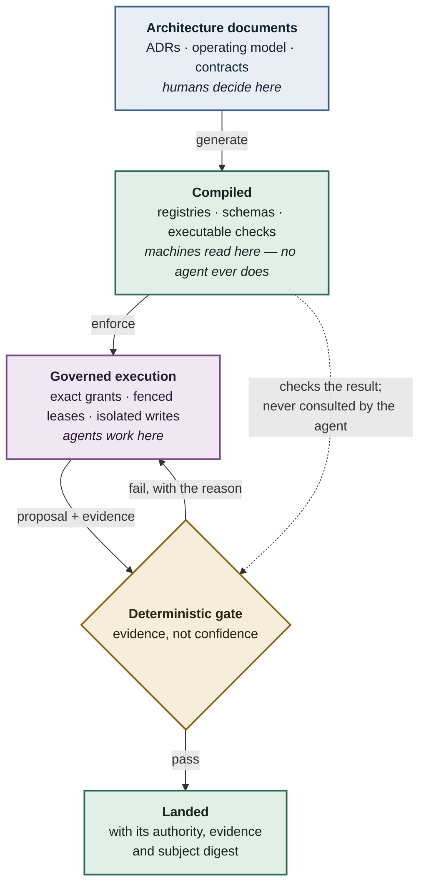


> build · x-ai/grok-4.5

→ Read LICENSE-RANEX.md
✱ Glob "scripts/architecture/**/*" 100 matches
✱ Glob "docs/architecture/decisions/**/*" 14 matches
✱ Glob "architecture/contracts/**/*" 46 matches
✱ Glob "**/test_kernel_imports.py" 0 matches

$ ls -la /home/soultransit/devtony/ranex && head -100 /home/soultransit/devtony/ranex/README.md 2>/dev/null; ls schemas 2>/dev/null | head -30
total 76
drwxrwxr-x 11 soultransit soultransit  4096 Jul 30 19:50 .
drwxrwxr-x  4 soultransit soultransit  4096 Jul 28 16:20 ..
drwxr-xr-x  4 soultransit soultransit  4096 Jul 28 20:16 architecture
drwxrwxr-x  3 soultransit soultransit  4096 Jul 27 17:09 .claude
drwxrwxr-x  2 soultransit soultransit  4096 Jul 27 20:31 decisions
drwxrwxr-x  4 soultransit soultransit  4096 Jul 30 19:50 docs
drwxrwxr-x  9 soultransit soultransit  4096 Jul 30 18:57 .git
-rw-rw-r--  1 soultransit soultransit   841 Jul 27 22:37 .gitignore
drwxrwxr-x  2 soultransit soultransit  4096 Jul 29 15:33 legal
-rw-rw-r--  1 soultransit soultransit  1070 Jul 29 23:23 LICENSE
-rw-rw-r--  1 soultransit soultransit  4105 Jul 27 17:49 LICENSE-RANEX.md
drwxrwxr-x  3 soultransit soultransit  4096 Jul 29 19:49 .local
-rw-rw-r--  1 soultransit soultransit  2280 Jul 27 17:49 NOTICE.md
-rw-rw-r--  1 soultransit soultransit 11931 Jul 30 19:50 README.md
drwxr-xr-x 18 soultransit soultransit  4096 Jul 29 15:18 schemas
drwxr-xr-x  3 soultransit soultransit  4096 Jul 28 17:09 scripts
# Ranex

**Deterministic governance for AI agents that build software.**

Agents propose. Only code — never a model — authorizes.

> **Status: pre-implementation.** The architecture is accepted on paper. No product code
> exists yet. Neither readiness tier has been declared. See [Current state](#current-state).

---

## You have probably had this week

You scope a task precisely. The agent does something adjacent, plausible, and wrong — and
reports success.

A check fails. You ask the agent to fix it. It relaxes the check.

A spec omits one property. The agent infers it, acts on it, and never mentions that it
decided anything. The inference was even correct. You find out three weeks later, from a bug.

You write the constraint in capital letters. It doesn't hold.

**Of course it doesn't.** The prompt is read by the thing it is meant to constrain. That is not
a rule — it is a suggestion delivered to the party with every incentive to reinterpret it.

At one agent this is irritating. At fleet scale, building a real system, it compounds into
software nobody can reason about. Flaky, confidently wrong, and hard for humans *and* agents
to repair — because nothing recorded which decisions were ever made.

Every one of those three failures happened while building Ranex, on this repository. They are
not hypotheticals. They are why it exists.

## The bet

**Rules an agent can read are suggestions. Rules compiled into code are constraints.**

Ranex takes governance out of the prompt and puts it somewhere the agent cannot reach: a
checker that does not ask what the agent intended and cannot be talked out of a verdict.

If that sounds like bureaucracy, look at what it buys — an agent never reads an enforced rule,
so the rulebook costs nothing to obey and nothing in context. Rigour and speed stop being
opposites.

## The approach

Every rule lives in an architecture document. Those documents carry machine-readable contract
blocks, which compile into registries, JSON Schemas and executable checks. The checker does not
ask the agent anything, and cannot be talked out of a verdict.



Consequences that follow from the design:

| | |
|---|---|
| **Model output is a proposal** | Never an authorization. A passing gate requires evidence, not confidence. |
| **Absence blocks** | `NOT_ASSESSED` is never a pass. An unresolved decision stops work rather than defaulting. |
| **No self-approval** | The identity that produces work cannot approve it. |
| **Evidence is bound to an exact subject** | Digests pin what was reviewed. Stale evidence is not evidence. |
| **Humans keep the decisions that matter** | Of 21 readiness gates, 19 resolve from evidence; 2 require a person. |

An agent does not need to *read* a rule that is *enforced* — which also means the rulebook does
not consume the context window it governs.

## What Ranex is being built to do

Each of these is specified and machine-contracted. None is running yet — see
[Current state](#current-state).

### Capabilities that level up

Forty-one capabilities are tracked independently on a `0`–`4` scale. A capability earns a level
by *recorded work*, not by assertion:

| Level | Earned when |
|---:|---|
| `0` | The required owner, contract, behaviour or evidence is absent or unsafe |
| `1` | Purpose, owner, scope, entry/exit, evidence, authority, failure route and metrics exist |
| `2` | Real work produced durable evidence — **and a rejection, invalidation, exception or backward path was actually traversed**, not documented |
architecture
artifacts
assurance
authority
common
events
execution
fixtures
fleet
lifecycle
planning
process
research
resources
review
work

I'll read Ranex's contract compiler/validator and ADRs, then verify prior art externally for each assigned layer.
$ wc -l scripts/architecture/generate_contracts.py scripts/architecture/validate_contracts.py && rg -n "def (scalar_schema|infer_schema|main|generate|validate|digest|pin|fidelity|exact|reproject|compare)" scripts/architecture/generate_contracts.py scripts/architecture/validate_contracts.py | head -80
22760 scripts/architecture/generate_contracts.py
  31751 scripts/architecture/validate_contracts.py
  54511 total
scripts/architecture/generate_contracts.py:905:def digest_value(value: dict[str, Any]) -> str:
scripts/architecture/generate_contracts.py:5644:        def exact_header(field: str, pattern: str) -> str:
scripts/architecture/generate_contracts.py:10397:def scalar_schema(key: str, value: Any, artifact_type: str) -> dict[str, Any]:
scripts/architecture/generate_contracts.py:10424:def infer_schema(value: Any, key: str, artifact_type: str) -> dict[str, Any]:
scripts/architecture/generate_contracts.py:18002:def generate_registries() -> dict[str, Any]:
scripts/architecture/generate_contracts.py:19359:def generate_schemas(registries: dict[str, Any]) -> None:
scripts/architecture/generate_contracts.py:19993:def generate_fixtures(registries: dict[str, Any]) -> None:
scripts/architecture/generate_contracts.py:21996:def generate_assessments(registries: dict[str, Any]) -> None:
scripts/architecture/generate_contracts.py:22157:def generated_output_class(path: str) -> str:
scripts/architecture/generate_contracts.py:22181:def generated_output_licensing_policies(
scripts/architecture/generate_contracts.py:22257:def generate_output_authority() -> set[str]:
scripts/architecture/generate_contracts.py:22356:def generate_manifests() -> None:
scripts/architecture/generate_contracts.py:22367:def generate_contract_tree() -> None:
scripts/architecture/generate_contracts.py:22421:def validated_generated_output_relative(value: str) -> Path:
scripts/architecture/generate_contracts.py:22696:def generate_and_publish_isolated_candidate() -> str:
scripts/architecture/generate_contracts.py:22751:def main() -> None:
scripts/architecture/validate_contracts.py:590:def digest(value: dict[str, Any]) -> str:
scripts/architecture/validate_contracts.py:716:        def exact_header(field: str, pattern: str) -> str:
scripts/architecture/validate_contracts.py:860:def validate_accepted_adr_registry(checks: Counter[str]) -> None:
scripts/architecture/validate_contracts.py:961:def validate_unique_architecture_fitness_definitions(
scripts/architecture/validate_contracts.py:2535:def validate_hermes_research_promotion_registry(
scripts/architecture/validate_contracts.py:4834:def validate_state_source_lifecycle_topology(
scripts/architecture/validate_contracts.py:5296:def validate_state_registry_source_projection(
scripts/architecture/validate_contracts.py:5807:def validate_state_transition_attempt(
scripts/architecture/validate_contracts.py:5912:def validate_state_transition_fact_stream(
scripts/architecture/validate_contracts.py:5944:def validate_state_transition_fixture_suite(
scripts/architecture/validate_contracts.py:6231:def validate_transition_request_semantics(
scripts/architecture/validate_contracts.py:6341:def validate_transition_fact_semantics(
scripts/architecture/validate_contracts.py:6428:def validate_state_transition_fact_stream(
scripts/architecture/validate_contracts.py:6487:def validate_declared_state_axis_transition_seam(
scripts/architecture/validate_contracts.py:6715:def validate_state_bound_event(
scripts/architecture/validate_contracts.py:6937:def validate_state_transition_fixture_suite(
scripts/architecture/validate_contracts.py:7361:def validate_artifact_legal_hold_fact_semantics(
scripts/architecture/validate_contracts.py:7476:def validate_artifact_legal_hold_fixture_suite(
scripts/architecture/validate_contracts.py:8646:def validate_estimate_supersession(
scripts/architecture/validate_contracts.py:9877:def validate_estimate_commitment_schema_matrix(
scripts/architecture/validate_contracts.py:10003:def validate_estimate_commitment_projection_registry(
scripts/architecture/validate_contracts.py:10080:def validate_estimate_commitment_v2_definition_coverage(
scripts/architecture/validate_contracts.py:10442:def validate_estimate_commitment_caller_paths(
scripts/architecture/validate_contracts.py:10508:def validate_estimate_commitment_invariant_negatives(
scripts/architecture/validate_contracts.py:10641:def validate_estimate_commitment_fixture_suites(
scripts/architecture/validate_contracts.py:12241:def validate_repository_source_ref(
scripts/architecture/validate_contracts.py:12306:def validate_json_schema_stage(
scripts/architecture/validate_contracts.py:12957:def validate_legacy_landing_stack(
scripts/architecture/validate_contracts.py:13186:def validate_legacy_git_event(
scripts/architecture/validate_contracts.py:13232:def validate_legacy_record_source_ref(
scripts/architecture/validate_contracts.py:13330:def validate_decision_binding(binding: dict[str, Any]) -> None:
scripts/architecture/validate_contracts.py:13378:def validate_adr10_authority_catalogs(
scripts/architecture/validate_contracts.py:13550:def validate_legacy_test_layout_policy(
scripts/architecture/validate_contracts.py:14066:def validate_path_contract_semantics(item: dict[str, Any]) -> None:
scripts/architecture/validate_contracts.py:14110:def validate_topology_exception_semantics(item: dict[str, Any]) -> None:
scripts/architecture/validate_contracts.py:14132:def validate_architecture_practice_profile(
scripts/architecture/validate_contracts.py:14256:    def validate_design_evidence_ref(
scripts/architecture/validate_contracts.py:14699:def validate_architecture_element_assessments(
scripts/architecture/validate_contracts.py:14728:    def exact_row(
scripts/architecture/validate_contracts.py:15854:def validate_test_profile_semantics(
scripts/architecture/validate_contracts.py:16374:def validate_adr9_projections(
scripts/architecture/validate_contracts.py:16680:def validate_cross_context_import_target(
scripts/architecture/validate_contracts.py:18811:def validate_legacy_change_exception(
scripts/architecture/validate_contracts.py:19038:def validate_legacy_migration_ledger(
scripts/architecture/validate_contracts.py:19807:def validate_legacy_test_snapshot(
scripts/architecture/validate_contracts.py:20149:def validate_production_test_layout(checks: Counter[str]) -> dict[str, Any]:
scripts/architecture/validate_contracts.py:20200:def validate_production_topology(checks: Counter[str]) -> dict[str, Any]:
scripts/architecture/validate_contracts.py:20297:def validate_schema_documents(checks: Counter[str]) -> dict[str, dict[str, Any]]:
scripts/architecture/validate_contracts.py:20314:def validate_generated_output_authority(
scripts/architecture/validate_contracts.py:20597:def validate_generated_artifact_licensing(
scripts/architecture/validate_contracts.py:20983:def validate_worker_runtime_artifact_schema_bindings(
scripts/architecture/validate_contracts.py:21099:def validate_templates(schemas: dict[str, dict[str, Any]], checks: Counter[str]) -> dict[str, str]:
scripts/architecture/validate_contracts.py:21299:def validate_registry_manifest(checks: Counter[str]) -> None:
scripts/architecture/validate_contracts.py:21316:def validate_event_contracts(
scripts/architecture/validate_contracts.py:21800:def validate_test_health_registries(
scripts/architecture/validate_contracts.py:22285:def exact_json_schema_sample(schema: dict[str, Any]) -> Any:
scripts/architecture/validate_contracts.py:22385:def validate_adr10_record_schema_matrix(
scripts/architecture/validate_contracts.py:22511:def validate_adr10_projection_matrix(
scripts/architecture/validate_contracts.py:22964:def validate_adr10_compatibility_fixtures(
scripts/architecture/validate_contracts.py:23094:def validate_adr10_authority_fixtures(
scripts/architecture/validate_contracts.py:23273:def validate_adr10_scope_fixtures(
scripts/architecture/validate_contracts.py:23490:def validate_event_envelope_semantics(
scripts/architecture/validate_contracts.py:23576:def validate_event_stream_semantics(
scripts/architecture/validate_contracts.py:23612:def validate_event_contract_mutation_fixtures(

$ rg -n "scalar_schema|infer_schema|ACCEpted|ACCEPTED|exact.?text|line.?pin|fidelity|digest|sha256|source_line|pin" scripts/architecture/generate_contracts.py | head -100; ls .claude/worktrees 2>/dev/null; find .claude -name '*kernel*' 2>/dev/null | head -20; git branch -a | head -40; git show feature/kernel-tracer:tests/architecture/test_kernel_imports.py 2>/dev/null | head -5 || ls tests 2>/dev/null
23:from typing import Any
589:        "purpose": "Reducer, event, snapshot, digest repeatability, and erasure semantics.",
709:        "shape_rule": "Bind event/state/upcaster/digest replay fixtures to the owning context.",
828:        "required_evidence_fields": ["replay_digest_refs"],
848:    """YAML loader that rejects duplicate mapping keys."""
851:def _construct_unique_yaml_mapping(
853:    node: yaml.MappingNode,
867:    _construct_unique_yaml_mapping,
893:def sha256_bytes(data: bytes) -> str:
894:    return hashlib.sha256(data).hexdigest()
897:def sha256_file(path: Path) -> str:
898:    return sha256_bytes(path.read_bytes())
905:def digest_value(value: dict[str, Any]) -> str:
906:    unsigned = {key: val for key, val in value.items() if key != "digest"}
907:    return "sha256:" + sha256_bytes(canonical_bytes(unsigned))
941:    raw = bytearray(hashlib.sha256(name.encode("utf-8")).digest()[:16])
1335:        "digest_algorithm",
1347:        or contract["digest_algorithm"] != "SHA-256"
1400:        "digest_algorithm",
1412:        or contract["digest_algorithm"] != "SHA-256"
1538:            "wrong_catalog_digest_negative",
1540:            "wrong_fact_digest_negative",
1553:            "wrong_catalog_digest_negative_per_valid_combination",
2120:            "digest": {
2122:                "pattern": r"^sha256:[0-9a-f]{64}$",
2125:        "required": ["id", "digest"],
2150:            "pattern": r"^sha256:[0-9a-f]{64}$",
2249:            "state_catalog_digest": {
2251:                "pattern": r"^sha256:[0-9a-f]{64}$",
2272:            "state_catalog_digest",
2305:            "state_catalog_digest": {
2307:                "pattern": r"^sha256:[0-9a-f]{64}$",
2325:            "state_catalog_digest",
2392:        "x-ranex-state-binding-digest": (
2393:            "sha256:" + sha256_bytes(canonical_bytes(binding))
2406:    digest_schema = {
2408:        "pattern": r"^sha256:[0-9a-f]{64}$",
2426:        "producer_release_digest": digest_schema,
2433:        "subject_digest": digest_schema,
2440:        "payload_schema_digest": digest_schema,
2444:        "digest": digest_schema,
2456:        payload_digest = (
2457:            "sha256:"
2458:            + sha256_bytes(canonical_bytes(payload_schema))
2482:                    "payload_schema_digest": {
2483:                        "const": payload_digest
2503:                    "payload_schema_digest",
2532:            "digest is RFC8785 SHA-256 excluding digest",
2618:    envelope_digest = (
2619:        "sha256:" + sha256_bytes(canonical_bytes(envelope_schema))
2621:    source_digest = "sha256:" + sha256_file(ARCH_DOC)
2638:            "state_binding_digest": (
2639:                "sha256:"
2640:                + sha256_bytes(
2649:            "state_catalog_digest": state_registry["digest"],
2653:            "envelope_schema_digest": envelope_digest,
2661:            "payload_schema_digest": (
2662:                "sha256:"
2663:                + sha256_bytes(canonical_bytes(payload_schema))
2727:            "source_file_digest": source_digest,
2729:        row["digest"] = digest_value(row)
2738:        envelope_schema_digest=envelope_digest,
2740:        state_binding_catalog_digest=(
2741:            "sha256:"
2742:            + sha256_bytes(canonical_bytes(binding_catalog))
2745:        state_catalog_digest=state_registry["digest"],
2781:        "digest": "sha256:" + sha256_file(path),
2782:        "status": "ACCEPTED_PAPER_DECISION",
3055:        or landing_contract["derived_status"] != "ACCEPTED"
3070:            "wrong_subject_digest_negative",
3105:        "sha256",
3106:        "sha256_without_prefix",
3275:        "digest_algorithm",
3276:        "digest_encoding",
3289:        or projection_contract["digest_algorithm"] != "SHA-256"
3446:        != {"subject_schema", "subject_ref", "subject_digest"}
3486:        "execution_artifact_digest",
3510:            "digest_pointer",
3526:            != {"subject_schema", "subject_ref", "subject_digest"}
3644:    if sha256_file(LEGACY_TEST_LAYOUT_ADR) != ADR10_SOURCE_SHA256:
3645:        raise ValueError("ADR-0010 source digest drift")
3661:        hashlib.sha256(matches[0].encode("utf-8")).hexdigest()
3664:        raise ValueError("ADR-0010 marked contract digest drift")
3675:        "digest_algorithm",
3676:        "digest_encoding",
3701:        or contract["digest_algorithm"] != "SHA-256"
3764:        "baseline_file_manifest_sha256",
3769:        "source_population_digest",
3784:        or scope_row["field_types"]["source_population_digest"]
3785:        != "sha256"
3968:        "authority_source_digest_mismatch",
3973:        "behavior_source_or_row_digest_mismatch",
3978:        "behavior_decision_digest_ref_mismatch",
3983:        "registry_digest_mismatch",
3985:        "row_digest_mismatch",
3996:        "classification_decision_digest_ref_mismatch",
4003:        "sealing_behavior_registry_digest_wrong_or_omitted",
4004:        "sealing_classification_registry_digest_wrong_or_omitted",
4005:        "transition_mapping_or_authority_digest_mismatch",
4042:        "subject_digest_rule",
architecture-validated-baseline
docs
gate-controller-mvp
kernel-tracer
phase-0-preflight
phase-1-adopt-upstream
phase-2-runtime-bootstrap
.claude/worktrees/kernel-tracer
.claude/worktrees/kernel-tracer/docs/architecture/decisions/ADR-0003-accept-target-architecture-and-authority-kernel.md
.claude/worktrees/kernel-tracer/src/ranex/governed_execution/adapters/persistence/sqlite/migrations/001_execution_kernel.sql
.claude/worktrees/kernel-tracer/tests/architecture/__pycache__/test_kernel_imports.cpython-314-pytest-9.1.1.pyc
.claude/worktrees/kernel-tracer/tests/architecture/test_kernel_imports.py
.claude/worktrees/architecture-validated-baseline/docs/architecture/decisions/ADR-0003-accept-target-architecture-and-authority-kernel.md
+ architecture/validated-baseline-20260728
* bootstrap/pre-upstream
+ develop
+ feature/deterministic-gate-controller-mvp
+ feature/kernel-tracer
  main
+ phase/0-preflight
+ phase/1-adopt-upstream
  phase/2-runtime-bootstrap
  upstream-sync
  remotes/origin/develop
  remotes/origin/main
  remotes/origin/upstream-sync
  remotes/upstream/UI
  remotes/upstream/add-morph-snapshot
  remotes/upstream/add-prokletor
  remotes/upstream/add-upstream-atropos-tool-use-changes
  remotes/upstream/alice/nous-portal-recommended-models
  remotes/upstream/api-server-enforce-key
  remotes/upstream/architecture-planning
  remotes/upstream/ascii-video/text-readability-and-layout-oracle
  remotes/upstream/asyncio
  remotes/upstream/atropos-hermes-agent
  remotes/upstream/atropos-integrations
  remotes/upstream/atropos-integrations-pr
  remotes/upstream/austin/feat/google-oauth-provider
  remotes/upstream/austin/fix/dashboard-perf
  remotes/upstream/austin/fix/minimax-oauth
  remotes/upstream/austin/fix/types-node-lockfile
  remotes/upstream/austin/fix/wsl-gui
  remotes/upstream/bb/ableton-skill
  remotes/upstream/bb/agent-traces
  remotes/upstream/bb/backend-contract-bump-profile-routing
  remotes/upstream/bb/base-gui
  remotes/upstream/bb/ci-lockfile-python-lane
  remotes/upstream/bb/clarify-prompt-timeout-stuck
  remotes/upstream/bb/cli-resize-duplication
  remotes/upstream/bb/coding-agent-harness-analysis
  remotes/upstream/bb/computer-use-vision-fix
  remotes/upstream/bb/cron-history-timeout

→ Read docs/architecture/decisions/ADR-0013-promote-hermes-research-obligations.md [limit=200]
→ Read docs/architecture/decisions/ADR-0007-establish-modular-ddd-repository-organization.md [limit=150]
→ Read scripts/architecture/README.md
Next I'm reading the generator/validator and key ADRs while pulling external docs in parallel.
→ Read scripts/architecture/generate_contracts.py [offset=10397, limit=120]
→ Read scripts/architecture/generate_contracts.py [offset=900, limit=50]
→ Read scripts/architecture/generate_contracts.py [offset=22740, limit=80]
→ Read scripts/architecture/validate_contracts.py [offset=2535, limit=200]
→ Read scripts/architecture/validate_contracts.py [offset=860, limit=120]
→ Read .claude/worktrees/kernel-tracer/tests/architecture/test_kernel_imports.py

$ rg -n "source_excerpt|exact.?text|fidelity|excerpt_digest|source_line|pinned|line.bound|compare.*expected|reproject|independen" scripts/architecture/generate_contracts.py scripts/architecture/validate_contracts.py | head -80
scripts/architecture/validate_contracts.py:781:    """Return independent fail-closed diagnostics for a registry candidate."""
scripts/architecture/validate_contracts.py:1275:    fidelity_pinned_provisions = {
scripts/architecture/validate_contracts.py:1494:            "outside the release-pinned Ranex catalog and qualification "
scripts/architecture/validate_contracts.py:1568:        set(promoted_by_id) == set(fidelity_pinned_provisions),
scripts/architecture/validate_contracts.py:1572:    for provision_id, provision in fidelity_pinned_provisions.items():
scripts/architecture/validate_contracts.py:1579:    fidelity_pinned_owner_decisions = {
scripts/architecture/validate_contracts.py:1613:            "Reviewer independence and calibrated model-judge thresholds."
scripts/architecture/validate_contracts.py:1627:            "Whether a future release qualifies an independently hosted "
scripts/architecture/validate_contracts.py:1650:            "or independently persistent contexts."
scripts/architecture/validate_contracts.py:1664:        == set(fidelity_pinned_owner_decisions),
scripts/architecture/validate_contracts.py:1669:        fidelity_pinned_owner_decisions.items()
scripts/architecture/validate_contracts.py:1678:    fidelity_pinned_research_only = {
scripts/architecture/validate_contracts.py:1680:            "The pinned-source audit and scorecard are historical evidence "
scripts/architecture/validate_contracts.py:1698:            "pinned-revision migration inputs; the promoted release gates "
scripts/architecture/validate_contracts.py:1747:        == set(fidelity_pinned_research_only),
scripts/architecture/validate_contracts.py:1751:    for provision_id, reason in fidelity_pinned_research_only.items():
scripts/architecture/validate_contracts.py:2184:                "source_excerpt_digest": (
scripts/architecture/validate_contracts.py:2225:    """Return independent fail-closed diagnostics for ADR-0013."""
scripts/architecture/validate_contracts.py:2300:    source_lines = HERMES_RESEARCH_SOURCE.read_text(
scripts/architecture/validate_contracts.py:2353:            and start_line <= end_line <= len(source_lines)
scripts/architecture/validate_contracts.py:2363:                source_lines[start_line - 1 : end_line]
scripts/architecture/validate_contracts.py:2365:            expected_excerpt_digest = (
scripts/architecture/validate_contracts.py:2369:                row.get("source_excerpt_digest")
scripts/architecture/validate_contracts.py:2370:                != expected_excerpt_digest
scripts/architecture/validate_contracts.py:2561:    checks["hermes_research_source_line_bindings"] = len(entries)
scripts/architecture/validate_contracts.py:2652:        "source_excerpt_digest"
scripts/architecture/validate_contracts.py:8317:        "independently_governed": True,
scripts/architecture/validate_contracts.py:8888:                "independently_governed",
scripts/architecture/validate_contracts.py:8911:            method["independently_governed"] is True,
scripts/architecture/validate_contracts.py:9174:    independently_derived = estimate_commitment_subject(world)
scripts/architecture/validate_contracts.py:9212:        presented == independently_derived,
scripts/architecture/validate_contracts.py:9764:    elif mutation == "estimate_method_non_independent":
scripts/architecture/validate_contracts.py:9765:        method_rows[0]["independently_governed"] = False
scripts/architecture/validate_contracts.py:10531:        "estimate_method_non_independent": (
scripts/architecture/validate_contracts.py:11972:        "reviewers_independent": True,
scripts/architecture/validate_contracts.py:18925:        exception["independent_migration_review_ref"][
scripts/architecture/validate_contracts.py:19180:            "independent_migration_review_ref",
scripts/architecture/validate_contracts.py:20132:                "independent_migration_review_ref",
scripts/architecture/validate_contracts.py:24249:        not world["reviewers_independent"]
scripts/architecture/validate_contracts.py:24254:                "reviewer_not_independent_or_has_write_authority"
scripts/architecture/validate_contracts.py:24437:    elif mutation == "reviewer_not_independent_or_has_write_authority":
scripts/architecture/validate_contracts.py:26880:        "independent_migration_review_ref": (
scripts/architecture/validate_contracts.py:27197:        "independent_migration_review_ref": (
scripts/architecture/validate_contracts.py:28605:def independent_tdd_subject_projection(
scripts/architecture/validate_contracts.py:29102:        and oracle_document["independently_reviewed"] is True,
scripts/architecture/validate_contracts.py:29877:    projected = independent_tdd_subject_projection(
scripts/architecture/validate_contracts.py:30282:        expected = independent_tdd_subject_projection(
scripts/architecture/validate_contracts.py:30324:            mutated_projection = independent_tdd_subject_projection(
scripts/architecture/generate_contracts.py:303:    "INDEPENDENCE_EVALUATION.yaml": ("review/independence-evaluation-v1.schema.json", "analytical_review"),
scripts/architecture/generate_contracts.py:489:    "independence_evaluation": "independence_",
scripts/architecture/generate_contracts.py:6040:    fidelity_pinned_provisions = {
scripts/architecture/generate_contracts.py:6259:            "outside the release-pinned Ranex catalog and qualification "
scripts/architecture/generate_contracts.py:6332:    if set(promoted_by_id) != set(fidelity_pinned_provisions):
scripts/architecture/generate_contracts.py:6334:            "Hermes promoted-provision fidelity coverage drift"
scripts/architecture/generate_contracts.py:6336:    for provision_id, provision in fidelity_pinned_provisions.items():
scripts/architecture/generate_contracts.py:6339:                "Hermes promoted-provision fidelity drift: " + provision_id
scripts/architecture/generate_contracts.py:6342:    fidelity_pinned_owner_decisions = {
scripts/architecture/generate_contracts.py:6376:            "Reviewer independence and calibrated model-judge thresholds."
scripts/architecture/generate_contracts.py:6390:            "Whether a future release qualifies an independently hosted "
scripts/architecture/generate_contracts.py:6413:            "or independently persistent contexts."
scripts/architecture/generate_contracts.py:6426:        fidelity_pinned_owner_decisions
scripts/architecture/generate_contracts.py:6429:            "Hermes owner-decision fidelity coverage drift"
scripts/architecture/generate_contracts.py:6432:        fidelity_pinned_owner_decisions.items()
scripts/architecture/generate_contracts.py:6439:                "Hermes owner-decision fidelity drift: " + provision_id
scripts/architecture/generate_contracts.py:6442:    fidelity_pinned_research_only = {
scripts/architecture/generate_contracts.py:6444:            "The pinned-source audit and scorecard are historical evidence "
scripts/architecture/generate_contracts.py:6462:            "pinned-revision migration inputs; the promoted release gates "
scripts/architecture/generate_contracts.py:6510:        fidelity_pinned_research_only
scripts/architecture/generate_contracts.py:6513:            "Hermes research-only fidelity coverage drift"
scripts/architecture/generate_contracts.py:6515:    for provision_id, reason in fidelity_pinned_research_only.items():
scripts/architecture/generate_contracts.py:6518:                "Hermes research-only fidelity drift: " + provision_id
scripts/architecture/generate_contracts.py:6956:                "source_excerpt_digest": (
scripts/architecture/generate_contracts.py:7436:        raise ValueError("SDLC control catalog pinned digest drift")
scripts/architecture/generate_contracts.py:10499:        "source_excerpt_digest": digest_schema,
scripts/architecture/generate_contracts.py:11518:        "independently_reviewed": True,
scripts/architecture/generate_contracts.py:11633:        "independence_class": "INDEPENDENT_PRIMARY",
scripts/architecture/generate_contracts.py:12799:            "independence_evaluation_id": (
scripts/architecture/generate_contracts.py:15250:            "independent_migration_reviewer": nonempty,
scripts/architecture/generate_contracts.py:15282:            "independent_migration_reviewer",
scripts/architecture/generate_contracts.py:15377:            "independent_migration_review_ref": nonempty,

$ rg -n "importlinter|ArchUnit|dependency|forbidden|allowed_imports|import.*rule" scripts/architecture/ docs/architecture/ .claude/worktrees/kernel-tracer/tests/architecture/ 2>/dev/null | head -40; rg -n "enum|oneOf|if.*then|const|closed" scripts/architecture/generate_contracts.py | head -40; ls schemas | head -40; wc -l schemas/*/* 2>/dev/null | tail -5; find schemas -name '*.json' | wc -l; ls architecture/contracts | wc -l
.claude/worktrees/kernel-tracer/tests/architecture/test_kernel_imports.py:14:    PROJECT_ROOT / "architecture" / "contracts" / "context-dependency-edges.json"
.claude/worktrees/kernel-tracer/tests/architecture/test_kernel_imports.py:448:def test_checker_rejects_domain_environment_dependency(tmp_path: Path) -> None:
.claude/worktrees/kernel-tracer/tests/architecture/test_kernel_imports.py:476:def test_importing_entire_kernel_graph_loads_no_hermes_dependency() -> None:
docs/architecture/AI_AGENT_DEVELOPMENT_LIFECYCLE.md:72:| `planner` | Decompose accepted work into dependency-aware packets | Cannot implement or approve its plan in the same execution identity when independence is required |
docs/architecture/AI_AGENT_DEVELOPMENT_LIFECYCLE.md:74:| `process-reviewer` | Verify method, scope, dependency, and policy conformance | Cannot edit the reviewed subject |
docs/architecture/AI_AGENT_DEVELOPMENT_LIFECYCLE.md:200:deployment surface, dependency/migration impact, reversibility, and
docs/architecture/AI_AGENT_DEVELOPMENT_LIFECYCLE.md:209:- no forbidden or destructive action has been implicitly authorized.
docs/architecture/AI_AGENT_DEVELOPMENT_LIFECYCLE.md:262:- current public APIs and dependency graph;
docs/architecture/AI_AGENT_DEVELOPMENT_LIFECYCLE.md:298:- allowed and forbidden paths;
docs/architecture/AI_AGENT_DEVELOPMENT_LIFECYCLE.md:299:- allowed and forbidden dependency edges;
docs/architecture/AI_AGENT_DEVELOPMENT_LIFECYCLE.md:386:- changed files and dependency edges;
docs/architecture/AI_AGENT_DEVELOPMENT_LIFECYCLE.md:451:- architecture/import/dependency fitness;
docs/architecture/AI_AGENT_DEVELOPMENT_LIFECYCLE.md:644:- scope/path/dependency constraints hold;
docs/architecture/AI_AGENT_DEVELOPMENT_LIFECYCLE.md:662:- a dependency-clean core;
docs/architecture/HERMES_GROUND_ZERO_FULL_SYSTEM_ARCHITECTURE.md:42:- new dependency-clean Ranex domain and application code;
docs/architecture/HERMES_GROUND_ZERO_FULL_SYSTEM_ARCHITECTURE.md:218:| New core | Authority, domain, and application code outside the named compatibility adapter has no dependency on inherited Hermes internals. |
docs/architecture/HERMES_GROUND_ZERO_FULL_SYSTEM_ARCHITECTURE.md:261:10. Unknown action, role, capability, route, schema, state, or dependency is
docs/architecture/HERMES_GROUND_ZERO_FULL_SYSTEM_ARCHITECTURE.md:392:coordination, not shared state or a dependency cycle.
docs/architecture/HERMES_GROUND_ZERO_FULL_SYSTEM_ARCHITECTURE.md:462:transition creates one effect” is forbidden.
docs/architecture/HERMES_GROUND_ZERO_FULL_SYSTEM_ARCHITECTURE.md:511:| `supplier_governance` | Supplier/dependency adoption and reuse decisions, shared responsibility, version/support/vulnerability monitoring, concentration/exit plans | Packages, toolchains, providers, APIs, extensions, hosted services, Hermes upstream |
docs/architecture/HERMES_GROUND_ZERO_FULL_SYSTEM_ARCHITECTURE.md:588:slices, but their ownership and dependency positions are fixed now.
docs/architecture/HERMES_GROUND_ZERO_FULL_SYSTEM_ARCHITECTURE.md:885:│   │   ├── context-dependency-edges.json
docs/architecture/HERMES_GROUND_ZERO_FULL_SYSTEM_ARCHITECTURE.md:999:exact dependency-edge, boundary-fit, central-coupling, and feedback-fitness
docs/architecture/HERMES_GROUND_ZERO_FULL_SYSTEM_ARCHITECTURE.md:1125:| `supplier_governance` | `api/{commands,queries,events,views}.py`; `domain/{suppliers,dependencies,adoption_decisions,shared_responsibility,monitoring,concentration,exit_plans,invariants}.py` | `application/{adoption_service,monitoring_service,reassessment_service,exit_service}.py`; `application/ports/{dependency_inventory,supplier_probe}.py` |
docs/architecture/HERMES_GROUND_ZERO_FULL_SYSTEM_ARCHITECTURE.md:1185:## 13. Enforced source dependency rules
docs/architecture/HERMES_GROUND_ZERO_FULL_SYSTEM_ARCHITECTURE.md:1208:14. `ExecutionContext` is forbidden as a domain-method parameter. Domain methods
docs/architecture/HERMES_GROUND_ZERO_FULL_SYSTEM_ARCHITECTURE.md:1264:owns the deny-by-default 67-edge public-API dependency ledger. Every actual
docs/architecture/HERMES_GROUND_ZERO_FULL_SYSTEM_ARCHITECTURE.md:1508:blocking evidence/dependency, invalidated inputs, and review deadline. Resume
docs/architecture/HERMES_GROUND_ZERO_FULL_SYSTEM_ARCHITECTURE.md:1545:free-form axis, state, guard, or catalog identifiers are forbidden.
docs/architecture/HERMES_GROUND_ZERO_FULL_SYSTEM_ARCHITECTURE.md:1610:  forbidden_field: "transition_sequence is not part of TRANSITION-EVENT-V1 and must not be synthesized"
docs/architecture/HERMES_GROUND_ZERO_FULL_SYSTEM_ARCHITECTURE.md:2785:| `EVENT-RUNBLOCKED` / `RunBlocked` | `governed_execution` / `run_lifecycle_service`; `work_management`, `operations` | `Run`; blocking gate/policy/dependency/unknown prevents next transition | `run_id:Id<Run>`, `from_status:Enum<RunStatus>`, `block_reason_code:String`, `blocking_refs:Set<ArtifactRef>`, `blocked_at:Utc` |
docs/architecture/HERMES_GROUND_ZERO_FULL_SYSTEM_ARCHITECTURE.md:2835:    forbidden_fields: ["state_initial_bindings", "state_edge_bindings"]
docs/architecture/HERMES_GROUND_ZERO_FULL_SYSTEM_ARCHITECTURE.md:3470:and restore dependency.
docs/architecture/HERMES_GROUND_ZERO_FULL_SYSTEM_ARCHITECTURE.md:3548:- adds import-time registration or an undeclared dependency;
docs/architecture/HERMES_GROUND_ZERO_FULL_SYSTEM_ARCHITECTURE.md:3832:### 33.5 Boundary-fit, dependency, coupling, and feedback gates
docs/architecture/HERMES_GROUND_ZERO_FULL_SYSTEM_ARCHITECTURE.md:3837:- exact owned dependency semantics, actual-import subset, and acyclicity:
docs/architecture/HERMES_GROUND_ZERO_FULL_SYSTEM_ARCHITECTURE.md:3917:registered artifact/schema row. A path, dependency edge, boundary, rule,
docs/architecture/HERMES_GROUND_ZERO_FULL_SYSTEM_ARCHITECTURE.md:4105:- every repository path, bounded-context layer, dependency, public seam,
docs/architecture/SOURCE_OF_TRUTH.md:69:Any changed scope, estimate binding, capacity, dependency, risk, acceptance
docs/architecture/SOURCE_OF_TRUTH.md:252:├── context-dependency-edges.json
751:        "shape_rule": "Keep test-data builders with the context whose invariants and data they construct.",
851:def _construct_unique_yaml_mapping(
858:        key = loader.construct_object(key_node, deep=deep)
861:        result[key] = loader.construct_object(value_node, deep=deep)
865:DuplicateKeyLoader.add_constructor(
867:    _construct_unique_yaml_mapping,
1015:        raise ValueError("State rejection policy is not a closed object")
1022:        raise ValueError("State rejection policy is not fail-closed")
1071:            raise ValueError("State axis row is not closed enough to compile")
1341:        raise ValueError("Transition-fact contract is not closed")
1406:        raise ValueError("Artifact legal-hold contract is not closed")
1509:        raise ValueError("State/event fixture denominator is not closed")
1627:        raise ValueError("Event-state binding catalog is not closed")
1688:                "Event-state binding row is not closed: " + event_name
1704:                        "Initial-state binding is not closed: "
1735:                        "Edge-event binding is not closed: "
1838:def parse_event_enum_catalog(text: str) -> list[dict[str, Any]]:
1842:            "| Event enum name | Canonical axis/version and owner |",
1850:        raise ValueError("HERMES event enum catalog denominator/name drift")
1852:    for enum_name, binding_cell, values_cell in rows:
1856:                "HERMES event enum owner missing: " + enum_name
1867:                    "HERMES reused event enum binding malformed: "
1868:                    + enum_name
1881:                    "HERMES new event enum binding malformed: "
1882:                    + enum_name
1886:            axis_id = enum_name
1894:                "HERMES event enum values missing/duplicated: " + enum_name
1898:                "HERMES event enum axis is not registered: " + axis_id
1902:                "HERMES event enum contains unknown state values: "
1903:                + enum_name
1910:                "HERMES event enum/state registry value drift: " + enum_name
1914:                "HERMES event enum/state owner drift: " + enum_name
1922:                "HERMES event enum canonical binding drift: " + enum_name
1926:                "enum_name": enum_name,
1952:    for index, match in enumerate(matches):
1960:        constraint_text = payload_cell[match.end():tail_end].strip(" ,")
1963:            constraint_text,
1965:        restriction_enum_name = (
1971:        constant: str | None = None
1973:            type_expression, constant = type_expression.rsplit("=", 1)
architecture
artifacts
assurance
authority
common
events
execution
fixtures
fleet
lifecycle
planning
process
research
resources
review
work
    109 schemas/review/review-verdict-v1.schema.json
    897 schemas/work/task-packet-v1.schema.json
    695 schemas/work/transition-event-v1.schema.json
    192 schemas/work/work-intake-v1.schema.json
  52238 total
195
46

Pulling schema-inference, fidelity-pin, and dual-validation code paths plus external prior-art sources.
$ mkdir -p /tmp/opencode/prior-art-c && cd /tmp/opencode/prior-art-c && \
curl -sL -A "Mozilla/5.0" "https://www.openpolicyagent.org/docs/latest/" -o opa.html --max-time 30 && \
curl -sL -A "Mozilla/5.0" "https://docs.cedarpolicy.com/overview/what-is-cedar.html" -o cedar.html --max-time 30 && \
curl -sL -A "Mozilla/5.0" "https://cuelang.org/docs/concept/what-is-cue/" -o cue.html --max-time 30 && \
curl -sL -A "Mozilla/5.0" "https://www.archunit.org/" -o archunit.html --max-time 30 && \
curl -sL -A "Mozilla/5.0" "https://import-linter.readthedocs.io/en/stable/" -o importlinter.html --max-time 30 && \
curl -sL -A "Mozilla/5.0" "https://github.com/sverweij/dependency-cruiser" -o depcruiser.html --max-time 30 && \
wc -c opa.html cedar.html cue.html archunit.html importlinter.html depcruiser.html 2>/dev/null | head -20
279622 opa.html
 15279 cedar.html
 16949 cue.html
  8371 archunit.html
  5491 importlinter.html
394093 depcruiser.html
719805 total

$ cd /tmp/opencode/prior-art-c && \
curl -sL -A "Mozilla/5.0" "https://www.conftest.dev/" -o conftest.html --max-time 30 && \
curl -sL -A "Mozilla/5.0" "https://open-policy-agent.github.io/gatekeeper/website/" -o gatekeeper.html --max-time 30 && \
curl -sL -A "Mozilla/5.0" "https://json-schema.org/understanding-json-schema/reference/conditionals" -o jsonschema-cond.html --max-time 30 && \
curl -sL -A "Mozilla/5.0" "https://json-schema.org/understanding-json-schema/reference/enum" -o jsonschema-enum.html --max-time 30 && \
curl -sL -A "Mozilla/5.0" "https://datatracker.ietf.org/doc/html/rfc8785" -o rfc8785.html --max-time 30 && \
curl -sL -A "Mozilla/5.0" "https://en.wikipedia.org/wiki/Requirements_traceability" -o reqtrace.html --max-time 30 && \
wc -c conftest.html gatekeeper.html jsonschema-cond.html jsonschema-enum.html rfc8785.html reqtrace.html
50916 conftest.html
  40139 gatekeeper.html
 498464 jsonschema-cond.html
 144798 jsonschema-enum.html
 158855 rfc8785.html
 143041 reqtrace.html
1036213 total

Fetching licenses and docs for OPA, Cedar, CUE, ArchUnit, import-linter, and traceability standards.
$ cd /tmp/opencode/prior-art-c && \
curl -sL -A "Mozilla/5.0" "https://api.github.com/repos/open-policy-agent/opa" -o opa-gh.json --max-time 20 && \
curl -sL -A "Mozilla/5.0" "https://api.github.com/repos/cedar-policy/cedar" -o cedar-gh.json --max-time 20 && \
curl -sL -A "Mozilla/5.0" "https://api.github.com/repos/cue-lang/cue" -o cue-gh.json --max-time 20 && \
curl -sL -A "Mozilla/5.0" "https://api.github.com/repos/TNG/ArchUnit" -o arch-gh.json --max-time 20 && \
curl -sL -A "Mozilla/5.0" "https://api.github.com/repos/seddonym/import-linter" -o il-gh.json --max-time 20 && \
curl -sL -A "Mozilla/5.0" "https://api.github.com/repos/sverweij/dependency-cruiser" -o dc-gh.json --max-time 20 && \
curl -sL -A "Mozilla/5.0" "https://api.github.com/repos/open-policy-agent/conftest" -o conf-gh.json --max-time 20 && \
curl -sL -A "Mozilla/5.0" "https://api.github.com/repos/open-policy-agent/gatekeeper" -o gk-gh.json --max-time 20 && \
python3 -c "
import json,glob
for f in sorted(glob.glob('*-gh.json')):
  d=json.load(open(f))
  print(f, d.get('full_name'), d.get('license',{}).get('spdx_id'), d.get('html_url'), d.get('description','')[:80] if d.get('description') else '')
"
arch-gh.json TNG/ArchUnit Apache-2.0 https://github.com/TNG/ArchUnit A Java architecture test library, to specify and assert architecture rules in pl
cedar-gh.json cedar-policy/cedar Apache-2.0 https://github.com/cedar-policy/cedar Implementation of the Cedar Policy Language
conf-gh.json open-policy-agent/conftest NOASSERTION https://github.com/open-policy-agent/conftest Write tests against structured configuration data using the Open Policy Agent Re
cue-gh.json cue-lang/cue Apache-2.0 https://github.com/cue-lang/cue The home of the CUE language! Validate and define text-based and dynamic configu
dc-gh.json sverweij/dependency-cruiser MIT https://github.com/sverweij/dependency-cruiser Validate and visualize dependencies. Your rules. JavaScript, TypeScript, CoffeeS
gk-gh.json open-policy-agent/gatekeeper Apache-2.0 https://github.com/open-policy-agent/gatekeeper 🐊 Policy Controller for Kubernetes
il-gh.json seddonym/import-linter BSD-2-Clause https://github.com/seddonym/import-linter Lint your Python architecture.
opa-gh.json open-policy-agent/opa Apache-2.0 https://github.com/open-policy-agent/opa Open Policy Agent (OPA) is an open source, general-purpose policy engine.

$ cd /tmp/opencode/prior-art-c && python3 << 'PY'
from html.parser import HTMLParser
import re, pathlib

def text(path, n=4000):
    raw = pathlib.Path(path).read_text(errors='ignore')
    # strip scripts/styles
    raw = re.sub(r'(?is)<script[^>]*>.*?</script>', ' ', raw)
    raw = re.sub(r'(?is)<style[^>]*>.*?</style>', ' ', raw)
    t = re.sub(r'(?is)<[^>]+>', ' ', raw)
    t = re.sub(r'\s+', ' ', t).strip()
    print(f'=== {path} ({len(t)} chars) ===')
    print(t[:n])
    print()

for p in ['opa.html','cedar.html','cue.html','archunit.html','importlinter.html','conftest.html','gatekeeper.html','reqtrace.html']:
    text(p, 2500)
PY
=== opa.html (34054 chars) ===
Open Policy Agent (OPA) | Open Policy Agent Skip to main content Open Policy Agent Docs Resources Security Support Community Survey Blog Projects OPA Regal OPA Gatekeeper Conftest Ecosystem Play Search Ctrl K Core Documentation Introduction Philosophy Policy Language Policy Reference Policy Testing Policy Performance External Data Use Cases Data Filtering Envoy &amp; Istio Kubernetes CI/CD AWS CloudFormation Hooks Docker HTTP APIs GraphQL APIs Kafka SSH and sudo Terraform Operations CLI Reference Management APIs Operations &amp; Configuration Control Plane (OCP) Developers Policy Authoring Errors Guide Integration Backwards Compatibility FAQ Frequently Asked Questions Comparisons Contributing Introduction Guides Development Support Community Support Enterprise Support On this page Open Policy Agent (OPA) The Open Policy Agent (OPA, pronounced &quot;oh-pa&quot;) is an open source, general-purpose policy engine that unifies policy enforcement across the stack. OPA provides a high-level declarative language that lets you specify policy as code and simple APIs to offload policy decision-making from your software. You can use OPA to enforce policies in microservices, Kubernetes, CI/CD pipelines, API gateways, and more. OPA is proud to be a graduated Cloud Native Computing Foundation (CNCF) project. This page covers core concepts in OPA&#x27;s policy language ( Rego ) as well as how to download and run OPA. What is OPA? ​ OPA decouples policy decision-making from policy enforcement. When your software needs to make policy decisions it queries OPA and supplies structured data (e.g., JSON) as input. OPA accepts arbitrary structured data as input. OPA generates policy decisions by evaluating the query input against policies and data. OPA and Rego are domain-agnostic so you can describe almost any kind of invariant in your policies. For example: Which users can access which resources. Which subnets egress traffic is allowed to. Which clusters a workload must be deployed to. Which registries binaries can be downloaded from. Which OS capabilities a container can execute with. Which times of day the system can be accessed at. Policy decisions are not limited to simple yes/no or allow/deny answers. Like query inputs, your policies can generate arbitrary structured data as output. The following example illustrates this. Imagine you work for an organization with a number of servers connected to managed networks via ports: Servers communicate using protocols (such as http 

=== cedar.html (1523 chars) ===
Cedar Policy Language Reference Guide | Documentation for Cedar policy language Skip to main content Link Menu Expand (external link) Document Search Copy Copied What is Cedar? Overview Terms & concepts Design patterns Example scenario Additional resources Authorization requests Authorization Entities & context JSON syntax Policies Basic Cedar syntax Entities Data types Operators Policy validation Policy grammar JSON policy format Policy examples Policy templates Policy level validation Schema Schema overview Cedar schema grammar Cedar schema format JSON schema grammar JSON schema format Best practices Best Practices overview Naming conventions Identify your authorization patterns Map actions to the business domain Model all permissions in Cedar Populate the policy scope Take advantage of user groups Compound authorization Permissions Representing relationships Resource containers Separate principals & containers Normalize data input Using the context Meta-permissions Avoid mutable identifiers Using role-based access control Groups and resource-specific roles Attribute-based conditions Roles with policy templates Other considerations Other Security Document history We welcome your feedback about these docs! Send feedback by email or use GitHub Issues Search Cedar Policy Language Reference Guide 404 Page not found :( The requested page could not be found. We welcome your feedback. You can edit this page on GitHub. We welcome your feedback about these docs! Send feedback by email or use GitHub Issues

=== cue.html (824 chars) ===
404 Page not found | CUE Skip to content Homepage of CUE Documentation Play Community GitHub Slack Discord X (Twitter) Bluesky YouTube Install Search What are you looking for? Menu { status: 404, message: "Page not found" } Oops! This page doesn't exist. Try going back to our home page , taking a look at our documentation , or searching for a page . Get Started Documentation Language Tour Playground Install CUE Community The CUE Community Contributing Code of Conduct Slack Workspace Discord Server Connect GitHub X (Twitter) Bluesky YouTube &copy; 2026 CUE Privacy policy Report an Issue Homepage of CUE CUE v0.17 is now available &ndash; learn more about its new features and improvements Install CUE Close Homepage of CUE Hide menu Documentation Play Community Install GitHub Slack Discord X (Twitter) Bluesky YouTube

=== archunit.html (1148 chars) ===
Unit test your Java architecture - ArchUnit You are using an outdated browser. Please upgrade your browser to improve your experience. Getting Started Motivation Use Cases News User Guide API About Unit test your Java architecture Start enforcing your architecture within 30 minutes using the test setup you already have. Start Now ArchUnit is a free, simple and extensible library for checking the architecture of your Java code using any plain Java unit test framework. That is, ArchUnit can check dependencies between packages and classes, layers and slices, check for cyclic dependencies and more. It does so by analyzing given Java bytecode, importing all classes into a Java code structure. You can find examples for the current release at ArchUnit Examples and the sources on GitHub . There also exists a port for .NET/C#, which you can find here . News Apr 18, 2026 – New release of ArchUnit (v1.4.2) May 7, 2025 – New release of ArchUnit (v1.4.1) Feb 10, 2025 – New release of ArchUnit (v1.4.0) Follow: Twitter GitHub Feed &copy; 2026 Peter Gafert. Powered by Jekyll &amp; Minimal Mistakes . Kindly supported by Imprint + Privacy Statement

=== importlinter.html (58 chars) ===
Just a moment... Enable JavaScript and cookies to continue

=== conftest.html (12487 chars) ===
Conftest Skip to content  Conftest Home &#xE5CD; Type to start searching GitHub  Conftest GitHub Home Home Table of contents Usage Evaluating Policies Metadata Well-known metadata Query Location Testing/Verifying Policies Writing Unit Tests Using deny_ as a prefix to simplify testing Options Installation Examples Output Exceptions Sharing policies Debugging policies Documenting policies Pre-commit Plugins Table of contents Usage Evaluating Policies Metadata Well-known metadata Query Location Testing/Verifying Policies Writing Unit Tests Using deny_ as a prefix to simplify testing &#xE3C9; Conftest Conftest is a utility to help you write tests against structured configuration data. For instance, you could write tests for your Kubernetes configurations, Tekton pipeline definitions, Terraform code, Serverless configs or any other structured data. Conftest relies on the Rego language from Open Policy Agent for writing policies. If you're unsure what exactly a policy is, or unfamiliar with the Rego policy language, the Policy Language documentation provided by the Open Policy Agent documentation site is a great resource to read. Usage Evaluating Policies Policies by default should be placed in a directory called policy , but this can be overridden with the --policy flag. For instance, save the following as policy/deployment.rego : package main deny contains msg if { input . kind == &quot;Deployment&quot; not input . spec . template . spec . securityContext . runAsNonRoot msg := &quot;Containers must not run as root&quot; } deny contains msg if { input . kind == &quot;Deployment&quot; not input . spec . selector . matchLabels . app msg := &quot;Containers must provide app label for pod selectors&quot; } Conftest looks for deny , violation , and warn rules. Rules can optionally be suffixed with an underscore and an identifier, for example deny_myrule . violation rules evaluates the same as deny rules, except they support returning structured data errors instead of just strings. See this issue . By default, Conftest looks for these rules in the main namespace, but this can be overriden with the --namespace flag or provided in the configuration file. To look in all namespaces, use the --all-namespaces flag. Assuming you have a Kubernetes deployment in deployment.yaml you can run Conftest like so: $ conftest test deployment.yaml FAIL - deployment.yaml - Containers must not run as root FAIL - deployment.yaml - Containers must provide app label for pod selectors 2 t

=== gatekeeper.html (2332 chars) ===
Gatekeeper | Gatekeeper Skip to main content Gatekeeper Docs Policy Library v3.23.x Next v3.23.x v3.22.x v3.21.x v3.20.x v3.19.x v3.18.x v3.17.x v3.16.x v3.15.x v3.14.x v3.13.x v3.12.x v3.11.x v3.10.x v3.9.x v3.8.x v3.7.x v3.6.x Search A customizable cloud native policy controller that helps enforce policies and strengthen governance Get Started Browse the Policy Library Contributed by the community in collaboration with Kubernetes Native Gatekeeper makes managing policies on top of Kubernetes easy. Policies can be enforced at admission time or at runtime via the audit functionality. Powered by Open Policy Agent Gatekeeper is powered by the Open Policy Agent (OPA) project. Using OPA allows you to write policies that are powerful, flexible, and portable. Extensive Policy Library Browse the policy library to find existing policies that fit your use case. Each policy in the library can be extended and customized to fit your needs. Looking for a managed service or integration? Azure Policy for Kubernetes Azure Policy for Kubernetes is backed by Gatekeeper and supports Azure Kubernetes Service (AKS) and Azure Arc enabled Kubernetes. Google Kubernetes Engine Google Kubernetes Engine Policy Controller is backed by Gatekeeper. Rancher Rancher offers an official Gatekeeper integration as an installable app. AWS Elastic Kubernetes Service AWS offers an &#x27;EKS Blueprint&#x27; to make installing Gatekeeper easy. Alibaba Cloud Container Service for Kubernetes Alibaba Cloud Container Service for Kubernetes policy governance is backed by Gatekeeper. Adoption and Integration JFrog JFrog provides an External Data Provider for Gatekeeper, enabling admission-time policy decisions that query JFrog for container-image metadata such as vulnerability scan results and license compliance. Agent Sandbox A Kubernetes SIG project that uses Gatekeeper policies to enforce security boundaries for AI agent workloads. GitHub Artifact Attestations OPA Provider A Gatekeeper External Data Provider that verifies GitHub Artifact Attestations, enabling admission-time supply chain security checks for container images. Ratify An External Data Provider for Gatekeeper that verifies supply chain artifacts such as signatures, SBOMs, and attestations before admitting container images. Community GitHub Slack (#opa-gatekeeper) Meetings

=== reqtrace.html (19803 chars) ===
Requirements traceability - Wikipedia Jump to content Main menu Main menu move to sidebar hide Navigation Main page Contents Current events Random article About Wikipedia Contact us Contribute Help Learn to edit Community portal Recent changes Upload file Special pages Search Search Appearance Donate Create account Log in Personal tools Donate Create account Log in Contents move to sidebar hide (Top) 1 Tracing towards and beyond the requirements 2 Usage of traceability information 3 Practical use of traceability information 4 Visualization of traceability information 5 Technical realization Toggle Technical realization subsection 5.1 Manual traceability 5.2 Tool-supported traceability 6 Traceability Tools 7 See also 8 References Toggle the table of contents Requirements traceability 6 languages Català Deutsch Français Magyar Svenska 中文 Edit links Article Talk English Read Edit View history Tools Tools move to sidebar hide Actions Read Edit View history General What links here Related changes Upload file Permanent link Page information Cite this page Get shortened URL Switch to legacy parser Print/export Download as PDF Printable version In other projects Wikidata item Appearance move to sidebar hide From Wikipedia, the free encyclopedia Sub-discipline of requirements management Requirements traceability is a sub-discipline of requirements management within software development and systems engineering . Traceability as a general term is defined by the IEEE Systems and Software Engineering Vocabulary [ 1 ] as (1) the degree to which a relationship can be established between two or more products of the development process, especially products having a predecessor-successor or primary-subordinate relationship to one another; [ 2 ] (2) the identification and documentation of derivation paths (upward) and allocation or flowdown paths (downward) of work products in the work product hierarchy; [ 3 ] (3) the degree to which each element in a software development product establishes its reason for existing; and (4) discernible association among two or more logical entities, such as requirements, system elements, verifications, or tasks. Requirements traceability in particular, is defined as "the ability to describe and follow the life of a requirement in both a forwards and backwards direction (i.e., from its origins, through its development and specification, to its subsequent deployment and use, and through periods of ongoing refinement and iteration in any of the

$ cd /tmp/opencode/prior-art-c && \
curl -sL -A "Mozilla/5.0" "https://raw.githubusercontent.com/open-policy-agent/opa/main/LICENSE" -o opa-lic.txt --max-time 15 && \
curl -sL -A "Mozilla/5.0" "https://raw.githubusercontent.com/open-policy-agent/conftest/master/LICENSE" -o conf-lic.txt --max-time 15 && \
curl -sL -A "Mozilla/5.0" "https://raw.githubusercontent.com/seddonym/import-linter/main/LICENSE" -o il-lic.txt --max-time 15 && \
curl -sL -A "Mozilla/5.0" "https://api.github.com/repos/stoplightio/spectral" -o spectral-gh.json --max-time 15 && \
curl -sL -A "Mozilla/5.0" "https://api.github.com/repos/netflix/security_monkey" -o sm.json --max-time 15 && \
curl -sL -A "Mozilla/5.0" "https://api.github.com/repos/osohq/oso" -o oso-gh.json --max-time 15 && \
curl -sL -A "Mozilla/5.0" "https://api.github.com/repos/PyCQA/flake8-import-order" -o fio.json --max-time 10 && \
curl -sL -A "Mozilla/5.0" "https://api.github.com/search/repositories?q=architecture+fitness+functions+language:python&per_page=5" -o search1.json --max-time 20 && \
curl -sL -A "Mozilla/5.0" "https://api.github.com/search/repositories?q=requirements+traceability+matrix&per_page=5" -o search2.json --max-time 20 && \
head -5 opa-lic.txt conf-lic.txt il-lic.txt && python3 -c "
import json
for f in ['spectral-gh.json','oso-gh.json']:
 d=json.load(open(f)); print(d.get('full_name'), d.get('license',{}).get('spdx_id'), d.get('html_url'), (d.get('description') or '')[:100])
for f in ['search1.json','search2.json']:
 d=json.load(open(f)); print('---',f,d.get('total_count'));
 [print(i['full_name'], i.get('license',{}) and i['license'].get('spdx_id'), i['html_url']) for i in d.get('items',[])[:5]]
"
==> opa-lic.txt <==
                                 Apache License
                           Version 2.0, January 2004
                        http://www.apache.org/licenses/

   TERMS AND CONDITIONS FOR USE, REPRODUCTION, AND DISTRIBUTION

==> conf-lic.txt <==
   Conftest - Write tests against your config files

   Copyright (C) 2019 Gareth Rushgrove

   Licensed under the Apache License, Version 2.0 (the "License");

==> il-lic.txt <==
BSD 2-Clause License

Copyright (c) 2019, David Seddon
All rights reserved.

stoplightio/spectral Apache-2.0 https://github.com/stoplightio/spectral A flexible JSON/YAML linter for creating automated style guides, with baked in support for OpenAPI (
osohq/oso Apache-2.0 https://github.com/osohq/oso Deprecated: See README
--- search1.json 6
tjirab/tff MIT https://github.com/tjirab/tff
kvskmech/agentic-fitness-functions None https://github.com/kvskmech/agentic-fitness-functions
eligapris/software-architect None https://github.com/eligapris/software-architect
satishTheLegend/principal-architect-review MIT https://github.com/satishTheLegend/principal-architect-review
tech-beeline/beeatlas-structurizr-backend Apache-2.0 https://github.com/tech-beeline/beeatlas-structurizr-backend
--- search2.json 107
rtmx-ai/rtmx Apache-2.0 https://github.com/rtmx-ai/rtmx
RallyTechServices/requirements-tracability-matrix MIT https://github.com/RallyTechServices/requirements-tracability-matrix
lynxes2773/rtmclient None https://github.com/lynxes2773/rtmclient
dpatino2/rtm None https://github.com/dpatino2/rtm
drewmichel1995/jazz-rtm-system None https://github.com/drewmichel1995/jazz-rtm-system

$ cd /tmp/opencode/prior-art-c && \
curl -sL -A "Mozilla/5.0" "https://www.iso.org/standard/72023.html" -o iso29148.html --max-time 25 && \
curl -sL -A "Mozilla/5.0" "https://www.omg.org/spec/ReqIF/" -o reqif.html --max-time 25 && \
curl -sL -A "Mozilla/5.0" "https://docs.gatekeeper.sh/" -o gkdocs.html --max-time 25 && \
curl -sL -A "Mozilla/5.0" "https://www.openpolicyagent.org/docs/policy-language/" -o rego.html --max-time 25 && \
curl -sL -A "Mozilla/5.0" "https://cuelang.org/docs/reference/spec/" -o cuespec.html --max-time 25 && \
curl -sL -A "Mozilla/5.0" "https://docs.cedarpolicy.com/policies/syntax-policy.html" -o cedarpol.html --max-time 25 && \
curl -sL -A "Mozilla/5.0" "https://www.archunit.org/userguide/html/000_Index.html" -o archug.html --max-time 25 && \
curl -sL -A "Mozilla/5.0" "https://import-linter.readthedocs.io/en/stable/contract_types.html" -o iltypes.html --max-time 25 && \
curl -sL -A "Mozilla/5.0" "https://github.com/sverweij/dependency-cruiser/blob/main/doc/rules-reference.md" -o dcrules.html --max-time 25 && \
python3 << 'PY'
import re, pathlib
def text(path, n=2000):
    raw = pathlib.Path(path).read_text(errors='ignore')
    raw = re.sub(r'(?is)<script[^>]*>.*?</script>', ' ', raw)
    raw = re.sub(r'(?is)<style[^>]*>.*?</style>', ' ', raw)
    t = re.sub(r'(?is)<[^>]+>', ' ', raw)
    t = re.sub(r'\s+', ' ', t).strip()
    print(f'=== {path} ==='); print(t[:n]); print()
for p in ['iso29148.html','reqif.html','rego.html','cedarpol.html','iltypes.html','archug.html','gkdocs.html']:
    if pathlib.Path(p).exists() and pathlib.Path(p).stat().st_size>500:
        text(p, 1800)
    else:
        print(f'=== {p} SKIP size={pathlib.Path(p).stat().st_size if pathlib.Path(p).exists() else 0}')
PY
(no output)

$ cd /tmp/opencode/prior-art-c && \
curl -sL -A "Mozilla/5.0" -o cedar2.html --max-time 25 "https://docs.cedarpolicy.com/overview/terminology.html" && \
curl -sL -A "Mozilla/5.0" -o cue2.html --max-time 25 "https://cuelang.org/docs/introduction/" && \
curl -sL -A "Mozilla/5.0" -o cue3.html --max-time 25 "https://cuelang.org/" && \
curl -sL -A "Mozilla/5.0" -o il2.html --max-time 25 "https://raw.githubusercontent.com/seddonym/import-linter/main/README.rst" && \
curl -sL -A "Mozilla/5.0" -o il3.html --max-time 25 "https://github.com/seddonym/import-linter/raw/main/docs/contract_types.rst" && \
curl -sL -A "Mozilla/5.0" -o dcrules.md --max-time 25 "https://raw.githubusercontent.com/sverweij/dependency-cruiser/main/doc/rules-reference.md" && \
curl -sL -A "Mozilla/5.0" -o archreadme.md --max-time 25 "https://raw.githubusercontent.com/TNG/ArchUnit/main/README.md" && \
curl -sL -A "Mozilla/5.0" -o jsoncond.md --max-time 25 "https://raw.githubusercontent.com/json-schema-org/website/main/pages/understanding-json-schema/reference/conditionals.mdx" && \
curl -sL -A "Mozilla/5.0" -o opa-decisions.md --max-time 25 "https://raw.githubusercontent.com/open-policy-agent/opa/main/docs/content/philosophy.md" && \
wc -c cedar2.html cue2.html cue3.html il2.html il3.html dcrules.md archreadme.md jsoncond.md opa-decisions.md 2>/dev/null; head -c 2000 il2.html; echo; head -c 1500 dcrules.md; echo; head -c 1500 archreadme.md; echo; head -c 1500 cue3.html | python3 -c "import sys,re; t=sys.stdin.read(); t=re.sub(r'<[^>]+>',' ',t); print(re.sub(r'\s+',' ',t)[:1200])"
35249 cedar2.html
 43418 cue2.html
 30711 cue3.html
    14 il2.html
326240 il3.html
 53623 dcrules.md
  2542 archreadme.md
    14 jsoncond.md
    14 opa-decisions.md
491825 total
404: Not Found
# Dependency cruiser rules - reference

## Introduction

- This is a small reference guide to the elements you can use to write rules
  for dependency-cruiser. If you want a step-by-step introduction check the
  [rules _tutorial_](./rules-tutorial.md).
- There is a [json schema](../src/schema/configuration.schema.json)
  that describes the output format. Dependency-cruiser
  checks rule sets against it.
- Some examples:
  - dependency-cruiser's [own configuration](../.dependency-cruiser.json)
  - the configuration [State Machine cat](https://state-machine-cat.js.org) uses
    [for validation](https://github.com/sverweij/state-machine-cat/blob/develop/config/dependency-cruiser.js)
    and the one it uses [for generating a visual graph](https://github.com/sverweij/state-machine-cat/blob/develop/config/dependency-cruiser-graph.js).
  - [mscgen.js](https://mscgen.js.org)'s [.dependency-cruiser.js](https://github.com/mscgenjs/mscgenjs-core/blob/develop/.dependency-cruiser.js)
- Tip: run `depcruise --init` to create a .dependency-cruiser.js with
  some rules that make sense in most projects.

## Contents

1. [The structure of a dependency-cruiser configuration](#the-structure-of-a-dependency-cruiser-configuration)
   - [`forbidden`](#forbidden)
   - [`allowed`](#allowed)
   - [`allowedSeverity`](#allowedSeverity)
   - [`required`](#required)
   - [`extends`](#extends)
   - [`options`](#options)
2. [The structure of an individual rule](#the-structure-of-an-individual-rule)
3. [Condi
[](https://github.com/TNG/ArchUnit/actions/workflows/build.yml?query=branch%3Amain++)
[](https://central.sonatype.com/search?q=g:com.tngtech.archunit)
[](https://github.com/TNG/ArchUnit/blob/main/LICENSE)


ArchUnit is a free, simple and extensible library for checking the architecture of your Java code. That is, ArchUnit can check
dependencies between packages and classes, layers and slices, check for cyclic dependencies and more. It does so by
analyzing given Java bytecode, importing all classes into a Java code structure.
ArchUnit's main focus is to automatically test architecture and coding rules, using any plain Java unit testing
framework.

## An Example

#### Add the Maven Central dependency to your project

###### Gradle

```
testImplementation 'com.tngtech.archunit:archunit:1.4.2'
```

###### Maven

```
<dependency>
    <groupId>com.tngtech.archunit</groupId>
    <artifactId>archunit</artifactId>
    <version>1.4.2</version>
    <scope>test</scope>
</dependency>
```

#### Create a test

```java
import com.tngtech.archunit.core.domain.JavaClasses;
import com.tngtech.archunit.core.importer.ClassFileImporter;
import com.tngtech.archunit.lang.ArchRule;

import static com.tngtech.arc
 CUE <meta property="og:description" content="Configure Unify Execute Validate, define, and use dynamic and text‑based data Learn more Get started with CUE CUE makes it easy to validate data, write schemas, and ensure configurations align with policies.

$ cd /tmp/opencode/prior-art-c && \
curl -sL -A "Mozilla/5.0" -o sentinel.html --max-time 25 "https://developer.hashicorp.com/sentinel/docs/concepts" && \
curl -sL -A "Mozilla/5.0" -o kyverno.html --max-time 25 "https://kyverno.io/docs/introduction/" && \
curl -sL -A "Mozilla/5.0" -o polar.html --max-time 25 "https://www.osohq.com/docs/guides/introduction" && \
curl -sL -A "Mozilla/5.0" -o doors.html --max-time 25 "https://www.ibm.com/docs/en/ermd/9.7.0?topic=overview-doors" && \
curl -sL -A "Mozilla/5.0" -o jazz.html --max-time 25 "https://www.ibm.com/docs/en/elms/erm/7.0.2?topic=overview-requirements-management" && \
curl -sL -A "Mozilla/5.0" -o aspice.html --max-time 25 "https://en.wikipedia.org/wiki/Automotive_SPICE" && \
curl -sL -A "Mozilla/5.0" -o do178.html --max-time 25 "https://en.wikipedia.org/wiki/DO-178C" && \
curl -sL -A "Mozilla/5.0" -o iso26262.html --max-time 25 "https://en.wikipedia.org/wiki/ISO_26262" && \
curl -sL -A "Mozilla/5.0" -o modelcheck.html --max-time 25 "https://en.wikipedia.org/wiki/Independent_verification_and_validation" && \
curl -sL -A "Mozilla/5.0" -o reproj.html --max-time 25 "https://en.wikipedia.org/wiki/N-version_programming" && \
python3 << 'PY'
import re,pathlib
def t(p,n=1600):
  raw=pathlib.Path(p).read_text(errors='ignore')
  raw=re.sub(r'(?is)<(script|style)[^>]*>.*?</\1>',' ',raw)
  x=re.sub(r'(?is)<[^>]+>',' ',raw); x=re.sub(r'\s+',' ',x).strip()
  print('===',p,len(x)); print(x[:n]); print()
for p in ['sentinel.html','kyverno.html','polar.html','doors.html','do178.html','iso26262.html','modelcheck.html','reproj.html','aspice.html']:
  if pathlib.Path(p).stat().st_size>300: t(p,1400)
  else: print('SKIP',p,pathlib.Path(p).stat().st_size)
PY
=== sentinel.html 2049
Basic Concepts | Sentinel | HashiCorp Developer HashiConf 2025 Don&#x27;t miss the live stream of HashiConf Day 2 happening now View live stream Products HashiCorp Cloud Platform Get started in minutes with our cloud products Learn more Infrastructure Lifecycle Management Terraform Manage infrastructure as code Packer Build machine images Nomad Orchestrate workloads Waypoint Standardize application patterns Vagrant Build developer environments Security Lifecycle Management Vault Centrally manage secrets Boundary Secure remote access Vault Radar Scan for embedded secrets Consul Secure network services Learn Certifications Get HashiCorp certified Tutorials Learn HashiCorp products Validated Patterns Field-tested patterns for using HashiCorp products Well-Architected Framework Adopt HashiCorp best practices Sign in Sign up Theme Sentinel Install Tutorials Documentation Sentinel Home Documentation Documentation What is Sentinel? Why Sentinel? Release Notes Basic Concepts Overview Policy as Code Policy Language Imports Enforcement Levels Configuration File Syntax Commands (CLI) Writing Policy Extending Sentinel Features Language Builtin Functions Standard Imports Consul Nomad Terraform Vault Resources Tutorial Library Community Forum (opens in new tab) Support (opens in new tab) GitHub (opens in new tab) Developer Sentinel Documentation Basic Concepts v0.40.x (latest) Sentinel v0.40

=== kyverno.html 3977
Introduction | Kyverno Skip to content Kyverno Search Ctrl K Cancel GitHub Twitter Slack Google groups Support Select version v1.18.0 v1.17.0 v1.16.0 main Select theme Dark Light Auto Introduction Introduction How Kyverno Works Kyverno Quick Start Setup Releases Installation Platform Notes Configuring Kyverno Scaling Kyverno Upgrading Kyverno Uninstalling Kyverno Policy Types Overview ValidatingPolicy MutatingPolicy GeneratingPolicy DeletingPolicy ImageValidatingPolicy CEL Libraries ClusterPolicy Deprecated Overview Policy Settings Selecting Resources Validate Rules Mutate Rules Generate Rules Verify Image Rules Overview Sigstore Notary Auto-Gen Rules Variables JMESPath Preconditions External Data Sources Cleanup Policy Deprecated Guides Migrating to CEL Policies Applying Policies Testing Policies Policy Exceptions Policy Reports Monitoring Tracing High Availability Security Troubleshooting Kubernetes Admission Controllers Pod Security Standards Evaluating Policy Engines Gatekeeper Migration Guide Reference Resource Definitions Metrics Kyverno CLI kyverno kyverno apply kyverno completion kyverno create kyverno create cluster-role kyverno create exception kyverno create metrics-config kyverno create test kyverno create user-info kyverno create values kyverno docs kyverno jp kyverno jp function kyverno jp parse kyverno jp query kyverno json kyverno json scan kyverno migrate kyver

=== polar.html 0


=== doors.html 4244
Overview of DOORS Overview of DOORS IBM® Engineering Requirements Management DOORS ( DOORS ) is a leading requirements management tool that makes it easy to capture, trace, analyze, and manage changes to information. Control of requirements is key to reducing costs, increasing efficiency, and improving the quality of your products. DOORS is an acronym for Dynamic Object-Oriented Requirements System. Using the DOORS family of products, you can optimize requirements communication, collaboration, and verification throughout your organization and across your supply chain. At the heart of the family is DOORS , an application that runs on Windows, and Linux® systems. With its own built-in database, DOORS provides a rich set of features to help you capture and manage requirements. DOORS makes it easy for everyone in your organization and beyond to participate in and contribute to the requirements management process: Using a web browser, you can access your requirements database through IBM Engineering Requirements Management DOORS - Web Access ( DWA ). You can manage changes to requirements with either a simple predefined change proposal system or a more thorough, customizable change control workflow through integration to Rational® change management solutions. With the Requirements Interchange Format, you can directly involve suppliers and development partners in the development proc

=== do178.html 20627
DO-178C - Wikipedia Jump to content Main menu Main menu move to sidebar hide Navigation Main page Contents Current events Random article About Wikipedia Contact us Contribute Help Learn to edit Community portal Recent changes Upload file Special pages Search Search Appearance Donate Create account Log in Personal tools Donate Create account Log in Contents move to sidebar hide (Top) 1 Background 2 Committee organization 3 Software level 4 Processes and documents 5 Traceability 6 Differences with DO-178B Toggle Differences with DO-178B subsection 6.1 Guidelines vs. guidance 6.2 Sample text difference between DO-178B and DO-178C 7 See also 8 References 9 External links Toggle the table of contents DO-178C 6 languages Català Deutsch فارسی Français עברית Italiano Edit links Article Talk English Read Edit View history Tools Tools move to sidebar hide Actions Read Edit View history General What links here Related changes Upload file Permanent link Page information Cite this page Get shortened URL Switch to legacy parser Print/export Download as PDF Printable version In other projects Wikidata item Appearance move to sidebar hide From Wikipedia, the free encyclopedia International aeronautics software standard "}},"i":0}}]}'> Software Considerations in Airborne Systems and Equipment Certification Abbreviation DO-178C ED-12C Latest version 5 January 2012 ( 2012-01-05 ) Organization RTC

=== iso26262.html 30073
ISO 26262 - Wikipedia Jump to content Main menu Main menu move to sidebar hide Navigation Main page Contents Current events Random article About Wikipedia Contact us Contribute Help Learn to edit Community portal Recent changes Upload file Special pages Search Search Appearance Donate Create account Log in Personal tools Donate Create account Log in Contents move to sidebar hide (Top) 1 Overview of the standard 2 Parts of ISO 26262 Toggle Parts of ISO 26262 subsection 2.1 Part 1: Vocabulary 2.2 Part 2: Management of functional safety 2.3 Parts 3-7: Safety life cycle 2.4 Part 8: Supporting processes 2.5 Part 9: Automotive safety integrity level (ASIL)-oriented and safety-oriented analysis 2.5.1 ASIL assessment overview 2.5.2 ASIL assessment process 3 See also 4 References 5 External links Toggle the table of contents ISO 26262 11 languages Català Čeština Deutsch Español Français Galego Հայերեն 日本語 한국어 Русский 中文 Edit links Article Talk English Read Edit View history Tools Tools move to sidebar hide Actions Read Edit View history General What links here Related changes Upload file Permanent link Page information Cite this page Get shortened URL Switch to legacy parser Print/export Download as PDF Printable version In other projects Wikidata item Appearance move to sidebar hide From Wikipedia, the free encyclopedia International safety standard for automotive electrical and electr

=== modelcheck.html 2179
Independent verification and validation - Wikipedia Jump to content Main menu Main menu move to sidebar hide Navigation Main page Contents Current events Random article About Wikipedia Contact us Contribute Help Learn to edit Community portal Recent changes Upload file Special pages Search Search Appearance Donate Create account Log in Personal tools Donate Create account Log in Independent verification and validation Add languages Page contents not supported in other languages. Article Talk English Tools Tools move to sidebar hide Actions General What links here Upload file Printable version Page information Get shortened URL Switch to legacy parser In other projects Appearance move to sidebar hide From Wikipedia, the free encyclopedia Look for Independent verification and validation on one of Wikipedia's sister projects : Wiktionary (dictionary) Wikibooks (textbooks) Wikiquote (quotations) Wikisource (library) Wikiversity (learning resources) Commons (media) Wikivoyage (travel guide) Wikidata (linked database) Wikispecies (species directory) Wikipedia does not have an article with this exact name. Please search for Independent verification and validation in Wikipedia to check for alternative titles or spellings. You need to log in or create an account and be autoconfirmed to create new articles. Alternatively, you can use the article wizard to submit a draft for review, or re

=== reproj.html 7861
N-version programming - Wikipedia Jump to content Main menu Main menu move to sidebar hide Navigation Main page Contents Current events Random article About Wikipedia Contact us Contribute Help Learn to edit Community portal Recent changes Upload file Special pages Search Search Appearance Donate Create account Log in Personal tools Donate Create account Log in Contents move to sidebar hide (Top) 1 NVP approach 2 Criticisms 3 Applications 4 See also 5 References 6 External links Toggle the table of contents N -version programming Add languages Add links Article Talk English Read Edit View history Tools Tools move to sidebar hide Actions Read Edit View history General What links here Related changes Upload file Permanent link Page information Cite this page Get shortened URL Switch to legacy parser Print/export Download as PDF Printable version In other projects Wikidata item Appearance move to sidebar hide From Wikipedia, the free encyclopedia N -version programming (NVP), also known as multiversion programming or multiple-version dissimilar software , is a method or process in software engineering where multiple functionally equivalent programs are independently generated from the same initial specifications. [ 1 ] The concept of N -version programming was introduced in 1977 by Liming Chen and Algirdas Avizienis with the central conjecture that the "independence of programming

=== aspice.html 10456
Automotive SPICE - Wikipedia Jump to content Main menu Main menu move to sidebar hide Navigation Main page Contents Current events Random article About Wikipedia Contact us Contribute Help Learn to edit Community portal Recent changes Upload file Special pages Search Search Appearance Donate Create account Log in Personal tools Donate Create account Log in Contents move to sidebar hide (Top) 1 Trademark 2 Capability levels 3 Automotive SPICE assessments 4 Training and qualification 5 History 6 Extensions Toggle Extensions subsection 6.1 Cybersecurity 6.2 Mechanical engineering 7 See also 8 Literature Toggle Literature subsection 8.1 Articles 9 Reference books 10 External links 11 References Toggle the table of contents Automotive SPICE 5 languages Deutsch Galego 日本語 한국어 中文 Edit links Article Talk English Read Edit View history Tools Tools move to sidebar hide Actions Read Edit View history General What links here Related changes Upload file Permanent link Page information Cite this page Get shortened URL Switch to legacy parser Print/export Download as PDF Printable version In other projects Wikidata item Appearance move to sidebar hide From Wikipedia, the free encyclopedia Automotive industry maturity model This article has multiple issues. Please help improve it or discuss these issues on the talk page . ( Learn how and when to remove these messages ) This article's style of

$ cd /tmp/opencode/prior-art-c && \
curl -sL -A "Mozilla/5.0" -o crossplane.html --max-time 20 "https://docs.crossplane.io/latest/concepts/compositions/" && \
curl -sL -A "Mozilla/5.0" -o buf.html --max-time 20 "https://buf.build/docs/bsr/breaking/overview/" && \
curl -sL -A "Mozilla/5.0" -o openapi-gen.html --max-time 20 "https://openapi-generator.tech/docs/generators" && \
curl -sL -A "Mozilla/5.0" -o quicktype.html --max-time 20 "https://raw.githubusercontent.com/quicktype/quicktype/master/README.md" && \
curl -sL -A "Mozilla/5.0" -o ajv.html --max-time 20 "https://ajv.js.org/json-schema.html" && \
curl -sL -A "Mozilla/5.0" -o typescript-eslint.html --max-time 20 "https://typescript-eslint.io/rules/no-restricted-imports/" && \
curl -sL -A "Mozilla/5.0" -o pylint.html --max-time 20 "https://pylint.readthedocs.io/en/latest/user_guide/messages/error/import-error.html" && \
curl -sL -A "Mozilla/5.0" -o tach.html --max-time 20 "https://api.github.com/repos/gauge-sh/tach" && \
curl -sL -A "Mozilla/5.0" -o grimp.html --max-time 20 "https://api.github.com/repos/seddonym/grimp" && \
curl -sL -A "Mozilla/5.0" -o netarchunit.html --max-time 20 "https://api.github.com/repos/TNG/ArchUnitNET" && \
python3 << 'PY'
import json,re,pathlib
for f in ['tach.html','grimp.html','netarchunit.html']:
  d=json.load(open(f)); print(d.get('full_name'), d.get('license',{}).get('spdx_id'), d.get('html_url'), (d.get('description') or '')[:120])
print('quicktype', open('quicktype.html').read()[:800])
print('buf size', pathlib.Path('buf.html').stat().st_size)
raw=pathlib.Path('buf.html').read_text(errors='ignore')
print(re.sub(r'\s+',' ',re.sub(r'<[^>]+>',' ',raw))[:1200])
print('--- ajv ---')
raw=pathlib.Path('ajv.html').read_text(errors='ignore')
print(re.sub(r'\s+',' ',re.sub(r'<[^>]+>',' ',raw))[:1000])
PY
tach-org/tach MIT https://github.com/tach-org/tach A Python tool to visualize + enforce dependencies, using modular architecture 🌎 Open source 🐍 Installable via pip 🔧 Able
python-grimp/grimp BSD-2-Clause https://github.com/python-grimp/grimp Builds a graph of a Python project's internal dependencies.
TNG/ArchUnitNET Apache-2.0 https://github.com/TNG/ArchUnitNET A C# architecture test library to specify and assert architecture rules in C# for automated testing.
quicktype 

[](https://badge.fury.io/js/quicktype)
[](https://github.com/glideapps/quicktype/actions/workflows/test-pr.yaml)

`quicktype` generates strongly-typed models and serializers from JSON, JSON Schema, TypeScript, and [GraphQL queries](https://blog.quicktype.io/graphql-with-quicktype/), making it a breeze to work with JSON type-safely in many programming languages.

-   [Try `quicktype` in your browser](https://app.quicktype.io).
-   Read ['A first look at quicktype'](http://blog.quicktype.io/first-look/) for more introduction.

buf size 141388
 Page not found :root{--md-admonition-icon--quote:url('data:image/svg+xml;charset=utf-8,%3Csvg%20xmlns%3D%22http%3A//www.w3.org/2000/svg%22%20viewBox%3D%220%200%20512%20512%22%3E%3C%21--%21%20Font%20Awesome%20Free%207.1.0%20by%20%40fontawesome%20-%20https%3A//fontawesome.com%20License%20-%20https%3A//fontawesome.com/license/free%20%28Icons%3A%20CC%20BY%204.0%2C%20Fonts%3A%20SIL%20OFL%201.1%2C%20Code%3A%20MIT%20License%29%20Copyright%202025%20Fonticons%2C%20Inc.--%3E%3Cpath%20d%3D%22M224.6%2012.8c56.2-56.2%20147.4-56.2%20203.6%200s56.2%20147.4%200%20203.6l-164%20164c-34.4%2034.4-90.1%2034.4-124.5%200s-34.4-90.1%200-124.5l152.8-152.6c12.5-12.5%2032.8-12.5%2045.3%200s12.5%2032.8%200%2045.3L185%20301.3c-9.4%209.4-9.4%2024.6%200%2033.9s24.6%209.4%2033.9%200l164-164c31.2-31.2%2031.2-81.9%200-113.1s-81.9-31.2-113.1%200l-164%20164c-53.1%2053.1-53.1%20139.2%200%20192.3s139.2%2053.1%20192.3%200l130.2-130.1c12.5-12.5%2032.8-12.5%2045.3%200s12.5%2032.8%200%2045.3l-130.2%20130c-78.1%2078.1-204.7%2078.1-282.8%200s-78.1-204.7%200-282.8z%22/%3E%3C/svg%3E');--md-admonition-icon--example:url('data:image/svg+xml;charset=utf-8,%3Csvg%20xmlns%3D%22http%3A//www.w3.org/2000/svg%22%20viewBox%3D%220%200%20
--- ajv ---
 JSON Schema | Ajv JSON schema validator Ajv JSON schema validator Home Guide Guide Why use Ajv Getting started Using with TypeScript Choosing schema language Managing schemas Combining schemas Format validation Modifying data User-defined keywords Asynchronous validation Execution environments Reference Reference API Reference Ajv options JSON Schema JSON Type Definition Strict mode Standalone validation code User defined keywords Type coercion rules Learn more Learn more Extending Ajv Extending Ajv ajv-cli ajv-errors ajv-formats ajv-i18n ajv-keywords Contributors Contributing guide Code generation design Code components Code of Conduct Information News FAQ Security Migrate from v6 What users say License Home Guide Guide Why use Ajv Getting started Using with TypeScript Choosing schema language Managing schemas Combining schemas Format validation Modifying data User-defined keywords Asynchronous validation Execution environments Reference Reference API Reference Ajv options JSON Schem

$ cd /tmp/opencode/prior-art-c && \
curl -sL -A "Mozilla/5.0" -o cue-intro.html --max-time 25 "https://cuelang.org/docs/concept/how-cue-works-with-json-schema/" && \
curl -sL -A "Mozilla/5.0" -o cue-tour.html --max-time 25 "https://cuelang.org/docs/tour/" && \
curl -sL -A "Mozilla/5.0" -o cedar-home.html --max-time 25 "https://www.cedarpolicy.com/" && \
curl -sL -A "Mozilla/5.0" -o cedar-gh-readme.md --max-time 25 "https://raw.githubusercontent.com/cedar-policy/cedar/main/README.md" && \
curl -sL -A "Mozilla/5.0" -o cue-readme.md --max-time 25 "https://raw.githubusercontent.com/cue-lang/cue/master/README.md" && \
curl -sL -A "Mozilla/5.0" -o tach-readme.md --max-time 25 "https://raw.githubusercontent.com/tach-org/tach/main/README.md" && \
curl -sL -A "Mozilla/5.0" -o do178-t.html --max-time 25 "https://en.wikipedia.org/w/api.php?action=parse&page=DO-178C&section=5&prop=text&format=json" && \
curl -sL -A "Mozilla/5.0" -o reqtrace-t.html --max-time 25 "https://en.wikipedia.org/w/api.php?action=parse&page=Requirements_traceability&prop=wikitext&format=json" && \
curl -sL -A "Mozilla/5.0" -o nvp-t.html --max-time 25 "https://en.wikipedia.org/w/api.php?action=parse&page=N-version_programming&prop=wikitext&format=json" && \
curl -sL -A "Mozilla/5.0" -o iso29148.md --max-time 25 "https://en.wikipedia.org/w/api.php?action=parse&page=ISO/IEC/IEEE_29148&prop=wikitext&format=json" && \
python3 << 'PY'
import json,re,pathlib
for name in ['cedar-gh-readme.md','cue-readme.md','tach-readme.md']:
  print('===',name); print(pathlib.Path(name).read_text(errors='ignore')[:1500]); print()
for name in ['do178-t.html','reqtrace-t.html','nvp-t.html','iso29148.md']:
  d=json.load(open(name))
  if 'parse' in d:
    t=d['parse'].get('wikitext',{}).get('*') or d['parse'].get('text',{}).get('*','')
    t=re.sub(r'<[^>]+>',' ',t); t=re.sub(r'\s+',' ',t)
    print('===',name, len(t)); print(t[:2000]); print()
PY
=== cedar-gh-readme.md
# Cedar


[](https://crates.io/crates/cedar-policy)
[](https://docs.rs/cedar-policy/latest/cedar_policy/)


[](https://www.bestpractices.dev/projects/11398)

This repository contains source code of the Rust crates that implement the [Cedar](https://www.cedarpolicy.com/) policy language.

Cedar is a language for writing and enforcing authorization policies in your applications. Using Cedar, you can write policies that specify your applications' fine-grained permissions. Your applications then authorize access requests by calling Cedar's authorization engine. Because Cedar policies are separate from application code, they can be independently authored, updated, analyzed, and audited. You can use Cedar's validator to check that Cedar policies are consistent with a declared schema which defines your application's authorization model.

Cedar is:

### Expressive

Cedar is a simple yet expressive language that is purpose-built to support authorization use cases for common aut

=== cue-readme.md
<!--
 Copyright 2018 The CUE Authors

 Licensed under the Apache License, Version 2.0 (the "License");
 you may not use this file except in compliance with the License.
 You may obtain a copy of the License at

     http://www.apache.org/licenses/LICENSE-2.0

 Unless required by applicable law or agreed to in writing, software
 distributed under the License is distributed on an "AS IS" BASIS,
 WITHOUT WARRANTIES OR CONDITIONS OF ANY KIND, either express or implied.
 See the License for the specific language governing permissions and
 limitations under the License.
-->
[](https://pkg.go.dev/cuelang.org/go)
[](https://cuelang.org/docs/)
[](https://github.com/cue-lang/cue/actions/workflows/trybot.yaml?query=branch%3Amaster+event%3Apush)
[](https://golang.org/dl/)
[]()
[](https://hub.docker.com/r/cuelang/cue)

# CUE - _Configure, Unify, Execute_

CUE makes it easy to validate data, write schemas,
and ensure configurations align with policies.

CUE works with a wide range of tools and formats that you're already using
such as Go, JSON, YAML, TOML, XML, OpenA

=== tach-readme.md
# Tach

[](https://pepy.tech/project/tach)
[](https://pypi.Python.org/pypi/tach)
[](https://pypi.Python.org/pypi/tach)
[](https://pypi.Python.org/pypi/tach)
[](https://github.com/gauge-sh/tach/actions/workflows/ci.yml)
[](https://docs.basedpyright.com)
[](https://github.com/astral-sh/ruff)

Tach is a Python tool to enforce dependencies and interfaces, written in Rust.

Tach is inspired by the [modular monolith](https://www.milanjovanovic.tech/blog/what-is-a-modular-monolith) architecture.

[Docs](https://docs.gauge.sh)

<div align="center">
    
</div>

https://github.com/user-attachments/assets/11eec4a1-f80a-4f13-9ff3-91a9760133b6


Tach can enforce:

- 📋 Imports only come from [declared dependencies](https://docs.gauge.sh/usage/configuration#modules)
- 🤝 Cross-module calls use the [public interface](https://docs.gauge.sh/usage/configuration#interfaces)
- ⛓️‍💥 [No cycles](https:

=== do178-t.html 1400
 Traceability [ edit ] Diagram illustrating the required bidirectional tracing between certification artifacts, as required by the RTCA DO-178C standard. Thin blue-colored traces and blue-filled boxes are required only for Level A. Purple-colored traces and purple-filled boxes are required for Levels A, B, and C. Thick green-colored traces and green-filled boxes are for Levels A, B, C, and D. Level E does not require any tracing. The references on each trace arrow represent references to the standard for the objective, the activity, and the review/verification, respectively. DO-178 requires documented bidirectional connections (called traces) between the certification artifacts. For example, a Low Level Requirement (LLR) is traced up to a High Level Requirement (HLR) it is meant to satisfy, while it is also traced to the lines of source code meant to implement it, the test cases meant to verify the correctness of the source code with respect to the requirement, the results of those tests, etc. A traceability analysis is then used to ensure that each requirement is fulfilled by the source code, that each functional requirement is verified by test, that each line of source code has a purpose (is connected to a requirement), and so forth. Traceability analysis assesses the system's completeness. The rigor and detail of the certification artifacts is related to the software level. 

=== reqtrace-t.html 19962
{{Short description|Sub-discipline of requirements management}} '''Requirements traceability''' is a sub-discipline of [[requirements management]] within [[software development]] and [[systems engineering]]. Traceability as a general term is defined by the IEEE Systems and Software Engineering Vocabulary {{Cite book|date=2010-12-01|publisher= Iso/Iec/IEEE 24765:2010(E)|pages=1–418|doi=10.1109/IEEESTD.2010.5733835|isbn=978-0-7381-6205-8 |title=Systems and software engineering -- Vocabulary }} as (1) the degree to which a relationship can be established between two or more products of the development process, especially products having a predecessor-successor or primary-subordinate relationship to one another; {{Cite book|date=1998-12-01|title=IEEE Guide for Developing System Requirements Specifications|publisher=1998 Edition IEEE STD 1233|pages=1–36|doi=10.1109/IEEESTD.1998.88826|isbn=978-0-7381-1723-2 }} (2) the identification and documentation of derivation paths (upward) and allocation or flowdown paths (downward) of work products in the work product hierarchy; {{Cite book|date=1998-12-01|title=IEEE Guide for Information Technology - System Definition - Concept of Operations (ConOps) Document|publisher=IEEE STD 1362-1998|pages=1–24|doi=10.1109/IEEESTD.1998.89424|isbn=978-0-7381-1407-1 }} (3) the degree to which each element in a software development product establishes its reason for existing; and (4) discernible association among two or more logical entities, such as requirements, system elements, verifications, or tasks. Requirements traceability in particular, is defined as "the ability to describe and follow the life of a requirement in both a forwards and backwards direction (i.e., from its origins, through its development and specification, to its subsequent deployment and use, and through periods of ongoing refinement and iteration in any of these phases)". {{Cite book|last1=Gotel|first1=O.C.Z.|last2=Finkelstein|first2=C.W.|title=Proceedings of IEEE Interna

=== nvp-t.html 6987
{{DISPLAYTITLE:''N''-version programming}} '''''N''-version programming''' (NVP), also known as '''multiversion programming''' or '''multiple-version dissimilar software''', is a method or process in [[software engineering]] where multiple functionally equivalent programs are independently generated from the same initial specifications. [https://ieeexplore.ieee.org/xpls/abs_all.jsp?arnumber=532621 N-Version Programming: A Fault-Tolerance Approach to Reliability of Software Operation], Liming Chen; Avizienis, A., Fault-Tolerant Computing, 1995, ' Highlights from Twenty-Five Years'., Twenty-Fifth International Symposium on, Vol., Iss., 27-30 Jun 1995, Pages:113- The concept of ''N''-version programming was introduced in 1977 by Liming Chen and [[Algirdas]] Avizienis with the central conjecture that the "independence of programming efforts will greatly reduce the probability of identical software faults occurring in two or more versions of the program". The aim of NVP is to improve the reliability of software operation by building in [[fault tolerance]] or [[Redundancy (engineering)|redundancy]]. == NVP approach == The general steps of ''N''-version programming are: # An initial specification of the intended functionality of the software is developed. The specification should unambiguously define: functions, data formats (which include comparison vectors, c-vectors, and comparison status indicators, cs-indicators), cross-check points (cc-points), comparison algorithm, and responses to the comparison algorithm. A.A. Avizienis, “[http://se2c.uni.lu/tiki/se2c-bib_download.php?id=1146 The Methodology of N-version Programming]” {{Webarchive|url=https://web.archive.org/web/20051103095845/http://se2c.uni.lu/tiki/se2c-bib_download.php?id=1146 |date=2005-11-03 }}, Software Fault Tolerance, edited by M. Lyu, John Wiley & Sons, 1995. # From the specifications, two or more versions of the program are independently developed, each by a group that does not interact with the others.

$ # read key ranex fidelity and dual validation snippets + governance RESOLUTION
cd /home/soultransit/devtony/ranex && \
python3 -c "
from pathlib import Path
g=Path('scripts/architecture/generate_contracts.py').read_text()
v=Path('scripts/architecture/validate_contracts.py').read_text()
# find expected_*_from_source functions
import re
for label,text in [('gen',g),('val',v)]:
  print(label, 'expected_from_source', re.findall(r'def (expected_\w+|accepted_adr_source\w+|hermes_research\w+)', text)[:40])
" && \
sed -n '6000,6050p' scripts/architecture/generate_contracts.py && echo '---' && \
sed -n '6900,7020p' scripts/architecture/generate_contracts.py && echo '---' && \
sed -n '2280,2390p' scripts/architecture/validate_contracts.py && echo '---' && \
sed -n '31600,31751p' scripts/architecture/validate_contracts.py 2>/dev/null | head -80
gen expected_from_source ['hermes_research_provision_schema']
val expected_from_source ['accepted_adr_source_catalog', 'expected_fixed_decisions_from_source', 'expected_hermes_research_promotions_from_source', 'hermes_research_promotion_registry_errors', 'expected_worker_runtime_catalog_from_source', 'expected_state_registry_from_source', 'expected_state_transition_fixture_suite', 'expected_recorded_prior_state', 'expected_event_nonempty_schema', 'expected_event_id_schema', 'expected_event_ref_schema', 'expected_artifact_legal_hold_fact_schema', 'expected_state_initial_binding_schema', 'expected_state_edge_binding_schema', 'expected_event_base_type_schema', 'expected_event_field_schema', 'expected_definition_binding']
            "owner_decisions",
            20,
            "HERMES-OWNER-DECISION",
            "OWNER_DECISION_REQUIRED",
        ),
        (
            "research_only",
            13,
            "HERMES-RESEARCH-ONLY",
            "RESEARCH_ONLY",
        ),
    )
    for collection, count, prefix, status in collection_specs:
        rows = catalog[collection]
        expected_ids = [
            f"{prefix}-{index:03d}"
            for index in range(1, count + 1)
        ]
        observed_ids = [
            row.get("provision_id")
            if isinstance(row, dict)
            else None
            for row in rows
        ] if isinstance(rows, list) else []
        if (
            not isinstance(rows, list)
            or len(rows) != count
            or observed_ids != expected_ids
            or len(observed_ids) != len(set(observed_ids))
            or any(
                not isinstance(row, dict)
                or row.get("status") != status
                for row in rows
            )
        ):
            raise ValueError(
                "Hermes research promotion denominator/order/status drift: "
                + collection
            )

    fidelity_pinned_provisions = {
        "HERMES-PROMOTION-005": (
            "One fail-closed capability bus mediates every effect."
        ),
        "HERMES-PROMOTION-010": (
            "Import and runtime fitness tests enforce the architecture."
        ),
        "HERMES-PROMOTION-011": (
            "Remove the Nous commercial model provider and all account, "
            "credit, subscription, payment, entitlement, Portal, and "
            "promotional infrastructure; retain only provider-neutral cost "
---
                    or row["required_result"] != "PASS"
                    or row["failure_outcome"] != "BLOCK"
                ):
                    raise ValueError(
                        "Hermes promoted provision does not fail closed: "
                        + provision_id
                    )
                if (
                    provision_id
                    in {
                        "HERMES-PROMOTION-040",
                        "HERMES-PROMOTION-056",
                    }
                    and (
                        row["check_class"]
                        != "LEGAL_COMPLIANCE_FITNESS"
                        or row["blocking_stage"] != "RELEASE"
                    )
                ):
                    raise ValueError(
                        "Hermes legal obligation classification drift: "
                        + provision_id
                    )
                runtime_status = "NOT_ASSESSED"
            elif collection == "owner_decisions":
                guard_ids.append(row["guard_id"])
                if (
                    row["blocking_stage"]
                    not in allowed_blocking_stages
                    or row["required_decision_artifact"]
                    != "ACCEPTED_ADR_WITH_PREDECLARED_ACCEPTANCE_TEST"
                    or row["owner_decision_ref"] is not None
                    or row["default"] is not None
                    or row["absence_outcome"] != "BLOCK"
                    or row["activation_without_decision"] != "DENIED"
                ):
                    raise ValueError(
                        "Hermes owner decision is defaulted or nonblocking: "
                        + provision_id
                    )
                runtime_status = "BLOCKED_OWNER_DECISION_REQUIRED"
            else:
                if (
                    row["reason_code"]
                    not in allowed_research_reason_codes
                ):
                    raise ValueError(
                        "Hermes research-only reason code invalid: "
                        + provision_id
                    )
                runtime_status = "NOT_APPLICABLE"

            projected = {
                **copy.deepcopy(row),
                "source_path": research_relative,
                "source_start_line": start_line,
                "source_excerpt_digest": (
                    "sha256:" + sha256_bytes(excerpt)
                ),
                "research_source_digest": source_digest,
                "catalog_id": catalog["catalog_id"],
                "catalog_version": catalog["catalog_version"],
                "governing_adr": catalog["governing_adr"],
                "governing_adr_source": adr_relative,
                "governing_adr_digest": adr_digest,
                "runtime_validation_status": runtime_status,
            }
            projected["digest"] = digest_value(projected)
            projected_entries.append(projected)

    if (
        any(
            re.fullmatch(r"[A-Z][A-Z0-9_]*", guard_id) is None
            for guard_id in guard_ids
        )
        or len(guard_ids) != len(set(guard_ids))
        or len(guard_ids) != 85
    ):
        raise ValueError(
            "Hermes research promotion guard syntax/uniqueness drift"
        )

    return {
        "catalog": catalog,
        "entries": projected_entries,
        "source": adr_relative,
        "source_digest": adr_digest,
        "research_source": research_relative,
        "research_source_digest": source_digest,
    }


def parse_worker_runtime_catalog() -> dict[str, Any]:
    text = read(WORKER_RUNTIME_ADR)
    candidates: list[dict[str, Any]] = []
    for block in re.findall(
        r"```yaml\s*\n(.*?)\n```",
        text,
        flags=re.DOTALL,
    ):
        parsed = load_yaml_text_strict(block)
        if (
            isinstance(parsed, dict)
            and parsed.get("catalog_id")
            == "RANEX-WORKER-RUNTIME-CATALOG"
        ):
            candidates.append(parsed)
    if len(candidates) != 1:
        raise ValueError(
            "Expected exactly one RANEX-WORKER-RUNTIME-CATALOG YAML block"
        )
    catalog = candidates[0]
    if set(catalog) != {
        "schema_version",
        "catalog_id",
        "catalog_version",
        "catalog_status",
        "governing_adr",
        "fixed_decision_count",
        "assignment_defaults",
        "role_profiles",
---
    if any(
        candidate.get(key) != value
        for key, value in expected_metadata.items()
    ):
        errors.add("METADATA")

    entries = candidate.get("entries")
    if not isinstance(entries, list):
        errors.add("ENTRY_COLLECTION")
        return errors
    if len(entries) != 98:
        errors.add("DENOMINATOR")

    expected_ids = [
        row["provision_id"] for row in expected["entries"]
    ]
    observed_ids: list[Any] = []
    guard_ids: list[str] = []
    status_counts: Counter[str] = Counter()
    valid_line_bindings = 0
    source_lines = HERMES_RESEARCH_SOURCE.read_text(
        encoding="utf-8"
    ).splitlines(keepends=True)
    source_pattern = re.compile(
        re.escape(expected["research_source"])
        + r":([1-9][0-9]*)$"
    )
    validator = jsonschema.Draft202012Validator(row_schema)

    for row in entries:
        if not isinstance(row, dict):
            errors.add("ROW_SHAPE")
            continue
        if list(validator.iter_errors(row)):
            errors.add("SCHEMA")

        provision_id = row.get("provision_id")
        observed_ids.append(provision_id)
        status = row.get("status")
        if isinstance(status, str):
            status_counts[status] += 1

        guard_id = row.get("guard_id")
        if guard_id is not None:
            if (
                not isinstance(guard_id, str)
                or re.fullmatch(
                    r"[A-Z][A-Z0-9_]*",
                    guard_id,
                )
                is None
            ):
                errors.add("GUARD_SYNTAX")
            else:
                guard_ids.append(guard_id)

        source_ref = row.get("source_ref")
        source_match = (
            source_pattern.fullmatch(source_ref)
            if isinstance(source_ref, str)
            else None
        )
        start_line = (
            int(source_match.group(1))
            if source_match is not None
            else None
        )
        end_line = row.get("source_end_line")
        projected_start = row.get("source_start_line")
        line_binding_valid = (
            start_line is not None
            and not isinstance(end_line, bool)
            and isinstance(end_line, int)
            and start_line <= end_line <= len(source_lines)
            and projected_start == start_line
            and row.get("source_path")
            == expected["research_source"]
        )
        if not line_binding_valid:
            errors.add("SOURCE_LINE_BINDING")
        else:
            valid_line_bindings += 1
            excerpt = "".join(
                source_lines[start_line - 1 : end_line]
            ).encode("utf-8")
            expected_excerpt_digest = (
                "sha256:" + hashlib.sha256(excerpt).hexdigest()
            )
            if (
                row.get("source_excerpt_digest")
                != expected_excerpt_digest
            ):
                errors.add("SOURCE_EXCERPT_DIGEST")

        try:
            row_digest_valid = row.get("digest") == digest(row)
        except (TypeError, ValueError):
            row_digest_valid = False
        if not row_digest_valid:
            errors.add("ROW_DIGEST")

        if (
            isinstance(provision_id, str)
            and provision_id.startswith("HERMES-PROMOTION-")
        ):
            if (
                status != "PROMOTED"
                or row.get("required_result") != "PASS"
                or row.get("failure_outcome") != "BLOCK"
            ):
                errors.add("PROMOTION_FAIL_CLOSED")
---
        "architecture_rule_assessments": len(
            rule_assessments["entries"]
        ),
        "declared_context_dependency_edges": len(
            load_json(
                CONTRACTS / "context-dependency-edges.json"
            )["entries"]
        ),
        "context_boundary_fit_rows": len(
            boundary_fitness["entries"]
        ),
        "adr9_rules": len(boundary_fitness["rules"]),
        "adr9_fitness_obligations": len(
            boundary_fitness["fitness_obligations"]
        ),
        "adr10_rules": len(legacy_policy["rules"]),
        "adr10_fitness_obligations": len(
            legacy_policy["fitness_obligations"]
        ),
        "legacy_test_baseline_files": legacy_policy["baseline"][
            "file_count"
        ],
        "legacy_test_directory_exceptions": len(
            legacy_policy["directory_exceptions"]
        ),
        "legacy_test_active_records": len(
            load_json(
                CONTRACTS / "legacy-test-layout-records-v2.json"
            )["entries"]
        ),
        "coupling_measures": len(
            load_json(
                CONTRACTS / "context-coupling-policy.json"
            )["measures"]
        ),
        "feedback_objectives": len(
            load_json(CONTRACTS / "feedback-fitness.json")[
                "objectives"
            ]
        ),
        "semantic_fixtures": len(
            list((SCHEMAS / "fixtures" / "semantic").glob("*"))
        ),
    }
    require(
        set(report["counts"]) == set(expected_counts),
        "REPORT_COUNT_FIELDS",
        ",".join(
            sorted(set(report["counts"]) ^ set(expected_counts))
        ),
    )
    for field_name, expected_count in expected_counts.items():
        require(
            report["counts"][field_name] == expected_count,
            "REPORT_COUNT_DRIFT",
            (
                f"{field_name}:"
                f"{report['counts'][field_name]}:{expected_count}"
            ),
        )
    require(report["honesty_invariants"]["runtime_scores_fabricated"] == 0, "REPORT_RUNTIME_OVERCLAIM", "")
    checks["completeness_report"] += 1


def validate_contract_tree() -> int:
    checks: Counter[str] = Counter()
    test_layout_result: dict[str, Any] = {
        "validation_status": "NOT_ASSESSED",
        "canonical_test_topology_status": "NOT_ASSESSED",
    }
    try:
        schemas = validate_schema_documents(checks)
        validate_templates(schemas, checks)
        validate_registry_manifest(checks)
        tuples, domains = validate_registries(schemas, checks)
        validate_assessments(tuples, domains, schemas, checks)
        validate_canonical_fixtures(checks)
        validate_negative_fixtures(schemas, checks)
        validate_semantic_fixtures(schemas, checks)
        test_layout_result = validate_production_topology(checks)

$ cd /tmp/opencode/prior-art-c && \
curl -sL -A "Mozilla/5.0" -o rfc8785.txt --max-time 20 "https://www.rfc-editor.org/rfc/rfc8785.txt" && \
curl -sL -A "Mozilla/5.0" -o js-cond.html --max-time 25 "https://json-schema.org/understanding-json-schema/reference/conditionals.html" && \
curl -sL -A "Mozilla/5.0" -o js-enum.html --max-time 25 "https://json-schema.org/understanding-json-schema/reference/generic.html" && \
curl -sL -A "Mozilla/5.0" -o opa-decision.html --max-time 25 "https://www.openpolicyagent.org/docs/latest/philosophy/" && \
curl -sL -A "Mozilla/5.0" -o regen.html --max-time 25 "https://www.openpolicyagent.org/docs/latest/policy-testing/" && \
curl -sL -A "Mozilla/5.0" -o copyleft.md --max-time 20 "https://opensource.org/license/apache-2-0" && \
curl -sL -A "Mozilla/5.0" -o reqif-spec.html --max-time 25 "https://www.omg.org/spec/ReqIF/About-ReqIF/" && \
curl -sL -A "Mozilla/5.0" -o polarion.html --max-time 25 "https://plm.sw.siemens.com/en-US/polarion/" && \
curl -sL -A "Mozilla/5.0" -o codebeamer.html --max-time 25 "https://codebeamer.com/" && \
curl -sL -A "Mozilla/5.0" -o literary.html --max-time 25 "https://en.wikipedia.org/wiki/Literate_programming" && \
python3 << 'PY'
import re,pathlib
def t(p,n=1800):
  raw=pathlib.Path(p).read_text(errors='ignore')
  if p.endswith('.txt'):
    print('===',p); print(raw[:n]); return
  raw=re.sub(r'(?is)<(script|style)[^>]*>.*?</\1>',' ',raw)
  x=re.sub(r'(?is)<[^>]+>',' ',raw); x=re.sub(r'\s+',' ',x).strip()
  print('===',p,len(x)); print(x[:n]); print()
for p in ['rfc8785.txt','js-cond.html','js-enum.html','opa-decision.html','reqif-spec.html','polarion.html','literary.html']:
  if pathlib.Path(p).stat().st_size>200: t(p,1600)
  else: print('SKIP',p)
PY
=== rfc8785.txt



Independent Submission                                       A. Rundgren
Request for Comments: 8785                                   Independent
Category: Informational                                        B. Jordan
ISSN: 2070-1721                                                 Broadcom
                                                              S. Erdtman
                                                              Spotify AB
                                                               June 2020


                   JSON Canonicalization Scheme (JCS)

Abstract

   Cryptographic operations like hashing and signing need the data to be
   expressed in an invariant format so that the operations are reliably
   repeatable.  One way to address this is to create a canonical
   representation of the data.  Canonicalization also permits data to be
   exchanged in its original form on the "wire" while cryptographic
   operations performed on the canonicalized counterpart of the data in
   the producer and consumer endpoints generate consistent results.

   This document describes the JSON Canonicalization Scheme (JCS).  This
   specification defines how to create a canonical representation of
   JSON data by building on the strict serialization methods for JSON
   primitives defined by ECMAScript, constraining JSON data to the
   Internet JSON (I-JSON) subset, and by using deterministic property
   sorting.

Status of This Memo

   This document is not an Internet Standards Track specification; it is
   published for informational purposes.

   This is a contribution t
=== js-cond.html 14900
JSON Schema - Conditional schema validation The JSON Schema Office Hours Now Runs Weekly! Join Us! ✕ Specification Docs Tools Blog Community Search System Light Dark Star on GitHub Reference Introduction Get Started Guides Reference Specification Introduction Get Started Guides Reference Specification Conditional schema validation dependentRequired The dependentRequired keyword conditionally requires that certain properties must be present if a given property is present in an object. For example, suppose we have a schema representing a customer. If you have their credit card number, you also want to ensure you have a billing address. If you don&#x27;t have their credit card number, a billing address would not be required. We represent this dependency of one property on another using the dependentRequired keyword. The value of the dependentRequired keyword is an object. Each entry in the object maps from the name of a property, p , to an array of strings listing properties that are required if p is present. In the following example, whenever a credit_card property is provided, a billing_address property must also be present: schema { &quot; type &quot; : &quot;object&quot; ,  &quot; properties &quot; : { &quot; name &quot; : { &quot; type &quot; : &quot;string&quot; } , &quot; credit_card &quot; : { &quot; type &quot; : &quot;number&quot; } , &quot; billing_address &quot; : { &quot; type &quot; : &quot;string&quot; } } ,  &quot; required &quot; : [ &quot;name&quot; ] ,  &quot; dependentRequired &quot; : { &quot; credit_card &quot; : [ &quot;billing_address&quot; ] } }  d

=== js-enum.html 1533
JSON Schema - Enumerated and constant values The JSON Schema Office Hours Now Runs Weekly! Join Us! ✕ Specification Docs Tools Blog Community Search System Light Dark Star on GitHub Reference Introduction Get Started Guides Reference Specification Introduction Get Started Guides Reference Specification Enumerated and constant values The enum and const keywords contribute to data validation by defining limits on the values a property can hold. Define a set of values . Use the enum keyword to specify a finite set of acceptable values for a property. This ensures that only predefined options are valid. Define a fixed, single value . Use the const keyword to force a property to have a single, fixed value. This keyword is more restrictive than enum . Learn more about how to use these keywords with the following resources: Enumerated values Constant values By effectively utilizing these keywords, you can significantly enhance the reliability and accuracy of your JSON data. Go Back Dialect and vocabulary declaration Up Next Enumerated values Need Help? Did you find these docs helpful? Help us make our docs great! At JSON Schema, we value docs contributions as much as every other type of contribution! Edit this page on Github Learn how to contribute Still Need Help? Learning JSON Schema is often confusing, but don&#x27;t worry, we are here to help!. Ask the community on GitHub Ask the community on Slack Open Collective Code of Conduct Slack X LinkedIn Youtube GitHub Copyright © 2026 JSON Schema. All rights reserved.

=== opa-decision.html 11540
Philosophy | Open Policy Agent Skip to main content Open Policy Agent Docs Resources Security Support Community Survey Blog Projects OPA Regal OPA Gatekeeper Conftest Ecosystem Play Search Ctrl K Core Documentation Introduction Philosophy Policy Language Policy Reference Policy Testing Policy Performance External Data Use Cases Data Filtering Envoy &amp; Istio Kubernetes CI/CD AWS CloudFormation Hooks Docker HTTP APIs GraphQL APIs Kafka SSH and sudo Terraform Operations CLI Reference Management APIs Operations &amp; Configuration Control Plane (OCP) Developers Policy Authoring Errors Guide Integration Backwards Compatibility FAQ Frequently Asked Questions Comparisons Contributing Introduction Guides Development Support Community Support Enterprise Support On this page Philosophy A policy is a set of rules that governs the behavior of a software service. That policy could describe rate-limits, names of trusted servers, the clusters an application should be deployed to, permitted network routes, or accounts a user can withdraw money from. Authorization is a special kind of policy that often dictates which people or machines can run which actions on which resources. Authorization is sometimes confused with Authentication: how people or machines prove they are who they say they are. Authorization and more generally policy often utilize the results of authentication (the username, user attributes, groups, claims), but makes decisions based on far more information than just who the user is. Generalizing away from authorization back to policy makes the distinction even clearer bec

=== reqif-spec.html 5631
About the Requirements Interchange Format Specification Version 1.2 Home Member Area Login Legal --> &nbsp;&nbsp;&nbsp;&nbsp;&nbsp;&nbsp;&nbsp;&nbsp;&nbsp;&nbsp;&nbsp;&nbsp; &nbsp;&nbsp; &nbsp;&nbsp; &nbsp;&nbsp; &nbsp;&nbsp; About Us Overview Meet our Staff Structure and Governance SDO Standards Process Our Specifications Brochure OMG Story Groups Domain Technology Committee Business Civic Defense &amp; Military Financial Government Healthcare Manufacturing Mathematical Retail Robotics Space Systems Engineering Unified Architecture Framework Platform Technology Committee Agent AI Analysis &amp; Design Architecture-Driven Modernization Cloud Data Distribution Services Enterprise Knowledge Graph Methods &amp; Tools Middleware Ontology Systems Assurance Cross-Consortia Joint Working Groups AI Joint Working Group Certifications Overview Business Process Management Certified Business Architect Systems Modeling Language Unified Architecture Framework Unified Modeling Language Exam Discounts OMG-Accredited Training Program Sponsorship Professionals Directory Resources Blog Events Exhibits Journal of Innovation Podcasts Press Room Processes Public Document Search Terms &amp; Acronyms Vendor Directories --> Webinars Specifications Popular Catalog In Progress Report Issue(s) RFC Comments Vote Status Archive Communities Managed Communities The Enterprise Knowledge Graph Forum Model-Based Acquisition User Group Systems Modeling Membership Become a Member Current Members Success Stories Liaisons Sponsorship Log-In Log-In Assistance About the Requirements Interchange Format Specificatio

=== polarion.html 3315
Polarion application lifecycle management | Siemens Skip to main content Home Products Polarion Polarion Software lifecycle under control The ALM standard for large-scale, compliance-heavy product development. 🚀 Polarion 2606 just got released! Read more. Contact Sales Try now Join the Siemens software community at Realize LIVE Experience the can&#x27;t-miss event that brings community together to work smarter and produce transformative outcomes. Learn more Discover startup innovation at enterprise scale Get the simplicity of a SaaS cloud solution or the control of hosting on your own private infrastructure—Polarion offers both. On-premise all Polarion ALM Install Polarion on your private server that your team sets up and maintains for security. Cloud all Polarion X Start with the lowest upfront costs. We oversee the setup, security and maintenance. Explore the three core pillars of Polarion Granular traceability Pass any audit, compliance or regulatory inspection with traceability that is easily implemented and guaranteed via automatic change control of every requirement. Track and trace progress throughout your entire development. Secure collaboration Enable teams to collaborate on shared assets easily and securely. Control who can see what, who can change what and when via granular permission controls and robust configurable workflow automation. Advanced reuse Reuse or branch your data for effective sequential or parallel project and product line development. Easily share requirements, code and tests between projects. Take control with Polarion management features Requir

=== literary.html 38970
Literate programming - Wikipedia Jump to content Main menu Main menu move to sidebar hide Navigation Main page Contents Current events Random article About Wikipedia Contact us Contribute Help Learn to edit Community portal Recent changes Upload file Special pages Search Search Appearance Donate Create account Log in Personal tools Donate Create account Log in Contents move to sidebar hide (Top) 1 History and philosophy 2 Concept Toggle Concept subsection 2.1 Advantages 2.2 Contrast with documentation generation 3 Workflow 4 Example Toggle Example subsection 4.1 Creation of macros 4.2 Program as a web 4.3 Order of human logic, not that of the compiler 4.4 Record of the train of thought 4.5 Remarkable examples 5 Literate programming practices 6 See also 7 References 8 Further reading 9 External links Toggle the table of contents Literate programming 17 languages العربية Català Deutsch Esperanto Español فارسی Français Հայերեն Italiano 日本語 Qaraqalpaqsha 한국어 Norsk bokmål Polski Português Русский 中文 Edit links Article Talk English Read Edit View history Tools Tools move to sidebar hide Actions Read Edit View history General What links here Related changes Upload file Permanent link Page information Cite this page Get shortened URL Switch to legacy parser Print/export Download as PDF Printable version In other projects Wikidata item Appearance move to sidebar hide From Wikipedia, the free encyclopedia Approach to software development Literate Programming by Donald Knuth is the seminal book on literate programming. Literate programming ( LP ) is a programming paradigm introduced i

$ # parse fs and analyze if/then usage in ranex schemas; check cross-field rules
cd /home/soultransit/devtony/ranex && \
rg -l '"if"' schemas --glob '*.json' | head -15 && \
rg -c '"enum"|"const"|"if"|"then"|"oneOf"|"allOf"' schemas --glob '*.json' | sort -t: -k2 -nr | head -20 && \
rg -n "if.*then|cross.field|conditional" scripts/architecture/generate_contracts.py | head -25 && \
ls architecture/contracts/generated-output-authority.json 2>/dev/null && \
python3 -c "import json; d=json.load(open('architecture/contracts/generated-output-authority.json')); print(list(d)[:20] if isinstance(d,dict) else type(d)); print(json.dumps(d,indent=2)[:1500] if isinstance(d,dict) else '')" 2>/dev/null | head -40 && \
sed -n '22350,22430p' scripts/architecture/generate_contracts.py && \
wc -l .claude/worktrees/kernel-tracer/tests/architecture/test_kernel_imports.py && \
find schemas -name '*.json' | wc -l && ls architecture/contracts | wc -l
schemas/assurance/readiness-assessment-v1.schema.json
schemas/assurance/readiness-subject-v1.schema.json
schemas/assurance/readiness-subject-manifest-v1.schema.json
schemas/review/review-observation-v1.schema.json
schemas/common/architecture-element-assessment-v1.schema.json
schemas/events/domain-event-envelope-v1.schema.json:399
schemas/common/legacy-test-layout-policy-v1.schema.json:168
schemas/common/legacy-test-layout-policy-v2.schema.json:166
schemas/planning/estimate-commitment-source-envelope-v2.schema.json:105
schemas/assurance/readiness-subject-manifest-v1.schema.json:73
schemas/common/test-practice-profile-v1.schema.json:64
schemas/common/test-deletion-record-v1.schema.json:53
schemas/common/architecture-element-assessment-v1.schema.json:40
schemas/common/legacy-test-migration-record-v1.schema.json:39
schemas/common/legacy-test-migration-record-v2.schema.json:38
schemas/common/tdd-cycle-record-v1.schema.json:36
schemas/common/hermes-research-provision-v1.schema.json:31
schemas/assurance/readiness-assessment-v1.schema.json:30
schemas/common/legacy-test-cutover-removal-record-v2.schema.json:28
schemas/common/legacy-test-cutover-removal-record-v1.schema.json:28
schemas/planning/estimate-authority-registry-v2.schema.json:26
schemas/common/legacy-test-change-exception-v1.schema.json:26
schemas/common/test-quarantine-record-v1.schema.json:25
schemas/common/tdd-exception-record-v1.schema.json:25
schemas/common/legacy-test-change-exception-v2.schema.json:25
2919:        "record_cross_field_invariants",
3584:    if not catalog["record_cross_field_invariants"]:
3585:        raise ValueError("ADR-0008 cross-field invariants are empty")
6467:            "with conditional product-scope candidates and cannot be "
13472:                    "test_only_production_conditionals_forbidden": {"const": True},
13484:                    "test_only_production_conditionals_forbidden",
16811:            "test_only_production_conditionals_forbidden": True,
19564:            # conditional leaves template validation intact.
architecture/contracts/generated-output-authority.json
['entries', 'generated_by', 'generator_output_count', 'generator_writer', 'immutable_input_count', 'immutable_inputs', 'licensing_policy_counts', 'licensing_policy_ids', 'licensing_policy_source_digest', 'licensing_policy_source_path', 'output_count', 'registry_id', 'status', 'validator_output_count', 'validator_writer', 'version']
{
  "entries": [
    {
      "licensing_policy_id": "GENERATED_RANEX_ORIGINAL",
      "licensing_projection_required": true,
      "output_class": "CONTRACT_REGISTRY",
      "path": "architecture/contracts/accepted-adrs.json",
      "writer": "scripts/architecture/generate_contracts.py"
    },
    {
      "licensing_policy_id": "GENERATED_RANEX_ORIGINAL",
      "licensing_projection_required": true,
      "output_class": "CONTRACT_REGISTRY",
      "path": "architecture/contracts/applicability-rules.json",
      "writer": "scripts/architecture/generate_contracts.py"
    },
    {
      "licensing_policy_id": "GENERATED_RANEX_ORIGINAL",
      "licensing_projection_required": true,
      "output_class": "CONTRACT_REGISTRY",
      "path": "architecture/contracts/architecture-element-assessments.json",
      "writer": "scripts/architecture/generate_contracts.py"
    },
    {
      "licensing_policy_id": "GENERATED_CURATED_RESEARCH_NOASSERTION",
      "licensing_projection_required": true,
      "output_class": "CONTRACT_REGISTRY",
      "path": "architecture/contracts/architecture-elements.json",
      "writer": "scripts/architecture/generate_contracts.py"
    },
    {
      "licensing_policy_id": "GENERATED_RANEX_ORIGINAL",
      "licensing_projection_required": true,
      "output_class": "CONTRACT_REGISTRY",
      "path": "architecture/contracts/architecture-rule-assessments.json",
      "writer": "scripts/architecture/generate_contracts.py"
    },
    {
      "licensing_policy_
            "immutable_inputs": immutable_inputs,
        },
    )
    return generator_paths


def generate_manifests() -> None:
    registry_files = sorted(path for path in CONTRACTS.glob("*.json") if path.name != "registry-manifest.json")
    manifest = {
        "manifest_id": "RANEX-CONTRACT-REGISTRY-MANIFEST-001",
        "version": "1.0.0",
        "self_listing_rule": "This manifest excludes itself to avoid a circular digest.",
        "entries": [{"path": str(path.relative_to(ROOT)), "digest": "sha256:" + sha256_file(path)} for path in registry_files],
    }
    write_json(CONTRACTS / "registry-manifest.json", manifest)


def generate_contract_tree() -> None:
    GENERATED_OUTPUT_PATHS.clear()
    # These directories contain generator-owned immutable baselines. Remove
    # only prior JSON outputs so a changed denominator cannot leave stale or
    # empty filenames behind.
    for directory in (ASSESSMENTS / "controls", ASSESSMENTS / "domains"):
        if directory.exists():
            for path in directory.glob("*.json"):
                path.unlink()
    registries = generate_registries()
    generate_schemas(registries)
    generate_fixtures(registries)
    generate_assessments(registries)
    expected_generator_paths = generate_output_authority()
    generate_manifests()
    if GENERATED_OUTPUT_PATHS != expected_generator_paths:
        raise ValueError(
            "Generated output writer tracking drift: "
            + "missing="
            + ",".join(
                sorted(
                    expected_generator_paths
                    - GENERATED_OUTPUT_PATHS
                )
            )
            + ";orphan="
            + ",".join(
                sorted(
                    GENERATED_OUTPUT_PATHS
                    - expected_generator_paths
                )
            )
        )
    print(
        json.dumps(
            {
                "registries": len(list(CONTRACTS.glob("*.json"))),
                "schemas": len(list(SCHEMAS.rglob("*.schema.json"))),
                "assessments": len(list((ASSESSMENTS / "controls").glob("*.json"))),
                "projections": len(list((ASSESSMENTS / "domains").glob("*.json"))),
            },
            sort_keys=True,
        )
    )


ISOLATED_CANDIDATE_ENV = "RANEX_CONTRACT_ISOLATED_CANDIDATE"
GENERATED_PUBLICATION_ROOTS = (
    "architecture/contracts/",
    "schemas/",
    "docs/architecture/assessments/",
)


def validated_generated_output_relative(value: str) -> Path:
    relative = Path(value)
    if (
        not value
        or relative.is_absolute()
        or relative.as_posix() != value
        or any(part in {"", ".", ".."} for part in relative.parts)
        or not value.startswith(GENERATED_PUBLICATION_ROOTS)
        or value in ADR10_IMMUTABLE_V1_INPUT_PATHS
    ):
483 .claude/worktrees/kernel-tracer/tests/architecture/test_kernel_imports.py
195
46

$ cd /tmp/opencode/prior-art-c && \
curl -sL -A "Mozilla/5.0" -o opa-logs.html --max-time 20 "https://www.openpolicyagent.org/docs/latest/management-decision-logs/" && \
curl -sL -A "Mozilla/5.0" -o cue-if.html --max-time 20 "https://cuelang.org/docs/reference/spec/" && \
curl -sL -A "Mozilla/5.0" -o tach-lic.txt --max-time 15 "https://raw.githubusercontent.com/tach-org/tach/main/LICENSE" && \
curl -sL -A "Mozilla/5.0" -o kyverno-gh.json --max-time 15 "https://api.github.com/repos/kyverno/kyverno" && \
curl -sL -A "Mozilla/5.0" -o checkov-gh.json --max-time 15 "https://api.github.com/repos/bridgecrewio/checkov" && \
curl -sL -A "Mozilla/5.0" -o spectral-lic.txt --max-time 15 "https://raw.githubusercontent.com/stoplightio/spectral/develop/LICENSE" && \
curl -sL -A "Mozilla/5.0" -o go-archunit.json --max-time 15 "https://api.github.com/repos/matthewmcnew/archtest" && \
curl -sL -A "Mozilla/5.0" -o python-archunit.json --max-time 15 "https://api.github.com/search/repositories?q=pytest+archunit+OR+pytest-arch+language:python&per_page=5" && \
curl -sL -A "Mozilla/5.0" -o js-ifthen.html --max-time 20 "https://json-schema.org/understanding-json-schema/reference/conditionals" && \
curl -sL -A "Mozilla/5.0" -o in-toto.html --max-time 20 "https://in-toto.io/" && \
python3 << 'PY'
import json,re,pathlib
print('tach lic', pathlib.Path('tach-lic.txt').read_text()[:200])
print('spectral lic', pathlib.Path('spectral-lic.txt').read_text()[:200])
for f in ['kyverno-gh.json','checkov-gh.json','go-archunit.json']:
  d=json.load(open(f)); print(d.get('full_name'), d.get('license',{}).get('spdx_id'), (d.get('description') or '')[:100])
d=json.load(open('python-archunit.json')); print('search', d.get('total_count'));
[print(i['full_name'], i.get('license') and i['license'].get('spdx_id'), i['html_url']) for i in d.get('items',[])[:5]]
for p in ['opa-logs.html','js-ifthen.html','in-toto.html']:
  raw=pathlib.Path(p).read_text(errors='ignore')
  x=re.sub(r'\s+',' ',re.sub(r'(?is)<[^>]+>',' ',raw)).strip()
  print('===',p,len(x)); print(x[:1200]); print()
print('cue-if', pathlib.Path('cue-if.html').stat().st_size)
print(re.sub(r'\s+',' ',re.sub(r'<[^>]+>',' ',pathlib.Path('cue-if.html').read_text(errors='ignore')))[:800])
PY
tach lic Permission is hereby granted, free of charge, to any
person obtaining a copy of this software and associated
documentation files (the "Software"), to deal in the
Software without restriction, includin
spectral lic                                  Apache License
                           Version 2.0, January 2004
                        http://www.apache.org/licenses/

   TERMS AND CONDITIONS FOR USE, REPRODUCT
None None 
None None 
None None 
search 41092
pytest-dev/pytest MIT https://github.com/pytest-dev/pytest
jwbargsten/pytest-archon Apache-2.0 https://github.com/jwbargsten/pytest-archon
wintests/pytestDemo None https://github.com/wintests/pytestDemo
pytest-dev/pytest-testinfra Apache-2.0 https://github.com/pytest-dev/pytest-testinfra
pytest-dev/pytest-cov MIT https://github.com/pytest-dev/pytest-cov
=== opa-logs.html 16717
Decision Logs | Open Policy Agent function gtag(){dataLayer.push(arguments)}window.dataLayer=window.dataLayer||[],gtag("js",new Date),gtag("config","G-JNBNV64PDX",{anonymize_ip:!0}) window.dataLayer = window.dataLayer || []; function gtag(){dataLayer.push(arguments);} gtag('js', new Date()); gtag('config', 'G-JNBNV64PDX'); !function(){var t=function(){try{return new URLSearchParams(window.location.search).get("docusaurus-theme")}catch(t){}}()||function(){try{return window.localStorage.getItem("theme")}catch(t){}}();document.documentElement.setAttribute("data-theme",t||(window.matchMedia("(prefers-color-scheme: dark)").matches?"dark":"light")),document.documentElement.setAttribute("data-theme-choice",t||"system")}(),function(){try{const c=new URLSearchParams(window.location.search).entries();for(var[t,e]of c)if(t.startsWith("docusaurus-data-")){var a=t.replace("docusaurus-data-","data-");document.documentElement.setAttribute(a,e)}}catch(t){}}() Skip to main content Open Policy Agent Docs Resources Security Support Community Survey Blog Projects OPA Regal OPA Gatekeeper Conftest Ecosystem Play Search Ctrl K Core Documentation Introduction Philosophy Policy Language Policy Reference P

=== js-ifthen.html 48910
JSON Schema - Conditional schema validation @font-face{font-family:'Inter';font-style:normal;font-weight:300;font-display:swap;src:url(https://fonts.gstatic.com/s/inter/v20/UcCO3FwrK3iLTeHuS_nVMrMxCp50SjIw2boKoduKmMEVuOKfMZs.woff) format('woff')}@font-face{font-family:'Inter';font-style:normal;font-weight:400;font-display:swap;src:url(https://fonts.gstatic.com/s/inter/v20/UcCO3FwrK3iLTeHuS_nVMrMxCp50SjIw2boKoduKmMEVuLyfMZs.woff) format('woff')}@font-face{font-family:'Inter';font-style:normal;font-weight:500;font-display:swap;src:url(https://fonts.gstatic.com/s/inter/v20/UcCO3FwrK3iLTeHuS_nVMrMxCp50SjIw2boKoduKmMEVuI6fMZs.woff) format('woff')}@font-face{font-family:'Inter';font-style:normal;font-weight:600;font-display:swap;src:url(https://fonts.gstatic.com/s/inter/v20/UcCO3FwrK3iLTeHuS_nVMrMxCp50SjIw2boKoduKmMEVuGKYMZs.woff) format('woff')}@font-face{font-family:'Inter';font-style:normal;font-weight:700;font-display:swap;src:url(https://fonts.gstatic.com/s/inter/v20/UcCO3FwrK3iLTeHuS_nVMrMxCp50SjIw2boKoduKmMEVuFuYMZs.woff) format('woff')}@font-face{font-family:'Inter';font-style:normal;font-weight:900;font-display:swap;src:url(https://fonts.gstatic.com/s/inter/v20/UcCO3FwrK3iLTeHuS

=== in-toto.html 1080
in-toto .cls-2{fill:#ff3800}.cls-3{fill:#0089dd} in-toto About Docs Ecosystem Community Blog News Light Dark Auto #td-cover-block-0{background-image:url(/featured-background_hu_1aad985dd980ab60.jpg)}@media only screen and (min-width:1200px){#td-cover-block-0{background-image:url(/featured-background_hu_b521d656b4145d5f.jpg)}} A framework to secure the integrity of software supply chains Learn More Get started Try the demo in-toto is designed to ensure the integrity of a software product from initiation to end-user installation. It does so by making it transparent to the user what steps were performed, by whom and in what order. Open, extensible standard An open metadata standard that you can implement in your software&rsquo;s supply chain. Read more Adoptions and Integrations Explore integrations and adopters of in-toto. Read more Extensive tooling Use in-toto today through Apache-licensed libraries and tools. Read more in-toto is a CNCF graduated project . &copy; 2020&ndash;2026 in-toto Authors CC BY 4.0 | Trademarks | Funding | All Rights Reserved Privacy Policy

cue-if 407909
 The CUE Language Specification | CUE (()=>{document.documentElement.classList.remove("no-js"),document.documentElement.classList.add("js")})() window.plausible=window.plausible||function(){(window.plausible.q=window.plausible.q||[]).push(arguments)} Skip to content Homepage of CUE Documentation Play Community GitHub Slack Discord X (Twitter) Bluesky YouTube Install Search What are you looking for? Menu References The CUE Language Specification : { } * & =~ = ! _|_ ... . Numeric literals There are several kinds of numeric literals. Copy code Copied! int_lit = decimal_lit | si_lit | octal_lit | binary_lit | hex_lit . decimal_lit = "0" | ( "1" … "9" ) { [ "_" ] decimal_digit } . decimals = decimal_digit { [ "_" ] decimal_digit } . si_it = decimals [ "." decimals ] multiplier | "." decimals m

$ cd /tmp/opencode/prior-art-c && \
curl -sL -A "Mozilla/5.0" -o kyverno-lic.txt --max-time 15 "https://raw.githubusercontent.com/kyverno/kyverno/main/LICENSE" && \
curl -sL -A "Mozilla/5.0" -o archon-lic.txt --max-time 15 "https://raw.githubusercontent.com/jwbargsten/pytest-archon/main/LICENSE" && \
curl -sL -A "Mozilla/5.0" -o archon-readme.md --max-time 15 "https://raw.githubusercontent.com/jwbargsten/pytest-archon/main/README.md" && \
curl -sL -A "Mozilla/5.0" -o opc-explain.html --max-time 20 "https://www.openpolicyagent.org/docs/latest/policy-reference/" && \
curl -sL -A "Mozilla/5.0" -o cuehow.html --max-time 20 "https://cuelang.org/docs/concept/how-cue-works-with-yaml/" && \
curl -sL -A "Mozilla/5.0" -o bmad.html --max-time 20 "https://www.omg.org/spec/ReqIF/1.2/About-ReqIF/" && \
head -3 kyverno-lic.txt archon-lic.txt && head -c 1200 archon-readme.md && echo && \
python3 -c "
import re,pathlib
raw=pathlib.Path('js-ifthen.html').read_text(errors='ignore')
# find if/then
for m in re.finditer(r'if/then|dependentSchemas|dependentRequired', raw):
  pass
text=re.sub(r'\s+',' ',re.sub(r'<[^>]+>',' ',raw))
idx=text.find('if and then')
print(text[idx:idx+900] if idx>=0 else text[text.find('if'):text.find('if')+900])
" && \
# OPA decision log exact phrase
python3 -c "
import re,pathlib
raw=pathlib.Path('opa-logs.html').read_text(errors='ignore')
t=re.sub(r'\s+',' ',re.sub(r'(?is)<script.*?</script>',' ',raw))
t=re.sub(r'<[^>]+>',' ',t)
i=t.find('Decision Logs')
print(re.sub(r'\s+',' ',t[i:i+1500]))
"
==> kyverno-lic.txt <==
                                 Apache License
                           Version 2.0, January 2004
                        http://www.apache.org/licenses/

==> archon-lic.txt <==
                                 Apache License
                           Version 2.0, January 2004
                        http://www.apache.org/licenses/
# pytest-archon

[](https://github.com/jwbargsten/pytest-archon/actions/workflows/tests.yml)

`pytest-archon` is a little tool that helps you structure (large) Python projects. This
tool allows you to define architectural boundaries in your code, also known as
_forbidden dependencies_.

Explicitly defined architectural boundaries helps you keep your code in shape. It avoids
the creation of circular dependencies. New people on the project are made aware of the
structure through a simple set of rules, instead of lore.

## Installation

The simple way:

```sh
pip install pytest-archon
```

## Usage

_pytest-archon_ can be used to define architectural boundaries from (unit) tests.
Because they're tests, they can be closely tied to the actual application.

You can use _pytest-archon_ in tests by simply importing the `archrule` function. Using
this function you can construct import tests:

```python
from pytest_archon import archrule


def test_rule_basic():
    (
        archrule("name", comment="some comment")
        .match("pytest_archon.col*")
        .exclude("pytest_archon.colgate")
if and then inside an allOf to create something that would scale. In this example, we&#x27;ll use United States and Canadian postal codes, but also add Netherlands postal codes, which are 4 digits followed by two letters. It&#x27;s left as an exercise to the reader to expand this to the remaining postal codes of the world. schema { &quot; type &quot; : &quot;object&quot; , &quot; properties &quot; : { &quot; street_address &quot; : { &quot; type &quot; : &quot;string&quot; } , &quot; country &quot; : { &quot; default &quot; : &quot;United States of America&quot; , &quot; enum &quot; : [ &quot;United States of America&quot; , &quot;Canada&quot; , &quot;Netherlands&quot; ] } } , &quot; allOf &quot; : [ { &quot; if &quot; : { &quot; properties &quot; : { &quot; country &quot; : { &quot; const &quot; : &quot;United States of America&quot; } } } , &quot; then &quot; : { &quot; properties &quo
Decision Logs | Open Policy Agent Skip to main content Open Policy Agent Docs Resources Security Support Community Survey Blog Projects OPA Regal OPA Gatekeeper Conftest Ecosystem Play Search Ctrl K Core Documentation Introduction Philosophy Policy Language Policy Reference Policy Testing Policy Performance External Data Use Cases Data Filtering Envoy &amp; Istio Kubernetes CI/CD AWS CloudFormation Hooks Docker HTTP APIs GraphQL APIs Kafka SSH and sudo Terraform Operations CLI Reference Management APIs Overview Bundles Decision Logs Status Discovery Operations &amp; Configuration Control Plane (OCP) Developers Policy Authoring Errors Guide Integration Backwards Compatibility FAQ Frequently Asked Questions Comparisons Contributing Introduction Guides Development Support Community Support Enterprise Support On this page Decision Logs OPA can periodically report decision logs to remote HTTP servers, using custom plugins, or to the console output; or any combination thereof. The decision logs contain events that des

$ # Get HashiCorp Sentinel license status and Cedar decision logging
cd /tmp/opencode/prior-art-c && \
curl -sL -A "Mozilla/5.0" -o cedar-overview.md --max-time 15 "https://raw.githubusercontent.com/cedar-policy/cedar/main/README.md" && \
curl -sL -A "Mozilla/5.0" -o hashicorp-bsl.html --max-time 20 "https://www.hashicorp.com/bsl" && \
curl -sL -A "Mozilla/5.0" -o pytest-archon-pypi.html --max-time 15 "https://pypi.org/pypi/pytest-archon/json" && \
curl -sL -A "Mozilla/5.0" -o import-linter-pypi.json --max-time 15 "https://pypi.org/pypi/import-linter/json" && \
python3 -c "
import json
d=json.load(open('import-linter-pypi.json'))
print('import-linter', d['info']['license'], d['info']['home_page'] or d['info'].get('project_urls'))
d=json.load(open('pytest-archon-pypi.html'))
print('pytest-archon', d['info']['license'], d['info'].get('project_urls'))
" 2>/dev/null
python3 -c "
import re,pathlib
raw=pathlib.Path('hashicorp-bsl.html').read_text(errors='ignore')
t=re.sub(r'\s+',' ',re.sub(r'<[^>]+>',' ',raw))
print(t[:1500])
" 2>/dev/null | head -30
# verify if-then on json-schema.org draft
python3 -c "
import re,pathlib
raw=pathlib.Path('js-cond.html').read_text(errors='ignore')
t=re.sub(r'\s+',' ',re.sub(r'<[^>]+>',' ',raw))
for key in ['if then else','dependentRequired','dependentSchemas','enum','const']:
 i=t.lower().find(key.lower())
 print(key, 'found' if i>=0 else 'NO', (t[i:i+200] if i>=0 else '')[:200])
"
import-linter BSD 2-Clause License {'Documentation': 'https://import-linter.readthedocs.io/', 'Source-code': 'https://github.com/seddonym/import-linter/'}
pytest-archon Apache Software License {'homepage': 'https://github.com/jwbargsten/pytest-archon', 'repository': 'https://github.com/jwbargsten/pytest-archon'}
 Vercel Security Checkpoint .spinner[data-astro-cid-jlpqxutv]{display:flex;flex-direction:column;justify-content:center;align-items:center}.spinner-circle[data-astro-cid-jlpqxutv]{transform-origin:center;animation:spinner-circle-animate 1s step-start infinite}rect[data-astro-cid-jlpqxutv]{fill:var(--ds-gray-900)}@keyframes spinner-circle-animate{0%{transform:rotate(0)}10%{transform:rotate(36deg)}20%{transform:rotate(72deg)}30%{transform:rotate(108deg)}40%{transform:rotate(144deg)}50%{transform:rotate(180deg)}60%{transform:rotate(216deg)}70%{transform:rotate(252deg)}80%{transform:rotate(288deg)}90%{transform:rotate(324deg)}to{transform:rotate(360deg)}}:root{--ds-gray-900: hsla(0, 0%, 40%, 1);--ds-gray-alpha-1000: hsla(0, 0%, 0%, .91);--background-color: hsla(0, 0%, 100%, 1);--link-color: #0070f3}@media (prefers-color-scheme: dark){:root{--ds-gray-900: hsla(0, 0%, 63%, 1);--ds-gray-alpha-1000: hsla(0, 0%, 100%, .92);--background-color: hsla(0, 0%, 4%, 1);--link-color: #3291ff}}html{box-sizing:border-box}[data-astro-cid-nbv56vs3],:after [data-astro-cid-nbv56vs3],:before [data-astro-cid-nbv56vs3]{box-sizing:inherit}body{font-family:-apple-system,BlinkMacSystemFont,Segoe UI,Noto Sans,Helvetica,Arial,sans-serif,"Apple Color Emoji","Segoe UI Emoji";font-size:1.2rem;line-height:1.65;word-break:break-word;font-kerning:auto;font-variant:normal;text-rendering:optimizeLegibility;hyphens:auto;height:100vh;max-height:100vh;margin:0;background-color:var(--background-color);color:var(--ds-gr
if then else found if then else whole schema T T n/a T T F n/a F F n/a T T F n/a F F n/a n/a n/a T For example, let&#x27;s say you wanted to write a schema to handle addresses in the United States and Canada. These coun
dependentRequired found dependentRequired The dependentRequired keyword conditionally requires that certain properties must be present if a given property is present in an object. For example, suppose we have a schema repres
dependentSchemas found dependentSchemas were one keyword called dependencies . If the dependency value was an array, it would behave like dependentRequired and if the dependency value was a schema, it would behave like depe
enum found enum &quot; : [ &quot;United States of America&quot; , &quot;Canada&quot; ] } } , &quot; if &quot; : { &quot; properties &quot; : { &quot; country &quot; : { &quot; const &quot; : &quot;United States 
const found constructs you&#x27;ve probably seen in traditional programming languages. If if is valid, then must also be valid (and else is ignored.) If if is invalid, else must also be valid (and then is ignored

# Prior-art sweep C — policy, contracts, architecture enforcement

**Licence baseline (Ranex):** `LICENSE-RANEX.md` — Personal-Use Source License 1.0, all rights reserved, not open source; future commercial optionality must be preserved. Prefer **Apache-2.0 / MIT / BSD** toolchain deps; flag **copyleft (GPL family)** and **commercially cluttered** terms (e.g. HashiCorp BSL).

**Scope measured here:** `generate_contracts.py` ~22 760 LOC; `validate_contracts.py` ~31 751 LOC; **195** schema files; **46** contract registries; dual tree under `architecture/contracts/` + `schemas/`.

---

## Mapping table

| Ranex element (`path:line`) | What Ranex does now | Prior art (name + URL) | Verdict | Specific delta |
|---|---|---|---|---|
| Dual path: compile then independent re-derive (`scripts/architecture/generate_contracts.py:22367`, `validate_contracts.py:2535`, `validate_contracts.py:860`) | Generator emits registries/schemas; validator re-parses ADRs/YAML, rebuilds `expected_*_from_source`, diffs digests/denominators, runs mutation negatives | **N-version / multiversion programming** https://en.wikipedia.org/wiki/N-version_programming ; **Differential testing** (concept); CI “generated artifacts must match `go generate`/codegen” patterns | **ADAPT** | Keep dual path; name it as NVP-style dissimilar check of one spec. Do **not** replace with a single trusted generator. Optionally split shared parsers so gen/val cannot share one buggy YAML extractor. |
| Policy externalization is missing as a runtime PEP | Fail-closed *documentation* contracts and registries; no OPA/Cedar/Kyverno runtime PDP yet (README: executable docs only) | **OPA + Rego** https://www.openpolicyagent.org/docs/latest/ (Apache-2.0 https://github.com/open-policy-agent/opa ); decision logs https://www.openpolicyagent.org/docs/latest/management-decision-logs/ ; **AWS Cedar** https://github.com/cedar-policy/cedar (Apache-2.0); **Conftest** https://www.conftest.dev/ (Apache-2.0); **Gatekeeper** https://open-policy-agent.github.io/gatekeeper/website/ (Apache-2.0); **Kyverno** https://kyverno.io/docs/introduction/ (Apache-2.0 https://raw.githubusercontent.com/kyverno/kyverno/main/LICENSE ); **HashiCorp Sentinel** https://developer.hashicorp.com/sentinel/docs/concepts (**BSL — commercially restricted; do not adopt as product core**) | **ADOPT** (OPA or Cedar for *runtime* PDP) / **DIVERGE** (authoring stays ADR-YAML→Python, not Rego-first) | When runtime gates exist: evaluate permits with OPA *or* Cedar; bind each decision to subject digest (already `digest_value` RFC8785-style at `generate_contracts.py:901–907`). Keep ADR YAML as authority; **emit** Rego/Cedar as a projection if useful. Do not rewrite `validate_contracts.py` in Rego. Avoid Sentinel for product core. |
| Decision logging / explainability | Validator `require(...)` failure codes + negative-case suites (`validate_contracts.py:915–925`, hermes mutations ~2618+) | OPA decision logs (above); Cedar authorization diagnostics (README authorization engine) https://github.com/cedar-policy/cedar ; Gatekeeper audit | **ADAPT** | Adopt OPA-style structured decision events for *runtime*; keep Ranex check_id / mutation_case style for *doc contracts*. Add stable reason codes already present (`SOURCE_EXCERPT_DIGEST`, etc.). |
| Architecture fitness — import graph (`ADR-0007` deps; worktree `test_kernel_imports.py:178–322`) | AST import scanner: layers, cross-context `api` only, declared edges from `context-dependency-edges.json`, no Hermes, pure domain ban-list, acyclicity | **import-linter** https://github.com/seddonym/import-linter (BSD-2-Clause); **Tach** https://github.com/tach-org/tach (MIT); **pytest-archon** https://github.com/jwbargsten/pytest-archon (Apache-2.0); **ArchUnit** https://www.archunit.org/ (Apache-2.0); **dependency-cruiser** https://github.com/sverweij/dependency-cruiser (MIT); **grimp** https://github.com/python-grimp/grimp (BSD-2-Clause) | **ADOPT** import-linter and/or Tach for declarative layer/edge contracts; **ADAPT** Ranex extras on top | Replace hand-rolled general layering with import-linter *layers* + *forbidden* contracts driven by generated `context-dependency-edges.json`. Keep custom rules only where tools cannot: Hermes ban + dynamic import AST + domain pure-call graph (`test_kernel_imports.py:306–320`). Cost: small if edges already generated; no need to kill gen/val. |
| Declared dependency ledger compile | Generator/validator project ADR-0007/0009 edges into `architecture/contracts/context-dependency-edges.json` | Tach “declared dependencies / public interface” https://docs.gauge.sh (via Tach README); ADR-0007 path layout is classic modular monolith docs | **ADAPT** | Emit import-linter `ini`/`toml` or Tach modules **from** contracts so docs/compiled graph remain single source; fail CI if edges drift. |
| Schema generation from templates (`generate_contracts.py:10397–10434` `scalar_schema`/`infer_schema`) | Infer closed object schemas from example templates (`additionalProperties: false`, key heuristics for digests/dates) | **CUE** https://cuelang.org/ https://github.com/cue-lang/cue (Apache-2.0) — unify schema+data+policy; **JSON Schema 2020-12** (already used) https://json-schema.org/ ; **quicktype** https://github.com/quicktype/quicktype ; OpenAPI Generator | **ADAPT** | Keep emission of Draft 2020-12 (tooling already uses `jsonschema`). Optionally stop ad-hoc heuristics; author hard constraints in CUE or explicit JSON Schema handoffs, then export JSON Schema. Full CUE rewrite of 54k LOC is high cost — **not** justified now. |
| Closed enums / const | Heavy use in generated schemas (`common_schemas` enums/const `generate_contracts.py:10437–10471`; hermes `const` fields `10497–10505`) | JSON Schema `enum` / `const` https://json-schema.org/understanding-json-schema/reference/generic.html ; CUE closed definitions; Cedar schema | **ADOPT** | Prefer explicit `enum`/`const` in source catalog YAML rather than only Python-side closed sets; already partially done for HERMES rows. |
| Cross-field conditionals | Mix of JSON Schema `if`/`then` in some schemas + large Python invariant functions (estimate commitment, state/event binding, etc.) | JSON Schema conditionals (`if`/`then`/`else`, `dependentRequired`, `dependentSchemas`) https://json-schema.org/understanding-json-schema/reference/conditionals ; Rego multi-field rules; CUE constraints; Cedar `when` conditions | **ADAPT** | Move *data-shape* cross-field rules into JSON Schema/`if-then` or CUE where possible; leave *process/invariant* rules (owner fail-closed, legal obligation class) in Python evaluator. |
| Canonical digest binding | RFC8785-ish canonical JSON + SHA-256 (`generate_contracts.py:901–907`; validator mirror) | **RFC 8785 JCS** https://www.rfc-editor.org/rfc/rfc8785.txt ; supply-chain digests **in-toto** https://in-toto.io/ | **ADOPT** | Formally document JCS compliance; pin tool versions in validation report (already digests tooling — README). Compatibility: pure standard. |
| Document → executable contract (`ADR-0013` YAML in MD, `generate_contracts.py` catalog parse ~6900+) | Accepted ADRs with embedded YAML catalogs compile to registries; only `ACCEPTED` ADRs | **Docs-as-code**; **Literate programming** https://en.wikipedia.org/wiki/Literate_programming ; ADR practice; Conftest tests *against* config docs, not *from* prose ADRs | **DIVERGE** | Tools evaluate data *with* Dolicies; Ranex makes **governance markdown the sourcemap**. Keep MD+YAML-in-fence as I/O; do not move authority into pure Rego repos unless ADR projection remains.zip.recon. |
| Digest-pin + drift of whole ADR/source files | File SHA-256 of research/ADR; `ADR-0010` source digest checks referenced in greps; registry-manifest digests `generate_contracts.py:22356–22367` | in-toto / content-addressed artifacts; git object IDs; locked dependency digests | **ADAPT** | Align naming with supply-chain PIN vocabulary (`subject_digest`, material manifests). Mechanisms stay. |
| Exact-text fidelity pins (provisions must match pinned strings; paraphrase fails) (`generate_contracts.py:6040+` `fidelity_pinned_provisions`; ADR-0013 §1.3 defects; validator `validate_contracts.py:1275+`, source excerpt digest `2280–2370`) | Every promoted provision’s prosetext is hardcoded required equal; `source_excerpt_digest` = hash of exact research line range | Requirements tools link *IDs* not typically *byte-stable prose excerpts*; DOORS/Polarion store req objects with change control https://plm.sw.siemens.com/en-US/polarion/ https://www.ibm.com/docs/en/ermd/9.7.0?topic=overview-doors ; no mainstream open tool found that fails build on paraphrase of governance prose while pinning line-range digest of a research MD file | **NOVEL** (combination) / **ADAPT** (ID-level RT alone is prior art) | Keep exact-text + excerpt digest. Label as product differentiator. Optionally export ReqIF *IDs* for external ALM without droping paraphrase defense. Searched: ReqIF, DOORS, Polarion, DO-178C, RT matrices, PLMS — none verified as “exact markdown line digest + paraphrase rejects generation”. |
| Line-level traceability binding obligation → source line → check class (`ADR-0013:175–181` `source_ref` path:line; `check_class`/`blocking_stage`) | Closed promotion catalog 65/20/13; each row has line binding + guard + stage | **DO-178C bidirectional traceability** https://en.wikipedia.org/wiki/DO-178C ; **Requirements traceability** https://en.wikipedia.org/wiki/Requirements_traceability ; **ReqIF** https://www.omg.org/spec/ReqIF/About-ReqIF/ ; **ISO 26262** https://en.wikipedia.org/wiki/ISO_26262 ; **Automotive SPICE** https://en.wikipedia.org/wiki/Automotive_SPICE ; ALM: DOORS, Polarion | **ADAPT** | Keep line+digest pins as open executable subset of DO-178-style traces. Where compliance marketing matters, map rows to RTM tables / ReqIF. Do not replace with manual ALM only. |
| Generated-output authority / dual writer ledger (`generate_contracts.py:22257+`, `architecture/contracts/generated-output-authority.json`) | Generator records who may write which path; validator checks tree membership & licensing class | “Codegen ownership” conventions; monorepo CODEOWNERS (weaker); in-toto step provenance | **ADAPT** | Keep. Prior art is weaker (process, not fail-closed path ledger). Optional: publish authority rows as in-toto layout materials. |
| Isolated candidate publish + lock (`generate_contracts.py:22696+`, `contract_tree_lock.py`, README) | Generate into isolated candidate, swap under interprocess lock; concurrency regression test | Transactional publish / two-phase write of generated trees; classical software CM | **ADAPT** | Keep; no external tool required. |
| JSON Schema as wire artifact | 195 schemas under `schemas/` Draft 2020-12 | JSON Schema ecosystem; **Spectral** lint https://github.com/stoplightio/spectral (Apache-2.0) | **ADOPT** Spectral (optional) for style/consistency of hand-authored fragments | Add Spectral *only* if hand schemas proliferate; most schemas are generator-owned — lint generated output is low value unless supporting authoring templates. |

---

## Adopt shortlist (ranked, with licence)

| Rank | Item | Licence | Compatible with `LICENSE-RANEX` commercial optionality? | Role | Cost / what is lost if “replace” |
|---:|---|---|---|---|---|
| 1 | **import-linter** (+ **grimp**) | BSD-2-Clause | Yes (permissive) | Enforce ADR-0007 layers & declared edges in CI | Low. Does **not** replace gen/val. May delete ~half of hand AST rules if edges generated. |
| 2 | **Tach** | MIT | Yes | Modular monolith interfaces + cycles; strong UX | Low–med. Overlaps import-linter; pick **one** primary. |
| 3 | **OPA** (runtime later) + optional **Conftest** for config fixtures | Apache-2.0 | Yes as dependency/binary | Runtime PDP + decision logs; Conftest for structured config tests | Med for runtime path. **Must not** replace doc contract compiler. |
| 4 | **Cedar** (alternative/complement to OPA for app authZ) | Apache-2.0 | Yes | Fine-grained authZ analysis/schema validation | Med; domain is permissions more than architecture docs. |
| 5 | **JSON Schema 2020-12** (already) + formal **RFC 8785** discipline | Open standard / Informational RFC | Yes | Enums, const, if/then, digests | Already in tree. Delete custom only when JS expresses it. |
| 6 | **pytest-archon** | Apache-2.0 | Yes | ArchUnit-like tests in pytest if preferred over import-linter DSL | Low. |
| 7 | **Tach/import-linter driven by generated contracts** | as above | Yes | Single source: ADR → edges JSON → lint config | Med generator emit work only. |
| 8 | **ReqIF** export (interop only) | OMG specification (no code licence); tool-specific | N/A for tools | Export promotions for Polarion/DOORS consumers | Med; optional. |
| — | **CUE** | Apache-2.0 | Yes | Strong unify/schema/policy — *long-term* candidate for hand-rolled invariants | **High** if used to rewrite gen/val → loses working 54k LOC system unless gradual cohabitation. |
| — | **Kyverno / Gatekeeper** | Apache-2.0 | Yes | Only if K8s admission is in product | N/A today (no cluster product). |
| — | **HashiCorp Sentinel** | BSL / commercial terms on HashiCorp products | **Problem** for unrestricted commercial product packaging | Reject for core | — |
| — | **ArchUnit / dependency-cruiser** | Apache-2.0 / MIT | Yes | Wrong language primary (Java/JS); patterns only for Python | Pattern ADOPT, library DIVERGE. |

**Copyleft flag:** none of the top ADOPT items are GPL. Stay away from GPL-licensed policy languages/runtimes if embedded. Apache-2.0/MIT/BSD remain compatible with keeping Ranex itself proprietary/source-available.

---

## Answers to the three direct questions

### 1. Is “generate the validator from the decision document, then independently re-derive and compare” a recognized pattern, and what is it called?

**Yes, as a reliability pattern; no single product trademark covers the full Ranex pipeline.**

Verified prior art nearest names:
- ***N-version programming* (NVP) / multiversion dissimilar software:** multiple independent implementations from one specification, compare results — https://en.wikipedia.org/wiki/N-version_programming  
- ***Differential testing* / diversity checking:** same oracle input, two engines, fail on disagreement (widely used in compilers/browsers; name is standard in testing literature; make no single “RFC” claim beyond practice).
- ***Independent V&V*** culture in safety engineering (separate verification path from development).
- Everyday systemic cousin: **“codegen committed artifacts must be regenerated clean”** (fail CI on drift).

Ranex’s concrete form — **markdown ADR with embedded YAML → two Python programs, both fail-closed on drift, plus mutation suites** — is an *instance* of NVP/differential checking applied to **governance compilation**, not a Rego/OPA feature.  
OPA separates **decision from enforcement** (https://www.openpolicyagent.org/docs/latest/philosophy/) but does **not** dual-compile ADRs.

**Verdict label for Ranex:** **ADAPT** NVP/differential-testing discipline; keep both binaries.

### 2. Do established tools express the constraint classes Ranex hand-rolls in Python (closed enums, cross-field conditionals, exact-text fidelity pins)?

| Class | Established? | Where | Gap vs Ranex |
|---|---|---|---|
| Closed enums | **Yes** | JSON Schema `enum`/`const` (https://json-schema.org/understanding-json-schema/reference/generic.html); CUE closed fields; Cedar schemas | Ranex already emits these; more can move *out* of Python |
| Cross-field conditionals | **Yes** | JSON Schema `if`/`then`/`else`, `dependentRequired`, `dependentSchemas` (https://json-schema.org/understanding-json-schema/reference/conditionals); Rego; Cedar conditions; CUE | Process-level invariants (fail-closed owner nulls, legal check-class) stay outside pure data schema |
| Exact-text fidelity pins of governance **prose** + **line-range SHA-256** + paraphrase fails generation | **No tool/standard found that does this end-to-end** | Closest: ALM object text + change control (DOORS, Polarion); supply-chain **file** digests (in-toto https://in-toto.io/, JCS https://www.rfc-editor.org/rfc/rfc8785.txt); word-by-word requirements in regulated documents — but not open “MD research line → provision ledger → dual compiler” | This class is the strongest complementary **novelty** claim |

### 3. Where does line-level traceability from a governance document to an executable check already exist in production, especially under regulation?

Verified production / regulatory homes:
- **DO-178C** airborne software: mandatory **bidirectional** traces HLR↔LLR↔source↔tests (+ level-dependent extent) — https://en.wikipedia.org/wiki/DO-178C (“Traceability” section via Wikimedia API parse).
- **ISO 26262** automotive functional safety — https://en.wikipedia.org/wiki/ISO_26262  
- **Automotive SPICE** process assessments including requirements/trace practices — https://en.wikipedia.org/wiki/Automotive_SPICE  
- Tools: **IBM DOORS** requirements capture/trace/change — https://www.ibm.com/docs/en/ermd/9.7.0?topic=overview-doors ; **Siemens Polarion** “granular traceability” / audit — https://plm.sw.siemens.com/en-US/polarion/  
- Interchange: **OMG ReqIF** — https://www.omg.org/spec/ReqIF/About-ReqIF/  
- General discipline: **Requirements traceability** (IEEE Vocab / Gotel–Finkelstein definition) — https://en.wikipedia.org/wiki/Requirements_traceability  

Ranex is a **lightweight, repo-native, hash-closed** specialization for AI-agent governance, not a DOORS replacement. **Integration/export** feasible; **replacement** would lose executable CI coupling.

---

## Genuinely novel

After external search (policy engines, schema langs, arch fitness tools, ALM/ReqIF, DO-178/ISO 26262, NVP, literate programming, supply-chain integrity):

1. **Document-authored closed promotion catalogs** (65+20+13) with **byte-stable provision text + research `path:line` excerpt digests**, dual-compiled, where **paraphrase fails gen and val** (`ADR-0013`, `fidelity_pinned_*`, `SOURCE_EXCERPT_DIGEST` negatives).
2. **Dissimilar dual compilers for AI-governance ADRs** at ~50k LOC scale (gen + independent expected projection + mutation suite), not merely “check in generated JSON”.
3. **generated-output-authority** ledger binding each path to generator vs immutable input and licensing policy class — stronger than CODEOWNERS.
4. **Composition**: fitness assessments + import edges + hermes legal fail-closed rows + subject digests as one fail-closed *documentation* machine before product runtime exists.

**Not novel alone:** policy-as-code, ArchUnit-class fitness, JSON Schema, digest pinning, RTs, NVP idea, docs-as-code.

---

## Inferences

*(Marked inference — not direct primary-source claims.)*

- **I1:** Full OPA/CUE rewrite would **destroy more value than it adds** today: only gen/val currently execute end-to-end; replacing them is a multi-month port with no product runtime yet.
- **I2:** CEDAR matches future **PEP** (execution permission) better than architecture-doc compilation; OPA/Conftest match **CI policy over JSON** better.
- **I3:** Tach profiles align better with modular-monolith PRUX for Python greenfield than ArchUnit ports.
- **I4:** Exact-text pins will **friction with normal editorial QA** unless there is a single “promote from excerpt extract” command — inference from defect rounds recorded in ADR-0013 history.
- **I5:** Running gen and val from a **shared library module** would weaken the NVP property (common-mode failure). **Inference:** keep parsers intentionally forked or generate one parser from a third smaller golden grammar checked by both.

---

## Search coverage

| Queried / fetched | URL / source | Result |
|---|---|---|
| OPA intro + philosophy + decision logs | https://www.openpolicyagent.org/docs/latest/ , …/philosophy/ , …/management-decision-logs/ | Verified policy engine, domain-agnostic decisions, decision logs |
| OPA licence | https://github.com/open-policy-agent/opa → Apache-2.0 | Verified |
| Conftest | https://www.conftest.dev/ + Apache LICENSE raw | Verified Rego-on-config |
| Gatekeeper | https://open-policy-agent.github.io/gatekeeper/website/ + GH Apache-2.0 | Verified |
| Cedar | https://github.com/cedar-policy/cedar README + Apache-2.0 | Verified; docs.cedarpolicy.com overview URL returned 404 |
| CUE | https://cuelang.org/ , README, language spec | Verified “validate / schema / policy” |
| JSON Schema enum/const/if-then | https://json-schema.org/understanding-json-schema/reference/* | Verified |
| RFC 8785 | https://www.rfc-editor.org/rfc/rfc8785.txt | Verified JCS |
| ArchUnit | https://www.archunit.org/ + GH Apache-2.0 | Verified |
| import-linter | GH + PyPI + BSD-2-Clause | Verified (readthedocs blocked by JS challenge) |
| dependency-cruiser | GH MIT + rules-reference.md | Verified |
| Tach | GH MIT + README | Verified |
| pytest-archon | GH Apache-2.0 + README | Verified |
| Kyverno | docs + LICENSE Apache-2.0 | Verified |
| HashiCorp Sentinel | https://developer.hashicorp.com/sentinel/docs/concepts | Verified product page; BSL details page hit bot checkpoint — **licence treat as commercially encumbered / non-adopt without legal re-check** |
| DO-178C traceability | Wikipedia API section parse | Verified bidirectional traces |
| Requirements traceability | Wikipedia API wikitext | Verified Gotel/IEEE definitions |
| N-version programming | Wikipedia API | Verified discontinuation of identical bugs by independent versions |
| ReqIF | https://www.omg.org/spec/ReqIF/About-ReqIF/ | Verified OMG interchange |
| Polarion | https://plm.sw.siemens.com/en-US/polarion/ | Verified granular traceability marketing claim |
| DOORS | IBM docs overview | Verified RM/trace product |
| ISO 26262, Automotive SPICE | Wikipedia | Verified existence as regulated/process frameworks |
| in-toto | https://in-toto.io/ | Verified supply-chain integrity framework |
| Literate programming | Wikipedia | Verified Knuth LP (related, not identical) |
| Spectral, quicktype | GH | Verified Apache-2.0 / generators |
| GH search RT matrices / fitness | api.github.com search | Background only; not relied on as standards |

**UNVERIFIED / weak:** HashiCorp BSL full legal text (bot wall); Cedar decision-explain docs HTML; import-linter RTD HTML body (challenge page); whether any proprietary ALM evaluates **SHA-256 of a research markdown line range into CI** the way Ranex does (no public evidence found — treated as **not found**, not “does not exist in all enterprises”).

---

## Cost of adoption (plain)

| Move | Estimated lose/gain |
|---|---|
| Replace gen/val with OPA/CUE-only | **Lose** the only working for-real system (~54711 LOC proven path, 46 registries, 195 schemas, mutation suites). **Gain** standard policy language. **Not recommended** as big-bang. |
| Add import-linter/Tach driven by `context-dependency-edges.json` | **Keep** gen/val. **Lose** some custom AST once declared. **Gain** standard arch CI. **Recommended.** |
| Add OPA/Cedar later for **runtime** grants | **Keep** doc compiler. Edge: map registry permits → policy input JSON + decision logs. **Recommended when runtime exists.** |
| Export ReqIF/RTM for auditors | **Keep** dual compiler. Extra projection only. |
| Move all cross-field towards JSON Schema/CUE gradually | Low risk if dual check remains. |

---

### One-line bottom line

Ranex’s **mechanics** are mostly composed of known parts (OPA-class policy, ArchUnit-class fitness, JSON Schema/CUE constraints, DO-178-class RT, NVP dual path, JCS digests); its **novel wedge** is **fail-closed, dual-compiled, exact-text + line-digest promotion of human governance documents for AI agents**, not inventing policy engines or import linters from scratch.
