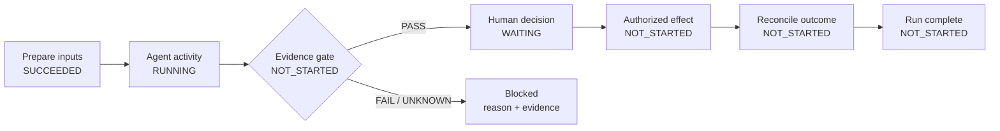
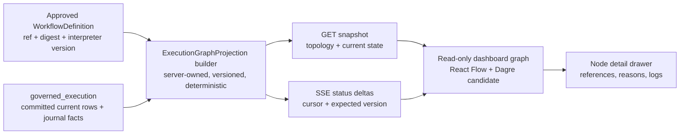

# Deterministic run-graph visualization research and architecture proposal

| Field | Value |
|---|---|
| Research ID | `RES-EXEC-GRAPH-001` |
| Version | `0.2.0` |
| Date | 2026-07-30 |
| Status | **REVIEWED DRAFT RESEARCH PROPOSAL — NON-NORMATIVE; NOT IMPLEMENTATION AUTHORITY** |
| Question | How should Ranex show the deterministic workflow of a governed run started for a Kanban work item? |
| Ranex subject | `bootstrap/pre-upstream@a573502a87e0599cf6e5f9456c348bf1a7686382` |
| Primary architecture | [`ARCH-RANEX-001` v2.10.0](../architecture/HERMES_GROUND_ZERO_FULL_SYSTEM_ARCHITECTURE.md) |
| Decision effect | None. Adoption requires an accepted RFC/ADR, dependency qualification, schemas, tests, and applicable readiness gates |
| Reviewed draft | v0.1.0, SHA-256 `2b5e4476defd01ece67bbf0f62b60dcd47a09f5932eeee55ae0d5ae32257dc0d` |
| Advisory model review | DeepSeek V4 Pro and HY3 both returned `FIT_WITH_CHANGES`; findings are reconciled in §17 |
| Runtime evidence | None; Ranex runtime remains `NOT_ASSESSED` |

## 1. Answer in one paragraph

This feature is a good conceptual fit for Ranex if it is implemented as a
**read-only visualization of one already-governed run**, not as a second
workflow engine or a source of state. Open a Kanban work item, select one of its
runs, and display the immutable workflow topology with live status overlaid on
its nodes. The server, inside the `governed_execution` boundary, derives a
versioned `ExecutionGraphProjection`; the browser renders that projection and
never infers transitions, evaluates rules, or advances the work item. For a
React dashboard, the leading implementation candidate is
[`@xyflow/react`](https://github.com/xyflow/xyflow) with
[`@dagrejs/dagre`](https://github.com/dagrejs/dagre) for the initial
left-to-right layout. Airflow, Argo Workflows, Gitea, GitLab, Kestra, and
Dagster demonstrate the underlying pattern in production open-source systems.
An ordered/table presentation of the same projection remains an equal,
non-spatial way to inspect every run.

## 2. What, when, and where

### 2.1 What the user sees

A run graph answers five questions without requiring the user to understand
Ranex internals:

1. What process was selected for this run?
2. Which step is active now?
3. What already passed, failed, or was not taken?
4. Where is the run waiting or blocked, and why?
5. What evidence, rule, decision, permit, effect, or reconciliation record
   supports that state?

The main graph stays simple. A node shows an icon, short name, state, duration,
and attempt count. Selecting it opens a details drawer with reason codes and
opaque references to evidence, rules, decisions, logs, artifacts, permits, and
effects.

### 2.2 When it appears

The feature is used:

- after a governed run has been requested for a Kanban work item;
- while that run is `READY`, `RUNNING`, `WAITING`, or `BLOCKED`;
- after it reaches `SUCCEEDED`, `FAILED`, or `CANCELLED`, as an audit and
  debugging record; and
- on reconnect, when the user needs to establish whether the displayed state is
  current.

There can be many runs for one work item. The server must identify eligible or
active runs and the user must be able to select the exact run. The browser must
not silently equate “newest” with “authoritative.”

If exactly one current run is explicitly linked by the server-owned work-item
projection, **View execution** may open that exact `RunId`. If there is no
unique current link, the action opens the run selector. Creation time alone is
never a default-selection rule.

### 2.3 Where it lives

The proposed dashboard journey is:

```text
Kanban board
  -> open work-item card
  -> Runs / Execution tab
  -> select exact RunId
  -> read-only graph
  -> select node for evidence and diagnostics
```

The board card should show only a compact run summary and a
**View execution** action. A full graph inside every card would make the board
unusable and would blur `WorkItemStatus` with `RunStatus`.

The proposed UI home is the architecture's target
`apps/web-dashboard/src/features/runs/` boundary; that directory does not yet
exist in this branch. The dashboard framework is still an adoption decision.
The projection and API proposed here are framework-independent.

## 3. The simple user-facing graph

The following is an illustrative rendering, not a new workflow definition and
not a state machine:



The same run still belongs to a separately governed work item:

```text
WorkItemStatus = IN_PROGRESS       RunStatus = RUNNING
         work_management       governed_execution
```

A run becoming `SUCCEEDED` must not move the work item. The normal
work-management transition still requires its own exact evidence, gate, and
decision.

## 4. Ranex constraints this proposal must preserve

The accepted architecture already establishes the important boundaries:

- `work_management` alone owns canonical `WorkItemStatus`;
- boards and dashboards are projections, never completion authorities;
- `governed_execution` alone owns run transitions, pinned workflows,
  activities, gate bindings, permits, effects, and reconciliation;
- one run pins an approved workflow definition, interpreter version, and policy
  activation;
- the same workflow/interpreter versions and ordered recorded inputs replay to
  the same state and commands;
- `OUTCOME_UNKNOWN` is a first-class result and must enter reconciliation;
- workflow definitions are immutable approved data; a model may draft one but
  cannot activate it; and
- sequence, deterministic choice, activity, evidence gate, durable wait/timer,
  classified retry, cancellation, compensation request, reconciliation wait,
  and terminal results are the initial workflow semantics. Parallel fan-out,
  maps, and dynamic graph mutation are extension points, not silently available
  semantics.

Therefore the visualization cannot:

- implement or duplicate a transition table in TypeScript;
- evaluate a gate or rule in the browser;
- infer that a path was skipped merely because another path is active;
- turn missing, conflicting, stale, or malformed data into a green state;
- mutate the workflow through drag-and-drop;
- issue a permit or invoke an effect;
- automatically transition the Kanban card; or
- treat a Hermes session, worker process, or provider response as canonical
  run state.

## 5. Prior art: the wheel already exists

### 5.1 Product behavior

[GitHub Actions](https://docs.github.com/en/actions/how-tos/monitor-workflows?tool=webui)
generates a real-time graph for each workflow run and lets a user inspect job
and step status and logs. Its workflow files define jobs and dependency edges,
and a run uses a particular workflow revision. The transferable idea is not
GitHub's private implementation; it is the separation of a versioned workflow
definition from one live run of that definition.

[GitLab CI/CD](https://docs.gitlab.com/ci/pipelines/) offers both stage and
dependency views. Its documented UX includes fan-out/fan-in graphs, grouped
similar jobs, expand/collapse behavior, visible failure reasons, and
click-through logs. Those are useful interaction precedents, particularly for
large or repeated graphs.

### 5.2 Open-source implementations

| System | Proven implementation pattern | What Ranex should learn | License posture |
|---|---|---|---|
| [Gitea](https://github.com/go-gitea/gitea/blob/e80a62f5552cad07bf79b2f31687cf5a9b93f1fc/web_src/js/components/WorkflowGraph.vue) | Native SVG workflow graph with pan/zoom, status cards, duration, click-through details, grouped jobs, and path highlighting | Closest open implementation to the requested GitHub Actions experience; its [typed graph model](https://github.com/go-gitea/gitea/blob/e80a62f5552cad07bf79b2f31687cf5a9b93f1fc/web_src/js/components/WorkflowGraph.utils.ts) and [tests](https://github.com/go-gitea/gitea/blob/e80a62f5552cad07bf79b2f31687cf5a9b93f1fc/web_src/js/components/WorkflowGraph.utils.test.ts) are valuable test references. The component is Vue; it is a behavior precedent, not a React reuse candidate | MIT; copied code would require preserving its notice |
| [Apache Airflow](https://github.com/apache/airflow/blob/f781f8b8785496d68c9d9ae725a004764bbc9f1d/airflow-core/src/airflow/ui/src/layouts/Details/Graph/Graph.tsx) | React Flow graph, ELK layout, generated API queries, and a streamed task-status overlay | Strongest direct precedent for a React implementation; it lays out structure separately, then merges live task instances without recalculating topology | Apache-2.0; use the pattern or comply with attribution/NOTICE duties for copied code |
| [Argo Workflows](https://github.com/argoproj/argo-workflows/blob/d98d7b7d73d1b24dd7258153453ea612dbb70092/ui/src/widgets/workflow-graph.tsx) | Watched workflow status plus a DAG viewer; [Dagre computes LR/TB coordinates](https://github.com/argoproj/argo-workflows/blob/d98d7b7d73d1b24dd7258153453ea612dbb70092/ui/src/shared/components/graph/pretty-layout.ts) | Dagre is sufficient for a mature workflow product's straightforward DAG view | Apache-2.0 |
| [Kestra](https://github.com/kestra-io/kestra/tree/e03a4f351328f294e67f62be60af0553401fad7a/ui/packages/topology) | Reusable Vue Flow topology package with Dagre, custom nodes/edges, collapsing, orientation, fit/zoom, and execution progress | Confirms that a flow renderer plus Dagre works beyond React and can remain a reusable presentation package | Apache-2.0 |
| [Dagster](https://github.com/dagster-io/dagster/blob/014641bc1bdb71ea2c7f40371691103bbff5c9c7/js_modules/dagster-ui/packages/ui-core/src/graph/layout.ts) | Dagre-backed layout with a custom SVG viewport, ports, parent graphs, pan/zoom, and keyboard navigation | A custom renderer is possible, but its code and accessibility burden are larger than Ranex needs for the first slice | Apache-2.0 |
| [Dagu](https://github.com/dagu-org/dagu/blob/3fd7eeff69e2df281cd8bd8f47348baf8d3462be/ui/src/features/dags/components/visualization/Graph.tsx) | Mermaid strings rebuilt with runtime status classes and interaction hooks | Useful evidence for a very small implementation, but repeated Mermaid rendering and DOM patching are a weaker live-UI foundation | GPL-3.0; do not copy into Ranex without a deliberate compatibility decision |

This is enough evidence to avoid inventing a graph framework or importing
another workflow engine. Ranex needs a small projection adapter and renderer,
not a new orchestration core.

## 6. Synthesis of the proven approach

The common architecture across the strongest examples is:

1. Keep the workflow definition/topology separate from run status.
2. Give every node a stable identifier.
3. Compute layout only when topology or grouping changes.
4. Stream or poll status and merge it by node ID.
5. Make nodes selectable for details and logs.
6. Keep the graph read-only during execution.
7. Degrade intentionally for large graphs.

Airflow is especially relevant. Its graph obtains structure and layout, then
adds streamed task-instance summaries “without having to recalculate how the
graph is laid out.” It also renders only visible elements and removes a minimap
for very large graphs. Gitea supplies useful algorithms and tests for
topological levels, transitive-edge reduction, grouping, cycles, stable paths,
and ancestor/descendant highlighting.

## 7. Proposed Ranex architecture



### 7.1 Authority boundary

`ExecutionGraphProjection` is an immutable application query/view owned by
`governed_execution`. It joins:

- the exact pinned workflow definition;
- current committed Run, Activity, Gate, Permit, Effect, and reconciliation
  facts;
- safe references to separately owned policy, assurance, artifact, and human
  decision records; and
- projection metadata that lets a client detect stale, missing, or reordered
  updates.

The projection is not a new aggregate, workflow interpreter, or event store.
The dashboard receives facts already interpreted by the owning server
boundary. It must not replay raw events to discover canonical state.

Before implementation, an RFC/ADR must register the projection as a
`governed_execution` query capability, its schema under `schemas/execution/`,
its generated client/server contracts, and a fitness test that prevents
`work_management` or the dashboard from publishing a competing execution
truth.

### 7.2 Deterministic topology contract

Pixel coordinates are presentation data. The authoritative deterministic claim
is the workflow topology and execution reduction, not a particular screen
position.

Every run graph must bind:

- `run_id`;
- `workflow_definition_ref` and content digest;
- `workflow_interpreter_version`;
- `workflow_policy_ref`;
- sorted, stable `workflow_node_id` and edge IDs;
- a `topology_digest` over the canonical topology, excluding live status;
- `run_aggregate_version`;
- a monotonically ordered projection version or cursor; and
- the layout algorithm ID/version used by the client build.

The server alone computes `topology_digest` as SHA-256 over an RFC 8785
canonical JSON topology contract. Its closed input includes the workflow
definition digest, interpreter version, stable node IDs and semantic kinds, and
stable edge IDs, sources, targets, kinds, and defined choice conditions. It
excludes all run status, timestamps, durations, labels localized for display,
viewport state, layout coordinates, and client theme data. The exact closed
field set requires a versioned schema and golden fixtures before adoption.

For the same pinned definition and supported interpreter version:

- node and edge identity is identical;
- canonical ordering is identical;
- the topology digest is identical;
- deterministic-choice alternatives exist in the definition before execution;
- live state changes never move, add, or delete a node; and
- a topology mismatch is visible and triggers a complete refetch.

Dagre output also depends on node insertion order and library behavior.
Therefore Ranex must sort canonical inputs and release-pin the layout package.

Dynamic graph mutation is out of scope until the workflow architecture
formally defines it. An unknown node or edge is a visible unsupported/unknown
condition, never an invitation for the browser to improvise topology.

### 7.3 Proposed projection shape

This is a research sketch, not a registered schema:

```json
{
  "schema_version": "execution-graph-projection/v1",
  "project_id": "ProjectId",
  "work_item_id": "WorkItemId",
  "run_id": "RunId",
  "run_status": "RUNNING",
  "run_aggregate_version": 14,
  "workflow_definition_ref": "ArtifactRef",
  "workflow_definition_digest": "sha256:...",
  "workflow_interpreter_version": "SemVer",
  "workflow_policy_ref": "ArtifactRef",
  "topology_digest": "sha256:...",
  "projection_version": 37,
  "last_event_sequence": 92,
  "consistency": "CURRENT",
  "nodes": [],
  "edges": []
}
```

A node should contain only presentation-safe fields and references:

| Field group | Proposed content |
|---|---|
| Identity | workflow node ID, node kind, label, optional activity/gate/effect ID |
| State | server-derived visual state, display-only canonical source axis/value, attempt, start/end/duration |
| Explanation | reason codes, safe summary, blocked/waiting cause |
| Proof links | evidence, gate evaluation, policy/rule activation, human decision, artifact/log, permit/effect/reconciliation refs |
| Safety | classification, redaction state, detail availability |

An edge should identify source, target, semantic kind, defined condition/outcome,
and server-reported traversal disposition. “Not traversed,” “not applicable,”
and “unknown” are different facts.

The canonical source axis/value is present for explanation and diagnostics. The
client must not map it to color, eligibility, traversal, or visual state; those
are supplied by the server's generated projection contract.

## 8. Rules, gates, and process nodes

Rendering every rule as a node would turn even a small run into unreadable
spaghetti and confuse policy evaluation with process execution.

Use this rule:

- a workflow activity, durable wait, deterministic choice, evidence gate,
  human decision, authorized effect, reconciliation, or terminal is a graph
  node when the workflow can advance, wait, block, or terminate there;
- applicable policies and individual rule/checker results appear as badges and
  counts on the relevant node; and
- selecting the node reveals exact rule activation, evaluation, evidence, and
  reason references.

An expandable gate group can be considered later if users regularly need to
compare many checker results. It should not be part of the simple first slice.

## 9. Visual-state semantics

The UI needs a small projection vocabulary, but it must preserve distinctions
from canonical states.

| Visual state | Meaning |
|---|---|
| `NOT_STARTED` | Defined in the pinned topology and not yet enabled |
| `ACTIVE` | Requested or dispatched work is currently executing |
| `WAITING` | Waiting for a durable signal, timer, human decision, or retry time |
| `BLOCKED` | A named blocker prevents legal progress |
| `SUCCEEDED` | Required node outcome is proven successful/pass |
| `FAILED` | A terminal classified failure is recorded |
| `CANCELLED` | The node/run was cancelled under the canonical lifecycle |
| `NOT_APPLICABLE` | Qualified evaluation says the node/check does not apply |
| `UNKNOWN` | Required truth is missing, stale, malformed, unsupported, or unavailable |
| `CONFLICT` | Authoritative inputs disagree |
| `CHECKER_FAULT` | The checker failed rather than proving subject failure |
| `OUTCOME_UNKNOWN` | An attempted effect may or may not have happened and requires reconciliation |

This proposed vocabulary is a server-derived read model, not a replacement for
`RunStatus`, `ActivityStatus`, `GateOutcome`, or `EffectStatus`. Mapping must be
one closed, total, generated, server-owned function and contract-tested for
every source value. An unmapped canonical state resolves to `UNKNOWN`. A visual
state is never accepted as a command input, never becomes a transitionable
axis, and never aliases or extends a canonical state registry.

Every state uses icon, text, and shape/border treatment as well as color.
Animating an active node is optional and must respect reduced-motion settings.

## 10. Snapshot and live-update transport

Proposed read APIs:

```text
GET /api/work-items/{work_item_id}/runs
GET /api/runs/{run_id}/graph
GET /api/runs/{run_id}/graph/events?after={cursor}
GET /api/runs/{run_id}/nodes/{workflow_node_id}
```

Server-Sent Events are the leading live-update candidate because this feature
is a one-way read stream and the accepted dashboard target is loopback-only.
Loopback does not waive authentication, authorization, origin checks, or
redaction. SSE is not registered by the current architecture; selecting it
requires the RFC/ADR to register a web transport port/adapter and its security,
reconnect, resource, and shutdown behavior. Snapshot plus authenticated polling
is the compatible first tracer.

The first response is always a complete snapshot. The snapshot and its cursor
must be read from the same `governed_execution` consistency cell and read
transaction. A subscriber starts strictly after that cursor; the server either
replays every retained delta after it or requires a new snapshot. Each delta
includes:

- event/cursor ID;
- run ID;
- topology digest;
- expected previous and new projection versions;
- affected stable node/edge IDs; and
- the complete replacement state for those affected records.

On a cursor gap, version mismatch, topology mismatch, server restart, invalid
payload, or reconnect outside the retention window, the client discards
untrusted deltas and refetches the full snapshot. Slow polling is an acceptable
fallback. Airflow's newline-delimited stream is a viable alternative if the
existing transport layer standardizes on it; WebSocket is unnecessary for the
read-only first slice.

Status deltas update node data without rerunning layout. Only a changed
topology digest, grouping selection, or orientation may trigger layout.

## 11. Technology choice

| Candidate | Fit | Decision |
|---|---|---|
| React Flow + Dagre | Read-only custom nodes, pan/zoom/fit, selection, keyboard/screen-reader affordances, simple directed layout; both MIT | **Recommended first implementation if React is retained** |
| React Flow + ELK | Better compound graphs, ports, cross-hierarchy routing, and complex layout; Airflow proves the combination | Hold as an upgrade path; more configuration, worker/bundle complexity, and EPL-2.0 qualification |
| Native SVG based on Gitea | Maximum control and a close visual precedent | Do not start here; Ranex would inherit viewport, focus, keyboard, ARIA, routing, and performance work |
| Mermaid runtime | Very small static proof of concept | Suitable for this research document, not the live authority-facing UI |
| Import Airflow/Argo/Kestra/Dagu as an engine | Rich existing workflow products | Reject; Ranex already owns different workflow and authority semantics |

[React Flow's layout guide](https://reactflow.dev/learn/layouting/layouting)
explicitly treats layout as a separate concern and describes Dagre as a simple
choice for directed trees, with ELK for more configurable cases. Its
[accessibility guide](https://reactflow.dev/learn/advanced-use/accessibility)
documents keyboard and screen-reader behavior. Those capabilities reduce work;
they do not make a custom Ranex node accessible automatically.

Dependency versions must be selected and pinned by the normal
`supplier_governance` adoption process, including license compatibility,
support/maintenance and vulnerability evidence, concentration risk, and an
exit/upgrade plan. The maintained `@dagrejs/dagre` package must not be confused
with legacy Dagre packages. No package is adopted by this research.

## 12. Suggested source placement

If an implementation ADR selects React, a cohesive feature slice would be:

```text
apps/web-dashboard/src/features/runs/execution-graph/
  api/
  components/
  model/
  layout/
  accessibility/
  __tests__/
```

Generated transport types belong in `generated-contracts`; the feature imports
them. The graph feature must not import canonical transition tables or policy
evaluators.

The corresponding server query/projection code belongs inside:

```text
src/ranex/governed_execution/application/
```

That path is part of the accepted target tree; no main-branch implementation is
claimed to exist.

Technology-specific streaming delivery belongs behind the applicable Ranex
transport adapter, not in the domain or reducer.

## 13. MVP boundary

The first useful slice is deliberately small:

- Kanban card shows the selected/active run summary and **View execution**;
- run page shows one read-only, left-to-right graph;
- custom nodes show name, icon, state, duration, and attempts;
- click/keyboard activation opens a details drawer;
- pan, zoom, reset, and fit are available;
- status updates live without moving nodes;
- a reconnecting/stale/unknown banner is explicit;
- terminal graphs can be regenerated for audit from canonical retained facts,
  subject to artifact and legal-retention policy; and
- an accessible ordered/table view exposes the same nodes, edges, states, and
  details without requiring spatial navigation.

Graph and ordered/table views are two presentations of the same projection and
the user can switch between them. The requested graph remains the default
prototype view. Representative linear and branching fixtures must establish
whether a compact list should become the default for simple workflows; this
research does not invent a node-count threshold.

Not in the first slice:

- workflow authoring or drag-and-drop;
- run commands such as retry/cancel embedded in graph nodes;
- cross-run comparison;
- a timeline/Gantt view;
- minimap;
- user-defined graph themes;
- parallel/map/dynamic topology before those semantics are authoritative; or
- automatic work-item transitions.

## 14. Acceptance and falsification tests

### 14.1 Determinism

- The same pinned definition and interpreter produce identical stable node IDs,
  edge IDs, canonical ordering, and topology digest.
- Shuffled database/query order does not change canonical topology or layout
  input.
- A changed workflow definition or interpreter cannot reuse the old topology
  binding silently.
- Status-only updates do not change coordinates.
- Duplicate and out-of-order deltas are ignored or cause a safe resync.
- A cursor gap or digest mismatch causes a full snapshot refetch.
- The snapshot state and resumable cursor are captured atomically; a simulated
  write between them cannot disappear.

### 14.2 Semantic fidelity

Fixtures cover:

- linear success;
- deterministic choice with taken, not-taken, and unknown dispositions;
- retry and final attempt;
- evidence `PASS`, `FAIL`, `UNKNOWN`, `CONFLICT`, `NOT_APPLICABLE`, and
  `CHECKER_FAULT`;
- human wait;
- run block/unblock;
- cancellation and compensation request;
- effect `OUTCOME_UNKNOWN` followed by reconciliation;
- terminal failure and success; and
- a successful run whose work item remains unchanged.

Projection replay/query results must agree with the canonical committed rows.
Any unmapped state, missing required reference, or disagreement is visibly
`UNKNOWN` or `CONFLICT`, never green.

### 14.3 Usability, accessibility, security, and performance

- Keyboard users can traverse/select nodes and open/close details.
- A screen reader receives a run summary, current state announcement, and a
  non-spatial table/list alternative.
- The implementation RFC proposes [WCAG 2.2](https://www.w3.org/TR/WCAG22/)
  Level AA as the dashboard baseline and defines role/name/value, focus order,
  target size, contrast, and assistive-technology fixtures for the graph,
  drawer, and ordered view.
- State is never conveyed by color alone; reduced motion is honored.
- Classified node content is replaced by authorized safe summaries and opaque
  references.
- Raw prompts, source, model output, credentials, and secrets never appear just
  because a graph node exists.
- Authorization and classification/redaction are independently enforced when
  dereferencing every evidence, log, artifact, rule, decision, permit, effect,
  and reconciliation link; possession of a graph reference grants no access.
- Authorization is enforced for snapshot, stream, detail, and dereference
  endpoints.
- Layout/status performance is measured with representative small, medium, and
  boundary-size fixtures; thresholds are set by an accepted quality-attribute
  decision rather than invented in this research.

## 15. Risks and failure modes

| Risk | Required response |
|---|---|
| Graph looks authoritative while stale | Show consistency/cursor state; refetch on gaps; never retain green certainty after invalidation |
| UI duplicates business rules | Server-owned closed projection mapping; architecture test forbids authority imports |
| Rules overwhelm the flow | Keep rules in badges/details; make only process-stopping gates first-class nodes |
| Multiple runs are confused | Always show exact `RunId`, attempt, workflow digest/version, and explicit selector; auto-open only a unique server-linked current run |
| Layout jumps on every event | Split topology from status; cache layout by topology digest and grouping/orientation |
| Large graph becomes unusable | Collapse supported groups, render visible elements, add search; qualify ELK only when real fixtures demand it |
| Accessibility is treated as a library feature | Add Ranex-specific keyboard, ARIA, table fallback, contrast, and assistive-technology tests |
| Upstream code is copied casually | Prefer libraries and original adapters; record provenance and license obligations for any copied fragment |
| Unsupported dynamic nodes appear | Fail visibly as unknown/unsupported and refetch; do not synthesize topology |
| Cached graph outlives canonical retention | Treat it as a disposable derived view; regenerate only from facts still legally available and preserve redaction/purge outcomes |

## 16. Is it a good fit for Ranex?

### 16.1 Why it fits

- Ranex already models a run as a versioned deterministic workflow.
- The journal, current rows, stable IDs, and exact subject bindings provide
  better provenance than a generic task-progress widget.
- The dashboard is already defined as a presentation-only authority view.
- A visual graph makes waiting, blocking, gate, permit, effect, and
  reconciliation states understandable to a non-technical owner.
- Mature open-source projects prove the renderer/layout/live-overlay pattern.
- The first slice is local, read-only, and reversible; it does not require a new
  workflow engine.

### 16.2 Conditions that would make it a bad fit

It is a bad fit if implementation:

- begins before the run/workflow projection contract is closed;
- uses the graph library as the workflow interpreter;
- allows the client to decide state or eligibility;
- presents probabilistic agent progress as canonical workflow progress;
- hides unknown/conflict/reconciliation states behind generic pending/failed
  colors;
- adds editing before versioning and activation governance exist; or
- consumes more complexity than a compact ordered step list for the workflows
  Ranex actually runs.

The last point must be tested with users. A graph is justified when branching,
waiting, gates, retries, or reconciliation make a list hard to understand. A
linear three-step run should still be readable as a compact list and accessible
table. The graph prototype and table must use the same fixtures and be compared
before the renderer dependency is adopted.

## 17. DeepSeek and HY3 review reconciliation

Both reviewers received the unchanged v0.1.0 draft with digest
`2b5e4476defd01ece67bbf0f62b60dcd47a09f5932eeee55ae0d5ae32257dc0d`.
They ran sequentially, read-only, and neither saw the other's result.

| Reviewer | Route / variant | Local session | Verdict |
|---|---|---|---|
| DeepSeek V4 Pro | `opencode-go/deepseek-v4-pro`, `high` | `ses_04e188329ffemvBenGw0MKQBwi` | `FIT_WITH_CHANGES` |
| HY3 | `openrouter/tencent/hy3`, `high` | `ses_04e138bf8ffehwkokIuiXgPeJ3` | `FIT_WITH_CHANGES` |

These are advisory model observations, not independent approval, a readiness
gate, or runtime proof.

The session IDs are local provenance, and raw provider output is not included
in this repository. This section is a primary-source-checked reconciliation,
not independently reproducible evidence of the complete model responses.

### 17.1 Findings accepted

- Register the projection, schema, generated contracts, transport, and fitness
  boundary through an RFC/ADR before implementation.
- Define `topology_digest` with server-only canonicalization and golden
  fixtures; do not claim deterministic pixels.
- Capture snapshot state and cursor from one consistency cell/read transaction,
  and refetch safely on any gap.
- Make the visual-state mapping total, server-owned, non-transitionable, and
  fail-closed.
- State plainly that the dashboard/source paths and React choice are targets,
  not current main-branch implementation.
- Qualify the renderer and layout packages through supplier governance.
- Extend authorization and redaction through every referenced detail endpoint.
- Define an accessibility baseline and preserve a complete non-spatial view.
- Treat terminal graphs as regenerated derived views under canonical retention,
  not as separately immortal audit artifacts.
- Define exact run selection; never guess solely from recency.

### 17.2 Findings accepted with modification

- Both reviewers argued that a list might be simpler. That is a valid
  falsification test, but the owner explicitly confirmed the need to visualize
  each deterministic run. The reconciled direction keeps a graph prototype and
  makes the ordered/table view coequal; representative fixtures decide defaults
  before dependency adoption.
- HY3 proposed retaining projection deltas for the whole audit period. That is
  unnecessary: deltas support reconnect, while the graph is regenerated from
  canonical facts retained by their owning policies.
- HY3 proposed removing canonical source state from the payload. The
  reconciliation retains it as display-only diagnostic truth and forbids the
  client from deriving visual or transition semantics from it.

### 17.3 Findings rejected or refuted

- HY3 called loopback deployment unestablished. `ARCH-RANEX-001` fixes the web
  dashboard as loopback-only. Its security conclusion still stands:
  loopback is not an authentication or redaction exemption.
- DeepSeek stated that the maintained Dagre repository had not released since
  2019. The official project lists
  [`@dagrejs/dagre` v2.0.0](https://github.com/dagrejs/dagre/releases/tag/v2.0.0)
  from 2025. Supplier qualification remains required, but that maintenance
  premise is false.
- Airflow using ELK does not contradict Dagre for a simple first graph. Argo,
  Kestra, and Dagster establish Dagre precedent; Airflow establishes the
  upgrade pattern when compound graphs and routing require ELK.

### 17.4 Reconciled verdict

**FIT WITH ARCHITECTURE WORK BEFORE IMPLEMENTATION.** The feature belongs in
Ranex because it explains an existing deterministic governed run to the user.
It is not ready to build from this research alone because the projection,
transport, accessibility baseline, supplier decisions, and quality thresholds
are not yet accepted contracts.

## 18. Recommended decision and delivery sequence

1. Accept this only as research.
2. Preserve §17 as advisory review evidence, not decision authority.
3. Run a user-facing graph/table prototype using synthetic, non-authoritative
   linear, branching, waiting, gate, retry, and reconciliation fixtures.
4. Record an RFC/ADR choosing the projection owner, contract, transport,
   renderer, layout engine, dependency licenses, and quality thresholds.
5. Add versioned projection/delta schemas and generated TypeScript/Python
   contracts.
6. Implement server projection tests before the visual component.
7. Implement the read-only MVP and run accessibility, security, replay,
   resilience, and performance checks.
8. Do not claim runtime conformance until applicable readiness evidence passes.

## 19. Source and license register

All findings above are original Ranex synthesis and paraphrase, including the
review reconciliation. No upstream code is copied into this document.

| Source | Frozen revision or authoritative page | License / use |
|---|---|---|
| GitHub Actions workflow monitoring | [GitHub Docs](https://docs.github.com/en/actions/how-tos/monitor-workflows?tool=webui), accessed 2026-07-30 | Product behavior/documentation reference |
| GitHub Actions workflow model | [GitHub Docs](https://docs.github.com/en/actions/concepts/workflows-and-actions/workflows?learn=getting_started&learnproduct=actions), accessed 2026-07-30 | Product behavior/documentation reference |
| GitLab pipeline graph | [GitLab Docs](https://docs.gitlab.com/ci/pipelines/), accessed 2026-07-30 | Product behavior/documentation reference |
| Gitea workflow graph | [`e80a62f5552cad07bf79b2f31687cf5a9b93f1fc`](https://github.com/go-gitea/gitea/tree/e80a62f5552cad07bf79b2f31687cf5a9b93f1fc) | MIT; code inspection only |
| Apache Airflow graph | [`f781f8b8785496d68c9d9ae725a004764bbc9f1d`](https://github.com/apache/airflow/tree/f781f8b8785496d68c9d9ae725a004764bbc9f1d) | Apache-2.0; code inspection only |
| Argo Workflows graph | [`d98d7b7d73d1b24dd7258153453ea612dbb70092`](https://github.com/argoproj/argo-workflows/tree/d98d7b7d73d1b24dd7258153453ea612dbb70092) | Apache-2.0; code inspection only |
| Kestra topology | [`e03a4f351328f294e67f62be60af0553401fad7a`](https://github.com/kestra-io/kestra/tree/e03a4f351328f294e67f62be60af0553401fad7a) | Apache-2.0; code inspection only |
| Dagster graph layout | [`014641bc1bdb71ea2c7f40371691103bbff5c9c7`](https://github.com/dagster-io/dagster/tree/014641bc1bdb71ea2c7f40371691103bbff5c9c7) | Apache-2.0; code inspection only |
| React Flow / XYFlow | [`360f5b13e2bc6899ea06b4be1a49b068d86926cf`](https://github.com/xyflow/xyflow/tree/360f5b13e2bc6899ea06b4be1a49b068d86926cf) and [official docs](https://reactflow.dev/) | MIT; candidate dependency, not adopted |
| Dagre | [DagreJS repository](https://github.com/dagrejs/dagre), inspected 2026-07-30 | MIT; candidate dependency, not adopted |
| ELK / elkjs | [ELK layered algorithm](https://eclipse.dev/elk/reference/algorithms/org-eclipse-elk-layered.html) and [elkjs](https://github.com/kieler/elkjs) | EPL-2.0; upgrade candidate requiring qualification |
| Dagu graph | [`3fd7eeff69e2df281cd8bd8f47348baf8d3462be`](https://github.com/dagu-org/dagu/tree/3fd7eeff69e2df281cd8bd8f47348baf8d3462be) | GPL-3.0; behavior observation only, no code reuse proposed |
| WCAG 2.2 | [W3C Recommendation](https://www.w3.org/TR/WCAG22/), accessed 2026-07-30 | Proposed accessibility baseline; not yet adopted by Ranex |

## 20. Provisional conclusion

Proceed to an RFC and synthetic prototype, not directly to product
implementation. DeepSeek and HY3 both concluded that the concept fits with
changes, and primary-source reconciliation supports that verdict. A governed
run already has the deterministic structure and authoritative state that a
trustworthy graph needs. The safest proven implementation is a server-owned,
digest-bound projection rendered read-only with a mature flow library; the
graph remains an explanation of authority, never authority itself.
