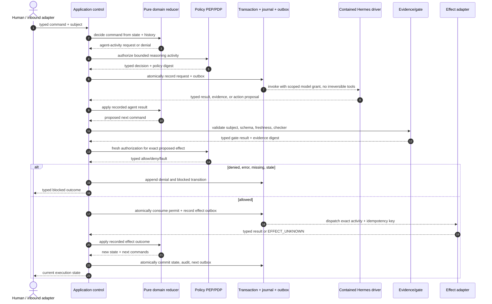
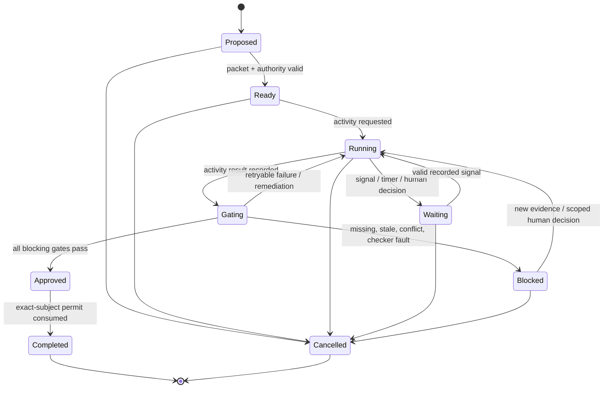

# Hermes core architecture research for Ranex

- **Date:** 2026-07-27
- **Decision status:** architecture recommendation; no Ranex runtime exists yet
- **Ranex revision inspected:** `3844673b0bfa743de3c351566b6ffa9ffd67e0b8`
- **Ranex alignment brief reviewed:** `docs/research/cookbook-alignment-research-2026-07-27.md` in full
- **Primary Ranex design authority sampled:** `RANEX_IMPLEMENTATION_GUIDE.md`
- **Hermes upstream revision audited:** `d71033a4077a6dfdcdb42c9e9eeab4c41e4a7012`
- **Hermes version at that revision:** `0.19.0`
- **HY3 architecture review:** executed through OpenCode `1.18.7`,
  OpenRouter, `tencent/hy3`, variant `high`; see
  `docs/research/hermes-core-architecture-hy3-review-2026-07-27.md`
- **Independent architecture red-team:** completed in parallel, but not by a cross-family model and therefore not a substitute for the requested HY3 review

## Executive decision

Hermes is a capable, aggressively extended personal-agent product. It is
**modular at several edges**, but it is **not a modular DDD application at its
core**.

Its effective center is a shared, mutable `AIAgent` plus a set of very large
technical modules, process-global registries, import-time discovery, and a
10,000-line multipurpose `SessionDB`. Several recent extractions explicitly
retain access to the parent `AIAgent` and back-import `run_agent.py`. That is a
useful transitional refactor, but it is closer to a distributed god object than
to a dependency-enforced modular monolith.

Ranex should therefore make this architectural inversion:

```text
Hermes today:
agent loop -> tools, approvals, jobs, delegates, state, gateways

Ranex target:
governed workflow kernel
  -> mandatory policy/evidence/approval gates
  -> typed activity dispatcher
  -> Hermes as a replaceable agent driver/contained worker
  -> each proposed effect as a separately authorized activity
```

The owner's theory about deterministic workflows is directionally correct, with
one important boundary:

- **Bake workflow semantics, state invariants, replay/version rules, signals,
  retries, cancellation, and effect authorization into the Ranex product core.**
- **Do not bake a vendor SDK, a visual workflow editor, every workflow
  definition, or a speculative generic workflow platform into that core.**

The narrow core should know how a governed execution legally advances. It
should not know how OpenRouter calls HY3, how Telegram renders a message, how
Temporal stores history, how Atlas parses Python, or how Hermes assembles an
agent prompt.

The recommended product is a **batteries-included modular monolith**:

- one Ranex release;
- a small non-replaceable control kernel;
- first-party modules shipped and qualified with that release;
- an explicit composition root and activation profile;
- effectful or untrusted executors isolated behind typed ports;
- no microservice fleet for the one-host v1;
- no user-installed plugin in the authority path.

**OWNER REQUIREMENT + ARCHITECTURE PROPOSAL.** The strongest one-sentence
boundary is:

> **Ranex owns control, authority, state, and proof; Hermes supplies reasoning.**

The negative case—Hermes must not own Ranex authority—is supported by the
pinned source. The positive case—that Ranex can cleanly extract and own all
four responsibilities—remains a P0 implementation hypothesis.

That sentence does **not** mean one opaque, freely retryable Hermes
conversation should hide many effects. The transitional Hermes worker must have
no direct irreversible authority. The target Hermes driver proposes typed
actions; Ranex authorizes, schedules, records, and reconciles each effect.

## Status and maturity vocabulary

This report uses two independent labels. Evidence status says what kind of claim
is being made. Maturity says how safe it is to make the mechanism a baseline.

| Evidence status | Meaning |
|---|---|
| **FACT** | Directly observed in the pinned source, local Ranex documents, or a primary source. |
| **INFERENCE** | Follows from facts but is not stated directly by a source. |
| **PROPOSAL** | A recommended Ranex design; it is not implemented proof. |
| **UNKNOWN** | Evidence is insufficient or conflicting. |
| **OWNER REQUIREMENT** | Product direction already fixed in the Ranex brief or guide. |

| Maturity | Meaning |
|---|---|
| **MATURE** | Stable pattern with explicit failure behavior and production/standards precedent. Still needs Ranex acceptance tests. |
| **MATURE PATTERN / UNPROVEN IN RANEX** | The general mechanism is mature; the proposed local composition is not. |
| **MATURING** | Useful implementation or seam with real use, but boundaries or failure semantics still need work. |
| **FOGGY / R&D** | The correct product-specific contract or implementation choice is unresolved. |
| **FLAKY / REJECT** | Unsafe premise or mechanism for the stated authority boundary. |

“Mature” never means “correct without testing,” and a model opinion is never an
authority record. That applies to HY3 as much as to any other model.

## Scope and method

### Local material read

The 1,496-line Cookbook alignment report was read in full. Relevant parts of
the 7,338-line implementation guide were checked directly, including the
objective, operating principle, definition of done, control/execution/evidence
planes, authority matrix, and layered-rule design.

The alignment brief fixes these boundaries:

1. Ranex is an owned Hermes fork and a future product, not an independent
   plugin installed into Hermes.
2. Models propose; deterministic gates and explicit humans authorize.
3. Ranex is a batteries-included modular monolith.
4. Required first-party capabilities are baked into the distribution behind
   stable internal interfaces.
5. External Hermes plugins remain a lower-trust compatibility surface.
6. One deterministic transaction boundary must own canonical state, events,
   outbox records, and permit consumption.
7. The first delivery should be a small vertical tracer, not nineteen
   disconnected horizontal subsystems.

The direct local anchors are:

- `docs/research/cookbook-alignment-research-2026-07-27.md:12`
- `docs/research/cookbook-alignment-research-2026-07-27.md:175`
- `docs/research/cookbook-alignment-research-2026-07-27.md:199`
- `docs/research/cookbook-alignment-research-2026-07-27.md:224`
- `docs/research/cookbook-alignment-research-2026-07-27.md:257`
- `docs/research/cookbook-alignment-research-2026-07-27.md:853`
- `docs/research/cookbook-alignment-research-2026-07-27.md:995`
- `docs/research/cookbook-alignment-research-2026-07-27.md:1055`
- `RANEX_IMPLEMENTATION_GUIDE.md:236`
- `RANEX_IMPLEMENTATION_GUIDE.md:260`
- `RANEX_IMPLEMENTATION_GUIDE.md:340`
- `RANEX_IMPLEMENTATION_GUIDE.md:430`

### Hermes material inspected

The exact upstream commit was checked out separately and inspected without
modification. The audit covered:

- development architecture rules;
- `AIAgent` construction and conversation execution;
- tool discovery, schemas, dispatch, middleware, approvals, and guardrails;
- plugin manifests, discovery order, hooks, and error behavior;
- provider profiles;
- session persistence and FTS;
- cron, blueprints, delegation, and Kanban;
- gateways and platform plugins;
- base and optional dependencies;
- tests and documented invariants.

The checkout contains 3,452 tracked Python files and about 169,985 Python lines
including tests. Size does not prove bad architecture. It does make enforced
ownership and dependency direction essential.

### External evidence standard

General architecture recommendations use original or official sources:

- Eric Evans's
  [DDD Reference](https://www.domainlanguage.com/wp-content/uploads/2016/05/DDD_Reference_2015-03.pdf);
- Alistair Cockburn's
  [Hexagonal Architecture](https://alistair.cockburn.us/hexagonal-architecture/);
- [Spring Modulith structural verification](https://docs.spring.io/spring-modulith/reference/verification.html);
- [Import Linter contracts](https://import-linter.readthedocs.io/en/stable/contract_types.html);
- [Temporal workflow documentation](https://docs.temporal.io/workflows);
- [AWS durable-execution determinism](https://docs.aws.amazon.com/durable-execution/patterns/best-practices/determinism/)
  and [idempotency](https://docs.aws.amazon.com/durable-execution/patterns/best-practices/idempotency/);
- [Open Policy Agent](https://www.openpolicyagent.org/docs);
- [NIST SP 800-207](https://csrc.nist.gov/pubs/sp/800/207/final);
- [OWASP Excessive Agency](https://genai.owasp.org/llmrisk/llm062025-excessive-agency/);
- the Python Packaging Authority's
  [plugin discovery guide](https://packaging.python.org/en/latest/guides/creating-and-discovering-plugins/);
- [Pluggy](https://pluggy.readthedocs.io/en/stable/);
- Microsoft's
  [event-sourcing cautions](https://learn.microsoft.com/en-us/azure/architecture/patterns/event-sourcing)
  and [transactional outbox guidance](https://learn.microsoft.com/en-us/azure/architecture/databases/guide/transactional-out-box-cosmos).

## What Ranex is actually building

**OWNER REQUIREMENT.** Ranex is a local, one-host, governed software-engineering
system. Its central product value is not “an AI that can call many tools.”
Hermes already does that. Ranex's differentiator is reliable execution of human
rules around variable agents:

- exact project and task scope;
- canonical state and legal transitions;
- stranger-ready task packets;
- separation of maker and checker;
- deterministic gates;
- evidence bound to the exact subject;
- human authority for waivers and high-risk actions;
- crash-safe, idempotent effects;
- measurable effectiveness;
- project isolation and recovery.

That is the **core domain** in the DDD sense: governed execution of stochastic
workers.

Provider calls, chat platforms, terminals, browsers, model memory, and vector
stores are important, but they are supporting or generic capabilities. Treating
them as the center would preserve Hermes's current architectural gravity and
make Ranex policy another optional callback.

### DDD terms that must not be conflated

| Term | Ranex meaning |
|---|---|
| **Core domain** | The business capability that differentiates Ranex: governed, evidence-bound execution. |
| **Shared kernel** | A tiny set of shared IDs, canonical encodings, and base contracts agreed by bounded contexts. It must not become a miscellaneous utilities dump. |
| **Bounded context** | A module with one model, vocabulary, state owner, public API, and enforced dependencies. |
| **Product kernel** | The small set of core-domain contexts whose semantics cannot be bypassed or replaced at runtime. |
| **First-party module** | A bounded capability shipped and qualified with Ranex, replaceable behind an internal interface. It is not necessarily optional to the user. |
| **Adapter** | A replaceable implementation of a port: SQLite, OpenRouter, Telegram, Codex CLI, bubblewrap, Temporal, and so on. |
| **External plugin** | Separately installed code with a lower trust level. It must never acquire kernel authority by import. |

Ranex should avoid calling one giant `kernel/` directory “DDD.” The product
kernel should itself contain a few explicit bounded contexts with separate
models and APIs.

## Hermes core audit

### Verdict: edge-modular, not modular DDD

Hermes's own development guide says:

- the core should be a narrow waist;
- capability should live at the edges;
- providers, memory systems, platforms, context engines, and image systems
  should use plugins or ABCs;
- god files should be extracted.

Those are healthy goals. Several real seams implement them. The current code,
however, does not yet satisfy the stronger Ranex requirement of bounded
contexts and inward-only dependencies.

### Quantitative indicators

At the pinned revision:

| File | Lines | Architectural observation |
|---|---:|---|
| `run_agent.py` | 7,106 | Owns the primary `AIAgent` facade and many compatibility imports. |
| `agent/agent_init.py` | 2,683 | `init_agent` has 72 effective parameters and spans lines 447–2679. |
| `agent/conversation_loop.py` | 6,763 | `run_conversation` alone spans 5,791 lines. |
| `agent/tool_executor.py` | 1,852 | Concurrent and sequential paths are each roughly 700 lines. |
| `agent/agent_runtime_helpers.py` | 3,584 | Provider, transport, prompt, trajectory, and recovery helpers around mutable agent state. |
| `hermes_state.py` | 10,921 | Sessions, messages, FTS, billing, routing, compression locks, pruning, Telegram migrations, and handoff. |
| `model_tools.py` | 1,446 | Import-time discovery, async bridging, tool dispatch, hooks, and compatibility state. |
| `hermes_cli/plugins.py` | 2,485 | Discovery, loading, hooks, middleware, manifests, and plugin state. |
| `tools/registry.py` | 810 | Useful registry seam, but based on import-time registration and process state. |
| `toolsets.py` | 975 | `_HERMES_CORE_TOOLS` currently contains about 54 names. |

The `AIAgent.__init__` facade and extracted initializer both expose 72 effective
parameters. These parameters span provider routing, credentials, callbacks,
toolsets, platform identity, user/chat/thread identity, memory, context,
budgets, checkpoints, and fallback behavior.

**INFERENCE.** A constructor of that shape is not merely a style issue. It
shows that one runtime object is the integration boundary for multiple
subdomains.

### The extractions still point back to the god object

The module docstrings are unusually candid:

- [`agent/agent_init.py`](https://github.com/NousResearch/hermes-agent/blob/d71033a4077a6dfdcdb42c9e9eeab4c41e4a7012/agent/agent_init.py#L1-L15)
  says it extracted the very large initializer while preserving patches through
  `run_agent`; its `_ra()` helper imports `run_agent`.
- [`agent/conversation_loop.py`](https://github.com/NousResearch/hermes-agent/blob/d71033a4077a6dfdcdb42c9e9eeab4c41e4a7012/agent/conversation_loop.py#L1-L12)
  takes the parent `AIAgent`, reads its attributes, and resolves patched symbols
  through `run_agent`.
- [`agent/tool_executor.py`](https://github.com/NousResearch/hermes-agent/blob/d71033a4077a6dfdcdb42c9e9eeab4c41e4a7012/agent/tool_executor.py#L1-L9)
  uses the same parent-object pattern.
- [`agent/agent_runtime_helpers.py`](https://github.com/NousResearch/hermes-agent/blob/d71033a4077a6dfdcdb42c9e9eeab4c41e4a7012/agent/agent_runtime_helpers.py#L1-L19)
  retains compatibility forwarders and parent state.
- `agent/system_prompt.py` dynamically imports `run_agent` so tests that patch
  the old module continue to work.

**FACT.** These are technical extractions, not domain boundaries. They reduce
file size and merge pressure but do not invert dependencies or establish
independent ownership.

### Current dependency shape

The documented tool dependency chain is:

```text
tools/registry.py
       ^
tools/*.py register at import time
       ^
model_tools.py imports registry and triggers discovery
       ^
run_agent.py / cli.py / batch_runner.py / environments
```

The broader observed graph is closer to:

```text
agent -> hermes_cli configuration and timeouts
agent -> concrete tools and display
agent helpers -> run_agent compatibility surface
model_tools -> tool modules + plugin manager + approval system
cron -> CLI config + agent construction + gateway delivery
persistence -> gateway routing + cron projection + platform migrations
plugins -> global registries + arbitrary in-process Python callbacks
gateway -> agent + plugins + sessions + platform-specific auth
```

There are many ABCs and useful providers. There is no repository-wide rule
that enforces:

```text
adapters/modules -> application -> domain
domain -> ports only
```

There are also no visible core-domain aggregates, domain event ownership,
module-owned repositories, unit-of-work boundary, or bounded-context import
rules.

### DDD/modularity scorecard

| Criterion | Finding | Verdict |
|---|---|---|
| Business-oriented bounded contexts | Directories are primarily technical (`agent`, `tools`, `gateway`, `hermes_cli`). | **Absent** |
| Explicit aggregate invariants | Invariants exist, but are distributed across mutable agent, tools, approval helpers, plugins, gateway, and DB code. | **Weak** |
| One owner for canonical state | `SessionDB`, cron JSON, Kanban SQLite, files, and process globals own different pieces. | **Absent for Ranex needs** |
| Ports and adapters | Provider, memory, context, image, platform, and tool seams exist. | **Maturing strength** |
| Inward dependency direction | Back-imports, CLI imports, concrete tool imports, and global registries violate it. | **Absent** |
| Domain events | Hooks and telemetry exist, but are not an authoritative domain history. | **Absent** |
| Module isolation | Disabled/gated capabilities reduce schema exposure, but imports share process and authority. | **Partial** |
| Independent module tests | Large test suite and many real-seam tests exist; boundaries are not independently bootable by domain. | **Partial** |
| Stable public module APIs | Several ABCs/profiles are useful; general plugin manifest is too small for Ranex. | **Maturing** |
| Dependency fitness tests | No Ranex-style no-cycle/public-API/allowed-dependency contract. | **Absent** |

### Strong Hermes seams worth retaining

The audit is not a recommendation to throw Hermes away. These areas contain
valuable operational knowledge:

| Hermes capability | Assessment | Ranex disposition |
|---|---|---|
| Provider profiles and lazy provider discovery | **MATURING** | Retain the vendor-neutral pattern as a provider-module input; remove the Nous profile, last-writer-wins authority, and agent coupling. |
| Platform adapters | **MATURE PATTERN / operationally exercised** | Keep selected adapters behind Ranex delivery ports. |
| Tool registry metadata and availability checks | **MATURING** | Reuse concepts; replace import side effects and arbitrary string outputs. |
| Approval UX and command-risk analysis | **MATURING** | Reuse tested logic as policy inputs/adapters; do not use as Ranex's application-control PEP. |
| SQLite/FTS migration and recovery knowledge | **Operationally mature** | Split behind bounded repository ports; do not preserve `SessionDB` as one class. |
| Prompt-cache and message-alternation invariants | **MATURE within Hermes** | Keep inside the Hermes agent module, not the Ranex kernel. |
| Interrupts, budgets, timeout handling, fallback classification | **Maturing and useful** | Expose through typed activity controls/outcomes. |
| Lazy optional dependencies and exact pins | **MATURE supply-chain practice** | Preserve, with a much smaller `ranex-core` dependency graph. |
| Real-path tests and profile isolation lessons | **MATURE practice** | Carry forward into adapter and cross-project canary tests. |

### Base dependency bloat

Hermes declares 31 base dependencies and 42 optional-dependency groups. Its own
policy says only dependencies used by every session belong in the base.
Nevertheless the base includes packages for:

- interactive CLI rendering;
- cron parsing;
- Skills Hub JWT/cryptography;
- browser WebSockets;
- desktop file matching;
- FastAPI, Uvicorn, and multipart dashboard uploads;
- image resizing;
- platform-specific PTY and Windows behavior.

This is understandable for a broad consumer product. It is too wide for a
Ranex authority kernel. A process that only replays a transition, validates a
permit, or evaluates evidence should not import browser, dashboard, image,
gateway, or provider dependencies.

### Tool “core” is product breadth, not a kernel

`_HERMES_CORE_TOOLS` includes file and terminal operations, but also browser
automation, image generation, TTS, memory, session search, delegation, cron,
Home Assistant, Kanban, and computer use.

Hermes often hides unavailable tools with `check_fn`, which is good for prompt
footprint. It does not make those capabilities core-domain primitives.

For Ranex, no model-facing tool implementation belongs in the kernel. The
kernel owns the typed activity/capability contract and the authority to dispatch
it. Terminal, browser, file, GitHub, model, and message calls are capabilities
implemented by modules/adapters.

## Security and authority audit

### What Hermes gets right

Hermes has meaningful security work:

- scoped toolsets;
- a tool-search bridge that rechecks the session's visible catalog;
- approval modes and user prompts;
- command-pattern and security checks;
- tool guardrails;
- pre/post hooks;
- an approval escalation path that blocks when the human gate errors, denies,
  or times out;
- constrained webhook toolsets;
- profile-aware paths;
- gateway allowlists and pairing;
- real tests for many integration paths.

It would be inaccurate to call the entire tool system “fail open.”

### Why it still cannot be the Ranex authority boundary

The important distinction is:

1. **Once a plugin successfully returns an `approve` directive**, the approval
   gate is designed to fail closed.
2. **If hook resolution or request middleware itself raises at several dispatch
   sites**, the exception is logged or swallowed and execution continues with
   no directive.

Examples in the pinned source:

- [`model_tools.py`](https://github.com/NousResearch/hermes-agent/blob/d71033a4077a6dfdcdb42c9e9eeab4c41e4a7012/model_tools.py#L1220-L1265)
  logs request-middleware and pre-tool-hook errors, then continues.
- [`agent/tool_executor.py`](https://github.com/NousResearch/hermes-agent/blob/d71033a4077a6dfdcdb42c9e9eeab4c41e4a7012/agent/tool_executor.py#L290-L315)
  returns original arguments if middleware fails.
- Sequential and concurrent tool paths catch failures around
  `resolve_pre_tool_block` and treat the result as no block.
- General plugin hook invocation is deliberately non-fatal so optional
  extensions do not break the personal agent.

Those are reasonable plugin-host semantics. They are incompatible with a
mandatory policy enforcement point. Ranex cannot distinguish “the policy
allowed this” from “the policy plugin crashed and returned nothing” if both
become `None`.

Hermes's tool-availability cache also intentionally serves a recent successful
availability result during a short probe-failure grace period. That is sensible
UX for a flaky Docker/socket probe. Availability and authorization must remain
different contracts: a last-known-good capability probe can never substitute
for a current permission or policy decision.

The dispatch path is also not singular. Agent-loop special tools, sequential
execution, concurrent execution, the general registry, approval callbacks,
middleware, MCP bridging, and some direct module behavior take different
routes.

**PROPOSAL.** Ranex must have one unbypassable application-control
`CapabilityBus`/PEP. Every
external or canonical-state effect goes through it. Policy failure, missing
evidence, malformed output, unavailable checker, unknown capability, or stale
approval produces a typed denial and an audit event.

This is not a command to turn the pure domain into another god object. Ordinary
in-memory decisions, public projection reads, and telemetry formatting do not
need an effect permit. Sensitive reads, secret resolution, external I/O, and
mutations do. Application control mediates them; the pure domain only decides.

The bypass test inventory must include ordinary registry tools, parallel
tools, `execute_code`, terminal and file operations, browser actions, MCP,
Codex app-server paths, agent-loop tools, subagents, background processes, and
plugin-provided tools. Intercepting only `model_tools.handle_function_call`
would provide false assurance.

### Plugin trust problem

The general `PluginManifest` has name, version, description, author,
environment requirements, provided tools/hooks, kind, key, source, and path.
It does not express:

- kernel API compatibility;
- dependencies and conflicts;
- capability grants;
- filesystem/network/secret permissions;
- input and output schemas;
- state schema and migrations;
- idempotency/retry/compensation;
- qualification evidence;
- activation scope;
- trust tier or execution mode.

Plugins are ordinary Python imported into the host process. Some hooks can
observe every tool call. `pre_gateway_dispatch` runs before authentication and
may inspect or rewrite incoming user messages. A Python plugin can also perform
direct I/O without calling the tool registry.

PyPA entry points and Pluggy are mature **discovery and hook** mechanisms. They
are not a security sandbox. Python imports cannot safely contain hostile code.

**PROPOSAL.**

- trusted, release-pinned, pure first-party modules may run in process;
- effectful first-party adapters receive explicit capabilities;
- untrusted or separately installed executable extensions run out of process
  with a narrow RPC/MCP-like protocol and OS-enforced grants;
- the existing Hermes plugin manager runs only inside a constrained legacy
  compatibility worker;
- no external plugin can register a policy gate, canonical-state writer,
  permit issuer, or kernel hook.

This follows NIST's PEP/PDP separation and OWASP's recommendation to implement
authorization in downstream systems rather than letting an LLM or extension
decide its own authority.

### Hermes process containment

Hermes also uses ambient process state: import-time discovery, environment
variables, path constants, global registries, threads, and compatibility
globals. Until those are extracted, each Hermes run should use:

- a dedicated subprocess;
- a unique `HERMES_HOME`;
- a unique worktree and temporary directory;
- a sanitized, allowlisted environment;
- explicit network policy;
- secret references resolved only for a granted call;
- no mount or credential for the Ranex canonical database;
- no direct irreversible external-effect capability.

This is a transitional anti-corruption boundary, not proof that the Hermes
process is hostile-code secure. Its purpose is to keep inherited ambient state
and partial failure outside the authority process.

## Deterministic workflows: the core decision

### Decision

**MATURE PATTERN / UNPROVEN IN RANEX.** Durable deterministic orchestration is a
mature pattern. Temporal/Cadence, AWS Durable Execution, Azure Durable
Functions, and other systems share the same critical split:

```text
deterministic orchestration
    schedules
nondeterministic activities/steps
```

For Ranex:

- model calls are activities;
- Hermes agent turns are activities;
- file reads and writes are activities;
- Git commands are activities;
- Atlas analysis is an activity;
- policy-data fetches are activities;
- human approvals arrive as durable signals;
- wall-clock time, random IDs, network results, and provider responses are
  recorded inputs/events, never hidden reducer dependencies.

**OWNER REQUIREMENT + PROPOSAL.** Workflow control belongs in the Ranex product
kernel because it:

1. owns legal state transitions on every governed run;
2. mediates authority and durable state;
3. is crossed by every role and capability;
4. can work locally and offline;
5. has small, stable semantics independent of any provider.

### What “in the core” means

“Product core” has two layers that must remain distinct:

1. **Pure domain:** execution state, legal decisions, subject binding, gate and
   permit invariants, evidence semantics, and typed commands/events.
2. **Nonreplaceable application control:** durable coordination, complete
   mediation, current-policy recheck, transaction/outbox coordination, and
   effect dispatch through ports.

The pure domain returns decisions and commands. It does not open sockets, load
plugins, write a database, run a workflow SDK, or invoke a tool. The
application-control layer performs those use cases through adapters.

The domain reducer should own:

```text
next_state, commands =
    reduce(
        workflow_definition_version,
        current_execution_state,
        ordered_recorded_events
    )
```

The reducer must not access:

- LLMs;
- network;
- filesystem;
- database queries outside its supplied history;
- current time;
- random values;
- process globals;
- module implementation details.

Clock values, IDs, activity results, approvals, policy facts, and external
signals are generated outside the reducer, recorded, and then consumed as
events.

### Small v1 vocabulary

Avoid a premature generic workflow platform. A v1 interpreter only needs:

- `SEQUENCE`;
- deterministic `CHOICE`;
- `ACTIVITY_REQUESTED` / `ACTIVITY_RESOLVED`;
- `GATE`;
- `WAIT_SIGNAL`;
- durable `TIMER`;
- classified `RETRY`;
- `CANCEL`;
- terminal success/failure.

Defer arbitrary parallel maps, dynamic graph mutation, a visual DSL, embedded
scripts, and BPMN-scale expressiveness until a real tracer needs them.

Workflow definitions are immutable and versioned data supplied by first-party
modules. The interpreter and invariants are core. A workflow editor is a
module. A storage/worker engine is an adapter.

Do not make a whole Hermes conversation the recovery unit when it can perform
many effects. Mature durable-workflow practice splits work at the boundary
where timeout, cancellation, idempotency, retry, and reconciliation semantics
can be stated. A reasoning turn may be one activity; each resulting terminal,
GitHub, network, message, or other governed effect is a separate activity.

### Workflow definition pinning and policy freshness

Replay and authorization have different version rules:

- Pin the workflow definition, interpreter version, event schema, task packet,
  module digests, and historical activity results for replay.
- Preserve the historical policy decision that explains a past effect.
- Before **any new effect**, re-evaluate current authorization against the
  current principal, grants, risk state, evidence freshness, and policy
  revision.
- If current policy is incompatible with the paused run, block with a typed
  `POLICY_CHANGED`/human-decision condition. Do not silently apply new business
  branching to old history, and do not let an old approval authorize a new
  effect.

An approval must be bound to:

```text
principal
action type + canonical argument digest
destination + adapter implementation/version
project/work item/run
expected execution aggregate version
base + candidate commit
task-packet digest
evidence snapshot digest
policy decision digest
capability grant digest
scope + expiry + nonce
```

Changing the code, tool arguments, destination, adapter, aggregate version,
capability grant, subject, evidence, or policy invalidates the approval.
Consumption uses compare-and-swap on the aggregate version and rechecks the
workspace head.

### Effects, retries, and “exactly once”

Do not claim exactly-once external effects. Mature systems generally provide
at-least-once work with idempotency, or carefully chosen at-most-once attempts
with uncertainty after a crash.

Ranex should use:

1. deterministic idempotency keys derived from execution and activity identity;
2. an atomic state/event/outbox transaction;
3. adapter-specific deduplication or conditional writes;
4. explicit retry classification;
5. timeouts, heartbeat, cancellation, and lease expiry;
6. compensation for already-completed effects where true reversal exists;
7. reconciliation for ambiguous outcomes.

The activity result must distinguish:

- `SUCCEEDED`;
- `FAILED_RETRYABLE`;
- `FAILED_PERMANENT`;
- `TIMED_OUT`;
- `CANCELLED`;
- `DENIED`;
- `OUTCOME_UNKNOWN`.

`OUTCOME_UNKNOWN` is essential when a network request may have reached an
external system before the caller crashed.

### Local engine versus Temporal

| Option | Maturity | Ranex fit |
|---|---|---|
| Small typed reducer + SQLite journal/outbox | **MATURE COMPONENTS / FOGGY-R&D composition** | Candidate for the one-host tracer, not a presumed easy implementation. It is the smallest dependency footprint for one atomic boundary, but replay, signals, timers, cancellation, migration, and crash behavior are a P0 build-versus-adopt gate. |
| [Temporal](https://docs.temporal.io/workflows) | **MATURE** | Strong durable/replay precedent. Adds a service, SDK, operational model, and dual-source-of-truth risk unless carefully integrated. Keep behind a runtime port and adopt only after named crash/operability criteria fail locally. |
| [Cadence](https://www.uber.com/blog/announcing-cadence/) | **MATURE** | Proven production lineage; no v1 advantage over evaluating Temporal. |
| [Azure Durable Functions](https://learn.microsoft.com/en-us/azure/azure-functions/durable/durable-functions-overview) | **MATURE cloud service** | Conflicts with local-first/offline v1; useful design reference, not a baseline dependency. |
| [AWS Durable Execution](https://docs.aws.amazon.com/durable-execution/) | **MATURING service / mature semantics** | Current official guidance strongly supports the reducer/step split, but the service is not evidence for Ranex's local implementation. |
| [DBOS](https://docs.dbos.dev/architecture) | **PROMISING / emerging** | Elegant database-backed durability, but newer ecosystem and another runtime commitment. R&D adapter only. |
| [Restate](https://docs.restate.dev/) | **PROMISING / emerging** | Strong durable-object/workflow ideas; R&D adapter only. |
| [BPMN 2.0](https://www.omg.org/spec/BPMN/2.0.2/) | **MATURE standard** | Too broad for the first kernel vocabulary. Use as a pattern catalog, not the v1 schema. |
| [CNCF Serverless Workflow](https://www.cncf.io/projects/serverless-workflow/) | **MATURING / CNCF Sandbox specification** | Not enough reason to make it Ranex's authority model. |
| [LangGraph/agent graphs](https://docs.langchain.com/oss/python/langgraph/overview) | **MATURING for agent orchestration** | A possible workflow-definition module; not the control/security kernel. |
| Hermes cron/blueprints | **Operational scheduler, not durable workflow** | Trigger adapter only. |

The key is to avoid both extremes:

- do not hide control in an agent prompt or cron job;
- do not spend v1 rebuilding a general-purpose Temporal competitor.

## Hermes cron, blueprints, delegation, and Kanban

### Cron is a trigger, not the workflow core

Hermes cron has substantial operational hardening: profile-scoped files,
locking, a ticker heartbeat, catch-up windows, grace periods, limits, and
delivery behavior. It stores jobs in JSON and ticks from a background thread.

That is useful scheduler code. It does not provide the Ranex requirements for:

- a versioned deterministic reducer;
- authoritative legal transitions;
- replay-safe workflow code;
- typed activity outcomes;
- exact-subject evidence and permits;
- atomic state/event/outbox writes;
- compensation and ambiguous-effect reconciliation.

`tools/blueprints.py` explicitly says a blueprint is a natural-language
`SKILL.md` plus cron metadata, not a new workflow object.

**Disposition:** preserve cron as a first-party trigger module if useful. Timer
and wait semantics belong to the workflow kernel; cron parsing, tick loops, and
delivery do not.

### Delegation is an activity module

Hermes delegation creates child `AIAgent` instances in threads with fresh
context and tool filtering. Background delegation is process-local; the
development guide says it does not survive restart.

That is a useful agent collaboration mechanism, not durable orchestration.
Ranex multi-agent work should be expressed as workflow activities with typed
packets, identities, budgets, outcomes, and evidence.

### Kanban is a work-management module

Hermes Kanban has a durable SQLite board, atomic claims, workers, stale-claim
recovery, task limits, and a dashboard. Those are useful implementation assets.
It must not become a second workflow authority beside the Ranex execution
aggregate.

Ranex should either:

- project canonical work/execution state into Kanban as a view; or
- adapt selected Kanban tables behind the work-management context.

It must not let `kanban_complete` bypass the exact-subject gate and permit path.

## Core versus first-party module

### Five-part inclusion test

A capability belongs directly in the non-replaceable product kernel only when
all five are true:

1. Removing it breaks an invariant required on every governed run.
2. It mediates canonical authority or durable state.
3. Every first-party module must cross its boundary.
4. Its semantics work offline and independently of a vendor.
5. Its contract is small and stable enough to version conservatively.

If any answer is no, it is normally a first-party module or adapter.

### Bake directly into the Ranex product kernel

| Product-core responsibility | Layer | Exact ownership | Maturity |
|---|---|---|---|
| Canonical subject and execution identity | Pure domain/shared kernel | Project, work item, run, activity, packet, workspace, commits, principal, and correlation IDs. | **MATURE PATTERN** |
| Execution aggregate and pure reducer | Pure domain | Legal workflow state, transition invariants, terminality, cancellation, waits, retries, and ordered event application. | **MATURE PATTERN / R&D schema** |
| Workflow definition compatibility | Pure domain | Immutable definitions, interpreter version, event-schema version, upcaster compatibility, and replay checks. | **MATURE PATTERN / R&D schema** |
| Policy and authorization semantics | Pure domain | Typed decisions, default-deny invariants, subject/grant/risk inputs, and current-policy requirements. | **MATURE** |
| Policy enforcement point | Application control | Complete mediation and current-policy recheck before effects; invokes the decision adapter and converts faults into denial. | **MATURE** |
| Constitutional invariants | Pure domain | No self-approval, no undeclared transition, no cross-project grant, no effect without authority. | **Core-domain requirement** |
| Capability/effect broker | Application control | Typed activity request, declared effects, capability grant, idempotency identity, dispatch, and result validation. | **MATURE PATTERN / R&D contract** |
| Evidence and claim contract | Pure domain | Exact subject binding, provenance, freshness, content digest, evaluator identity, and raw evidence references. | **MATURE PATTERN / R&D schema** |
| Gate semantics | Pure domain | Canonical outcomes and rules for which results may advance a blocking transition. | **Core-domain requirement** |
| Human decision and waiver contract | Pure domain | Exact scope, reason, principal, expiry, policy revision, and non-equivalence to `PASS`. | **MATURE PATTERN / R&D schema** |
| Permit semantics | Pure domain | Exact-subject, single-use, expiring authority and compare-and-swap consumption rules. | **Core-domain requirement** |
| Transaction, journal, and outbox coordinator | Application control | Commit aggregate version, audit/domain record, consumed authority, and outbound intent in one unit of work. | **MATURE** |
| Module qualification and capability semantics | Pure domain | Descriptor identity, compatibility, activation lifecycle, grants, conflicts, qualification, and quarantine state. | **MATURE PATTERN / R&D contract** |
| Module construction/loading | Bootstrap/infrastructure | Explicit catalog, factories, dependency injection, migrations, and process boundaries. | **MATURE PATTERN** |
| Core ports | Public contracts | Journal/unit of work, clock, ID source, policy evaluator, evidence store, activity transport, secret reference, telemetry sink. | **MATURE** |

The product core owns contracts, decisions, and nonbypassable application
control—not every implementation:

- authorization semantics and the application PEP are nonreplaceable; OPA/Rego
  or a simple rules evaluator is an adapter/PDP;
- evidence semantics are kernel; Atlas is a module;
- workflow semantics are kernel; Temporal/SQLite runtime mechanics are
  adapters;
- capability grants are kernel; bubblewrap/Docker are adapters;
- telemetry correlation fields are kernel; OpenTelemetry exporters are
  modules/adapters.

### Ship as first-party Ranex modules

These modules may be active by default, restricted, or disabled by a signed
release profile. “Module” does not mean “downloaded from a marketplace.”

| First-party module | Why it is not kernel |
|---|---|
| Hermes agent driver / contained task worker | Probabilistic reasoning strategy; replaceable by another harness or direct model call. It proposes effects rather than owning their execution. |
| Model/provider routing | Vendor, credential, cost, and model catalog change independently. Ranex ships a qualified BYOK/local route catalog, not a first-party paid account or entitlement service. |
| HY3 reviewer | One advisory reviewer route; no transition authority. |
| DeepSeek challenger and specialist | Advisory/evaluation routes; replaceable. |
| Codex/Claude/OpenCode harnesses | Effectful execution adapters. |
| Task-packet compiler | Required first-party capability, but selection/rendering strategy is experimentally replaceable. Kernel owns packet identity and binding. |
| Instruction registry implementation | First-party governance module; kernel owns constitutional invariants, activation authority, and result contract. |
| Deterministic scorers/checkers | Replaceable qualified instruments. Kernel owns hard-gate semantics and prevents self-qualification. |
| Atlas static analysis | Derived evidence producer. Kernel owns evidence schema and freshness rules; code remains source truth. |
| Git/worktree/project management | Supporting bounded context and effect adapters. |
| Test runner and sandbox | Effect adapters with host-specific implementations. |
| Kanban/work management | Supporting context; cannot own execution completion. |
| Multi-agent planning/delegation | Workflow definitions and agent activities above the kernel. |
| Memory, skills, context engines, and self-learning | Probabilistic/productivity capabilities with contamination risk. |
| Search, browser, terminal, filesystem, GitHub, MCP | Capability implementations. |
| Telegram, CLI, TUI, dashboard, webhooks | Inbound/outbound adapters. |
| Cron and schedules | Trigger adapter; core owns durable timers and waits. |
| SQLite/Postgres/event-store implementation | Persistence adapters. |
| OPA/Cedar/simple policy evaluator | Policy decision implementation; Ranex's application-control PEP and domain authorization semantics are nonreplaceable. |
| Bubblewrap/Docker/process/WASM isolation | Host-specific execution adapters. |
| OpenTelemetry exporters and dashboards | Observability adapters. |
| Evaluation and route qualification | Supporting domain; promotion still uses kernel authority/human decision. |

### Atlas boundary

Atlas should not be placed in the kernel merely because its evidence is used by
kernel gates.

Recommended rule:

```text
repository commit = source truth
Atlas graph        = versioned derived view
evidence envelope  = kernel-owned contract
```

Atlas must report the analyzed commit, parser/version digest, configuration,
coverage, unsupported constructs, observation time, and evidence digest.
Stale, partial, dynamically unresolved, or schema-incompatible analysis produces
an explicit unknown/conflict/checker-fault result. It never silently counts as
proof.

## Target bounded contexts

### Core domain contexts

These are candidate semantic boundaries, not permission to distribute one
consistency rule across several hidden transaction owners. Stage 0 must test
them through event storming and the first tracer. If execution, gate, permit,
and effect intent must always change in one strong-consistency boundary, they
may be submodules of one **Governed Execution** bounded context rather than
four independently persistent contexts.

1. **Execution Control**
   - `Execution` aggregate;
   - workflow definition/version;
   - pure reducer;
   - activity lifecycle;
   - signals, timers, retries, cancellation.

2. **Governance and Authority**
   - principals, roles, grants, risk class;
   - policy activation and decision records;
   - complete mediation;
   - human decisions and waivers.

3. **Evidence and Release Authority**
   - claims, evidence envelopes, gate evaluations;
   - exact-subject permits;
   - permit consumption and audit.

4. **Capability and Module Governance**
   - built-in module catalog;
   - interface compatibility;
   - capability grants;
   - qualification, canary, quarantine, retirement.

These are separate bounded packages, not one shared mutable service.
Their application services remain colocated with the owning context.
“Nonreplaceable application control” in the diagrams is a trust and dependency
layer, not a recommendation for one giant `control_plane` source package.

### Supporting contexts

- Project and work management;
- task-packet and instruction compilation;
- deterministic checker qualification;
- model/route evaluation;
- agent collaboration;
- user and remote interaction;
- operations and upstream compatibility.

### Generic capabilities

- LLM inference;
- databases;
- messaging platforms;
- search/browser/filesystem/terminal;
- GitHub;
- sandboxes;
- secrets;
- metrics/logging/tracing.

Generic capability does not mean unimportant. It means it should not define
Ranex's domain model.

## Target architecture

### Full component view

```mermaid
flowchart TB
    subgraph Edge["Inbound and outbound adapters"]
        CLI["CLI / TUI"]
        TG["Telegram"]
        DASH["Local dashboard"]
        GH["GitHub intake/completion"]
        CRON["Cron/webhook triggers"]
    end

    subgraph App["Nonreplaceable application control"]
        CMD["Command handlers"]
        QRY["Queries / projections"]
        COORD["Durable workflow coordinator"]
        PEP["Policy-enforcement point"]
        CAP["Capability / effect dispatcher"]
        UOW["Transaction + journal + outbox"]
        COMP["Composition root"]
    end

    subgraph Domain["Pure core domain"]
        ID["Identity + ExecutionContext"]
        WF["Execution aggregate<br/>workflow reducer"]
        GOV["Authorization decisions<br/>constitutional invariants"]
        EVD["Claims + evidence + gates"]
        PERMIT["Human decisions<br/>permits + waivers"]
        MOD["Module qualification<br/>activation + grant semantics"]
    end

    subgraph Modules["Baked-in first-party modules"]
        HERMES["Contained Hermes worker / driver"]
        PACKET["Instruction + packet compiler"]
        SCORE["Qualified deterministic scorers"]
        ATLAS["Atlas evidence producer"]
        WORK["Project / work / Kanban"]
        EVAL["Route + workflow evaluation"]
        REVIEW["HY3 / challenger / taster routes"]
    end

    subgraph Effects["Effect and infrastructure adapters"]
        MODELS["Qualified BYOK/model providers<br/>no Ranex billing"]
        HARNESS["Codex / Claude / OpenCode"]
        TOOLS["File / terminal / browser / GitHub / MCP"]
        SANDBOX["bubblewrap / Docker / process"]
        STORE["SQLite journal, repositories, artifacts"]
        POLICY["OPA/simple policy evaluator"]
        RUNTIME["Local runner<br/>later Temporal adapter"]
        OBS["Telemetry exporters"]
    end

    CLI --> CMD
    TG --> CMD
    DASH --> CMD
    GH --> CMD
    CRON --> CMD
    CMD --> COORD
    QRY --> CLI
    QRY --> TG
    QRY --> DASH
    COMP -. wires .-> HERMES
    COMP -. wires .-> STORE

    COORD --> WF
    WF --> GOV
    WF --> EVD
    WF --> PERMIT
    ID --> WF
    COORD --> PEP
    PEP --> GOV
    PEP --> MOD
    COORD --> UOW
    COORD --> CAP

    CAP --> HERMES
    CAP --> PACKET
    CAP --> SCORE
    CAP --> ATLAS
    CAP --> WORK
    CAP --> EVAL
    CAP --> REVIEW

    HERMES -->|typed action or model-call proposal| COORD
    REVIEW -->|typed model-call proposal| COORD
    WORK -->|typed command / evidence| COORD
    CAP --> MODELS
    CAP --> HARNESS
    CAP --> TOOLS
    HARNESS --> SANDBOX
    COORD --> RUNTIME
    PEP --> POLICY
    UOW --> STORE
    COORD --> OBS
```



Arrows show calls at runtime, not allowed source imports. The import rule is
stricter:

```text
adapters and first-party modules
              |
              v
       application APIs
              |
              v
      core-domain public APIs

core-domain packages import only:
- their own internals;
- the tiny shared kernel;
- declared ports/contracts.
```

### Context/dependency map

```mermaid
flowchart LR
    SK["Tiny shared kernel<br/>IDs, canonical encoding,<br/>base contract versions"]

    EXEC["Execution Control"]
    AUTH["Governance & Authority"]
    EVID["Evidence & Permits"]
    MHOST["Capability & Module Governance"]

    WORK["Work Management"]
    PACK["Packet Compilation"]
    QUAL["Qualification & Evaluation"]
    AGENT["Agent Reasoning"]
    EDGE["Delivery & Interfaces"]

    EXEC --> SK
    AUTH --> SK
    EVID --> SK
    MHOST --> SK

    EXEC --> AUTH
    EXEC --> EVID
    EXEC --> MHOST

    WORK --> EXEC
    PACK --> EXEC
    QUAL --> EVID
    AGENT --> EXEC
    EDGE --> EXEC

    AGENT -. no import .-> AUTH
    AGENT -. no import .-> EVID
```



The dashed “no import” relationship means agent code submits commands and
evidence through public application APIs; it does not call policy or permit
internals.

### Governed activity sequence



`D` is pure and performs no I/O. `C` is nonreplaceable application control.
The transitional Hermes subprocess may call the specifically granted model
route inside its bounded reasoning activity. The target driver returns model
and tool-call proposals to `C` when per-call durability, budget, retry, and
evidence are required; every irreversible effect always returns to `C`.

### Execution-state sketch

This is illustrative, not the canonical enum. Stage 0 must generate the actual
state model once and reject aliases.



### Full ASCII architecture

```text
+-------------------------------------------------------------------------+
|                           RANEX PRODUCT                                 |
|                                                                         |
|  Inbound/outbound edge                                                  |
|  CLI | TUI | Telegram | local web | GitHub | cron/webhook triggers      |
|        |                                                                |
|        v                                                                |
|  +-------------------------------------------------------------------+  |
|  | NON-REPLACEABLE APPLICATION CONTROL                               |  |
|  | commands | durable coordinator | PEP | effect dispatcher          |  |
|  | transaction + journal + outbox | queries | composition            |  |
|  +-------------------------------+-----------------------------------+  |
|                                  |                                      |
|                 decisions/events | ^ typed results/proposals             |
|                                  v |                                    |
|  +-------------------------------------------------------------------+  |
|  | PURE CORE DOMAIN                                                   |  |
|  |                                                                   |  |
|  | Identity / subject      Execution aggregate + pure workflow reducer|  |
|  | Authorization decisions Claims / evidence / gate semantics         |  |
|  | Human decisions         Exact-subject permit + waiver              |  |
|  | Module qualification    Capability and activation semantics        |  |
|  |                                                                   |  |
|  | No database, network, filesystem, provider, plugin, or SDK I/O     |  |
|  +-------------------------------+-----------------------------------+  |
|                                                                         |
|        application control dispatches typed, authorized activities      |
|       +--------------------------+-------------------------------+      |
|       |                          |                               |      |
|       v                          v                               v      |
|  +----------------+     +--------------------+        +---------------+ |
|  | Contained      |     | Evidence/support   |        | Work/project  | |
|  | Hermes worker |     | modules            |        | modules       | |
|  | / driver       |     | packets, scorers,  |        | Git/Kanban,   | |
|  |                |     | Atlas, evaluation  |        | task intake   | |
|  +-------+--------+     +----------+---------+        +-------+-------+ |
|          | typed action proposal   | command/evidence           |       |
|          +-------------------------+----------------------------+       |
|                                    |                                    |
|                                    v                                    |
|                    application-control effect dispatcher                |
|                                    |                                    |
|                                    v                                    |
|  +-------------------------------------------------------------------+  |
|  | EFFECT / INFRASTRUCTURE ADAPTERS                                  |  |
|  | qualified BYOK models | harnesses | tools | sandbox | policy PDP  |  |
|  | SQLite/artifacts | local workflow runner | telemetry | gateways   |  |
|  +-------------------------------------------------------------------+  |
|                                                                         |
|  Legacy external Hermes plugins run OUTSIDE this process behind a        |
|  constrained compatibility worker.                                      |
+-------------------------------------------------------------------------+

Source dependencies point inward. Runtime effects point outward through ports.
Only nonreplaceable application control commits canonical transitions or
dispatches an effect, using decisions from the pure domain. No account,
subscription, credit, payment, Portal, or Ranex checkout path exists.
```

## Suggested source layout

This is a target map, not a mechanical rename requirement:

```text
ranex/
├── shared_kernel/
│   ├── identity.py
│   ├── canonical_json.py
│   └── contract_versions.py
├── execution/
│   ├── api/
│   ├── domain/
│   │   ├── execution.py
│   │   ├── workflow_definition.py
│   │   ├── reducer.py
│   │   └── events.py
│   └── application/
│       ├── command_handlers.py
│       ├── process_manager.py
│       ├── authorized_transition.py
│       └── effect_dispatcher.py
├── governance/
│   ├── api/
│   ├── domain/
│   └── application/
│       └── policy_enforcement.py
├── evidence/
│   ├── api/
│   ├── domain/
│   └── application/
│       ├── gate_service.py
│       └── permit_service.py
├── capability_governance/
│   ├── api/
│   ├── domain/
│   └── application/
│       └── module_activation.py
├── modules/
│   ├── hermes_agent/
│   ├── packet_compiler/
│   ├── deterministic_scoring/
│   ├── atlas/
│   ├── work_management/
│   ├── route_evaluation/
│   └── delivery/
├── adapters/
│   ├── persistence_sqlite/
│   ├── workflow_local/
│   ├── policy_simple/
│   ├── policy_opa/
│   ├── sandbox_bwrap/
│   ├── harness_codex/
│   ├── providers/
│   └── telemetry/
├── compatibility/
│   └── hermes_legacy/
└── bootstrap/
    ├── catalog.py
    ├── profiles.py
    └── composition.py
```

Rules:

- `domain/` imports no adapter, Hermes, CLI, provider, gateway, or database.
- Application services live beside their owning domain and use other contexts
  only through public APIs.
- `execution.application.process_manager` is the named cross-context
  coordinator. It must remain orchestration-only: no policy, gate, permit, or
  module-qualification rule may accumulate there.
- `execution.application.authorized_transition` owns the one authority unit of
  work. If that requires direct mutation of several supposedly independent
  context stores, revisit the bounded-context map instead of hiding a
  distributed transaction inside the service.
- Other contexts use a context's `api/`, never its `domain/` internals.
- Modules submit commands and evidence; they cannot update kernel tables.
- The composition root is the only place that constructs implementations.
- Registration is explicit and deterministic; importing a module causes no
  registration, file access, network access, or thread creation.
- Every module owns its noncanonical state and migrations.

## Internal module descriptor

The alignment brief already proposes a strong descriptor. Preserve it and add
explicit trust/execution fields:

```yaml
schema_version: 1
module_id: ranex.agent.hermes
module_version: 1.0.0
code_revision: d71033a4077a6dfdcdb42c9e9eeab4c41e4a7012
digest: sha256:...

interface: ranex.activity.agent
interface_version: 1
factory: ranex.modules.hermes_agent:create

trust_tier: first_party_reviewed
execution_mode: isolated_process
offline_capable: true

required_capabilities:
  - model.invoke
  - workspace.read
  - activity.report_result

config_schema: ranex://schemas/hermes-agent-config/v1
config_digest: sha256:...
state_schema: ranex://schemas/hermes-agent-state/v1
migrations: []

consumes:
  - ranex.activity.agent.requested/v1
emits:
  - ranex.activity.agent.resolved/v1

dependencies: []
conflicts: []

side_effect_contract:
  idempotency: required
  timeout_class: bounded
  retry_classification: declared
  evidence_schema: ranex://schemas/agent-result-evidence/v1

qualification:
  fixture_suite_digest: sha256:...
  allowed_risk_lanes: [LOW, MEDIUM]
  expires_at: 2026-10-27T00:00:00+08:00

activation_scope:
  projects: ["ranex"]
  roles: [implementation-worker]
```

A packaged module is not automatically active. Use the lifecycle already
recommended by the alignment report:

```text
PACKAGED
  -> DISABLED
  -> QUALIFIED
  -> CANARY
  -> ACTIVE | RESTRICTED
  -> QUARANTINED
  -> RETIRED
```

The candidate module cannot qualify, activate, promote, or retire itself.

## Typed contracts

### Execution context

Use a versioned immutable command-boundary envelope rather than another
72-parameter service object:

```text
ExecutionContext
  subject:
    project_id
    work_item_id
    run_id
    activity_id
    base_commit
    candidate_commit
    packet_digest
    workspace_id
  principal:
    identity
    role
    authority_grant_ids
  versions:
    workflow_definition
    interpreter
    policy_activation
    module_profile
    schema_registry
  controls:
    risk_class
    budgets
    deadline
    network_policy
    capability_grants
  correlation:
    command_id
    causation_id
    correlation_id
    trace_id
```

This is an identity/control envelope, not an ambient dependency container.
It contains no clients, repositories, callbacks, mutable caches, or service
handles. Do not pass the entire envelope through every domain method. Each
bounded context defines and receives the smallest immutable view it needs
(`ExecutionSubject`, `AuthorizationSubject`, `EvidenceSubject`, and so on).
CI should report field growth and cross-context consumers so this record cannot
quietly become the next `AIAgent`.

### Activity request/result

Every activity declares what it may do before dispatch:

```text
ActivityRequest
  activity_type
  canonical_args
  subject
  required_capabilities
  declared_effects
  idempotency_key
  timeout
  retry_policy
  required_result_schema
  required_evidence_schema

ActivityResult
  status
  stable_code
  typed_data
  evidence_refs
  observed_effects
  external_receipts
  retry_classification
  diagnostics
  idempotency_key
  producer_module_digest
```

Do not normalize arbitrary Python objects and exceptions into human-readable
JSON strings as the universal internal contract. Human text may be attached as
diagnostics; machines must receive a schema-validated envelope.

### Evidence envelope

```text
EvidenceEnvelope
  evidence_id
  schema_version
  evidence_type
  claim_id
  subject tuple
  producer identity + module/checker digest
  observed_at
  source revision
  normalized content digest
  raw artifact references
  coverage and limitations
  freshness rule + evaluation
  signature/attestation metadata when applicable
```

### Gate outcomes

Do not create another competing enum. Normalize the guide/alignment contracts
in Stage 0. The alignment report currently recommends:

```text
PASS
registered FAIL
UNKNOWN
CONFLICT
NOT_APPLICABLE
CHECKER_FAULT
```

For a blocking gate:

- only a fresh, exact-subject `PASS` advances automatically;
- `UNKNOWN`, `CONFLICT`, `CHECKER_FAULT`, missing evidence, or stale evidence
  blocks;
- `NOT_APPLICABLE` requires recorded applicability proof;
- a human waiver is a separate, scoped record and never becomes `PASS`.

## Bloat and removal plan

“Bloat” here means “outside Ranex's authority kernel or first-release product
goal.” It does not mean the upstream feature is poorly written.

Use three separate decisions:

1. **Remove from the boot graph** — never imported or initialized unless its
   baked module is activated.
2. **Remove from the base distribution/dependency graph** — excluded from the
   minimal Ranex runtime or placed in a nondefault first-party bundle.
3. **Remove from source** — delete/archive only when upstream-sync,
   compatibility, and licensing costs are understood.

Deleting everything immediately would create an upstream-merge burden and
discard useful tests. First make boundaries real; then remove source that no
supported profile can reach.

### Non-negotiable de-commercialization and rebrand boundary

**OWNER REQUIREMENT.** Ranex will not carry Hermes/Nous monetization or their
first-party commercial model service. This is stronger than “disabled by
default.” The final Ranex distribution must not contain an activatable Nous
account, Portal, credit, subscription, top-up, payment-card, auto-reload,
entitlement, paid-tool-pool, sales, or promotional path.

At the pinned revision, the obvious dedicated surface alone is at least:

- 7,119 lines across selected Python billing/account/provider files;
- 6,414 lines under the desktop billing settings directory;
- 3,404 lines across named TUI billing/subscription files;
- 522 lines of shared billing/payment contracts.

That roughly 17,459-line subtotal excludes monetization code embedded in
`hermes_cli/auth.py`, `tui_gateway/server.py`, `hermes_state.py`,
`conversation_loop.py`, `run_agent.py`, model/config/setup code, gateways,
tests, translations, and generated assets. It is a cross-cutting subsystem,
not one folder that can be hidden.

The purchase implementation is remote HTTP, not a local Stripe SDK or a local
customer ledger. `hermes_cli/nous_billing.py` calls Portal
`/api/billing/*` endpoints for state, auto-top-up, charge/poll, and subscription
changes. Therefore a dependency or SBOM scan alone can report “clean” while
money-mutating routes remain live.

Credits also affect normal inference. The observed path is:

```text
chat response headers
  -> agent/chat_completion_helpers.py
  -> run_agent.py::_capture_credits
  -> agent/credits_tracker.py parses x-nous-credits-* / x-nous-tool-pool-*
  -> conversation/session-open notices and paid/tool entitlement behavior
```

Removing billing screens without deleting this path would leave hidden
commercial state and policy in the agent loop.

#### Delete from the Ranex product

| Upstream surface | Required Ranex disposition |
|---|---|
| `plugins/model-providers/nous/` and provider aliases `nous`, `nous-portal`, `nousresearch` | **DELETE.** No Nous inference endpoint, OAuth device flow, fallback model, Portal preference, or first-party provider profile. |
| The `_PROVIDER_MODELS["nous"]` catalog, live Portal model/pricing discovery, free/paid partitions, recommendations, and `Nous Portal` setup flow | **DELETE.** Ranex owns a release-pinned route catalog. A remote commercial catalog cannot add an active model. |
| `hermes_cli/nous_account.py`, `nous_billing.py`, `nous_subscription.py`, `portal_cli.py`, `proxy/adapters/nous_portal.py`, and the Nous auth keepalive | **DELETE.** No account entitlements, payment mutation, subscription management, Portal proxy, or credential refresh path. |
| `agent/billing_view.py`, `billing_usage.py`, `credits_tracker.py`, `subscription_view.py`, and Nous credit/rate/entitlement notices | **DELETE.** No credit headers, low-balance prompts, upgrade funnel, plan bars, or paid-access policy. |
| `hermes_cli/cli_billing_mixin.py`; `/topup` and `/subscription`; billing/subscription TUI RPCs; gateway commands | **DELETE.** The commands and wire schemas must be unknown, not hidden. |
| `apps/desktop/src/app/settings/billing/`, billing banners/store, `ui-tui` billing/subscription overlays, `apps/shared` billing/payment contracts | **DELETE.** Remove code, fixtures, snapshots, translations, routes, and generated bundles. |
| `plugins/dashboard_auth/nous/`, Portal dashboard registration, managed-bot/account enrollment, Portal promotional links | **DELETE.** Ranex authentication and deployment cannot depend on a Nous account. |
| `tools/managed_tool_gateway.py`, `tools/environments/managed_modal.py`, and managed Nous fallbacks in Firecrawl/FAL/Krea/Browser Use/OpenAI Audio/Modal/tool helpers | **DELETE the managed branches.** Preserve only direct, explicitly configured BYOK adapters. Absence of a direct credential means unavailable, never “try the subscriber gateway.” |
| `plugins/cron_providers/chronos/`, managed cron contracts, Nous cloud-agent/dashboard discovery and enrollment | **DELETE.** Keep the generic local trigger port and self-hosted remote connection contract, not a Nous-hosted control plane. |
| `website/static/api/model-catalog.json` Nous block and Nous-hosted model-catalog/recommendation endpoints | **DELETE.** Static docs, caches, and runtime fallback catalogs are part of the commercial model product. |
| `@nous-research/ui` in desktop/bootstrap packages | **REPLACE**, then remove the dependency. It is not exclusively billing, so port required components/tokens to Ranex-owned or vendor-neutral UI rather than blindly deleting every consumer. |
| `docs/billing-lifecycle.md`, subscription-proxy documentation, billing tests and demos | **DELETE or replace with explicit “unsupported legacy import” documentation.** Do not ship obsolete calls-to-action. |

“Their own models” means the inherited Nous Portal model product and its
curated/default/commercial routes. The generic ability to call a model does
remain. If a future Ranex release deliberately qualifies an independently
hosted open-weight model originally published by Nous, that is a new
provider-neutral catalog decision; it is not inherited Portal support.

#### Extract vendor-neutral value before deleting mixed files

Several useful generic mechanisms are contaminated by Nous-specific branches:

| Mixed area | Salvage | Remove/rename |
|---|---|---|
| `agent/portal_tags.py` | Immutable conversation/correlation context used by other provider profiles. | Move it to a neutral request-context module; remove `product=hermes-agent`, Portal tags, Nous URLs, and attribution traffic. |
| `agent/account_usage.py` | Optional read-only external-provider quota/status adapter if Ranex proves it useful. | Remove Nous balance, plan, top-up, and Portal account branches. |
| `agent/usage_pricing.py` | Provider-neutral token/cost normalization for budgets and evaluation. | Remove `_NOUS_DEFAULT_BASE_URL`, Nous official pricing/sale metadata, and commercial “billing route” vocabulary. |
| `agent/billing_links.py` and `error_classifier.py` | Typed provider quota/payment-required failure so work can block safely. | Rename to provider-access/quota recovery; no in-app sale, top-up, card, or Ranex checkout. An optional provider-console link belongs to that provider adapter. |
| `AgentNotice` currently housed in `agent/credits_tracker.py` | Generic typed operational notices. | Move to a neutral notices contract before deleting the credits tracker. |
| `hermes_cli/auth.py`, credential sources/pool, and runtime-provider resolution | Generic BYOK/OAuth provider contracts. | Remove all `providers.nous` state, device-code/invoke-JWT/billing scopes, shared Nous auth store, refresh/quarantine logic, endpoint allowlists, and special cases. |
| `hermes_cli/models.py`, catalogs, setup, config, and status | Explicit Ranex provider/model catalog interfaces. | Remove Nous provider entries, aliases, defaults, live Portal manifests, free/paid tier logic, signup/upgrade text, and Nous-hosted catalog URLs. |
| `run_agent.py`, conversation/auxiliary/prompt code | Generic notices, retry classification, correlation, and configured auxiliary-model port. | Remove credits seeding/parsing, paid-access recovery, Portal rate guard, Nous fallback model, managed-tool entitlement, and product tags. |
| `hermes_state.py` usage records | Token counts, provider route, estimated/actual external cost, and evaluation budgets. | Rename `billing_provider/base_url/mode` to neutral route/cost fields. Do not migrate subscriptions, balances, cards, or entitlements into canonical Ranex state. |
| Tool/backend configuration | Direct, explicitly configured provider adapters. | Remove subscription-gated managed Nous tools and bundled tool-pool eligibility. |
| Cron/dashboard/remote connection abstractions | Local cron triggers and explicitly self-hosted authentication/connection ports. | Remove Chronos, Nous dashboard OAuth, Portal registration, cloud-agent discovery, and implicit managed enrollment. |

Generic cost accounting is not monetization. Ranex still needs provider cost,
token, latency, and budget evidence to govern routes. The boundary is simple:
Ranex may **measure an external cost**; it may not sell, replenish, subscribe,
charge, advertise, or decide capability from a commercial account balance.

Similarly, an optional skill that lets a user operate an unrelated third-party
payment system is not evidence of Hermes's own monetization. Include or remove
such a capability only through Ranex product scope and risk policy; never let
it justify retaining the inherited Nous commercial subsystem.

#### Migration and legal boundary

- A standalone, time-bounded migration reader may recognize old Nous
  provider/account fields only to warn, redact, or translate a user to an
  explicit BYOK provider. It is not imported by normal startup and cannot
  refresh a token or contact a Portal.
- Legacy `$HERMES_HOME/auth.json` entries (`providers.nous`,
  `credential_pool.nous`, `active_provider="nous"`), shared
  `nous_auth.json`, and model/recommendation caches are quarantined metadata.
  The reader reports “unsupported legacy provider,” offers explicit secret
  deletion, and requires a new provider selection. It never silently moves an
  OAuth token into Ranex.
- Do not copy payment method, subscription, balance, entitlement, or billing
  authorization data into Ranex.
- Preserve license, copyright, provenance, and required upstream attribution.
  Rebranding does not authorize erasing legal notices or Git history.
- Remove Hermes/Nous branding from Ranex product surfaces, package metadata,
  remote endpoints, headers, telemetry tags, help text, screenshots, generated
  assets, and defaults. Historical research citations and legally required
  attribution are exceptions.

The static/runtime denylist includes, at minimum:

```text
provider/plugin IDs:
  nous | nous-portal | nousresearch | Nous Portal

domains and routes:
  portal.nousresearch.com
  inference-api.nousresearch.com
  agents.nousresearch.com
  /api/billing*
  /api/oauth/account
  /api/nous/recommended-models
  /api/agent-cron*
  /api/oauth/self-hosted-client
  /api/agents

protocol:
  billing:manage
  x-nous-credits-*
  x-nous-tool-pool-*
  product=hermes-agent

environment/config:
  NOUS_API_KEY
  NOUS_BASE_URL
  NOUS_INFERENCE_BASE_URL
  NOUS_PORTAL_BASE_URL
  HERMES_PORTAL_BASE_URL
  HERMES_NOUS_TIMEOUT_SECONDS
  HERMES_NOUS_MIN_KEY_TTL_SECONDS
  HERMES_DEV_CREDITS*
  HERMES_DEV_BILLING_FIXTURE
  TOOL_GATEWAY_USER_TOKEN
  TOOL_GATEWAY_DOMAIN
  TOOL_GATEWAY_SCHEME
  managed *_GATEWAY_URL values
  Nous dashboard Portal/client variables
```

Use context-aware checks so names from unrelated systems—such as a Google
Pub/Sub `SUBSCRIPTION_NAME`—do not produce meaningless failures.

#### Zero-monetization release gate

A release fails if any of these tests fails:

1. A clean-host Ranex run makes any DNS/HTTP request to a Nous/Portal/inference
   host.
2. `nous`, `nous-portal`, or `nousresearch` resolves as a runtime provider or
   model-catalog owner.
3. `/topup`, `/subscription`, billing/subscription RPCs, checkout/card/
   auto-reload schemas, or Portal proxy routes are registered.
4. Runtime packages contain `x-nous-credits-*`, `billing:manage`,
   `providers.nous`, Portal OAuth scopes, managed tool-pool entitlement, or
   `product=hermes-agent` request tags.
5. A remote model catalog can introduce or activate a model outside the
   release-pinned Ranex catalog and qualification record.
6. A session, canonical database, export, or backup contains a payment method,
   subscription, commercial balance, Portal entitlement, or Nous auth token.
7. The wheel/container/SBOM contains dedicated billing UI, purchase clients,
   Nous provider plugins, generated billing bundles, or monetization-only
   dependencies.
8. Static and runtime route-census tests find a hidden import, command, hook,
   RPC, environment variable, URL, or feature flag that can reactivate the
   subsystem.
9. A configured tool lacks direct credentials but attempts a Nous managed
   gateway or checks a commercial subscription instead of becoming
   unavailable.
10. An auxiliary/model fallback selects Nous when the configured provider is
    missing or fails. Missing configuration must fail closed.
11. Legacy auth/config loads a token, refreshes credentials, performs login,
    mints a key, or sends network traffic instead of remaining quarantined.
12. Fuzzed `x-nous-*` headers create state, notices, prompt content, tier
    selection, or tool gating.
13. Built wheel, npm bundle, and container scans find a dedicated commercial
    file, generated billing bundle, provider plugin, or `@nous-research/ui`.
14. Provider-neutral token/cost/budget telemetry stops working after the
    deletion.
15. License and attribution verification fails.
16. A product-facing package name, CLI command, config root, header, telemetry
    tag, help screen, screenshot, generated asset, or default still presents
    Hermes/Nous branding outside an explicit migration warning or legally
    required attribution.

### Core-file disposition

| Current Hermes area | Ranex action | Reason |
|---|---|---|
| `run_agent.py` / `AIAgent` | **STRANGLE, then freeze as compatibility facade** | It is not the new application core. Wrap as `HermesAgentActivity`; stop adding Ranex policy inward. |
| `agent/agent_init.py` | **REPLACE within module** | Convert 72 parameters into validated config plus explicit ports/context. |
| `agent/conversation_loop.py` | **KEEP inside Hermes module, decompose gradually** | Valuable agent behavior; not a workflow or authority kernel. |
| `agent/tool_executor.py` | **INTERPOSE CapabilityBus; retire direct authority paths** | Every effect must use one typed PEP and result contract. |
| `model_tools.py` | **LEGACY adapter** | Import discovery, global state, string results, and multiple dispatch paths are unsuitable for kernel use. |
| `tools/registry.py` | **REUSE concepts, replace lifecycle** | Explicit catalog/factories and schema-validated outputs; no import-time registration. |
| `toolsets.py` | **RECAST as capability profiles** | Tool lists are module configuration, not kernel definitions. |
| `hermes_state.py` | **SPLIT** | Separate session conversation, search, routing, usage, leases, migrations, and Ranex canonical repositories. |
| `hermes_cli/plugins.py` | **ISOLATED compatibility bridge** | Useful external ecosystem; not a security/module-governance boundary. |
| `cron/` | **TRIGGER module** | Reuse schedule parsing/operations; never own workflow state. |
| `tools/delegate_tool.py` | **AGENT collaboration module** | Process-local threads are not durable workflow. |
| Kanban plugin/tools | **WORK-management module/projection** | Reuse claims/queue concepts; completion authority stays in kernel. |
| provider plugins | **FIRST-PARTY provider modules** | Strong seam, but explicit catalog, qualification, and no override-by-import. |
| gateways/platforms | **DELIVERY modules** | Select only Ranex-supported surfaces in the default profile. |
| memory/context/skills | **RESTRICTED modules** | Useful but mutable/probabilistic and high contamination risk. |
| approvals/guardrails/security utilities | **SALVAGE behind PEP** | Preserve mature logic and fixtures; fail closed at the mandatory outer boundary. |

### Remove from the first-release runtime and default profile

These should not load, register schemas, start threads, add migrations, or pull
dependencies in the Ranex v1 default profile:

- image generation and editing backends;
- video generation backends;
- TTS, STT, and voice mode;
- Spotify, Home Assistant, Google Meet, Teams pipeline, and consumer
  integrations unrelated to software delivery;
- desktop computer-use automation unless a concrete tracer requires it;
- broad messaging platforms other than the chosen Ranex phone surface;
- achievements, skins, decorative product assets, and gamification;
- automatic self-learning/curator behavior;
- broad shared memory providers;
- general third-party plugin discovery;
- model providers not in the declared Ranex release route catalog;
- broad MCP catalogs;
- public dashboard exposure.

Some, such as Telegram, local dashboard, web research, terminal, files, and
selected model providers, are required Ranex modules. They remain outside the
kernel.

The first phone surface is assumed to be text-based. If voice becomes an
explicit requirement, TTS/STT returns as a separately qualified delivery
adapter; it still does not enter the kernel. Removing broad shared memory also
does not remove deterministic context compilation. Retain minimal read-only,
revisioned source retrieval for the packet compiler. Any stochastic retrieval
is a recorded activity input with provenance and a digest.

### Candidates to archive or remove from the Ranex source distribution

After the compatibility facade and upstream-sync process exist:

- the product/training entry points of `batch_runner.py` and
  `mini_swe_runner.py`, but only after reusable fixtures, paired-run behavior,
  and baseline adapters have moved into the qualified Ranex evaluation module
  and parity tests pass;
- generic trajectory capture/compression not used by Ranex evidence;
- `datagen-config-examples/`;
- upstream RL/training-specific paths;
- Electron/desktop and bootstrap-installer applications if Ranex chooses the
  local web/TUI path;
- unused platform implementations;
- unused image/video/voice/product integrations;
- upstream website/localization production assets not used by Ranex docs;
- legacy migrations for unsupported Hermes-only product modes after an explicit
  migration window.

Do not delete generic evaluation code or ideas merely because upstream training
or product entry points are removed. Ranex needs a separate, governed
qualification/evaluation context with frozen tasks, paired baselines, holdouts,
calibrated graders, and evidence. Preserve useful harness logic until that
replacement is demonstrably equivalent.

### Keep in a constrained compatibility pack

- a time-bounded `hermes` CLI migration shim only if an existing-user
  transition requires it; it emits a Ranex migration/deprecation message and
  is absent from the final rebranded distribution;
- session import/export needed for migration;
- selected provider compatibility;
- selected plugin execution for trusted legacy workflows;
- upstream configuration translation;
- upstream state migration readers;
- old tool-name translation.

The compatibility pack can call Ranex public APIs. Ranex kernel and first-party
modules must not import the compatibility pack.
The pack explicitly excludes the Nous Portal/model/billing runtime. At most, a
separate offline migration reader may recognize its legacy fields.

## Architecture fitness rules

Mature modular-monolith practice does not rely on diagrams alone. Spring
Modulith verifies no cycles, public-API-only access, and allowed dependencies.
Python can enforce the same intent with Import Linter plus custom AST/runtime
tests.

Minimum CI contracts:

1. `ranex.*.domain` cannot import Hermes, CLI, gateway, database, provider,
   filesystem, HTTP, or tool packages.
2. A bounded context imports another context only through its `api`.
3. First-party modules may depend on application/kernel public APIs; kernel
   cannot depend on modules.
4. Adapters cannot be imported by domain/application code except in the
   composition root.
5. The module dependency graph is acyclic and matches a checked-in manifest.
6. Importing any module is side-effect free.
7. No direct canonical-state writes occur outside the unit of work.
8. No external effect occurs without a capability grant and recorded activity
   identity.
9. No permit issuer or policy PEP can be overridden by the module catalog.
10. A disabled, incompatible, unqualified, or quarantined module cannot
    register, migrate, receive traffic, or perform an effect.

Add a generated architecture report to CI so drift is visible before it becomes
another god object.

## Non-negotiable runtime invariants

These are target-mode invariants. During the transitional contained-worker
phase, item 3 is deliberately weaker: Ranex mediates the whole activity and
the OS isolation profile denies undeclared host effects, but the inherited
harness may still execute multiple internal calls inside that activity. Until
the real-adapter bypass matrix passes, do not claim per-effect mediation for
Hermes, Codex, Claude Code, or OpenCode subprocesses.

1. Only the execution kernel chooses a legal next canonical state.
2. Only the nonreplaceable application-control PEP authorizes and dispatches a
   capability/effect, using domain authorization decisions.
3. Every effect is completely mediated; no special agent tool bypass exists.
4. Policy/checker unavailability or error denies a blocking action.
5. A maker cannot approve its own subject.
6. Evidence and approval are bound to the exact project, run, packet, commits,
   workflow version, and policy activation.
7. An approval/permit is single-use, scoped, expiring, and invalidated by
   material change.
8. Canonical state/version, audit/domain record, consumed permit, and outbox
   intent commit atomically.
9. Every retry uses the same logical idempotency identity.
10. The reducer has no hidden nondeterministic dependency.
11. Replay of the same definition/version/history yields the same state and
    commands.
12. Historical decisions remain explainable; new effects use fresh authority.
13. Module code cannot write canonical state or grant itself capability.
14. External plugin failure cannot weaken a gate.
15. A human waiver remains visible as a waiver, never as machine `PASS`.

## Migration: strangler, not big-bang rewrite

### Phase 0 — freeze and characterize

- Pin the Hermes upstream baseline.
- Freeze inward Ranex customization of `AIAgent` and `run_agent.py`.
- Record supported Hermes behaviors and compatibility tests.
- Resolve the nine contract conflicts already identified by the alignment
  brief: state/stage vocabulary, roles, paths, worktrees, run IDs, transaction
  authority, gate sequencing, profiles, and qualification.

**Exit:** one canonical contract registry and no undeclared aliases.

### Phase 0A — remove the inherited commercial product

- Characterize only the vendor-neutral provider, transport, token/cost,
  retry, and budget behavior Ranex intends to retain.
- Delete the Nous provider plugin, Portal model/setup/catalog routes,
  account/billing/subscription modules, commands, RPCs, UI, managed-tool
  entitlements, promotional assets, and their dedicated tests.
- Extract neutral conversation context, provider-access failures, BYOK
  credential contracts, and cost normalization from mixed files.
- Remove Nous branches from auth, credential pool, runtime-provider, model
  setup, agent loop, auxiliary calls, tool configuration, gateway, session
  state, desktop, and TUI monoliths.
- Rename generic `billing_*` route fields to provider/cost terminology and
  migrate only operational usage data.
- Establish Ranex-owned package names, CLI entry point, configuration root,
  environment namespace, request attribution, and UI identity. Read old
  `HERMES_HOME` data only through the migration shim.
- Rebrand package/runtime surfaces while preserving required upstream
  licenses, copyright, provenance, and history.
- Run the zero-monetization route, package, schema, network, and SBOM gates.

**Exit:** a clean host can run a qualified non-Nous model route with token/cost
budgets, while no runtime or packaged path can resolve a Nous commercial
provider, contact its services, display a purchase surface, or deserialize
commercial account state.

### Phase 1 — create the clean kernel beside Hermes

- Implement shared identity and canonical serialization.
- Implement an `Execution` aggregate and pure reducer.
- Implement canonical relational execution state/version plus an append-only
  transition/audit journal and outbox in one SQLite unit of work. Event-source
  only the execution aggregate if its replay/migration tests justify that
  choice; do not event-source every module.
- Implement a fail-closed application-control PEP with pure domain decisions
  and a simple deterministic policy adapter.
- Add architecture import tests before feature code.

**Exit:** reducer replay and crash-boundary tests pass with no Hermes import.

### Phase 2 — central capability bus

- Define typed activity request/result/evidence schemas.
- Require capability grants and exact subject on dispatch.
- Move one low-risk file/test activity through the bus.
- Make old dispatch paths call the bus; reject direct canonical effects.

Flow:

```text
validate execution state
 -> evaluate policy; error means deny
 -> bind evidence/approval
 -> atomically record request + outbox
 -> execute adapter
 -> validate typed outcome
 -> record result/evidence
 -> reduce next state
```

**Exit:** a bypass fixture cannot cause an effect.

### Phase 3 — contain Hermes, then expose a proposal driver

Transitional mode:

- Introduce `HermesTaskWorker` as a dedicated subprocess.
- Give it a unique `HERMES_HOME`, worktree, temp directory, sanitized
  environment, bounded model grant, budgets, and no irreversible external
  capability.
- Permit scoped edits only inside the disposable worktree and treat the
  candidate commit/result as evidence, not completion.

Target mode:

- Introduce `HermesDriver`, which returns typed action proposals.
- Send each terminal, file, browser, MCP, GitHub, message, subagent, or
  background effect back through `CapabilityBus`.
- Give every effect its own authorization, timeout, retry/idempotency, result,
  and reconciliation boundary.
- Keep prompt caching, context compression, fallback behavior, and message
  alternation internal to the Hermes module.

**Exit:** both conditions pass:

1. Ranex can replace Hermes with a fake driver without changing workflow,
   policy, evidence, or state code.
2. Real Hermes and retained coding-harness adapters fail attributable attempts
   through sequential, concurrent, terminal, file, browser, MCP,
   `execute_code`, app-server, subagent, background-process, plugin, and network
   paths outside their declared grants.

### Phase 4 — first vertical governed tracer

```text
local work item
 -> task packet
 -> isolated worktree
 -> implementation activity
 -> deterministic tests
 -> independent reviewer activity
 -> evidence gates
 -> human decision if required
 -> exact-subject permit
 -> one external completion effect
```

Test wrong project, stale commit, self-review, missing evidence, checker crash,
duplicate callback, crash at every durable write, and permit reuse.

**Exit:** one authorized run completes; every denial is typed and replayable.

### Phase 5 — split inherited state and product modules

- Extract conversation repository from `SessionDB`.
- Extract routing, search, usage, compression, handoff, and platform migrations.
- Make Kanban a projection/supporting context.
- Move provider and delivery selection into the composition profile.
- Remove unused capabilities from the default boot graph.

**Exit:** each context owns its schema/migrations and can be tested in
isolation.

### Phase 6 — qualification and selective removal

- Measure startup imports, dependency graph, memory, schema size, attack
  surface, and upstream-sync conflicts.
- Quarantine/remove unreachable product surfaces.
- Run paired route/module evaluations.
- Perform clean-host, crash, restore, provider-outage, and upstream-sync drills.

**Exit:** the owner approves a measured Ranex distribution profile.

## Validation plan

### Architecture tests

- no forbidden imports;
- no module dependency cycles;
- only public APIs cross context boundaries;
- importing a disabled module has no side effect;
- composition is deterministic from the same catalog/profile;
- changed module digest forces requalification;
- incompatible interface fails before construction.

### Reducer and replay tests

- property-test every state/event combination;
- reject undeclared transitions;
- replay normal, blocked, cancelled, retried, waived, and recovered histories;
- pin interpreter/event versions;
- test upcasters against frozen old histories;
- snapshots accelerate replay but never replace the journal;
- inject time/random/network calls and prove the reducer rejects or lacks them.
- treat failure of replay, timer, signal, cancellation, upgrade, or crash
  semantics as a P0 trigger to evaluate a mature durable runtime rather than
  expanding a home-grown engine without an ADR.

### Authority tests

- default-deny every unknown action/role/capability;
- policy adapter throws, times out, returns malformed data, or disappears;
- module attempts self-grant/self-activation;
- worker lowers risk class in its output;
- old approval used after args, commit, packet, evidence, or policy change;
- maker attempts self-review;
- another project's grant/evidence is supplied.

Expected result: no effect and one attributable denial event.

### Effect and recovery tests

- kill before/after activity request commit;
- kill after external effect but before receipt;
- duplicate callback;
- retry same idempotency key;
- adapter hangs, crashes, emits malformed data, or exceeds limits;
- outbox relay restarts;
- ambiguous external result reconciles;
- compensation fails.

Do not accept “probably once.” Record the observed disposition.

### Module-isolation tests

- external plugin performs direct filesystem/network access;
- plugin calls kernel internals;
- plugin hook crashes;
- plugin attempts to override a first-party module ID;
- plugin reads a pre-auth gateway message;
- isolated worker escapes requested capabilities;
- retired module leaves a ghost hook or migration.

### Context and packet-stability tests

- the same frozen task plus the same resolved source/retrieval revisions yields
  an identical packet manifest and digest;
- stochastic search/model retrieval is a recorded activity result with a
  provider/version/output digest, never a hidden compiler dependency;
- every bounded context accepts only its minimal immutable subject view;
- adding an `ExecutionContext` field reports every consumer and requires a
  contract-version decision;
- application-service dependency tests prevent one process manager from
  accumulating policy, gate, permit, or module-qualification rules.

### End-to-end Ranex gates

Reuse the alignment report's staged plan. In particular:

- exact task-packet reach;
- stale/missing/conflicting evidence;
- exact-subject gate and permit;
- cross-project canaries;
- real sandbox denial;
- two concurrent tasks;
- backup/clean restore;
- paired model/route evaluation with holdout;
- human decision replay protection.

## Maturity and fog register

### Adopt as mature baseline

| Mechanism | Why |
|---|---|
| Modular monolith with vertical bounded contexts | **Mature pattern / unproven in Ranex.** It is the right ownership strategy, but extracting it from the inherited Hermes graph is a P0 feasibility claim. |
| Hexagonal ports/adapters | Keeps provider, DB, gateway, and sandbox choices outside domain semantics. |
| CI-enforced dependency contracts | Diagrams decay; structural tests provide executable boundaries. |
| Pure reducer plus recorded nondeterminism | Mature durable-workflow foundation. |
| Activity idempotency, timeouts, retries, heartbeat, cancellation | Established failure model; no exactly-once fiction. |
| Transactional outbox | Mature answer to state/event dual write inside one transaction boundary. |
| Complete mediation and default deny | Mature security principles. |
| Exact-subject approvals and least privilege | Required for agent effects and human decisions. |
| Trusted in-process versus untrusted out-of-process extension tiers | In-process Python is not a sandbox. |
| Versioned schemas, evidence, and module digests | Necessary for replay and audit. |
| Canonical transactional state + append-only audit/outbox | Mature default for the first tracer; avoids making the whole product event sourced. |
| Selective event sourcing of governed execution | Appropriate only if execution replay/version tests justify it; never apply it to every module by default. |

### Promising but must remain replaceable

| Area | Status | Required proof |
|---|---|---|
| Local SQLite reducer runtime | **MATURING** | Crash matrix, concurrency, backup/restore, migration, and operability. |
| OPA as policy evaluator | **MATURING fit** | Offline behavior, bundle/version semantics, latency, failure mode, authoring UX. |
| Atlas static graph | **MATURING concept** | Coverage, freshness, unsupported-code behavior, and value over simpler selection/checks. |
| Hermes provider profiles | **MATURING** | Explicit catalog, collision policy, qualification, no import side effects. |
| Process/container/WASM adapter isolation | **MATURE tools / FOGGY Ranex profile** | Threat-model-specific denial and escape tests on the target host. |
| DBOS or Restate adapter | **PROMISING** | Must beat the local baseline on recovery/operations without weakening local-first goals. |
| LangGraph definition module | **PROMISING for some agent flows** | Must use kernel activities/gates and never become authority. |

### Foggy / R&D

1. The canonical Ranex workflow/event schema and upcaster policy.
2. Whether the local runner passes enough crash/recovery tests or Temporal is
   justified.
3. Exact transaction ownership across execution, evidence, permit, and work
   projections.
4. Atlas's supported-language coverage and what produces `UNKNOWN`.
5. Dynamic parallelism, map/fan-out, and compensation semantics.
6. Hot activation while executions are running.
7. State migration and rollback for active module versions.
8. Secure external extension protocol and capability vocabulary.
9. Policy authoring language: typed Python/JSON rules versus OPA/Cedar.
10. Reviewer independence and calibrated model-judge thresholds.
11. Host isolation profile and acceptable performance.
12. How much inherited Hermes session/search behavior Ranex actually needs.

Each requires an ADR with a predeclared acceptance test before it hardens.

### Flaky or rejected as a foundation

- Hermes cron + natural-language skill as the durable workflow engine;
- a model-generated or model-mutated workflow gaining automatic authority;
- an LLM deciding whether its own action is authorized;
- a plugin callback as the only policy boundary;
- same-process isolation of hostile Python;
- exactly-once external-side-effect claims;
- arbitrary hot install/migrate/uninstall during active runs;
- event-sourcing every module because the execution journal uses events;
- multi-agent consensus or shared memory as the core control plane;
- prompt text as enforcement;
- adding more reviewers without measuring marginal value, cost, correlation,
  and latency.

## Limitations

1. **FACT.** The Ranex checkout contains design, research, licensing, and
   metadata rather than a runtime. No proposed boundary has production proof
   in Ranex.
2. **FACT.** The Hermes audit was deep and code-level but targeted. It did not
   prove the security or behavior of every one of roughly 170,000 tracked
   Python lines.
3. **FACT.** File size and dependency counts are architectural indicators, not
   standalone proof that a component is defective or removable.
4. **UNKNOWN.** The exact bounded contexts need domain discovery/event
   storming against real Ranex use cases. The proposed map is a disciplined
   starting hypothesis.
5. **UNKNOWN.** The local host's SQLite, filesystem, sandbox, backup, and
   concurrency behavior still require the alignment report's real-host tests.
6. **FACT.** One HY3 cross-family advisory review was executed. It read the
   two research reports, not the entire pinned Hermes checkout independently;
   it is a design challenge, not a second source audit or a calibrated grader.
7. **FACT.** External software and provider behavior can change after
   2026-07-27. All upstream claims are tied to the revisions and access date
   named here.

## HY3 review status

The user clarified that OpenCode held the route credential. A second check
found:

- OpenCode `1.18.7` at `/home/soultransit/.opencode/bin/opencode`;
- a nonempty OpenRouter API-key record in
  `/home/soultransit/.local/share/opencode/auth.json`, mode `0600`;
- the exact OpenRouter model slug `tencent/hy3`;
- an OpenCode XDG-path mismatch: the launched binary resolved its active data
  directory under the VS Code Flatpak tree, so it did not automatically see
  the key in the ordinary home data tree;
- successful invocation after passing the saved value to the subprocess
  environment without printing or copying it into the repository.

The full provenance, reconciliation, and verbatim final response are in
`docs/research/hermes-core-architecture-hy3-review-2026-07-27.md`.

The executed record is:

| Field | Value |
|---|---|
| Provider/model | `openrouter` / `tencent/hy3` |
| Variant | `high` |
| OpenCode session | `ses_05cb5ff07ffezZAPVFoKVdAhch` |
| Time | 2026-07-27T19:16:03+08:00 to 19:19:29+08:00 |
| Prompt SHA-256 | `119dff1ce2a40493ddd40b89b1e7523d08771d1a98d88fc3e9b7403baba74bfe` |
| Final-response SHA-256 | `c02b6d871f3653707cf3dc55837468de7714ecc06545f9d292cf0288703de6a6` |
| File mutations | none |

### HY3 findings that changed this report

HY3 conditionally supported the architecture direction and challenged five
areas strongly enough to change the recommendation:

1. Complete per-effect mediation is a **target-driver** invariant. Transitional
   inherited harnesses have only activity-boundary and OS mediation.
2. Phase 3 must test real Hermes/Codex adapter bypass paths as well as interface
   replacement with a fake driver.
3. Nonreplaceable application control must be decomposed by bounded context;
   one `control_plane/` package would invite a new god object.
4. The local reducer/SQLite runtime is mature parts in an R&D composition. Its
   replay/crash matrix is a P0 build-versus-adopt gate.
5. Packet digests must bind resolved source/retrieval revisions, and useful
   paired-evaluation harness behavior must survive source cleanup.

It also identified `ExecutionContext` as a possible coupling center. The
contract is now explicitly a versioned command-boundary envelope, with minimal
per-context views rather than ambient state.

Two parts were qualified:

- TTS/STT remains absent from a text-phone v1; it returns as a delivery module
  only if voice becomes a requirement.
- Upstream batch entry points need not remain permanently, but their useful
  evaluation fixtures cannot be discarded before a qualified replacement
  proves parity.

The response repeated that HY3 had not run because that was true in its
attached input report. Completion of the recorded session invalidated that
specific observation.

Current primary-source facts:

- Tencent officially released Hy3 on 2026-07-06, only three weeks before this
  report.
- Tencent describes a 295B-parameter MoE with 21B active parameters and a 256K
  context window.
- The weights are Apache-2.0 in the
  [official repository](https://github.com/Tencent-Hunyuan/Hy3).
- The pinned Hermes revision lists `tencent/hy3` through OpenRouter/Nous and
  still uses `hy3-preview` for Tencent TokenHub in parts of its direct-provider
  path.

**Maturity assessment:** HY3 is a **new, promising reviewer model**, not an
authoritative architecture source. Vendor benchmarks and a single model review
cannot overrule code evidence, standards, deterministic tests, or the human
owner. In Ranex it should be an advisory reviewer module with a pinned provider
identity, qualification expiry, cost/latency/error tracking, and an independent
challenge path.

## Decision record

### Adopt now

1. Define Ranex's core domain as governed deterministic execution, not the agent
   loop.
2. Build a new dependency-clean kernel beside Hermes.
3. Make workflow semantics and the execution reducer first-class kernel
   responsibilities.
4. Contain Hermes as a replaceable worker, then evolve it into a typed
   action-proposal driver.
5. Use one fail-closed capability bus for every effect.
6. Keep policy enforcement, evidence/gate semantics, permit authority, module
   governance, and atomic event/outbox state in the kernel.
7. Ship required capabilities as qualified first-party modules in one product
   release.
8. Run legacy Hermes plugins only behind a constrained compatibility boundary.
9. Start with a small SQLite-backed tracer and retain a workflow-runtime port.
10. Enforce the architecture with import and runtime fitness tests.
11. Remove the Nous commercial model provider and all account, credit,
    subscription, payment, entitlement, Portal, and promotional infrastructure;
    retain only provider-neutral cost/budget measurement.

### Defer

- Temporal until the local tracer exposes a named durability/operability gap;
- arbitrary parallel/map workflow constructs;
- visual workflow DSL;
- learned routing;
- broad memory and self-learning;
- hot module upgrades during active runs;
- public extension marketplace;
- multi-host/distributed control plane;
- broad inherited consumer surfaces.

### Remove from the core immediately

- provider and platform logic;
- model prompts and personas;
- tool implementations;
- cron scheduler implementation;
- Kanban implementation;
- memory/skills/context engines;
- browser/terminal/filesystem implementations;
- dashboard/CLI/TUI;
- `AIAgent`;
- plugin loader;
- concrete persistence and observability libraries.

“Remove from the core” means move behind ports/modules, not necessarily delete
from the repository on day one.

## Final answer to the architectural question

Hermes is a strong base for **agent behavior, provider breadth, tool experience,
platform adapters, and battle-earned operational tests**. It is not a safe base
to extend inward as Ranex's control architecture.

Its Nous Portal/model product and monetization subsystem are not part of that
base. Ranex deletes those commercial routes and reuses only vendor-neutral
provider, transport, usage, and budget concepts after they are separated.

The final Ranex architecture should be a modular monolith whose nonreplaceable
center is a small set of governed-execution bounded contexts. Deterministic
workflow control belongs there because it defines every legal run. The Hermes
agent loop, HY3, Atlas, tools, memory, providers, gateways, sandboxes, schedulers,
and databases are built-in modules or adapters around that center.

That inversion gives Ranex the property its own principle demands:

```text
probabilistic components may propose and produce evidence;
only deterministic, exact-subject, fail-closed code may authorize and commit.
```

## Source register

### Local Ranex

- `docs/research/cookbook-alignment-research-2026-07-27.md`
- `docs/research/hermes-core-architecture-hy3-review-2026-07-27.md`
- `RANEX_IMPLEMENTATION_GUIDE.md`
- `docs/research/gemini-research.md`

### Hermes pinned source

- [Development guide](https://github.com/NousResearch/hermes-agent/blob/d71033a4077a6dfdcdb42c9e9eeab4c41e4a7012/AGENTS.md)
- [`run_agent.py`](https://github.com/NousResearch/hermes-agent/blob/d71033a4077a6dfdcdb42c9e9eeab4c41e4a7012/run_agent.py)
- [`agent/agent_init.py`](https://github.com/NousResearch/hermes-agent/blob/d71033a4077a6dfdcdb42c9e9eeab4c41e4a7012/agent/agent_init.py)
- [`agent/conversation_loop.py`](https://github.com/NousResearch/hermes-agent/blob/d71033a4077a6dfdcdb42c9e9eeab4c41e4a7012/agent/conversation_loop.py)
- [`agent/tool_executor.py`](https://github.com/NousResearch/hermes-agent/blob/d71033a4077a6dfdcdb42c9e9eeab4c41e4a7012/agent/tool_executor.py)
- [`agent/agent_runtime_helpers.py`](https://github.com/NousResearch/hermes-agent/blob/d71033a4077a6dfdcdb42c9e9eeab4c41e4a7012/agent/agent_runtime_helpers.py)
- [`agent/system_prompt.py`](https://github.com/NousResearch/hermes-agent/blob/d71033a4077a6dfdcdb42c9e9eeab4c41e4a7012/agent/system_prompt.py)
- [`model_tools.py`](https://github.com/NousResearch/hermes-agent/blob/d71033a4077a6dfdcdb42c9e9eeab4c41e4a7012/model_tools.py)
- [`tools/registry.py`](https://github.com/NousResearch/hermes-agent/blob/d71033a4077a6dfdcdb42c9e9eeab4c41e4a7012/tools/registry.py)
- [`toolsets.py`](https://github.com/NousResearch/hermes-agent/blob/d71033a4077a6dfdcdb42c9e9eeab4c41e4a7012/toolsets.py)
- [`hermes_state.py`](https://github.com/NousResearch/hermes-agent/blob/d71033a4077a6dfdcdb42c9e9eeab4c41e4a7012/hermes_state.py)
- [`hermes_cli/plugins.py`](https://github.com/NousResearch/hermes-agent/blob/d71033a4077a6dfdcdb42c9e9eeab4c41e4a7012/hermes_cli/plugins.py)
- [`cron/jobs.py`](https://github.com/NousResearch/hermes-agent/blob/d71033a4077a6dfdcdb42c9e9eeab4c41e4a7012/cron/jobs.py)
- [`cron/scheduler.py`](https://github.com/NousResearch/hermes-agent/blob/d71033a4077a6dfdcdb42c9e9eeab4c41e4a7012/cron/scheduler.py)
- [`tools/blueprints.py`](https://github.com/NousResearch/hermes-agent/blob/d71033a4077a6dfdcdb42c9e9eeab4c41e4a7012/tools/blueprints.py)
- [`tools/delegate_tool.py`](https://github.com/NousResearch/hermes-agent/blob/d71033a4077a6dfdcdb42c9e9eeab4c41e4a7012/tools/delegate_tool.py)
- [`pyproject.toml`](https://github.com/NousResearch/hermes-agent/blob/d71033a4077a6dfdcdb42c9e9eeab4c41e4a7012/pyproject.toml)
- [Plugin guide](https://github.com/NousResearch/hermes-agent/blob/d71033a4077a6dfdcdb42c9e9eeab4c41e4a7012/website/docs/developer-guide/plugins/index.md)

Commercial/model-removal anchors:

- [`agent/credits_tracker.py`](https://github.com/NousResearch/hermes-agent/blob/d71033a4077a6dfdcdb42c9e9eeab4c41e4a7012/agent/credits_tracker.py)
- [`agent/billing_view.py`](https://github.com/NousResearch/hermes-agent/blob/d71033a4077a6dfdcdb42c9e9eeab4c41e4a7012/agent/billing_view.py)
- [`hermes_cli/nous_billing.py`](https://github.com/NousResearch/hermes-agent/blob/d71033a4077a6dfdcdb42c9e9eeab4c41e4a7012/hermes_cli/nous_billing.py)
- [`hermes_cli/cli_billing_mixin.py`](https://github.com/NousResearch/hermes-agent/blob/d71033a4077a6dfdcdb42c9e9eeab4c41e4a7012/hermes_cli/cli_billing_mixin.py)
- [`hermes_cli/auth.py`](https://github.com/NousResearch/hermes-agent/blob/d71033a4077a6dfdcdb42c9e9eeab4c41e4a7012/hermes_cli/auth.py)
- [`hermes_cli/models.py`](https://github.com/NousResearch/hermes-agent/blob/d71033a4077a6dfdcdb42c9e9eeab4c41e4a7012/hermes_cli/models.py)
- [Nous provider plugin](https://github.com/NousResearch/hermes-agent/tree/d71033a4077a6dfdcdb42c9e9eeab4c41e4a7012/plugins/model-providers/nous)
- [`tools/managed_tool_gateway.py`](https://github.com/NousResearch/hermes-agent/blob/d71033a4077a6dfdcdb42c9e9eeab4c41e4a7012/tools/managed_tool_gateway.py)
- [Desktop billing surface](https://github.com/NousResearch/hermes-agent/tree/d71033a4077a6dfdcdb42c9e9eeab4c41e4a7012/apps/desktop/src/app/settings/billing)
- [TUI billing/subscription surface](https://github.com/NousResearch/hermes-agent/tree/d71033a4077a6dfdcdb42c9e9eeab4c41e4a7012/ui-tui/src)
- [Hosted Chronos provider](https://github.com/NousResearch/hermes-agent/tree/d71033a4077a6dfdcdb42c9e9eeab4c41e4a7012/plugins/cron_providers/chronos)
- [Nous dashboard auth](https://github.com/NousResearch/hermes-agent/tree/d71033a4077a6dfdcdb42c9e9eeab4c41e4a7012/plugins/dashboard_auth/nous)

### Architecture and DDD

- Eric Evans,
  [Domain-Driven Design Reference](https://www.domainlanguage.com/wp-content/uploads/2016/05/DDD_Reference_2015-03.pdf)
- Alistair Cockburn,
  [Hexagonal Architecture](https://alistair.cockburn.us/hexagonal-architecture/)
- Spring,
  [Verifying application module structure](https://docs.spring.io/spring-modulith/reference/verification.html)
- Import Linter,
  [Contract types](https://import-linter.readthedocs.io/en/stable/contract_types.html)
- Python Packaging Authority,
  [Creating and discovering plugins](https://packaging.python.org/en/latest/guides/creating-and-discovering-plugins/)
- Pluggy,
  [plugin and hook framework](https://pluggy.readthedocs.io/en/stable/)

### Workflow, state, and effects

- Temporal,
  [Workflows](https://docs.temporal.io/workflows)
- Temporal,
  [Activities](https://docs.temporal.io/activities)
- Temporal,
  [Workflow definition and determinism](https://docs.temporal.io/workflow-definition)
- Uber,
  [Announcing Cadence](https://www.uber.com/blog/announcing-cadence/)
- Microsoft,
  [Azure Durable Functions overview](https://learn.microsoft.com/en-us/azure/azure-functions/durable/durable-functions-overview)
- AWS,
  [Determinism during replay](https://docs.aws.amazon.com/durable-execution/patterns/best-practices/determinism/)
- AWS,
  [Idempotency and retries](https://docs.aws.amazon.com/durable-execution/patterns/best-practices/idempotency/)
- DBOS,
  [Architecture](https://docs.dbos.dev/architecture)
- Restate,
  [Documentation](https://docs.restate.dev/)
- Workflow Patterns Initiative,
  [Control-flow patterns](https://www.workflowpatterns.com/patterns/control/)
- OMG,
  [BPMN 2.0.2](https://www.omg.org/spec/BPMN/2.0.2/)
- CNCF,
  [Serverless Workflow](https://www.cncf.io/projects/serverless-workflow/)
- LangChain,
  [LangGraph overview](https://docs.langchain.com/oss/python/langgraph/overview)
- Microsoft,
  [Transactional outbox](https://learn.microsoft.com/en-us/azure/architecture/databases/guide/transactional-out-box-cosmos)
- Microsoft,
  [Event-sourcing pattern and cautions](https://learn.microsoft.com/en-us/azure/architecture/patterns/event-sourcing)
- Microsoft,
  [Compensating transaction pattern](https://learn.microsoft.com/en-us/azure/architecture/patterns/compensating-transaction)

### Policy and security

- Open Policy Agent,
  [official documentation](https://www.openpolicyagent.org/docs)
- NIST,
  [SP 800-207 Zero Trust Architecture](https://csrc.nist.gov/pubs/sp/800/207/final)
- NIST,
  [least privilege definition](https://csrc.nist.gov/glossary/term/least_privilege)
- OWASP,
  [LLM06:2025 Excessive Agency](https://genai.owasp.org/llmrisk/llm062025-excessive-agency/)

### HY3

- Tencent,
  [official Hy3 release announcement](https://www.tencent.com/tencent-hunyuan-officially-releases-hy3-advancing-agent-capabilities-and-deeper-product-integration/)
- Tencent Hunyuan,
  [Hy3 repository](https://github.com/Tencent-Hunyuan/Hy3)
- OpenRouter,
  [Hy3 model route](https://openrouter.ai/tencent/hy3)
- OpenCode,
  [model configuration](https://opencode.ai/docs/models)
