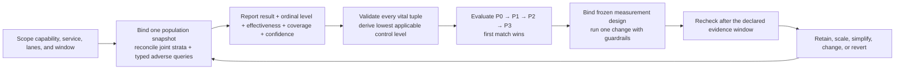

# Real-world software-development operating model research for Ranex

| Field | Value |
|---|---|
| Research ID | `RES-SDLC-001` |
| Date | 2026-07-27 |
| Status | Curated research and adopted evidence basis; not normative by itself |
| Owner | Human governor |
| Subject | The end-to-end process by which Ranex work moves from an idea to an operated and improved product |
| Ranex revision inspected | Working tree based on `fee61eb61d8f2df2f28adbe3a59cf8c2340ab5f4` |
| Upstream | [NousResearch/hermes-agent](https://github.com/nousresearch/hermes-agent) |
| Companion normative policy | [Ranex Core SDLC Operating Model](../architecture/CORE_SDLC_OPERATING_MODEL.md) |
| Owner decision | [ADR-0001: Established Software-Development Lifecycle Governs AI Work](../architecture/decisions/ADR-0001-established-sdlc-governs-ai-work.md) |
| Independent visual review | [HY3 SDLC visual review](./ranex-sdlc-visual-hy3-review-2026-07-27.md) |
| File mutations | This report, companion policy/catalog, assessment/projection templates, rendered visual artifacts, and documentation links |

## Executive recommendation

Ranex should adopt one product-to-production operating model as its core
development process:

```text
govern
  -> shape
  -> discover
  -> specify
  -> design
  -> plan
  -> build
  -> verify
  -> release
  -> operate
  -> learn
  -> govern again
```

This is a continuous value stream, not a waterfall. A small, reversible change
may move through several stages in hours; a security-, data-, architecture-, or
migration-sensitive change requires deeper artifacts and independent gates.
Every change uses the same state model and traceability chain. Risk controls the
depth of work, never whether essential work is visible.

The existing
[AI-Agent Development Lifecycle](../architecture/AI_AGENT_DEVELOPMENT_LIFECYCLE.md)
is strong from qualified intake through implementation, review, landing, and
operations evidence. It should remain the execution protocol inside the broader
SDLC, not serve as the whole product lifecycle. The missing outer loop is the
human-world product practice:

- deciding which problem is worth solving;
- learning from users before committing to a solution;
- expressing outcomes, requirements, constraints, and service expectations;
- making product, engineering, security, operations, and release readiness
  explicit;
- observing whether the shipped change produced the intended outcome; and
- feeding evidence back into priorities, architecture, and working methods.

Ranex should assess each lifecycle capability with an evidence-anchored `0`–`4`
level plus separate effectiveness, coverage, and confidence. Non-compensating
`P0`–`P3` priority then selects the next bounded improvement; no overall average
may hide a vital-control failure or become a release authority.

The core invariant is:

> Every production behavior must trace backward to an owned need and forward to
> verification and operational evidence.

## 1. Research question

How can Ranex apply a practical, real-world software-development process,
engineering playbook, and SDLC operating model from idea through requirements,
design, implementation, verification, release, operation, and improvement,
while remaining:

- a governed fork of Hermes Agent;
- suitable for human and AI-agent collaboration;
- proportionate for changes of different risk;
- secure and auditable without becoming ceremony-heavy;
- compatible with frequent, small, reversible delivery; and
- capable of improving itself from evidence without allowing models to grant
  themselves authority?

## 2. Method and limitations

### 2.1 Local evidence

The research reconciles these Ranex documents:

- `RANEX_IMPLEMENTATION_GUIDE.md`;
- `docs/architecture/HERMES_GROUND_ZERO_FULL_SYSTEM_ARCHITECTURE.md`;
- `docs/architecture/SOURCE_OF_TRUTH.md`;
- `docs/architecture/AI_AGENT_DEVELOPMENT_LIFECYCLE.md`;
- `docs/research/gemini-research.md`;
- `docs/research/hermes-core-architecture-research-2026-07-27.md`;
- `docs/research/hermes-core-architecture-hy3-review-2026-07-27.md`;
- `docs/research/cookbook-alignment-research-2026-07-27.md`; and
- `docs/research/ocask-alignment-research-2026-07-27.md`.

The scoring and improvement design also uses these consultation-only local
Markdown references. The links below are public-safe publisher or
bibliographic records; exact local identities and extraction limits are in the
[foundational-reference reconciliation](../architecture/reviews/2026-07-27-foundational-reference-corpus-reconciliation.md):

- [`Clean Code`](https://www.informit.com/store/clean-code-a-handbook-of-agile-software-craftsmanship-9780132350884),
  especially “Emergence,”
  “Environment,” and the testing heuristics in “Smells and Heuristics”;
- [`The Pragmatic Programmer`](https://www.informit.com/store/pragmatic-programmer-from-journeyman-to-master-9780201616224),
  especially continuous improvement, tracer bullets, reversibility,
  automation, testing, and escaped-defect learning;
- the local Markdown reference copy of
  [`SWEBOK Guide V4.0a`](https://www.computer.org/education/bodies-of-knowledge/software-engineering/v4),
  especially Engineering
  Foundations §7 on measurement scales, operational definitions, validity,
  reliability, and Goal–Question–Metric; and
- the targeted, local-only Kimi research chapters “Measure Before You
  Architect” (`agent_fleet_control_sec03.md`) and “The Build Roadmap and
  Experiment Playbook” (`agent_fleet_control_sec13.md`), dispositioned in the
  [Kimi reconciliation](../architecture/reviews/2026-07-27-kimi-agent-fleet-research-reconciliation.md),
  for measurement-harness hygiene, local uncertainty, pre-registration, and
  experiment reporting.

Only the Markdown files named above were opened and used for this extension.
No PDF in `docs/research/` was opened, parsed, indexed, or used.

That statement preserves the method of the original scoring extension. The
owner subsequently elevated the complete saved-book corpus to major-reference
status. All six PDF/Markdown pairs were then inventoried and audited for
derivation, provenance, rights, extraction loss, applicable practices, dated
advice, contradictions, and architecture impact. The resulting current
application is [Ranex Engineering Reference Application Map](../architecture/ENGINEERING_REFERENCE_APPLICATION_MAP.md),
bound by its own exact corpus manifest. This later audit does not
retroactively claim that the PDFs or the three later-arriving books were inputs
to the earlier prose.

The local architecture already establishes exact-subject evidence, human
authority, machine contracts, isolated implementation, independent review,
deterministic gates, release/rollback, operations, and upstream synchronization.
This report does not replace those controls. It supplies the product and
engineering value stream around them.

### 2.2 External evidence

Primary and official sources were preferred:

- [ISO/IEC/IEEE 12207:2026](https://www.iso.org/standard/90219.html)
  for the complete software-life-cycle process frame and process-improvement
  attachment points;
- [SWEBOK Guide V4.0a](https://www.computer.org/education/bodies-of-knowledge/software-engineering)
  for consensus-driven software-engineering knowledge areas spanning
  requirements, architecture, construction, testing, operations, maintenance,
  configuration, management, process, quality, security, and economics;
- [ISO/IEC 29110-5-1-2:2025](https://www.iso.org/standard/82669.html)
  for a small-team process spine consisting of project management and software
  implementation;
- [NASA Software Engineering Handbook, NASA-HDBK-2203](https://standards.nasa.gov/standard/NASA/NASA-HDBK-2203)
  for detailed engineering, assurance, configuration, traceability,
  verification/validation, delivery, and record practices;
- [NIST Secure Software Development Framework (SSDF)](https://csrc.nist.gov/projects/ssdf)
  for organization preparation, software protection, secure production, and
  vulnerability response;
- [NIST SP 800-218](https://doi.org/10.6028/NIST.SP.800-218) for secure
  development practices across an SDLC;
- [DORA software-delivery performance metrics](https://dora.dev/guides/dora-metrics/)
  for delivery throughput and instability measures;
- [DORA capability catalog](https://dora.dev/capabilities/) for small batches,
  WIP limits, CI/CD, test automation, security, observability, and visible
  value-stream work;
- [DORA guidance for generative AI in software delivery](https://dora.dev/guides/how-to-innovate-with-generative-ai/)
  for treating AI as a change to delivery capability whose effect is measured
  against the existing delivery system;
- [Google Engineering Practices](https://google.github.io/eng-practices/review/)
  for small changes and code-review responsibilities;
- [Google SRE Workbook: Canarying Releases](https://sre.google/workbook/canarying-releases/)
  for progressive exposure and release evaluation;
- [Google SRE Workbook: Error Budget Policy](https://sre.google/workbook/error-budget-policy/)
  for balancing reliability and change;
- [Google SRE Workbook: Postmortem Culture](https://sre.google/workbook/postmortem-culture/)
  for learning from incidents;
- [The Scrum Guide](https://scrumguides.org/scrum-guide.html) for empirical,
  iterative inspection and adaptation; and
- [Agile Manifesto principles](https://agilemanifesto.org/principles.html) for
  frequent delivery, feedback, technical excellence, and adapting to change;
  and
- [CMMI capability and maturity levels](https://cmmiinstitute.com/learning/appraisals/levels)
  for assessing whether processes are managed, defined, measured, and improved.

These sources support practices, not a branded framework Ranex must copy.

### 2.3 Source appraisal and adopted use

No source is universal scientific proof. The selected synthesis is:

> Ranex uses ISO/IEC/IEEE 12207:2026 as the lifecycle frame and SWEBOK as a
> broad, non-comprehensive engineering knowledge-area map; tailors ISO/IEC
> 29110's two-process Basic-profile structure as
> its small-team execution spine; enriches it with NASA assurance/record
> discipline and NIST SSDF security outcomes; calibrates delivery and
> reliability using DORA and Google evidence; and uses CMMI only to test whether
> the process is governed, enabled, measured, and improved. Practitioner books
> supply concrete engineering habits, while the Kimi corpus supplies
> hypotheses for Ranex’s measurement harness that still require local
> calibration.

| Source | Authority/evidence type | Adopted use | Limitation |
|---|---|---|---|
| ISO/IEC/IEEE 12207:2026 | Current international consensus standard | Full software-life-cycle process map and process-improvement frame | Process descriptions require tailoring; no conformity claim; the full paid standard was not available locally |
| SWEBOK V4.0a | IEEE consensus-driven body of knowledge | Broad knowledge-area coverage check across the software-engineering discipline | Non-comprehensive knowledge map, not a prescriptive project lifecycle or proof that every lifecycle obligation is covered |
| ISO/IEC 29110-5-1-2:2025 | International consensus standard | Project management plus software-implementation spine | Official scope is one product/one team in a very small entity and excludes safety-critical software; no conformity claim |
| NASA-HDBK-2203 | Active government technical handbook and high-assurance practitioner guidance | Assurance, traceability, V&V, configuration and delivery control library | Guidance, not a NASA-mandatory standard; down-tailored for ordinary Ranex work |
| NIST SP 800-218 | Federal recommendation synthesized from secure-development practices | Security preparation, protection, secure production and vulnerability-response overlay | Not a complete lifecycle or certification |
| DORA | Repeated large-scale observational research | Small batches, flow, CI/CD capabilities and delivery measures | Association, not controlled universal causation; context matters |
| Google Engineering Practices/SRE | Mature practitioner guidance and cases | Change/review, SLO, release, incident and learning practices | Organization-derived and must be adapted |
| CMMI | Capability/maturity model plus organizational case evidence | Process institutionalization and improvement audit lens | Not a daily SDLC; no appraisal, compliance or maturity-level claim |
| Scrum/Agile | Consensus and practitioner principles | Iteration, inspection, adaptation and feedback | Not a complete assurance/operations model |
| *Clean Code* | Practitioner book and code-level heuristics | Testability, small verified refactors, build/test operability, changeability, and coverage as a gap locator | Opinionated and partly dated; its heuristics are not a validated numerical scoring model |
| *The Pragmatic Programmer* | Practitioner book | Continuous feedback, production-shaped tracer slices, reversible decisions, automation, observability, and regression learning | Practitioner guidance whose techniques and thresholds require context |
| *Code Complete*, retained Chapter 5 excerpt | Practitioner construction/design handbook excerpt | Complexity management, information hiding, coupling/cohesion, contracts, testability, binding time, and iterative/proportionate design | Local PDF is not the full book; absent chapters are not evidence |
| *System Design Interview*, Second Edition | Interview-preparation pattern catalogue | Scope clarification, high-level decomposition, risk deep dive, estimates, failure and monitoring prompts | Simplified 2020 web-scale examples are not Ranex's reference architecture |
| *The Clean Coder* | Practitioner professional-conduct book | Responsibility, explicit commitments, early risk disclosure, acceptance evidence, layered testing, collaboration, estimation, mentoring, and stable teams | One author's 2011 position; fixed percentages, hours, staffing, TDD, and QA prescriptions are not universal gates |
| Kimi agent-fleet research corpus | Model-assisted secondary research with explicit confidence caveats | Measurement-first sequencing, frozen harness variables, local noise/uncertainty, pre-registered comparisons, and separate infrastructure-error accounting | Secondary synthesis with heterogeneous underlying evidence; quantitative claims require primary-source verification and local replication |

### 2.4 Limitations

- Ranex runtime implementation does not yet exist, so this is a target operating
  model rather than evidence of process performance.
- Team size, release cadence, user population, and service-level objectives are
  not yet empirically established.
- Current Hermes upstream behavior was already pinned and analyzed by the
  architecture research; this report does not repeat that source audit.
- Numeric thresholds in the companion policy are initial defaults. They require
  calibration from Ranex delivery and operational data.
- ISO/IEC 29110 is copyrighted and most detail is paywalled. Ranex uses its
  official scope and an independently authored structure; an authorized copy is
  required before claiming detailed clause coverage.
- ISO/IEC/IEEE 12207:2026 superseded the 2017 edition on 2026-04-29. SWEBOK
  V4.0a predates that publication and maps to the then-current 2017 edition, so
  its clause crosswalk is historical until explicitly verified and remapped
  against the 2026 standard.
- The local book and SWEBOK Markdown files remain third-party copyrighted
  reference material. Ranex cites and paraphrases them; it does not claim
  ownership, redistribution permission, or standards conformance from their
  presence in the workspace.
- The Kimi chapters are a secondary, model-assisted synthesis. Their experiment
  patterns inform the Ranex design, but their reported effect sizes and
  thresholds are not imported as Ranex facts without primary verification and
  local calibration.
- Evidence strength varies. Consensus standards, government/practitioner
  guidance, observational association, case evidence, and Ranex owner decisions
  are deliberately not described as interchangeable or “proven.”

## 3. Findings

### 3.1 A lifecycle is not a queue of specialist handoffs

Real software work is uncertain. Requirements, design, implementation, and
operation expose information that can invalidate earlier assumptions. A process
that permits only forward movement creates hidden rework; one that permits
unrecorded backtracking loses control.

Ranex therefore needs explicit feedback transitions:

```text
discovery <-> specification <-> design <-> implementation
                         verification -> any earlier state
release/operation -> incident, problem, experiment, or improvement intake
```

A backward transition creates a reason, owner, and changed artifact. It does not
erase history.

### 3.2 Product outcomes and engineering outputs need separate tests

A feature can be correctly built and still fail to help users. Ranex should
separate:

- **product validation:** is this a worthwhile problem and did the change
  improve the intended outcome?
- **engineering verification:** does the implementation satisfy its specified
  behavior and quality constraints?

Both must be represented in the work item before commitment. Product outcome
evidence may arrive after release; engineering evidence must be sufficient
before release.

### 3.3 One process needs proportional assurance lanes

A typo and a credential-boundary migration should not carry the same ceremony.
Allowing teams to invent a process per change, however, makes evidence
incomparable and invites bypasses.

Use one state machine with four risk lanes:

| Lane | Typical change | Required assurance |
|---|---|---|
| Standard | Documentation, isolated low-risk correction | Peer review, relevant deterministic checks, reversible landing |
| Enhanced | User-visible feature, dependency, persistent state | Full requirements/design, independent review, broader tests, release and rollback plan |
| Critical | Auth, secrets, policy, data loss, migration, authority, supply chain | Threat model, ADR, specialist and adversarial review, recovery proof, explicit human release authority |
| Emergency | Active incident or exploited vulnerability | Time-boxed exception, two-person authorization where possible, smallest mitigation, retrospective full evidence |

Risk is derived from facts and policy. A maker cannot choose a lower lane.

### 3.4 Small batches and continuous integration improve control

The safest unit is a thin, independently verifiable change tied to one outcome.
Long-lived branches, broad rewrites, and combined migrations/features expand the
uncertainty surface. Ranex should optimize for:

- short-lived isolated worktrees;
- one bounded change and one reviewable subject;
- trunk-compatible integration;
- always-releasable main;
- feature exposure separated from binary deployment when practical; and
- migrations that expand, migrate, verify, then contract.

### 3.5 “Done” has multiple boundaries

Teams commonly call work done when code is merged. That omits release,
operability, outcome measurement, cleanup, and learning. Ranex needs distinct
definitions:

| Boundary | Meaning |
|---|---|
| Ready | The item is safe and clear enough to enter committed delivery |
| Built | Code/config/docs and developer tests are complete |
| Verified | The exact candidate satisfies its acceptance and quality evidence |
| Released | The approved artifact is deployed/installed with rollback available |
| Operated | Health, support, recovery, and ownership are proven for the observation window |
| Outcome reviewed | Product and operational results were compared with the hypothesis |
| Closed | Evidence, follow-ups, documentation, and decisions are reconciled |

### 3.6 Security, reliability, and operations belong inside the stream

NIST SSDF groups preparation, protection, production, and vulnerability
response across the lifecycle. Google SRE practices make reliability targets,
safe rollout, incident response, and learning part of engineering rather than a
post-development department. Ranex should therefore reject a “build, then hand
to security/operations” model.

For every material change:

- security requirements and misuse cases are requirements;
- observability and support are design concerns;
- rollback and recovery are implementation concerns;
- deployment evaluation is verification;
- incidents and vulnerabilities return to normal governed intake; and
- postmortem actions compete visibly with feature work.

### 3.7 Metrics must describe the system, not rank people

DORA’s current delivery measures provide a useful system view:

- change lead time;
- deployment frequency;
- failed deployment recovery time;
- change fail rate; and
- deployment rework rate.

Ranex also needs flow, quality, reliability, security, and product measures.
None should be used to score individuals or reward output volume. That creates
gaming, larger hidden batches, weak tests, and suppressed incidents.

### 3.8 A fork needs a second change stream

Ranex has product work and upstream intake. Upstream commits are untrusted change
candidates, not automatic updates. Each must be pinned, classified, provenance
checked, mapped to Ranex bounded contexts, selectively ported, and passed
through the same verification and release controls. This is a specialization of
the core SDLC, not an informal maintenance chore.

### 3.9 AI agents change execution capacity, not accountability

Agents can research, refine requirements, propose designs, implement, test,
review, and summarize evidence. They do not own product outcomes, accept risk,
waive missing evidence, or authorize merge/release. The stable system is the
artifact/state/evidence chain. Model conversation is ephemeral working material.

### 3.10 The process needs institutional controls

The initial lifecycle synthesis was directionally complete but not executable
enough. ISO/IEC 29110 and NASA guidance expose missing cross-cutting controls:

- a project-management loop of plan, execute, assess/control and close;
- estimate ranges, forecasts, dependencies, risk reserves and reforecast
  authority;
- bidirectional requirements/design/code/test/finding traceability;
- configuration-item identification, baselines, status accounting and audits;
- verification separated from validation and user/product acceptance;
- supplier/dependency adoption, monitoring, shared responsibility and exit;
- competence, process assurance, nonconformance and corrective action; and
- controlled maintenance and retirement.

These are now specified in the
[SDLC Control Catalog](../architecture/SDLC_CONTROL_CATALOG.md).

### 3.11 Fork-specific reconciliation is mandatory

Fleet inspection found several contradictions that must be resolved before the
operating model is implemented:

1. `RANEX_IMPLEMENTATION_GUIDE.md` currently uses a second “canonical” work
   vocabulary and closes work at merge. `POL-SDLC-001` must become authoritative;
   `RESEARCHED`, `PLAN_APPROVED`, `REVIEWED`, `TESTED`,
   `CUSTOMER_VALIDATED`, and `APPROVED_FOR_MERGE` should become evidence/gate
   milestones. `MERGED` is a landing event, not `CLOSED`.
2. The guide's proposed authoritative office plugin and separate office
   database conflict with the accepted `src/ranex` core and single authority
   transaction boundary. A plugin may be a transitional
   projection/compatibility adapter, never the final authority owner.
3. Every inherited Hermes surface needs a disposition ledger:
   `RETAIN_AS_IS | WRAP | EXTRACT | REIMPLEMENT | REMOVE | QUARANTINE | DEFER`,
   bound to upstream commit/path/symbol/behavior, owner, compatibility test,
   legal/commercial class, expiry/removal trigger and replacement work.
4. Upstream sync needs one specialized lifecycle:
   `OBSERVED -> FETCHED -> PINNED -> CLASSIFIED -> DISPOSITIONED ->
   PORTING -> PORT_CANDIDATE -> VERIFIED -> RELEASED -> BASELINE_RECORDED`,
   with `REJECTED`, `DEFERRED`, `BLOCKED` and `ROLLED_BACK` branches.
5. Releases must promote immutable approved artifacts. The inherited Hermes
   source-pull/update/reset behavior is not a Ranex rollback model; source reset
   does not reverse data/schema or external effects.
6. Compatibility needs `SUPPORTED -> DEPRECATED -> READ_ONLY -> REMOVED` for
   the legacy CLI, home/config/session/tool names, plugins and providers.
7. Extensions/plugins, first-party modules, and provider/model routes require
   separate owner-specific state machines: `ExtensionStatus`, `ModuleStatus`,
   and `RouteStatus`. Qualification emits evidence but cannot change any of
   those states. MCP tools are cataloged modules or external extensions rather
   than a fourth generic lifecycle. Mutable Git installs/updates, optional
   manifests, last-writer-wins provider overrides, environment-presence
   auto-selection and import-time authority registration are forbidden in
   target mode.
8. Operational cutover needs
   `BOOTSTRAP -> LEGACY_BASELINE -> TRANSITIONAL_DUAL_RUN -> TARGET_SHADOW ->
   TARGET_LIMITED -> TARGET_DEFAULT -> LEGACY_FROZEN -> LEGACY_REMOVED`, with
   exactly one canonical writer in every mode.
9. Self-development must use an immutable controller release to govern the next
   candidate (`N` controls `N+1`) through release, operation and outcome review.
   A merged documentation tracer proves only the manual adoption gate.

Required fork artifacts are a phase-to-SDLC migration matrix, exact-subject
invalidation graph, inherited-behavior disposition ledger, and compatibility
matrix across upstream baseline, Ranex release, state schema, platform,
plugin protocol and provider catalog.

Primary upstream evidence includes the current
[Hermes CLI command reference](https://github.com/nousresearch/hermes-agent/blob/main/website/docs/reference/cli-commands.md),
[update procedure](https://github.com/NousResearch/hermes-agent/blob/main/website/docs/getting-started/updating.md),
[provider-plugin guide](https://github.com/NousResearch/hermes-agent/blob/main/website/docs/developer-guide/model-provider-plugin.md),
and [provider-layer guide](https://github.com/NousResearch/hermes-agent/blob/main/website/docs/developer-guide/adding-providers.md).

## 4. Selected operating model

### 4.1 The three nested loops

```text
Outcome loop (weeks/months)
  govern -> shape -> discover -> outcome review

Delivery loop (hours/weeks)
  specify -> design -> plan -> build -> verify -> release

Reliability loop (continuous)
  observe -> respond -> recover -> learn -> improve
```

The loops share one work-item identity and one traceability graph. Planning
cadences do not replace continuous intake; operational work does not wait for a
sprint boundary.

### 4.2 Canonical flow

| State | Primary question | Minimum output | Exit authority |
|---|---|---|---|
| Funnel | Is the signal recorded? | Idea/problem/incident/vulnerability record | Intake owner |
| Triage | Is it ours and how urgent/risky is it? | Classification, owner, severity, risk lane | Product/duty owner |
| Discovery | Is the problem real and worth solving? | Evidence, users, current behavior, hypothesis | Product owner |
| Definition | What must be true? | Outcome, requirements, constraints, acceptance examples, measures | Product + engineering + affected owner |
| Design | How can it be changed safely? | Design record, threat/ops/data impact, test and rollout strategy | Technical owner; ADR authority if material |
| Ready | Can we responsibly commit? | Sized vertical slices, dependencies, capacity and evidence plan | Delivery owner |
| In progress | Is one bounded subject being built? | Task packet, code/tests/docs, run evidence | Implementation protocol |
| Verification | Does the exact subject meet the contract? | Review and deterministic evidence | Qualified gates + human decision where required |
| Release ready | Can this artifact safely reach users? | Signed/pinned artifact, runbook, rollback, comms, approvals | Release authority |
| Releasing | Is progressive exposure healthy? | Deployment events and evaluation evidence | Release operator under permit |
| Operating | Is it healthy and supported? | Telemetry, SLO/support/security evidence | Service owner |
| Outcome review | Did it help, and what changed? | Results vs hypothesis; keep/change/remove decision | Product owner |
| Closed | Is the evidence and follow-up complete? | Reconciled record and owned follow-ups | Work owner |

The table is the thirteen-state normal path. `BLOCKED`, `CANCELLED`, and
`ROLLED_BACK` are also canonical `WorkItemStatus` values with explicit entry,
exit, authority, evidence, and re-entry rules.

Maintenance, incident, release/update, compatibility, extension, operational
mode, and retirement statuses belong to linked lifecycles with their own
namespaces. They create or link canonical work items through typed events; they
are not additional `WorkItemStatus` values.

### 4.3 Minimum traceability chain

```text
signal/problem
  -> desired outcome and measure
  -> requirement + acceptance example
  -> design decision + risk controls
  -> delivery slice + exact commit
  -> test/review/security evidence
  -> release artifact + deployment
  -> telemetry/support/outcome evidence
  -> learning or follow-up
```

Every link is queryable. A document may be concise, but no link may exist only
in a chat transcript.

### 4.4 Full-spec Mermaid diagram

This diagram is the complete operating-model view. The thick center is the
normal value stream. Dashed arrows are evidence, governance, or feedback
relationships. A failed gate returns the work to the earliest state whose
assumption is no longer valid; it never changes failure into pass.

```mermaid
flowchart TB
  %% ---------- Inputs ----------
  subgraph INPUTS["Signals entering Ranex"]
    direction LR
    USER["User or stakeholder need"]
    OPS_SIGNAL["Defect, incident, SLO, or support signal"]
    SEC_SIGNAL["Security, privacy, or compliance signal"]
    STRATEGY["Strategy, architecture, debt, or improvement"]
    HERMES["Pinned Hermes upstream change"]
  end

  %% ---------- Main lifecycle ----------
  subgraph VALUE["One canonical work-item lifecycle"]
    direction TB

    subgraph SHAPE["Shape the right work"]
      direction LR
      FUNNEL["FUNNEL<br/>Record the signal"]
      TRIAGE["TRIAGE<br/>Own, classify, prioritize"]
      DISCOVERY["DISCOVERY<br/>Prove the problem"]
      DEFINITION["DEFINITION<br/>Define outcome and requirements"]
      FUNNEL --> TRIAGE --> DISCOVERY --> DEFINITION
    end

    subgraph DELIVER["Design and deliver safely"]
      direction LR
      DESIGN["DESIGN<br/>Choose boundaries and controls"]
      READY["READY<br/>Commit a feasible vertical slice"]
      BUILD["IN_PROGRESS<br/>Build in an isolated worktree"]
      VERIFY["VERIFICATION<br/>Independent review, V&V, and gates"]
      RELEASE_READY["RELEASE_READY<br/>Immutable artifact and rollback"]
      RELEASING["RELEASING<br/>Stage, migrate, expose, observe"]
      DESIGN --> READY --> BUILD --> VERIFY --> RELEASE_READY --> RELEASING
    end

    subgraph RUN["Run, learn, and close the work item"]
      direction LR
      OPERATING["OPERATING<br/>Own health, support, and recovery"]
      OUTCOME["OUTCOME_REVIEW<br/>Compare result with hypothesis"]
      CLOSED["CLOSED<br/>Reconcile evidence and follow-ups"]
      RELEASING --> OPERATING --> OUTCOME -->|outcome decision recorded| CLOSED
    end
  end

  USER --> FUNNEL
  OPS_SIGNAL --> TRIAGE
  SEC_SIGNAL --> TRIAGE
  STRATEGY --> FUNNEL
  DEFINITION --> DESIGN

  %% ---------- Rejection, feedback, and recovery ----------
  subgraph RECOVERY["Feedback, failure, and recovery"]
    direction LR
    ACTIVE_RULE["ROUTING RULE — NOT A STATE<br/>Any active WorkItemStatus"]
    BLOCKED["BLOCKED<br/>Owner + reason + next decision"]
    RESUME_RULE["ROUTING RULE — NOT A STATE<br/>Resume an allowed prior state or terminal disposition"]
    PRE_RELEASE_RULE["ROUTING RULE — NOT A STATE<br/>Any pre-release WorkItemStatus"]
    CANCELLED["CANCELLED<br/>Reason and durable history"]
    ROLLED_BACK["ROLLED_BACK<br/>Restore and reconcile"]
    I_DETECTED["IncidentStatus: DETECTED"] --> I_ACK["ACKNOWLEDGED"]
    I_ACK --> I_MITIGATING["MITIGATING"] --> I_MITIGATED["MITIGATED"]
    I_MITIGATED --> I_RECOVERY["RECOVERY_VERIFIED"] --> I_REVIEWED["REVIEWED"]
    I_REVIEWED --> I_ACTIONS["ACTIONS_TRACKED"] --> I_CLOSED["CLOSED"]
    IMPROVEMENT["Typed event: IMPROVEMENT_WORK_REQUESTED<br/>Creates a linked WorkItem"]
    ACTIVE_RULE -->|dependency, conflict, or evidence gap| BLOCKED --> RESUME_RULE
    PRE_RELEASE_RULE -->|authorized cancellation| CANCELLED
    I_ACTIONS -.-> IMPROVEMENT
  end

  TRIAGE -->|not valuable or not ours| CANCELLED
  DISCOVERY -->|evidence insufficient| FUNNEL
  DEFINITION -->|problem or requirement unclear| DISCOVERY
  DESIGN -->|need must change| DEFINITION
  READY -->|plan infeasible| DESIGN
  BUILD -->|blocked| BLOCKED
  VERIFY -->|implementation fails| BUILD
  VERIFY -->|design fails| DESIGN
  VERIFY -->|requirement fails| DEFINITION
  RELEASE_READY -->|not releasable| VERIFY
  RELEASING -->|health threshold breached| ROLLED_BACK
  ROLLED_BACK -.->|if an incident is opened| I_DETECTED
  ROLLED_BACK -->|safe prior state verified; new attempt linked| TRIAGE
  OPERATING -.->|material impact| I_DETECTED
  RETIRING -.->|retirement impact| I_DETECTED
  I_RECOVERY -.->|service-health evidence| OPERATING
  IMPROVEMENT -.-> FUNNEL
  OUTCOME -->|hypothesis falsified| DISCOVERY
  OUTCOME -->|contract must change| DEFINITION

  %% ---------- Linked capability lifecycles ----------
  subgraph SERVICE_LIFECYCLES["Linked service lifecycles — separate status namespaces"]
    direction LR
    MAINT_TRIGGER["Typed event: MAINTENANCE_WORK_REQUESTED<br/>defect · dependency · vulnerability · debt"]
    MAINT_WORK["LINKED MAINTENANCE WORK<br/>normal WorkItemStatus lifecycle"]
    RETIRE_READY["CapabilityStatus: RETIRE_READY<br/>consumer, data, access, and rollback plan"]
    RETIRING["CapabilityStatus: RETIRING<br/>migrate, revoke, archive, tear down"]
    RETIRED["CapabilityStatus: RETIRED<br/>audit absence and residual ownership"]
    MAINT_TRIGGER --> MAINT_WORK
    RETIRE_READY --> RETIRING --> RETIRED
  end

  OPERATING -.-> MAINT_TRIGGER
  MAINT_WORK -.-> TRIAGE
  OUTCOME -.->|remove decision| RETIRE_READY
  RETIRING -.->|retirement failure| I_DETECTED
  RETIRED -.-> CLOSED

  %% ---------- Risk and decision authority ----------
  subgraph AUTHORITY["Assurance and decision authority"]
    direction LR
    RISK["Derived risk lane<br/>STANDARD · ENHANCED · CRITICAL · EMERGENCY"]
    MODELS["Humans and AI agents<br/>research, propose, make, review"]
    CHECKERS["Qualified deterministic gates<br/>check exact-subject evidence"]
    OWNERS["Named human owners<br/>accept value, architecture, and risk"]
    PERMIT["Single-use exact-subject permit<br/>authorizes landing/release/effect"]
    RISK --> CHECKERS
    MODELS --> CHECKERS
    CHECKERS --> OWNERS --> PERMIT
  end

  RISK -.-> TRIAGE
  RISK -.-> DESIGN
  RISK -.-> VERIFY
  CHECKERS -.-> VERIFY
  OWNERS -.-> DEFINITION
  OWNERS -.-> DESIGN
  PERMIT -.-> RELEASING

  %% ---------- Cross-lifecycle controls ----------
  subgraph CONTROLS["Controls that travel with every work item"]
    direction LR
    PM["PM<br/>Plan · execute · assess/control · close"]
    TRACE["Traceability<br/>Need ↔ requirement ↔ design ↔ code ↔ proof"]
    CM["Configuration<br/>Baselines · status · reproducibility · audits"]
    VV["V&V<br/>Verify specification · validate intended use"]
    SSDF["Security<br/>Prepare · protect · produce · respond"]
    SUPPLIER["Suppliers<br/>Adopt · monitor · accept · replace/exit"]
    DEBT["Debt and tailoring<br/>Owner · trigger · expiry · controls"]
    MEASURE["Measurement<br/>Outcome · flow · stability · quality"]
    SCORE["Capability profile<br/>Result/level · effectiveness · reconciled coverage · rule-derived confidence<br/>every vital tuple bound; lowest applicable level"]
    PRIORITY["Improvement selection<br/>P0 → P1 → P2 → P3; first match wins<br/>hypothesis · guardrail · qualified harness/noise rule"]
    ASSURE["Process assurance<br/>Competence · audit · improve"]
  end

  PM -.-> READY
  TRACE -.-> DEFINITION
  TRACE -.-> VERIFY
  CM -.-> RELEASE_READY
  VV -.-> VERIFY
  SSDF -.-> DESIGN
  SSDF -.-> OPERATING
  SUPPLIER -.-> DESIGN
  SUPPLIER -.-> MAINT_WORK
  DEBT -.-> TRIAGE
  MEASURE -.-> OUTCOME
  MEASURE --> SCORE --> PRIORITY --> ASSURE
  PRIORITY -.-> FUNNEL
  ASSURE -.-> CLOSED

  %% ---------- Durable evidence chain ----------
  subgraph EVIDENCE["One durable traceability and evidence chain"]
    direction LR
    E_SIGNAL["Signal / problem"]
    E_OUTCOME["Outcome + measure"]
    E_REQ["Requirement + example"]
    E_DESIGN["Decision + risk controls"]
    E_SUBJECT["Task packet + exact commit"]
    E_PROOF["Review + test + security evidence"]
    E_RELEASE["Artifact + manifest + deployment"]
    E_OPERATION["Health + support + outcome"]
    E_LEARNING["Learning + follow-up"]
    E_SIGNAL --> E_OUTCOME --> E_REQ --> E_DESIGN --> E_SUBJECT
    E_SUBJECT --> E_PROOF --> E_RELEASE --> E_OPERATION --> E_LEARNING
  end

  FUNNEL -.-> E_SIGNAL
  DEFINITION -.-> E_REQ
  DESIGN -.-> E_DESIGN
  BUILD -.-> E_SUBJECT
  VERIFY -.-> E_PROOF
  RELEASING -.-> E_RELEASE
  OUTCOME -.-> E_OPERATION
  CLOSED -.-> E_LEARNING

  %% ---------- Hermes fork specialization ----------
  subgraph FORK["Hermes-to-Ranex fork lane"]
    direction TB
    subgraph UPSYNC["Upstream synchronization"]
      direction LR
      U_OBS["OBSERVED"] --> U_FETCH["FETCHED"] --> U_PIN["PINNED"]
      U_PIN --> U_CLASS["CLASSIFIED"] --> U_DISP["DISPOSITIONED"]
      U_DISP -->|port planned| U_PORT["PORTING"] --> U_CAND["PORT CANDIDATE"]
      U_CAND --> U_VERIFY["VERIFIED"] --> U_RELEASE["RELEASED"]
      U_RELEASE --> U_BASE["BASELINE RECORDED"]
      U_DISP -->|reject| U_REJECT["REJECTED"]
      U_DISP -->|not scheduled| U_DEFER["DEFERRED"]
    end

    subgraph LEGACY["Inherited behavior and compatibility"]
      direction LR
      DISPOSITION["Behavior disposition<br/>retain · wrap · extract · reimplement<br/>remove · quarantine · defer"]
      SUPPORTED["SUPPORTED"] --> DEPRECATED["DEPRECATED"]
      DEPRECATED --> READ_ONLY["READ ONLY"] --> REMOVED["REMOVED"]
      DISPOSITION -.-> SUPPORTED
    end

    subgraph EXTENSIONS["Extensions, modules, and routes — separate owners and status namespaces"]
      direction TB
      subgraph EXTENSION_STATES["ExtensionStatus"]
        direction LR
        X_DISC["DISCOVERED"] --> X_QUAR["QUARANTINED"] --> X_REVIEW["REVIEWED"]
        X_REVIEW --> X_QUAL["QUALIFIED"] --> X_PIN["PINNED"] --> X_ENABLE["ENABLED"]
        X_ENABLE --> X_SUSPEND["SUSPENDED / RETIRED"]
      end
      subgraph MODULE_STATES["ModuleStatus"]
        direction LR
        M_PACK["PACKAGED"] --> M_DISABLED["DISABLED"] --> M_QUAL["QUALIFIED"]
        M_QUAL --> M_CANARY["CANARY"] --> M_ACTIVE["ACTIVE"]
        M_ACTIVE --> M_RESTRICT["RESTRICTED / QUARANTINED / RETIRED"]
      end
      subgraph ROUTE_STATES["RouteStatus"]
        direction LR
        R_UNCONFIG["UNCONFIGURED"] --> R_AUTH["AUTHENTICATED"] --> R_SMOKE["SMOKE_TESTED"]
        R_SMOKE --> R_PROBATION["PROBATION"] --> R_APPROVED["APPROVED"]
        R_APPROVED --> R_RESTRICT["RESTRICTED / SUSPENDED / RETIRED"]
      end
    end

    subgraph CUTOVER["One-writer operational cutover"]
      direction LR
      C_BOOT["BOOTSTRAP"] --> C_BASE["LEGACY BASELINE"] --> C_DUAL["TRANSITIONAL DUAL RUN"]
      C_DUAL --> C_SHADOW["TARGET SHADOW"] --> C_LIMITED["TARGET LIMITED"]
      C_LIMITED --> C_DEFAULT["TARGET DEFAULT"] --> C_FROZEN["LEGACY FROZEN"]
      C_FROZEN --> C_REMOVED["LEGACY REMOVED"]
    end

    subgraph UPDATE["Release/update lifecycle — source reset is not rollback"]
      direction LR
      UP_CHECK["CHECKED"] --> UP_DOWNLOAD["DOWNLOADED"] --> UP_VERIFIED["VERIFIED"]
      UP_VERIFIED --> UP_SNAPSHOT["SNAPSHOTTED"] --> UP_STAGE["STAGED"]
      UP_STAGE --> UP_MIGRATE["MIGRATED"] --> UP_ACTIVATE["ACTIVATED"]
      UP_ACTIVATE --> UP_HEALTH["HEALTH_VERIFIED"] --> UP_COMPLETE["COMPLETED"]
      UP_STAGE -->|post-snapshot failure| UP_ROLLBACK["ROLLED_BACK"]
      UP_MIGRATE -->|failure| UP_ROLLBACK
      UP_ACTIVATE -->|failure| UP_ROLLBACK
      UP_HEALTH -->|failure| UP_ROLLBACK
      UP_ROLLBACK --> UP_RECOVERY["RECOVERY_VERIFIED"]
    end
  end

  HERMES --> U_OBS
  U_DISP -.-> DISPOSITION
  U_CAND -.-> DESIGN
  U_RELEASE -.-> RELEASE_READY
  X_ENABLE -.-> SUPPLIER
  M_ACTIVE -.-> SUPPLIER
  R_APPROVED -.-> SUPPLIER
  C_DEFAULT -.-> OPERATING

  %% ---------- Safe self-development ----------
  subgraph SELFDEV["Safe Ranex self-development"]
    direction LR
    RELEASE_N["Immutable controller<br/>Ranex release N"]
    GOVERN_N1["governs work on"]
    CANDIDATE_N1["Candidate<br/>Ranex release N+1"]
    HUMAN_RELEASE["Independent human release permit"]
    OBSERVE_N1["Rollback drill + post-release observation"]
    RELEASE_N --> GOVERN_N1 --> CANDIDATE_N1 --> HUMAN_RELEASE --> OBSERVE_N1
  end

  OPERATING -.-> RELEASE_N
  CANDIDATE_N1 -.-> BUILD
  HUMAN_RELEASE -.-> RELEASING
  OBSERVE_N1 -.-> OUTCOME

  %% ---------- Text-and-line-style legend ----------
  subgraph LEGEND["Legend — labels and line styles carry meaning; color is secondary"]
    direction LR
    LEG_STATE["WorkItemStatus<br/>solid border"]
    LEG_GATE["Gate / permit<br/>gold solid border"]
    LEG_RISK["Failure / risk<br/>red solid border"]
    LEG_LINKED["Linked lifecycle<br/>dashed purple border"]
    LEG_EVIDENCE["Evidence<br/>green solid border"]
    LEG_TERMINAL["Terminal / disposition<br/>gray solid border"]
    LEG_SOLID["solid arrow = lifecycle transition"]
    LEG_DASH["dashed arrow = evidence, guard, or typed-event link"]
  end

  classDef state fill:#e8f1ff,stroke:#2457a7,color:#10254a,stroke-width:1.5px;
  classDef gate fill:#fff4cf,stroke:#9b6b00,color:#4d3500,stroke-width:1.5px;
  classDef risk fill:#ffe8e8,stroke:#a83232,color:#4f1717,stroke-width:1.5px;
  classDef evidence fill:#e8f8ef,stroke:#247247,color:#123d27,stroke-width:1.5px;
  classDef fork fill:#f3eaff,stroke:#6941a5,color:#321d56,stroke-width:1.5px;
  classDef linked fill:#faf6ff,stroke:#6941a5,color:#321d56,stroke-width:2px,stroke-dasharray:6 4;
  classDef terminal fill:#eef0f3,stroke:#4f5965,color:#222831,stroke-width:1.5px;

  class FUNNEL,TRIAGE,DISCOVERY,DEFINITION,DESIGN,READY,BUILD,OPERATING,OUTCOME state;
  class VERIFY,RELEASE_READY,RELEASING,CHECKERS,OWNERS,PERMIT gate;
  class RISK,BLOCKED,ROLLED_BACK risk;
  class I_DETECTED,I_ACK,I_MITIGATING,I_MITIGATED,I_RECOVERY,I_REVIEWED,I_ACTIONS,I_CLOSED,IMPROVEMENT,MAINT_TRIGGER,MAINT_WORK,RETIRE_READY,RETIRING,RETIRED linked;
  class E_SIGNAL,E_OUTCOME,E_REQ,E_DESIGN,E_SUBJECT,E_PROOF,E_RELEASE,E_OPERATION,E_LEARNING evidence;
  class U_OBS,U_FETCH,U_PIN,U_CLASS,U_DISP,U_PORT,U_CAND,U_VERIFY,U_RELEASE,U_BASE,DISPOSITION,SUPPORTED,DEPRECATED,READ_ONLY,X_DISC,X_QUAR,X_REVIEW,X_QUAL,X_PIN,X_ENABLE,M_PACK,M_DISABLED,M_QUAL,M_CANARY,M_ACTIVE,R_UNCONFIG,R_AUTH,R_SMOKE,R_PROBATION,R_APPROVED,C_BOOT,C_BASE,C_DUAL,C_SHADOW,C_LIMITED,C_DEFAULT,C_FROZEN,UP_CHECK,UP_DOWNLOAD,UP_VERIFIED,UP_SNAPSHOT,UP_STAGE,UP_MIGRATE,UP_ACTIVATE,UP_HEALTH,UP_COMPLETE,UP_ROLLBACK,UP_RECOVERY fork;
  class CLOSED,CANCELLED,U_REJECT,U_DEFER,REMOVED,X_SUSPEND,M_RESTRICT,R_RESTRICT,C_REMOVED terminal;
```



### 4.5 Full-spec ASCII diagram

The same model in a terminal-safe form:

```text
 SIGNALS
 user need        incident/SLO        security/privacy       strategy/debt
     \                 |                    |                     /
      +----------------+--------------------+--------------------+
                               |
                               v
 +---------+   +--------+   +-----------+   +------------+
 | FUNNEL  |-->| TRIAGE |-->| DISCOVERY |-->| DEFINITION |
 | record  |   | own +  |   | prove the |   | outcome +  |
 | signal  |   | classify|  | problem   |   | requirement|
 +---------+   +--------+   +-----------+   +------------+
     ^                            | bad evidence     | unclear need
     +----------------------------+<-----------------+
                                                     |
                                                     v
 +--------+   +-------+   +-------------+   +--------------+   +---------------+
 | DESIGN |-->| READY |-->| IN_PROGRESS |-->| VERIFICATION |-->| RELEASE_READY |
 | safe   |   | commit|   | build one   |   | review + V&V |   | immutable     |
 | choice |   | slice |   | exact change|   | + exact gates|   | artifact      |
 +--------+   +-------+   +-------------+   +--------------+   +---------------+
     ^            |              ^            |    |    |             |
     | infeasible-+              +--code fail-+    |    |             |
     +-----------------------------design fail-----+    |             |
     +-----------------------requirement fail-----------+             |
     |                                                                v
     |                                                        +---------------+
     |                                                        | RELEASING     |
     |                                                        | stage/migrate |
     |                                                        | expose/observe|
     |                                                        +---------------+
     |                                                           |         |
     |                                                     healthy|         |threshold fail
     |                                                           v         v
     |                                                     +-----------+  +-------------+
     +------------------------------------------------------ | OPERATING |  | ROLLED_BACK |
                                                            | own health|  | restore +   |
                                                            +-----------+  | reconcile   |
                                                                           +-------------+
                                                                  |
                                                                  v
                                                           +----------------+
                                                           | OUTCOME_REVIEW |
                                                           | did it help?   |
                                                           +----------------+
                                                              |        |
                                                      goal met|        |false
                                                              v        v
                                                         +--------+  DISCOVERY
                                                         | CLOSED |
                                                         +--------+

   ROLLED_BACK --safe prior state verified; linked new attempt--> TRIAGE
   ROLLED_BACK --if user impact--> IncidentStatus DETECTED

 INCIDENT LOOP (`IncidentStatus`, not `WorkItemStatus`)
   OPERATING / ROLLED_BACK / FAILED RETIREMENT
          -> DETECTED -> ACKNOWLEDGED -> MITIGATING -> MITIGATED
          -> RECOVERY_VERIFIED -> REVIEWED -> ACTIONS_TRACKED -> CLOSED
          -> IMPROVEMENT_WORK_REQUESTED -> new linked work item at FUNNEL

 CANONICAL RE-ENTRY
   ROLLED_BACK --safe prior state verified; linked new attempt--> TRIAGE
   OUTCOME_REVIEW --learn more--> DISCOVERY
   OUTCOME_REVIEW --change the contract--> DEFINITION
   any active WorkItemStatus --recorded blocker--> BLOCKED
   any pre-release WorkItemStatus --authorized reason--> CANCELLED

 LINKED SERVICE LIFECYCLES (separate status namespaces)
   maintenance trigger (defect/dependency/vulnerability/debt)
      -> linked maintenance work item -> TRIAGE -> normal lifecycle

   OUTCOME_REVIEW --remove decision--> RETIRE_READY -> RETIRING -> RETIRED
                                         |                |
                                         +--failure------> RECOVERY VERIFIED
   RETIRED --verified residual owner and evidence--> CLOSED

 ASSURANCE DEPTH                    DECISION SEPARATION
   STANDARD                         humans + agents: propose and make
   ENHANCED        --drives-->      qualified gates: verify exact evidence
   CRITICAL                         named humans: accept value/architecture/risk
   EMERGENCY                        permit: authorizes one exact effect

 CONTROLS TRAVEL WITH THE WORK
   [PM: plan/execute/control/close] [need <-> requirement <-> design <-> code <-> proof]
   [configuration baselines/audits] [verification + validation] [NIST SSDF security]
   [supplier/dependency governance] [debt + tailoring] [metrics]
   [capability profile: result/level + effectiveness + reconciled coverage + confidence]
   [every vital tuple bound; SCORED only when all applicable score; lowest level wins]
   [P0 -> P1 -> P2 -> P3 first-match priority] [qualified harness/noise rule] [assurance]

 DURABLE EVIDENCE CHAIN
   signal -> outcome -> requirement -> design/risk -> task/exact commit
          -> review/test/security proof -> artifact/deployment
          -> health/support/outcome -> learning/follow-up

 HERMES FORK LANE
   upstream:
     OBSERVED -> FETCHED -> PINNED -> CLASSIFIED -> DISPOSITIONED
       -> REJECTED | DEFERRED | PORTING -> PORT CANDIDATE
       -> VERIFIED -> RELEASED -> BASELINE RECORDED

   inherited behavior:
     RETAIN | WRAP | EXTRACT | REIMPLEMENT | REMOVE | QUARANTINE | DEFER
     SUPPORTED -> DEPRECATED -> READ ONLY -> REMOVED

   external extensions/plugins (`ExtensionStatus`):
     DISCOVERED -> QUARANTINED -> REVIEWED -> QUALIFIED
       -> PINNED -> ENABLED -> SUSPENDED / RETIRED

   first-party modules (`ModuleStatus`):
     PACKAGED -> DISABLED -> QUALIFIED -> CANARY -> ACTIVE
       -> RESTRICTED / QUARANTINED / RETIRED

   provider/model routes (`RouteStatus`):
     UNCONFIGURED -> AUTHENTICATED -> SMOKE_TESTED -> PROBATION -> APPROVED
       -> RESTRICTED / SUSPENDED / RETIRED

   MCP tools use the applicable module or extension lifecycle.

   one-writer cutover:
     BOOTSTRAP -> LEGACY BASELINE -> TRANSITIONAL DUAL RUN -> TARGET SHADOW
       -> TARGET LIMITED -> TARGET DEFAULT -> LEGACY FROZEN -> LEGACY REMOVED

   immutable release/update:
     CHECKED -> DOWNLOADED -> VERIFIED -> SNAPSHOTTED -> STAGED -> MIGRATED
       -> ACTIVATED -> HEALTH_VERIFIED -> COMPLETED
     any post-snapshot failure -> ROLLED_BACK -> RECOVERY_VERIFIED
     source reset is not product rollback

 SAFE SELF-DEVELOPMENT
   immutable Ranex release N
      --governs--> candidate N+1
      --independent human permit--> release
      --rollback drill + observation--> outcome review
```

### 4.6 How to read both diagrams

- Follow the center line for normal delivery.
- Follow arrows pointing backward when evidence changes an earlier assumption.
- Treat the red/recovery path as normal controlled behavior, not process
  failure to hide.
- The control and evidence rails apply to every state even where a line is not
  drawn to avoid an unreadable graph.
- Canonical enum names use underscores. Short natural-language text beneath
  them is explanatory, not a second state vocabulary.
- Linked incident, maintenance, retirement, update, compatibility, extension,
  and cutover nodes use separate namespaces and communicate through typed
  events or linked work. They are not extra `WorkItemStatus` values.
- The policy is `ACCEPTED`; implementation maturity remains `R_AND_D` until
  adoption gates `SDLC-ADOPT-A` through `SDLC-ADOPT-E` pass. The diagram is a
  target specification, not proof that Ranex implements it today.
- `MERGED` is intentionally absent as a lifecycle state. It is one authorized
  landing event between verification and release readiness.
- “Dual run” in the fork lane never permits dual authority: exactly one
  canonical writer exists in every operating mode.
- The HTML companion presents the same model with shorter wording:
  [Ranex SDLC Visual Guide](./ranex-sdlc-visual-guide.html).

## 5. Roles and accountabilities

One person may hold several roles in a small project, but conflicting authority
must remain separated for enhanced and critical changes.

| Role | Accountable for |
|---|---|
| Human governor | Product direction, policy, architecture/risk acceptance, critical permits |
| Product owner | Problem selection, user outcome, ordering, outcome review |
| Technical owner | System design, engineering quality, maintainability, technical risk |
| Service owner | Operability, SLOs, incidents, recovery, support readiness |
| Security/data owner | Security/privacy requirements, threat and data decisions |
| Delivery owner | Flow, dependency/risk visibility, readiness and closure hygiene |
| Maker | Bounded implementation and truthful evidence |
| Independent reviewer | Fresh evaluation of the exact subject |
| Release operator | Authorized rollout, observation, halt, rollback |
| Incident commander | Incident coordination and recovery priorities |

`Product owner` decides value; `technical owner` decides engineering fitness;
`service owner` decides operational fitness; deterministic controls decide
machine-verifiable conformance; the human governor owns exceptions and critical
risk. No single model fills all five.

## 6. Required artifacts by change class

Artifacts should be fields in a connected work record, not necessarily separate
long documents.

| Artifact | Standard | Enhanced | Critical |
|---|:---:|:---:|:---:|
| Problem/outcome statement | ✓ | ✓ | ✓ |
| Acceptance examples | ✓ | ✓ | ✓ |
| Risk classification | ✓ | ✓ | ✓ |
| Research/discovery evidence | as needed | ✓ | ✓ |
| Architecture/design record | note | ✓ | ✓ + ADR |
| Threat/data review | if affected | if affected | ✓ |
| Test strategy | focused | ✓ | ✓ + adversarial/recovery |
| Observability/SLO impact | if affected | ✓ | ✓ |
| Migration and rollback | if affected | ✓ | ✓ + rehearsal |
| Independent review | peer | ✓ | multiple/specialist |
| Release plan | simple | ✓ | ✓ + progressive gates |
| Outcome review | sampled | ✓ | ✓ |

## 7. Cadence

Cadence supplies regular decisions without forcing work into artificial batches.

| Cadence | Purpose |
|---|---|
| Continuous | Intake, incident/security response, CI, review, release evidence |
| Daily or per active session | Flow check: blockers, aging work, WIP, operational health |
| Weekly | Replenishment/commitment, dependency and risk review, upstream intake |
| Per release | Readiness, deployment evaluation, rollback decision |
| Fortnightly or monthly | Product outcome review, architecture debt, security/reliability posture |
| Quarterly | Strategy, roadmap, SLO/error budget, capacity allocation, process health |
| Per incident | Response, recovery, learning review and action tracking |

The process needs decisions, not mandatory meetings. An asynchronous,
schema-valid record may satisfy a cadence.

## 8. Metrics, capability scoring, and improvement selection

Use a balanced dashboard:

| Dimension | Measures |
|---|---|
| Outcome | Adoption, task success, user-reported value, hypothesis result |
| Flow | End-to-end idea lead time, committed lead time, cycle time, WIP, work age, blocked time |
| Delivery | Deployment frequency, change lead time |
| Stability | Change fail rate, deployment rework rate, failed deployment recovery time |
| Quality | Escaped defects, reopen rate, flaky checks, rollback rate |
| Reliability | SLI/SLO attainment, error-budget consumption, incident recurrence |
| Security | Vulnerability age by severity, remediation time, provenance failures, exception age |
| Process | Gate wait time, evidence completeness, review latency, exception rate |
| Fork health | Upstream lag, candidate aging, rejected/reworked ports, sync regression rate |

Guardrails:

- measure teams/value streams and services, not individual productivity;
- pair speed with quality/stability and outcome;
- publish definitions and derive measures from event timestamps;
- never use story points as productivity;
- investigate trends and distributions rather than rewarding a target number;
- include unsuccessful work and rollbacks; and
- review whether a metric is changing behavior in harmful ways.

Every decision-bearing measure needs a versioned operational definition:
`goal → question → measure → threshold/tolerance → decision → owner`. Record
the construct, formula, entity and unit, source event, window, population,
exclusions, refresh cadence, uncertainty/data quality, paired guardrail, and
the action the result can trigger. If no decision changes, remove the metric.
This follows SWEBOK’s warning that vague measurement operations produce
ambiguous results and that measures should serve decisions. The exact local
audit locators are `swebok-v4.md:14095` and `swebok-v4.md:14263`; the source
identity and limitations are retained in the
[foundational-reference reconciliation](../architecture/reviews/2026-07-27-foundational-reference-corpus-reconciliation.md).

### 8.1 Keep gates, capability, and health separate

Ranex needs scoring for diagnosis and improvement selection, but not a single
number that pretends every control can compensate for every other control. A
high flow score cannot offset wrong-subject evidence, maker self-approval, an
expired exception, or a missing release permit.

Three decision records therefore remain separate:

| Record | Values | Decision served | It must never do |
|---|---|---|---|
| Work-item gate | `PASS`, `FAIL`, `UNKNOWN`, `CONFLICT`, `NOT_APPLICABLE`, `CHECKER_FAULT`; an exception is a separate human decision | Whether this exact subject may make this exact transition | Borrow confidence from historical process scores |
| Capability assessment | `result`: `NOT_ASSESSED`, `UNKNOWN`, `NOT_APPLICABLE`, or `SCORED`; only `SCORED` has level `0`–`4` | Where the value stream needs stronger institutional capability | Authorize work, average away a mandatory failure, or rank people |
| Health indicator | Its real unit, distribution, control limit, trend, and uncertainty | Whether flow, quality, stability, security, or outcome is healthy | Turn good luck into proof that a control exists |

The assessment unit is one named capability or normative `SDLC-*` control for
one value stream or service, policy/rubric version, review window, work class,
and set of risk lanes. Pooling incomparable services or lanes can reverse the
meaning of a result.
The rules below define Ranex rubric `SDLC-MEA-002`, version `3.0.0`.

Each assessed capability reports four fields side by side:

| Field | Allowed result | Meaning |
|---|---|---|
| Capability rating | `result`: `NOT_ASSESSED`, `UNKNOWN`, `NOT_APPLICABLE`, or `SCORED`; if `SCORED`, ordinal level `0`–`4` | Whether a level can be awarded and how consistently the capability is defined, operated, controlled, and improved |
| Effectiveness | `UNKNOWN`, `REGRESSING`, `MIXED`, or `MEETS_TARGET` | Whether locally defined outcomes and guardrails are moving as intended |
| Coverage | Included/eligible count and percentage from one immutable population snapshot, jointly stratified by work class and risk lane | How much of the applicable population the evidence actually represents |
| Confidence | `LOW`, `MEDIUM`, or `HIGH`, with rationale | Currency, authenticity, sample adequacy, representativeness, and data quality |

These fields are not averaged. When result is not `SCORED`, level is absent.
`NOT_ASSESSED` means no review has occurred; `UNKNOWN` means a review found
insufficient, ambiguous, or conflicting evidence. Neither is zero, neither is a
pass, and both require an instrumentation or sampling decision.
`NOT_APPLICABLE` requires a rule from the versioned applicability registry, an
immutable eligible-population query, reason, and accountable approval. It is
invalid when eligible work or a qualifying trigger exists; profiles publish
N/A counts/rates and independent assurance samples them.

Totals are not free-entry dashboard fields. In every joint work-class/risk-lane
stratum and overall, `eligible = included + excluded`; the strata must sum to
the total, and itemized exclusions must sum to the excluded count. Zero-count
strata remain visible. This makes population deletion detectable.

Confidence is not a self-selected adjective. `HIGH` requires every
predeclared adequacy check—sample, duration, representativeness, authenticity,
freshness, missingness, and data quality—to pass plus independent assurance
sign-off. Without an approved adequacy rule, confidence is at most `MEDIUM`; a
material evidence/population gap forces `LOW`. An unresolved material gap also
forces capability result `UNKNOWN` with no level; it cannot coexist with
`SCORED`.

### 8.2 Evidence-anchored capability levels

A numeric level exists only for a `SCORED` result and is awarded only when its
evidence anchor and every lower anchor are satisfied. Documentation alone
cannot establish operation or effectiveness.
The labels remain primary; the number exists to support sorting and trend
review, not a maturity claim or external appraisal. The level is an **ordinal
label**: Ranex may compare, sort, or count labels, but must not add, average,
weight, multiply, or report arithmetic distance between them. SWEBOK explicitly
identifies capability/maturity levels as ordinal and warns that numeric labels
do not support arithmetic. The exact local audit locator is
`swebok-v4.md:14133`; provenance and limitations are in the
[foundational-reference reconciliation](../architecture/reviews/2026-07-27-foundational-reference-corpus-reconciliation.md).

| Level | Label | Evidence anchor | Appropriate next move |
|---:|---|---|---|
| `0` | `ABSENT` | Assessment proves that the required owner, contract, behavior, or trustworthy evidence is absent or unsafe | Contain active risk; name an owner; define the minimum contract, event, and rejection route |
| `1` | `DEFINED` | Versioned purpose, owner, scope, entry/exit, evidence, authority, failure route, tailoring, exception, and metric definitions exist | Run a representative normal tracer and a rejection, invalidation, or backward-transition tracer |
| `2` | `OPERATED` | Representative real work follows the control; durable exact-subject evidence includes successes and at least one rejection, invalidation, exception, or backward path actually traversed; deviations are visible | Enforce deterministic rules, evidence freshness, invalidation, role separation, expiry, and assurance sampling |
| `3` | `CONTROLLED` | The control operates across declared lanes/windows; a qualified measurement system exposes coverage, distributions, misses, false passes, exceptions, and triggered responses | Attack the dominant constraint with one bounded experiment instead of adding general ceremony |
| `4` | `IMPROVING` | A prospectively frozen experiment shows sustained benefit above declared measurement uncertainty/local noise over more than one review window without degrading paired guardrails; infrastructure faults are separated from subject failures and independent review confirms the result | Standardize or scale the change, simplify redundant control, and continue drift monitoring |

A correctly rejected candidate is evidence that a control operated; it is not a
process failure. Conversely, a favorable outcome does not prove a missing
control. Non-tailorable invariant breaches remain red findings outside the
score and trigger immediate containment.

Assessors seek three evidence classes: **enacted practice**, **durable
artifact/provenance**, and **outcome/guardrail trend**. Policy-only evidence
cannot exceed level `1`; a favorable outcome without enacted control cannot
raise a level. Failed required tests and disabled safeguards remain gate
findings, never negative points that better style can offset. Coverage locates
untested modules, branches, boundaries, and failure paths; it is not a standalone
quality or release verdict. These translations use *Clean Code*’s testability,
incremental-refactoring, and coverage heuristics
(`clean-code.md:4524` and `clean-code.md:7413` in the exact local subject) while
retaining that book’s own caveat that a heuristic list is incomplete
(`clean-code.md:7457`). The public-safe evidence record is the
[foundational-reference reconciliation](../architecture/reviews/2026-07-27-foundational-reference-corpus-reconciliation.md).

### 8.3 What Ranex assesses

The first assessment profile uses ten capability areas. Normative profile
`VITAL-SDLC-001` is a versioned set of exact
`(domain, control, applicability rule)` tuples—there is no assessor-selected
`AND`/`OR` interpretation. A domain projection must bind one immutable
per-control assessment ID, revision, and digest for every tuple at the same
scope and review window. A missing, extra, duplicate, remapped, stale, or
cross-scope row invalidates the projection.

An applicable member is a registered tuple whose applicability resolved to
`APPLICABLE`; a valid N/A tuple remains visible but does not enter the floor.
For a valid projection, unresolved applicability is `UNKNOWN`; all registered
controls validly N/A is `NOT_APPLICABLE`; all applicable ratings
`NOT_ASSESSED` is `NOT_ASSESSED`; and, once any applicable-member assessment
begins, one applicable `UNKNOWN`/`NOT_ASSESSED` member makes the domain
`UNKNOWN`. A domain
is `SCORED` if and only if every applicable member is scored; its level is the
lowest supported member level—never an average. The human governor owns and
versions the registry, so an assessment author cannot omit a weak control.
Ranex publishes the complete projection,
weakest capabilities, effectiveness, coverage, and confidence—not an overall
average. The exact tuples and derivation rules are in
[`SDLC-MEA-002`](../architecture/SDLC_CONTROL_CATALOG.md).

| Capability area | States/lifecycles | Gauge with paired signals | First practical improvement |
|---|---|---|---|
| Intake and triage | `FUNNEL`, `TRIAGE` | Intake/ownership age and source/owner/lane coverage ↔ orphan work, late escalation, priority reversal | One intake contract, duty owner, service map, decision rules, and reason codes |
| Discovery and definition | `DISCOVERY`, `DEFINITION` | Baseline/hypothesis/testability coverage, risk-retirement and first end-to-end feedback time ↔ late invalidation, ambiguity reopens, outcome-less work | User evidence, falsifier, acceptance examples, non-goals, quality attributes, and one production-shaped tracer slice |
| Design and readiness | `DESIGN`, `READY` | Alternatives/risk/recovery/dependency coverage and decision age ↔ late design churn, readiness escapes, decommitment | Thin design record, required specialist review, dependency owners, smaller slices, and WIP policy |
| Build and flow | `IN_PROGRESS`, `BLOCKED` | WIP, batch size, one-command build/test reproducibility, CI feedback, blocker and visible-debt age ↔ cycle-time tail, build-origin findings, repeat blockers, change blast radius | Small vertical batches, fast reproducible CI, typed blockers, owner, escalation rule, and small test-backed cleanup in touched hotspots |
| Verification and validation | `VERIFICATION` | Exact-subject/freshness/independence, boundary/state/regression and test-operability coverage; wait and flake ↔ escaped defects, reopens and leakage | Risk-based V&V matrix, independent authority, immutable evidence binding, fault challenge, and a permanent regression check for each confirmed escape |
| Release and recovery | `RELEASE_READY`, `RELEASING`, `ROLLED_BACK` | Reproducibility/permit/rollback coverage ↔ change failure, deployment rework, rollback and recovery distributions | Immutable release bundle, automated preflight, progressive exposure, health stop rules, and rehearsed rollback |
| Operation, incident, and maintenance | `OPERATING`; incident and maintenance lifecycles | Structured telemetry/SLI/runbook/restore/support coverage and fault-isolation time ↔ SLO/error-budget result, recurrence, vulnerability/dependency/action age | Service ownership, machine-readable diagnostic evidence, restore drill, incident playbooks, and explicit maintenance capacity |
| Outcome, closure, and retirement | `OUTCOME_REVIEW`, `CLOSED`, `CANCELLED`; retirement lifecycle | Outcome/review/closure/inventory coverage ↔ task success, adoption/value, overdue follow-ups, residual data/access/traffic | Baseline and review date before release; keep/change/remove decision; automated reconciliation and retirement proof |
| Evidence, measurement, authority, and exceptions | Cross-lifecycle controls | Trace/freshness/invalidation/role/expiry coverage, measurement-harness qualification and gate wait ↔ false pass, stale proof, overdue exception, audit finding, unstable query | Canonical events, qualified measurement specs/harness, fail-closed gates, separation of duties, expiry enforcement, and independent raw-event sampling |
| Hermes fork and AI-worker health | Upstream sync, compatibility, update, cutover, worker-fleet controls | Pin/classify/disposition/compatibility coverage, harness repeatability and candidate age ↔ upstream lag, rejected/reworked ports, sync regression, infrastructure-error rate, and divergence | Pinned cadence, selective-port decision record, compatibility matrix, calibrated measurement harness, shadow verification, one-writer cutover, and recovery proof |

Adverse work is not represented as one misleading “class” list. Versioned
typed predicates separately query failed control/execution outcomes,
`BLOCKED`/`CANCELLED`/`ROLLED_BACK` status history, reopened attempt history,
and the `EMERGENCY` risk lane. Every predicate records an immutable query
digest and eligible/included/excluded counts. A `SCORED` result is invalid
unless each applicable adverse category includes every eligible subject with
zero exclusions. Emergency work is assessed against the emergency profile:
containment, authority, recovery, reconciliation deadline, retrospective,
action completion, and recurrence. It is not mixed into normal-flow speed
rankings.

The production-shaped tracer, ongoing small improvement, repeatable automation,
fault-challenged tests, and escaped-defect regression loop are grounded in
*The Pragmatic Programmer*. Exact local audit locators are
`the-pragmatic-programmer.md:321`, `:1804`, `:7121`, and `:7330`; their
identity and use are recorded in the
[foundational-reference reconciliation](../architecture/reviews/2026-07-27-foundational-reference-corpus-reconciliation.md).
Those practices are diagnostic inputs and improvement moves, not source-defined
Ranex ratings.

### 8.4 Decide what to improve first

The lowest numeric level is not automatically the first improvement. Ranex
assigns a non-compensating priority tier:

| Priority | Trigger | Required response |
|---|---|---|
| `P0 — CONTROL_NOW` | Active harm or a non-tailorable invariant/truth/authority/evidence/recovery breach—for example a forged/wrong-subject pass, unauthorized release, maker self-approval, forbidden effect, expired authority, or unverified critical recovery | Stop or contain the effect, restore a safe state and authority, preserve evidence, and open governed corrective work |
| `P1 — IMPROVE_NEXT` | Result `NOT_ASSESSED`/`UNKNOWN`; level `0`/`1`; overdue critical obligation; repeated escape; high-exposure downstream blocking; or a `LOW`-confidence instrumentation need | Assign an accountable owner and begin bounded corrective or instrumentation work now |
| `P2 — IMPROVE_DELIBERATELY` | Absent P0/P1: level `2`; `UNKNOWN`/`REGRESSING`/`MIXED` effectiveness; material queueing/rework/instability/outcome harm; or another unproven P3 condition | Run a measured improvement experiment in the earliest causal stage |
| `P3 — SUSTAIN` | Absent P0–P2: level `3`/`4`, `MEETS_TARGET`, passing coverage/adverse-population reconciliation, healthy guardrails, no adverse trend, and confidence above `LOW` | Monitor, simplify, share learning, and prevent regression |

Evaluate `P0 -> P1 -> P2 -> P3`; the first matching tier wins. A valid all-N/A
assessment has no tier, and a domain displays its highest-precedence member
tier. Within a tier, sort by consequence, exposure, recurrence, downstream
blocking, then capability gap. Confidence never lowers risk: `LOW` creates a
P1 instrumentation/sampling action. A convenience win cannot outrank a safety
or authority failure.

An improvement is a governed work item with:

- the earliest causal stage and linked control;
- the observed gap and evidence;
- a causal hypothesis;
- one small process or engineering change;
- a versioned metric specification, fixed comparator, primary measure, and
  quality/stability/outcome counter-metrics;
- a prospectively frozen decision rule, owner, review window, expected effect,
  and minimum detectable/meaningful effect;
- the harness/configuration version, declared uncertainty or local noise floor,
  and a separate infrastructure-error ledger where execution is stochastic;
- stop/revert criteria; and
- a retain, change, or revert decision after effectiveness review.

Creating an action item, adding a template, or raising a score is not proof of
improvement. A result that the measurement design cannot resolve, or that does
not clear its declared uncertainty/noise floor, remains inconclusive and cannot
raise the capability level. Local noise is never silently assumed to be zero:
a zero floor needs method evidence and independent claim-specific approval; a
deterministic measure instead needs the exact approved
uncertainty-not-applicable rule and approval. The metric specification,
analysis, noise treatment, and qualified harness ID/version/configuration are
bound by one immutable measurement-design digest; an experiment cannot restate
them differently in an unbound improvement record. This
measurement-first rule is adopted from the
targeted Kimi chapters as a hypothesis to calibrate locally, not as a universal
effect-size claim. Exact local audit locators are
`agent_fleet_control_sec03.md:93` (§3.4) and
`agent_fleet_control_sec13.md:3`/`:57` (§13.1–13.2); the public-safe evidence
record is the
[Kimi reconciliation](../architecture/reviews/2026-07-27-kimi-agent-fleet-research-reconciliation.md).



```text
SCOPE -> SNAPSHOT + RECONCILE POPULATION -> RATE FOUR FIELDS -> VALIDATE EVERY VITAL TUPLE
   ^                                                                       |
   |                                                                       v
   +-- new raw evidence <- RECHECK <- PRIORITIZE (P0 -> P1 -> P2 -> P3)
                                      |
                                      v
                                  BOUNDED EXPERIMENT
                                  hypothesis + owner
                                  immutable measurement-design digest
                                  comparator + decision rule + harness
                                  guardrails + noise approval + revert rule
```

### 8.5 Minimum auditable assessment record

Every assessment records:

- assessment ID/revision, rubric/policy version, assessor, approver,
  independence and conflicts;
- capability/control IDs, service/value stream, work class, risk lanes, and
  review window;
- exact vital-profile tuples and applicability-registry versions; an immutable
  same-scope/same-window assessment ID/revision/digest for every domain member;
- one immutable population snapshot; reconciled overall and joint
  work-class/risk-lane eligible/included/excluded counts; N/A rule/query/
  approval; typed adverse-category query digests and counts; exclusion reasons
  and sampling method; applicability and coverage point to this same snapshot;
- immutable event-query/evidence references and digest;
- level criterion evidence, effectiveness measures/baseline/comparator,
  coverage, confidence-adequacy tests and independent `HIGH` sign-off,
  uncertainty, and trend;
- one complete gap register giving every known evidence, applicability,
  population, coverage, and measurement gap a materiality and resolution
  disposition;
- operational metric specification and decision served; prospective decision
  rule; immutable measurement-design digest; harness ID/version/configuration
  digest and qualification; local-noise method; zero-floor evidence plus
  independent claim approval, or exact uncertainty-N/A rule plus approval;
  analysis method; and infrastructure-error counts kept separate from subject
  failures;
- nonconformities, invariant breaches, exceptions, and decisions;
- the exact priority-registry trigger set with no omissions/duplicates, decisive
  trigger, derived tier, and required instrumentation reference; linked
  improvement item, owner, due date, hypothesis, success/guardrail/failure
  criteria, and review date; and
- approval time, prior assessment, superseded record, and correction reason.

Metric definitions, populations, exclusions and thresholds are frozen for the
declared window. Versioned corrections remain visible. Independent assurance
samples raw events rather than trusting dashboard summaries and looks for lane
downgrades, hidden incidents, late timestamps, rising exclusions, artificial
ticket splits, exception camouflage, and suspicious threshold clustering.

## 9. Alternatives rejected

### 9.1 Pure waterfall

Rejected as the default because it delays feedback and treats requirements as
stable. Sequential assurance may still be required for a regulated or
irreversible change, but feedback and traceability remain active.

### 9.2 Scrum as the complete operating model

Scrum is useful for empirical planning and review but does not specify
architecture governance, secure development, release engineering, incident
management, SLOs, supply chain, or fork synchronization. Ranex may use its
events selectively; sprints are not the core state machine.

### 9.3 Ticket-to-code automation

Rejected because a ticket rarely proves that the problem, requirement, design,
security posture, operability, or outcome is understood. Automated execution
begins only from a qualified packet.

### 9.4 Merge equals done

Rejected because users receive released and operated behavior, not commits.

### 9.5 One heavyweight template for every change

Rejected because it encourages performative paperwork and bypasses. The same
states and controls apply with risk-proportionate artifact depth.

### 9.6 Model consensus as a gate

Rejected because correlated model opinions are not empirical proof or human
authority.

## 10. Application to the Hermes-to-Ranex fork

The model changes how the fork is rebuilt:

1. Treat each architecture tracer as a product hypothesis and vertical slice,
   not as a horizontal framework layer.
2. Maintain separate queues for product outcomes, platform/architecture work,
   reliability/security work, and upstream candidates; order them in one
   portfolio using explicit capacity policy.
3. Map inherited Hermes behavior to an owned requirement, compatibility
   obligation, migration decision, or explicit rejection.
4. Never copy an upstream change directly into the product branch. Create an
   upstream candidate with exact commit, license/provenance evidence, behavioral
   impact, bounded-context mapping, and a selective-port decision.
5. Require a deployable vertical slice to contain code, tests, security,
   observability, migration, rollback, operator guidance, and outcome measures
   in proportion to risk.
6. Use the existing AI-agent lifecycle for packet compilation through
   post-landing evidence.
7. Do not activate Ranex self-development until its workflow can prove the same
   separation of maker, reviewer, gate, permit, and human authority demanded of
   external work.

## 11. Adoption plan

### Phase A — Declare and model

- Accept the companion core policy.
- Add canonical work-item states, transition events, risk lanes, artifact
  schemas, reason codes, and responsibility rules to the contract registries.
- Map the implementation guide phases into the new states without renumbering
  or losing history.

### Phase B — Prove on documentation and one tracer

- Run one documentation change and one thin runtime tracer end to end.
- Capture timestamps, evidence gaps, blocked transitions, review findings, and
  operator burden.
- Test backward transitions and invalidation when requirements or exact subject
  change.

### Phase C — Automate controls

- Generate packets and traceability views from canonical records.
- Automate state transition validation, CI evidence ingestion, review subject
  binding, release manifests, and post-release observation.
- Keep product, technical, service, security, and human risk decisions explicit.

### Phase D — Operate and calibrate

- Establish initial SLIs/SLOs and error-budget policy after real baselines exist.
- Review flow and stability monthly.
- Tune thresholds by accepted policy change, never by silent workflow edits.
- Retire redundant legacy process prose only after compatibility mapping.

## 12. Acceptance tests for the operating model

The model is ready to become Ranex’s executable process only when:

1. one work item can be traced from signal through operated outcome;
2. each transition rejects a missing owner, subject, required artifact, or gate;
3. standard, enhanced, critical, and emergency lanes exercise different
   assurance depth without different state semantics;
4. a changed requirement invalidates affected downstream evidence;
5. a changed commit invalidates exact-subject review and verification;
6. release can halt or roll back from predeclared health criteria;
7. an incident produces normal governed improvement work without rewriting its
   record;
8. an upstream candidate cannot bypass provenance, architecture, compatibility,
   and release gates;
9. a model cannot approve its own output, lower risk, issue a permit, or close
   missing evidence;
10. the dashboard can derive flow and stability measures from event evidence
    without manual storytelling;
11. a capability assessment reports rating result/level, effectiveness,
    coverage, and confidence separately and never converts
    `NOT_ASSESSED`/`UNKNOWN` to pass;
12. a domain projection rejects a missing/extra/duplicate/remapped or
    cross-scope vital tuple, and otherwise derives the lowest applicable level;
13. priority evaluates P0→P1→P2→P3 with first-match precedence, so an active
    P0 cannot be hidden by a level-4 member and `LOW` confidence produces P1
    instrumentation work;
14. every decision-bearing metric has an operational definition and named
    decision, and ordinal capability labels are never arithmetically aggregated;
15. a claimed level-`4` improvement clears its prospectively declared
    uncertainty/local-noise rule while infrastructure faults remain separate
    from subject failures;
16. `NOT_APPLICABLE` is rejected when eligible work or a qualifying trigger
    exists; aggregate and joint-stratum population counts must reconcile;
17. `HIGH` confidence is rejected without all adequacy tests and independent
    assurance sign-off, including explicit freshness and missingness results;
    any unresolved material gap instead forces result `UNKNOWN`, no level, and
    confidence `LOW`;
18. level-`3`/`4` is rejected when its metric specification or measurement
    harness is unqualified;
19. a `SCORED` record is rejected when a required typed adverse category omits
    an eligible failed, blocked, cancelled, reopened, emergency, or rolled-back
    subject;
20. a zero noise floor is rejected without method evidence and independent
    claim-specific approval, while uncertainty N/A is rejected without its
    exact deterministic-measure rule and approval;
21. a level-`4` claim is rejected when its improvement references a missing,
    mismatched, or unqualified measurement-design/harness digest; and
22. the selected priority becomes linked corrective, instrumentation, or
    experiment work with a causal hypothesis, owner, evidence window,
    guardrails, stop/revert rule, and checked effectiveness.

## 13. Final decision

**OWNER REQUIREMENT:** The product-to-production lifecycle described here is the
core process for building, releasing, operating, and improving Ranex.

**RECOMMENDATION:** Accept and implement the companion
[Ranex Core SDLC Operating Model](../architecture/CORE_SDLC_OPERATING_MODEL.md)
as the normative policy. Keep the AI-agent lifecycle as its governed execution
subprocess, the source-of-truth policy as its authority system, and the
full-system architecture as its product map.
